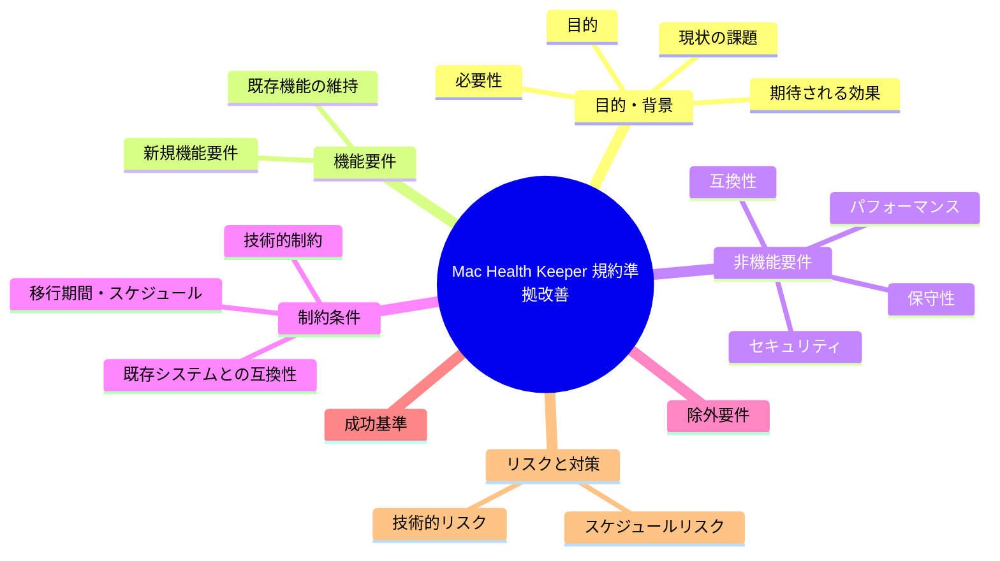
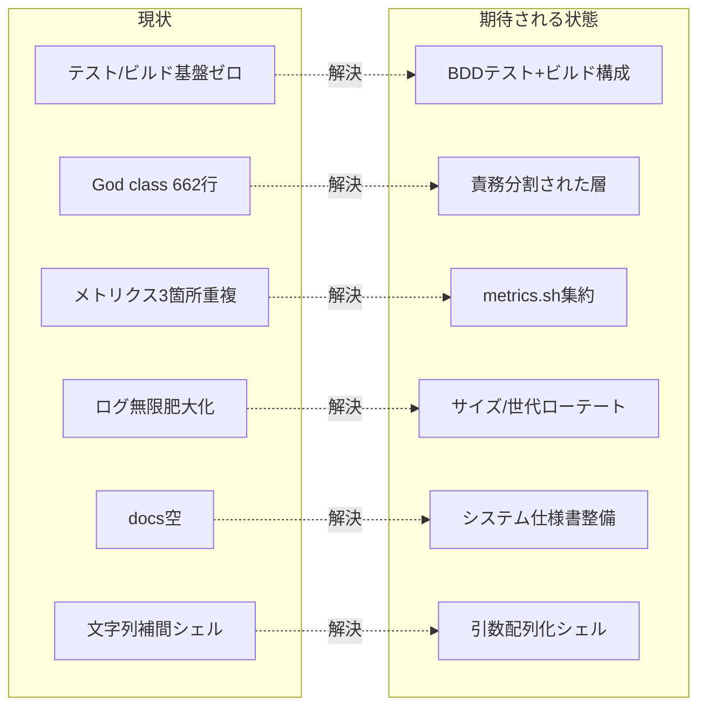

# 要求定義書: Mac Health Keeper 規約準拠改善

**プロジェクト名**: Mac Health Keeper 規約準拠改善
**作成日**: 2026 年 05 月 27 日
**最終更新**: 2026 年 05 月 27 日

> **重要**:
>
> - 要求定義書は、プロジェクトの全体像を把握するためのものです。詳細な技術仕様や実装方法は要件定義書以降で記載します。必要最低限の情報に収めることを心掛けてください。
> - **このドキュメントは常に更新**: 要求の変更や追加があった場合は、即座にこのドキュメントを更新してください。ドキュメントは「生きているドキュメント」として扱い、実装内容と常に同期させます。
> - **必須項目**: 以下の「必須」と明記した項目は空欄・抽象語のみで提出しないこと。判定可能な形で記入すること。
>
> **用語**: [.agents/CONCEPTS.md §用語規約](../../.agents/CONCEPTS.md#用語規約) を参照。

---

## 要求定義の全体像

**注意**:

- マインドマップは全体像を把握するためのものです。主要なセクション名程度に留め、詳細は記載しないでください。

---

## 1. 目的・背景

### 1.1 目的（必須）

`.agents` 設計規約に Mac Health Keeper の実装と運用基盤を準拠させ品質を底上げする。

### 1.2 背景

- **現状の課題**:
  - テストコードが 0 件・ビルド構成も無く、純粋ロジックが無保護でリグレッションを検知できない（サブ A）。
  - `src/MacHealth.swift` が 662 行・単一 `AppDelegate` に全責務集中し、spec/01・02 の境界/CQRS 原則に違反（サブ B）。
  - メトリクス取得パイプラインが Swift・CLI・監視スクリプトの 3 箇所に重複し DRY に反する（サブ C）。
  - `rotate_logs` が `-mtime +14` のみで追記ログが無限肥大化し、`.out`/`.err` も対象外、並行追記にロックが無い（サブ D）。
  - `docs/` が空でシステム仕様書・ワークフロー成果物が未整備（サブ E）。
  - Swift がシェルコマンドを文字列補間で構築しインジェクション耐性が弱い（サブ F）。

- **必要性**:
  - 変更時の安全性（テスト・ビルド足場）が無いと改善自体がリスクになる。
  - 規約逸脱を放置するとフレームワーク導入効果（AI フレンドリー設計・保守性）が得られない。

### 1.3 期待される効果（必須: 1 件以上）

- **効果 1**: 純粋ロジックの単体テストとビルド/テスト実行手順が存在し、`swift test` 等が実行可能になる（○/× 判定可）。
- **効果 2**: `src/MacHealth.swift` が UI/Domain/Infra の責務へ分割され、最大ファイル/メソッド行数が縮小する（○/× 判定可）。
- **効果 3**: メトリクス取得が単一の `scripts/lib/metrics.sh` に集約され重複が解消する（○/× 判定可）。
- **効果 4**: ログがサイズ/世代でローテートされ無限肥大化しなくなる（○/× 判定可）。
- **効果 5**: `docs/` にシステム仕様書が存在する（○/× 判定可）。
- **効果 6**: シェル実行が引数配列化/エスケープ徹底され注入耐性を持つ（○/× 判定可）。

**現状と期待される状態の比較**:

---

## 2. 機能要件

### 2.1 既存機能の維持（該当する場合）

- メニューバー UI でのメトリクス表示・ジョブ ON/OFF。
- launchd ジョブ（monitor/docker/uptime/refresh）の監視・通知。
- これらの**外形的な振る舞いは変えない**（リファクタは振る舞い不変）。

### 2.2 新規機能要件

- 各サブ issue が定義する規約準拠の改善（テスト基盤・責務分割・重複解消・ログ是正・ドキュメント整備・シェル堅牢化）。詳細は [90_issues.md](./90_issues.md) と各サブ issue の 00/01 を参照。

---

## 3. 非機能要件

### 3.1 パフォーマンス

- リファクタ・集約後もメトリクス取得・メニュー再描画の体感速度を悪化させない。

### 3.2 セキュリティ

- シェル実行の注入耐性を高める（サブ F）。外部入力・補間値が任意コマンド実行に至らないこと。

### 3.3 互換性

- ログ出力先（`~/Library/Logs/MacHealth`）・launchd ラベル・通知文言など外部 I/F は維持する。

### 3.4 保守性

- spec/01・02・03（命名規則）・06（優先順位）に準拠し、AI フレンドリー設計（小さなファイル・明確な責務）を満たす。

---

## 4. 制約条件

### 4.1 技術的制約

- 言語: Swift（macOS / Cocoa）+ Bash。テストは XCTest と bats（シェル）を想定。
- ビルドは Swift Package Manager 等で再現可能にする。

### 4.2 既存システムとの互換性

- launchd plist テンプレート・CLI（`mac-health`）の外部仕様を破壊しない。

### 4.3 移行期間・スケジュール

- サブ issue 単位で段階的に対応する。各サブは独立して着手可能とする。

---

## 5. 除外要件

- 新規メトリクス種別の追加、UI デザイン刷新、対応 macOS バージョンの拡大は本プロジェクトの対象外。

---

## 6. 成功基準（必須: 1 件以上）

- 各サブ issue（A〜F）の受け入れ基準がすべて○になる。
- リファクタ系サブ（B/C/F）で外形的振る舞いが不変であること（既存挙動の確認が通る）。
- テスト基盤サブ（A）導入後、純粋ロジックの単体テストが実行・通過する。
- ログローテート（D）後、追記ログがサイズ/世代上限を超えて増え続けないことが確認できる。
- `docs/` にシステム仕様書（アーキテクチャ・ディレクトリ構成）が存在する（E）。

---

## 7. リスクと対策

### 7.1 技術的リスク

- **リスク**: テスト不在のまま責務分割すると挙動が変わる恐れ。
  - **対策**: サブ A（テスト基盤）を先行させ、リファクタ前に純粋ロジックを保護する。
- **リスク**: メトリクス集約で Swift と シェルの出力が微妙に異なり表示が変わる。
  - **対策**: 集約前後で同一入力に対する出力を比較する受け入れ基準を設ける。

### 7.2 スケジュールリスク

- **リスク**: 6 サブを同時進行すると競合・手戻りが発生する。
  - **対策**: 推奨依存順（まず A、続いて B/C/F、D は A 後に比較的独立して着手可、E は他サブの進行に合わせ随時更新）を [90_issues.md](./90_issues.md) §推奨依存順 と整合させて明示し、サブ単位で完結させる。

---

## 8. 参考資料

### プロジェクトドキュメント

- 各サブ issue: [90_issues.md](./90_issues.md)
- 設計規約: `.agents/spec/01_設計原則.md`, `02_ディレクトリ構造方針.md`, `03_命名規則.md`, `06_設計判断の優先順位.md`
- テスト形式: `.agents/TEST_BDD_FORMAT.md`

### その他の参考資料

- `src/MacHealth.swift`, `scripts/bin/monitor.sh`, `scripts/lib/log.sh`

---

## 9. 次のステップ

この要求定義書の承認後、以下のドキュメントを作成します：

- **次**: [`90_issues.md`](./90_issues.md) - サブ issue 一覧、および各サブ issue の `00_要求定義.md` / `01_要件定義.md`
