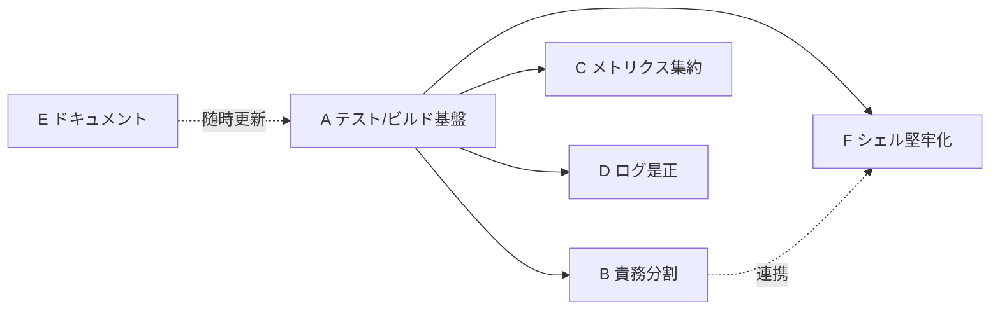

# 90_issues — サブ issue 一覧（Mac Health Keeper 規約準拠改善）

**親ワークフロー**: [00_要求定義.md](./00_要求定義.md)
**親 issue_id**: `9EE981E8-6E69-44C9-9844-5EF7ED807610`
**作成日**: 2026 年 05 月 27 日

`.agents` 規約への準拠改善を、テーマ別に 6 件のサブ issue へ分割する。各サブは独立着手可能だが、安全な進行のための推奨依存順を併記する。

---

## サブ issue 一覧

| ID | サブ issue | ディレクトリ | issue_id | 成果物 |
|----|-----------|-------------|----------|--------|
| A | テスト・ビルド基盤の確立 | `90_issues/20260527_225518_A_テストビルド基盤確立/` | `BA47DA66-5194-4976-985A-340D2C183A92` | 00_要求定義.md, 01_要件定義.md |
| B | Swift アプリの責務分割（God class 解消） | `90_issues/20260527_225641_B_Swiftアプリ責務分割/` | `7F4775AB-0BF1-4DA4-9627-BDEBA0F3EC23` | 00_要求定義.md, 01_要件定義.md |
| C | メトリクス取得ロジックの重複解消 | `90_issues/20260527_225756_C_メトリクス重複解消/` | `59F31A10-8DE7-41A5-8F94-32FA15C14A3B` | 00_要求定義.md, 01_要件定義.md |
| D | ログローテーションの是正 | `90_issues/20260527_225910_D_ログローテーション是正/` | `A60E27F9-07A6-47B9-B401-5C788EFA6ADA` | 00_要求定義.md, 01_要件定義.md |
| E | システムドキュメント整備 | `90_issues/20260527_230034_E_システムドキュメント整備/` | `45589C5B-60C7-4871-BA6C-79955E7D4BEB` | 00_要求定義.md, 01_要件定義.md |
| F | シェル実行の堅牢化 | `90_issues/20260527_230140_F_シェル実行の堅牢化/` | `6B58F4E9-912E-4B3D-9A42-A1E80BD7FAC4` | 00_要求定義.md, 01_要件定義.md |

---

## 概要

- **A**: テスト 0 件・ビルド構成なしを解消。純粋ロジック（`nextDailyRun`/`relativeTimeShort`/`relativeNext`、`should_notify`/閾値判定）を BDD テストで保護し、Swift(XCTest)/シェル(bats) の実行足場を整える。
- **B**: 662 行の God class `AppDelegate` を `MetricsCollector`(Domain)/`ShellRunner`(Infra)/`MenuBuilder`(UI) 等へ分割し、`rebuildMenu` を分解、`toggleJob` の command/query を分離（CQRS）。
- **C**: swap/compressed/load/pressure/uptime のメトリクス取得が 3 箇所（`gatherMetrics`/`mac-health`/`monitor.sh`）に重複。`scripts/lib/metrics.sh` へ集約し DRY を満たす。
- **D**: `rotate_logs` の `-mtime +14` のみでは追記ログが無限肥大化。サイズ/世代ローテート化、`.out`/`.err` 対象化、全ジョブ共通の終了処理から確実に呼ぶ、cooldown/events の排他制御、失敗の可視化。
- **E**: 空の `docs/` にアーキテクチャ・ディレクトリ構成のシステム仕様書を整備（`.agents/DOCS_RULES.md` 準拠）。
- **F**: Swift の文字列補間によるシェル構築（`shell()`/`notify()` ほか）を引数配列化・エスケープ徹底し注入耐性を高める。

---

## 推奨依存順

- まず **A** で振る舞いを固定するテスト基盤を確立する。
- その後 **B / C / F**（リファクタ系）を進める。B の `ShellRunner` I/F と F は連携する。
- **D** は比較的独立。**E** は他サブの進行に合わせて随時更新する。

---

## 参照

- 親要求: [00_要求定義.md](./00_要求定義.md)
- 設計規約: `.agents/spec/`、テスト形式: `.agents/TEST_BDD_FORMAT.md`
