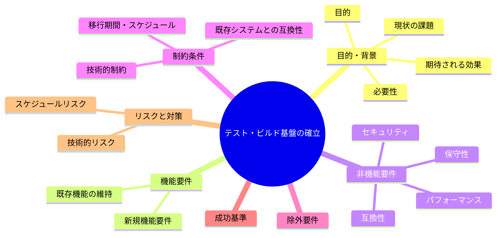
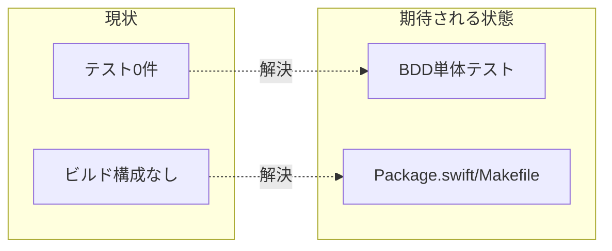

# 要求定義書: サブ A テスト・ビルド基盤の確立

**プロジェクト名**: サブ A テスト・ビルド基盤の確立
**作成日**: 2026 年 05 月 27 日
**最終更新**: 2026 年 05 月 27 日

> **重要**:
>
> - 要求定義書は、プロジェクトの全体像を把握するためのものです。詳細は要件定義書以降で記載します。
> - **このドキュメントは常に更新**: 変更があれば即座に更新します。
> - **必須項目**: 「必須」は判定可能な形で記入すること。
>
> **用語**: [.agents/CONCEPTS.md §用語規約](../../../../.agents/CONCEPTS.md#用語規約) を参照。

---

## 要求定義の全体像

---

## 1. 目的・背景

### 1.1 目的（必須）

純粋ロジックを BDD テストで保護しビルド/テスト実行の足場を整える。

### 1.2 背景

- **現状の課題**:
  - T1: テストコードが 0 件。カバレッジ 0%。テスト可能な純粋ロジックが無保護。
    - 対象: `src/MacHealth.swift` の `nextDailyRun(hour:minute:)`(L186)、`relativeTimeShort(_:)`(L203)、`relativeNext(_:intervalSec:)`(L213)。`scripts/bin/monitor.sh` の `should_notify`(L20-37) と閾値判定(L73-104)。
  - T2: ビルド構成なし。`Package.swift`/Xcode プロジェクト/Makefile が無く、ソース冒頭の `swiftc MacHealth.swift` コメント（L4）のみ。CI/テストの足場が無い。

- **必要性**:
  - 後続のリファクタ系サブ（B/C/F）を安全に行うため、振る舞いを固定するテストが先行して必要。

### 1.3 期待される効果（必須: 1 件以上）

- **効果 1**: `nextDailyRun`/`relativeTimeShort`/`relativeNext` の XCTest が存在し通過する（○/× 判定可）。
- **効果 2**: `should_notify`/閾値判定の bats テストが存在し通過する（○/× 判定可）。
- **効果 3**: 単一コマンド（`swift test` 等）でテストが実行できる（○/× 判定可）。

**現状と期待される状態の比較**:

---

## 2. 機能要件

### 2.1 既存機能の維持（該当する場合）

- 既存ロジックの挙動は変えない。テスト追加は振る舞いを観測するのみ。

### 2.2 新規機能要件

- Swift 純粋ロジックの XCTest（`.agents/TEST_BDD_FORMAT.md` 準拠）。
- シェル純粋ロジックの bats テスト。
- ビルド/テスト構成（Swift Package Manager 等 + シェルテストの実行手段）。

---

## 3. 非機能要件

### 3.1 パフォーマンス

- テスト実行は数十秒程度で完了する。

### 3.2 セキュリティ

- テストは実マシンの破壊的操作（通知連打・ファイル削除）を行わない。

### 3.3 互換性

- 既存ソースのディレクトリ・公開 I/F を破壊しない範囲で構成を追加する。

### 3.4 保守性

- テストはユースケース→シナリオ→Given/When/Then を明示し意図を読み取れる形にする。

---

## 4. 制約条件

### 4.1 技術的制約

- Swift テストは XCTest、シェルテストは bats を採用。
- 純粋ロジックは外部コマンド（`launchctl`/`vm_stat` 等）に依存しない関数に限定して切り出す（必要なら最小限の抽出）。

### 4.2 既存システムとの互換性

- launchd ラベル・ログ出力先・CLI 仕様を変えない。

### 4.3 移行期間・スケジュール

- 本サブを最優先で着手し、B/C/F の前提にする。

---

## 5. 除外要件

- UI（メニュー構築）の自動 E2E テスト、launchd 連携の統合テストは対象外。

---

## 6. 成功基準（必須: 1 件以上）

- Swift 純粋ロジック 3 関数の単体テストが追加され通過する。
- `should_notify` と 4 種閾値判定の bats テストが追加され通過する。
- ドキュメント化された単一手順でテストが実行できる。
- テストは `.agents/TEST_BDD_FORMAT.md` 形式（ユースケース/シナリオ/GWT）に従う。

---

## 7. リスクと対策

### 7.1 技術的リスク

- **リスク**: 純粋ロジックが `AppDelegate` 内に埋もれテスト切り出しが難しい。
  - **対策**: サブ B と連携し、最小限の純粋関数抽出に留めるか、テスト用 target に同梱する。

### 7.2 スケジュールリスク

- **リスク**: bats 等のツール導入が環境依存で詰まる。
  - **対策**: 導入手順をドキュメント化し、無い場合の代替（shell 自前 assert）を許容する。

---

## 8. 参考資料

### プロジェクトドキュメント

- 親要求: [../../00_要求定義.md](../../00_要求定義.md)
- テスト形式: `.agents/TEST_BDD_FORMAT.md`

### その他の参考資料

- `src/MacHealth.swift`（L186, L203, L213）、`scripts/bin/monitor.sh`（L20-37, L73-104）

---

## 9. 次のステップ

- **次**: [`01_要件定義.md`](./01_要件定義.md) - 要件定義フェーズ
