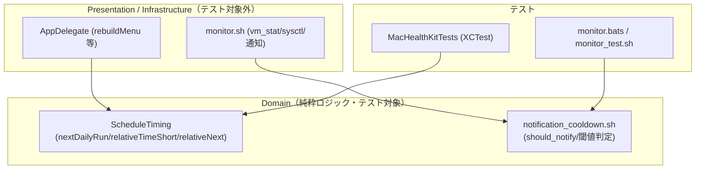
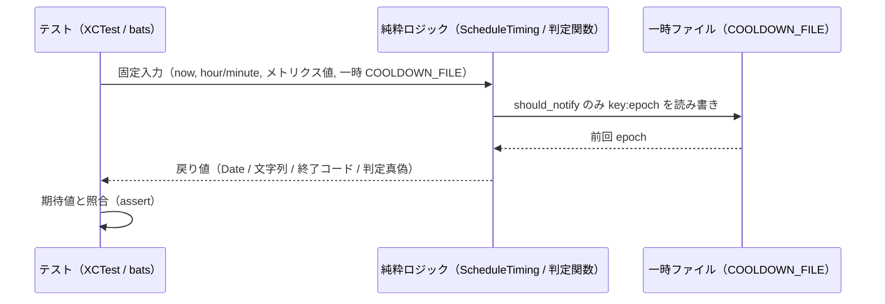
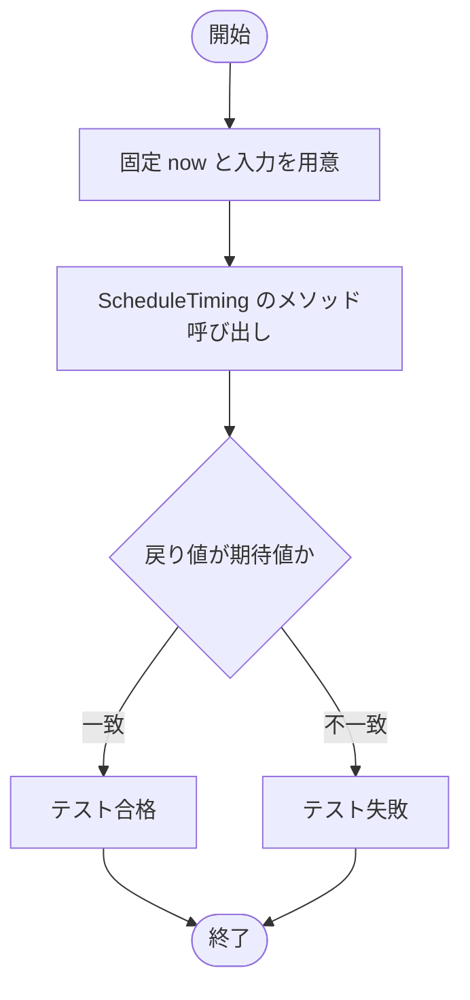
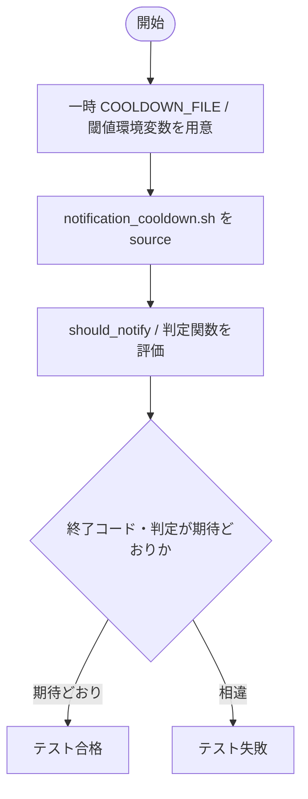
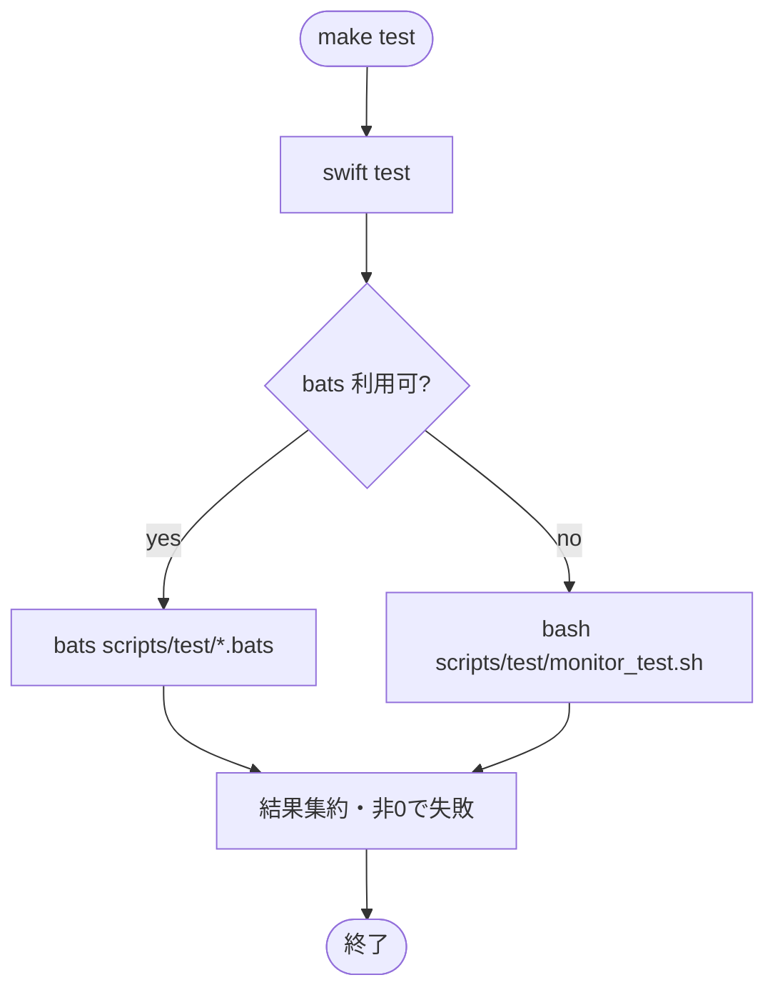

# 設計書: サブ A テスト・ビルド基盤の確立

**プロジェクト名**: サブ A テスト・ビルド基盤の確立
**作成日**: 2026 年 05 月 27 日
**最終更新**: 2026 年 05 月 27 日

> **重要**: **このドキュメントは常に更新**: 設計の変更や追加があった場合は、即座にこのドキュメントを更新してください。ドキュメントは「生きているドキュメント」として扱い、実装内容と常に同期させます。
>
> **用語**: [.agents/CONCEPTS.md §用語規約](../../../../.agents/CONCEPTS.md#用語規約) を参照。

---

## 1. 設計概要

**必須**: 設計方針・原則は [.agents/spec/01_設計原則.md](../../../../.agents/spec/01_設計原則.md) を**先に参照**した上で、本プロジェクトに**適用するものを選び**記載した。

### 1.1 設計方針

既存の振る舞いを変えずに、AppKit/外部コマンドに依存しない純粋ロジックだけを**テスト可能な最小単位**に切り出し、SwiftPM の library/test target と bats（不在時は自前 assert）でテストする。本サブ A は「テスト可能化に必要な最小限の抽出」に留め、God class の本格的な責務分割は**サブ B の責務**とする（spec/06 の可読性 > 単一責務 > 仕様整合 の優先順位に従う）。

### 1.2 設計原則（本プロジェクトで適用するもの）

- **UNIX哲学**: テストを「純粋ロジック」「ビルド構成」「実行手順」の小さな部品に分け、`swift test` と bats を組み合わせ可能にする。
- **単一責務**: 抽出する純粋ロジックは「時刻計算/相対表示」を担う 1 つの値型に集約し、通知・メニュー・I/O は持たせない。
- **明確な境界**: 「純粋ロジック（テスト対象）」と「AppKit UI / 外部コマンド呼び出し（テスト対象外）」の境界を本サブ A で明示する。Domain=純粋ロジック、Infrastructure/Presentation=AppKit・launchd 連携。
- **AIフレンドリー設計**: 小さなファイル（純粋ロジック型 1 ファイル）・意図が分かる命名（禁止命名 helpers/misc/common/utils を避ける）・浅いディレクトリ（SwiftPM 標準 `Sources/`/`Tests/`）。

> CQRS・イベント駆動は本サブの対象外（テスト追加が目的で状態変更フローを新設しないため不採用）。

---

## 2. アーキテクチャ設計

### 2.1 責務・境界・参照関係

#### 2.1.1 責務一覧

| コンポーネント | 責務（1 文） |
| -------------- | ------------ |
| `ScheduleTiming`（新規・Swift 純粋ロジック型） | 現在時刻・入力 Date から翌日実行時刻・相対時刻文字列を計算する純粋ロジックを提供する。 |
| `AppDelegate`（既存・src/MacHealth.swift） | メニュー UI・タイマー・外部コマンド連携を担い、`ScheduleTiming` を呼び出して表示する（テスト対象外）。 |
| `notification_cooldown.sh`（新規・source 用シェル関数群） | `should_notify` と閾値判定をファイル/環境変数入力のみで評価する関数を提供し、テストから source される。 |
| `monitor.sh`（既存・scripts/bin） | メトリクス取得（vm_stat 等）と通知発火を担い、判定関数を source して使う（取得部はテスト対象外）。 |
| `MacHealthKit`（新規・SwiftPM library target） | `ScheduleTiming` を含む純粋ロジックの公開単位。AppKit に依存しない。 |
| `MacHealthKitTests`（新規・XCTest target） | `ScheduleTiming` の単体テスト（UC1・UC2）を持つ。 |
| `monitor.bats` / `monitor_test.sh`（新規・シェルテスト） | `should_notify`・閾値判定の単体テスト（UC3・UC4）を持つ。bats 優先・不在時は自前 assert。 |
| `Makefile`（新規・実行集約） | `swift test` とシェルテストを 1 コマンドで実行する。 |

#### 2.1.2 境界

- **入力**: テスト対象に与える固定入力（`hour`/`minute`、固定 `Date`/オフセット秒、一時 COOLDOWN_FILE、メトリクス値・閾値環境変数）。
- **出力**: テスト対象の戻り値（`Date`・相対文字列・`should_notify` の終了コード・判定分岐の真偽）と、その検証結果（テスト合否）。
- **他責務との境界（本サブ A の範囲外）**:
  - **サブ B（責務分割）**: God class の本格的な分割・依存注入の整備・`AppDelegate` からのロジック全面移譲は B の責務。A は「テストできる純粋関数を 1 か所に切り出す最小抽出」までに留める。
  - **テスト対象外**: メニュー構築 UI（`rebuildMenu` 等）の E2E、launchd 連携・実通知・`vm_stat`/`sysctl`/`memory_pressure` 等の外部コマンド実行を伴う統合テスト（01 §5、00 §5 の除外要件）。

#### 2.1.3 参照関係

- `AppDelegate` → `ScheduleTiming`（UI が純粋ロジックを呼ぶ。逆向き参照なし）
- `MacHealthKitTests` → `MacHealthKit`（テストが library を import する）
- `MacHealthKit` は AppKit/Cocoa を参照しない（依存の向きを Domain 側に閉じる）
- `monitor.sh` → `notification_cooldown.sh`（取得・通知部が判定関数を source する。逆向き参照なし）
- `monitor.bats` / `monitor_test.sh` → `notification_cooldown.sh`（テストが判定関数を source する）
- 循環参照は持たない。

**抽出方針（純粋ロジックの A/B 境界・検討観点1）**:

| 対象関数（src/MacHealth.swift） | A での扱い | 抽出先 |
| ------------------------------- | ---------- | ------ |
| `nextDailyRun(hour:minute:)` L186 | 純粋化して抽出（`Date()` 直読みを `now` 引数化） | `ScheduleTiming` |
| `relativeTimeShort(_:)` L203 | 純粋化して抽出（`Date()` 直読みを `now` 引数化） | `ScheduleTiming` |
| `relativeNext(_:intervalSec:)` L213 | 純粋化して抽出（`Date()` 直読みを `now` 引数化） | `ScheduleTiming` |

- 3 関数は現状 `AppDelegate` のメソッドだが、内部で `Date()` を直接読むためテストで時刻を固定できない。**最小抽出**として、現在時刻を引数 `now: Date` で受け取る純粋メソッドを `ScheduleTiming` に新設し、`AppDelegate` 側は `ScheduleTiming` を呼ぶ薄いラッパに置き換える（B での全面移譲の足場）。シグネチャ互換は 00 §4.1（既存シグネチャ非変更）の趣旨を満たすため、`AppDelegate` 側の呼び出し名・引数は維持し、内部委譲のみ行う。

### 2.2 システムアーキテクチャ

**必須**: 設計判断は [.agents/spec/](../../../../.agents/spec/)（00_spec概要・01_設計原則・06_設計判断の優先順位）を先に参照した。

- **採用パターン**: レイヤード（Domain=純粋ロジック / Presentation=AppKit UI / Infrastructure=外部コマンド・launchd）の最小適用。
- **根拠**: spec/06 の「可読性 > 単一責務」に従い、テスト容易な Domain を UI・I/O から分離する。再利用や抽象化より「テストできる純粋関数を明確な境界で切る」ことを優先する。

#### 2.2.1 CQRS（Command/Query 分離）

本サブでは状態変更フローを新設しないため CQRS は不採用。ただし観測として、`ScheduleTiming` の 3 メソッドは Query（副作用なし）であり、`should_notify` は記録更新を伴う Command 性を持つ。テストでは Query は戻り値検証、`should_notify`（Command）は一時 COOLDOWN_FILE への副作用も検証対象とする。

#### 2.2.2 アーキテクチャ図

### 2.3 コンポーネント構成

- **Domain（テスト対象）**: `Sources/MacHealthKit/ScheduleTiming.swift`（AppKit 非依存の値型）と `scripts/bin/notification_cooldown.sh`（純粋判定関数群）。各々単一責務（時刻計算/通知判定）。
- **Presentation/Infrastructure（テスト対象外）**: `src/MacHealth.swift` の `AppDelegate`、`scripts/bin/monitor.sh` の取得・通知部。外部コマンド・AppKit・launchd への依存はこの層に閉じる。
- **テスト**: `Tests/MacHealthKitTests/`（XCTest）と `scripts/test/`（bats または自前 assert）。
- **実行集約**: ルートの `Makefile`（`make test`）が両者を呼ぶ。

> SwiftPM 構成（テスト専用）と install.sh の配布ビルドを**並存**させる。配布ビルドは `swiftc` を複数ファイルビルド（`MacHealth.swift` + `ScheduleTiming.swift`）に最小修正した（§4.2 移行方針。実装フェーズで確定）。

### 2.4 データフロー

イベント発行は行わない（単純同期処理で十分なため spec/06 の原則どおりイベント駆動を導入しない）。テスト時のデータフローは「固定入力 → 純粋ロジック → 戻り値検証」。

---

## 3. 機能設計

### 3.1 機能 1: Swift 純粋ロジックの抽出とテスト（UC1・UC2）

#### 3.1.1 概要

`nextDailyRun`/`relativeTimeShort`/`relativeNext` を `now` 引数を持つ純粋メソッドとして `ScheduleTiming` に切り出し、XCTest で固定時刻に対する出力を検証する。

#### 3.1.2 処理フロー

#### 3.1.3 入力・出力

- **入力**: `now: Date`（固定）、`hour:Int`/`minute:Int`、対象 `Date`、`intervalSec:Int?`。
- **出力**: 翌日/当日実行時刻の `Date`、相対表現 `String`。

#### 3.1.4 エラーハンドリング

純粋ロジックは throw しない。`Calendar.date(from:)` が nil の場合は既存実装どおり `now` フォールバック（挙動維持）。テストは UTC 等の固定 `Calendar`/`TimeZone` を注入し、CI/ローカルのタイムゾーン差で揺れない設計にする。

### 3.2 機能 2: シェル純粋ロジックの抽出とテスト（UC3・UC4）

#### 3.2.1 概要

`should_notify` と閾値判定（swap/compressed/load/pressure）を、メトリクス取得（`vm_stat` 等）から分離した source 可能な関数として `notification_cooldown.sh` に切り出し、bats（不在時は自前 assert）で検証する。

#### 3.2.2 処理フロー

#### 3.2.3 入力・出力

- **入力**: `COOLDOWN_FILE` パス（一時）、`NOTIFICATION_COOLDOWN_MIN`、メトリクス値（`swap_used_mb` 等）、閾値（`THRESHOLD_*`）、`free_pct`、`ncpu`。
- **出力**: `should_notify` の終了コード（0=通知/1=非通知）、閾値判定関数の終了コード（真偽）、`mem_pressure` 文字列、更新後の COOLDOWN_FILE 内容（`key:epoch`）。

#### 3.2.4 エラーハンドリング

COOLDOWN_FILE 不在時は `last=0` 扱い（既存挙動維持）。テストは一時ディレクトリを使い、実 `$LOG_DIR/.monitor-cooldown` を変更しない。`key:epoch` 形式は維持（01 §4.2）。

### 3.3 機能 3: 単一手順でのテスト実行（成功基準 3）

#### 3.3.1 概要

`make test` 1 コマンドで `swift test` とシェルテストを順に実行する。bats があれば `bats`、無ければ自前 assert ランナーを呼ぶフォールバックを Makefile に組み込む。

#### 3.3.2 処理フロー

#### 3.3.3 入力・出力

- **入力**: なし（リポジトリルートで `make test`）。
- **出力**: テスト結果サマリと終了コード（全合格 0 / 1 件でも失敗なら非 0）。

#### 3.3.4 エラーハンドリング

いずれかのテストが失敗したら全体を非 0 終了。bats/swiftc 不在はメッセージを出して該当部のみスキップ可能とするが、CI 既定では存在前提（README に導入手順を記載）。

---

## 4. データ設計

### 4.1 データモデル

新規テーブル・DB は導入しない（テスト基盤の追加のみ）。永続データとして扱う唯一のファイルは COOLDOWN_FILE で、テスト中は一時ディレクトリ上の複製を使う。

#### COOLDOWN_FILE データ形式

| 項目 | 形式 | 説明 |
| ---- | ---- | ---- |
| 1 行 | `key:epoch` | key=通知種別（swap/compressed/load/pressure）、epoch=最終通知 UNIX 時刻 |

例: `swap:1716800000`。複数 key は複数行。`should_notify` は当該 key 行を読み、cooldown 経過時に `key:now` で上書きする。**この形式は維持する（01 §4.2）。**

### 4.2 既存ビルドとの並存・移行方針（検討観点2）

| 観点 | 方針 |
| ---- | ---- |
| 既存ビルド | **【実装フェーズで確定・更新】** `AppDelegate` が別ファイルの `ScheduleTiming` を参照するため、`swiftc MacHealth.swift` 単一ファイルビルドは原理的に不可（型が scope に無い）。install.sh のビルド行を**ソース 1 本追加の最小修正**で `swiftc MacHealth.swift "$REPO_DIR/Sources/MacHealthKit/ScheduleTiming.swift" -o MacHealth`（複数ファイルビルド）にした。出力名・app bundle 化手順・Info.plist 配置・LaunchAgent は不変。トップレベルコードは複数ファイルビルドで使えないため、起動処理を `@main struct MacHealthMain`（挙動同等）に置換。 |
| install.sh | app bundle 化（`$INSTALL_DIR/src` での swiftc・Info.plist 配置、L76-91）の手順自体は**変更しない**（ビルド行へソース 1 本追加のみ）。配布物に SwiftPM 生成物（`.build/`・`Package.swift`）は含めない。`ScheduleTiming.swift` は `$REPO_DIR/Sources/` を参照（`$INSTALL_DIR` へはコピーしない）。 |
| SwiftPM 構成 | リポジトリルートに `Package.swift` を追加し、`Sources/MacHealthKit/`（純粋ロジック library）と `Tests/MacHealthKitTests/`（XCTest）を置く。SwiftPM はテスト専用とし、配布ビルドには使わない（配布は install.sh の swiftc）。 |
| 純粋ロジックの重複回避 | `ScheduleTiming` を `Sources/MacHealthKit/ScheduleTiming.swift` に 1 本だけ置き、`src/MacHealth.swift` の `AppDelegate` の 3 メソッドは `ScheduleTiming` への薄い委譲ラッパに最小修正。重複コードは持たない（テストも配布も同一実体を参照）。将来 B で `MacHealthKit` へ全面集約。 |
| 将来統合 | サブ B で `AppDelegate` の責務分割時に `MacHealthKit` へロジックを集約し、配布ビルドも SwiftPM へ移行するかを再評価（A の範囲外）。 |
| .gitignore | `.build/` を無視対象に追加する想定（実装フェーズ）。 |

> **互換性（00 §3.3/§4.2）**: launchd ラベル・ログ出力先・CLI 仕様・既存ディレクトリ/公開 I/F を破壊しない範囲でのみ構成を追加する。

---

## 5. API 設計

### 5.1 API 一覧

| インターフェース | 種別 | 説明 |
| ---------------- | ---- | ---- |
| `ScheduleTiming.nextDailyRun(hour:minute:now:calendar:)` | Swift Query | 指定時刻が now 以前なら翌日、後なら当日の Date を返す |
| `ScheduleTiming.relativeTimeShort(_:now:)` | Swift Query | 経過時間を「今/N分前/N時間前/N日前/未来」に整形 |
| `ScheduleTiming.relativeNext(_:intervalSec:now:calendar:)` | Swift Query | 次回までの残りを「まもなく/あとN分/今日 HH:mm/明日 HH:mm/M/d HH:mm/N分以内」に整形 |
| `should_notify <key>`（notification_cooldown.sh） | Shell Command | COOLDOWN_FILE を見てクールダウン未経過なら 1、経過なら 0 を返し記録更新 |
| `exceeds_threshold <value> <threshold>` 等の判定関数 | Shell Query | メトリクス値が閾値以上か（整数比較）を終了コードで返す |
| `classify_pressure <free_pct>`（notification_cooldown.sh） | Shell Query | free_pct から critical/warn/normal を出力 |

### 5.2 API 詳細

#### API1: ScheduleTiming.nextDailyRun

- **入力**: `hour:Int, minute:Int, now:Date, calendar:Calendar`（テストは固定 now/TZ を注入）
- **出力**: `Date`（now 以前なら翌日、後なら当日の hour:minute:00）
- **契約**: now と同分秒一致は「以前」扱い（既存 `<=` 準拠で翌日）。
- **エラー**: `Calendar.date(from:)` が nil → now を返す（既存挙動）。

#### API2: ScheduleTiming.relativeTimeShort

- **入力**: `date:Date, now:Date`
- **出力**: `String`（elapsed<0→未来、<60→今、<3600→N分前、<86400→N時間前、else N日前）
- **契約**: 境界値（60/3600/86400 秒）で表現が切り替わる。

#### API3: ScheduleTiming.relativeNext

- **入力**: `date:Date, intervalSec:Int?, now:Date, calendar:Calendar`
- **出力**: `String`（過去かつ intervalSec あり→`N分以内`、過去で nil→まもなく、<60→まもなく、当日<3600→あとN分、当日→今日 HH:mm、翌日→明日 HH:mm、それ以降→M/d HH:mm）

#### API4: should_notify（shell）

- **入力**: 位置引数 `key`、環境変数 `COOLDOWN_FILE`/`NOTIFICATION_COOLDOWN_MIN`
- **出力**: 終了コード（0=通知すべき/1=非通知）。0 のとき COOLDOWN_FILE に `key:now` を追記更新。
- **契約**: `now - last < cooldown` → 1。`>=` → 0 かつ更新。COOLDOWN_FILE 形式 `key:epoch` 維持。

#### API5: 閾値判定関数（shell）

- **入力**: メトリクス値・閾値（整数）、`free_pct`、`ncpu`、`THRESHOLD_LOAD_AVG_MULTIPLIER`
- **出力**: 終了コード（0=真/超過、1=偽/未満）。`classify_pressure` は標準出力に critical/warn/normal。
- **契約**: `>=` で真（monitor.sh L73/82/91 と同一）。load は `ncpu * THRESHOLD_LOAD_AVG_MULTIPLIER` を閾値とする。pressure は `<10`→critical、`<25`→warn、else normal（L63-65）。

> 実装詳細（関数本体・ファイル分割の具体）は 03_実装計画に委譲する。

---

## 6. テスト戦略

テスト戦略の観点定義は [RULES.md のテスト戦略必須要件](../../../../.agents/RULES.md#テスト戦略必須要件)、BDD 形式は [TEST_BDD_FORMAT.md](../../../../.agents/TEST_BDD_FORMAT.md) を参照。本ドキュメントでは対象ごとの割当のみ記載する。

### 6.1 対象ごとのテスト割り当て

| 対象 | 単体 | 結合/API | E2E | クリティカル観点 | バリデーション観点 | 未達理由/補足 |
| ---- | ---- | -------- | --- | ---------------- | ------------------ | ------------- |
| `ScheduleTiming.nextDailyRun`（UC1） | ○ | × | × | 当日/翌日の境界（now との前後） | hour/minute 範囲は既存仕様維持・追加検証なし | 結合/E2E は UI 表示で B/対象外 |
| `ScheduleTiming.relativeTimeShort`（UC2-S1） | ○ | × | × | 分・時・日の境界（60/3600/86400） | 未来（負経過）は別観点 | 同上 |
| `ScheduleTiming.relativeNext`（UC2-S2） | ○ | × | × | interval 指定時の残り表現 | nil/非nil 分岐 | 同上 |
| `should_notify`（UC3） | ○ | × | × | cooldown 未経過/経過の分岐と記録更新 | COOLDOWN_FILE 形式 `key:epoch` 維持 | 実通知は発火させない（notify をスタブ/呼ばない） |
| 閾値判定 swap/compressed/load（UC4-S1..S4） | ○ | × | × | `>=` 境界での真偽 | 整数比較・load=ncpu×倍率 | vm_stat 等の取得部は対象外 |
| pressure 判定（UC4-S5/S6） | ○ | × | × | `<10`=critical / `>=25`=normal | free_pct 境界 | 同上 |
| AppKit UI（rebuildMenu 等）・launchd 連携 | × | × | × | — | — | 01 §5 で対象外（除外要件） |

### 6.2 監査・レビューでの確認（証跡）

§6.1 の割当表と 03_実装計画のタスク別テスト観点・BDD（UC1〜UC4 全 12 シナリオ）が 1 対 1 で揃っていることを確認する。確認観点は RULES §テスト戦略必須要件・PHASES 監査観点に従う。

---

## 7. UI 設計

本サブ A は UI を追加・変更しない（テスト・ビルド基盤の追加のみ）。既存メニューバー UI（`rebuildMenu`）は対象外。該当なし。

---

## 8. セキュリティ設計

### 8.1 認証・認可

該当なし（ローカル開発のテスト基盤）。

### 8.2 データ保護

テストは破壊的副作用を起こさない。実通知（`osascript`/`notify`）・実ファイル削除・ネットワークアクセス・任意コマンド実行を行わず、一時ディレクトリと固定入力のみを使う（00 §3.2、01 §2.3/§3.2）。実 `$LOG_DIR/.monitor-cooldown` を変更しない。

---

## 9. 非機能要件への対応

### 9.1 パフォーマンス

純粋ロジックのみのテストで I/O・外部コマンドを伴わないため、全テストは数十秒以内に完了する（00 §3.1、01 §3.1）。

### 9.2 可用性

bats 不在環境でも自前 assert ランナー（`scripts/test/monitor_test.sh`）でシェルテストを実行できる（01 §3.4、00 §7.2）。Swift は標準の swiftc/SwiftPM のみに依存。

---

## 10. 参考資料

### プロジェクトドキュメント

- [`01_要件定義.md`](./01_要件定義.md) - 要件定義
- [`00_要求定義.md`](./00_要求定義.md) - 要求定義

### その他の参考資料

- `src/MacHealth.swift`（L186/L203/L213）、`scripts/bin/monitor.sh`（L20-37/L73-104）、`scripts/config/thresholds.sh`、`install.sh`（L76-91）
- `.agents/TEST_BDD_FORMAT.md`、`.agents/spec/`（01/02/03/06）

---

## 11. 前のステップ

この設計書は、以下のドキュメントを基に作成されています：

- **前**: [`01_要件定義.md`](./01_要件定義.md) - 要件定義フェーズ

---

## 12. 次のステップ

この設計書の承認後、以下のドキュメントを作成します：

- **次**: [`03_実装計画.md`](./03_実装計画.md) - 実装計画フェーズ
