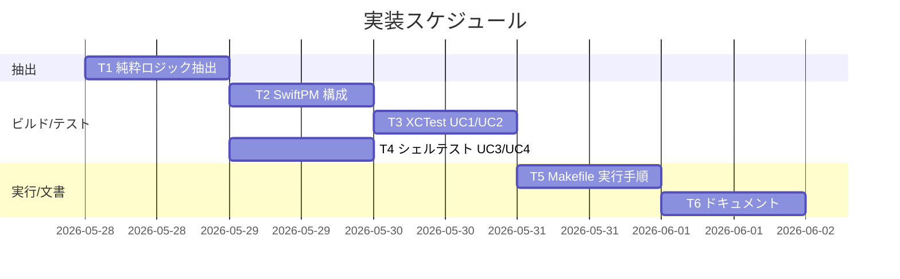
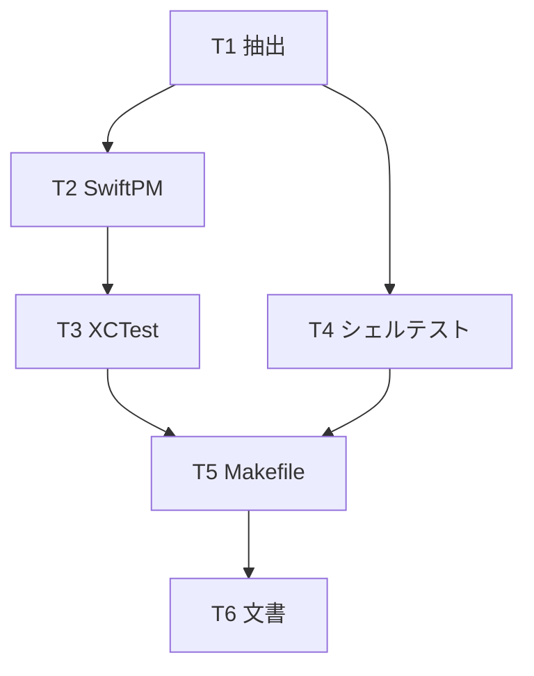

# 実装計画書: サブ A テスト・ビルド基盤の確立

**プロジェクト名**: サブ A テスト・ビルド基盤の確立
**作成日**: 2026 年 05 月 27 日
**最終更新**: 2026 年 05 月 27 日

> **重要**: **このドキュメントは常に更新**します。実装計画の変更・進捗・バグの記録があれば即座に更新します。
> **必須項目**: テスト観点・BDD 仕様は具体ケースを記載すること。
>
> **用語**: [.agents/CONCEPTS.md §用語規約](../../../../.agents/CONCEPTS.md#用語規約) を参照。

---

## 1. 実装概要

### 1.1 実装方針（必須）

既存の振る舞いを変えずに純粋ロジックを最小抽出し、SwiftPM（XCTest）と bats（不在時は自前 assert）でテストを追加する。`make test` 1 コマンドで両者を実行する。**【実装フェーズで確定】** `AppDelegate` が別ファイルの `ScheduleTiming` を参照するため単一ファイルビルドは不可となり、install.sh のビルド行を**ソース 1 本追加の最小修正**で複数ファイルビルド（`swiftc MacHealth.swift ScheduleTiming.swift -o MacHealth`）にした。app bundle 化手順・出力名・Info.plist 配置・LaunchAgent・挙動は不変（起動処理は `@main` で同等。02 §4.2 参照）。

### 1.2 実装順序（必須: 1 件以上）

T1 抽出（Swift/shell の純粋ロジック分離）→ T2 SwiftPM 構成 → T3 XCTest（UC1・UC2）→ T4 シェルテスト（UC3・UC4, bats/自前 assert）→ T5 実行手順（Makefile）→ T6 ドキュメント。



---

## 2. タスク分解

**必須**: 各タスクに「テスト観点」（2.x.3）と「単体テスト仕様（BDD）」（2.x.4）を記載する。観点定義は 02_設計 §6・RULES・TEST_BDD_FORMAT を参照。

### 2.1 タスク 1: 純粋ロジックの最小抽出

#### 2.1.1 概要（必須）

時刻計算 3 関数と通知判定/閾値判定を、テストから固定入力で呼べる純粋単位へ最小抽出する。

#### 2.1.2 実装内容（必須: 1 件以上）

- `src/MacHealth.swift` の `nextDailyRun`/`relativeTimeShort`/`relativeNext` を、現在時刻を `now: Date` 引数で受ける純粋メソッドとして `ScheduleTiming`（`Sources/MacHealthKit/ScheduleTiming.swift`）に切り出す。`AppDelegate` は内部委譲する薄いラッパに最小修正（シグネチャ名・引数は維持）。`Calendar`/`TimeZone` を注入可能にしテストの揺れを防ぐ。
- `scripts/bin/monitor.sh` の `should_notify`（L20-37）と閾値判定（L73/82/91/63-65）を、メトリクス取得から分離した source 可能関数として `scripts/bin/notification_cooldown.sh` に切り出す。`monitor.sh` は当該ファイルを source して使う。`COOLDOWN_FILE` パス・`key:epoch` 形式・launchd ラベル・ログ出力先・CLI 仕様は変更しない。
- 閾値判定は `exceeds_threshold <value> <threshold>`（整数 `>=`）と `classify_pressure <free_pct>` を新設し、load 閾値は `ncpu * THRESHOLD_LOAD_AVG_MULTIPLIER` で算出。

#### 2.1.3 テスト観点（必須）

**参照**: 02_設計 §6・RULES・TEST_BDD_FORMAT。本タスクの具体ケースは T3/T4 で検証する（抽出後の関数を直接呼ぶ）。

##### 単体（本タスクの具体ケース・必須 1 件以上）

- 抽出後の `ScheduleTiming` メソッドが、抽出前と同じ入力（now 固定）で同じ出力を返す（リグレッション）。→ T3 で検証。
- 抽出後の `should_notify`/閾値判定関数が、source 単独で（monitor.sh 本体を実行せずに）評価できる。→ T4 で検証。

##### 結合/API（該当時は必須 1 件以上）

- 該当なし（取得部・UI・launchd は対象外）。

##### E2E/受け入れ（未達時は理由記載）

- 該当なし（UI/launchd の E2E は 01 §5 で除外）。

##### バリデーション（該当する場合の具体ケース）

- COOLDOWN_FILE 形式 `key:epoch` が抽出後も維持される（T4-UC3-S2 で更新後内容を検証）。

#### 2.1.4 単体テスト仕様（BDD）（必須）

抽出自体の振る舞いは T3/T4 のシナリオで担保するため、本タスクの BDD は「抽出前後で出力不変」をリグレッション観点として T3/T4 のケースに含める。

```gherkin
Feature: 純粋ロジックの抽出
  Scenario: 抽出後も同一入力で同一出力（リグレッション）
    Given 抽出前の nextDailyRun と同じ now/hour/minute を与える
    When ScheduleTiming.nextDailyRun を呼ぶ
    Then 抽出前と同じ Date が返る
```

```swift
// Given: 抽出前と同じ now=2026-05-27 08:00(UTC) と hour=9 minute=0
// When: ScheduleTiming.nextDailyRun を呼ぶ
// Then: 抽出前実装と同じ当日 09:00 を返す（T3-UC1-S1 と同一ケースで担保）
```

#### 2.1.5 依存関係

- 先行: なし。後続: T2/T3/T4 はこの抽出に依存。



#### 2.1.6 見積もり

- **工数**: 3h / **優先度**: 高

---

### 2.2 タスク 2: SwiftPM 構成（library + test target）

#### 2.2.1 概要（必須）

純粋ロジックの library target とテスト target を最小構成で導入する。

#### 2.2.2 実装内容（必須: 1 件以上）

- ルートに `Package.swift`（library target `MacHealthKit`=`Sources/MacHealthKit/`、test target `MacHealthKitTests`=`Tests/MacHealthKitTests/`）を追加。AppKit 非依存。
- 既存 `swiftc MacHealth.swift` ビルドと install.sh の app bundle 化を変更しない。配布物に `.build/`・`Package.swift` を含めない。`.gitignore` に `.build/` を追加。

#### 2.2.3 テスト観点（必須）

##### 単体（必須 1 件以上）

- `swift build` が成功し `MacHealthKit` が生成される。
- `swift test` が XCTest target を発見・実行できる。

##### 結合/API（該当時）

- 該当なし。

##### E2E/受け入れ（未達時は理由）

- 該当なし。

##### バリデーション（該当時）

- 該当なし。

#### 2.2.4 単体テスト仕様（BDD）（必須）

```gherkin
Feature: SwiftPM ビルド構成
  Scenario: swift test がテストを発見して実行できる
    Given Package.swift と Tests/MacHealthKitTests が存在する
    When swift test を実行する
    Then テストがビルド・実行され結果が出力される
```

```swift
// Given: Package.swift に library/test target を定義
// When: `swift test` を実行（手順テストとして T5 の make test で確認）
// Then: MacHealthKitTests がコンパイル・実行される（ビルド成立がパス条件）
```

#### 2.2.5 依存関係

- 先行: T1。後続: T3。

#### 2.2.6 見積もり

- **工数**: 1.5h / **優先度**: 高

---

### 2.3 タスク 3: XCTest（UC1 翌日実行時刻・UC2 相対時刻）

#### 2.3.1 概要（必須）

`ScheduleTiming` の 3 メソッドに対し、固定 now/Calendar で UC1・UC2 のシナリオを XCTest 化する。

#### 2.3.2 実装内容（必須: 1 件以上）

- `Tests/MacHealthKitTests/ScheduleTimingTests.swift` を追加。固定 `TimeZone`/`Calendar` を注入し、UC1 S1/S2・UC2 S1/S2 を実装。
- 各テストクラスに `ユースケース:`、各メソッドに `シナリオ:` doc コメント、本文に `// Given/When/Then` インラインコメントを付与（TEST_BDD_FORMAT）。

#### 2.3.3 テスト観点（必須）

##### 単体（本タスクの具体ケース・必須 1 件以上）

- UC1-S1: now=当日 08:00、hour=9 minute=0 → 当日 09:00 の Date。
- UC1-S2: now=当日 10:00、hour=9 minute=0 → 翌日 09:00 の Date。
- UC2-S1: now から 3 分前の date → `relativeTimeShort` が「分」を含む短文（`3分前`）。
- UC2-S2: 直近実行 date と intervalSec=300 → `relativeNext` が次回残りを表す文字列（過去なら `5分以内`）。

##### 結合/API（該当時）

- 該当なし（純粋 Query）。

##### E2E/受け入れ（未達時は理由）

- 該当なし（UI 表示は対象外）。

##### バリデーション（該当時）

- 境界値: UC2-S1 で 60 秒未満は「今」、3600 秒で「時間前」へ切替（補助ケースとして任意追加可）。

#### 2.3.4 単体テスト仕様（BDD）（必須）

**UC1 翌日実行時刻の算出**

```gherkin
Feature: 翌日実行時刻の算出
  Scenario: 指定時刻が現在より後なら当日のその時刻を返す  # 01 UC1-S1
    Given 現在が当日 08:00 で hour=9 minute=0 を指定する
    When nextDailyRun(hour:9, minute:0, now:当日08:00) を呼ぶ
    Then 当日 09:00 を表す Date が返る

  Scenario: 指定時刻が現在より前なら翌日のその時刻を返す  # 01 UC1-S2
    Given 現在が当日 10:00 で hour=9 minute=0 を指定する
    When nextDailyRun(hour:9, minute:0, now:当日10:00) を呼ぶ
    Then 翌日 09:00 を表す Date が返る
```

```swift
/// ユースケース: 日次ジョブの次回実行時刻を現在時刻基準で算出する。
final class ScheduleTimingNextDailyRunTests: XCTestCase {
    private let cal = Calendar.utc          // 固定 TimeZone を注入
    private let timing = ScheduleTiming()

    /// シナリオ: 指定時刻が現在より後なら当日のその時刻を返す（01 UC1-S1）。
    func test_nextDailyRun_whenTargetIsLaterToday_returnsToday() {
        // Given: 現在が当日 08:00、hour=9 minute=0
        let now = cal.date(2026, 5, 27, 8, 0)
        // When: nextDailyRun を呼ぶ
        let next = timing.nextDailyRun(hour: 9, minute: 0, now: now, calendar: cal)
        // Then: 当日 09:00 が返る
        XCTAssertEqual(next, cal.date(2026, 5, 27, 9, 0))
    }

    /// シナリオ: 指定時刻が現在より前なら翌日のその時刻を返す（01 UC1-S2）。
    func test_nextDailyRun_whenTargetAlreadyPassed_returnsTomorrow() {
        // Given: 現在が当日 10:00、hour=9 minute=0
        let now = cal.date(2026, 5, 27, 10, 0)
        // When: nextDailyRun を呼ぶ
        let next = timing.nextDailyRun(hour: 9, minute: 0, now: now, calendar: cal)
        // Then: 翌日 09:00 が返る
        XCTAssertEqual(next, cal.date(2026, 5, 28, 9, 0))
    }
}
```

**UC2 相対時刻表示**

```gherkin
Feature: 相対時刻表示
  Scenario: 数分前の時刻を短い相対表現にする  # 01 UC2-S1
    Given 現在から 3 分前の Date を渡す
    When relativeTimeShort(date, now) を呼ぶ
    Then 「分」を含む短い相対文字列（3分前）が返る

  Scenario: interval 指定で次回までの残りを表現する  # 01 UC2-S2
    Given 直近実行時刻と intervalSec=300 を渡す
    When relativeNext(date, intervalSec:300, now) を呼ぶ
    Then 次回実行までの残りを表す文字列（5分以内）が返る
```

```swift
/// ユースケース: 経過/残り時間を人間可読の短い相対表現にする。
final class ScheduleTimingRelativeTests: XCTestCase {
    private let cal = Calendar.utc
    private let timing = ScheduleTiming()

    /// シナリオ: 数分前の時刻を短い相対表現にする（01 UC2-S1）。
    func test_relativeTimeShort_whenThreeMinutesAgo_returnsMinutesPhrase() {
        // Given: now と、その 3 分前の date
        let now = cal.date(2026, 5, 27, 12, 0)
        let date = now.addingTimeInterval(-180)
        // When: relativeTimeShort を呼ぶ
        let text = timing.relativeTimeShort(date, now: now)
        // Then: 「分」を含み「3分前」になる
        XCTAssertTrue(text.contains("分"))
        XCTAssertEqual(text, "3分前")
    }

    /// シナリオ: interval 指定で次回までの残りを表現する（01 UC2-S2）。
    func test_relativeNext_withInterval_returnsRemainingPhrase() {
        // Given: now をわずかに過ぎた直近実行 date と intervalSec=300
        let now = cal.date(2026, 5, 27, 12, 0)
        let date = now.addingTimeInterval(-10)   // 過去
        // When: relativeNext を呼ぶ
        let text = timing.relativeNext(date, intervalSec: 300, now: now, calendar: cal)
        // Then: 次回までの残りを表す「5分以内」が返る
        XCTAssertEqual(text, "5分以内")
    }
}
```

#### 2.3.5 依存関係

- 先行: T1, T2。後続: T5。

#### 2.3.6 見積もり

- **工数**: 2.5h / **優先度**: 高

---

### 2.4 タスク 4: シェルテスト（UC3 クールダウン・UC4 閾値判定）

#### 2.4.1 概要（必須）

`should_notify` と 4 種閾値判定を bats（不在時は自前 assert）で検証する。一時 COOLDOWN_FILE と固定入力を使い、実通知・実ファイル削除を起こさない。

#### 2.4.2 実装内容（必須: 1 件以上）

- `scripts/test/monitor.bats`（bats 用）と `scripts/test/monitor_test.sh`（bats 不在時の自前 assert ランナー）を追加。両者とも `notification_cooldown.sh` を source し、`COOLDOWN_FILE` を一時ディレクトリに向ける。
- UC3 S1/S2、UC4 S1〜S6 を実装。各テストにユースケース/シナリオ/GWT コメントを付与（TEST_BDD_FORMAT）。
- `notify` 等の通知関数は呼ばない/no-op スタブにし、副作用を排除する。

#### 2.4.3 テスト観点（必須）

##### 単体（本タスクの具体ケース・必須 1 件以上）

- UC3-S1: COOLDOWN_FILE に `swap:now直近` → `should_notify swap` が 1（非通知）。
- UC3-S2: COOLDOWN_FILE に `swap:十分過去` → `should_notify swap` が 0（通知）かつ COOLDOWN_FILE が `swap:現在` に更新（`key:epoch` 維持）。
- UC4-S1: `swap_used_mb >= THRESHOLD_SWAP_USED_MB` → 真。
- UC4-S2: `swap_used_mb < THRESHOLD_SWAP_USED_MB` → 偽。
- UC4-S3: `compressed_gb(int) >= THRESHOLD_COMPRESSED_GB` → 真。
- UC4-S4: `load_int >= ncpu*THRESHOLD_LOAD_AVG_MULTIPLIER` → 真。
- UC4-S5: `free_pct=5` → `classify_pressure`=critical。
- UC4-S6: `free_pct=50` → `classify_pressure`=normal（critical でなく pressure 分岐は偽）。

##### 結合/API（該当時）

- 該当なし（取得部 vm_stat/sysctl は対象外）。

##### E2E/受け入れ（未達時は理由）

- 該当なし（launchd 連携は 01 §5 で除外）。

##### バリデーション（該当時）

- COOLDOWN_FILE 形式 `key:epoch` が更新後も維持されること（UC3-S2 で検証）。

#### 2.4.4 単体テスト仕様（BDD）（必須）

**UC3 通知クールダウン判定**

```gherkin
Feature: 通知クールダウン判定
  Scenario: 前回通知から cooldown 未経過なら通知しない  # 01 UC3-S1
    Given COOLDOWN_FILE に swap の last=現在直近 が記録されている
    When should_notify "swap" を呼ぶ
    Then 戻り値が 1（非通知）になる

  Scenario: 前回通知から cooldown 経過なら通知し記録を更新する  # 01 UC3-S2
    Given COOLDOWN_FILE に swap の last=十分過去 が記録されている
    When should_notify "swap" を呼ぶ
    Then 戻り値が 0（通知）になり COOLDOWN_FILE が swap:現在 に更新される
```

```bash
# bats 例（scripts/test/monitor.bats）
# ユースケース: 通知のクールダウンを COOLDOWN_FILE 基準で制御する。
setup() {
  TMP="$(mktemp -d)"; export COOLDOWN_FILE="$TMP/cd"
  export NOTIFICATION_COOLDOWN_MIN=60
  source "${BATS_TEST_DIRNAME}/../bin/notification_cooldown.sh"
}
teardown() { rm -rf "$TMP"; }

# シナリオ: cooldown 未経過なら通知しない（01 UC3-S1）。
@test "should_notify returns 1 when cooldown not elapsed" {
  # Given: swap の last=現在直近（now-10秒）を記録
  echo "swap:$(($(date +%s) - 10))" > "$COOLDOWN_FILE"
  # When: should_notify swap を呼ぶ
  run should_notify "swap"
  # Then: 戻り値 1（非通知）
  [ "$status" -eq 1 ]
}

# シナリオ: cooldown 経過なら通知し記録を更新する（01 UC3-S2）。
@test "should_notify returns 0 and updates file when elapsed" {
  # Given: swap の last=十分過去（now-99999秒）を記録
  echo "swap:$(($(date +%s) - 99999))" > "$COOLDOWN_FILE"
  # When: should_notify swap を呼ぶ
  run should_notify "swap"
  # Then: 戻り値 0（通知）かつ COOLDOWN_FILE が key:epoch 形式で更新
  [ "$status" -eq 0 ]
  grep -qE "^swap:[0-9]+$" "$COOLDOWN_FILE"
}
```

**UC4 メトリクス閾値判定**

```gherkin
Feature: メトリクス閾値判定
  Scenario: swap_used_mb が閾値以上なら通知対象           # 01 UC4-S1
    Given swap_used_mb >= THRESHOLD_SWAP_USED_MB
    When exceeds_threshold を評価する
    Then 真（終了コード0）になる
  Scenario: swap_used_mb が閾値未満なら通知対象にならない  # 01 UC4-S2
    Given swap_used_mb < THRESHOLD_SWAP_USED_MB
    When exceeds_threshold を評価する
    Then 偽（終了コード1）になる
  Scenario: compressed_gb が閾値以上なら通知対象          # 01 UC4-S3
    Given compressed_int >= THRESHOLD_COMPRESSED_GB
    When exceeds_threshold を評価する
    Then 真になる
  Scenario: load_avg が ncpu×倍率以上なら通知対象         # 01 UC4-S4
    Given load_int >= ncpu * THRESHOLD_LOAD_AVG_MULTIPLIER
    When exceeds_threshold を評価する
    Then 真になる
  Scenario: free_pct<10 なら pressure=critical            # 01 UC4-S5
    Given free_pct=5
    When classify_pressure を評価する
    Then critical が返る
  Scenario: free_pct>=25 なら pressure=normal で非通知     # 01 UC4-S6
    Given free_pct=50
    When classify_pressure を評価する
    Then normal が返り critical ではない
```

```bash
# シナリオ: swap 閾値以上は真（01 UC4-S1）。
@test "exceeds_threshold true when swap >= threshold" {
  # Given: swap_used_mb=6000, 閾値5000
  # When: exceeds_threshold 6000 5000
  run exceeds_threshold 6000 5000
  # Then: 終了コード0（真）
  [ "$status" -eq 0 ]
}

# シナリオ: swap 閾値未満は偽（01 UC4-S2）。
@test "exceeds_threshold false when swap < threshold" {
  # Given: swap_used_mb=4000, 閾値5000
  # When: exceeds_threshold 4000 5000
  run exceeds_threshold 4000 5000
  # Then: 終了コード1（偽）
  [ "$status" -eq 1 ]
}

# シナリオ: compressed 閾値以上は真（01 UC4-S3）。
@test "exceeds_threshold true when compressed >= threshold" {
  # Given: compressed_int=10, 閾値10
  # When: exceeds_threshold 10 10
  run exceeds_threshold 10 10
  # Then: 終了コード0（真, 境界 >=）
  [ "$status" -eq 0 ]
}

# シナリオ: load が ncpu×倍率以上は真（01 UC4-S4）。
@test "exceeds_threshold true when load >= ncpu*multiplier" {
  # Given: ncpu=8, multiplier=10 → 閾値80, load_int=80
  # When: exceeds_threshold 80 $((8*10))
  run exceeds_threshold 80 $((8*10))
  # Then: 終了コード0（真）
  [ "$status" -eq 0 ]
}

# シナリオ: free_pct<10 は critical（01 UC4-S5）。
@test "classify_pressure critical when free_pct < 10" {
  # Given: free_pct=5
  # When: classify_pressure 5
  run classify_pressure 5
  # Then: critical
  [ "$output" = "critical" ]
}

# シナリオ: free_pct>=25 は normal（01 UC4-S6）。
@test "classify_pressure normal when free_pct >= 25" {
  # Given: free_pct=50
  # When: classify_pressure 50
  run classify_pressure 50
  # Then: normal（critical ではない）
  [ "$output" = "normal" ]
  [ "$output" != "critical" ]
}
```

> **bats 不在時の代替（01 §3.4）**: `scripts/test/monitor_test.sh` は同一 source・同一前提で、`assert_eq`/`assert_status` 等の自前関数により上記 8 ケースを再現し、失敗時に非 0 終了する。`make test` がどちらを呼ぶかを自動判定（02 §3.3）。

#### 2.4.5 依存関係

- 先行: T1。後続: T5。

#### 2.4.6 見積もり

- **工数**: 3h / **優先度**: 高

---

### 2.5 タスク 5: 単一手順での実行（Makefile）

#### 2.5.1 概要（必須）

`make test` で `swift test` とシェルテストを 1 コマンド実行する（01 §3.3）。

#### 2.5.2 実装内容（必須: 1 件以上）

- ルートに `Makefile` を追加。`test` ターゲットで `swift test` を実行後、bats 利用可なら `bats scripts/test/`、不在なら `bash scripts/test/monitor_test.sh` を実行。いずれか失敗で全体を非 0 終了。
- `test-swift`/`test-shell` の個別ターゲットも提供。

#### 2.5.3 テスト観点（必須）

##### 単体（必須 1 件以上）

- `make test` が両テスト群を実行し、全合格で終了コード 0、いずれか失敗で非 0 を返す。
- bats 不在環境で自前 assert 経路にフォールバックして実行できる。

##### 結合/API（該当時）

- 該当なし。

##### E2E/受け入れ（未達時は理由）

- 該当なし。

##### バリデーション（該当時）

- 該当なし。

#### 2.5.4 単体テスト仕様（BDD）（必須）

```gherkin
Feature: 単一コマンドでのテスト実行
  Scenario: make test が Swift とシェルのテストをまとめて実行する
    Given Package.swift と scripts/test が存在する
    When make test を実行する
    Then swift test とシェルテストが順に実行され全合格で終了コード0
```

```bash
# Given: テスト一式が配置されている
# When: `make test` を実行（手動またはCIで確認）
# Then: 両テスト群が走り、全合格なら 0、失敗なら非0 を返す
#   ※ Makefile 自体のテストは手順実行で確認（メタテストは作らない）
```

#### 2.5.5 依存関係

- 先行: T3, T4。後続: T6。

#### 2.5.6 見積もり

- **工数**: 1h / **優先度**: 中

---

### 2.6 タスク 6: ドキュメント

#### 2.6.1 概要（必須）

テスト実行手順・bats 導入手順・代替手段を README または docs に 1 コマンドで示す（01 §3.3、00 §7.2）。

#### 2.6.2 実装内容（必須: 1 件以上）

- `README.md`（または `docs/`）に「テスト実行: `make test`」「bats 導入: `brew install bats-core`」「bats 不在時は自動で自前 assert にフォールバック」を追記。
- ディレクトリ構成（`Sources/`/`Tests/`/`scripts/test/`）の追加点を記載。

#### 2.6.3 テスト観点（必須）

##### 単体（必須 1 件以上）

- 記載手順どおりに `make test` を実行して全テストが通る（手順検証）。

##### 結合/API（該当時）

- 該当なし。

##### E2E/受け入れ（未達時は理由）

- 該当なし（文書タスク）。

##### バリデーション（該当時）

- 該当なし。

#### 2.6.4 単体テスト仕様（BDD）（必須）

```gherkin
Feature: テスト手順のドキュメント
  Scenario: README の手順どおりにテストが実行できる
    Given README にテスト実行手順が記載されている
    When 記載どおり make test を実行する
    Then 全テストが実行され合格する
```

```bash
# Given: README に make test 手順が記載
# When: 記載手順を実行
# Then: 全テスト合格（手順自体の自動テストは作らず手動/CI 検証）
```

#### 2.6.5 依存関係

- 先行: T5。後続: なし。

#### 2.6.6 見積もり

- **工数**: 1h / **優先度**: 中

---

## テスト観点

本計画のテスト観点は 01_要件定義の BDD UC1〜UC4（全 12 シナリオ）に 1 対 1 対応する。UC1（翌日実行時刻 2 件）・UC2（相対時刻 2 件）は XCTest（T3）、UC3（クールダウン 2 件）・UC4（閾値判定 6 件）はシェルテスト（T4）で検証する。各タスク §2.x.3 に具体ケースを記載済み。テスト不能ケースは無し（全シナリオを純粋ロジックとして固定入力で再現可能）。

### 01 BDD ↔ 03 テスト仕様 対応表

| 01 ユースケース/シナリオ | テスト名 | 前提（Given） | 期待結果（Then） | 担当タスク |
| ----------------------- | -------- | ------------- | ---------------- | ---------- |
| UC1-S1 指定時刻が現在より後 | `test_nextDailyRun_whenTargetIsLaterToday_returnsToday` | now=当日08:00, hour=9 minute=0 | 当日09:00 の Date | T3 |
| UC1-S2 指定時刻が現在より前 | `test_nextDailyRun_whenTargetAlreadyPassed_returnsTomorrow` | now=当日10:00, hour=9 minute=0 | 翌日09:00 の Date | T3 |
| UC2-S1 直近の過去時刻 | `test_relativeTimeShort_whenThreeMinutesAgo_returnsMinutesPhrase` | now の3分前の date | 「分」を含む `3分前` | T3 |
| UC2-S2 次回実行までの残り | `test_relativeNext_withInterval_returnsRemainingPhrase` | 直近実行 date, intervalSec=300 | `5分以内` | T3 |
| UC3-S1 クールダウン未経過 | `should_notify returns 1 when cooldown not elapsed` | swap:last=now直近 | 戻り値1（非通知） | T4 |
| UC3-S2 クールダウン経過 | `should_notify returns 0 and updates file when elapsed` | swap:last=十分過去 | 戻り値0かつ `swap:epoch` 更新 | T4 |
| UC4-S1 スワップ閾値超過 | `exceeds_threshold true when swap >= threshold` | 6000>=5000 | 真（0） | T4 |
| UC4-S2 スワップ閾値未満 | `exceeds_threshold false when swap < threshold` | 4000<5000 | 偽（1） | T4 |
| UC4-S3 圧縮メモリ閾値超過 | `exceeds_threshold true when compressed >= threshold` | 10>=10 | 真（0, 境界） | T4 |
| UC4-S4 Load 閾値超過 | `exceeds_threshold true when load >= ncpu*multiplier` | 80>=8×10 | 真（0） | T4 |
| UC4-S5 pressure critical | `classify_pressure critical when free_pct < 10` | free_pct=5 | `critical` | T4 |
| UC4-S6 pressure normal | `classify_pressure normal when free_pct >= 25` | free_pct=50 | `normal`（非 critical） | T4 |

**網羅状況**: 12/12 シナリオをテストコード化。テスト不能ケースなし。

---

## 単体テスト

単体テストは Swift=XCTest（`Tests/MacHealthKitTests/`）、シェル=bats または自前 assert（`scripts/test/`）。全テストにユースケース/シナリオ doc コメントと Given/When/Then インラインコメントを付与する（TEST_BDD_FORMAT）。BDD 仕様は各タスク §2.x.4 を正とする。

---

## BDD

BDD シナリオの一覧は上記「01 BDD ↔ 03 テスト仕様 対応表」を参照。Given/When/Then は TEST_BDD_FORMAT に従い、各テストのインラインコメント・doc コメントとして実装する。

---

## 3. 実装スケジュール

### 3.1 マイルストーン

| マイルストーン | 期日 | 成果物 |
| -------------- | ---- | ------ |
| M1 抽出完了 | T1 完了時 | ScheduleTiming / notification_cooldown.sh |
| M2 テスト緑化 | T3/T4 完了時 | UC1〜UC4 全 12 シナリオ合格 |
| M3 1 コマンド化 | T5/T6 完了時 | `make test` と手順ドキュメント |

### 3.2 実装フェーズ

#### フェーズ 1: 抽出と構成

- **期間**: T1〜T2 / **タスク**: T1, T2

#### フェーズ 2: テストと実行手順

- **期間**: T3〜T6 / **タスク**: T3, T4, T5, T6

---

## 4. テスト計画

テスト観点・レベル・BDD 形式の定義は 02_設計 §6・RULES・TEST_BDD_FORMAT を参照。各タスク §2.x.3 に具体ケース、§2.x.4 に BDD 仕様を記載済み。

### 4.1 テストの優先順位

- クリティカル（時刻計算の当日/翌日境界、cooldown 経過判定、閾値 `>=` 境界）を厚くテストする。
- 既存挙動の回帰を T3/T4 のリグレッション観点で必ず含める。

---

## 5. リスク管理

### 5.1 実装リスク

- **リスク**: 純粋ロジックを `AppDelegate` から切り出す際に既存挙動を変えてしまう。
  - **対策**: `now`/`Calendar` を引数化するのみで分岐ロジックは原文を維持。抽出前後で同一入力→同一出力をテストで担保（T1 リグレッション）。A は最小抽出に留め、責務分割は B に委譲。
- **リスク**: 実行環境のタイムゾーンで Date 比較がぶれる。
  - **対策**: テストで固定 `TimeZone`/`Calendar`（UTC）を注入する。
- **リスク**: bats 不在で CI/ローカルが詰まる。
  - **対策**: 自前 assert ランナーへ自動フォールバック（02 §3.3、01 §3.4）。導入手順を README に記載。
- **リスク**: テストが実通知・実ファイルを汚す。
  - **対策**: 一時 COOLDOWN_FILE と固定入力、notify の no-op 化。実 `$LOG_DIR` を触らない。

---

## 6. 参考資料

### プロジェクトドキュメント

- [`02_設計.md`](./02_設計.md) - 設計
- [`01_要件定義.md`](./01_要件定義.md) - 要件定義

### その他の参考資料

- `src/MacHealth.swift`（L186/L203/L213）、`scripts/bin/monitor.sh`（L20-37/L73-104）、`scripts/config/thresholds.sh`、`install.sh`（L76-91）
- `.agents/TEST_BDD_FORMAT.md`

---

## 7. 前のステップ

この実装計画書は、以下のドキュメントを基に作成されています：

- **前**: [`02_設計.md`](./02_設計.md) - 設計フェーズ

---

## 8. 次のステップ

この実装計画書の承認後、以下に進みます：

- 本サブ A は 1 issue のため、実装フェーズ（execution）に直接進む。

**用語**: [.agents/CONCEPTS.md §用語規約](../../../../.agents/CONCEPTS.md#用語規約) を参照。
