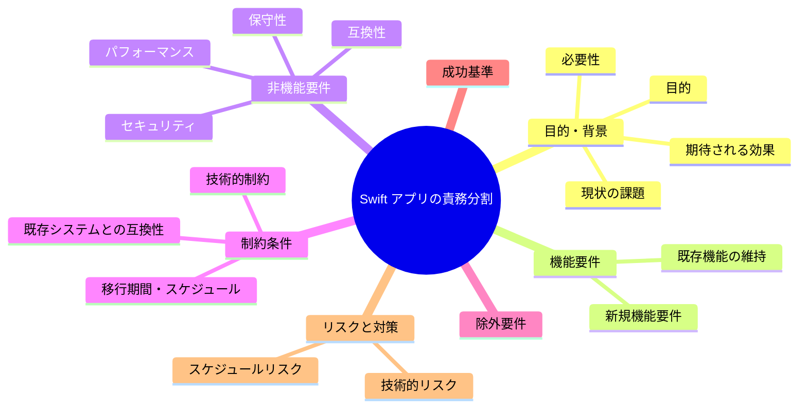
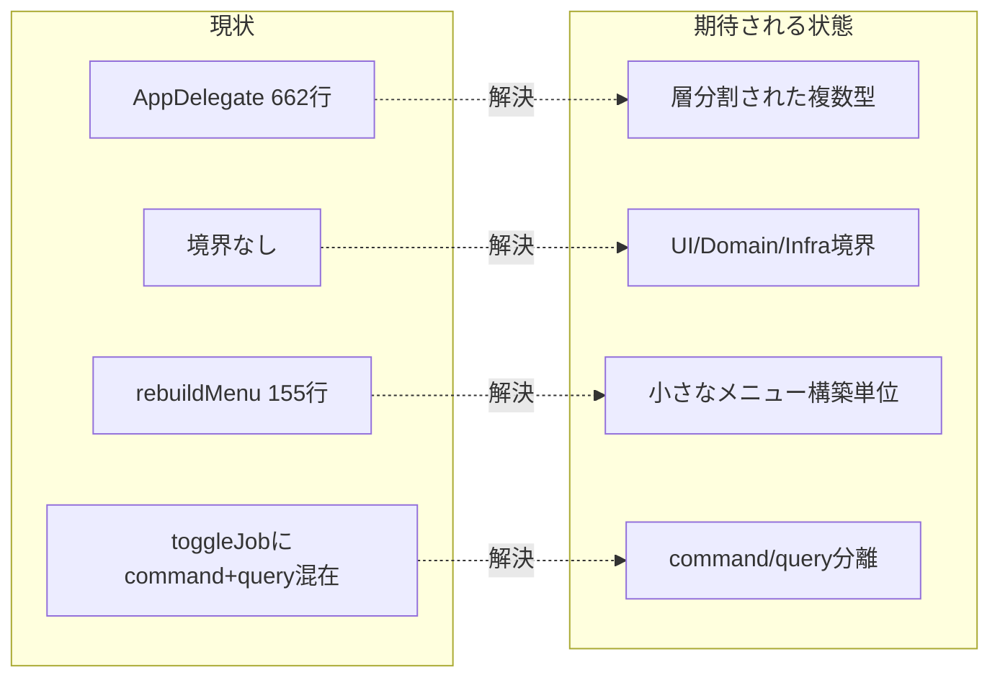

# 要求定義書: サブ B Swift アプリの責務分割

**プロジェクト名**: サブ B Swift アプリの責務分割（God class 解消）
**作成日**: 2026 年 05 月 27 日
**最終更新**: 2026 年 05 月 27 日

> **重要**:
>
> - 要求定義書は全体像を把握するためのものです。詳細は要件定義書以降で記載します。
> - **このドキュメントは常に更新**します。
> - **必須項目**: 判定可能な形で記入すること。
>
> **用語**: [.agents/CONCEPTS.md §用語規約](../../../../.agents/CONCEPTS.md#用語規約) を参照。

---

## 要求定義の全体像

---

## 1. 目的・背景

### 1.1 目的（必須）

God class `AppDelegate` を UI/Domain/Infra へ分割し責務境界を確立する。

### 1.2 背景

- **現状の課題**:
  - S1: `src/MacHealth.swift` が 662 行・単一クラス `AppDelegate`(L28-) に全責務集中。UI/Domain/Infra の境界が無く spec/01（明確な境界・単一責務）と AI フレンドリー設計に違反。
  - S2: spec/02 の module→usecase→event 構造が未適用。CQRS 未適用（`toggleJob`(L455) が状態変更コマンドと `launchctl list`(L476) の状態取得クエリを同一メソッドに混在）。
  - S3: `rebuildMenu()`(L246-) が約 155 行の巨大メソッド。

- **必要性**:
  - 変更容易性・可読性・テスト容易性の改善には責務分割が必須。

### 1.3 期待される効果（必須: 1 件以上）

- **効果 1**: `MetricsCollector`(Domain) / `ShellRunner`(Infra) / `MenuBuilder`(UI) 等に責務が分割される（○/× 判定可）。
- **効果 2**: `AppDelegate` 単一ファイルの行数と `rebuildMenu` のメソッド行数が縮小する（○/× 判定可）。
- **効果 3**: 状態変更（command）と状態取得（query）が分離される（CQRS、○/× 判定可）。

**現状と期待される状態の比較**:

---

## 2. 機能要件

### 2.1 既存機能の維持（該当する場合）

- メニュー表示・メトリクス更新・ジョブ ON/OFF の**外形的振る舞いを不変**に保つ（リファクタ）。

### 2.2 新規機能要件

- メトリクス収集（Domain）・シェル実行（Infra）・メニュー構築（UI）の責務分離。
- ジョブ状態変更（command）と状態取得（query）の分離。

---

## 3. 非機能要件

### 3.1 パフォーマンス

- メトリクス更新・メニュー再描画の体感速度を悪化させない。

### 3.2 セキュリティ

- シェル実行の堅牢化はサブ F の範囲。本サブでは Infra への分離に留め、注入対策は F に委譲する。

### 3.3 互換性

- launchd ラベル・通知文言・表示項目を変えない。

### 3.4 保守性

- spec/01・02・03（禁止命名 helpers/misc/common/utils）・06 に準拠する。

---

## 4. 制約条件

### 4.1 技術的制約

- Swift / Cocoa。分割後も `swiftc` または Swift Package でビルド可能にする。
- リファクタは振る舞い不変。サブ A のテストで挙動を固定したうえで行うことが望ましい。

### 4.2 既存システムとの互換性

- 外部 I/F（CLI・launchd・ログ出力先）を破壊しない。

### 4.3 移行期間・スケジュール

- サブ A 完了後に着手するのを推奨。

---

## 5. 除外要件

- UI デザインの刷新、機能追加は対象外（純粋なリファクタ）。

---

## 6. 成功基準（必須: 1 件以上）

- `MetricsCollector` / `ShellRunner` / `MenuBuilder` 相当の型へ責務が分割されている。
- `rebuildMenu` の責務が複数の小さな構築単位に分解されている。
- `toggleJob` の状態変更と状態取得が分離されている（CQRS）。
- 分割前後で外形的振る舞いが不変（既存挙動の確認が通る）。
- 禁止命名（helpers/misc/common/utils）を使っていない。

---

## 7. リスクと対策

### 7.1 技術的リスク

- **リスク**: 分割で挙動が変わる。
  - **対策**: サブ A の純粋ロジックテストで固定し、段階的に分割する。

### 7.2 スケジュールリスク

- **リスク**: 一括分割で手戻りが大きい。
  - **対策**: Domain→Infra→UI の順で段階的に切り出す。

---

## 8. 参考資料

### プロジェクトドキュメント

- 親要求: [../../00_要求定義.md](../../00_要求定義.md)
- 設計規約: `.agents/spec/01_設計原則.md`, `02_ディレクトリ構造方針.md`, `03_命名規則.md`, `06_設計判断の優先順位.md`

### その他の参考資料

- `src/MacHealth.swift`（L28, L246, L455, L476）

---

## 9. 次のステップ

- **次**: [`01_要件定義.md`](./01_要件定義.md) - 要件定義フェーズ
