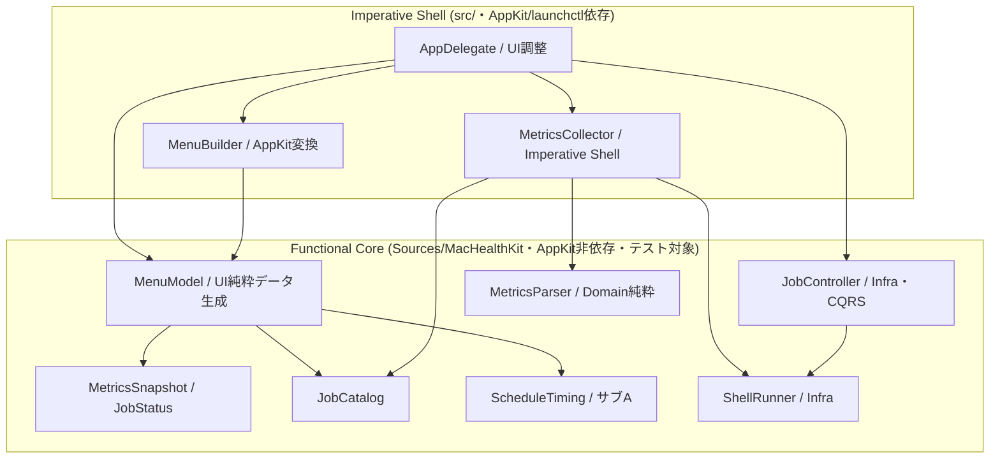
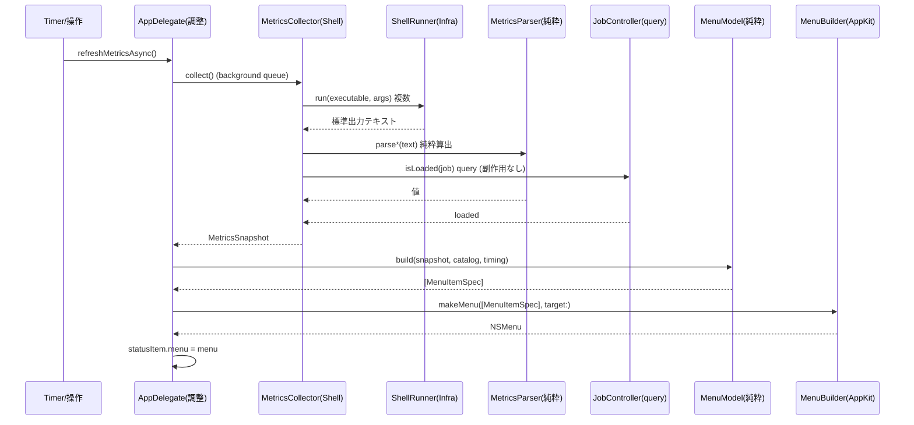
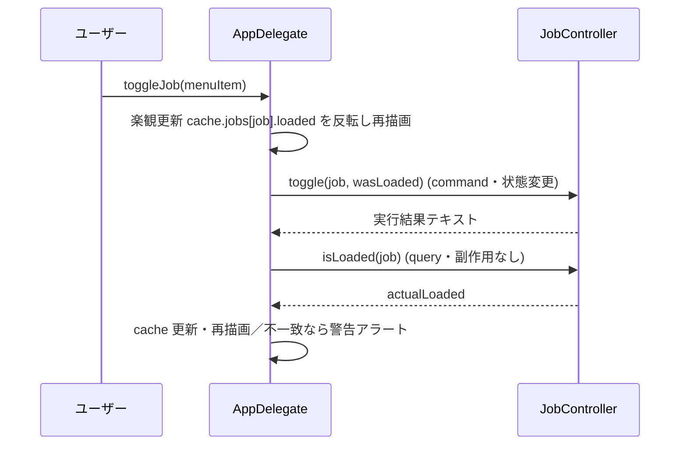
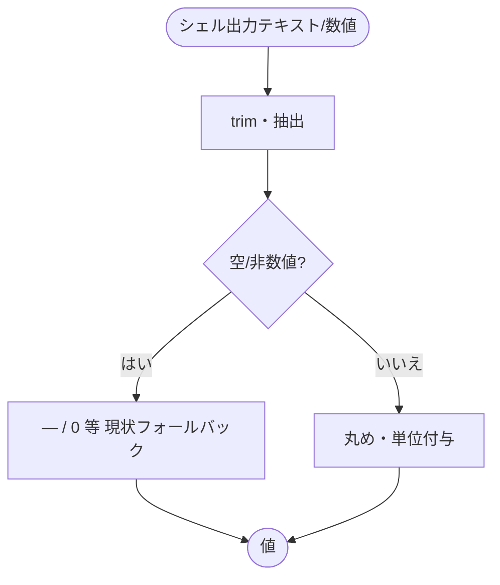
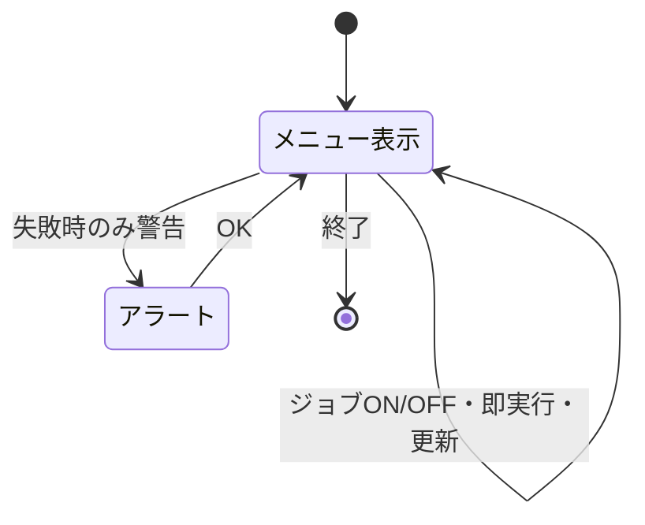

# 設計書: サブ B Swift アプリの責務分割

**プロジェクト名**: サブ B Swift アプリの責務分割（God class 解消）
**作成日**: 2026 年 05 月 28 日
**最終更新**: 2026 年 05 月 28 日

> **重要**: **このドキュメントは常に更新**: 設計の変更や追加があった場合は、即座にこのドキュメントを更新してください。ドキュメントは「生きているドキュメント」として扱い、実装内容と常に同期させます。
>
> **用語**: [.agents/CONCEPTS.md §用語規約](../../../../.agents/CONCEPTS.md#用語規約) を参照。

---

## 1. 設計概要

**必須**: 設計方針・原則は [.agents/spec/01\_設計原則.md](../../../../.agents/spec/01_設計原則.md) を**先に参照**した上で、本プロジェクトに**適用するものを選び**記載すること。

### 1.1 設計方針

662 行の God class `AppDelegate`（`src/MacHealth.swift`）の責務を **UI / Domain / Infra** の 3 層へ分離し、状態変更（command）と状態取得（query）を **CQRS** で分けることで可読性・単一責務・テスト容易性を確立する。**外形的振る舞いは完全に不変**（純粋リファクタ）とし、振る舞い不変は Functional Core を XCTest で固定して保証する。

### 1.2 設計原則（本プロジェクトで適用するもの）

- **UNIX哲学**: `MetricsCollector`／`ShellRunner`／`MenuBuilder`／`JobController` は各 1 つの仕事だけを行い、組み合わせ可能にする。
- **単一責務**: 収集（Domain）・実行（Infra）・表示（UI）・調整（`AppDelegate`）を別型に分け、1 型 1 責務にする。
- **明確な境界**: UI（NSMenu 構築）／ Domain（メトリクス算出・ジョブ状態モデル）／ Infra（シェル・launchctl）の境界を引く。
- **CQRS**: ジョブの状態変更（command）と `launchctl list` による状態取得（query）を別メソッドに分離し、**query に副作用を持たせない**。
- **AIフレンドリー設計**: AppKit 非依存の Functional Core を小さなファイルとして `Sources/MacHealthKit/` に集約し、意図が分かる命名（禁止命名 helpers/misc/common/utils を使わない）にする。

> **AIフレンドリー設計**: 適用観点は「Functional Core を小さなファイルに分割（`MetricsSnapshot`/`JobStatus` モデル・パース・メニューデータ生成）」「層ごとにファイルを分ける」「`run(_:_:)` のような意図が分かる API 名」。深いディレクトリは作らず `Sources/MacHealthKit/` 直下にフラットに配置する。

### 1.3 設計判断の優先順位（spec/06）

判断は **可読性 > 単一責務 > 仕様整合 > 変更容易性 > 保守性 > 再利用性 > 実装効率** に従う。本設計では特に次を守る。

- **query に副作用を書かない**（CQRS / spec/06）。`jobStatus(...)` は `launchctl list` を読むだけで状態を変えない。
- **再利用のために責務を曖昧にしない**。`shared`/`utils` 的な置き場を作らず、Domain/Infra/UI の役割で型を切る。
- **抽象化より意図の明確さ**。`ShellRunner` は将来 F が内部実装を差し替えられる最小 protocol に留め、過度な抽象化はしない。

---

## 2. アーキテクチャ設計

### 2.1 責務・境界・参照関係

#### 2.1.1 責務一覧

| コンポーネント | 層 | 配置 | 責務（1 文） |
| --- | --- | --- | --- |
| `MetricsParser` | Domain（純粋） | `Sources/MacHealthKit/` | シェル出力テキスト・ページ数・epoch を入力に `MetricsSnapshot` のメトリクス値を算出する純粋関数群（外部コマンド非依存）。 |
| `MetricsSnapshot` / `JobStatus` | Domain（モデル） | `Sources/MacHealthKit/` | メトリクスとジョブ状態の値型（意味は現状不変）。 |
| `JobCatalog` | Domain（モデル） | `Sources/MacHealthKit/` | ジョブ ID・短名・頻度・スケジュール種別・launchd ラベル規則の静的定義を保持する。 |
| `MenuModel`（`MenuItemSpec` 配列） | UI（純粋・データ） | `Sources/MacHealthKit/` | `MetricsSnapshot`/`JobStatus` から「メニュー項目データ（title・enabled・action 識別子・順序・representedJob・tooltip）」の配列を生成する純粋部。 |
| `MetricsCollector` | Domain＋Infra 調整 | `src/` | `ShellRunner` で実コマンドを実行し、その出力を `MetricsParser` に委譲して `MetricsSnapshot` を組み立てる（Imperative Shell）。 |
| `ShellRunner`（protocol＋既定実装 `ZshShellRunner`） | Infra | `Sources/MacHealthKit/` | 外部コマンドを実行し標準出力文字列を返す。実行ファイル＋引数配列の I/F を持つ。protocol を `MacHealthKit` に置くことで `JobController` を AppKit 非依存にしスタブ注入で XCTest 化するため。 |
| `JobController` | Infra | `Sources/MacHealthKit/` | launchctl による command（load/unload）と query（list 解析）を**別メソッド**で提供する（CQRS の Infra 部）。CQRS の query 副作用なしを XCTest で固定するため AppKit 非依存にして `MacHealthKit` に配置する。 |
| `MenuBuilder` | UI（AppKit 変換） | `src/` | `MenuModel` の項目データ配列を `NSMenu`/`NSMenuItem` に変換する薄い AppKit 部。 |
| `AppDelegate` | UI 調整（orchestration） | `src/` | タイマー・ステータスバー・各層の調整役。各 `@objc` アクションを Controller/Collector/Builder へ委譲する。 |

#### 2.1.2 境界

- **入力**: ユーザーのメニュー操作（クリック・⌘ショートカット）、60 秒タイマー、外部コマンドの標準出力。
- **出力**: `NSMenu`（表示項目・順序・文言）、通知（osascript）、launchctl への load/unload、ログファイルの open。
- **他責務との境界**:
  - **本サブ B の範囲**: God class を UI/Domain/Infra へ切り出し、CQRS で command/query を分離し、`rebuildMenu` をセクション単位の純粋データ生成へ分解するまで。**外形的振る舞いは不変**。
  - **サブ F の範囲（本サブ範囲外）**: `ShellRunner` の内部実装の堅牢化（引数配列化・シェル注入対策）。本サブは `ShellRunner` の I/F（実行ファイル＋引数配列を受ける形）を**確定**し、既定実装は現状の `zsh -l -c` 文字列実行を**当面ラップ**するに留める（00 §3.2 / 01 §3.2）。
  - **サブ A の範囲（先行・既存）**: `ScheduleTiming`（時刻計算の純粋ロジック）。本サブで生成する Domain は `ScheduleTiming` と同居（`Sources/MacHealthKit/`）し、メニュー項目の相対時刻文言生成に利用する。
  - **サブ C の範囲（参照）**: `scripts/lib/metrics.sh`（シェル側の純粋パース）。Swift 側 `MetricsParser` は同じ Functional Core / Imperative Shell の発想で、丸め・単位・フォールバックを現状の `gatherMetrics` と同一に保つ。

#### 2.1.3 参照関係

- `AppDelegate` は `MetricsCollector` を参照する。
- `AppDelegate` は `JobController` を参照する。
- `AppDelegate` は `MenuBuilder` を参照する。
- `AppDelegate` は `MenuModel` を参照する（項目データ生成）。
- `MenuBuilder` は `MenuModel`（`MenuItemSpec`）を参照する。
- `MenuModel` は `MetricsSnapshot`・`JobStatus`・`JobCatalog`・`ScheduleTiming` を参照する。
- `MetricsCollector` は `ShellRunner` と `MetricsParser`・`JobCatalog` を参照する。
- `JobController` は `ShellRunner` を参照する。
- `MetricsParser`・`MenuModel`・`MetricsSnapshot`・`JobStatus`・`JobCatalog` は AppKit にも `ShellRunner` にも依存しない（純粋／モデル）。
- **循環なし**: 依存は UI →（Domain 調整・Infra）→ Domain（純粋）の一方向。`Sources/MacHealthKit`（純粋）は `src/`（AppKit/Infra）を参照しない。

### 2.2 システムアーキテクチャ

**必須**: 設計判断は [.agents/spec/](../../../../.agents/spec/) を**先に**参照すること。

- **採用パターン**: レイヤード（UI / Domain / Infra）＋ **Functional Core / Imperative Shell** ＋ **CQRS**。
- **根拠**: spec/01（明確な境界・単一責務・CQRS）と spec/06（可読性 > 単一責務）に基づく。Functional Core を AppKit/launchctl から切り離すことで、振る舞い不変を XCTest で固定でき（spec/06 仕様整合）、God class の可読性・変更容易性を改善する。

#### 2.2.1 CQRS（Command/Query 分離）

`JobController` に command と query を別メソッドで定義する。

- **Command**（状態変更・副作用あり）:
  - `load(job:)` — `launchctl bootstrap gui/<uid> <plist>`（フォールバック `launchctl load <plist>`）でジョブを起動する。
  - `unload(job:)` — `launchctl bootout gui/<uid>/<label>`（フォールバック `launchctl unload <plist>`）でジョブを停止する。
  - `toggle(job:wasLoaded:)` — `wasLoaded` に応じて `load`/`unload` を選ぶ。状態変更のみを担う。
- **Query**（状態取得・**副作用なし**）:
  - `jobStatus(job:)` / `isLoaded(job:)` — `launchctl list | grep <label>` の結果から `loaded` を判定して返すのみ。launchctl の load/unload を**行わない**。
  - メトリクス収集側の `launchctl list`（現 `gatherMetrics` 内）も `JobController.isLoaded(job:)` の query を再利用し、収集経路と toggle 経路で同一の query を共有する。
- **副作用なしの保証**: `jobStatus`/`isLoaded` の内部で呼ぶシェルコマンドは `launchctl list` のみ（read-only）。テスト（UC1-S2）で `ShellRunner` のスタブを使い、query を 2 回呼んでも load/unload 系コマンドが 1 度も発行されないことを検証する。

#### 2.2.2 アーキテクチャ図（本プロジェクトの構成）



### 2.3 コンポーネント構成

**境界・単一責務**: 上記 2.1 の責務一覧に従い、AppKit 非依存の Functional Core（純粋部・モデル）を `Sources/MacHealthKit/`（library・テスト対象）に、AppKit/launchctl 依存の Imperative Shell を `src/`（`swiftc` ビルド）に配置する。

- **`Sources/MacHealthKit/`（library `MacHealthKit`・テスト対象）**
  - `ScheduleTiming.swift`（既存・サブ A）
  - `Metrics.swift` … `MetricsSnapshot`・`JobStatus` の値型（現 `src/MacHealth.swift` L11-28 を移設。意味不変）。
  - `MetricsParser.swift` … 純粋パース関数群（後述 §3.1）。
  - `JobCatalog.swift` … `jobs` 配列・`jobShortNames`・`jobFrequencies`・`jobSchedules`・launchd ラベル生成 `label(for:)` の静的定義（現 `src/MacHealth.swift` L43-68）。
  - `MenuModel.swift` … `MenuItemSpec`（メニュー 1 項目のデータ）と `MenuModel.build(...)`（純粋部・後述 §3.2）。
  - `ShellRunner.swift` … `protocol ShellRunner` ＋ 既定実装 `ZshShellRunner`（protocol が AppKit 非依存のため `MacHealthKit` に配置し、`JobController` のスタブ注入テストを可能にする）。
  - `JobController.swift` … `JobController`（CQRS の Infra 部。`ShellRunner` のみに依存し AppKit 非依存のため `MacHealthKit` に配置し、CQRS の query 副作用なしを XCTest で固定する）。
- **`src/`（`swiftc` ビルド・AppKit/launchctl 依存）**
  - `MacHealth.swift` … `AppDelegate`（縮小後）と `@main`。
  - `MetricsCollector.swift` … `MetricsCollector`（Imperative Shell）。
  - `MenuBuilder.swift` … `MenuBuilder`（`MenuItemSpec` 配列 → `NSMenu` 変換）と `NSMenuItem.toptip` 拡張。

> 配置は **AppKit 依存の有無**で決める。AppKit を import しないものだけ `MacHealthKit` に置く（=テスト可能）。`MenuModel`/`MenuItemSpec` は `NSMenu` を作らず**データのみ**を生成するため AppKit 非依存にでき、`MacHealthKit` に置ける（UC1-S1 を XCTest で固定するための要）。`ShellRunner`/`JobController` も AppKit に依存せず（launchctl の呼び出しは `ShellRunner` 経由のため）、テスト容易性のため `MacHealthKit` に置く（03 §2.3.4 注・install.sh の実列挙と整合）。

### 2.4 データフロー

イベント駆動は導入しない（spec/06「単純な同期処理で十分な場合は無理に導入しない」）。現状どおりタイマー駆動の同期更新を維持する。

**メトリクス更新 → メニュー再描画**（振る舞い不変）:



**ジョブ ON/OFF（CQRS）**:



イベント発行は行わないが、将来 spec/01 §イベント駆動に沿って `JobToggled` 等の「起きた事実」を発行する余地はある（本サブでは未採用）。

---

## 3. 機能設計

### 3.1 機能 1: MetricsParser（Domain 純粋パース）

#### 3.1.1 概要

現 `gatherMetrics()`（`src/MacHealth.swift` L115-187）の「シェル出力テキスト → メトリクス値」の算出を純粋関数として `MetricsParser` に切り出す。**丸め・単位・フォールバックは現状と完全一致**させる（サブ C `scripts/lib/metrics.sh` の発想に合わせるが、Swift 側は現状の `gatherMetrics` の出力を正とする）。

#### 3.1.2 処理フロー



#### 3.1.3 入力・出力（純粋関数の対応表）

各関数は現 `gatherMetrics` の対応行と同一ロジック・同一フォールバックにする。

| 関数（案） | 入力 | 出力 | 現状対応・フォールバック |
| --- | --- | --- | --- |
| `parseLoadAvg(_ text:)` | uptime の sed 抽出後テキスト | `String`（例 `"1.23"`） | L119-121。trim 後空なら `"—"`。 |
| `parseSwapUsed(_ text:)` | swapusage の sed 抽出後テキスト | `String`（例 `"512.00M"`） | L123-125。空なら `"—"`。 |
| `parseMemoryFreePct(_ text:)` | memory_pressure awk 抽出後テキスト | `String`（例 `"78"`） | L127-129。空なら `"—"`。 |
| `uptimeDaysHours(bootEpoch:nowEpoch:)` | boot/now epoch（Int） | `(days:Int, hours:Int)` | L131-137。bootStr が Int 変換不可なら now を使う＝0 日 0 時間。 |
| `compressedGB(pages:)` | compressor ページ数（String/Double） | `String`（例 `"1.5 GB"`） | L139-143。`pages * 4096 / 1024^3` を `%.1f GB`。非数値は 0。 |
| `dockerLine(running:containerCount:)` | 起動中フラグ・コンテナ数文字列 | `String` | L145-153。起動中は `"Docker:         起動中（コンテナ: \(count)）"`（count 空なら `?`）、停止中は `"Docker:         停止中"`。 |

#### 3.1.4 エラーハンドリング

例外は投げない。空文字・非数値は現状どおりのフォールバック値（`"—"`・0・`?`）を返す。これにより「外部コマンドが失敗してもクラッシュしない」現状挙動を維持する。

### 3.2 機能 2: MenuModel（UI 純粋データ生成）

#### 3.2.1 概要

155 行の `rebuildMenu()`（`src/MacHealth.swift` L210-365）を、「`MetricsSnapshot`/`JobStatus`/`JobCatalog` → メニュー項目データ配列」を生成する純粋部 `MenuModel.build(...)` と、それを `NSMenu` に変換する `MenuBuilder` に分解する。**項目・文言・順序・enabled・action・representedObject・tooltip を現状と完全一致**させる。これにより **UC1-S1**（分割前後で同一の項目・順序）を XCTest で固定できる。

#### 3.2.2 `MenuItemSpec`（メニュー 1 項目のデータ構造）

```swift
public struct MenuItemSpec: Equatable {
    public enum Kind: Equatable { case item, disabled, separator }
    public var kind: Kind
    public var title: String          // セパレータは ""
    public var isEnabled: Bool
    public var action: MenuAction?    // 後述。nil は非アクション項目
    public var keyEquivalent: String  // 例 "r","q",""（現状の keyEquivalent を保持）
    public var representedJob: String? // toggleJob/runJob 用のジョブ ID
    public var tooltip: String?       // ジョブ項目のツールチップ
}

// AppKit の #selector を純粋部に持ち込まないための action 識別子（enum）
public enum MenuAction: Equatable {
    case refreshNow, quickAppRefresh, quickPurge, quickMemoryPressure, quickDockerQuit
    case toggleJob, runJob
    case openEventsLog, openMonitorLog, testNotification
    case pauseAllJobs, resumeAllJobs, showMetricsHelp, showAbout, terminate
}
```

#### 3.2.3 純粋部 → AppKit 部の分担

- **純粋部 `MenuModel.build(snapshot:catalog:timing:now:)` → `[MenuItemSpec]`**（`MacHealthKit`・AppKit 非依存）。現 `rebuildMenu` のセクション順（タイトル → セパレータ → メトリクス行 → 最終更新／取得中 → セパレータ → クイック対処 → セパレータ → ジョブ一覧 → セパレータ → 今すぐ実行 → セパレータ → ログ/通知テスト → セパレータ → 全停止/再開 → セパレータ → ヘルプ → about → 終了）を**そのまま**配列に表現する。相対時刻文言は `ScheduleTiming` を `now` 固定で利用しテスト可能にする。
- **AppKit 部 `MenuBuilder.makeMenu(_ specs:[MenuItemSpec], target:)` → `NSMenu`**（`src/`）。`MenuAction` を `#selector` にマッピングし、`representedObject`・`target`・`toolTip`・`keyEquivalent` を設定して `NSMenuItem` を作る。`autoenablesItems = false` も現状どおり設定する。

#### 3.2.4 セクション分解（rebuildMenu の分解・01 ストーリー3）

`MenuModel.build` 内をセクションごとの小さな純粋関数に分ける（各関数は `[MenuItemSpec]` を返し連結する）。

- `headerSpecs()` … タイトル＋セパレータ。
- `metricsSpecs(snapshot:)` … メトリクス 6 行＋最終更新/取得中行＋セパレータ。
- `quickActionSpecs()` … クイック対処 4 項目＋セパレータ。
- `jobListSpecs(snapshot:catalog:timing:now:)` … ジョブ一覧（icon・名前・extras・tooltip）＋セパレータ。
- `runJobSpecs(catalog:)` … 「今すぐ実行」＋セパレータ。
- `logSpecs()` … 通知履歴/監視ログ/通知テスト＋セパレータ。
- `bulkSpecs()` … 全停止/全再開＋セパレータ。
- `footerSpecs()` … ヘルプ・about・終了。

#### 3.2.5 エラーハンドリング

純粋部は例外を投げない。`snapshot.jobs[job]` が無い場合は現状どおり `JobStatus()` 既定値を使う。`lastUpdated == .distantPast` のときは「取得中…」行（disabled）にする（現状 L233-243 と一致）。

### 3.3 機能 3: ShellRunner（Infra・F 連携の I/F 確定）

#### 3.3.1 概要

現 `shell(_ cmd:String)`（`src/MacHealth.swift` L597-613）を Infra へ切り出す。サブ F が「引数配列化・注入耐性」を寄せられるよう、**実行ファイル＋引数配列**を受ける I/F を確定する（00 §3.2）。本サブは I/F 確定とラップに留め、注入対策の実装は F に委譲する。

#### 3.3.2 I/F（protocol）

```swift
public protocol ShellRunner {
    /// 実行ファイルと引数配列を受け、標準出力（UTF-8）を返す。失敗時は "" を返す（現状互換）。
    @discardableResult
    func run(_ executable: String, _ args: [String]) -> String
}
```

- 既定実装 `ZshShellRunner`: 当面は現状の `zsh -l -c <文字列>` 実行をラップする。すなわち `run("/bin/zsh", ["-l", "-c", cmd])` 形を受け、`Process` で実行する。**現状の `bash -c` 相当（`zsh -l -c`）の挙動を維持**し、注入対策の内部差し替えは F の責務（境界のみ提供）。
- 呼び出し側（`MetricsCollector`/`JobController`/`AppDelegate` のアクション）は、当面 `runner.run("/bin/zsh", ["-l", "-c", existingCommandString])` として既存のコマンド文字列をそのまま渡す。F が `run` の実装を `executable + args` の直接実行へ差し替えても呼び出し側を変えずに済む境界とする。

#### 3.3.3 エラーハンドリング

`Process.run()` が throw した場合は現状どおり `""` を返す（クラッシュさせない）。標準エラーは破棄（現状 L604 と同じ）。

### 3.4 機能 4: JobController（Infra・CQRS）

#### 3.4.1 概要

`toggleJob`（L419-461）に混在する状態変更（bootout/bootstrap）と状態取得（`launchctl list`）を分離する。`AppDelegate.toggleJob` は楽観更新・再描画・アラート表示（UI）を担い、launchctl 操作は `JobController` に委譲する。

#### 3.4.2 入力・出力

- `func toggle(job:wasLoaded:) -> String`（command）: `wasLoaded` が true なら unload、false なら load を実行し結果テキストを返す。`label`/`plist`/`uid` は `JobCatalog`/`ShellRunner` 経由で組み立てる。
- `func isLoaded(job:) -> Bool`（query）: `launchctl list | grep <label>` の trim 結果が非空なら true。**load/unload を呼ばない**。
- `func enableAll()` / `disableAll()`（command）: 現 `resumeAllJobs`/`pauseAllJobs` のシェル実行（`mac-health enable`/`disable`）を委譲。

#### 3.4.3 エラーハンドリング

現状どおり、command の結果テキストを `AppDelegate` へ返し、`AppDelegate` 側で `isLoaded` の結果と `wasLoaded` を比較し、変化していなければ警告アラート（文言・スタイル不変）を出す。

### 3.5 AppDelegate（縮小後の調整役）

- 保持: `statusItem`・`refreshTimer`・`metricsQueue`・`cache: MetricsSnapshot`・各依存（`collector`・`jobController`・`menuBuilder`）。
- `refreshMetricsAsync()`: `collector.collect()` を background で呼び、結果で `cache` 更新 → `rebuildMenu()`。
- `rebuildMenu()`: `MenuModel.build(...)` → `menuBuilder.makeMenu(...)` → `statusItem.menu = menu` の 3 行に縮小。
- 各 `@objc` アクション（quick*・toggleJob・runJob・open*・testNotification・pause/resumeAll・showMetricsHelp・showAbout）は **UI 文言・通知文言・アラート文言・selector 名を不変**のまま、シェル実行を `runner`/`collector`/`jobController` へ委譲する。

---

## 4. データ設計

### 4.1 データモデル

DB は使用しない。値型 `MetricsSnapshot`・`JobStatus`（`Sources/MacHealthKit/Metrics.swift` へ移設）と静的定義 `JobCatalog` を用いる。**意味・フィールドは現状不変**。

### 4.2 データ構造

| 型 | フィールド | 不変条件 |
| --- | --- | --- |
| `MetricsSnapshot` | `uptimeDays/Hours:Int`, `loadAvg/memoryFreePct/compressedGB/swapUsed/dockerLine:String`, `jobs:[String:JobStatus]`, `lastUpdated:Date` | 現状の型・既定値・意味を維持。 |
| `JobStatus` | `loaded:Bool`, `lastRun:Date?`, `nextRun:Date?` | 現状維持。 |
| `JobCatalog` | `jobs:[String]`, `shortNames`, `frequencies`, `schedules`, `label(for:)`（`com.github.adachi-tatsuru.machealth.<job>`） | ラベル規則・並び順を厳密維持（UC1-S1 の順序・UC2 のラベル不変）。 |
| `MenuItemSpec` | §3.2.2 | 新規（純粋データ）。表示には現状と同じ title/順序を出す。 |

---

## 5. API 設計

### 5.1 API 一覧（公開関数・主要メソッド）

| API | 種別 | 層 | 説明 |
| --- | --- | --- | --- |
| `MetricsParser.parseLoadAvg/parseSwapUsed/parseMemoryFreePct/uptimeDaysHours/compressedGB/dockerLine` | Query（純粋） | Domain | テキスト/数値 → メトリクス値（フォールバック含む）。 |
| `MenuModel.build(snapshot:catalog:timing:now:)` | Query（純粋） | UI | スナップショット → `[MenuItemSpec]`。 |
| `ShellRunner.run(_:_:)` | （副作用あり） | Infra | 実行ファイル＋引数配列 → 標準出力文字列。 |
| `JobController.toggle(job:wasLoaded:)` | **Command** | Infra | ジョブ load/unload。 |
| `JobController.isLoaded(job:)` | **Query** | Infra | launchctl list で loaded 判定（副作用なし）。 |
| `JobController.enableAll()/disableAll()` | **Command** | Infra | 全ジョブ enable/disable。 |
| `MetricsCollector.collect()` | Query（Shell） | Domain＋Infra | 実コマンド実行 → `MetricsSnapshot`。 |
| `MenuBuilder.makeMenu(_:target:)` | （AppKit 変換） | UI | `[MenuItemSpec]` → `NSMenu`。 |

### 5.2 API 詳細

#### API1: `MenuModel.build(snapshot:catalog:timing:now:)`

- **入力**: `MetricsSnapshot`, `JobCatalog`, `ScheduleTiming`, `now: Date`。
- **出力**: `[MenuItemSpec]`（順序・title・enabled・action・representedJob・tooltip を含む）。
- **契約**: 同一入力に対し常に同一の配列（決定的）。AppKit を import しない。`now` を引数で受けるため相対時刻文言が固定でき、テストで安定する。
- **エラー**: 投げない。欠損ジョブは既定 `JobStatus()`。

#### API2: `JobController.isLoaded(job:)`

- **入力**: `job: String`。
- **出力**: `Bool`（loaded か）。
- **契約**: **query。load/unload を呼ばない**（副作用なし）。内部で `runner.run` に渡すのは `launchctl list` 系のみ。
- **エラー**: list 取得失敗時は false 相当（trim 結果空）。

#### API3: `JobController.toggle(job:wasLoaded:)`

- **入力**: `job: String`, `wasLoaded: Bool`。
- **出力**: 実行結果テキスト `String`。
- **契約**: command。`wasLoaded` で unload/load を選ぶ。query を内包しない（状態確認は呼び出し側が `isLoaded` を別途呼ぶ）。

---

## 6. テスト戦略

テスト戦略の**観点の定義**は [RULES.md のテスト戦略必須要件](../../../../.agents/RULES.md#テスト戦略必須要件) を、**BDD 形式の定義**は [TEST_BDD_FORMAT.md](../../../../.agents/TEST_BDD_FORMAT.md) を参照する。本ドキュメントでは**対象ごとのテスト割当**のみ記載する。

### 6.1 対象ごとのテスト割り当て

| 対象 | 単体 | 結合/API | E2E | クリティカル観点 | バリデーション観点 | 未達理由/補足 |
| --- | --- | --- | --- | --- | --- | --- |
| `MetricsParser`（純粋パース） | ○ | × | × | 丸め・単位・フォールバックが現状と一致（振る舞い不変） | 空文字・非数値・パターン不一致時のフォールバック | XCTest（`Tests/MacHealthKitTests/`）。 |
| `MenuModel.build`（UI 純粋部） | ○ | × | × | **分割前と同一の項目・順序**（UC1-S1） | `lastUpdated == .distantPast` の取得中表示、欠損ジョブ | 期待 `[MenuItemSpec]` を固定値で照合。 |
| `JobController`（CQRS） | ○ | × | × | query が副作用なし（UC1-S2）／toggle で反転（UC2-S1） | — | `ShellRunner` をスタブ注入し発行コマンドを検証。 |
| `ShellRunner`（既定実装 `ZshShellRunner`） | × | × | × | — | — | 実プロセス実行のため対象外（後述）。 |
| `MetricsCollector`（Imperative Shell） | × | × | × | — | — | 実コマンド実行（sysctl 等）依存のため対象外（後述）。 |
| `MenuBuilder`（AppKit 変換） | × | × | × | — | — | NSMenu 生成は AppKit 実依存のため対象外（後述）。 |
| `AppDelegate`（調整役） | × | × | △手動 | 振る舞い不変は手動確認（メニュー目視・install.sh ビルド） | — | AppKit/launchctl 実依存。手動 E2E は install.sh のビルド成功＋メニュー目視。 |

**XCTest 対象外の理由**: `ShellRunner` 既定実装・`MetricsCollector`・`MenuBuilder`・`AppDelegate` は AppKit（NSMenu/NSApp）・launchctl・実コマンド（sysctl/vm_stat/docker 等）に依存し、CI で決定的に検証できない。これらは Functional Core（`MetricsParser`/`MenuModel`/`JobController`＋スタブ）を XCTest で固定し、Imperative Shell は「純粋部へ委譲する薄いラッパ」に縮小することで間接的に担保する。手動確認は install.sh ビルド成功とメニュー目視（項目・順序・文言不変）で行う。

### 6.2 監査・レビューでの確認（証跡）

本設計 §6.1 の割当と 03_実装計画のタスク別テスト観点・BDD（UC1-S1／UC1-S2／UC2-S1）が 1 対 1 で揃っていることを確認する。`JobController` の query が `ShellRunner` スタブで load/unload を発行しないことを必ずテストで検証する。

---

## 7. UI 設計

### 7.1 画面遷移図

メニューバーのドロップダウンメニューのみ（画面遷移なし）。**項目・順序・文言は現状不変**。



### 7.2 画面設計

#### 画面 1: ステータスメニュー

`MenuModel.build` が生成する `[MenuItemSpec]` の順序がそのまま表示順になる（§3.2.4 のセクション順）。タイトル・メトリクス 6 行・最終更新行・クイック対処 4 項目・ジョブ一覧・今すぐ実行・ログ/通知・全停止/再開・ヘルプ・about・終了。**文言・絵文字・keyEquivalent（r/e/m/t/q）を現状から変更しない**。

---

## 8. セキュリティ設計

### 8.1 認証・認可

該当なし（ローカル GUI アプリ）。

### 8.2 データ保護

シェル実行の注入対策は**サブ F に委譲**（本サブ範囲外）。本サブは `ShellRunner` の I/F（実行ファイル＋引数配列）を確定し、F が内部実装を差し替えられる境界を用意するに留める（00 §3.2 / 01 §3.2）。本サブで `bash -c`／`zsh -l -c` の文字列実行の堅牢化は行わない。

---

## 9. 非機能要件への対応

### 9.1 パフォーマンス

メトリクス収集は現状どおり background queue（`MacHealth.metrics`）で実行し、メイン更新も現状の流れを維持する。型分割によるオーバーヘッドは無視できる。体感速度は悪化させない。

### 9.2 可用性

分割後も **`swiftc`（install.sh）と SwiftPM の両方でビルド可能**にする。

- **install.sh**: `src/` に追加する `MetricsCollector.swift`・`MenuBuilder.swift` と、`Sources/MacHealthKit/` の `Metrics.swift`・`MetricsParser.swift`・`JobCatalog.swift`・`MenuModel.swift`・`ShellRunner.swift`・`JobController.swift`・既存 `ScheduleTiming.swift` を `swiftc` のビルド行（現 install.sh L80）に追加する。出力名 `MacHealth`・.app バンドル化・LaunchAgent・Info.plist 配置は不変。`ShellRunner`/`JobController` は AppKit 非依存でテスト容易性のため `Sources/MacHealthKit/` に配置する。
- **SwiftPM**: `MacHealthKit` library に追加ファイル（`Metrics.swift`/`MetricsParser.swift`/`JobCatalog.swift`/`MenuModel.swift`/`ShellRunner.swift`/`JobController.swift`）が含まれる（`path: "Sources/MacHealthKit"` のため自動）。`src/` の AppKit 依存ファイル（`MacHealth.swift`/`MetricsCollector.swift`/`MenuBuilder.swift`）は Package には含めない（現状方針維持）。テストは `Tests/MacHealthKitTests/` に追加する。

---

## 10. 参考資料

### プロジェクトドキュメント

- [`01_要件定義.md`](./01_要件定義.md) - 要件定義
- [`00_要求定義.md`](./00_要求定義.md) - 要求定義
- 設計規約: `.agents/spec/01_設計原則.md`, `02_ディレクトリ構造方針.md`, `03_命名規則.md`, `06_設計判断の優先順位.md`

### その他の参考資料

- `src/MacHealth.swift`（`AppDelegate` L30-, `gatherMetrics` L115-, `rebuildMenu` L210-, `toggleJob` L419-, `launchctl list` L440, `shell()` L597-, `notify()` L591-, `@main` 末尾）
- `Sources/MacHealthKit/ScheduleTiming.swift`（サブ A）, `Package.swift`, `Tests/MacHealthKitTests/ScheduleTimingTests.swift`
- `install.sh`（L80 複数ファイルビルド行）, `scripts/lib/metrics.sh`（サブ C）

---

## 11. 前のステップ

この設計書は、以下のドキュメントを基に作成されています：

- **前**: [`01_要件定義.md`](./01_要件定義.md) - 要件定義フェーズ

---

## 12. 次のステップ

この設計書の承認後、以下のドキュメントを作成します：

- **次**: [`03_実装計画.md`](./03_実装計画.md) - 実装計画フェーズ
