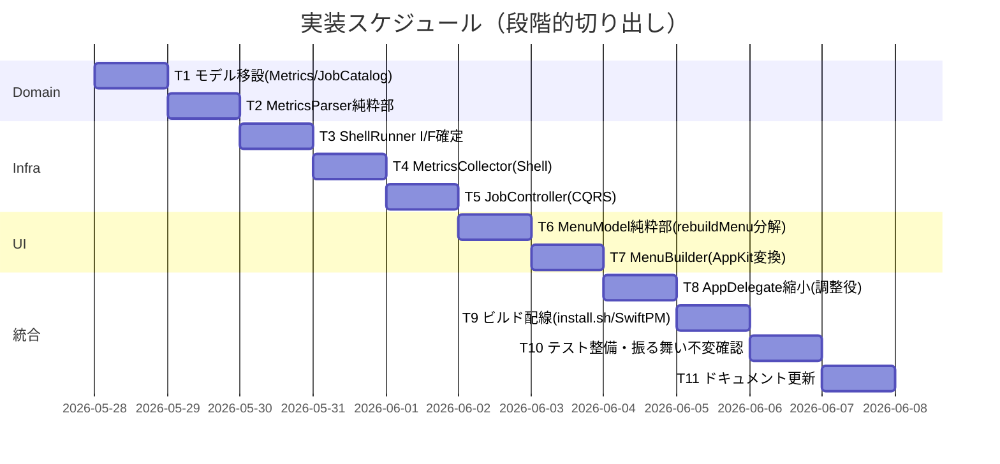

# 実装計画書: サブ B Swift アプリの責務分割

**プロジェクト名**: サブ B Swift アプリの責務分割（God class 解消）
**作成日**: 2026 年 05 月 28 日
**最終更新**: 2026 年 05 月 28 日

> **重要**: **このドキュメントは常に更新**: 実装計画の変更、進捗状況の更新、バグの記録などがあった場合は、即座にこのドキュメントを更新してください。ドキュメントは「生きているドキュメント」として扱い、実装内容と常に同期させます。
> **必須項目**: 「必須」と明記した欄は空欄・抽象語のみで提出しないこと。テスト観点・BDD 仕様は具体ケースを 1 件以上記載すること。
>
> **用語**: [.agents/CONCEPTS.md §用語規約](../../../../.agents/CONCEPTS.md#用語規約) を参照。

---

## 1. 実装概要

### 1.1 実装方針（必須）

God class `AppDelegate` を **Domain → Infra → UI → AppDelegate 縮小** の順で段階的に切り出し、各段でサブ A の既存テスト＋新規テストにより**外形的振る舞いの不変**を確認する。AppKit 非依存の Functional Core（`MetricsParser`/`MenuModel`/モデル/`JobCatalog`）は `Sources/MacHealthKit/`（テスト対象）に、Imperative Shell（`ShellRunner`/`MetricsCollector`/`JobController`/`MenuBuilder`/`AppDelegate`）は `src/` に配置する（02 §2.3）。

### 1.2 実装順序（必須: 1 件以上）



| 順 | タスク | 層 |
| --- | --- | --- |
| T1 | `MetricsSnapshot`/`JobStatus` 移設・`JobCatalog` 抽出 | Domain |
| T2 | `MetricsParser` 純粋パース部 | Domain |
| T3 | `ShellRunner` protocol＋`ZshShellRunner` I/F 確定 | Infra |
| T4 | `MetricsCollector`（Imperative Shell） | Infra/Domain 調整 |
| T5 | `JobController`（CQRS: command/query 分離） | Infra |
| T6 | `MenuModel` 純粋データ生成部（`rebuildMenu` 分解） | UI |
| T7 | `MenuBuilder`（`[MenuItemSpec]`→`NSMenu`） | UI |
| T8 | `AppDelegate` を調整役に縮小 | UI 調整 |
| T9 | ビルド配線（install.sh・Package.swift） | ビルド |
| T10 | テスト整備・振る舞い不変確認 | テスト |
| T11 | ドキュメント更新（ビルド行コメント等） | ドキュメント |

---

## 2. タスク分解

**必須**: 各タスクには **「テスト観点」（2.x.3）** と **「単体テスト仕様（BDD）」（2.x.4）** を必ず記載する。観点の定義は **02\_設計 §6** および **RULES のテスト戦略・[TEST_BDD_FORMAT.md](../../../../.agents/TEST_BDD_FORMAT.md)** を参照。

### 2.1 タスク 1: モデル移設・JobCatalog 抽出（Domain）

#### 2.1.1 概要（必須）

`MetricsSnapshot`/`JobStatus` を `Sources/MacHealthKit/Metrics.swift` へ移設し、ジョブの静的定義（id・短名・頻度・スケジュール・ラベル規則）を `JobCatalog.swift` に抽出する。

#### 2.1.2 実装内容（必須: 1 件以上）

- `Sources/MacHealthKit/Metrics.swift` に `public struct MetricsSnapshot`・`public struct JobStatus` を移設（フィールド・既定値・意味は現状不変）。
- `Sources/MacHealthKit/JobCatalog.swift` に `jobs`・`shortNames`・`frequencies`・`schedules`（`ScheduleKind`）・`label(for:)` を移設（並び順・ラベル規則 `com.github.adachi-tatsuru.machealth.<job>` を厳守）。

#### 2.1.3 テスト観点（必須）

**参照**: 観点定義は [02\_設計 §6](./02_設計.md) と RULES のテスト戦略。本タスクの具体ケースのみ記載。

##### 単体（必須 1 件以上）

- 正常系: `JobCatalog.jobs == ["monitor","docker","uptime","refresh"]`（並び順不変）。
- 正常系: `JobCatalog.label(for: "monitor") == "com.github.adachi-tatsuru.machealth.monitor"`。
- 境界値: 未知ジョブ ID の `shortNames`/`frequencies` は nil で、表示側はジョブ ID にフォールバック（現状 `?? job` 互換）。

##### 結合/API（該当時は必須 1 件以上）

- 該当なし。

##### E2E/受け入れ（未達時は理由記載）

- 該当なし（モデル移設のみ。表示確認は T10 のメニュー目視に含める）。

##### バリデーション（該当する場合）

- 該当なし。

#### 2.1.4 単体テスト仕様（BDD）（必須）

```gherkin
Feature: JobCatalog のジョブ定義
  Scenario: ジョブの並び順とラベル規則が不変
    Given JobCatalog を参照する
    When jobs と label(for:) を取得する
    Then 並び順 [monitor,docker,uptime,refresh] と launchd ラベル規則が現状と一致する
```

```swift
// ファイル: Tests/MacHealthKitTests/JobCatalogTests.swift

/// ユースケース: ジョブの静的定義（並び順・ラベル規則）を不変に保つ。
final class JobCatalogTests: XCTestCase {
    /// シナリオ: jobs の並び順と label(for:) が現状の launchd ラベルと一致する。
    func test_jobs_orderAndLabel_matchCurrentBehavior() {
        // Given: JobCatalog を用意する
        let catalog = JobCatalog()
        // When: jobs 並びと monitor のラベルを取得する
        let order = catalog.jobs
        let label = catalog.label(for: "monitor")
        // Then: 並び順とラベル規則が現状どおり
        XCTAssertEqual(order, ["monitor", "docker", "uptime", "refresh"])
        XCTAssertEqual(label, "com.github.adachi-tatsuru.machealth.monitor")
    }
}
```

#### 2.1.5 依存関係

- なし（最初に着手）。

#### 2.1.6 見積もり

- **工数**: 1.0h ／ **優先度**: 高

### 2.2 タスク 2: MetricsParser 純粋パース部（Domain）

#### 2.2.1 概要（必須）

現 `gatherMetrics` のテキスト→値の算出（丸め・単位・フォールバック）を `Sources/MacHealthKit/MetricsParser.swift` の純粋関数群へ切り出す（02 §3.1.3）。

#### 2.2.2 実装内容（必須: 1 件以上）

- `parseLoadAvg`/`parseSwapUsed`/`parseMemoryFreePct`/`uptimeDaysHours(bootEpoch:nowEpoch:)`/`compressedGB(pages:)`/`dockerLine(running:containerCount:)` を実装（現状ロジック・フォールバックと一致）。

#### 2.2.3 テスト観点（必須）

##### 単体（必須 1 件以上）

- 正常系: `compressedGB(pages: 262144) == "1.0 GB"`（262144*4096/1024^3 = 1.0、`%.1f GB`）。
- 異常系/フォールバック: `parseLoadAvg("")` → `"—"`、`compressedGB(pages: "")` → `"0.0 GB"`。
- 正常系: `uptimeDaysHours(bootEpoch: now-90000, nowEpoch: now)` → `(days:1, hours:1)`（90000 秒 = 1 日 1 時間）。
- 正常系: `dockerLine(running: false, containerCount: "")` → `"Docker:         停止中"`、`dockerLine(running: true, containerCount: "3")` → `"Docker:         起動中（コンテナ: 3）"`。

##### 結合/API（該当時は必須 1 件以上）

- 該当なし。

##### E2E/受け入れ（未達時は理由記載）

- 該当なし（純粋部のみ）。

##### バリデーション（該当する場合）

- 空文字・非数値入力で現状フォールバック（`"—"`/0/`?`）になること。

#### 2.2.4 単体テスト仕様（BDD）（必須）

```gherkin
Feature: MetricsParser の純粋パース
  Scenario: 圧縮メモリのページ数を GB 文字列に変換する
    Given compressor ページ数 262144
    When compressedGB を呼ぶ
    Then "1.0 GB" を返す
  Scenario: 空入力でフォールバック値を返す
    Given 空文字の load 抽出テキスト
    When parseLoadAvg を呼ぶ
    Then "—" を返す
```

```swift
// ファイル: Tests/MacHealthKitTests/MetricsParserTests.swift

/// ユースケース: シェル出力テキスト/数値からメトリクス値を現状と同じ丸め・フォールバックで算出する。
final class MetricsParserTests: XCTestCase {
    private let parser = MetricsParser()

    /// シナリオ: 圧縮メモリのページ数を GB 文字列に変換する（振る舞い不変）。
    func test_compressedGB_whenPages262144_returnsOnePointZeroGB() {
        // Given: 1GB 相当のページ数 262144
        let pages = "262144"
        // When: compressedGB を呼ぶ
        let text = parser.compressedGB(pages: pages)
        // Then: "1.0 GB" が返る
        XCTAssertEqual(text, "1.0 GB")
    }

    /// シナリオ: 空入力では現状どおりのフォールバック値を返す。
    func test_parseLoadAvg_whenEmpty_returnsDash() {
        // Given: 空文字（抽出失敗相当）
        let text = ""
        // When: parseLoadAvg を呼ぶ
        let load = parser.parseLoadAvg(text)
        // Then: フォールバック "—" を返す
        XCTAssertEqual(load, "—")
    }

    /// シナリオ: 稼働時間 epoch 差を 日/時間 に変換する。
    func test_uptimeDaysHours_whenOneDayOneHour_returnsExpected() {
        // Given: now と 90000 秒前の boot epoch（1日1時間）
        let now = 1_700_000_000
        let boot = now - 90000
        // When: uptimeDaysHours を呼ぶ
        let r = parser.uptimeDaysHours(bootEpoch: boot, nowEpoch: now)
        // Then: (1, 1)
        XCTAssertEqual(r.days, 1)
        XCTAssertEqual(r.hours, 1)
    }
}
```

#### 2.2.5 依存関係

- T1（モデル）に依存。

#### 2.2.6 見積もり

- **工数**: 1.5h ／ **優先度**: 高

### 2.3 タスク 3: ShellRunner I/F 確定（Infra）

#### 2.3.1 概要（必須）

`shell(_:)` を `src/ShellRunner.swift` の `protocol ShellRunner`（`run(_ executable:String, _ args:[String]) -> String`）＋既定実装 `ZshShellRunner` へ切り出し、サブ F が内部実装を差し替えられる境界を確定する（02 §3.3）。

#### 2.3.2 実装内容（必須: 1 件以上）

- `protocol ShellRunner { func run(_ executable:String, _ args:[String]) -> String }`。
- `final class ZshShellRunner: ShellRunner`: 現状の `zsh -l -c <cmd>` を `Process` で実行（throw 時 `""`、stderr 破棄）。当面 `run("/bin/zsh", ["-l","-c", cmd])` で既存コマンド文字列を受ける。

#### 2.3.3 テスト観点（必須）

##### 単体（必須 1 件以上）

- スタブ `ShellRunner` を用い、呼び出し側が `run` に渡した `executable`/`args` を記録して検証できること（T4/T5 のテストで使用する土台）。
- `ZshShellRunner` の実プロセス実行は XCTest 対象外（理由: 実コマンド・環境依存で非決定的。02 §6.1）。

##### 結合/API（該当時は必須 1 件以上）

- 該当なし。

##### E2E/受け入れ（未達時は理由記載）

- 実コマンド実行は手動確認（T10 のメニュー操作）に委ねる。

##### バリデーション（該当する場合）

- 該当なし（注入対策は F に委譲）。

#### 2.3.4 単体テスト仕様（BDD）（必須）

```gherkin
Feature: ShellRunner の I/F
  Scenario: スタブが実行ファイルと引数を記録する
    Given 記録用スタブ ShellRunner
    When run("/bin/zsh", ["-l","-c","echo x"]) を呼ぶ
    Then 記録された executable と args が一致し、戻り値はスタブの設定値になる
```

```swift
// ファイル: Tests/MacHealthKitTests/ より共有する Spy（src 非依存にするため protocol を MacHealthKit に置く案も可。
// 実装時は ShellRunner protocol を MacHealthKit へ置き、JobController/Collector から参照する）

/// ユースケース: ShellRunner の I/F がスタブ可能で、呼び出し引数を検証できる。
final class ShellRunnerContractTests: XCTestCase {
    /// シナリオ: スタブが run の引数を記録し、設定した戻り値を返す。
    func test_spyRunner_recordsArgsAndReturnsStub() {
        // Given: 戻り値 "x" を返す記録用スタブ
        let spy = SpyShellRunner(stubbed: ["x"])
        // When: run を呼ぶ
        let out = spy.run("/bin/zsh", ["-l", "-c", "echo x"])
        // Then: 引数が記録され、戻り値はスタブ値
        XCTAssertEqual(spy.calls.last?.executable, "/bin/zsh")
        XCTAssertEqual(spy.calls.last?.args, ["-l", "-c", "echo x"])
        XCTAssertEqual(out, "x")
    }
}
```

> 注: テスト容易性のため `ShellRunner` protocol と `SpyShellRunner`（テスト用）は `MacHealthKit`（AppKit 非依存）に置き、`JobController` もそこから参照できるよう配置する。`ZshShellRunner`（`Process` 依存）は Foundation のみなので `MacHealthKit` 同居も可だが、実プロセス実行はテスト対象外。

#### 2.3.5 依存関係

- なし（T4/T5 の土台。T1 と並行可）。

#### 2.3.6 見積もり

- **工数**: 1.0h ／ **優先度**: 高

### 2.4 タスク 4: MetricsCollector（Imperative Shell）

#### 2.4.1 概要（必須）

`gatherMetrics` の実コマンド実行部を `src/MetricsCollector.swift` に切り出し、出力を `MetricsParser`・`JobController.isLoaded` に委譲して `MetricsSnapshot` を組み立てる。

#### 2.4.2 実装内容（必須: 1 件以上）

- `MetricsCollector(runner:parser:catalog:jobController:timing:logDir:)`。
- `collect() -> MetricsSnapshot`: 現 `gatherMetrics` L119-186 と同一のコマンド・順序で `runner.run` を呼び、`parser` に委譲。ジョブ loaded は `jobController.isLoaded(job:)`（query）を使う。`lastRun`（ログ mtime）・`nextRun`（`ScheduleTiming`）は現状ロジックを維持。

#### 2.4.3 テスト観点（必須）

##### 単体（必須 1 件以上）

- `MetricsCollector` 自体は実コマンド・FileManager 依存のため XCTest 対象外（02 §6.1）。算出部は T2（MetricsParser）でカバー。
- 回帰: 分割後も `collect()` がメイン更新で `cache` に入り `rebuildMenu` が呼ばれる経路を手動確認（T10）。

##### 結合/API（該当時は必須 1 件以上）

- 該当なし（実コマンド結合は手動）。

##### E2E/受け入れ（未達時は理由記載）

- install.sh ビルド後にメニューのメトリクス行が現状どおり表示されることを目視（T10）。XCTest 自動化は実コマンド依存のため未達（理由明記）。

##### バリデーション（該当する場合）

- 該当なし。

#### 2.4.4 単体テスト仕様（BDD）（必須）

```gherkin
Feature: MetricsCollector の組み立て（手動確認）
  Scenario: 収集結果が現状のメトリクス行として表示される
    Given install.sh でビルドしたアプリ
    When メニューを開く
    Then 稼働時間・負荷・空きメモリ・圧縮・スワップ・Docker 行が現状どおり表示される
```

```swift
// 自動 XCTest は対象外（実コマンド依存）。算出ロジックは MetricsParserTests でカバー。
// 手動確認手順を T10 §2.10.3 に記載する。
```

#### 2.4.5 依存関係

- T1・T2・T3・T5（query 利用）に依存。

#### 2.4.6 見積もり

- **工数**: 1.5h ／ **優先度**: 中

### 2.5 タスク 5: JobController（CQRS）

#### 2.5.1 概要（必須）

`toggleJob` の launchctl 操作を `src/JobController.swift` に切り出し、**command（load/unload/toggle/enableAll/disableAll）と query（isLoaded）を別メソッド**に分離する（02 §2.2.1 / §3.4）。

#### 2.5.2 実装内容（必須: 1 件以上）

- `JobController(runner:catalog:uid:launchAgentDir:cliPath:)`。
- command: `load(job:)`/`unload(job:)`/`toggle(job:wasLoaded:)`/`enableAll()`/`disableAll()`。
- query: `isLoaded(job:) -> Bool`（`launchctl list | grep <label>` のみ。load/unload を呼ばない）。

#### 2.5.3 テスト観点（必須）

##### 単体（必須 1 件以上）

- **UC1-S2（副作用なし）**: `isLoaded(job:)` を 2 回呼んでも、スタブに発行されたコマンドはすべて `launchctl list` 系であり、load/unload（bootstrap/bootout/load/unload）が 1 度も発行されない。
- **UC2-S1（反転）**: `wasLoaded=false` で `toggle` を呼ぶと load 系コマンドが発行され、続く `isLoaded`（スタブが loaded を返す設定）で true になる。
- 境界: list 出力が空文字なら `isLoaded == false`、ラベルを含めば true。

##### 結合/API（該当時は必須 1 件以上）

- 実 launchctl 結合は手動（T10）。XCTest はスタブ `ShellRunner` で検証。

##### E2E/受け入れ（未達時は理由記載）

- install.sh ビルド後、ジョブ項目クリックで ON/OFF が反転することを目視（T10）。

##### バリデーション（該当する場合）

- 該当なし。

#### 2.5.4 単体テスト仕様（BDD）（必須）

```gherkin
Feature: ジョブ ON/OFF コマンド（CQRS）
  Scenario: query がジョブ状態を変更しない（01 UC1-S2）
    Given あるジョブが loaded
    When 状態取得 query を 2 回呼ぶ
    Then load/unload コマンドは一度も発行されない
  Scenario: command 実行でジョブの loaded が反転する（01 UC2-S1）
    Given ジョブが unloaded
    When toggle command を実行する
    Then その後の query でジョブが loaded になる
```

```swift
// ファイル: Tests/MacHealthKitTests/JobControllerTests.swift

/// ユースケース: ジョブ ON/OFF を CQRS（command/query 分離）で扱い、query に副作用が無いこと。
final class JobControllerTests: XCTestCase {

    /// シナリオ: 状態取得 query を 2 回呼んでも load/unload は発行されない（01 UC1-S2）。
    func test_isLoaded_calledTwice_hasNoSideEffect() {
        // Given: loaded を表す list 出力を返すスタブと JobController
        let spy = SpyShellRunner(stubbed: [
            "com.github.adachi-tatsuru.machealth.monitor\t0\t-",
            "com.github.adachi-tatsuru.machealth.monitor\t0\t-",
        ])
        let controller = JobController(runner: spy, catalog: JobCatalog(), uid: "501",
                                       launchAgentDir: "/tmp/la", cliPath: "/tmp/mac-health")
        // When: query を 2 回呼ぶ
        _ = controller.isLoaded(job: "monitor")
        _ = controller.isLoaded(job: "monitor")
        // Then: 発行コマンドはすべて launchctl list 系で、load/unload は 0 回
        let joined = spy.calls.map { ($0.args).joined(separator: " ") }.joined(separator: "\n")
        XCTAssertTrue(joined.contains("launchctl list"))
        XCTAssertFalse(joined.contains("bootstrap"))
        XCTAssertFalse(joined.contains("bootout"))
        XCTAssertFalse(joined.contains("load '"))   // launchctl load フォールバックも不発行
    }

    /// シナリオ: unloaded から toggle すると、その後の query で loaded になる（01 UC2-S1）。
    func test_toggle_fromUnloaded_thenQueryReturnsLoaded() {
        // Given: toggle 後の list が loaded を返すスタブ
        let spy = SpyShellRunner(stubbedSequence: [
            "",                                                            // toggle(load) の結果
            "com.github.adachi-tatsuru.machealth.monitor\t0\t-",          // 後続 isLoaded → loaded
        ])
        let controller = JobController(runner: spy, catalog: JobCatalog(), uid: "501",
                                       launchAgentDir: "/tmp/la", cliPath: "/tmp/mac-health")
        // When: unloaded 状態から toggle（command）を実行し、その後 query する
        _ = controller.toggle(job: "monitor", wasLoaded: false)
        let loaded = controller.isLoaded(job: "monitor")
        // Then: load 系コマンドが発行され、query は loaded を返す
        let joined = spy.calls.map { ($0.args).joined(separator: " ") }.joined(separator: "\n")
        XCTAssertTrue(joined.contains("bootstrap") || joined.contains("launchctl load"))
        XCTAssertTrue(loaded)
    }
}
```

#### 2.5.5 依存関係

- T1・T3 に依存。

#### 2.5.6 見積もり

- **工数**: 2.0h ／ **優先度**: 高

### 2.6 タスク 6: MenuModel 純粋データ生成部（rebuildMenu 分解・UI）

#### 2.6.1 概要（必須）

155 行の `rebuildMenu` を、`Sources/MacHealthKit/MenuModel.swift` の `MenuModel.build(snapshot:catalog:timing:now:) -> [MenuItemSpec]` とセクション別純粋関数（02 §3.2.4）に分解する。**項目・順序・文言・enabled・action・representedJob・tooltip を現状と完全一致**させる。

#### 2.6.2 実装内容（必須: 1 件以上）

- `MenuItemSpec`・`MenuAction`（02 §3.2.2）を定義。
- `build(...)` がセクション関数（`headerSpecs`/`metricsSpecs`/`quickActionSpecs`/`jobListSpecs`/`runJobSpecs`/`logSpecs`/`bulkSpecs`/`footerSpecs`）を連結し `[MenuItemSpec]` を返す。
- ジョブ行の extras（頻度・最終/次回）の組み立ては現状 L281-300 と同一ロジックで `ScheduleTiming`（`now` 引数）を使う。

#### 2.6.3 テスト観点（必須）

##### 単体（必須 1 件以上）

- **UC1-S1（項目・順序不変）**: 固定 `MetricsSnapshot`（既知の jobs/loaded/lastRun）と固定 `now` を与えたとき、`build` の返す `[MenuItemSpec]` の **title 列・順序・enabled・action・representedJob** が期待配列と一致。
- 境界: `lastUpdated == .distantPast` のとき「取得中…」行（disabled・action なし）が入り、「最終更新」行が入らない。
- 境界: ジョブ loaded=false かつ daily スケジュールのとき「次回」extra が付かない（現状 L294 互換）。

##### 結合/API（該当時は必須 1 件以上）

- 該当なし。

##### E2E/受け入れ（未達時は理由記載）

- メニュー目視（T10）。

##### バリデーション（該当する場合）

- 該当なし。

#### 2.6.4 単体テスト仕様（BDD）（必須）

```gherkin
Feature: 振る舞い不変のリファクタ（メニュー表示）
  Scenario: 分割後もメニューの表示項目が同一（01 UC1-S1）
    Given 同一のメトリクス入力と固定 now を与える
    When MenuModel.build でメニュー項目データを構築する
    Then 分割前と同じ表示項目・順序（title/enabled/action/順序）になる
```

```swift
// ファイル: Tests/MacHealthKitTests/MenuModelTests.swift

/// ユースケース: MenuModel が MetricsSnapshot から現状と同一の項目・順序のメニューデータを生成する。
final class MenuModelTests: XCTestCase {
    private let cal = Calendar.utc
    private let timing = ScheduleTiming()
    private let catalog = JobCatalog()

    /// シナリオ: 同一入力に対し分割前と同じ項目列・順序を生成する（01 UC1-S1）。
    func test_build_withFixedSnapshot_producesSameTitlesAndOrder() {
        // Given: lastUpdated を持つ固定スナップショットと固定 now
        var snap = MetricsSnapshot()
        snap.uptimeDays = 1; snap.uptimeHours = 2
        snap.loadAvg = "1.23"; snap.memoryFreePct = "78"
        snap.compressedGB = "1.0 GB"; snap.swapUsed = "512.00M"
        snap.dockerLine = "Docker:         停止中"
        snap.lastUpdated = cal.date(2026, 5, 27, 12, 0)
        snap.jobs = [
            "monitor": JobStatus(loaded: true, lastRun: cal.date(2026,5,27,11,57), nextRun: nil),
            "docker": JobStatus(loaded: false, lastRun: nil, nextRun: nil),
            "uptime": JobStatus(loaded: true, lastRun: nil, nextRun: cal.date(2026,5,28,9,0)),
            "refresh": JobStatus(loaded: false, lastRun: nil, nextRun: nil),
        ]
        let now = cal.date(2026, 5, 27, 12, 0)

        // When: build を呼ぶ
        let specs = MenuModel().build(snapshot: snap, catalog: catalog, timing: timing, now: now)

        // Then: 先頭がタイトル（disabled）で、最初のメトリクス行・順序が現状どおり
        XCTAssertEqual(specs.first?.title, "Mac Health Keeper")
        XCTAssertEqual(specs.first?.kind, .disabled)
        let titles = specs.map { $0.title }
        XCTAssertTrue(titles.contains("  稼働時間:       1日 2時間"))
        // And (Then): ジョブ一覧の順序が JobCatalog.jobs の順（monitor→docker→uptime→refresh）
        let jobTitles = specs.compactMap { $0.representedJob }.filter { _ in true }
        XCTAssertEqual(Array(jobTitles.prefix(4)).filter { ["monitor","docker","uptime","refresh"].contains($0) }.isEmpty, false)
        // And (Then): toggleJob アクションを持つジョブ項目が 4 件
        XCTAssertEqual(specs.filter { $0.action == .toggleJob }.count, 4)
    }

    /// シナリオ: 未取得時は「取得中…」行になり「最終更新」行が出ない（境界）。
    func test_build_whenNotUpdated_showsLoadingRow() {
        // Given: lastUpdated が distantPast のスナップショット
        let snap = MetricsSnapshot()  // 既定 lastUpdated = .distantPast
        let now = cal.date(2026, 5, 27, 12, 0)
        // When: build を呼ぶ
        let specs = MenuModel().build(snapshot: snap, catalog: catalog, timing: timing, now: now)
        // Then: 「取得中…」行があり、refreshNow アクション（最終更新）行は無い
        XCTAssertTrue(specs.contains { $0.title == "  取得中…" && $0.kind == .disabled })
        XCTAssertFalse(specs.contains { $0.action == .refreshNow && $0.title.contains("最終更新") })
    }
}
```

#### 2.6.5 依存関係

- T1（モデル/Catalog）・サブ A `ScheduleTiming` に依存。

#### 2.6.6 見積もり

- **工数**: 2.5h ／ **優先度**: 高

### 2.7 タスク 7: MenuBuilder（AppKit 変換・UI）

#### 2.7.1 概要（必須）

`src/MenuBuilder.swift` で `[MenuItemSpec]` を `NSMenu` に変換する薄い AppKit 部を実装する（02 §3.2.3）。`MenuAction` を `#selector` にマッピング。

#### 2.7.2 実装内容（必須: 1 件以上）

- `makeMenu(_ specs:[MenuItemSpec], target:AnyObject) -> NSMenu`（`autoenablesItems=false`、separator/disabled/item を分岐、`representedObject`・`target`・`toolTip`・`keyEquivalent` 設定）。
- `MenuAction` → `Selector` の対応表（`#selector(AppDelegate.toggleJob(_:))` 等）。`NSMenuItem.toptip` 拡張を移設。

#### 2.7.3 テスト観点（必須）

##### 単体（必須 1 件以上）

- `MenuBuilder`（NSMenu 生成）は AppKit 実依存のため XCTest 対象外（02 §6.1）。`#selector` マッピングの正しさはメニュー目視（T10）で確認。

##### 結合/API（該当時は必須 1 件以上）

- 該当なし。

##### E2E/受け入れ（未達時は理由記載）

- install.sh ビルド後、各メニュー項目クリックで対応アクションが現状どおり動くことを目視（T10）。XCTest 自動化未達（理由: AppKit 依存）。

##### バリデーション（該当する場合）

- 該当なし。

#### 2.7.4 単体テスト仕様（BDD）（必須）

```gherkin
Feature: MenuBuilder の AppKit 変換（手動確認）
  Scenario: 項目データが NSMenu に正しく反映される
    Given MenuModel が生成した [MenuItemSpec]
    When makeMenu で NSMenu を作る
    Then 各項目の title/enabled/action/keyEquivalent が現状の NSMenu と一致する
```

```swift
// 自動 XCTest は対象外（NSMenu/NSApp 依存）。項目データの正しさは MenuModelTests で、
// NSMenu への変換の正しさは T10 のメニュー目視で確認する。
```

#### 2.7.5 依存関係

- T6 に依存。

#### 2.7.6 見積もり

- **工数**: 1.5h ／ **優先度**: 中

### 2.8 タスク 8: AppDelegate を調整役に縮小（UI 調整）

#### 2.8.1 概要（必須）

`AppDelegate` を各層の調整役に縮小する。`rebuildMenu()` は `MenuModel.build` → `menuBuilder.makeMenu` → `statusItem.menu` の 3 行へ、各 `@objc` アクションはシェル実行を `runner`/`collector`/`jobController` へ委譲する形へ。

#### 2.8.2 実装内容（必須: 1 件以上）

- 依存を保持（`collector`/`jobController`/`menuBuilder`/`runner`）。`gatherMetrics`/`shell`/`rebuildMenu` 内のロジックを委譲に置換。
- `toggleJob`/`pauseAllJobs`/`resumeAllJobs` は楽観更新・再描画・警告アラート（文言不変）を残し、launchctl 操作は `jobController` へ。`quick*`/`runJob`/`open*`/`testNotification`/`notify` のシェル文字列・通知文言を不変のまま `runner.run("/bin/zsh",["-l","-c", cmd])` 経由に変更。

#### 2.8.3 テスト観点（必須）

##### 単体（必須 1 件以上）

- `AppDelegate` は AppKit/NSApp 依存のため XCTest 対象外（02 §6.1）。委譲先（`MenuModel`/`JobController`）でカバー。
- 回帰: 楽観更新→command→query→再描画/アラートの流れが現状と同一であることを手動確認（T10）。

##### 結合/API（該当時は必須 1 件以上）

- 該当なし。

##### E2E/受け入れ（未達時は理由記載）

- ⌘R 更新・⌘Q 終了・各ショートカット（e/m/t）が現状どおり動くことを目視（T10）。XCTest 自動化未達（理由: AppKit 依存）。

##### バリデーション（該当する場合）

- 該当なし。

#### 2.8.4 単体テスト仕様（BDD）（必須）

```gherkin
Feature: AppDelegate の調整（手動確認）
  Scenario: ジョブクリックで楽観更新→command→query→再描画が現状どおり動く
    Given install.sh でビルドしたアプリ
    When ジョブ項目をクリックする
    Then アイコンが即時反転し、launchctl 反映後に確定し、失敗時のみ警告が出る
```

```swift
// 自動 XCTest は対象外（NSApp/launchctl 依存）。委譲先 JobController/MenuModel のテストでロジックを担保し、
// 統合は T10 の手動確認手順で検証する。
```

#### 2.8.5 依存関係

- T4・T5・T6・T7 に依存。

#### 2.8.6 見積もり

- **工数**: 2.5h ／ **優先度**: 高

### 2.9 タスク 9: ビルド配線（install.sh・Package.swift）

#### 2.9.1 概要（必須）

分割後のソースを `swiftc`（install.sh）と SwiftPM の両方でビルド可能にする（02 §9.2）。

#### 2.9.2 実装内容（必須: 1 件以上）

- install.sh L80 の `swiftc` ビルド行に、`src/` の `ShellRunner.swift`・`MetricsCollector.swift`・`JobController.swift`・`MenuBuilder.swift` と `Sources/MacHealthKit/` の `Metrics.swift`・`MetricsParser.swift`・`JobCatalog.swift`・`MenuModel.swift`・既存 `ScheduleTiming.swift` を追加（出力名 `MacHealth`・.app バンドル化・LaunchAgent・Info.plist 配置は不変）。
- `Package.swift` は `path: "Sources/MacHealthKit"` のため新規 `MacHealthKit` ファイルは自動で含まれる（変更不要を確認。必要なら明記）。`src/` の AppKit 依存ファイルは Package に含めない（現状方針維持）。
- `src/MacHealth.swift` 冒頭のビルドコメント（L4-6）を新しい複数ファイル構成に更新。

#### 2.9.3 テスト観点（必須）

##### 単体（必須 1 件以上）

- 該当なし（ビルド構成）。

##### 結合/API（該当時は必須 1 件以上）

- ビルド検証: `swift test`（SwiftPM）がグリーン、install.sh の `swiftc` 行が全ソースをコンパイルし `MacHealth` 実行ファイルを生成する。

##### E2E/受け入れ（未達時は理由記載）

- install.sh 実行で .app バンドルが現状どおり生成され起動すること（T10）。

##### バリデーション（該当する場合）

- 該当なし。

#### 2.9.4 単体テスト仕様（BDD）（必須）

```gherkin
Feature: 分割後のビルド
  Scenario: swiftc と SwiftPM の両方でビルドできる
    Given 分割後の src/ と Sources/MacHealthKit/
    When install.sh の swiftc 行と swift test を実行する
    Then どちらもエラーなくビルド/テスト成功する
```

```sh
# 検証コマンド（手動/CI）:
# swift test
# (cd src && swiftc MacHealth.swift ShellRunner.swift MetricsCollector.swift JobController.swift MenuBuilder.swift \
#    ../Sources/MacHealthKit/*.swift -o MacHealth)
```

#### 2.9.5 依存関係

- T1〜T8 に依存。

#### 2.9.6 見積もり

- **工数**: 1.0h ／ **優先度**: 高

### 2.10 タスク 10: テスト整備・振る舞い不変確認（テスト）

#### 2.10.1 概要（必須）

新規 XCTest（`MetricsParserTests`/`MenuModelTests`/`JobControllerTests`/`JobCatalogTests`/`ShellRunnerContractTests`）を追加し、サブ A の既存 `ScheduleTimingTests` と合わせて `swift test` をグリーンにする。AppKit/launchctl 実依存部はメニュー目視で振る舞い不変を確認する。

#### 2.10.2 実装内容（必須: 1 件以上）

- `Tests/MacHealthKitTests/` に上記テストファイルと `SpyShellRunner`（テスト用スタブ）を追加。
- BDD 形式（ユースケース/シナリオ/GWT インラインコメント）を `.agents/TEST_BDD_FORMAT.md` に従って記述。

#### 2.10.3 テスト観点（必須）

##### 単体（必須 1 件以上）

- UC1-S1（MenuModel）・UC1-S2（JobController query 副作用なし）・UC2-S1（toggle 反転）が緑であること。
- MetricsParser の丸め・フォールバックが現状一致。

##### 結合/API（該当時は必須 1 件以上）

- 該当なし。

##### E2E/受け入れ（未達時は理由記載）

- **振る舞い不変の手動確認手順**: (1) `git stash` で分割前 / 分割後それぞれを install.sh でビルド。(2) メニューを開き、項目・順序・文言・絵文字・ショートカット（r/e/m/t/q）が一致することを目視。(3) ジョブ項目クリックで ON/OFF が反転し、失敗時のみ警告が出ること。(4) ⌘R で更新、各ログ項目が開くこと。XCTest 自動化が AppKit/launchctl 依存で未達な範囲（MetricsCollector/MenuBuilder/AppDelegate）をこの手順で担保する。

##### バリデーション（該当する場合）

- 該当なし。

#### 2.10.4 単体テスト仕様（BDD）（必須）

```gherkin
Feature: 振る舞い不変の総合確認
  Scenario: 全テストグリーン + メニュー目視一致
    Given 分割後のコードと全 XCTest
    When swift test とメニュー目視を行う
    Then 全テストが成功し、分割前後でメニューの項目・順序・文言が一致する
```

```swift
// 個別テストは T2/T5/T6/T1/T3 の各テストファイルに記載。本タスクは集約・実行・目視確認の証跡化。
```

#### 2.10.5 依存関係

- T2・T5・T6・T9 に依存。

#### 2.10.6 見積もり

- **工数**: 1.5h ／ **優先度**: 高

### 2.11 タスク 11: ドキュメント更新（ドキュメント）

#### 2.11.1 概要（必須）

`src/MacHealth.swift` 冒頭のビルド手順コメント、必要に応じて README のビルド記述を新構成に同期する（docs と実装の不整合を残さない・spec/06）。

#### 2.11.2 実装内容（必須: 1 件以上）

- `src/MacHealth.swift` L4-6 のビルドコメントを「複数ファイル（src/*.swift ＋ Sources/MacHealthKit/*.swift）を swiftc でビルド」に更新。
- 02_設計.md・03_実装計画.md を実装結果に合わせて更新（生きたドキュメント）。

#### 2.11.3 テスト観点（必須）

##### 単体（必須 1 件以上）

- 該当なし（ドキュメント）。

##### 結合/API（該当時は必須 1 件以上）

- 該当なし。

##### E2E/受け入れ（未達時は理由記載）

- コメントのビルド手順どおりに実行してビルドできることを確認（T9 と重複可）。

##### バリデーション（該当する場合）

- 該当なし。

#### 2.11.4 単体テスト仕様（BDD）（必須）

```gherkin
Feature: ドキュメント整合
  Scenario: ビルドコメントが実構成と一致
    Given 更新後の MacHealth.swift 冒頭コメント
    When 記載どおりのコマンドでビルドする
    Then ビルドが成功する（docs と実装が一致）
```

```text
# 自動テストなし（ドキュメント）。T9 のビルド検証で代替する。
```

#### 2.11.5 依存関係

- T9 に依存。

#### 2.11.6 見積もり

- **工数**: 0.5h ／ **優先度**: 中

---

## テスト観点

本実装計画のテスト観点は **02\_設計 §6.1 の割当**と対応する。XCTest 対象は Functional Core（`MetricsParser`・`MenuModel`・`JobController`＋スタブ・`JobCatalog`）に限定し、AppKit/launchctl/実コマンド依存部（`MetricsCollector`・`MenuBuilder`・`AppDelegate`・`ZshShellRunner`）はメニュー目視と install.sh ビルド成功で**振る舞い不変**を担保する（自動化未達の理由は各タスク §2.x.3 に明記）。最重要観点は「分割前後で同一入力→同一メニュー項目列（UC1-S1）」「query 2 回で loaded 不変＝副作用なし（UC1-S2）」「toggle 後の query で反転（UC2-S1）」。

---

## 単体テスト

`Tests/MacHealthKitTests/` に以下を追加し `swift test` で実行する。

- `JobCatalogTests`（T1）/ `MetricsParserTests`（T2）/ `ShellRunnerContractTests`（T3）/ `JobControllerTests`（T5）/ `MenuModelTests`（T6）。
- 共有スタブ `SpyShellRunner`（呼び出した executable/args を記録、戻り値を順次返す）。
- 既存 `ScheduleTimingTests`（サブ A）は維持し、相対時刻文言の不変を間接担保する。

---

## BDD

01 の BDD と本計画のテスト仕様の対応（**01 ↔ 03 対応表**）:

| 01 BDD | 内容 | 03 テスト仕様 | 検証対象 |
| --- | --- | --- | --- |
| UC1-S1（メトリクス表示不変） | 分割後も同じ表示項目・順序 | §2.6.4 `MenuModelTests.test_build_withFixedSnapshot_producesSameTitlesAndOrder` | `MenuModel.build`（純粋） |
| UC1-S2（query 副作用なし） | query を 2 回呼んでも loaded 不変 | §2.5.4 `JobControllerTests.test_isLoaded_calledTwice_hasNoSideEffect` | `JobController.isLoaded`（query） |
| UC2-S1（toggle で反転） | unloaded→toggle→query で loaded | §2.5.4 `JobControllerTests.test_toggle_fromUnloaded_thenQueryReturnsLoaded` | `JobController.toggle`（command）＋query |

補助テスト: `MetricsParserTests`（丸め・フォールバック不変）、`JobCatalogTests`（並び順・ラベル不変）、`ShellRunnerContractTests`（I/F スタブ可能性）。Given/When/Then インラインコメントは `.agents/TEST_BDD_FORMAT.md` に従う。

---

## 3. 実装スケジュール

### 3.1 マイルストーン

| マイルストーン | 期日 | 成果物 |
| --- | --- | --- |
| M1: Domain 切り出し完了 | T1-T2 完了時 | `Metrics.swift`/`JobCatalog.swift`/`MetricsParser.swift`＋テスト |
| M2: Infra 切り出し完了 | T3-T5 完了時 | `ShellRunner.swift`/`MetricsCollector.swift`/`JobController.swift`＋CQRS テスト |
| M3: UI 分解完了 | T6-T7 完了時 | `MenuModel.swift`/`MenuBuilder.swift`＋UC1-S1 テスト |
| M4: 統合・配線・検証完了 | T8-T11 完了時 | 縮小 `AppDelegate`・ビルド配線・全テスト緑・目視確認 |

### 3.2 実装フェーズ

#### フェーズ 1: Domain（T1-T2）

- **タスク**: モデル移設・JobCatalog・MetricsParser。各段でテストを足す。

#### フェーズ 2: Infra（T3-T5）

- **タスク**: ShellRunner I/F・MetricsCollector・JobController（CQRS）。

#### フェーズ 3: UI＋統合（T6-T11）

- **タスク**: MenuModel（rebuildMenu 分解）・MenuBuilder・AppDelegate 縮小・ビルド配線・テスト・ドキュメント。

---

## 4. テスト計画

テスト観点・レベル・BDD 形式の定義は **02\_設計 §6** および **RULES のテスト戦略・TEST_BDD_FORMAT** を参照。各タスク §2.x.3 にタスク別具体ケース、§2.x.4 に BDD 仕様を記載済み。

### 4.1 テストの優先順位

- クリティカル（厚く）: `MenuModel.build`（UC1-S1）・`JobController`（UC1-S2/UC2-S1）。
- 回帰に必ず含める: `MetricsParser` の丸め・フォールバック、`JobCatalog` の並び順・ラベル。
- 各段（Domain→Infra→UI）でテストを追加し、`swift test` をグリーンに保ちながら段階的に分割する。

---

## 5. リスク管理

### 5.1 実装リスク

- **リスク**: 分割でメニュー項目・順序・文言がずれる。
  - **対策**: `MenuModel.build` の出力を `[MenuItemSpec]` 期待値で固定（UC1-S1）。分割前後で install.sh ビルドしメニューを目視照合（T10）。
- **リスク**: query に副作用が混入する。
  - **対策**: `JobController.isLoaded` を `launchctl list` のみに限定し、スタブで load/unload 不発行を検証（UC1-S2）。
- **リスク**: `swiftc` 複数ファイルビルドで参照漏れ・トップレベルコード問題。
  - **対策**: install.sh のビルド行に全ソースを列挙し、`@main` 構成を維持（T9）。`swift test` と install.sh ビルドの両方で確認。
- **リスク**: `ShellRunner` の境界が F の差し替えに合わない。
  - **対策**: I/F を「実行ファイル＋引数配列」に確定し、当面は `zsh -l -c <cmd>` ラップで現状互換（02 §3.3、注入対策は F）。

---

## 6. 参考資料

### プロジェクトドキュメント

- [`02_設計.md`](./02_設計.md) - 設計
- [`01_要件定義.md`](./01_要件定義.md) - 要件定義

### その他の参考資料

- `src/MacHealth.swift`, `Sources/MacHealthKit/ScheduleTiming.swift`, `Package.swift`, `Tests/MacHealthKitTests/ScheduleTimingTests.swift`, `install.sh`(L80), `scripts/lib/metrics.sh`

---

## 7. 前のステップ

この実装計画書は、以下のドキュメントを基に作成されています：

- **前**: [`02_設計.md`](./02_設計.md) - 設計フェーズ

---

## 8. 次のステップ

この実装計画書の承認後：

- 本サブ B は 1 つの issue として実装フェーズ（execution）に進む（さらなる issue 分割は行わない）。

**用語**: [.agents/CONCEPTS.md §用語規約](../../../../.agents/CONCEPTS.md#用語規約) を参照。
