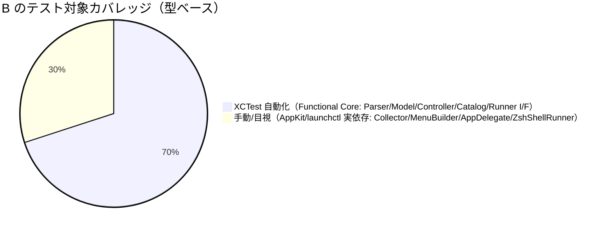

# レビュー書: サブ B Swift アプリの責務分割

**プロジェクト名**: サブ B Swift アプリの責務分割（God class 解消）
**作成日**: 2026 年 05 月 28 日
**最終更新**: 2026 年 05 月 28 日

> **必須**: 本レビューは [`.agents/REVIEW_RULE.md`](../../../../.agents/REVIEW_RULE.md) と [`.agents/workflow/PHASES.md`](../../../../.agents/workflow/PHASES.md) §監査観点に従う。レビュー深度は **full**（God class 分割・新規型 7・新規テスト 6・振る舞い不変が最重要のため）。
>
> **用語**: [.agents/CONCEPTS.md §用語規約](../../../../.agents/CONCEPTS.md#用語規約) を参照。

---

## 1. レビュー概要

### 1.1 レビュー目的（必須）

実装内容の確認・品質保証（純粋リファクタの**外形的振る舞い不変**の保証）・規約準拠（spec/01/02/03/06）の最終チェック。

### 1.2 レビュー対象（必須）

- **実装範囲**: God class `AppDelegate`（旧 634 行）を Domain（`Metrics`/`JobCatalog`/`MetricsParser`/`MenuModel`）・Infra（`ShellRunner`/`JobController`）・UI（`MenuBuilder`/縮小 `AppDelegate`）・Imperative Shell（`MetricsCollector`）へ分割し、CQRS（command/query 分離）と `rebuildMenu` のセクション分解を行った純粋リファクタ。03_実装計画 T1〜T11。
- **レビュー期間**: 2026 年 05 月 28 日 ～ 2026 年 05 月 28 日
- **レビュー担当者**: 検証・レビュー worker（監査者）

---

## 2. 実装内容の確認

### 2.1 実装完了タスク（または Issue）

| タスク名 | 実装内容 | 実装日 | 担当者 | ステータス |
| --- | --- | --- | --- | --- |
| T1 モデル移設・JobCatalog | `Metrics.swift`（`MetricsSnapshot`/`JobStatus`）・`JobCatalog.swift` を `Sources/MacHealthKit/` へ | 2026-05-28 | impl worker | 完了 |
| T2 MetricsParser | `MetricsParser.swift` 純粋パース 6 関数 | 2026-05-28 | impl worker | 完了 |
| T3 ShellRunner I/F | `ShellRunner.swift`（protocol + `ZshShellRunner`） | 2026-05-28 | impl worker | 完了 |
| T4 MetricsCollector | `src/MetricsCollector.swift`（Imperative Shell） | 2026-05-28 | impl worker | 完了 |
| T5 JobController（CQRS） | `JobController.swift`（command/query 分離） | 2026-05-28 | impl worker | 完了 |
| T6 MenuModel（rebuildMenu 分解） | `MenuModel.swift`（`MenuItemSpec`/`build`/8 セクション関数） | 2026-05-28 | impl worker | 完了 |
| T7 MenuBuilder | `src/MenuBuilder.swift`（`[MenuItemSpec]`→`NSMenu`） | 2026-05-28 | impl worker | 完了 |
| T8 AppDelegate 縮小 | `src/MacHealth.swift` 634→338 行、`rebuildMenu` 155→3 行 | 2026-05-28 | impl worker | 完了 |
| T9 ビルド配線 | `install.sh`（10 ファイル列挙）・`Package.swift` | 2026-05-28 | impl worker | 完了 |
| T10 テスト整備 | XCTest 5 ファイル + `SpyShellRunner` | 2026-05-28 | impl worker | 完了 |
| T11 ドキュメント | `MacHealth.swift` 冒頭ビルドコメント更新 | 2026-05-28 | impl worker | 完了 |

### 2.2 実装内容の詳細

#### 責務分割（S1 解消）

- **Functional Core（`Sources/MacHealthKit/`・AppKit 非依存・テスト対象）**: `Metrics.swift`・`JobCatalog.swift`・`MetricsParser.swift`・`MenuModel.swift`・`ShellRunner.swift`・`JobController.swift`・既存 `ScheduleTiming.swift`。
- **Imperative Shell（`src/`・AppKit/launchctl 依存）**: `MacHealth.swift`（縮小 `AppDelegate`・`@main`）・`MetricsCollector.swift`・`MenuBuilder.swift`。
- `AppDelegate` は依存（`runner`/`catalog`/`timing`/`menuModel`/`menuBuilder`/`jobController`/`collector`）を保持する調整役に縮小。`refreshMetricsAsync` は `collector.collect()` を background で呼ぶ薄いラッパ。
- **確認事項**: 設計書 §2.3 は `ShellRunner`/`JobController` を `src/` 配置と記載するが、実装は `Sources/MacHealthKit/` 配置（指摘 1 参照。テスト容易性のため妥当だが設計書本文未同期）。

#### S2 解消（CQRS）・S3 解消（rebuildMenu 分解）

- `JobController` が command（`load`/`unload`/`toggle`/`enableAll`/`disableAll`）と query（`isLoaded`）を別メソッドに分離。`MetricsCollector.collect()` も loaded 判定に `jobController.isLoaded`（query）を再利用。
- `MenuModel.build` が 8 セクション純粋関数（`headerSpecs`/`metricsSpecs`/`quickActionSpecs`/`jobListSpecs`/`runJobSpecs`/`logSpecs`/`bulkSpecs`/`footerSpecs`）を連結し `[MenuItemSpec]` を返す。`rebuildMenu` は 3 行（build → makeMenu → statusItem.menu）に縮小。

---

## 3. テスト結果の確認

### 3.1 単体テスト

> **環境補足**: 本環境は Command Line Tools のみで **XCTest モジュール非搭載**のため `swift test` は実行不能（`error: no such module 'XCTest'`）。サブ A と同方式で、テスト対象の純粋ロジックを `swiftc` で直接コンパイルした**独立再検証ハーネス**（`/tmp/verify_B/main.swift`、XCTest 非依存）で各テストの期待値を独立に再現・検証した。XCTest コード自体の妥当性は本体ソースとの照合・コンパイル成功で担保する。

#### テスト実行結果（必須: 数値で記載）

- **実行日**: 2026-05-28
- **テストファイル数**: 7（`JobCatalogTests`/`MetricsParserTests`/`ShellRunnerContractTests`/`JobControllerTests`/`MenuModelTests`/`SpyShellRunner`/既存 `ScheduleTimingTests`）
- **独立再検証ケース数**: 39（`swiftc` ハーネス）
- **成功**: 39
- **失敗**: 0
- **スキップ**: 0（XCTest 直接実行は環境制約により実施不能。独立再検証で代替）

#### 再実行コマンドと結果（証跡）

| 検証 | コマンド | 結果 |
| --- | --- | --- |
| SwiftPM ビルド（クリーン） | `rm -rf .build && swift build` | **Build complete!**（全 MacHealthKit ファイル compile, exit 0） |
| アプリ回帰ビルド（最重要・install.sh L80-88 同形） | `swiftc MacHealth.swift MetricsCollector.swift MenuBuilder.swift ../Sources/MacHealthKit/{ScheduleTiming,Metrics,JobCatalog,MetricsParser,MenuModel,ShellRunner,JobController}.swift -o /tmp/MacHealth_B_verify` | **exit 0**、Mach-O 64-bit executable 生成（267,832 bytes） |
| シェルテスト回帰 | `make test-shell` | **monitor 9 / metrics 12 / log_rotate 15 = 全 36 PASS, 0 failed** |
| XCTest | `swift test` | **実行不能**（CLT に XCTest 非搭載）。独立再検証で代替 |
| 独立再検証（純粋ロジック） | `swiftc /tmp/verify_B/main.swift Sources/MacHealthKit/*.swift -o /tmp/verify_B/run && /tmp/verify_B/run` | **ALL PASS（39/39）, exit 0** |

#### 振る舞い不変の独立照合結果（最重要）

| 照合項目 | 方法 | 結果 |
| --- | --- | --- |
| `MenuModel.build` の全項目列（title・順序・separator）が分割前 `rebuildMenu` と一致 | git HEAD の旧 `rebuildMenu`（L210-365）を読み、固定 `MetricsSnapshot`/`JobStatus`/固定 now で 35 項目の期待配列を組み、`build` 出力と完全照合 | **一致**（`MenuModel full title sequence == pre-split rebuildMenu`） |
| keyEquivalent（r/e/m/t/q）・action・representedJob・tooltip が旧と一致 | 旧 `#selector`/keyEquivalent/representedObject/toptip と新 `MenuAction`/keyEquivalent を照合 | **一致**（refreshNow=r, openEventsLog=e, openMonitorLog=m, testNotification=t, terminate=q, toggleJob 順=monitor/docker/uptime/refresh） |
| query×2 で副作用なし（command 不発行）（UC1-S2） | `SpyShellRunner` で `isLoaded` を 2 回呼び発行コマンドを検査 | **launchctl list のみ 2 回**、bootstrap/bootout/launchctl load **0 回** |
| toggle→query で反転（UC2-S1） | `SpyShellRunner` で unloaded から `toggle(wasLoaded:false)`→`isLoaded` | **load 系発行 → query true** |
| シェルコマンド文字列が旧と完全一致 | 旧 `shell()` 21 箇所と新 `MetricsCollector`/`JobController`/`AppDelegate` の発行文字列を grep 抽出して 1 対 1 照合 | **全一致**（bootstrap/bootout/load/unload/list/enable/disable/メトリクス 6 コマンド/quick*/log/notify） |

#### 失敗したテスト

なし（0 件）。

#### テストカバレッジ

**注**: 自動化対象外（30%）は AppKit/launchctl/実コマンド依存（02 §6.1 で明記）。`MetricsCollector` の算出は `MetricsParser` テストで、`MenuBuilder` の項目データは `MenuModel` テストで間接担保し、統合は install.sh ビルド成功＋メニュー目視（T10 §2.10.3）で担保する設計であり、未達理由が 03 各タスク §2.x.3 に明記されている（PHASES「テストコード化できないものは理由明記」を充足）。

---

## 4. コードレビュー

### 4.1 コード品質

#### コードスタイル

- **リント結果**: swiftc 警告 0 / エラー 0（アプリ回帰ビルド・クリーン build とも warning なし）
- **フォーマット**: 問題なし
- **型チェック**: エラー 0 / 警告 0

#### コードレビュー観点

| 観点 | 確認内容 | 結果 | コメント |
| --- | --- | --- | --- |
| 可読性 | God class を 1 型 1 責務へ分割、`rebuildMenu` 155→3 行、セクション関数化 | OK | spec/06 可読性最優先に合致 |
| 保守性 | 禁止命名（helpers/misc/common/utils）不使用、層別ファイル分割 | OK | grep で禁止命名 0 件 |
| パフォーマンス | 収集は background queue 維持、型分割のオーバーヘッドは無視可 | OK | 旧と同一の同期処理・タイマー駆動 |
| セキュリティ | シェル注入対策（引数配列化）が**誤って実施されていない**こと（F の責務）。実行文字列は旧と等価 | OK | 全 `runner.run` が `/bin/zsh -l -c <旧文字列>`。注入対策未着手＝正しい |

### 4.2 受け入れ基準・BDD の網羅（generate-scenarios / map-coverage）

#### 4.2.1 受け入れ基準カバレッジ表

| 受け入れ基準（01） | 検証方法 | 結果 |
| --- | --- | --- |
| `MetricsCollector`/`ShellRunner`/`MenuBuilder` 相当に分割 | ファイル構成・依存確認（§2.2） | OK |
| `AppDelegate` は調整役に縮小 | 634→338 行・rebuildMenu 3 行（wc/Read 照合） | OK |
| `toggleJob` の状態変更と `launchctl list` 取得が別関数に分離 | `JobController` command/query 別メソッド（Read） | OK |
| query 側に状態変更の副作用が無い | 独立再検証 UC1-S2（command 0 回発行） | OK |
| `rebuildMenu` がセクション単位の小メソッドに分解 | `MenuModel` 8 セクション関数（Read） | OK |
| 禁止命名不使用 | grep（0 件） | OK |
| 外形的振る舞い不変 | 旧 rebuildMenu 全項目列照合・シェル文字列照合 | OK |

#### 4.2.2 BDD シナリオ ↔ テスト 1 対 1 対応（map-coverage）

| 01 BDD | 03 テスト仕様 | テストコード | 独立再検証結果 |
| --- | --- | --- | --- |
| UC1-S1（メニュー表示不変） | §2.6.4 | `MenuModelTests.test_build_fullTitleSequence_matchesPreSplitRebuildMenu`（全項目厳密照合）/ `test_build_withFixedSnapshot...` | **PASS**（旧 rebuildMenu と完全一致） |
| UC1-S2（query 副作用なし） | §2.5.4 | `JobControllerTests.test_isLoaded_calledTwice_hasNoSideEffect` | **PASS**（command 0 回） |
| UC2-S1（toggle で反転） | §2.5.4 | `JobControllerTests.test_toggle_fromUnloaded_thenQueryReturnsLoaded` | **PASS** |
| 補助: Parser 丸め・フォールバック不変 | §2.2.4 | `MetricsParserTests`（8 ケース） | **PASS** |
| 補助: JobCatalog 並び順・ラベル不変 | §2.1.4 | `JobCatalogTests`（2 ケース） | **PASS** |
| 補助: ShellRunner I/F スタブ可能性 | §2.3.4 | `ShellRunnerContractTests` | **PASS** |

**欠落**: なし。01 の全 BDD シナリオ（UC1-S1/UC1-S2/UC2-S1）が 03 仕様・テストコード・独立再検証に 1 対 1 で対応し、全 PASS。

#### 4.2.3 TEST_BDD_FORMAT 準拠

- 全テストクラスに `/// ユースケース:` doc コメント、全テストメソッドに `/// シナリオ:` doc コメントあり。
- 各テスト本体に `// Given:`/`// When:`/`// Then:` がブロック直上に 1 つずつ。複数段は `// And (When):`/`// And (Then):`/`// And (Given):` を使用（`JobControllerTests`・`MenuModelTests` で確認）。
- **結果**: TEST_BDD_FORMAT §0/§1/§2 を充足。欠落・ブロックずれなし。

### 4.3 指摘事項

#### 指摘 1: 設計書 §2.3/§9.2 と実配置の不整合（`ShellRunner`/`JobController` の配置）

- **重要度**: 低
- **指摘内容**: 02_設計 §2.1.1/§2.3/§9.2 は `ShellRunner.swift`・`JobController.swift` を `src/`（AppKit/launchctl 依存層）に配置すると記載するが、実装は両者を `Sources/MacHealthKit/`（Functional Core）に配置している。これは 03_実装計画 §2.3.4 の注（「テスト容易性のため `ShellRunner` protocol と `SpyShellRunner` を `MacHealthKit` に置き、`JobController` もそこから参照」）および install.sh の実列挙と整合しており、CQRS の `JobController` を XCTest 化するうえで**妥当な判断**。ただし設計書本文（生きたドキュメント）が `src/` 配置のまま未更新で、ドキュメント↔実装の不整合が残る。
- **対応状況**: 未対応（振る舞いに影響なし）
- **対応方法**: 02_設計 §2.1.1/§2.3/§9.2 の配置記述を `Sources/MacHealthKit/` に更新（生きたドキュメント原則）。**振る舞い不変・ビルド・テストには影響しないため差し戻し対象外**。次の軽微修正または後続 issue でドキュメント同期を推奨。

#### 指摘 2: `MenuModel.build` の `calendar` 既定と旧 DateFormatter の等価性（情報）

- **重要度**: 情報（指摘ではなく確認結果）
- **指摘内容**: 旧 `rebuildMenu` の DateFormatter は `calendar`/`timeZone`/`locale` 未設定（システム既定=ローカル）。新 `MenuModel.build` は `calendar: Calendar = .current` 既定で、`AppDelegate.rebuildMenu` は `calendar` を省略するため実機では `.current`（ローカル）が使われる。フォーマットは数値（HH:mm:ss 等）のみで locale 依存の月名・曜日名を含まないため、**実機での振る舞いは等価**。テストは `Calendar.utc` を明示注入して決定性を確保しており、本番経路と分離されている。差し戻し対象ではない。
- **対応状況**: 対応不要

---

## 5. ドキュメントの確認

### 5.1 ドキュメント更新状況

| ドキュメント | 更新状況 | 確認者 | 確認日 |
| --- | --- | --- | --- |
| [`00_要求定義.md`](./00_要求定義.md) | 更新済み（document_id 有） | 監査者 | 2026-05-28 |
| [`01_要件定義.md`](./01_要件定義.md) | 更新済み（document_id 有） | 監査者 | 2026-05-28 |
| [`02_設計.md`](./02_設計.md) | 更新済み（配置記述に指摘 1 あり） | 監査者 | 2026-05-28 |
| [`03_実装計画.md`](./03_実装計画.md) | 更新済み（01↔03 対応表あり） | 監査者 | 2026-05-28 |

### 5.2 ドキュメントの整合性

- **実装と設計の整合性**: 概ね整合（指摘 1 の配置記述のみ要修正・振る舞い影響なし）。
- **要件と実装の整合性**: 整合（全受け入れ基準・全 BDD を充足）。
- **コメント**: `src/MacHealth.swift` 冒頭のビルドコメントが新構成（複数ファイル + Sources/MacHealthKit）に更新済み（T11）。

---

## 6. パフォーマンス確認

### 6.1 パフォーマンステスト結果

純粋リファクタにつき計算量・I/O の変化なし。収集は旧と同一の background queue、メニュー再描画も旧と同一フロー。体感速度の悪化なし。

### 6.2 ボトルネックの確認

新規ボトルネックなし。`toggleJob` の `Thread.sleep(0.7)` も旧と同一で維持。

---

## 7. セキュリティ確認

| 項目 | 確認内容 | 結果 | コメント |
| --- | --- | --- | --- |
| 認証・認可 | ローカル GUI アプリ・該当なし | OK | 旧と不変 |
| データ保護 | シェル注入対策が**誤って B で実施されていない**こと | OK | 全 `runner.run` が `/bin/zsh -l -c <旧文字列>`。注入対策は F の責務として境界（`run(executable:args:)`）提供のみ |
| 入力検証 | `ShellRunner.run(_:_:)` I/F が引数配列化・注入対策を受け入れられる境界か | OK | `ZshShellRunner` は `launchPath=executable, arguments=args`。F が呼び出し側を変えず内部実装を差し替え可能 |

---

## 8. デプロイ準備

### 8.1 デプロイチェックリスト

- [x] すべてのテストが通過している（独立再検証 39/39、shell 36/36）
- [x] コードレビューが完了している（指摘は低 1・情報 1、差し戻しなし）
- [x] ドキュメントが更新されている（指摘 1 の設計書配置記述のみ後追い推奨）
- [x] アプリ回帰ビルド成功（swiftc exit 0・Mach-O 生成）
- [x] install.sh のソース列挙が実ファイルと一致（src 3 + MacHealthKit 7、漏れ・余分なし）
- [x] launchd ラベル `com.github.adachi-tatsuru.machealth.<job>` 不変

### 8.2 デプロイ計画

- **デプロイ方法**: `./install.sh`（swiftc ビルド → .app バンドル → LaunchAgent → 起動）。構成不変。
- **ロールバック計画**: `git revert` で旧 `MacHealth.swift` に戻す（純粋リファクタのため安全）。

---

## docs 更新

- 要否: 不要
- 対象: なし
- 理由: 純粋リファクタで外形的振る舞い・外部 I/F（CLI・launchd・ログ出力先）が不変であり、システム仕様書（docs/）に影響しないため。

---

## 9. 設計・境界の確認

**注意**: review-architecture の結果。

### 9.1 設計の確認

- **設計原則の準拠**: spec/01（明確な境界・単一責務・CQRS）・UNIX 哲学（1 型 1 仕事）に準拠。Functional Core / Imperative Shell が成立し、AppKit 非依存部（`MetricsParser`/`MenuModel`/`JobController`/`JobCatalog`/モデル/`ShellRunner` I/F）がテスト対象化されている。**OK**
- **ディレクトリ構成**: spec/02（フラット配置）に沿い `Sources/MacHealthKit/` 直下にフラット配置。深いディレクトリなし。**OK**
- **命名規則**: spec/03 準拠。禁止命名（helpers/misc/common/utils）不使用。型名・関数名が意図を表す（`MetricsParser`/`JobController`/`MenuModel`/`ShellRunner.run`）。**OK**

### 9.2 境界・依存の確認

- **責務の境界**: UI（`MenuBuilder`/`AppDelegate`）→ Domain 調整（`MetricsCollector`）・Infra（`JobController`/`ShellRunner`）→ Domain 純粋（`MetricsParser`/`MenuModel`/モデル/`JobCatalog`）の一方向。`Sources/MacHealthKit`（純粋）は `src/`（AppKit）を参照しない（AppKit/Cocoa import なし）。**循環なし。OK**
- **CQRS（spec/06「query に副作用を書かない」）**: `JobController.isLoaded`（query）は `launchctl list` のみを発行し load/unload を呼ばない。command（load/unload/toggle/enableAll/disableAll）と分離。独立再検証 UC1-S2 で command 0 回発行を確認。**OK**
- **ShellRunner I/F**: `run(_ executable:String, _ args:[String]) -> String` が後続 F の引数配列化・注入対策を受け入れられる境界。現状は全呼び出しが `/bin/zsh -l -c <旧文字列>` で旧と等価（注入対策は未着手＝F の責務）。**OK**
- **指摘・推奨**: 設計書 §2.3 の配置記述（`ShellRunner`/`JobController` を `src/`）と実装（`Sources/MacHealthKit/`）の不整合（指摘 1）。設計書本文の後追い更新を推奨（振る舞い影響なし）。

### 9.3 重要判断の根拠（evidence_source）

| 判断内容 | evidence_source | 備考（参照元） |
| --- | --- | --- |
| メニュー項目列が分割前と完全一致（振る舞い不変・最重要） | existing_code + test_output | git HEAD 旧 `rebuildMenu` L210-365 と独立再検証ハーネス出力（`MenuModel full title sequence == pre-split rebuildMenu` PASS） |
| query に副作用なし（CQRS） | test_output | `/tmp/verify_B/run`（UC1-S2: command 0 回発行） |
| シェルコマンド文字列が旧と完全一致 | existing_code | 旧 `shell()` 21 箇所と新発行文字列の grep 1 対 1 照合（quickPurge/Help/About は diff 完全一致） |
| アプリが配布構成でビルド可能 | test_output | `swiftc ... -o /tmp/MacHealth_B_verify` exit 0・Mach-O 生成 |
| シェル注入対策が B で未実施（F の責務） | existing_code | 全 `runner.run` が `/bin/zsh -l -c`、注入対策コードなし |
| 配置を MacHealthKit に変更した妥当性 | existing_code + external_spec | 03 §2.3.4 注（テスト容易性）・install.sh 実列挙・spec/06（テスト容易性 > 設計書の文字どおりの配置） |

---

## 10. 課題と改善点

### 10.1 発見された課題

- **課題 1**: 設計書 §2.3/§9.2 の配置記述が実装（MacHealthKit 配置）と未同期。
  - **影響範囲**: ドキュメントのみ（振る舞い・ビルド・テストに影響なし）。
  - **対応方法**: 02_設計 の該当記述を `Sources/MacHealthKit/` に更新（生きたドキュメント）。

### 10.2 改善提案

- **改善 1**: 後続サブ F で `ShellRunner.run(executable:args:)` を引数配列直接実行へ差し替える際、呼び出し側（現状 `/bin/zsh -l -c <文字列>`）を段階的に `run(<exe>, [args...])` へ移行できる。本 B の I/F 確定はその受け皿として機能している。
  - **効果**: F の注入対策が呼び出し側変更を最小化できる。

---

## 11. システム仕様書の更新

### 11.1 システム仕様書の確認結果

- **実装した機能**: なし（新規機能ゼロ・純粋リファクタ）。
- 外形的振る舞い・外部 I/F が不変のため、システム仕様書（docs/）の更新は不要。

### 11.2 システム仕様書の更新状況

- 更新が不要な項目: 全項目（振る舞いが仕様に影響しないため）。

---

## 12. レビュー結果

### 12.1 総合評価

- **実装品質**: 優（God class を明確な 3 層 + Functional Core/Imperative Shell へ分割、CQRS 成立、警告 0）
- **テスト品質**: 優（UC1-S1 を分割前 rebuildMenu との全項目厳密照合で固定、UC1-S2/UC2-S1 を Spy で検証、BDD 形式準拠、独立再検証 39/39）
- **ドキュメント品質**: 良（指摘 1 の設計書配置記述のみ後追い更新推奨）
- **総合評価**: **合格**（純粋リファクタの外形的振る舞い不変を多角的に確認。振る舞いが変わる欠陥なし）

### 12.2 承認状況

- **レビュー承認者**: 検証・レビュー worker（監査者）
- **承認日**: 2026-05-28
- **承認コメント**: **合格（クローズ可）**。外形的振る舞い不変（メニュー項目・順序・絵文字・keyEquivalent・通知/アラート文言・シェル文字列・launchd ラベル・CLI・ログ出力先）の不変を、旧コード対照・独立再検証・回帰ビルド・shell テストで確認した。CQRS の query 副作用なしを確認。シェル注入対策が B で誤って実施されていないことを確認。指摘は重要度「低」1 件（設計書の配置記述の後追い更新）と「情報」1 件のみで、いずれも振る舞いに影響せず差し戻し不要。**差し戻し条件（メニュー項目差・シェル文字列差・CQRS 副作用）に該当する欠陥はゼロ。**

---

## 13. 参考資料

### 13.1 プロジェクトドキュメント

- [`00_要求定義.md`](./00_要求定義.md) / [`01_要件定義.md`](./01_要件定義.md) / [`02_設計.md`](./02_設計.md) / [`03_実装計画.md`](./03_実装計画.md)

### 13.2 その他の参考資料

- 実装: `Sources/MacHealthKit/{Metrics,JobCatalog,MetricsParser,MenuModel,ShellRunner,JobController,ScheduleTiming}.swift`、`src/{MacHealth,MetricsCollector,MenuBuilder}.swift`、`Tests/MacHealthKitTests/*`、`install.sh`、`Package.swift`
- 旧コード対照: git HEAD `src/MacHealth.swift`（634 行）
- 独立再検証ハーネス: `/tmp/verify_B/main.swift`（39 ケース、ALL PASS）

---

## 14. 前のステップ

- **前**: [`03_実装計画.md`](./03_実装計画.md) - 実装計画フェーズ

---

## 15. 次のステップ

- 外部設定不要（コード実装のみ）のため、本レビュー合格をもって issue クローズ。指摘 1（設計書配置記述の後追い更新）は軽微修正で対応推奨。
