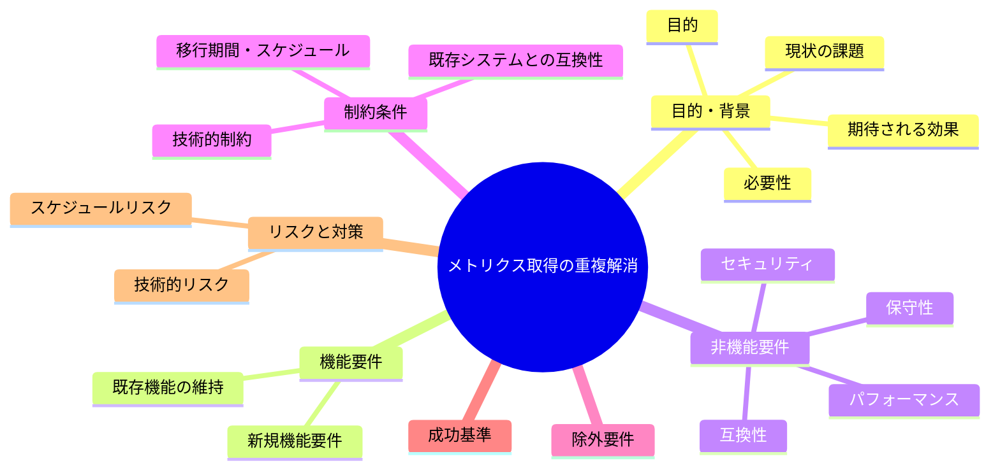
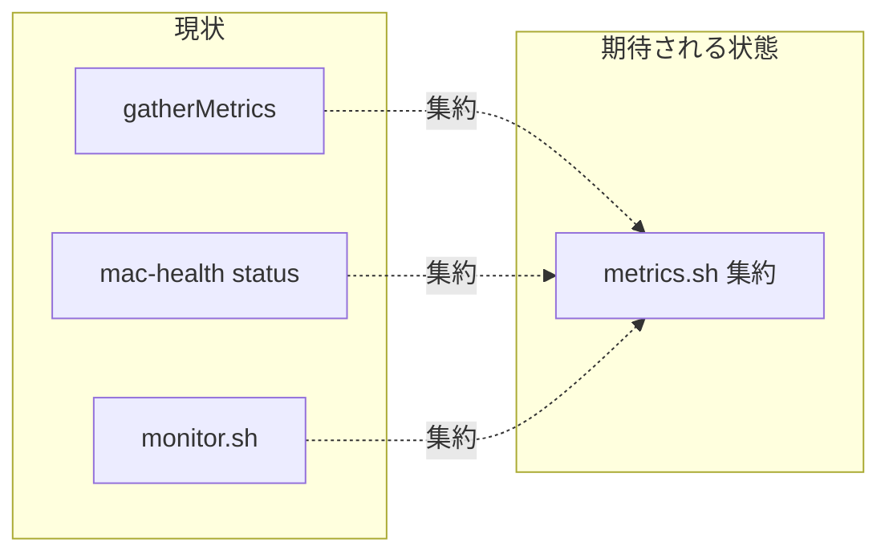

# 要求定義書: サブ C メトリクス取得ロジックの重複解消

**プロジェクト名**: サブ C メトリクス取得ロジックの重複解消
**作成日**: 2026 年 05 月 27 日
**最終更新**: 2026 年 05 月 27 日

> **重要**:
>
> - 要求定義書は全体像を把握するためのものです。詳細は要件定義書以降で記載します。
> - **このドキュメントは常に更新**します。
> - **必須項目**: 判定可能な形で記入すること。
>
> **用語**: [.agents/CONCEPTS.md §用語規約](../../../../.agents/CONCEPTS.md#用語規約) を参照。

---

## 要求定義の全体像

---

## 1. 目的・背景

### 1.1 目的（必須）

3 箇所に重複するメトリクス取得を単一の参照源へ集約し DRY を満たす。

### 1.2 背景

- **現状の課題**:
  - S4: 同一のメトリクス取得パイプライン（`sysctl vm.swapusage` / `vm_stat` 圧縮ページ / `memory_pressure` / `uptime` load）が 3 箇所に重複。
    - `src/MacHealth.swift` `gatherMetrics()`(L113-150)
    - `scripts/bin/mac-health` status(L50-77)
    - `scripts/bin/monitor.sh`(L42-65)
  - DRY 違反・再利用性低下・仕様整合のリスク（1 箇所だけ直して他がずれる）。

- **必要性**:
  - メトリクス定義を 1 箇所に集約しないと、閾値・単位の不整合が再発する。

### 1.3 期待される効果（必須: 1 件以上）

- **効果 1**: シェル側のメトリクス取得が `scripts/lib/metrics.sh` に集約され `mac-health`/`monitor.sh` が参照する（○/× 判定可）。
- **効果 2**: 同一入力に対するメトリクス出力が集約前後で一致する（○/× 判定可）。
- **効果 3**: メトリクス定義の変更が 1 箇所の修正で全参照に反映される（○/× 判定可）。

**現状と期待される状態の比較**:

---

## 2. 機能要件

### 2.1 既存機能の維持（該当する場合）

- メトリクス表示・閾値判定の結果は不変に保つ。

### 2.2 新規機能要件

- シェル共通のメトリクス取得関数群（swap/compressed/load/pressure/uptime）を `scripts/lib/metrics.sh` に新設し、`mac-health` と `monitor.sh` から参照する。
- Swift 側は集約後のシェル関数を呼ぶか、出力フォーマットを一致させる方針を 02 で決める。

---

## 3. 非機能要件

### 3.1 パフォーマンス

- 集約による余計なプロセス起動増を最小化する。

### 3.2 セキュリティ

- 集約関数内のコマンド構成も注入耐性を意識する（詳細はサブ F）。

### 3.3 互換性

- 出力単位（MB/GB/%）・キー名を変えない。

### 3.4 保守性

- `metrics.sh` は spec/03 の意図が分かる関数名を用いる（禁止命名を使わない）。

---

## 4. 制約条件

### 4.1 技術的制約

- Bash。`scripts/lib/` 配下に配置（既存の `log.sh`/`notify.sh` と同層）。
- spec/02 の shared 肥大化禁止に留意し、メトリクスは「メトリクス取得」という単一責務に閉じる。

### 4.2 既存システムとの互換性

- `mac-health` の status 出力フォーマットを変えない。

### 4.3 移行期間・スケジュール

- サブ A のテストで集約前後の出力一致を検証できると安全。

---

## 5. 除外要件

- 新規メトリクス種別の追加は対象外。

---

## 6. 成功基準（必須: 1 件以上）

- `scripts/lib/metrics.sh` が新設され、swap/compressed/load/pressure/uptime の取得が集約されている。
- `mac-health` と `monitor.sh` がそれを参照し、独自の重複実装が無くなる。
- 集約前後で同一環境のメトリクス出力が一致する。

---

## 7. リスクと対策

### 7.1 技術的リスク

- **リスク**: Swift とシェルで微妙に出力が異なる（丸め・単位）。
  - **対策**: 集約前後の出力比較を受け入れ基準にし、丸めルールを 02 で明文化する。

### 7.2 スケジュールリスク

- **リスク**: 3 箇所同時変更で回帰が出る。
  - **対策**: シェル 2 箇所を先に集約し、Swift は方針確定後に対応する。

---

## 8. 参考資料

### プロジェクトドキュメント

- 親要求: [../../00_要求定義.md](../../00_要求定義.md)
- 設計規約: `.agents/spec/02_ディレクトリ構造方針.md`, `03_命名規則.md`

### その他の参考資料

- `src/MacHealth.swift`(L113-150)、`scripts/bin/mac-health`(L50-77)、`scripts/bin/monitor.sh`(L42-65)

---

## 9. 次のステップ

- **次**: [`01_要件定義.md`](./01_要件定義.md) - 要件定義フェーズ
