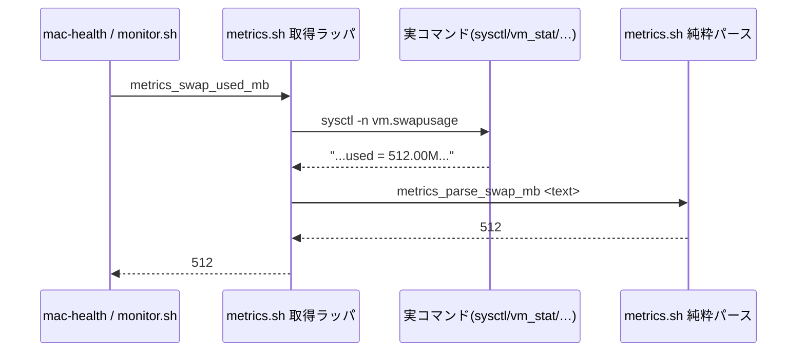
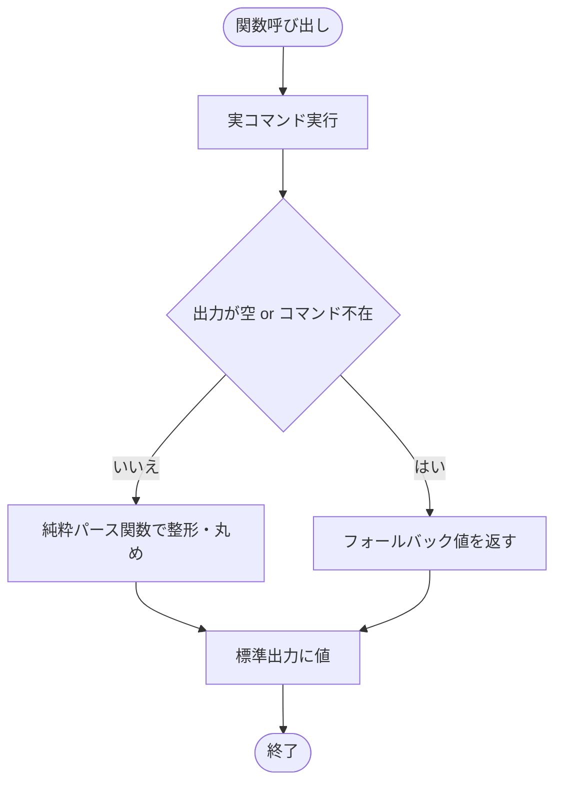

# 設計書: サブ C メトリクス取得ロジックの重複解消

**プロジェクト名**: サブ C メトリクス取得ロジックの重複解消
**作成日**: 2026 年 05 月 28 日
**最終更新**: 2026 年 05 月 28 日

> **重要**: **このドキュメントは常に更新**: 設計の変更や追加があった場合は、即座にこのドキュメントを更新してください。ドキュメントは「生きているドキュメント」として扱い、実装内容と常に同期させます。
>
> **用語**: [.agents/CONCEPTS.md §用語規約](../../../../.agents/CONCEPTS.md#用語規約) を参照。

---

## 1. 設計概要

### 1.1 設計方針

3 箇所に重複する「生メトリクス取得」（`sysctl vm.swapusage` / `vm_stat` 圧縮ページ / `memory_pressure` / `uptime` load / `kern.boottime` / docker 判定）を、**メトリクス取得という単一責務に閉じた** `scripts/lib/metrics.sh` に集約し、`mac-health` status と `monitor.sh` から source して参照する。閾値判定（A の `notification_cooldown.sh`）・通知（`notify.sh`）・ログ（`log.sh`）は含めない。spec/06 の優先順位（可読性 > 単一責務 > 仕様との整合性）に従い、出力書式・単位・丸めは現状を完全踏襲する。

### 1.2 設計原則（本プロジェクトで適用するもの）

- **UNIX哲学**: `metrics.sh` は「メトリクスを取得する」という 1 つのことだけをやり、判定・通知・ログとは組み合わせ可能な形で分離する。各取得関数は標準出力に値を 1 つ返す小さな部品とする。
- **単一責務**: `metrics.sh` は「生メトリクス取得」のみ。閾値判定（A）・通知（notify.sh）・ログ（log.sh）は持ち込まない（spec/02 の shared 肥大化禁止・spec/06「再利用のために責務を曖昧にしない」に従う）。
- **明確な境界**: コマンド実行を伴う「取得ラッパ関数」と、コマンド出力テキストを引数で受ける「純粋パース関数」を分離し、後者を固定入力でテスト可能にする（A の `notification_cooldown.sh` と同じ方式）。
- **AIフレンドリー設計**: 意図が分かる関数名（`metrics_swap_used_mb` 等）を用い、禁止命名（helpers/misc/common/utils）を使わない。ファイルは `scripts/lib/` 直下に 1 枚（深いネストを作らない）。

> 本プロジェクトでは CQRS・イベント駆動は適用しない（同期的な値取得のみで、状態変更・イベント発行が無いため。spec/06「単純な同期処理で十分な場合は無理に導入しない」）。

---

## 2. アーキテクチャ設計

### 2.1 責務・境界・参照関係

#### 2.1.1 責務一覧

| コンポーネント | 責務（1 文） |
| -------------------- | -------------------- |
| `scripts/lib/metrics.sh`（取得ラッパ関数群） | 実コマンド（sysctl/vm_stat/memory_pressure/uptime/pgrep/docker）を実行し、生メトリクスを単位付きの標準出力で返す |
| `scripts/lib/metrics.sh`（純粋パース関数群） | コマンド出力テキストを引数で受け取り、丸め・単位換算した値を標準出力で返す（外部コマンド非依存・テスト対象） |
| `scripts/bin/mac-health`（status） | LaunchAgent 状態・直近イベントの表示と、`metrics.sh` の取得結果を**現状と同一書式**で整形・出力する |
| `scripts/bin/monitor.sh` | `metrics.sh` で取得した値を A の判定関数（`classify_pressure`/`exceeds_threshold`/`should_notify`）に渡し、通知・ログを行う |
| `src/MacHealth.swift` `gatherMetrics()` | メニューバー表示用にメトリクスを取得する（本 issue では (b) 方針で現状維持。丸め・単位ルールを metrics.sh と一致させる旨を明記） |

#### 2.1.2 境界

- **入力**: 取得ラッパ関数は引数なし（実コマンドを内部で実行）。純粋パース関数はコマンド出力テキスト・ページ数・boot epoch 等を引数で受ける。
- **出力**: 各関数は標準出力に値を 1 つ返す（数値または既定のフォールバック文字列）。戻り値（終了コード）では値を返さない。
- **他責務との境界**:
  - **A（`notification_cooldown.sh`）との分離**: `metrics.sh` は閾値判定（`exceeds_threshold`）・分類（`classify_pressure`）・クールダウン（`should_notify`）を**持たない**。`classify_pressure` は A の責務であり C では触れない。C は free_pct の**生取得**（`metrics_memory_free_pct`）までを担う。
  - **D/通知・ログとの分離**: `notify`/`log`/`log_event` は呼ばない。
  - **本 issue 範囲外**: 新規メトリクス種別の追加（00 §5）、コマンド構成の注入耐性強化（サブ F）、Swift の実コマンド呼び出しへの統合（将来）。

#### 2.1.3 参照関係

- `scripts/bin/mac-health` → `scripts/lib/metrics.sh`（source して取得関数を呼ぶ）
- `scripts/bin/monitor.sh` → `scripts/lib/metrics.sh`（source して取得関数を呼ぶ）
- `scripts/bin/monitor.sh` → `scripts/bin/notification_cooldown.sh`（A。判定。**C で不変**）
- `scripts/lib/metrics.sh`（取得ラッパ）→ `scripts/lib/metrics.sh`（純粋パース）
- `scripts/test/metrics_test.sh` / `metrics.bats` → `scripts/lib/metrics.sh`（source して純粋パース関数を検証）
- `src/MacHealth.swift` → （C では metrics.sh を参照しない。(b) 方針）

循環参照なし。`metrics.sh` は `log.sh`/`notify.sh`/`thresholds.sh`/`notification_cooldown.sh` のいずれも source しない（一方向依存）。

### 2.2 システムアーキテクチャ

- **採用パターン**: レイヤード（取得レイヤ＝metrics.sh / 判定レイヤ＝notification_cooldown.sh / 表示・通知レイヤ＝mac-health・monitor.sh）。さらに取得レイヤ内で「I/O ラッパ」と「純粋関数」を分離する Functional Core / Imperative Shell。
- **根拠**: spec/01 の単一責務・明確な境界、spec/06 の可読性・単一責務優先。A で確立した「純粋関数を source してテスト」する構造（`notification_cooldown.sh`）と一貫させ、構造の一貫性（spec/06「テクニックより構造の一貫性」）を保つ。

#### 2.2.2 アーキテクチャ図（本プロジェクトの構成で記載）

```mermaid
flowchart TD
    MH[mac-health status] -->|source| MET[lib/metrics.sh 取得ラッパ]
    MON[bin/monitor.sh] -->|source| MET
    MON -->|source 既存・C不変| NC[bin/notification_cooldown.sh A 判定]
    MET --> PARSE[lib/metrics.sh 純粋パース関数]
    TEST[test/metrics_test.sh / metrics.bats] -->|source| PARSE
    SW[src/MacHealth.swift gatherMetrics b現状維持] -. 丸め・単位を metrics.sh と一致 .-> PARSE
```

### 2.3 コンポーネント構成

- **取得レイヤ `scripts/lib/metrics.sh`（新設・`log.sh`/`notify.sh` と同層）**:
  - 純粋パース関数（外部コマンド非依存）: `metrics_parse_swap_mb`、`metrics_parse_compressed_gb`、`metrics_parse_load_1m`、`metrics_parse_free_pct`、`metrics_uptime_days`、`metrics_uptime_hours`。
  - 取得ラッパ関数（実コマンド実行）: `metrics_swap_used_mb`、`metrics_compressed_gb`、`metrics_load_1m`、`metrics_memory_free_pct`、`metrics_uptime_days_now`/`metrics_uptime_hours_now`（boot を実取得して純粋関数へ委譲）、`metrics_docker_status`。
- **判定レイヤ `scripts/bin/notification_cooldown.sh`（A・不変）**: 取得した値を判定する。C では参照のみ。
- **表示・通知レイヤ**: `mac-health`（status 整形表示）、`monitor.sh`（取得 → 判定 → 通知・ログ）。

### 2.4 データフロー

本機能はメトリクス取得（Query 相当）のみで、状態変更・イベント発行を行わない。発行イベントは無し（同期取得のみ）。



---

## 3. 機能設計

### 3.1 機能 1: metrics.sh の取得関数群

#### 3.1.1 概要

swap/compressed/load/free_pct/uptime/docker の生取得を関数化し、現状の出力・単位・丸め・フォールバックを完全踏襲する。

#### 3.1.2 処理フロー



#### 3.1.3 入力・出力

各関数の契約（**現状の各参照元の挙動から導出**。下表の「フォールバック」は呼び出し元での既定値）:

| 関数（取得ラッパ） | 内部コマンド | 出力 | 単位 | 丸めルール | コマンド不在/空時 |
| ---- | ---- | ---- | ---- | ---- | ---- |
| `metrics_swap_used_mb` | `sysctl -n vm.swapusage` | swap 使用量の整数 | MB | `awk '{printf "%d", $1}'`（切り捨て整数化） | `0`（monitor 互換）。mac-health は表示時に `?`/`—` を付与する側で処理 |
| `metrics_compressed_gb` | `vm_stat`（compressor ページ） | 圧縮メモリ | GB | `awk 'BEGIN{printf "%.1f", p*4096/1024/1024/1024}'`（小数 1 桁） | ページ数 `0` → `0.0` |
| `metrics_load_1m` | `uptime` | Load Avg(1分) の小数 | 倍率なし | `awk '{printf "%.1f", $1}'`（小数 1 桁） | `0`（monitor 互換） |
| `metrics_memory_free_pct` | `memory_pressure` | メモリ空き率 | % | 整数（コマンド出力そのまま。換算なし） | `100`（monitor 互換） |
| `metrics_uptime_days_now` | `sysctl -n kern.boottime` | 稼働日数 | 日 | `(now-boot)/86400`（整数除算） | boot 取得不可時は now を代入（差 0） |
| `metrics_uptime_hours_now` | 同上 | 稼働時間の端数 | 時 | `(now-boot)%86400/3600`（整数除算） | 同上 |
| `metrics_docker_status` | `pgrep`/`docker ps` | `running\t<n>` または `stopped` | 個数 | コンテナ数は `wc -l \| tr -d ' '`、空なら `?` | 非稼働なら `stopped` |

純粋パース関数（テスト対象・引数で出力テキスト等を受ける）:

| 関数 | 入力(引数) | 出力 | 丸め |
| ---- | ---- | ---- | ---- |
| `metrics_parse_swap_mb` | vm.swapusage テキスト | MB 整数 | `%d`（切り捨て） |
| `metrics_parse_compressed_gb` | compressor ページ数 | GB | `%.1f` |
| `metrics_parse_load_1m` | uptime テキスト | 小数 1 桁 | `%.1f` |
| `metrics_parse_free_pct` | memory_pressure テキスト | 整数% | 換算なし |
| `metrics_uptime_days` | now, boot（epoch） | 日 | `(now-boot)/86400` |
| `metrics_uptime_hours` | now, boot（epoch） | 時 | `(now-boot)%86400/3600` |

**重要（書式互換）**: `metrics.sh` の取得関数は**裸の値**（例 swap=`512`、compressed=`0.0`、free_pct=`78`）を返す。単位記号や `?`/`—`/`%` の付与・ラベル整形は**呼び出し元（mac-health/monitor.sh/Swift）が現状どおり**行う。これにより 01 §3.3/§4.2「出力書式・キー名・単位不変」を満たす。

##### 現状書式の維持マッピング（参照側）

- `mac-health` status:
  - `swap used : %s`（現状 `512.00M` のように `M` 付き正規表現）→ **現状は `M` 付きの文字列**を表示している点に注意。`metrics_swap_used_mb` は MB 整数を返すため、mac-health の swap 表示は**現状の `sed` 抽出（`...used = ([0-9.]+M)`）と等価な表示関数を metrics.sh に別途用意するか、status 専用に `metrics_swap_used_raw`（`512.00M` 文字列）を提供**して書式不変を保証する（詳細は §3.1.4・03 タスク 3 で確定）。
  - `compressed mem : %sGB`、`memory free : %s%%`、`uptime : %dd %dh`、`load avg (1m) : %s`、`docker : running (containers=%s)` / `not running` を**完全不変**で再現する。
- `monitor.sh`: `swap=${swap_used_mb}MB compressed=${compressed_gb}GB load1m=${load_1m} cores=${ncpu} pressure=${mem_pressure}` のログ行・通知文・`key:epoch`・閾値判定経路を不変に保つ（取得部のみ関数化）。

#### 3.1.4 エラーハンドリング

- コマンド不在（`memory_pressure`/`docker` 等が無い）でも `2>/dev/null` と既定値で従来同様にフォールバック（01 §3.4 可用性）。
- swap は mac-health（`512.00M` 文字列表示）と monitor.sh（MB 整数）で**現状の利用形態が異なる**。書式不変のため、metrics.sh は両用途を満たす関数を提供する:
  - `metrics_swap_used_mb`（MB 整数。monitor.sh 用）
  - `metrics_swap_used_raw`（`used = ([0-9.]+M)` 抽出のまま。mac-health status 用）
  両者は同じ `sysctl -n vm.swapusage` 出力を入力とし、純粋パース関数で分岐する。これにより「同一入力に対し集約前後で出力一致」（00 効果 2 / 01 ストーリー 2）を担保する。
- **load も swap と同型の分岐が必要（実装時に判明・本 issue で是正）**: mac-health status の load 表示は**元々 `sed` 抽出のみで `%.1f` 整形をしていない**（例 `11.83` を 2 桁のまま表示）一方、monitor.sh は `%.1f` 整形している（例 `11.8`）。書式完全不変のため、metrics.sh は両用途を提供する:
  - `metrics_load_1m`（`%.1f` 小数1桁。monitor.sh 判定用）/ `metrics_parse_load_1m`
  - `metrics_load_1m_raw`（素の抽出値。mac-health status 表示用）/ `metrics_parse_load_1m_raw`
  両者は同じ `uptime` 出力を入力とし、純粋パース関数で分岐する。これにより mac-health status の load 表示が集約前後で完全一致する（実検証済み: 固定入力 `load averages: 11.83 …` で raw=`11.83` / rounded=`11.8`）。

### 3.2 機能 2: 参照側の置換

#### 3.2.1 概要

`mac-health` status と `monitor.sh` のメトリクス取得部のみを `metrics.sh` の関数呼び出しに置換する。

#### 3.2.2 入力・出力

- 入力: `metrics.sh` を source。
- 出力: `mac-health` の status 出力書式・キー名・単位は完全不変。`monitor.sh` の判定経路・ログ・通知文・`key:epoch`・launchd ラベルは不変。

#### 3.2.3 エラーハンドリング

- source 失敗時は従来同様にコマンドが見つからずフォールバック表示になる（致命的エラーで落とさない。`set -u` 下でも未定義変数を作らない）。

### 3.3 機能 3: Swift 側の方針（(a)/(b) の決定）

#### 3.3.1 決定: **(b) Swift 側は現状維持**（丸め・単位ルールを metrics.sh と一致させると明記し、将来統合）

#### 3.3.2 根拠（(a) との比較）

| 観点 | (a) Swift から `zsh -lc 'source metrics.sh; <fn>'` で呼ぶ | (b) Swift 現状維持＋ルール一致明記（採用） |
| ---- | ---- | ---- |
| DRY | 完全集約（最優先で満たす） | シェル 2 箇所のみ集約。Swift は重複が残る |
| パフォーマンス（01 §3.1） | メトリクス 6 種ごとに `metrics.sh` を source する追加プロセス起動が発生。Swift は 60 秒ごと + 手動更新で `gatherMetrics()` を呼ぶため、`shell()` 起動回数が増える | 追加プロセス起動ゼロ。現状の `shell()` 呼び出しのまま |
| リスク（01 §7.2） | Swift・シェル同時変更で回帰増。01 §7.2 は「シェル 2 箇所を先に集約し Swift は方針確定後」を明示 | シェル先行集約に合致。回帰を最小化 |
| 整合性 | 単一定義で完全一致 | 丸め・単位ルールを metrics.sh の表（§3.1.3）に合わせ、Swift コメントで参照元を明記して整合を担保 |

spec/06 の優先順位は可読性・単一責務が上位だが、**01 §3.1（追加プロセス起動最小化）と 01 §7.2（段階対応）が本 issue の明示制約**であり、A/B と同じ段階対応に揃える構造の一貫性（spec/06）を優先する。よって **(b)** を採用する。Swift の `gatherMetrics()` は本 issue では変更せず、丸め・単位ルールが §3.1.3 と一致していることを確認し、`gatherMetrics()` 冒頭に「丸め・単位は `scripts/lib/metrics.sh` §3.1.3 と一致させること。将来 (a) で統合」のコメントを 1 行追加するに留める（03 タスク 4）。

---

## 4. データ設計

### 4.1 データモデル

永続データなし（DB・テーブルなし）。本機能は揮発的なメトリクス値の取得のみ。

### 4.2 データ構造

各関数の標準出力は単一スカラ値（整数/小数文字列）または docker のみ `running\t<n>` / `stopped`。キー名・単位は呼び出し元が付与（§3.1.3 マッピング）。

---

## 5. API 設計

### 5.1 API 一覧（metrics.sh の公開関数）

| 関数 | 種別 | 説明 |
| ---- | ---- | ---- |
| `metrics_parse_swap_mb` | 純粋 | swapusage テキスト → MB 整数 |
| `metrics_parse_compressed_gb` | 純粋 | compressor ページ数 → GB(小数1桁) |
| `metrics_parse_load_1m` | 純粋 | uptime テキスト → load(小数1桁・monitor 判定用) |
| `metrics_parse_load_1m_raw` | 純粋 | uptime テキスト → load(素の抽出値・mac-health 表示用) |
| `metrics_parse_free_pct` | 純粋 | memory_pressure テキスト → free %(整数) |
| `metrics_uptime_days` | 純粋 | now, boot → 稼働日数 |
| `metrics_uptime_hours` | 純粋 | now, boot → 稼働時間端数 |
| `metrics_swap_used_mb` | ラッパ | swap 使用量(MB 整数) |
| `metrics_swap_used_raw` | ラッパ | swap 使用量(`512.00M` 文字列・mac-health 表示用) |
| `metrics_compressed_gb` | ラッパ | 圧縮メモリ(GB) |
| `metrics_load_1m` | ラッパ | Load Avg(1分・小数1桁・monitor 判定用) |
| `metrics_load_1m_raw` | ラッパ | Load Avg(1分・素の値・mac-health 表示用) |
| `metrics_memory_free_pct` | ラッパ | メモリ空き率(%) |
| `metrics_uptime_days_now` | ラッパ | 稼働日数(実 boot 取得) |
| `metrics_uptime_hours_now` | ラッパ | 稼働時間端数(実 boot 取得) |
| `metrics_docker_status` | ラッパ | `running\t<n>` / `stopped` |

### 5.2 API 詳細（代表）

#### API1: metrics_parse_swap_mb

- **入力**: $1 = `sysctl -n vm.swapusage` の出力テキスト（例 `total = 2048.00M  used = 512.00M  free = ...`）。
- **出力**: 標準出力に MB 整数（例 `512`）。`used = ([0-9.]+)M` を抽出し `printf "%d"` で整数化。
- **契約違反**: パターン不一致・空入力なら `0` を出力（monitor 互換）。

#### API2: metrics_parse_compressed_gb

- **入力**: $1 = compressor ページ数（整数文字列。`vm_stat` の `Pages occupied by compressor` 列をドット除去した値）。
- **出力**: `printf "%.1f"` で GB（`p*4096/1024/1024/1024`）。
- **契約違反**: 空/非数値なら `0` を入力扱いで `0.0`。

#### API3: metrics_docker_status

- **入力**: なし（内部で `pgrep`/`docker ps` 実行）。
- **出力**: 稼働中 `running\t<containers>`（数取得不可は `running\t?`）、非稼働 `stopped`。
- **契約**: 呼び出し元（mac-health は `running (containers=%s)` / `not running`、Swift は `起動中（コンテナ: n）` / `停止中`）が現状書式に整形する。

---

## 6. テスト戦略

### 6.1 対象ごとのテスト割り当て

| 対象 | 単体 | 結合/API | E2E | クリティカル観点 | バリデーション観点 | 未達理由/補足 |
| --------------------------- | ----- | -------- | ----- | ---------------- | ------------------ | ------------- |
| `metrics_parse_swap_mb`（純粋） | ○ | × | × | 既知入力 `used = 512.00M` → `512`（UC1-S1） | 空入力 → `0` | 純粋関数。固定入力で検証 |
| `metrics_parse_compressed_gb`（純粋） | ○ | × | × | 既知ページ数 → GB 換算一致（UC1-S2） | `0` ページ → `0.0` | 同上 |
| `metrics_parse_load_1m`/`metrics_parse_free_pct`/`metrics_uptime_days`/`metrics_uptime_hours`（純粋） | ○ | × | × | 既知入力の丸め・換算一致 | 空/非数値時のフォールバック | 同上 |
| 参照側の一致（mac-health/monitor.sh が同一関数を使用） | ○ | △ | × | 同一入力に 2 参照元が同値（UC2-S1） | — | source して双方が同関数を呼び同値（結合観点を単体ランナーで近似） |
| 取得ラッパ関数（実コマンド実行） | × | × | × | — | — | 実機依存のため自動化は純粋関数に委譲（A と同方針）。手動確認は集約前後の出力 diff |
| `src/MacHealth.swift` `gatherMetrics()` | × | × | × | — | — | (b) 現状維持。本 issue では変更せずルール一致確認のみ |

### 6.2 監査・レビューでの確認（証跡）

- 本 §6.1 の割当表と 03 のタスク別 §2.x.3 / §2.x.4 が対応していること。
- 集約前後で `mac-health status` の出力書式が不変であること（手動 diff の手順を 03 に記載）。
- A の `scripts/test/`（bats / 自前 assert フォールバック）方式に `metrics.bats` / `metrics_test.sh` を**追加**し、`make test-shell` から実行されること。

---

## 7. UI 設計

本 issue は CLI/シェル/メニューバー表示の**書式不変**が要件であり、新規 UI なし。`mac-health status` と Swift メニューの表示文言・順序・単位は現状を維持する（§3.1.3 マッピング）。

---

## 8. セキュリティ設計

### 8.1 認証・認可

該当なし（ローカル実行ユーティリティ）。

### 8.2 データ保護

- `metrics.sh` 内のコマンド構成も注入耐性を意識する（固定コマンド・引数。ユーザー入力を直接展開しない）。本格的な注入耐性強化はサブ F の責務（01 §3.2）であり本 issue では現状のコマンド構成を関数へ移送するに留める。

---

## 9. 非機能要件への対応

### 9.1 パフォーマンス

- シェル 2 箇所は同一プロセス内で source するため追加プロセス起動は増えない。Swift は (b) 採用により追加プロセス起動ゼロ（01 §3.1）。

### 9.2 可用性

- コマンド不在環境でも従来同様にフォールバック値（`0`/`100`/`?`/`stopped` 等）を返す（01 §3.4）。

---

## 10. 参考資料

### プロジェクトドキュメント

- [`01_要件定義.md`](./01_要件定義.md) - 要件定義
- [`00_要求定義.md`](./00_要求定義.md) - 要求定義

### その他の参考資料

- `scripts/bin/monitor.sh`(L24-50 取得部)、`scripts/bin/mac-health`(L49-77 status)、`src/MacHealth.swift`(L115-152 gatherMetrics)
- A 成果物: `scripts/bin/notification_cooldown.sh`、`scripts/test/monitor.bats`・`monitor_test.sh`、`Makefile`
- 規約: `.agents/spec/01_設計原則.md`, `02_ディレクトリ構造方針.md`, `03_命名規則.md`, `06_設計判断の優先順位.md`

---

## 11. 前のステップ

この設計書は、以下のドキュメントを基に作成されています：

- **前**: [`01_要件定義.md`](./01_要件定義.md) - 要件定義フェーズ

---

## 12. 次のステップ

この設計書の承認後、以下のドキュメントを作成します：

- **次**: [`03_実装計画.md`](./03_実装計画.md) - 実装計画フェーズ
