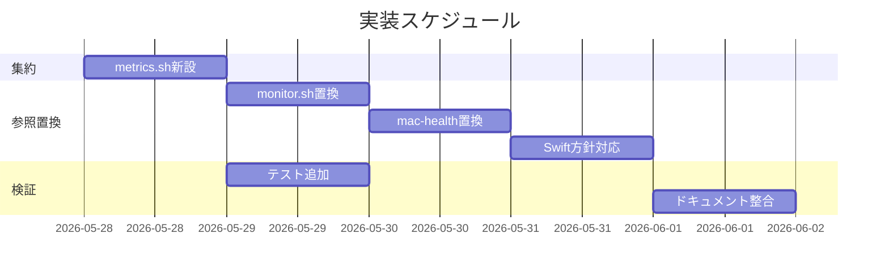
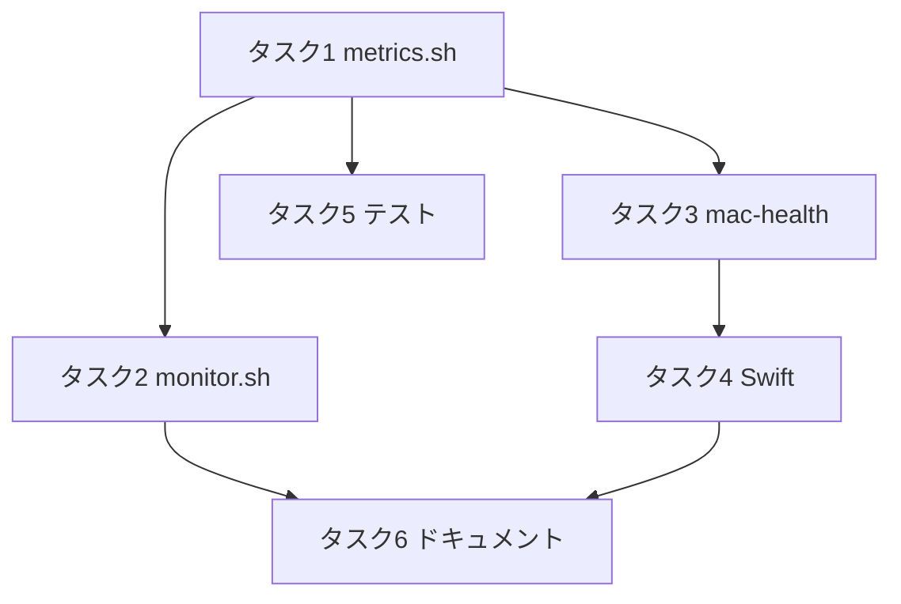

# 実装計画書: サブ C メトリクス取得ロジックの重複解消

**プロジェクト名**: サブ C メトリクス取得ロジックの重複解消
**作成日**: 2026 年 05 月 28 日
**最終更新**: 2026 年 05 月 28 日

> **重要**: **このドキュメントは常に更新**: 実装計画の変更、進捗状況の更新、バグの記録などがあった場合は、即座にこのドキュメントを更新してください。ドキュメントは「生きているドキュメント」として扱い、実装内容と常に同期させます。
> **必須項目**: 「必須」と明記した欄は空欄・抽象語のみで提出しないこと。テスト観点・BDD 仕様は具体ケースを 1 件以上記載すること。
>
> **用語**: [.agents/CONCEPTS.md §用語規約](../../../../.agents/CONCEPTS.md#用語規約) を参照。

---

## 1. 実装概要

### 1.1 実装方針

02 の方針に従い、生メトリクス取得を `scripts/lib/metrics.sh`（純粋パース関数＋実コマンドラッパ）に集約し、`monitor.sh` → `mac-health` の順に取得部のみを関数呼び出しへ置換する。Swift は (b) 現状維持（ルール一致コメントのみ）。テストは A の `scripts/test/` 方式（bats / 自前 assert フォールバック）に `metrics.bats`・`metrics_test.sh` を追加し、集約前後の出力一致を検証する。出力書式・単位・丸め・閾値判定経路（A）は不変。

### 1.2 実装順序

1. タスク 1: `scripts/lib/metrics.sh` 新設（純粋パース＋ラッパ）
2. タスク 2: `monitor.sh` の取得部を関数呼び出しへ置換（判定経路は不変）
3. タスク 3: `mac-health` status の取得部を関数呼び出しへ置換（書式不変）
4. タスク 4: Swift `gatherMetrics()` の (b) 対応（ルール一致コメント追加のみ）
5. タスク 5: テスト追加（`metrics.bats`・`metrics_test.sh`、Makefile フォールバックへ追記）
6. タスク 6: ドキュメント整合（02/03 と実装の同期、必要なら README/コメント）



---

## 2. タスク分解

**必須**: 各タスクには **「テスト観点」（2.x.3）** と **「単体テスト仕様（BDD）」（2.x.4）** を必ず記載すること。

### 2.1 タスク 1: scripts/lib/metrics.sh 新設

#### 2.1.1 概要

生メトリクス取得を単一責務で集約する `scripts/lib/metrics.sh` を新設する（純粋パース関数＋実コマンドラッパ。判定・通知・ログは含めない）。

#### 2.1.2 実装内容

- 純粋パース関数を実装: `metrics_parse_swap_mb`、`metrics_parse_swap_raw`、`metrics_parse_compressed_gb`、`metrics_parse_load_1m`、`metrics_parse_free_pct`、`metrics_uptime_days`、`metrics_uptime_hours`。
- 取得ラッパ関数を実装: `metrics_swap_used_mb`、`metrics_swap_used_raw`、`metrics_compressed_gb`、`metrics_load_1m`、`metrics_memory_free_pct`、`metrics_uptime_days_now`、`metrics_uptime_hours_now`、`metrics_docker_status`。
- 丸め・単位・フォールバックを 02 §3.1.3 の表どおりに実装（swap=`%d`、compressed=`%.1f`、load=`%.1f`、free=整数、uptime=整数除算）。
- ファイル冒頭に「メトリクス取得の単一責務。判定/通知/ログを含めない」旨のコメント（A の `notification_cooldown.sh` に倣う）。`log.sh`/`notify.sh`/`thresholds.sh`/`notification_cooldown.sh` を source しない。

#### 2.1.3 テスト観点

**参照**: 観点の定義は [02_設計 §6](./02_設計.md) および [RULES のテスト戦略・TEST_BDD_FORMAT](../../../../.agents/RULES.md#テスト戦略必須要件) を参照。

##### 単体（本タスクの具体ケース・必須 1 件以上）

- 正常系: `metrics_parse_swap_mb "total = 2048.00M  used = 512.00M  free = 1536.00M"` → `512`（01 UC1-S1）。
- 正常系: `metrics_parse_compressed_gb 2621440` → `10.0`（2621440×4096/1024^3 = 10.0、01 UC1-S2）。
- 正常系: `metrics_parse_load_1m` に `... load averages: 3.45 2.10 1.98` を渡すと `3.5`（小数1桁丸め）。
- 正常系: `metrics_uptime_days <now> <boot>` が `(now-boot)/86400` の整数を返す（例 now-boot=200000 → 2）。
- 境界値: `metrics_parse_compressed_gb 0` → `0.0`。
- 異常系: `metrics_parse_swap_mb ""`（空入力）→ `0`。

##### 結合/API（該当時は必須 1 件以上）

- 該当なし（純粋関数はソース経由の単体で担保。参照側結合はタスク 2/3）。

##### E2E/受け入れ（未達時は理由記載）

- 未達。実コマンド実行ラッパは実機依存のため自動 E2E は行わず、タスク 3 の手動 diff（集約前後の `mac-health status` 一致）で代替する。

##### バリデーション

- 空/非数値入力時のフォールバック（swap=`0`、compressed=`0.0`、free=`100`）を上記単体ケースで確認。

#### 2.1.4 単体テスト仕様（BDD）

**BDD 形式のテストケース（高レベル仕様）**:

```gherkin
Feature: メトリクス取得の集約
  Scenario: metrics.sh の swap 関数が MB 整数を返す（01 UC1-S1）
    Given vm.swapusage が "used = 512.00M" を含むテキスト
    When metrics_parse_swap_mb を呼ぶ
    Then 512 が返る

  Scenario: metrics.sh の圧縮メモリ関数が GB を返す（01 UC1-S2）
    Given compressor ページ数 2621440
    When metrics_parse_compressed_gb を呼ぶ
    Then 10.0 が返る（ページ数×4096 を GB 換算）
```

**テストコード例（bash / 自前 assert・bats と同形式。Given/When/Then をインラインで明記）**

```bash
# ユースケース: metrics.sh の純粋パース関数が固定入力に対し既定の丸め・単位で値を返す。

# シナリオ: vm.swapusage の used を MB 整数で返す（01 UC1-S1）。
# Given: used = 512.00M を含む swapusage テキスト
text="total = 2048.00M  used = 512.00M  free = 1536.00M"
# When: metrics_parse_swap_mb を呼ぶ
out=$(metrics_parse_swap_mb "$text")
# Then: 512 が返る
assert_eq "512" "$out" "UC1-S1: parse_swap_mb returns integer MB"

# シナリオ: compressor ページ数を GB(小数1桁)へ換算する（01 UC1-S2）。
# Given: compressor ページ数 2621440（= 10GB 相当）
pages=2621440
# When: metrics_parse_compressed_gb を呼ぶ
out=$(metrics_parse_compressed_gb "$pages")
# Then: 10.0 が返る
assert_eq "10.0" "$out" "UC1-S2: parse_compressed_gb returns GB(1dp)"
```

#### 2.1.5 依存関係

- なし（最初に実装）。



#### 2.1.6 見積もり

- **工数**: 1.5h
- **優先度**: 高

---

### 2.2 タスク 2: monitor.sh の取得部を関数呼び出しへ置換

#### 2.2.1 概要

`monitor.sh`(L24-50) のメトリクス取得部のみを `metrics.sh` 関数呼び出しへ置換し、A の判定経路・ログ・通知文・`key:epoch`・launchd ラベルは不変に保つ。

#### 2.2.2 実装内容

- 冒頭に `source "$ROOT_DIR/lib/metrics.sh"` を追加。
- `swap_used_mb` → `metrics_swap_used_mb`、`compressed_gb` → `metrics_compressed_gb`、`load_1m` → `metrics_load_1m`、`free_pct` → `metrics_memory_free_pct` に置換。
- `ncpu`/`load_threshold`/`classify_pressure`/`exceeds_threshold`/`should_notify`/`log`/`notify`/`rotate_logs` は**不変**（A・既存の責務）。
- ログ行 `swap=...MB compressed=...GB load1m=... cores=... pressure=...` を**完全不変**で維持。

#### 2.2.3 テスト観点

##### 単体

- 該当なし（monitor.sh 本体はメトリクス取得＋判定の手続き。取得は metrics.sh 単体で、判定は A の既存テストで担保）。

##### 結合/API

- 集約前後で `monitor.sh` のログ行フォーマット（`swap=NNNMB compressed=N.NGB load1m=N.N cores=N pressure=...`）が同一であることを目視/grep で確認（01 UC2 の趣旨）。

##### E2E/受け入れ

- 実機で `mac-health run monitor` を実行し、`monitor.log` の最新行が置換前と同一形式であることを確認（未自動化・手動）。

##### バリデーション

- 該当なし。

#### 2.2.4 単体テスト仕様（BDD）

```gherkin
Feature: 参照側の一致
  Scenario: monitor.sh が metrics.sh の swap 値を使う（01 UC2-S1 の一方）
    Given 同一環境で metrics.sh を source する
    When monitor.sh が metrics_swap_used_mb を呼ぶ
    Then mac-health と同じ swap 値を得る
```

**テストコード例（bash・参照一致の単体近似。タスク 5 の metrics_test.sh に含める）**

```bash
# ユースケース: 2 つの参照元が metrics.sh の同一関数を source し同値を得る。

# シナリオ: 同一の swapusage テキストに対し parse_swap_mb が常に同値（01 UC2-S1）。
# Given: 固定の swapusage テキストを 2 回与える（mac-health/monitor.sh の参照を模す）
text="used = 777.00M"
# When: 同じ純粋関数を 2 度呼ぶ
a=$(metrics_parse_swap_mb "$text"); b=$(metrics_parse_swap_mb "$text")
# Then: 2 参照元で同値
assert_eq "$a" "$b" "UC2-S1: same parse result for both reference sites"
assert_eq "777" "$a" "UC2-S1: value is the expected MB integer"
```

#### 2.2.5 依存関係

- タスク 1。

#### 2.2.6 見積もり

- **工数**: 0.5h
- **優先度**: 高

---

### 2.3 タスク 3: mac-health status の取得部を関数呼び出しへ置換

#### 2.3.1 概要

`mac-health`(L49-77) status のメトリクス取得部を `metrics.sh` 関数呼び出しへ置換し、**status の出力書式・キー名・単位を完全不変**に保つ（01 §3.3/§4.2）。

#### 2.3.2 実装内容

- 冒頭の source 群に `source "$ROOT_DIR/lib/metrics.sh"` を追加。
- swap 表示は現状 `512.00M` 文字列のため `metrics_swap_used_raw` を使用（書式不変）。
- `comp_gb` → `metrics_compressed_gb`、`load` → `metrics_load_1m`、`free_pct` → `metrics_memory_free_pct`、uptime の `days`/`hours` → `metrics_uptime_days_now`/`metrics_uptime_hours_now`。
- docker は `metrics_docker_status` を使い、`running (containers=%s)` / `not running` の現状書式に整形（`?` フォールバック維持）。
- `printf` の各行（`uptime : %dd %dh`、`load avg (1m) : %s`、`swap used : %s`、`compressed mem : %sGB`、`memory free : %s%%`、`docker : ...`）を**1 文字も変えない**。

#### 2.3.3 テスト観点

##### 単体

- 該当なし（status は表示整形。値は metrics.sh 単体で担保）。

##### 結合/API

- 集約前後の `mac-health status` 出力 diff が空（[Current Metrics] 節）であることを確認（01 UC2 の趣旨・00 効果 2）。

##### E2E/受け入れ

- 受け入れ手順: 置換前にコミット相当の `mac-health status > before.txt`、置換後 `mac-health status > after.txt`、`diff before.txt after.txt` の [Current Metrics] ブロックが一致（実機・手動。LaunchAgent/Recent Events 行は時刻で変わり得るため Current Metrics 節を対象とする）。

##### バリデーション

- `memory_pressure`/`docker` 不在時に `?`/`not running` が現状どおり表示されること。

#### 2.3.4 単体テスト仕様（BDD）

```gherkin
Feature: 参照側の一致
  Scenario: mac-health と monitor.sh が同じ swap 値を得る（01 UC2-S1）
    Given 同一環境で metrics.sh を source する
    When 双方が swap 取得関数を呼ぶ
    Then 同じ生入力から同じ値を得る（書式は各参照元が付与）
```

**テストコード例（bash・mac-health と monitor の整合を純粋関数で担保）**

```bash
# ユースケース: mac-health(表示用 raw) と monitor(判定用 MB) が同一 swapusage から整合した値を得る。

# シナリオ: 同一 swapusage テキストから raw と MB が整合する（01 UC2-S1）。
# Given: used = 512.00M を含むテキスト
text="used = 512.00M"
# When: 表示用 raw と判定用 MB をそれぞれ取得
raw=$(metrics_parse_swap_raw "$text"); mb=$(metrics_parse_swap_mb "$text")
# Then: raw は 512.00M（mac-health 書式）、mb は 512（monitor 用）で整合
assert_eq "512.00M" "$raw" "UC2-S1: raw form for mac-health unchanged"
assert_eq "512" "$mb" "UC2-S1: MB integer for monitor matches raw"
```

#### 2.3.5 依存関係

- タスク 1。

#### 2.3.6 見積もり

- **工数**: 0.5h
- **優先度**: 高

---

### 2.4 タスク 4: Swift gatherMetrics() の (b) 対応

#### 2.4.1 概要

02 §3.3 の決定（(b) 現状維持）に従い、`gatherMetrics()` は変更せず、丸め・単位ルールが metrics.sh §3.1.3 と一致していることを確認し、参照コメントを 1 行追加する。

#### 2.4.2 実装内容

- `src/MacHealth.swift` `gatherMetrics()` 冒頭に「丸め・単位は scripts/lib/metrics.sh（02 §3.1.3）と一致させること。将来 (a) で metrics.sh へ統合」のコメント 1 行を追加。
- compressed の `%.1f GB`、uptime の整数除算、swap の `...used = ([0-9.]+M)` 抽出が metrics.sh と整合していることを確認（不一致があれば指摘し、本 issue では Swift 側は変えずに 02 へ差分を記録）。

#### 2.4.3 テスト観点

##### 単体

- 該当なし（既存 Swift テストは ScheduleTiming のみ。gatherMetrics は実コマンド依存で本 issue では変更しないため新規 Swift 単体は追加しない）。

##### 結合/API

- 該当なし。

##### E2E/受け入れ

- 手動: メニューバー表示の各メトリクス書式が変わらないこと（コメント追加のみのため挙動不変）。

##### バリデーション

- 該当なし。

#### 2.4.4 単体テスト仕様（BDD）

```gherkin
Feature: Swift 側のルール整合（(b) 現状維持）
  Scenario: gatherMetrics の丸め・単位が metrics.sh と一致
    Given metrics.sh §3.1.3 の丸めルール（compressed=%.1f, swap=MB抽出, uptime=整数除算）
    When gatherMetrics() の対応箇所と照合する
    Then 換算式・単位が一致している（不一致なら 02 に差分記録）
```

**テストコード例（照合観点・自動テストなし）**

```text
// Given: metrics.sh の compressed 換算 p*4096/1024/1024/1024 を %.1f
// When: Swift の compGB = compPages * 4096 / 1024 / 1024 / 1024 を String(format:"%.1f GB") と照合
// Then: 換算式・桁数が一致（本 issue は (b) のためコード変更なし・コメント追加のみ）
```

#### 2.4.5 依存関係

- タスク 1・タスク 3（書式確定後）。

#### 2.4.6 見積もり

- **工数**: 0.3h
- **優先度**: 中

---

### 2.5 タスク 5: テスト追加（metrics.bats / metrics_test.sh）

#### 2.5.1 概要

A の `scripts/test/` 方式（bats / 自前 assert フォールバック）に `metrics.bats` と `metrics_test.sh` を追加し、純粋パース関数と参照一致を固定入力で検証する。`make test-shell` のフォールバック経路へ `metrics_test.sh` を追記する。

#### 2.5.2 実装内容

- `scripts/test/metrics.bats` を新設: setup() で `source ../lib/metrics.sh`。UC1-S1/UC1-S2/UC2-S1 と境界・異常系を `@test` で記述（A の `monitor.bats` と同形式・doc コメントでユースケース/シナリオ）。
- `scripts/test/metrics_test.sh` を新設: bats 不在時の自前 assert ランナー（A の `monitor_test.sh` の `assert_eq` 等を再利用）。同一ケースを再現し、失敗 1 件で非 0 終了。
- `Makefile` の `test-shell` フォールバック節（L24）に `bash scripts/test/metrics_test.sh` を追記（bats 経路は `bats scripts/test/` がディレクトリ走査で自動的に `metrics.bats` を拾う）。

#### 2.5.3 テスト観点

##### 単体（本タスクの具体ケース・必須 1 件以上）

- UC1-S1: `metrics_parse_swap_mb "used = 512.00M"` → `512`。
- UC1-S2: `metrics_parse_compressed_gb 2621440` → `10.0`。
- UC2-S1: 同一入力に対し 2 参照元（raw/MB、または同関数 2 回）が整合・同値。
- 境界: `metrics_parse_compressed_gb 0` → `0.0`。
- 異常: `metrics_parse_swap_mb ""` → `0`。

##### 結合/API

- bats 経路と自前 assert 経路の双方で同一ケースが PASS すること（A と同じ二重化）。

##### E2E/受け入れ

- `make test-shell`（bats あり/なし両方）が緑であること。

##### バリデーション

- 各純粋関数の空入力フォールバックが上記異常系で検証されること。

#### 2.5.4 単体テスト仕様（BDD）

```gherkin
Feature: メトリクス取得の集約と参照一致（テスト）
  Scenario: swap MB 整数（01 UC1-S1）
    Given used = 512.00M を含むテキスト
    When metrics_parse_swap_mb を呼ぶ
    Then 512 が返る
  Scenario: compressed GB 換算（01 UC1-S2）
    Given compressor ページ数 2621440
    When metrics_parse_compressed_gb を呼ぶ
    Then 10.0 が返る
  Scenario: 2 参照元で同値（01 UC2-S1）
    Given 同一 swapusage テキスト
    When raw と MB を取得する
    Then 512.00M と 512 が整合する
```

**テストコード例（bats・A の monitor.bats と同形式）**

```bash
# ユースケース: metrics.sh の純粋パース関数が既定の単位・丸めで値を返し、2 参照元で整合する。

# シナリオ: vm.swapusage の used を MB 整数で返す（01 UC1-S1）。
@test "metrics_parse_swap_mb returns integer MB" {
  # Given: used = 512.00M を含むテキスト
  text="total = 2048.00M  used = 512.00M  free = 1536.00M"
  # When: metrics_parse_swap_mb を呼ぶ
  run metrics_parse_swap_mb "$text"
  # Then: 512 が返る
  [ "$output" = "512" ]
}

# シナリオ: compressor ページ数を GB(小数1桁)へ換算する（01 UC1-S2）。
@test "metrics_parse_compressed_gb returns GB with 1 decimal" {
  # Given: compressor ページ数 2621440（= 10GB 相当）
  pages=2621440
  # When: metrics_parse_compressed_gb を呼ぶ
  run metrics_parse_compressed_gb "$pages"
  # Then: 10.0 が返る
  [ "$output" = "10.0" ]
}

# シナリオ: 同一入力で 2 参照元（raw/MB）が整合する（01 UC2-S1）。
@test "swap raw and MB are consistent for both reference sites" {
  # Given: used = 512.00M を含むテキスト
  text="used = 512.00M"
  # When: 表示用 raw と判定用 MB をそれぞれ取得
  raw=$(metrics_parse_swap_raw "$text"); mb=$(metrics_parse_swap_mb "$text")
  # Then: raw=512.00M（mac-health 書式）、mb=512（monitor 用）で整合
  [ "$raw" = "512.00M" ]
  [ "$mb" = "512" ]
}
```

#### 2.5.5 依存関係

- タスク 1。

#### 2.5.6 見積もり

- **工数**: 1h
- **優先度**: 高

---

### 2.6 タスク 6: ドキュメント整合

#### 2.6.1 概要

実装と 02/03 の同期を取り、必要に応じてファイル先頭コメント・README のメトリクス取得参照先を更新する。

#### 2.6.2 実装内容

- 02 §3.1.3 の関数表と実装の関数名・丸め・フォールバックが一致していることを確認し、差分があれば 02/03 を更新。
- `monitor.sh`/`mac-health` の取得部コメントに「取得は lib/metrics.sh に集約」を追記。

#### 2.6.3 テスト観点

##### 単体

- 該当なし。

##### 結合/API

- 該当なし。

##### E2E/受け入れ

- 02 の関数一覧と実装が一致（レビューで目視）。

##### バリデーション

- 該当なし。

#### 2.6.4 単体テスト仕様（BDD）

```gherkin
Feature: ドキュメント整合
  Scenario: 02 の関数表と実装が一致
    Given 02 §3.1.3 / §5.1 の関数一覧
    When metrics.sh の定義関数と突き合わせる
    Then 関数名・単位・丸めが一致する
```

```text
// Given: 02 §5.1 の API 一覧
// When: grep '^metrics_' scripts/lib/metrics.sh と突き合わせ
// Then: 公開関数の名前・数が 02 と一致（不一致は 02/03 を更新）
```

#### 2.6.5 依存関係

- タスク 1〜5。

#### 2.6.6 見積もり

- **工数**: 0.3h
- **優先度**: 中

---

## テスト観点

- 純粋パース関数（swap/compressed/load/free/uptime）の丸め・単位・フォールバックを固定入力で検証（単体）。
- 集約前後で `mac-health status` の [Current Metrics] と `monitor.log` のメトリクス行が不変（結合・手動 diff）。
- 2 参照元（mac-health/monitor.sh）が同一の生入力から整合した値を得る（01 UC2-S1）。
- 取得ラッパ（実コマンド）は実機依存のため自動化せず、純粋関数のテスト＋手動 diff で代替する（A と同方針）。

## 単体テスト

- 対象: `scripts/lib/metrics.sh` の純粋パース関数。
- 方式: `scripts/test/metrics.bats`（bats）＋ `scripts/test/metrics_test.sh`（自前 assert フォールバック）。`make test-shell` から bats 走査または `metrics_test.sh` 実行で起動。
- A の `monitor.bats`/`monitor_test.sh` と同じ setup/teardown・assert ヘルパ・BDD doc コメント形式に揃える。

## BDD

01 BDD ↔ 03 テスト仕様の対応:

| 01 BDD | 内容 | 03 のテスト仕様 |
| ---- | ---- | ---- |
| UC1-S1 | metrics.sh の swap 関数が MB 整数を返す | §2.1.4 / §2.5.4（`metrics_parse_swap_mb` → `512`） |
| UC1-S2 | metrics.sh の圧縮メモリ関数が GB を返す | §2.1.4 / §2.5.4（`metrics_parse_compressed_gb 2621440` → `10.0`） |
| UC2-S1 | mac-health と monitor.sh が同じ swap 値を得る | §2.2.4 / §2.3.4 / §2.5.4（raw/MB の整合・同値） |

Given/When/Then 形式は [TEST_BDD_FORMAT.md](../../../../.agents/TEST_BDD_FORMAT.md) に従い、各テストに `ユースケース:`/`シナリオ:` の doc コメントと Given/When/Then インラインコメントを付与する。

---

## 3. 実装スケジュール

### 3.1 マイルストーン

| マイルストーン | 期日 | 成果物 |
| ------------------ | ------ | -------- |
| 取得集約 | 着手日 | `scripts/lib/metrics.sh` |
| 参照置換 | +1d | `monitor.sh`・`mac-health` 置換 |
| 検証 | +1d | `metrics.bats`・`metrics_test.sh`・Makefile・出力 diff |

### 3.2 実装フェーズ

#### フェーズ 1: 集約と置換

- **期間**: 着手日〜+1d
- **タスク**: タスク 1〜4

#### フェーズ 2: 検証とドキュメント

- **期間**: +1d
- **タスク**: タスク 5・6

---

## 4. テスト計画

### 4.1 テストの優先順位

- クリティカル: 純粋パース関数の丸め・単位（UC1-S1/S2）と参照一致（UC2-S1）を厚くテスト。
- 回帰: 集約前後の `mac-health status` / `monitor.log` 出力一致を必ず確認（影響範囲が広いため）。

---

## 5. リスク管理

### 5.1 実装リスク

- **リスク**: swap が mac-health（`512.00M` 文字列）と monitor（MB 整数）で利用形態が異なり、集約で書式が崩れる。
  - **対策**: `metrics_swap_used_raw`（表示用）と `metrics_swap_used_mb`（判定用）を分け、両者を同一パース基盤に乗せて整合（02 §3.1.4・タスク 3）。集約前後の status diff を受け入れ基準にする。
- **リスク**: 3 箇所同時変更で回帰（01 §7.2）。
  - **対策**: シェル 2 箇所を先に集約し Swift は (b) で現状維持。テスト二重化（bats / 自前 assert）と手動 diff で担保。
- **リスク**: `bats scripts/test/` がディレクトリ走査で全 .bats を拾うが、フォールバックは `monitor_test.sh` のみ実行している。
  - **対策**: Makefile フォールバック節へ `bash scripts/test/metrics_test.sh` を追記（タスク 5）。

---

## 6. 参考資料

### プロジェクトドキュメント

- [`02_設計.md`](./02_設計.md) - 設計
- [`01_要件定義.md`](./01_要件定義.md) - 要件定義

### その他の参考資料

- A 成果物: `scripts/bin/notification_cooldown.sh`、`scripts/test/monitor.bats`・`monitor_test.sh`、`Makefile`
- `scripts/bin/monitor.sh`(L24-50)、`scripts/bin/mac-health`(L49-77)、`src/MacHealth.swift`(L115-152)

---

## 7. 前のステップ

この実装計画書は、以下のドキュメントを基に作成されています：

- **前**: [`02_設計.md`](./02_設計.md) - 設計フェーズ

---

## 8. 次のステップ

この実装計画書の承認後、以下のいずれかのステップに進みます：

- **プロジェクトが 1 つの issue（タスク）である場合**: 実装フェーズ（execution）に直接進む（本サブ C は単一 issue のため分割しない）。

**用語**: [.agents/CONCEPTS.md §用語規約](../../../../.agents/CONCEPTS.md#用語規約) を参照。
