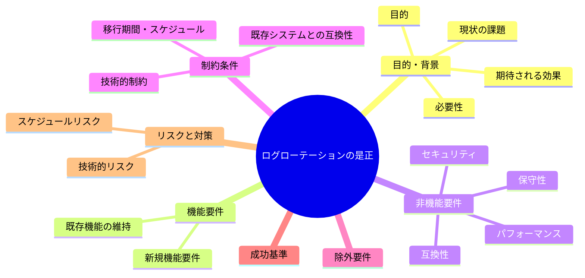
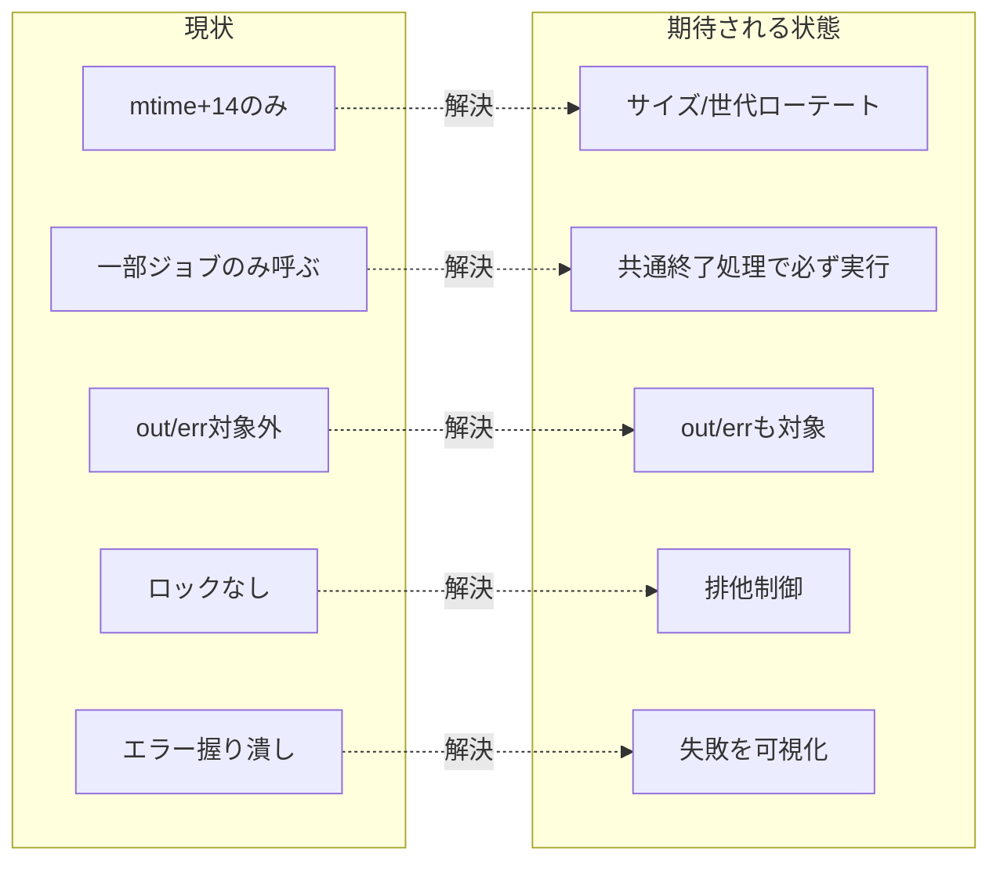

# 要求定義書: サブ D ログローテーションの是正

**プロジェクト名**: サブ D ログローテーションの是正
**作成日**: 2026 年 05 月 27 日
**最終更新**: 2026 年 05 月 27 日

> **重要**:
>
> - 要求定義書は全体像を把握するためのものです。詳細は要件定義書以降で記載します。
> - **このドキュメントは常に更新**します。
> - **必須項目**: 判定可能な形で記入すること。
>
> **用語**: [.agents/CONCEPTS.md §用語規約](../../../../.agents/CONCEPTS.md#用語規約) を参照。

---

## 要求定義の全体像

---

## 1. 目的・背景

### 1.1 目的（必須）

ログが無限肥大化しない確実なローテーションと安全な追記を実現する。

### 1.2 背景

- **現状の課題**:
  - L1: `scripts/lib/log.sh` の `rotate_logs`(L26-28) が `find -name "*.log" -mtime +14 -delete` のみ。追記され続ける `monitor.log`/`events.log` は mtime が更新され続け `-mtime +14` に該当せず**無限肥大化**。サイズ/行数上限が無い。
  - L2: `rotate_logs` の呼び出しが `monitor.sh`/`refresh.sh` のみ。`check-docker.sh`/`check-uptime.sh`/`mac-health` は呼ばない（責務の偏在）。
  - L3: launchd の `StandardOutPath`/`StandardErrorPath`（`launchd.monitor.out`/`.err` 等、`launchagents/*.plist.template`）は `.log` 拡張子でないためローテーション対象外。
  - L4: `events.log` への複数ジョブ並行追記、`monitor.sh` の cooldown ファイルの read-modify-write(L33-35) にロックが無い。
  - L5: エラーを `2>/dev/null`(L27) で握り潰し、ローテーション失敗・ディスク不足が表に出ない。

- **必要性**:
  - 長期稼働を前提とするツールでログ肥大化はディスク枯渇・障害の原因になる。

### 1.3 期待される効果（必須: 1 件以上）

- **効果 1**: サイズ/行数（または世代）でローテートされ、追記ログが上限を超えて増え続けない（○/× 判定可）。
- **効果 2**: `.out`/`.err` もローテーション対象になる（○/× 判定可）。
- **効果 3**: 全ジョブ共通の終了処理からローテートが確実に呼ばれる（○/× 判定可）。
- **効果 4**: cooldown/events への書き込みが排他制御される（○/× 判定可）。

**現状と期待される状態の比較**:

---

## 2. 機能要件

### 2.1 既存機能の維持（該当する場合）

- ログ出力先（`~/Library/Logs/MacHealth`）・ログ書式（`log`/`log_event` の形式）を維持する。

### 2.2 新規機能要件

- サイズ/行数（または世代）ベースのローテート関数。`*.log` に加え `*.out`/`*.err` を対象化。
- 全ジョブ共通の終了処理からローテートを確実に呼ぶ仕組み。
- cooldown/events への追記・更新の排他制御（ロック）。
- ローテーション失敗・ディスク不足を検知・記録（`2>/dev/null` の見直し）。

---

## 3. 非機能要件

### 3.1 パフォーマンス

- ローテート処理がジョブ実行を著しく遅延させない。

### 3.2 セキュリティ

- ロックファイル・一時ファイルは予測可能な競合・シンボリックリンク攻撃を避ける配置にする。

### 3.3 互換性

- 既存ログのパス・書式を保つ。世代ファイルの命名は追加であって既存を壊さない。

### 3.4 保守性

- ローテート設定（上限サイズ/世代数）を 1 箇所で管理する。

---

## 4. 制約条件

### 4.1 技術的制約

- Bash。`scripts/lib/log.sh`（または新設の責務分離ファイル）に実装。
- ロックは `mkdir`/`flock` 等、macOS で動作する手段を用いる。

### 4.2 既存システムとの互換性

- launchd plist テンプレートの `StandardOutPath`/`StandardErrorPath` の場所は維持しつつ対象化する（命名変更が必要なら最小限）。

### 4.3 移行期間・スケジュール

- 既存の巨大ログがある場合の初回切り詰め方針を 02 で決める。

---

## 5. 除外要件

- ログの外部集約・転送（syslog/クラウド）への対応は対象外。

---

## 6. 成功基準（必須: 1 件以上）

- 追記ログがサイズ/行数（または世代）上限を超えて増え続けないことが確認できる。
- `.out`/`.err` がローテーション対象に含まれる。
- 全ジョブ（monitor/docker/uptime/refresh）の終了時にローテートが確実に呼ばれる。
- cooldown/events の更新が排他制御される。
- ローテーション失敗・ディスク不足が記録・観測できる。

---

## 7. リスクと対策

### 7.1 技術的リスク

- **リスク**: ローテート中の追記とレースする。
  - **対策**: ロックを取り、原子的な置換（tmp→mv）で行う。

### 7.2 スケジュールリスク

- **リスク**: 全ジョブの終了処理共通化が広範囲に及ぶ。
  - **対策**: 共通の終了 trap/関数を `log.sh` に置き各ジョブが呼ぶ最小変更にする。

---

## 8. 参考資料

### プロジェクトドキュメント

- 親要求: [../../00_要求定義.md](../../00_要求定義.md)

### その他の参考資料

- `scripts/lib/log.sh`(L26-28)、`scripts/bin/monitor.sh`(L33-35, L106)、`scripts/bin/refresh.sh`、`scripts/bin/check-docker.sh`、`scripts/bin/check-uptime.sh`、`launchagents/*.plist.template`

---

## 9. 次のステップ

- **次**: [`01_要件定義.md`](./01_要件定義.md) - 要件定義フェーズ
