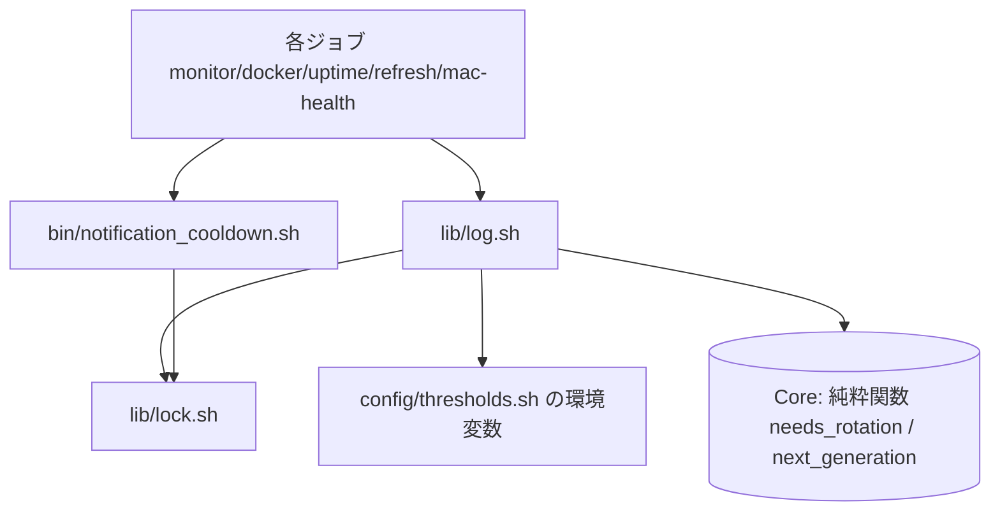
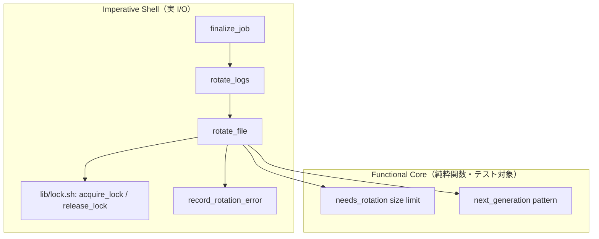
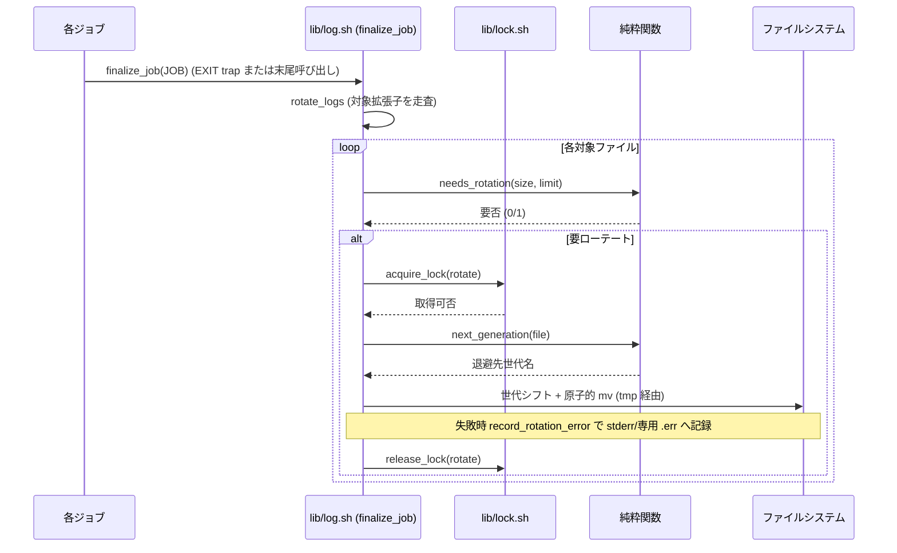
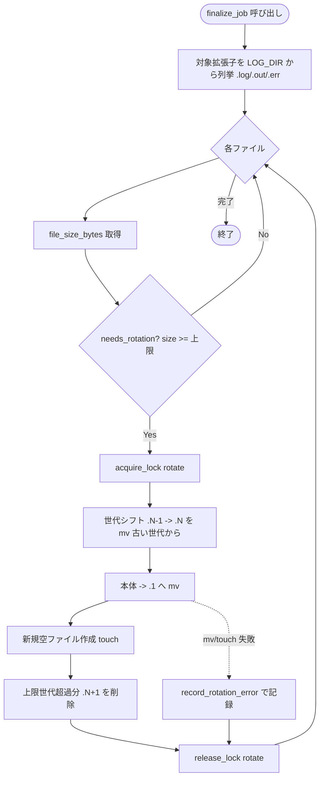
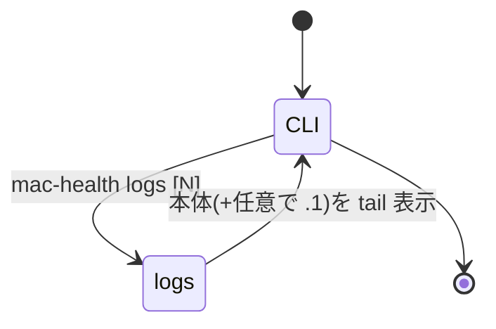

# 設計書: サブ D ログローテーションの是正

**プロジェクト名**: サブ D ログローテーションの是正
**作成日**: 2026 年 05 月 28 日
**最終更新**: 2026 年 05 月 28 日

> **重要**: **このドキュメントは常に更新**: 設計の変更や追加があった場合は、即座にこのドキュメントを更新してください。ドキュメントは「生きているドキュメント」として扱い、実装内容と常に同期させます。
>
> **用語**: [.agents/CONCEPTS.md §用語規約](../../../../.agents/CONCEPTS.md#用語規約) を参照。

---

## 1. 設計概要

**必須**: 設計方針・原則は [.agents/spec/01_設計原則.md](../../../../.agents/spec/01_設計原則.md) を**先に参照**した上で、本プロジェクトに**適用するものを選び**記載する。

### 1.1 設計方針

mtime 依存をやめ、**サイズ閾値 + 世代退避（`.log` → `.log.1` → … → `.log.N`）**で追記ログの肥大化を確実に止める。判定（純粋関数）と実 I/O（命令的シェル）を分離する **Functional Core / Imperative Shell** を採り（既存 `notification_cooldown.sh`・`metrics.sh` と同方式）、固定入力・一時ディレクトリで副作用ゼロのテストを可能にする。

### 1.2 設計原則（本プロジェクトで適用するもの）

- **UNIX哲学**: ローテートは「サイズで切り詰める」1 つの仕事に集中させ、小さな純粋関数の組み合わせで構成する。
- **単一責務**: 「ローテート判定/退避」「ロック取得/解放」「失敗記録」「全ジョブ共通の終了処理」を関数単位で分離する。設定値は `thresholds.sh` 1 箇所に集約する。
- **明確な境界**: 純粋関数（Core: 外部コマンド・実ファイル非依存）と I/O 関数（Shell: 実ファイル・mv・mkdir に触れる）の境界を引く。`log.sh` は「ログ書込・ローテート・終了処理」、`notification_cooldown.sh` は「通知判定 + cooldown 更新」、新設の `lock.sh` は「排他制御」を担う。
- **CQRS**: 状態取得（サイズ取得・要否判定 = Query）と状態変更（退避・切り詰め = Command）を関数として分ける。Query に副作用を持たせない。
- **AIフレンドリー設計**: 小さなファイル（`log.sh`/`lock.sh` を肥大化させない）・意図が分かる関数名（`rotate_file`/`needs_rotation`/`acquire_lock`）・深すぎない構成（`scripts/lib` 直下）を守る。

> **AIフレンドリー設計**: [01_設計原則 §AIフレンドリー設計](../../../../.agents/spec/01_設計原則.md#aiフレンドリー設計) を適用。本 issue では純粋関数を `notification_cooldown.sh` と同様に source 可能な小関数群とし、テストから直接呼べる形にする。

---

## 2. アーキテクチャ設計

### 2.1 責務・境界・参照関係

[01_設計原則 §明確な境界・§単一責務](../../../../.agents/spec/01_設計原則.md) に従う。

#### 2.1.1 責務一覧

| コンポーネント | 責務（1 文） |
| -------------- | ------------ |
| `lib/log.sh`（Core: 純粋関数） | ファイルサイズ取得・ローテート要否判定・退避先世代名の算出を、実 I/O なしで行う。 |
| `lib/log.sh`（Shell: I/O 関数） | `rotate_file`（1 ファイルを原子的に退避）・`rotate_logs`（対象拡張子を走査して退避）・`finalize_job`（全ジョブ共通の終了処理）を実行する。 |
| `lib/log.sh`（既存 `log`/`log_event`） | 各ジョブの追記ログ・イベントログを既存書式で書き込む（書式・出力先は不変）。 |
| `lib/lock.sh`（新設） | `mkdir` ベースの排他ロックを安全な固定パスで取得・解放し、失敗時もベストエフォートで継続させる。 |
| `bin/notification_cooldown.sh`（既存・A 由来） | `should_notify` の cooldown read-modify-write を `lib/lock.sh` で直列化する（判定ロジックは不変）。 |
| `config/thresholds.sh`（既存） | ローテートの上限サイズ・世代数・対象拡張子を 1 箇所で設定管理する。 |
| 各ジョブ（`monitor.sh`/`check-docker.sh`/`check-uptime.sh`/`refresh.sh`/`mac-health run`） | 自身の処理終了時に共通終了処理 `finalize_job` を呼び、ローテートを確実に起動する。 |
| `launchagents/*.plist.template`（既存） | `StandardOutPath`/`StandardErrorPath` の出力先（`launchd.<job>.out`/`.err`）は維持し、対象拡張子の追加でローテート対象に含める。 |

#### 2.1.2 境界

- **入力**: ログディレクトリ `~/Library/Logs/MacHealth`（`LOG_DIR`）配下の `*.log` / `*.out` / `*.err`、`thresholds.sh` の上限値、cooldown ファイル。
- **出力**: 上限以下に保たれたログ本体ファイル、世代退避ファイル（`*.log.1` … `*.log.N`）、ローテート失敗時のエラー記録、直列化された cooldown 更新。
- **他責務との境界**:
  - 本 issue（D）は**ローテート・排他制御・失敗記録・全ジョブ配線**を範囲とする。
  - サブ A（`notification_cooldown.sh` への `should_notify` 移設）は完了済みを前提とし、D は**その `should_notify` にロックを足す**差分のみを担う（判定ロジック・`key:epoch` 形式は変更しない）。
  - サブ C（`metrics.sh` のメトリクス取得）には触れない。
  - ログの外部集約・転送（syslog/クラウド）は**範囲外**（01 §5）。
  - 圧縮（gzip）は本 issue では採用しない（後述 §3.1.4 で根拠）。

#### 2.1.3 参照関係

- 各ジョブ（`monitor.sh`/`check-docker.sh`/`check-uptime.sh`/`refresh.sh`/`mac-health`）→ `lib/log.sh` を source。
- `lib/log.sh` → `config/thresholds.sh` を**直接 source しない**（既存どおり各ジョブが source 済みの環境変数を参照する。未設定時は `log.sh` 内の既定値でフォールバック）。
- `lib/log.sh` → `lib/lock.sh` を source（ローテートと終了処理で排他するため）。
- `bin/notification_cooldown.sh` → `lib/lock.sh` を source（cooldown 更新の直列化）。
- 循環参照なし。依存は「ジョブ → log/lock/notification_cooldown → （純粋関数）」の一方向。
- 純粋関数（Core）は他ファイル・外部コマンドを参照しない（最下層）。

### 2.2 システムアーキテクチャ

**必須**: 設計判断は [.agents/spec/](../../../../.agents/spec/)（[00_spec概要](../../../../.agents/spec/00_spec概要.md)、[01_設計原則](../../../../.agents/spec/01_設計原則.md)、[06_設計判断の優先順位](../../../../.agents/spec/06_設計判断の優先順位.md)）を**先に**参照した。

- **採用パターン**: Functional Core / Imperative Shell（純粋関数 Core + 命令的 I/O Shell）。
- **根拠**: spec/06 の優先順位「可読性 > 単一責務 > 仕様整合」に従う。既存 `notification_cooldown.sh`・`metrics.sh` が同パターンで A の `scripts/test/` 方式（bats / 自前 assert）と整合しており、構造の一貫性（spec/06 §判断に迷った場合）を保てる。

#### 2.2.1 CQRS（Command/Query 分離）

- **Query（状態取得・副作用なし）**: `file_size_bytes`（サイズ取得）、`needs_rotation`（要否判定）、`next_generation`（次に空く世代番号の算出）。いずれも標準出力に値/戻り値を返すだけ。
- **Command（状態変更）**: `rotate_file`（退避を実行）、`rotate_logs`（対象を走査して退避）、`should_notify`（cooldown 更新を含む。A 由来）。

#### 2.2.2 アーキテクチャ図（本プロジェクトの構成）

### 2.3 コンポーネント構成

明確な境界（Core / Shell / Lock / Config）で構成し、各関数は単一責務を満たす。

- **`lib/log.sh`**: 既存 `log`/`log_event` を保持しつつ、Core 関数（`file_size_bytes`/`needs_rotation`/`next_generation`）と Shell 関数（`rotate_file`/`rotate_logs`/`finalize_job`/`record_rotation_error`）を追加する。`rotate_logs` は破壊的再設計（mtime → サイズ世代退避）。
- **`lib/lock.sh`（新設）**: `acquire_lock <name>` / `release_lock <name>` を提供。`mkdir "$LOG_DIR/.locks/<name>.lock"` の成否で排他し、`trap` 併用で解放を保証する。`with_lock <name> <command...>` ヘルパも提供（取得→実行→必ず解放）。
- **`config/thresholds.sh`**: ローテート設定（上限サイズ・世代数・対象拡張子）を追記する。
- **各ジョブ**: 末尾の `rotate_logs`（既存呼び出し箇所）を `finalize_job "$JOB"` に置換、または `trap 'finalize_job "$JOB"' EXIT` を冒頭に設定して取りこぼし（`check-docker.sh`/`check-uptime.sh`/`mac-health` の L2）を是正する。

### 2.4 データフロー

ローテートは状態変更だがイベント発行（spec §イベント駆動）は本 issue では導入しない（同期処理で十分。spec/06 §原則「単純な同期処理で十分な場合は無理に導入しない」）。失敗時のみ「ローテート失敗が起きた事実」を `record_rotation_error` でエラー記録として残す。

---

## 3. 機能設計

### 3.1 機能 1: サイズ世代ローテート（`rotate_logs` 再設計）

#### 3.1.1 概要

mtime 非依存。対象ファイルのサイズが上限を超えたら、世代退避（`.1` → `.2` → …）してから本体を空にする。原子的置換でローテート中の追記とのレースを避ける。

#### 3.1.2 処理フロー

#### 3.1.3 入力・出力

- **入力**: `LOG_DIR`、対象拡張子（`MHK_ROTATE_EXTS`）、上限サイズ（`MHK_ROTATE_MAX_BYTES`）、世代数（`MHK_ROTATE_KEEP_GENERATIONS`）。
- **出力**: 上限以下の本体ファイル、`<file>.1` … `<file>.N` の世代ファイル。`<file>.N+1` 以降は削除。

#### 3.1.4 設計判断（純粋関数化・世代方式・圧縮の不採用）

- **純粋判定関数の分離**: `needs_rotation`（サイズと上限の比較）・`next_generation`（世代名算出）は外部コマンド・実ファイルに依存させず、引数のみで判定する（テスト容易性）。`file_size_bytes` は `stat -f%z`（macOS）を使う薄い I/O ラッパとして分離する。
- **世代退避方式の採用根拠**: 切り詰め（truncate）のみだと直近行も失われる。世代退避なら直近ログを 1 世代分残せる。命名は `<basename>.<n>` の追加であり既存の `*.log` 等を壊さない（01 §2.3）。
- **原子性**: 退避は `mv`（同一 FS 内の rename = 原子的）で行う。新規空ファイルは `: > "$file"` ではなく**退避後に `touch`** とし、退避と本体クリアの間で追記が来てもデータ消失を最小化する。世代シフトは**大きい番号から**処理し上書き衝突を防ぐ。
- **圧縮（gzip）の不採用**: 上限サイズ + 世代数で肥大化は止まる。圧縮は CPU/復元手間が増え、`mac-health logs`（tail）での閲覧性を損なう。spec/06「可読性 > 再利用性/実装効率」に従い不採用。必要なら別 issue に切り出す。

#### 3.1.5 エラーハンドリング

`mv`/`touch`/`mkdir` の戻り値を判定し、失敗時は `record_rotation_error` でメッセージを記録（後述 §3.4）。`2>/dev/null` での握り潰し（現 L27）は廃止する。

### 3.2 機能 2: 対象拡張子の拡張（`.out`/`.err` の対象化）

#### 3.2.1 概要

`*.log` に加え `*.out`/`*.err`（launchd の `StandardOutPath`/`StandardErrorPath`）をローテート対象に含める。これらは既に `LOG_DIR`（`~/Library/Logs/MacHealth`）配下に出力されており、plist の出力先パスは**変更不要**（命名変更ゼロで対象化できる）。

#### 3.2.2 入力・出力

- **入力**: `MHK_ROTATE_EXTS="log out err"`（`thresholds.sh` で 1 箇所管理）。
- **出力**: `launchd.<job>.out`/`.err` も上限超過時に世代退避される。

#### 3.2.3 設計判断

- plist テンプレートの `StandardOutPath`/`StandardErrorPath` は維持（01 §4.2 互換性）。`rotate_logs` の glob を拡張子集合でループする実装にし、対象追加を設定値だけで行えるようにする。
- launchd が `.out`/`.err` を**開いたまま追記**する点に注意。退避（mv）後に新規ファイルを作っても、launchd の fd は古い inode を指し続けうる。本 issue では「肥大化の確実な停止」を最優先とし、退避後 `: > "$file"`（truncate）ではなく **`mv` + `touch`** を基本とするが、launchd 出力に限っては**追記先 fd を切り替えられない**ため、`.out`/`.err` は**退避ではなく原子的 truncate（`: > "$file"`）を選択肢として 03 で実装比較**する。最終方式は 03 タスクで「mv が launchd 追記を保持するか」を実機確認して決める（02 では両案を提示し、既定は truncate）。

### 3.3 機能 3: 全ジョブ共通の終了処理（`finalize_job`）

#### 3.3.1 概要

`log.sh` に `finalize_job <job>` を新設し、ローテートを確実に呼ぶ。各ジョブは末尾の `rotate_logs` を `finalize_job "$JOB"` に置換、または冒頭で `trap 'finalize_job "$JOB"' EXIT` を設定する。

#### 3.3.2 設計判断（trap か末尾呼び出しか）

- **既定: `trap ... EXIT`**。`set -u` 環境で `exit 0` や途中 `exit` でも確実に発火し、取りこぼし（`check-docker.sh` は複数の `exit 0` を持つ → 末尾呼び出しだと漏れる）を構造的に防げる。
- `monitor.sh`/`refresh.sh` の既存 `rotate_logs` 呼び出しは削除し `trap` に一本化（二重実行回避）。`finalize_job` は**冪等**（要否判定後に退避するので複数回呼んでも安全）。
- 影響範囲: 5 ファイル（`monitor.sh`/`check-docker.sh`/`check-uptime.sh`/`refresh.sh`/`mac-health`）。`mac-health` は `run <job>` で子スクリプトを呼ぶため、子側の `trap` で足り、`mac-health` 自体には付けない（status/logs 等の閲覧系を遅延させない）。

### 3.4 機能 4: 排他制御（`lib/lock.sh`）

#### 3.4.1 概要

macOS に `flock` が標準で無いため、`mkdir` の原子性を利用したロックを用いる。ロックは固定の安全なディレクトリ `"$LOG_DIR/.locks/"` 配下に作る（`$LOG_DIR` は `mkdir -p` 済みのユーザー専有領域でシンボリックリンク攻撃を受けにくい）。

#### 3.4.2 入力・出力・契約

- `acquire_lock <name> [timeout_sec]`: `mkdir "$LOG_DIR/.locks/<name>.lock"` を試行。成功で 0、`timeout_sec`（既定 5 秒）リトライしても取得不可なら 1（ベストエフォート）。
- `release_lock <name>`: `rmdir` で解放。
- `with_lock <name> <command...>`: 取得→`command` 実行→`trap`/明示解放で**必ず**解放。取得失敗時は `command` をロックなしで実行し、失敗を `record_rotation_error` に記録（01 §3.4: ジョブ本体は継続）。
- 直列化対象: ① `rotate_file` の世代シフト + 退避、② `should_notify`（A 由来）の cooldown read-modify-write。`events.log` は `>>` 追記（O_APPEND 単一行は概ね原子的）だが、整合性のため `log_event` も同名でない別ロック（`events`）下に置くか検討（03 で性能影響を見て決定。既定は events はロックなし、cooldown と rotate のみロック）。

#### 3.4.3 A の `should_notify` との線引き

- A で `notification_cooldown.sh` に移設済みの `should_notify` は判定ロジック・`key:epoch` 形式・戻り値を**変更しない**。D は read-modify-write 区間（現 L28-30 の `grep -v ... > tmp; echo ...; mv`）を `with_lock notify-cooldown ...` で囲むラッパを足すのみ。テスト（A の UC3）が壊れないよう、**`COOLDOWN_FILE` 未設定時や `.locks` 不在時もロック無しで従来動作にフォールバック**する。

### 3.5 機能 5: 失敗の可視化（`record_rotation_error`）

#### 3.5.1 概要

ローテーション失敗・ディスク不足を握り潰さず記録する。記録先がローテート対象ログ自身だと再帰し得るため、**専用エラーファイル `rotate.err`（`*.err` なのでローテート対象にもなる）と stderr の両方**に書く。`rotate.err` への書込自体が失敗した場合は stderr のみ（launchd が `.err` に拾う）。

#### 3.5.2 設計判断

- 現 `rotate_logs` の `2>/dev/null`（L27）を廃止。`mv`/`touch`/`mkdir` の非 0 終了を捕捉し、`[ts] [ERROR] [rotate] <file>: <reason>` 形式で `rotate.err` と stderr に出す。
- ディスク不足は `mv` 自体が失敗（ENOSPC）するので、戻り値判定で検知できる。事前の空き容量チェックは過剰なため行わない（spec/06 §可読性優先）。

### 3.6 既存巨大ログの初回切り詰め方針

- 初回（再設計後の最初の `finalize_job`）で既に上限超過のファイルがあれば、通常のローテートフローでそのまま退避される（特別処理不要）。既存の巨大 `monitor.log`/`events.log` は初回実行で `.1` に退避され本体が新規化される。`mtime +14` 削除の喪失（古い肥大ログの自動削除がなくなる）は世代上限で代替する（古い世代は `next_generation`/prune で削除）。

### 3.7 ログ閲覧（`mac-health logs`）の世代対応

- 現 `mac-health logs` は `tail` で本体のみ参照（最新行は本体にある）。直近行は本体に残るため、通常は本体 tail で足りる。**世代ファイルも辿れるか**は 01 §3.3 のユーザビリティ要件。本 issue では `mac-health logs` に「本体が短い場合は直近世代 `.1` も連結して tail する」最小拡張を 03 のオプションタスクとする（必須ではない。本体だけでも直近は読める）。

---

## 4. データ設計

### 4.1 データモデル

RDB は使用しない。ファイルベースのため、ローテート対象とロックの構造のみ定義する。

| 種別 | 例 | 説明 |
| ---- | -- | ---- |
| ログ本体 | `monitor.log` / `events.log` / `launchd.monitor.out` / `launchd.monitor.err` | 各ジョブの追記先。上限超過で世代退避。 |
| 世代ファイル | `monitor.log.1` … `monitor.log.N` | 退避済みログ。番号が大きいほど古い。`N+1` 以降は削除。 |
| ロックディレクトリ | `.locks/rotate.lock` / `.locks/notify-cooldown.lock` | `mkdir` で作る排他マーカ。`rmdir` で解放。 |
| エラー記録 | `rotate.err` | ローテート失敗の記録先（stderr にも出力）。 |

### 4.2 データ構造（設定値）

`config/thresholds.sh` に追加する設定（1 箇所管理）。

| 変数 | 既定値 | 説明 |
| ---- | ------ | ---- |
| `MHK_ROTATE_MAX_BYTES` | `5242880`（5 MB） | ローテート上限サイズ（バイト）。これ以上で退避。 |
| `MHK_ROTATE_KEEP_GENERATIONS` | `3` | 保持する世代数（`.1`〜`.3`、`.4` 以降削除）。 |
| `MHK_ROTATE_EXTS` | `"log out err"` | ローテート対象拡張子（スペース区切り）。 |
| `MHK_LOCK_TIMEOUT_SEC` | `5` | ロック取得のリトライ上限秒。 |

ログ本体の書式（`[ts] ...` / `[ts] [level] [job] ...`）・出力先 `LOG_DIR` は**不変**（01 §4.2）。

---

## 5. API 設計

### 5.1 API 一覧

| 関数 | 種別 | 所在 | 説明 |
| ---- | ---- | ---- | ---- |
| `file_size_bytes <path>` | Query(I/O薄) | `lib/log.sh` | ファイルのバイト数を返す（存在しなければ 0）。 |
| `needs_rotation <size> <limit>` | Query(純粋) | `lib/log.sh` | `size >= limit` で 0（要）、未満で 1（不要）。 |
| `next_generation <base>` | Query(純粋) | `lib/log.sh` | 既存世代から次に使う世代番号を返す（純粋・入力は世代一覧）。 |
| `rotate_file <path>` | Command | `lib/log.sh` | 1 ファイルを世代退避し本体を新規化（ロック下・原子的）。 |
| `rotate_logs` | Command | `lib/log.sh` | 対象拡張子を走査し要否判定して `rotate_file` を呼ぶ。 |
| `finalize_job <job>` | Command | `lib/log.sh` | 全ジョブ共通の終了処理。`rotate_logs` を確実に呼ぶ。冪等。 |
| `record_rotation_error <file> <reason>` | Command | `lib/log.sh` | ローテート失敗を `rotate.err` と stderr に記録。 |
| `acquire_lock <name> [timeout]` | Command | `lib/lock.sh` | `mkdir` ロック取得。成功 0 / 失敗 1。 |
| `release_lock <name>` | Command | `lib/lock.sh` | `rmdir` で解放。 |
| `with_lock <name> <cmd...>` | Command | `lib/lock.sh` | 取得→実行→必ず解放。失敗時はロックなし実行 + 記録。 |
| `should_notify <key>`（A 由来・差分） | Command | `bin/notification_cooldown.sh` | cooldown 更新区間を `with_lock notify-cooldown` で直列化（判定は不変）。 |

### 5.2 API 詳細

#### API1: `needs_rotation <size> <limit>`（純粋関数・テストの中心）

- **入力**: `size`（整数バイト）、`limit`（整数バイト）。
- **出力**: 戻り値 0（`size >= limit` → 要ローテート）/ 1（不要）。
- **契約違反**: 非数値は呼び出し側で 0 補正（`file_size_bytes` が常に整数を返す）。標準出力には何も出さない（Query は副作用なし）。

#### API2: `next_generation <base>` / `rotate_file <path>`

- **`next_generation`**: 入力は対象ベース名と現存世代一覧（純粋。テストでは固定の世代集合を渡す）。出力は次世代番号。
- **`rotate_file <path>`**: 世代シフト（大きい番号から `mv .n .n+1`）→ 本体 `mv path path.1` → `touch path` → `KEEP_GENERATIONS` 超過分を削除。すべて `with_lock rotate` 下。各 `mv`/`touch` の失敗で `record_rotation_error` を呼び**処理は継続**（次ファイルへ）。

#### API3: `acquire_lock` / `with_lock`

- **入力**: `name`（`rotate` / `notify-cooldown`）。**出力**: 取得可否。
- **契約**: `with_lock` は `command` の終了コードをそのまま返す。取得失敗時もジョブ本体を止めない（ベストエフォート + 記録）。`trap` で異常終了時も `rmdir` する。

---

## 6. テスト戦略

テスト戦略の**観点の定義**は [RULES.md のテスト戦略必須要件](../../../../.agents/RULES.md#テスト戦略必須要件) を、**BDD 形式の定義**は [TEST_BDD_FORMAT.md](../../../../.agents/TEST_BDD_FORMAT.md) を参照。本ドキュメントでは**対象ごとのテスト割当**のみ記載する。

### 6.1 対象ごとのテスト割り当て

| 対象 | 単体 | 結合/API | E2E | クリティカル観点 | バリデーション観点 | 未達理由/補足 |
| ---- | ---- | -------- | --- | ---------------- | ------------------ | ------------- |
| `needs_rotation`（要否判定） | ○ | × | × | 上限境界（>= で要）。肥大化の停止可否を左右する核。 | 非数値→0 補正 | 純粋関数。固定入力で検証。 |
| `rotate_file`（世代退避） | ○ | × | × | 退避後に本体が上限以下/世代が増える。 | 該当なし | 一時ディレクトリで実 I/O 検証（副作用は TMP 内のみ）。 |
| `rotate_logs`（対象拡張子走査） | ○ | × | × | `.err`/`.out` も対象に含む（L3 是正）。 | 拡張子集合の解釈 | 一時ディレクトリで `.err` を投入し検証。 |
| `with_lock`（排他制御） | ○ | × | × | 並行 should_notify の直列化（破損なし）。 | ロック失敗時の継続 | サブシェル 2 並行で検証。 |
| `record_rotation_error`（失敗記録） | ○ | × | × | 失敗が握り潰されず記録される（L5 是正）。 | 該当なし | mv 失敗を模擬（読み取り専用ディレクトリ等）。 |
| `finalize_job` / 全ジョブ配線 | △ | × | × | 全ジョブ終了時に確実に呼ばれる（L2 是正）。 | 該当なし | `trap` 発火はシェル仕様。配線は静的確認 + 1 ケースで担保。 |
| `should_notify`（A 由来・差分） | ○ | × | × | ロック付与後も A の UC3 が緑（回帰）。 | フォールバック | A の既存テストを回帰として再実行。 |

### 6.2 監査・レビューでの確認（証跡）

証跡の確認観点は RULES §テスト戦略必須要件および workflow/PHASES.md の監査観点を参照。本設計書 §6.1 の割当表と 03_実装計画のタスク別テスト観点・BDD（UC1-S1 / UC1-S2 / UC2-S1 / UC3-S1 / UC4-S1）が 1 対 1 で揃っていることを確認する。新規テスト（`log_rotate.bats` / `log_rotate_test.sh`）が Makefile のフォールバック節（bats 不在時の自前 assert 連結）に追記されていることを確認する。

---

## 7. UI 設計

CLI（`mac-health`）のみ。新規画面なし。`mac-health logs` の世代連結は §3.7 のオプションタスクとして 03 に記載（必須ではない）。

---

## 8. セキュリティ設計

### 8.1 認証・認可

該当なし（ローカル CLI / launchd。ユーザー権限で動作）。

### 8.2 データ保護

- ロック・一時ファイルは `$LOG_DIR`（`~/Library/Logs/MacHealth`、ユーザー専有・`mkdir -p` 済み）配下の**固定パス**に作り、`/tmp` の予測可能名や他ユーザー書込可能領域を避ける（01 §3.2）。
- 退避の一時ファイルは同一ディレクトリ内で `mv`（rename）し、シンボリックリンク追従や TOCTOU を避ける。世代名は `<base>.<n>` の固定パターンのみで、外部入力をパスに混ぜない。

---

## 9. 非機能要件への対応

### 9.1 パフォーマンス

- ローテートは要否判定（`stat` 1 回/ファイル）が主で、超過時のみ `mv`。対象は `LOG_DIR` 直下の数ファイルに限られ、ジョブ実行を著しく遅延させない（01 §3.1）。ロックは超過時のみ取得し短時間で解放する。

### 9.2 可用性

- ロック取得失敗時もジョブ本体は継続（`with_lock` がロックなしで実行 + 記録、01 §3.4）。`finalize_job` は冪等で、`trap EXIT` により異常終了時もローテートを試みる。

---

## 10. 参考資料

### プロジェクトドキュメント

- [`01_要件定義.md`](./01_要件定義.md) - 要件定義
- [`00_要求定義.md`](./00_要求定義.md) - 要求定義
- 親要求: [../../00_要求定義.md](../../00_要求定義.md)

### その他の参考資料

- `scripts/lib/log.sh`(L26-28)、`scripts/bin/monitor.sh`(L21, L89)、`scripts/bin/notification_cooldown.sh`(L15-32)、`scripts/bin/check-docker.sh`/`check-uptime.sh`/`refresh.sh`(L116)/`mac-health`、`scripts/config/thresholds.sh`、`launchagents/*.plist.template`、`scripts/test/`（A/C のテスト方式）、`Makefile`（フォールバック節）

---

## 11. 前のステップ

この設計書は、以下のドキュメントを基に作成されています：

- **前**: [`01_要件定義.md`](./01_要件定義.md) - 要件定義フェーズ

---

## 12. 次のステップ

この設計書の承認後、以下のドキュメントを作成します：

- **次**: [`03_実装計画.md`](./03_実装計画.md) - 実装計画フェーズ
