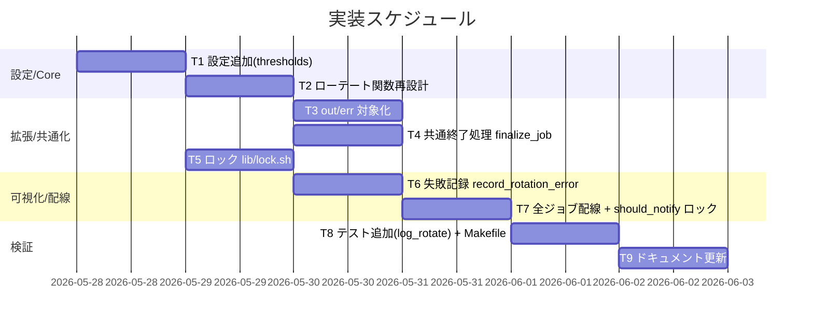

# 実装計画書: サブ D ログローテーションの是正

**プロジェクト名**: サブ D ログローテーションの是正
**作成日**: 2026 年 05 月 28 日
**最終更新**: 2026 年 05 月 28 日

> **重要**: **このドキュメントは常に更新**: 実装計画の変更、進捗状況の更新、バグの記録などがあった場合は、即座にこのドキュメントを更新してください。ドキュメントは「生きているドキュメント」として扱い、実装内容と常に同期させます。
> **必須項目**: 「必須」と明記した欄は空欄・抽象語のみで提出しないこと。テスト観点・BDD 仕様は具体ケースを 1 件以上記載すること。
>
> **用語**: [.agents/CONCEPTS.md §用語規約](../../../../.agents/CONCEPTS.md#用語規約) を参照。

---

## 1. 実装概要

### 1.1 実装方針（必須）

02_設計に従い、純粋判定関数（Core）と実 I/O（Shell）を分離してサイズ世代ローテートを実装する。既存の `notification_cooldown.sh`・`metrics.sh` と同じ Functional Core / Imperative Shell パターンと、A の `scripts/test/`（bats / 自前 assert フォールバック）方式を踏襲し、副作用ゼロ・固定入力のテストで BDD（UC1〜UC4）を担保する。既存挙動（出力先・書式・通知経路・launchd ラベル）は変更しない。

### 1.2 実装順序（必須: 1 件以上）

設定追加 → ローテート関数再設計 → out/err 対象化 → 共通終了処理 → ロック → 失敗記録 → 全ジョブ配線 → テスト → ドキュメント。



---

## 2. タスク分解

**必須**: 各タスクには **「テスト観点」（2.x.3）** と **「単体テスト仕様（BDD）」（2.x.4）** を記載する。観点の定義は **02_設計 §6** および **RULES のテスト戦略・[TEST_BDD_FORMAT.md](../../../../.agents/TEST_BDD_FORMAT.md)** を参照。

### 2.1 タスク 1: ローテート設定の追加（thresholds.sh）

#### 2.1.1 概要（必須）

上限サイズ・世代数・対象拡張子・ロックタイムアウトを `config/thresholds.sh` の 1 箇所に追加する。

#### 2.1.2 実装内容（必須: 1 件以上）

- `MHK_ROTATE_MAX_BYTES=5242880`（5MB）、`MHK_ROTATE_KEEP_GENERATIONS=3`、`MHK_ROTATE_EXTS="log out err"`、`MHK_LOCK_TIMEOUT_SEC=5` を追加。
- `log.sh` 側で各変数未設定時のフォールバック既定値（`${MHK_ROTATE_MAX_BYTES:-5242880}` 等）を持たせ、`thresholds.sh` を source しないジョブでも動作させる。

#### 2.1.3 テスト観点（必須）

**参照**: 観点定義は [02_設計 §6](./02_設計.md) と [RULES のテスト戦略・TEST_BDD_FORMAT](../../../../.agents/RULES.md#テスト戦略必須要件)。

##### 単体（必須 1 件以上）

- 設定未 source 時に `log.sh` 内のフォールバック既定値が適用される（環境変数を空にして `needs_rotation` が既定上限で動く）。

##### 結合/API

- 該当なし。

##### E2E/受け入れ

- 該当なし（設定値の定義のみ）。

##### バリデーション

- 該当なし。

#### 2.1.4 単体テスト仕様（BDD）（必須）

```gherkin
Feature: ローテート設定の集中管理
  Scenario: 設定変数を上書きすると上限が反映される
    Given MHK_ROTATE_MAX_BYTES を 100 に設定する
    When サイズ 100 のファイルで needs_rotation を判定する
    Then 要ローテート（戻り値 0）になる
```

```bash
# Given: MHK_ROTATE_MAX_BYTES を 100 に上書き
export MHK_ROTATE_MAX_BYTES=100
# When: サイズ 100 と上限 100 で needs_rotation
needs_rotation 100 "$MHK_ROTATE_MAX_BYTES"; status=$?
# Then: 戻り値 0（要ローテート, >= 境界）
[ "$status" -eq 0 ]
```

#### 2.1.5 依存関係

- なし（最初のタスク）。

#### 2.1.6 見積もり

- **工数**: 0.5h / **優先度**: 高

---

### 2.2 タスク 2: ローテート関数の再設計（needs_rotation / next_generation / rotate_file / rotate_logs）

#### 2.2.1 概要（必須）

mtime 削除をやめ、サイズ世代退避に再設計する。純粋判定（Core）と実 I/O（Shell）を分離する。

#### 2.2.2 実装内容（必須: 1 件以上）

- `file_size_bytes <path>`（`stat -f%z`、不在は 0）。
- `needs_rotation <size> <limit>`（純粋、`>=` で 0）。
- `next_generation <base>`（純粋、現存世代から次番号を算出）。
- `rotate_file <path>`（世代シフト大番号→小番号、本体 `mv .1`、`touch` 新規化、`KEEP_GENERATIONS` 超過削除、原子的 `mv`）。
- `rotate_logs`（`MHK_ROTATE_EXTS` をループし対象を走査して `rotate_file` 呼び出し）。現 L26-28 を置換。

#### 2.2.3 テスト観点（必須）

##### 単体（必須 1 件以上）

- 上限超過のファイルで `rotate_file` 後、本体サイズが上限以下になり `.1` が生成される（UC1-S1）。
- 上限未満のファイルは `rotate_logs` 後も変更されない（UC1-S2、回帰）。
- 境界: `size == limit` は要ローテート（`>=`）。

##### 結合/API

- 該当なし。

##### E2E/受け入れ

- 該当なし（関数単体で担保。実機 launchd は §2.3 で扱う）。

##### バリデーション

- `file_size_bytes` が不在ファイルで 0 を返す（異常系）。

#### 2.2.4 単体テスト仕様（BDD）（必須）

**UC1-S1: 上限超過で退避（01 UC1 シナリオ 1）**

```gherkin
Feature: サイズ超過ローテート
  Scenario: monitor.log が上限を超えると世代退避され本体が小さくなる
    Given 一時 LOG_DIR に上限超のサイズの monitor.log がある
    When rotate_logs を呼ぶ
    Then monitor.log が上限以下になり monitor.log.1 が生成される
```

```bash
# Given: 上限 100B に対し 200B の monitor.log を一時 LOG_DIR に用意
export LOG_DIR="$TMP"; export MHK_ROTATE_MAX_BYTES=100; export MHK_ROTATE_KEEP_GENERATIONS=3
head -c 200 /dev/zero | tr '\0' 'a' > "$LOG_DIR/monitor.log"
# When: rotate_logs を実行
rotate_logs
# Then: 本体は上限以下、.1 が存在し退避内容を保持
[ "$(file_size_bytes "$LOG_DIR/monitor.log")" -le 100 ]
[ -f "$LOG_DIR/monitor.log.1" ]
```

**UC1-S2: 上限未満は据え置き（01 UC1 シナリオ 2）**

```gherkin
Feature: サイズ超過ローテート
  Scenario: 上限未満なら何もしない
    Given 一時 LOG_DIR に上限未満の monitor.log がある
    When rotate_logs を呼ぶ
    Then ファイルは変更されず .1 も生成されない
```

```bash
# Given: 上限 1000B に対し 50B の monitor.log
export LOG_DIR="$TMP"; export MHK_ROTATE_MAX_BYTES=1000
head -c 50 /dev/zero | tr '\0' 'a' > "$LOG_DIR/monitor.log"
before=$(file_size_bytes "$LOG_DIR/monitor.log")
# When: rotate_logs を実行
rotate_logs
# Then: サイズ不変・退避なし
[ "$(file_size_bytes "$LOG_DIR/monitor.log")" -eq "$before" ]
[ ! -f "$LOG_DIR/monitor.log.1" ]
```

#### 2.2.5 依存関係

- タスク 1（設定）に依存。

#### 2.2.6 見積もり

- **工数**: 2h / **優先度**: 高

---

### 2.3 タスク 3: out/err の対象化

#### 2.3.1 概要（必須）

`*.out`/`*.err`（launchd 出力）を `rotate_logs` の対象拡張子に含める（L3 是正）。plist パスは変更しない。

#### 2.3.2 実装内容（必須: 1 件以上）

- `rotate_logs` が `MHK_ROTATE_EXTS="log out err"` をループして対象を集める。
- launchd 出力（追記中 fd）の扱いを実機確認し、`.out`/`.err` は退避(mv) ではなく原子的 truncate（`: > "$file"`）を既定とする（02 §3.2.3）。退避でも追記が継続するなら mv に統一。

#### 2.3.3 テスト観点（必須）

##### 単体（必須 1 件以上）

- 上限超過の `launchd.monitor.err` が `rotate_logs` で対象になり上限以下になる（UC2-S1）。
- 拡張子集合に含まれない `.txt` 等は対象外（除外確認）。

##### 結合/API

- 該当なし。

##### E2E/受け入れ

- launchd 追記中に truncate しても出力が継続することを実機で確認（手動。未達時は理由「launchd 実機は CI 非対象」を記載し、関数単体で代替担保）。

##### バリデーション

- 該当なし。

#### 2.3.4 単体テスト仕様（BDD）（必須）

**UC2-S1: .err 退避（01 UC2 シナリオ 1）**

```gherkin
Feature: out/err の対象化
  Scenario: 上限超過の .err が切り詰め/退避される
    Given 一時 LOG_DIR に上限超の launchd.monitor.err がある
    When rotate_logs を呼ぶ
    Then launchd.monitor.err が上限以下になる
```

```bash
# Given: 上限 100B に対し 300B の launchd.monitor.err と対象外の note.txt
export LOG_DIR="$TMP"; export MHK_ROTATE_MAX_BYTES=100; export MHK_ROTATE_EXTS="log out err"
head -c 300 /dev/zero | tr '\0' 'a' > "$LOG_DIR/launchd.monitor.err"
head -c 300 /dev/zero | tr '\0' 'a' > "$LOG_DIR/note.txt"
# When: rotate_logs を実行
rotate_logs
# Then: .err は上限以下、対象外の .txt は不変
[ "$(file_size_bytes "$LOG_DIR/launchd.monitor.err")" -le 100 ]
[ "$(file_size_bytes "$LOG_DIR/note.txt")" -eq 300 ]
```

#### 2.3.5 依存関係

- タスク 2 に依存。

#### 2.3.6 見積もり

- **工数**: 1h / **優先度**: 高

---

### 2.4 タスク 4: 共通終了処理 finalize_job

#### 2.4.1 概要（必須）

`log.sh` に `finalize_job <job>` を新設し、`rotate_logs` を確実に呼ぶ。冪等。

#### 2.4.2 実装内容（必須: 1 件以上）

- `finalize_job <job>`: `rotate_logs` を呼ぶ（将来の終了処理拡張点）。多重呼び出し安全（要否判定後に退避）。

#### 2.4.3 テスト観点（必須）

##### 単体（必須 1 件以上）

- `finalize_job monitor` を 2 回連続で呼んでもエラーにならず、上限超ファイルが 1 回退避された後は据え置き（冪等）。

##### 結合/API

- 該当なし。

##### E2E/受け入れ

- 該当なし（trap 発火はタスク 7 の配線で担保）。

##### バリデーション

- 該当なし。

#### 2.4.4 単体テスト仕様（BDD）（必須）

```gherkin
Feature: 共通終了処理
  Scenario: finalize_job を 2 回呼んでも安全（冪等）
    Given 上限超の monitor.log がある
    When finalize_job を 2 回呼ぶ
    Then エラーなく完了し本体は上限以下を保つ
```

```bash
# Given: 上限超の monitor.log
export LOG_DIR="$TMP"; export MHK_ROTATE_MAX_BYTES=100
head -c 300 /dev/zero | tr '\0' 'a' > "$LOG_DIR/monitor.log"
# When: finalize_job を 2 回呼ぶ
finalize_job monitor; finalize_job monitor; status=$?
# Then: 正常終了し本体は上限以下
[ "$status" -eq 0 ]
[ "$(file_size_bytes "$LOG_DIR/monitor.log")" -le 100 ]
```

#### 2.4.5 依存関係

- タスク 2 に依存。

#### 2.4.6 見積もり

- **工数**: 0.5h / **優先度**: 高

---

### 2.5 タスク 5: ロック lib/lock.sh

#### 2.5.1 概要（必須）

`mkdir` ベースの排他ロック（`acquire_lock`/`release_lock`/`with_lock`）を `$LOG_DIR/.locks/` 配下の固定パスで実装する。

#### 2.5.2 実装内容（必須: 1 件以上）

- `acquire_lock <name> [timeout]`: `mkdir "$LOG_DIR/.locks/<name>.lock"`。`timeout` 秒リトライ。成功 0 / 失敗 1。
- `release_lock <name>`: `rmdir`。
- `with_lock <name> <cmd...>`: 取得→`cmd` 実行→`trap`/明示で必ず解放。取得失敗時はロックなしで `cmd` 実行 + `record_rotation_error` 記録。

#### 2.5.3 テスト観点（必須）

##### 単体（必須 1 件以上）

- ロック保持中は 2 回目の `acquire_lock`（短 timeout）が失敗 1 を返す。
- `release_lock` 後は再取得が成功 0。
- 並行 2 サブシェルの cooldown 更新が `with_lock` で直列化され記録が壊れない（UC3-S1）。

##### 結合/API

- 該当なし。

##### E2E/受け入れ

- 該当なし。

##### バリデーション

- ロック失敗時もコマンド本体は実行される（可用性、01 §3.4）。

#### 2.5.4 単体テスト仕様（BDD）（必須）

**UC3-S1: 並行更新の直列化（01 UC3 シナリオ 1）**

```gherkin
Feature: 排他制御
  Scenario: 2 プロセスが同時に cooldown を更新しても記録が壊れない
    Given 2 つのサブシェルが同時に with_lock 下で cooldown を更新する
    When 双方が並行実行される
    Then ロックで直列化され COOLDOWN_FILE が key:epoch 形式を保つ（破損なし）
```

```bash
# Given: 一時 LOG_DIR/.locks と COOLDOWN_FILE、2 並行のインクリメント関数
export LOG_DIR="$TMP"; mkdir -p "$LOG_DIR/.locks"; export COOLDOWN_FILE="$TMP/cd"; : > "$COOLDOWN_FILE"
append_line() { with_lock notify-cooldown bash -c 'grep -v "^k:" "$COOLDOWN_FILE" > "$COOLDOWN_FILE.tmp" 2>/dev/null || true; echo "k:$(date +%s)" >> "$COOLDOWN_FILE.tmp"; mv "$COOLDOWN_FILE.tmp" "$COOLDOWN_FILE"'; }
# When: 2 サブシェルを並行起動し両方の完了を待つ
( append_line ) & p1=$!
( append_line ) & p2=$!
wait "$p1"; wait "$p2"
# Then: COOLDOWN_FILE は壊れず key:epoch 形式の行のみ（行数 1、tmp 残骸なし）
grep -qE "^k:[0-9]+$" "$COOLDOWN_FILE"
[ ! -e "$COOLDOWN_FILE.tmp" ]
```

#### 2.5.5 依存関係

- タスク 1（`.locks` 配置・timeout 設定）に依存。

#### 2.5.6 見積もり

- **工数**: 1.5h / **優先度**: 高

---

### 2.6 タスク 6: 失敗記録 record_rotation_error

#### 2.6.1 概要（必須）

ローテーション失敗・ディスク不足を握り潰さず `rotate.err` と stderr に記録する（L5 是正、`2>/dev/null` 廃止）。

#### 2.6.2 実装内容（必須: 1 件以上）

- `record_rotation_error <file> <reason>`: `[ts] [ERROR] [rotate] <file>: <reason>` を `$LOG_DIR/rotate.err` と stderr に出力。`rotate.err` 自体の書込失敗時は stderr のみ。
- `rotate_file` 内の `mv`/`touch`/`mkdir` の非 0 を捕捉して呼ぶ。

#### 2.6.3 テスト観点（必須）

##### 単体（必須 1 件以上）

- 退避先への書込が失敗する状況で `rotate.err` にエラー行が記録され、`rotate_logs` は非 0 終了せず継続する（UC4-S1）。

##### 結合/API

- 該当なし。

##### E2E/受け入れ

- 該当なし。

##### バリデーション

- 失敗が沈黙しない（stderr または `rotate.err` に出る）。

#### 2.6.4 単体テスト仕様（BDD）（必須）

**UC4-S1: 失敗記録（01 UC4 シナリオ 1）**

```gherkin
Feature: 失敗の可視化
  Scenario: 書き込み失敗時にエラーを記録し沈黙しない
    Given ローテーション先への書き込みが失敗する状況
    When rotate_logs を実行する
    Then rotate.err にエラーが記録され処理は継続する
```

```bash
# Given: 上限超の monitor.log を持つ LOG_DIR を読み取り専用にして mv を失敗させる
export LOG_DIR="$TMP"; export MHK_ROTATE_MAX_BYTES=100
head -c 300 /dev/zero | tr '\0' 'a' > "$LOG_DIR/monitor.log"
ERR_DIR="$TMP/errout"; mkdir -p "$ERR_DIR"; export ROTATE_ERR_FILE="$ERR_DIR/rotate.err"  # 記録先は書込可
chmod 555 "$LOG_DIR"  # mv/touch を失敗させる
# When: rotate_logs を実行（失敗しても継続）
rotate_logs; status=$?
chmod 755 "$LOG_DIR"  # teardown 前に戻す
# Then: 非 0 で落ちず、エラーが記録される
[ "$status" -eq 0 ]
grep -qE "\[ERROR\] \[rotate\]" "$ROTATE_ERR_FILE"
```

> 注: `chmod 555` で `mv` が失敗するため、テストは記録先を別ディレクトリ（`ROTATE_ERR_FILE`）に分離する。実装は `record_rotation_error` の出力先を環境変数で差し替え可能にし（既定 `$LOG_DIR/rotate.err`）、本ケースで検証する。`root` 実行では権限が効かないため、その場合は「mv 先に同名ディレクトリを置いて衝突させる」代替で失敗を模擬する。

#### 2.6.5 依存関係

- タスク 2 に依存。

#### 2.6.6 見積もり

- **工数**: 1h / **優先度**: 高

---

### 2.7 タスク 7: 全ジョブ配線 + should_notify のロック付与

#### 2.7.1 概要（必須）

全ジョブの終了時に `finalize_job` を確実に呼ぶ配線（L2 是正）と、A 由来 `should_notify` の cooldown 更新を `with_lock` で直列化する。

#### 2.7.2 実装内容（必須: 1 件以上）

- `monitor.sh`/`check-docker.sh`/`check-uptime.sh`/`refresh.sh` の冒頭に `trap 'finalize_job "$JOB"' EXIT` を設定。`monitor.sh` L89・`refresh.sh` L116 の既存 `rotate_logs` 呼び出しは削除（trap に一本化）。
- `mac-health` には付けず、子スクリプト側の trap に委譲（閲覧系を遅延させない）。
- `notification_cooldown.sh`: `should_notify` の read-modify-write 区間を `with_lock notify-cooldown` で囲む。判定・`key:epoch`・戻り値は不変。`.locks` 不在/`COOLDOWN_FILE` 未設定時は従来動作にフォールバック（A の UC3 が緑であること）。
- `notification_cooldown.sh` から `lib/lock.sh` を source（ガード付き）。

#### 2.7.3 テスト観点（必須）

##### 単体（必須 1 件以上）

- ロック付与後も A の UC3-S1/S2（`should_notify` 戻り値・`COOLDOWN_FILE` 更新）が緑（回帰）。
- `check-docker.sh` の複数 `exit 0` 経路でも `trap` でローテートが呼ばれる（静的確認 + シェル仕様で担保）。

##### 結合/API

- 該当なし。

##### E2E/受け入れ

- `mac-health run monitor` 実行後に肥大ログが退避される（手動受け入れ。未達時は CI 非対象を理由に記載）。

##### バリデーション

- ロック取得失敗時も `should_notify` が従来の戻り値を返す。

#### 2.7.4 単体テスト仕様（BDD）（必須）

```gherkin
Feature: 既存通知判定の回帰（ロック付与後）
  Scenario: ロックを足しても cooldown 経過時に通知し記録を更新する
    Given COOLDOWN_FILE に十分過去の swap:last がある
    When should_notify swap を呼ぶ
    Then 戻り値 0 で COOLDOWN_FILE が key:epoch 形式に更新される
```

```bash
# Given: .locks ありの LOG_DIR と十分過去の swap:last
export LOG_DIR="$TMP"; mkdir -p "$LOG_DIR/.locks"
export COOLDOWN_FILE="$TMP/cd"; export NOTIFICATION_COOLDOWN_MIN=60
echo "swap:$(($(date +%s) - 99999))" > "$COOLDOWN_FILE"
# When: should_notify swap を呼ぶ
should_notify "swap"; status=$?
# Then: 戻り値 0 かつ key:epoch 形式で更新（A UC3-S2 と同一期待・回帰）
[ "$status" -eq 0 ]
grep -qE "^swap:[0-9]+$" "$COOLDOWN_FILE"
```

#### 2.7.5 依存関係

- タスク 4（finalize_job）・タスク 5（lock）に依存。

#### 2.7.6 見積もり

- **工数**: 1.5h / **優先度**: 高

---

### 2.8 タスク 8: テスト追加（log_rotate）と Makefile フォールバック更新

#### 2.8.1 概要（必須）

`scripts/test/log_rotate.bats` と `scripts/test/log_rotate_test.sh`（自前 assert フォールバック）を追加し、Makefile のフォールバック節に連結する。

#### 2.8.2 実装内容（必須: 1 件以上）

- `log_rotate.bats`: UC1-S1 / UC1-S2 / UC2-S1 / UC3-S1 / UC4-S1 を bats で記述。`setup` で `TMP="$(mktemp -d)"`・`LOG_DIR="$TMP"`、`teardown` で `rm -rf "$TMP"`。`log.sh`/`lock.sh` を source。
- `log_rotate_test.sh`: 同シナリオを自前 assert（`assert_status`/`assert_eq`/`assert_match`、`monitor_test.sh` 流儀）で再現。bats 不在時に動く。
- Makefile `test-shell` のフォールバック節を `bash scripts/test/monitor_test.sh && bash scripts/test/metrics_test.sh && bash scripts/test/log_rotate_test.sh` に更新（A/C で判明した取りこぼし対策）。bats 利用節は `bats scripts/test/` のままで新規 `.bats` を自動収集。
- BDD 形式（`ユースケース:`/`シナリオ:`/`Given/When/Then` インライン）を `.agents/TEST_BDD_FORMAT.md` どおりに付す。並行直列化テスト（UC3-S1）はサブシェル 2 並行 + `with_lock` で検証する具体手順（§2.5.4）を実装する。

#### 2.8.3 テスト観点（必須）

##### 単体（必須 1 件以上）

- `make test-shell` が bats 環境・自前 assert 環境の双方で UC1〜UC4 を実行し緑。
- 全テストが一時ディレクトリ・固定入力で副作用ゼロ（`$HOME/Library/Logs/MacHealth` を汚さない）。

##### 結合/API

- 該当なし。

##### E2E/受け入れ

- 該当なし。

##### バリデーション

- 失敗 1 件で `make test-shell` が非 0 終了する（Makefile の `&&` 連結）。

#### 2.8.4 単体テスト仕様（BDD）（必須）

```gherkin
Feature: テストランナー統合
  Scenario: bats 不在環境で log_rotate の自前 assert が make から走る
    Given bats が PATH に無い
    When make test-shell を実行する
    Then log_rotate_test.sh が実行され UC1〜UC4 が緑になる
```

```bash
# Given: bats 不在を仮定（フォールバック節）
# When: フォールバックランナーを直接実行
bash scripts/test/log_rotate_test.sh; status=$?
# Then: 全ケース緑（非 0 で落ちない）
[ "$status" -eq 0 ]
```

> 全テストファイルは §2.2.4〜§2.7.4 の各 BDD（UC1-S1/UC1-S2/UC2-S1/UC3-S1/UC4-S1）を、テストまとまり直前に `ユースケース:`、各ケース直前に `シナリオ:`（01 のシナリオ名/意図と対応）、本文に `Given`/`When`/`Then`（必要に応じ `And`）のインラインコメントを付して記述する。

#### 2.8.5 依存関係

- タスク 2〜7 に依存。

#### 2.8.6 見積もり

- **工数**: 2h / **優先度**: 高

---

### 2.9 タスク 9: ドキュメント更新

#### 2.9.1 概要（必須）

ローテート方式・設定・ロックの仕様を反映する（README / 該当 docs があれば）。`mac-health logs` の世代連結（任意拡張、02 §3.7）を実装する場合はここで扱う。

#### 2.9.2 実装内容（必須: 1 件以上）

- ローテート上限・世代・対象拡張子・ロックの説明を該当ドキュメントに追記（既存 docs/README がある範囲で）。
- 任意: `mac-health logs` を「本体が短い場合は `.1` も連結 tail」に拡張（必須ではない）。

#### 2.9.3 テスト観点（必須）

##### 単体（必須 1 件以上）

- `mac-health logs` 拡張を実装した場合: 本体 + `.1` を連結して直近 N 行を返す（一時 LOG_DIR で検証）。未実装時は「該当なし（本体 tail で直近は読める）」。

##### 結合/API

- 該当なし。

##### E2E/受け入れ

- 該当なし。

##### バリデーション

- 該当なし。

#### 2.9.4 単体テスト仕様（BDD）（必須）

```gherkin
Feature: ログ閲覧の世代対応（任意）
  Scenario: 本体が短いとき直近世代も辿れる
    Given monitor.log が数行・monitor.log.1 に過去行がある
    When mac-health logs を実行する
    Then 本体と .1 の直近行が表示される
```

```bash
# Given: 本体 2 行・.1 に過去 3 行（任意拡張を実装した場合のみ）
# When: ログ閲覧を実行
# Then: 直近行が本体（+.1）から取得できる
# （未実装の場合は本シナリオを「該当なし」とし、本体 tail で代替）
true
```

#### 2.9.5 依存関係

- タスク 2〜8 に依存。

#### 2.9.6 見積もり

- **工数**: 0.5h / **優先度**: 低

---

## テスト観点

本実装計画全体のテスト観点は、02_設計 §6.1 の割当表に従う。核心は「肥大化が止まること（`needs_rotation`/`rotate_file`）」「`.out`/`.err` も対象（`rotate_logs`）」「並行更新の直列化（`with_lock`）」「失敗が握り潰されない（`record_rotation_error`）」の 4 点。各タスク §2.x.3 に具体ケースを記載。すべて一時ディレクトリ・固定入力で副作用ゼロ。並行直列化は §2.5.4 のサブシェル 2 並行手順で検証する。

---

## 単体テスト

`scripts/test/log_rotate.bats`（bats）と `scripts/test/log_rotate_test.sh`（自前 assert フォールバック）に実装。A の `monitor.bats`/`monitor_test.sh` と同方式（setup で `mktemp -d`、teardown で削除、関数を source）。Makefile の `test-shell` フォールバック節へ `log_rotate_test.sh` を `&&` 連結で追記する。BDD 形式は `.agents/TEST_BDD_FORMAT.md`（`ユースケース:`/`シナリオ:`/GWT インライン）に従う。

---

## BDD（01 ↔ 03 対応表）

| 01 BDD | 内容 | 03 タスク | 03 シナリオ |
| ------ | ---- | --------- | ----------- |
| UC1 シナリオ 1 | 上限超過で退避 | §2.2 | UC1-S1: 上限超で `.1` 退避・本体上限以下 |
| UC1 シナリオ 2 | 上限未満は据え置き | §2.2 | UC1-S2: 据え置き・退避なし |
| UC2 シナリオ 1 | `.err` も退避 | §2.3 | UC2-S1: `.err` 退避・対象外 `.txt` 不変 |
| UC3 シナリオ 1 | 並行更新の直列化 | §2.5 | UC3-S1: サブシェル 2 並行 + `with_lock` で破損なし |
| UC4 シナリオ 1 | ディスク不足/失敗の記録 | §2.6 | UC4-S1: mv 失敗を `rotate.err` に記録・継続 |
| （A 回帰） | should_notify の挙動維持 | §2.7 | ロック付与後も A UC3-S1/S2 が緑 |

---

## 3. 実装スケジュール

### 3.1 マイルストーン

| マイルストーン | 期日 | 成果物 |
| -------------- | ---- | ------ |
| Core/設定完成 | T1-T2 完了 | `thresholds.sh` 追記、`needs_rotation`/`next_generation`/`rotate_file`/`rotate_logs` |
| 機能完成 | T3-T7 完了 | out/err 対象化、`finalize_job`、`lib/lock.sh`、`record_rotation_error`、全ジョブ配線 |
| 検証完了 | T8-T9 完了 | `log_rotate.bats`/`log_rotate_test.sh`、Makefile 更新、ドキュメント |

### 3.2 実装フェーズ

#### フェーズ 1: Core/設定

- **タスク**: T1（設定）→ T2（ローテート関数）。

#### フェーズ 2: 拡張・共通化・排他・記録

- **タスク**: T3（out/err）/ T4（finalize_job）/ T5（lock）/ T6（失敗記録）→ T7（配線 + should_notify ロック）。

#### フェーズ 3: 検証・文書

- **タスク**: T8（テスト + Makefile）→ T9（ドキュメント）。

---

## 4. テスト計画

テスト観点・レベル・BDD 形式の定義は **02_設計 §6** および **RULES のテスト戦略・TEST_BDD_FORMAT** を参照。各タスクの §2.x.3 に具体ケース、§2.x.4 に BDD 仕様を記載した。

### 4.1 テストの優先順位

- クリティカル（肥大化停止 = `needs_rotation`/`rotate_file`、並行直列化 = `with_lock`）を厚くテスト。
- 影響範囲が広い `should_notify`（A 由来）の回帰を必ず含める。
- 全ジョブ配線（`trap`）はシェル仕様 + 静的確認で担保し、過剰な統合テストは作らない。

---

## 5. リスク管理

### 5.1 実装リスク

- **リスク**: launchd が `.out`/`.err` を開いたまま追記し、`mv` 退避後に古い inode へ書き続ける。
  - **対策**: `.out`/`.err` は原子的 truncate（`: > "$file"`）を既定とし、実機で挙動確認（02 §3.2.3）。
- **リスク**: `should_notify` へのロック付与で A の既存テストが壊れる。
  - **対策**: 判定・形式・戻り値は不変。`.locks`/`COOLDOWN_FILE` 未設定時はロックなしフォールバック。A の UC3 を回帰として再実行。
- **リスク**: `trap EXIT` の二重ローテート。
  - **対策**: 既存 `rotate_logs` 呼び出しを削除し trap 一本化。`finalize_job`/`rotate_logs` は冪等。
- **リスク**: 失敗記録の再帰（記録先がローテート対象）。
  - **対策**: `rotate.err` と stderr に分散。書込失敗時は stderr のみ。

---

## 6. 参考資料

### プロジェクトドキュメント

- [`02_設計.md`](./02_設計.md) - 設計
- [`01_要件定義.md`](./01_要件定義.md) - 要件定義

### その他の参考資料

- `scripts/lib/log.sh`(L26-28)、`scripts/lib/lock.sh`（新設）、`scripts/bin/notification_cooldown.sh`(L15-32)、`scripts/bin/monitor.sh`(L21,L89)、`check-docker.sh`/`check-uptime.sh`/`refresh.sh`(L116)/`mac-health`、`scripts/config/thresholds.sh`、`launchagents/*.plist.template`、`scripts/test/monitor.bats`/`monitor_test.sh`（テスト方式の手本）、`Makefile`（フォールバック節）

---

## 7. 前のステップ

この実装計画書は、以下のドキュメントを基に作成されています：

- **前**: [`02_設計.md`](./02_設計.md) - 設計フェーズ

---

## 8. 次のステップ

この実装計画書の承認後、以下のステップに進みます：

- 本サブ issue（D）は単一の実装単位のため、実装フェーズ（execution）に直接進む（implement-feature を委譲）。

**用語**: [.agents/CONCEPTS.md §用語規約](../../../../.agents/CONCEPTS.md#用語規約) を参照。
