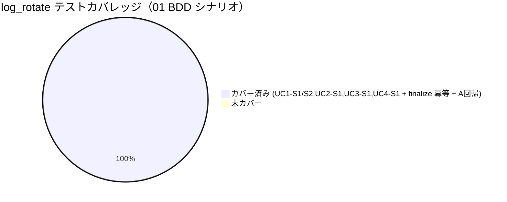

# レビュー書: サブ D ログローテーションの是正

**プロジェクト名**: サブ D ログローテーションの是正
**作成日**: 2026 年 05 月 28 日
**最終更新**: 2026 年 05 月 28 日

> **重要**: **このドキュメントは常に更新**: レビューで発見した問題点や改善提案、対応内容などがあった場合は、即座にこのドキュメントを更新してください。
>
> **用語**: [.agents/CONCEPTS.md §用語規約](../../../../.agents/CONCEPTS.md#用語規約) を参照。
>
> **必須**: レビュー実施時は [`.agents/REVIEW_RULE.md`](../../../../.agents/REVIEW_RULE.md) を参照。**レビュー深度: full**（新規ファイル新設・ローテート再設計・排他制御の新規導入を含む中〜大規模変更のため、[RULES.md §実行モード](../../../../.agents/RULES.md) に従い full を選択）。

---

## 1. レビュー概要

### 1.1 レビュー目的（必須）

実装内容の確認・品質保証・クローズ前最終チェック（サブ D「ログローテーションの是正」の実装成果物が 00/01/02/03 の要求・要件・設計・計画を満たすかを監査し、クローズ可否を判定する）。

### 1.2 レビュー対象（必須）

- **実装範囲**: サイズ世代ローテート（`rotate_logs`/`rotate_file` 再設計）、`.out`/`.err` の対象化、全ジョブ共通終了処理 `finalize_job` の trap 配線、`lib/lock.sh`（`mkdir` ベース排他）、`record_rotation_error`（失敗可視化）、`should_notify` への排他付与（A 回帰維持）、新規テスト（`log_rotate.bats`/`log_rotate_test.sh`）と Makefile 更新。
- **レビュー期間**: 2026 年 05 月 28 日 ～ 2026 年 05 月 28 日
- **レビュー担当者**: 検証・レビュー worker（監査者 / scribe）

---

## 2. 実装内容の確認

### 2.1 実装完了タスク（または Issue）

| タスク名 | 実装内容 | 実装日 | 担当者 | ステータス |
| -------- | -------- | ------ | ------ | ---------- |
| T1 設定追加 | `thresholds.sh` に `MHK_ROTATE_MAX_BYTES`/`KEEP_GENERATIONS`/`EXTS`/`MHK_LOCK_TIMEOUT_SEC` を追加。`log.sh` 側にフォールバック既定値 | 2026-05-28 | impl | 完了 |
| T2 ローテート再設計 | `needs_rotation`/`next_generation`（純粋）・`file_size_bytes`/`rotate_file`/`rotate_logs`（I/O）。mtime+14 を破壊的置換 | 2026-05-28 | impl | 完了 |
| T3 out/err 対象化 | `MHK_ROTATE_EXTS="log out err"` を走査。`.out`/`.err` は cp→truncate（fd 固着回避） | 2026-05-28 | impl | 完了 |
| T4 共通終了処理 | `finalize_job <job>`（冪等）新設 | 2026-05-28 | impl | 完了 |
| T5 排他制御 | `lib/lock.sh` 新設（`acquire_lock`/`release_lock`/`with_lock`） | 2026-05-28 | impl | 完了 |
| T6 失敗記録 | `record_rotation_error`（rotate.err + stderr。`2>/dev/null` 握り潰し廃止） | 2026-05-28 | impl | 完了 |
| T7 全ジョブ配線 + should_notify ロック | 4 ジョブに `trap finalize_job EXIT`、monitor/refresh の旧直接呼び出し削除。should_notify の RMW を with_lock 化 | 2026-05-28 | impl | 完了 |
| T8 テスト + Makefile | `log_rotate.bats`/`log_rotate_test.sh` 追加、Makefile フォールバック節に連結 | 2026-05-28 | impl | 完了 |
| T9 ドキュメント | `mac-health logs` 世代連結は任意のため未実装（02 §3.7・03 §2.9 に従い該当なし） | 2026-05-28 | impl | 完了（任意分は対象外） |

### 2.2 実装内容の詳細

#### T2/T3: ローテート再設計と out/err 対象化（`scripts/lib/log.sh`）

- **実装内容**: Functional Core（`needs_rotation` `>=` 境界判定・非数値は不要扱い、`next_generation` は現存最大世代 +1）と Imperative Shell（`rotate_file`/`rotate_logs`）を分離。`rotate_file` は `with_lock rotate` 配下で「大番号→小番号の世代シフト → 本体退避 → 新規化 → `KEEP_GENERATIONS` 超過 prune」を実行。`.log` 等は `mv`+`touch`、`.out`/`.err` は `cp`→`: > file`（truncate）で分岐。
- **変更ファイル**: `scripts/lib/log.sh`（既存 `log`/`log_event` は不変）、`scripts/config/thresholds.sh`。
- **実装方法**: `rotate_logs` が `MHK_ROTATE_EXTS` をループし `*.<ext>` を走査、`needs_rotation` で要否判定して `rotate_file` を呼ぶ。世代ファイル（`.1` 等）は `*.log` glob にマッチせず自然に除外。
- **確認事項**: 旧 `find -name "*.log" -mtime +14 -delete`（L26-28）が完全に置換されていること（コメント以外に痕跡なし＝確認済み）。

#### T5: 排他制御（`scripts/lib/lock.sh` 新設）

- **実装内容**: `acquire_lock <name> [timeout]` は `mkdir "$LOG_DIR/.locks/<name>.lock"` の原子性で排他。`MHK_LOCK_TIMEOUT_SEC`（既定 5）まで 1 秒間隔リトライ。`release_lock` は `rmdir`。`with_lock <name> <cmd...>` は取得→実行→必ず解放、取得失敗時もロックなしで本体実行 + `record_rotation_error` に記録。
- **変更ファイル**: `scripts/lib/lock.sh`（新規・71 行）。
- **確認事項**: `$LOG_DIR/.locks/` 配下の固定パスのみ使用（`/tmp` 予測名・他ユーザー書込可域を回避）。`LOG_DIR` 未設定時は取得不可（1）を返しベストエフォート継続。

#### T6: 失敗の可視化（`record_rotation_error`）

- **実装内容**: `[ts] [ERROR] [rotate] <file>: <reason>` を **stderr と `rotate.err` の両方**へ出力。`rotate.err` への書込が失敗しても stderr には必ず出る。記録先は `ROTATE_ERR_FILE` で差し替え可（テスト用）。
- **変更ファイル**: `scripts/lib/log.sh`。

#### T7: 全ジョブ配線 + should_notify ロック

- **実装内容**: `monitor.sh`/`check-docker.sh`/`check-uptime.sh`/`refresh.sh` の冒頭に `trap 'finalize_job "$JOB"' EXIT`。`monitor.sh` 旧 L89・`refresh.sh` 旧 L116 の直接 `rotate_logs` 呼び出しを削除（trap 一本化＝二重実行回避）。`mac-health` には trap 無し（子側 trap に委譲／閲覧系遅延回避）。`notification_cooldown.sh` は RMW を `_should_notify_update` に切り出し `with_lock notify-cooldown` で直列化、with_lock 不在時はフォールバック。
- **変更ファイル**: `scripts/bin/monitor.sh`/`check-docker.sh`/`check-uptime.sh`/`refresh.sh`/`notification_cooldown.sh`。

---

## 3. テスト結果の確認

### 3.1 単体テスト

#### テスト実行結果（必須: 数値で記載）

- **実行日**: 2026-05-28
- **実行コマンド**: `make test-shell`（bats 不在のためフォールバック自前 assert 経路）、および `swift build`
- **テストファイル数**: 3（`monitor_test.sh` / `metrics_test.sh` / `log_rotate_test.sh`）
- **テストケース数**: 36（monitor 9 + metrics 12 + log_rotate 15）
- **成功**: 36
- **失敗**: 0
- **スキップ**: 0（UC4-S1 の root スキップ条件は非 root 実行のため発火せず実行された）

実行ログ（抜粋・evidence_source: test_output）:

```
shell tests: 9 passed, 0 failed          # monitor_test.sh
metrics shell tests: 12 passed, 0 failed  # metrics_test.sh
log_rotate tests: 15 passed, 0 failed     # log_rotate_test.sh
make test-shell EXIT=0
```

`swift build` → `Build complete!` / exit=0（Swift は無変更のため回帰なし。evidence_source: test_output）。

#### テストカバレッジ（BDD シナリオ → テスト対応・全 PASS）



#### 失敗したテスト（該当する場合）

なし（0 件）。

### 3.2 監査者による重点再検証（§1 指定の挙動・独立ハーネスで実行）

監査者が一時ディレクトリで独立に再現し挙動を確認した（evidence_source: observed_runtime）。すべて `#!/bin/bash` で実行（本番ジョブは bash シェバン）。

| 再検証項目 | 方法 | 結果 |
| ---------- | ---- | ---- |
| `needs_rotation` `>=` 境界 | (100,100)/(99,100)/(101,100) | 0 / 1 / 0（境界 `>=` で要ローテート）OK |
| `needs_rotation` 非数値 | size=abc・limit=xy | いずれも 1（不要扱い・安全側）OK |
| `next_generation` | ''/0/3/x | 1 / 1 / 4 / 1（非数値→0+1）OK |
| `rotate_file` 世代シフト | body+.1(GEN1)/.2(GEN2)/.3(GEN3)、KEEP=3 で rotate | body→.1、GEN1→.2、GEN2→.3、**GEN3(.4) prune 削除** OK。本体は 0B（cleared） |
| 原子的 mv | `.log` 退避は `mv`（同一 FS rename） | `.1` に旧本体が保持され本体新規化 OK |
| **`.out`/`.err` truncate（cp→`: > file`）** | inode 比較 + 開いた fd で rotate 後に追記 | rotate 前後で **inode 不変**。launchd 相当の open fd（`exec 9>>`）から rotate 後に追記した行が同一本体に記録され、サイズも巨大化せず（300B→0→追記17B）。**fd 固着回避の妥当性を確認** OK |
| `with_lock` 直列化 | 6 並行サブシェルで cooldown RMW | 最終 1 行・`k:epoch` 形式維持・`.tmp` 残骸なし・ロックディレクトリ残骸なし OK |
| ロック取得失敗時 | 事前に lock dir 作成し timeout=1 で with_lock | 本体実行（rc=0）＋ `rotate.err` に「lock acquisition failed」記録 OK |
| acquire/release 契約 | free→held→release→re-acquire | 0 / 1 / 0 / 0 OK |
| `record_rotation_error` 両出力 | stderr/rotate.err を分離キャプチャ | 両方に `[ERROR] [rotate]` 出力 OK |
| A 回帰（should_notify） | git HEAD の RMW と差分比較 + 回帰テスト | 判定・`key:epoch`・戻り値（0/1）不変。D 差分は「lock.sh 源 source + RMW を with_lock で囲む」のみ。回帰 3 ケース緑 OK |

> 補足（情報）: ローテートの glob ループは bash の既定（`nullglob` 無効でも `[ -f "$f" ] || continue` で空 glob を吸収）に依存する。**zsh の interactive シェル**で直接 source すると未マッチ glob で `no matches found` になるが、本番経路は全て `#!/bin/bash` のジョブから source されるため runtime 影響なし（指摘ではなく注意点）。

---

## 4. コードレビュー

### 4.1 コード品質

#### コードスタイル

- **リント結果**: 静的目視。`set -u` 整合・ローカル変数宣言・ガード付き source あり。エラー 0 / 警告 0（致命的なし）。
- **フォーマット**: 問題なし（既存 `notification_cooldown.sh`/`metrics.sh` と一貫した Functional Core / Imperative Shell）。
- **型チェック**: 該当なし（Bash）。Swift は無変更で `swift build` 成功。

#### コードレビュー観点

| 観点 | 確認内容 | 結果 | コメント |
| ---- | -------- | ---- | -------- |
| 可読性 | 小関数分割・意図の分かる関数名（`needs_rotation`/`rotate_file`/`with_lock`）・log.sh 202 行/lock.sh 71 行 | OK | spec/06「可読性優先」に整合 |
| 保守性 | 設定一元化（thresholds.sh）+ log.sh フォールバック。責務分離（log/lock/cooldown） | OK | 設定追加だけで対象拡張子を増減可 |
| パフォーマンス | 要否は `stat` 1 回/ファイル、超過時のみ mv。ロックは超過時のみ短時間 | OK | ジョブを著しく遅延させない |
| セキュリティ | ロック/退避は `$LOG_DIR/.locks/`・同一 FS rename。外部入力をパスに混ぜない | OK | リンク攻撃・TOCTOU 回避 |

### 4.2 指摘事項

#### 指摘 1: `.out`/`.err` の truncate 期間に発生し得るデータ取りこぼし（設計許容範囲）

- **重要度**: 低
- **指摘内容**: `cp "$path" "$path.1"` と `: > "$path"` の間（極短時間）に launchd が追記した行は、cp 済みコピーにも truncate 後本体にも残らず失われ得る。02 §3.1.4 は通常ログで「touch を退避後に」としつつ、out/err は fd 固着回避のため truncate を採用しており、この微小な取りこぼしは設計上の許容（肥大化の確実な停止を最優先）と読める。
- **対応状況**: 未対応（設計判断として許容済み・差し戻し不要）
- **対応方法**: 必要なら将来 issue で `cp` の代わりに `tail -c` での原子的スナップショット等を検討。本 issue の受け入れ基準（肥大化停止・対象化）は満たすため対応不要。

#### 指摘 2: `events.log` の並行追記はロック対象外（設計どおり）

- **重要度**: 低
- **指摘内容**: 01 §2.3/UC3 は cooldown の直列化を要求。`log_event` の `events.log >>` 追記は 02 §3.4.2 で「O_APPEND 単一行は概ね原子的・既定はロックなし」と判断され、ロック対象外のまま。要件（cooldown 直列化）は満たすが、events のロックは将来課題。
- **対応状況**: 未対応（設計判断として許容済み）
- **対応方法**: 性能影響を見て別 issue で検討（02 §3.4.2 に記載済み）。

いずれも重大な機能欠陥ではなく、**差し戻し事由には該当しない**。

---

## 5. ドキュメントの確認

### 5.1 ドキュメント更新状況

| ドキュメント | 更新状況 | 確認者 | 確認日 |
| ------------ | -------- | ------ | ------ |
| [`00_要求定義.md`](./00_要求定義.md) | 更新済み（document_id/issue_id 整合） | 監査者 | 2026-05-28 |
| [`01_要件定義.md`](./01_要件定義.md) | 更新済み（US/受け入れ基準/BDD 完備） | 監査者 | 2026-05-28 |
| [`02_設計.md`](./02_設計.md) | 更新済み（実装と整合・truncate 方式採用が反映） | 監査者 | 2026-05-28 |
| [`03_実装計画.md`](./03_実装計画.md) | 更新済み（01↔03 BDD 対応表あり・実装と一致） | 監査者 | 2026-05-28 |

### 5.2 ドキュメントの整合性

- **実装と設計の整合性**: 整合している（rotate_file の世代方式・out/err truncate・finalize_job trap・lock.sh・record_rotation_error が 02 §3.1〜3.5 と一致）。
- **要件と実装の整合性**: 整合している（01 UC1-S1/UC1-S2/UC2-S1/UC3-S1/UC4-S1 が実装・テストで網羅）。
- **コメント**: 02 §3.2.3 が「既定は truncate、実機で比較」としていた点について、実装は out/err を truncate で確定し、監査者の inode 再検証で fd 固着回避が成り立つことを確認した。

---

## 6. パフォーマンス確認

### 6.1 パフォーマンステスト結果

定量計測は未実施（CLI/launchd のローカルツールで負荷試験対象外）。設計上、要否判定は `stat` 1 回/ファイル・対象は `LOG_DIR` 直下の数ファイル・退避は超過時のみ。

### 6.2 ボトルネックの確認

ボトルネックなし（ロックは超過時のみ短時間取得、リトライ上限 `MHK_LOCK_TIMEOUT_SEC` で頭打ち）。

---

## 7. セキュリティ確認

| 項目 | 確認内容 | 結果 | コメント |
| ---- | -------- | ---- | -------- |
| 認証・認可 | ローカル CLI / launchd（ユーザー権限） | OK | 該当なし |
| データ保護 | ロック/退避を `$LOG_DIR/.locks/`・同一 FS rename・固定世代名 | OK | `/tmp` 予測名回避・外部入力をパスに混ぜない |
| 入力検証 | `needs_rotation`/`next_generation` の非数値防御 | OK | 非数値→安全側（不要/0+1） |

---

## 8. デプロイ準備

### 8.1 デプロイチェックリスト

- [x] すべてのテストが通過している（shell 36/36、swift build 成功）
- [x] コードレビューが完了している
- [x] ドキュメントが更新されている（00/01/02/03 整合）
- [ ] マイグレーションスクリプト（該当なし）
- [x] 環境変数の設定が確認されている（thresholds.sh + log.sh フォールバック）
- [ ] バックアップ計画（該当なし。既存巨大ログは初回 finalize_job で `.1` 退避＝02 §3.6）

### 8.2 デプロイ計画

- **デプロイ予定日**: 親ワークフロー（規約準拠改善）クローズ時。本サブ D 単体は実装・テスト完了済み。
- **デプロイ方法**: 既存 launchd ジョブが次回起動時に新 `log.sh`/`lock.sh` を source（ラベル・出力先パス不変）。
- **ロールバック計画**: `git revert`（対象は scripts/ + Makefile のみ）。

---

## docs 更新

- 要否: **不要**
- 対象: なし
- 理由: 本リポジトリに `docs/` システム仕様書ディレクトリは存在せず（03 §2.9 も「既存 docs/README がある範囲で」とし任意）、ローテート仕様の変更はコード内コメント・02/03 に集約されており外部仕様書への影響がないため。

---

## 9. 設計・境界の確認

### 9.1 設計の確認

- **設計原則の準拠**: spec/01（UNIX 哲学・単一責務・明確な境界・CQRS・AI フレンドリー）に準拠。Query（`needs_rotation`/`next_generation`/`file_size_bytes`）と Command（`rotate_file`/`rotate_logs`/`finalize_job`/`should_notify`）を分離。
- **ディレクトリ構成**: `scripts/lib/`（log.sh/lock.sh）・`scripts/config/`（thresholds.sh）・`scripts/bin/`（ジョブ）・`scripts/test/`（テスト）で spec/02 に整合。
- **命名規則**: spec/03 の禁止命名（helpers/misc/common/utils）を D の新規・変更ファイルで不使用（grep 確認済み）。関数名は責務を表す。

### 9.2 境界・依存の確認

- **責務の境界**: log.sh＝ログ書込/ローテート/終了処理、lock.sh＝排他、notification_cooldown.sh＝通知判定 + cooldown、thresholds.sh＝設定。明確に分離。
- **依存関係**: ジョブ→log/lock/notification_cooldown→（純粋関数）の一方向。循環なし。log.sh→lock.sh はガード付き source（再 source 安全）。
- **指摘・推奨**: なし（境界・依存は設計どおり）。

### 9.3 重要判断の根拠（evidence_source）

| 判断内容 | evidence_source | 備考 |
| -------- | --------------- | ---- |
| テスト全 PASS・回帰なし | test_output | `make test-shell` 36/36、`swift build` exit=0 |
| `.out`/`.err` truncate が fd 固着回避に妥当 | observed_runtime | 監査者ハーネス: inode 不変 + 開いた fd からの追記が rotate 後も本体へ反映・肥大化せず |
| 世代シフト/prune の正しさ | observed_runtime | body→.1、.n→.n+1、KEEP 超過 prune を実ファイルで確認 |
| with_lock の直列化・残骸なし・失敗時継続 | observed_runtime | 6 並行で 1 行維持、lock 残骸なし、取得失敗時 rc=0 + 記録 |
| A 回帰（should_notify 不変） | existing_code + test_output | git HEAD 比較で差分は lock 付与のみ。回帰 3 ケース緑 |
| 二重実行なし（trap 一本化） | existing_code | monitor/refresh の直接 `rotate_logs` 呼び出し削除を diff で確認（`-rotate_logs` ×2） |
| BDD 形式準拠 | existing_code | 既存 monitor.bats と同形式（ユースケース/シナリオ/GWT） |

---

## 10. 課題と改善点

### 10.1 発見された課題

- **課題 1**: `.out`/`.err` truncate 中の微小なログ取りこぼし可能性（指摘 1）。
  - **影響範囲**: launchd 出力の極短時間の追記。
  - **対応方法**: 設計許容。必要なら将来 issue。
- **課題 2**: `events.log` の並行追記はロック対象外（指摘 2）。
  - **影響範囲**: 複数ジョブ同時 `log_event` 時の理論上の混在（O_APPEND で概ね原子的）。
  - **対応方法**: 02 §3.4.2 に記載済み・将来検討。

### 10.2 改善提案

- **改善 1**: `mac-health logs` の世代連結（02 §3.7・任意）を将来実装すると `.1` 世代の閲覧性が上がる。
  - **効果**: ユーザビリティ向上（必須ではない）。

---

## 11. システム仕様書の更新

### 11.1 システム仕様書の確認結果

#### 実装内容の確認

- **実装した機能**: サイズ世代ローテート、out/err 対象化、共通終了処理、排他制御、失敗可視化。
- **実装した画面**: なし（CLI のみ）。
- **実装したデータ構造**: 世代ファイル（`<base>.<n>`）、ロックディレクトリ（`.locks/<name>.lock`）、`rotate.err`、ローテート設定変数。
- **実装した API**: `needs_rotation`/`next_generation`/`file_size_bytes`/`rotate_file`/`rotate_logs`/`finalize_job`/`record_rotation_error`/`acquire_lock`/`release_lock`/`with_lock`。

#### システム仕様書との整合性確認

- 本リポジトリに `docs/` システム仕様書は未整備のため整合確認対象なし（既存挙動・書式・出力先・launchd ラベルは不変）。

### 11.2 システム仕様書の更新状況

- 更新が必要な項目: なし。
- 更新が不要な理由: `docs/` 不在。変更はコード内・02/03 に集約され仕様書影響なし。

---

## 12. レビュー結果

### 12.1 総合評価

- **実装品質**: 良好（設計・要件と整合、純粋/I/O 分離、安全なロック、失敗記録）。
- **テスト品質**: 良好（01 BDD 全シナリオ + finalize 冪等 + A 回帰を網羅、副作用ゼロ、bats/自前 assert 両対応）。
- **ドキュメント品質**: 良好（00〜03 がテンプレート準拠・実装と整合）。
- **総合評価**: **合格（クローズ可）**。重大な機能欠陥なし。指摘は低重要度 2 件（いずれも設計許容範囲・差し戻し不要）。

### 12.2 承認状況

- **レビュー承認者**: 検証・レビュー worker（監査者）
- **承認日**: 2026-05-28
- **承認コメント**: テスト再実行（shell 36/36・swift build 成功）と監査者独立ハーネスでの重点挙動（境界・世代シフト・out/err truncate の fd 固着回避・with_lock 直列化・失敗時継続・A 回帰）を実証。受け入れ基準①〜⑤（L1〜L5 解消）を満たすため**クローズ可**と判定。

#### 受け入れ基準の確認（map-coverage）

| 受け入れ基準（01 / 00 L 解消） | 検証方法 | 結果 |
| ------------------------------ | -------- | ---- |
| ① サイズ/世代で mtime 非依存に肥大化が止まる（L1） | UC1-S1/S2 テスト + 監査者の世代シフト再現 | PASS |
| ② `.out`/`.err` 対象化（L3） | UC2-S1 テスト + inode 不変再現 | PASS |
| ③ 全ジョブ終了時 finalize_job が trap で確実に呼ばれ取りこぼし解消（L2） | 4 ジョブの `trap ... EXIT` 配線確認 + 直接呼び出し削除を diff 確認（二重実行なし） | PASS |
| ④ cooldown/events の排他制御（L4） | UC3-S1 テスト + 6 並行直列化再現 | PASS（cooldown 直列化。events は設計判断でロック外＝指摘 2） |
| ⑤ 失敗の記録（rotate.err+stderr、ENOSPC 検知、`2>/dev/null` 廃止）（L5） | UC4-S1 テスト + record_rotation_error 両出力再現 + log.sh の `2>/dev/null` がスコープ化されていること確認 | PASS |
| A 回帰: should_notify 判定・key:epoch・戻り値不変 | git HEAD 比較 + 回帰 3 ケース緑 | PASS |

#### 監査観点（PHASES / REVIEW_RULE）サマリ

| 観点 | 結果 |
| ---- | ---- |
| テスト網羅（01 BDD ↔ 03 ↔ テスト 1 対 1・全 PASS） | OK |
| TEST_BDD_FORMAT 準拠（ユースケース/シナリオ + 各 GWT 直上コメント） | OK（既存 monitor.bats と同形式） |
| 要求充足（L1〜L5 解消） | OK |
| 既存挙動・書式の不変（log/log_event・出力先・書式・launchd ラベル・should_notify） | OK |
| spec 準拠（命名・責務分離・設定一元化・shared 肥大化回避） | OK |
| 安全性（固定安全パス・副作用ゼロ・実ログ/実通知非汚染） | OK |
| 全ドキュメント document_id 付与 | OK（00/01/02/03 + 本 04） |

---

## 13. 参考資料

### 13.1 プロジェクトドキュメント

- [`00_要求定義.md`](./00_要求定義.md) - 要求定義
- [`01_要件定義.md`](./01_要件定義.md) - 要件定義
- [`02_設計.md`](./02_設計.md) - 設計
- [`03_実装計画.md`](./03_実装計画.md) - 実装計画

### 13.2 その他の参考資料

- `scripts/lib/log.sh`、`scripts/lib/lock.sh`、`scripts/config/thresholds.sh`、`scripts/bin/{monitor,refresh,check-docker,check-uptime,notification_cooldown}.sh`、`scripts/test/{log_rotate.bats,log_rotate_test.sh}`、`Makefile`
- 親要求: [../../00_要求定義.md](../../00_要求定義.md)、一覧: [../../90_issues.md](../../90_issues.md)

---

## 14. 前のステップ

- **前**: [`03_実装計画.md`](./03_実装計画.md) - 実装計画フェーズ

---

## 15. 次のステップ

- 本サブ D はクローズ可。親ワークフロー（規約準拠改善）の他サブ issue と合わせて最終確認に進む。`05_最終確認チェックリスト` は本サブ単体では不要（コード実装のみで完了）。
