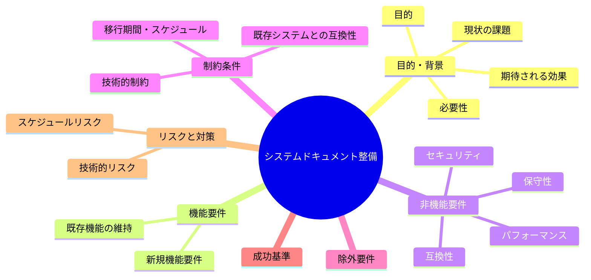
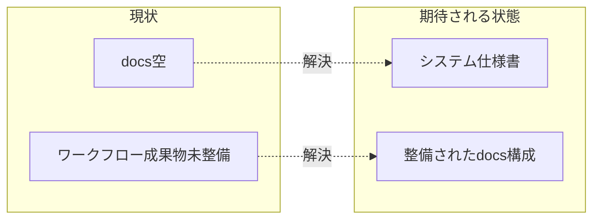

# 要求定義書: サブ E システムドキュメント整備

**プロジェクト名**: サブ E システムドキュメント整備
**作成日**: 2026 年 05 月 27 日
**最終更新**: 2026 年 05 月 27 日

> **重要**:
>
> - 要求定義書は全体像を把握するためのものです。詳細は要件定義書以降で記載します。
> - **このドキュメントは常に更新**します。
> - **必須項目**: 判定可能な形で記入すること。
>
> **用語**: [.agents/CONCEPTS.md §用語規約](../../../../.agents/CONCEPTS.md#用語規約) を参照。

---

## 要求定義の全体像

---

## 1. 目的・背景

### 1.1 目的（必須）

空の docs にシステム仕様書を整備し設計と実装の整合を保つ。

### 1.2 背景

- **現状の課題**:
  - D1: `docs/` が空。`.agents/DOCS_RULES.md` が想定するシステム仕様書（アーキテクチャ・ディレクトリ構成等）が未整備。
  - D2: ワークフロー成果物（00-04）が未整備で、フレームワーク導入効果が出ていない。

- **必要性**:
  - 新規参画者・AI がシステム全体像を把握できる単一の入口が必要。
  - spec の「docs と実装の不整合を放置しない」（spec/06）を満たすため、まず docs を整備する。

### 1.3 期待される効果（必須: 1 件以上）

- **効果 1**: `docs/` にアーキテクチャ・ディレクトリ構成のシステム仕様書が存在する（○/× 判定可）。
- **効果 2**: 仕様書が `.agents/DOCS_RULES.md` の想定構成に沿う（○/× 判定可）。
- **効果 3**: 仕様書に Swift アプリ・シェルジョブ・launchd の関係が図/表で示される（○/× 判定可）。

**現状と期待される状態の比較**:

---

## 2. 機能要件

### 2.1 既存機能の維持（該当する場合）

- 実装は変更しない。ドキュメントが現状の実装を正しく記述すること。

### 2.2 新規機能要件

- `docs/` にシステム仕様書（アーキテクチャ概要・ディレクトリ構成・コンポーネント関係・ジョブ一覧）を作成。
- `.agents/DOCS_RULES.md` の想定構成・命名・document_id 付与に準拠。

---

## 3. 非機能要件

### 3.1 パフォーマンス

- 該当なし（ドキュメント）。

### 3.2 セキュリティ

- 機密情報（個人パス・トークン等）を含めない。

### 3.3 互換性

- 既存の `.agents`・`.workflow` の参照構造と矛盾しない。

### 3.4 保守性

- 実装変更時に更新すべき箇所が分かる粒度で書く。document_id を付与する。

---

## 4. 制約条件

### 4.1 技術的制約

- Markdown + Mermaid。`.agents/DOCS_RULES.md` と `.workflow/templates/docs/`（存在する場合）に準拠。

### 4.2 既存システムとの互換性

- 現行実装（Swift UI / シェルジョブ / launchd）を正確に反映する。

### 4.3 移行期間・スケジュール

- 他サブの実装が進むと内容が変わるため、初版作成後は変更に追従する旨を明記する。

---

## 5. 除外要件

- ユーザー向けの操作マニュアル・配布手順書は対象外（システム仕様書に限定）。

---

## 6. 成功基準（必須: 1 件以上）

- `docs/` に最低 1 本のシステム仕様書（アーキテクチャ + ディレクトリ構成）が存在する。
- `.agents/DOCS_RULES.md` の想定する構成・命名・document_id 付与に沿っている。
- Swift アプリ・シェルジョブ・launchd の関係が図または表で示されている。

---

## 7. リスクと対策

### 7.1 技術的リスク

- **リスク**: 他サブの実装変更でドキュメントが陳腐化する。
  - **対策**: 「生きているドキュメント」とし、各サブ完了時に更新する旨を仕様書に明記する。

### 7.2 スケジュールリスク

- **リスク**: 範囲が広がり過ぎて完了しない。
  - **対策**: アーキテクチャ + ディレクトリ構成の初版に範囲を限定する。

---

## 8. 参考資料

### プロジェクトドキュメント

- 親要求: [../../00_要求定義.md](../../00_要求定義.md)
- ルール: `.agents/DOCS_RULES.md`、`.workflow/templates/docs/`

### その他の参考資料

- `src/MacHealth.swift`、`scripts/`、`launchagents/`

---

## 9. 次のステップ

- **次**: [`01_要件定義.md`](./01_要件定義.md) - 要件定義フェーズ
