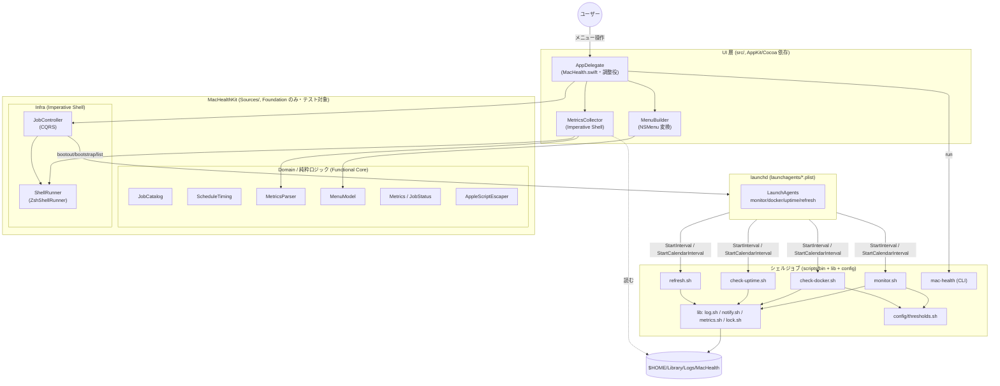
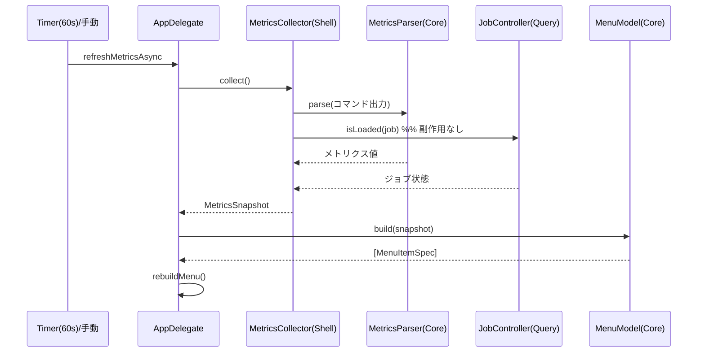
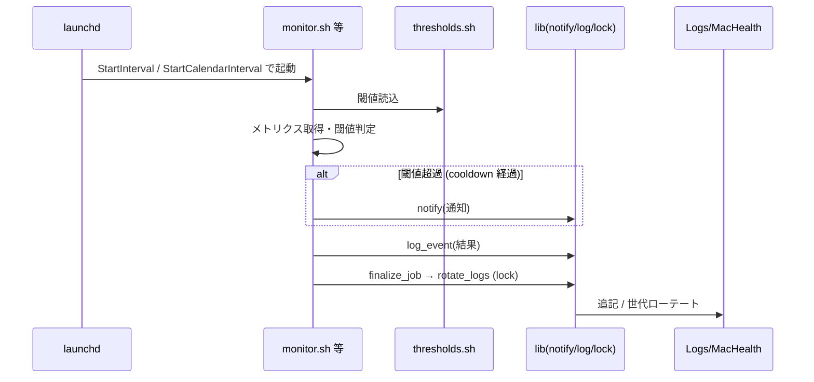
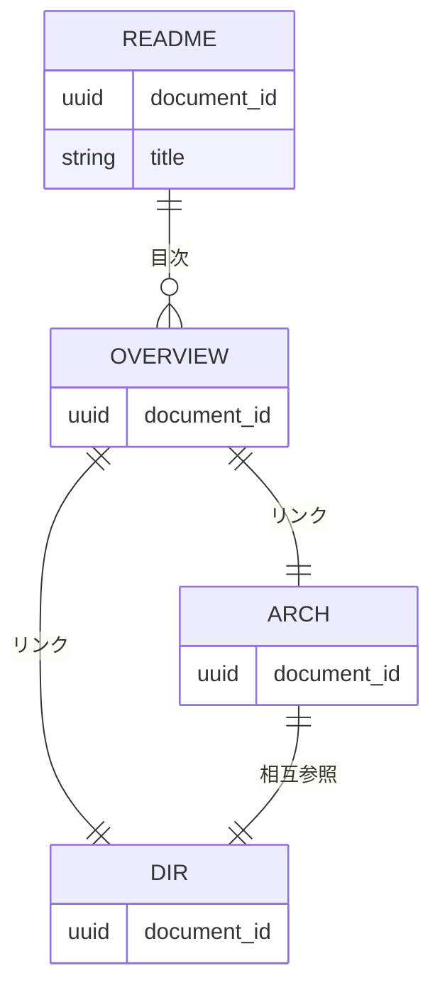
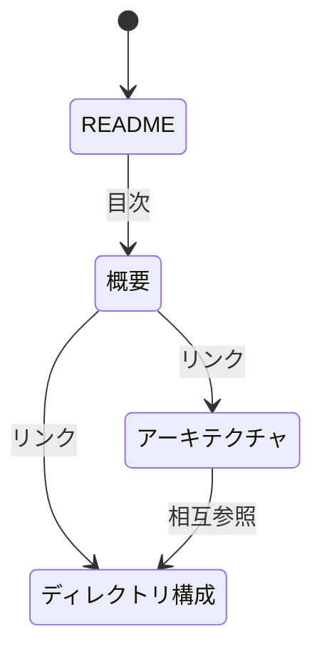

# 設計書: サブ E システムドキュメント整備

**プロジェクト名**: サブ E システムドキュメント整備
**作成日**: 2026 年 05 月 28 日
**最終更新**: 2026 年 05 月 28 日

> **重要**: **このドキュメントは常に更新**: 設計の変更や追加があった場合は、即座にこのドキュメントを更新してください。ドキュメントは「生きているドキュメント」として扱い、実装内容と常に同期させます。
>
> **用語**: [.agents/CONCEPTS.md §用語規約](../../../../.agents/CONCEPTS.md#用語規約) を参照。
>
> **本 issue の特性**: 本 issue の成果物は **`docs/` 配下のシステム仕様書（Markdown + Mermaid）** であり、コードではない。したがって本設計書は「どの docs ファイルを・どの構成で・何を根拠に作るか」を設計し、§3 機能設計＝各 docs ファイルの内容設計、§4 データ設計＝frontmatter/ID 設計、§6 テスト戦略＝ドキュメント受け入れ確認（チェックリスト）として読み替える。**設計フェーズでは docs 実ファイルおよび実コードは作成・変更しない**（実 docs は implement フェーズで作る）。

---

## 1. 設計概要

**参照**: [.agents/spec/01_設計原則.md](../../../../.agents/spec/01_設計原則.md)、[.agents/DOCS_RULES.md](../../../../.agents/DOCS_RULES.md)、[.workflow/templates/docs/](../../../../.workflow/templates/docs/) を先に参照した。

### 1.1 設計方針

`.workflow/templates/docs/` の構成・命名・粒度に準拠しつつ、初版範囲を **アーキテクチャ＋ディレクトリ構成** に限定し、最小本数の生きているシステム仕様書を整備する（00 §7.2・01 受け入れ基準）。**実装は変更せず、docs が A〜F 適用後の現状実装を正しく記述する**ことを唯一の制約とする（00 §2.1）。

### 1.2 設計原則（本プロジェクトで適用するもの）

- **UNIX哲学**: 小さく作る。初版は必要最小限の docs ファイルに絞り、画面/データ/機能設計など範囲外は「将来追記」とする。
- **単一責務**: 1 docs ファイル＝1 関心事（README＝目次・更新履歴、アーキテクチャ＝層と関係、ディレクトリ構成＝ツリーと役割）。
- **明確な境界**: 仕様書上でも UI（Swift メニューバー）／Domain・Infra（MacHealthKit）／シェルジョブ／launchd／ログ／設定の境界を図と表で明示する。
- **AIフレンドリー設計**: 浅い階層・意図が分かる節名・小さなファイルにし、新規参画者と AI が全体像へ最短で到達できるようにする（[01_設計原則 §AIフレンドリー設計](../../../../.agents/spec/01_設計原則.md)）。

> spec/06 の「docs と実装の不整合を放置してはならない」を最優先制約とする。仕様書のジョブ一覧・ラベル・スケジュールは `launchagents/*.plist.template` と `Sources/MacHealthKit/JobCatalog.swift` を一次情報として突き合わせる（UC2）。

---

## 2. アーキテクチャ設計

本章は **設計対象（docs の作り方）の構造** と **記述対象（Mac Health Keeper 本体）の構造** の双方を扱う。§2.1 は本 issue が作る docs 群の責務・境界、§2.2〜2.4 は docs に記載する Mac Health Keeper のアーキテクチャ（=アーキテクチャ仕様書の中身そのもの）。

### 2.1 責務・境界・参照関係

#### 2.1.1 責務一覧（本 issue で作成・更新する docs ファイル）

初版で **作成する** ファイル（最小セット）と、初版では **作成しない（将来追記）** ファイルを明示する。

| docs ファイル | 作成/将来 | 責務（1 文） |
| ------------- | --------- | ------------ |
| `docs/README.md` | **作成** | システム仕様書の目次・読み方・更新履歴を示し、「生きているドキュメント」である旨と DOCS_RULES（`docs/00_review/` 運用）を明記する入口。 |
| `docs/01_システム概要/03_アーキテクチャ/README.md` | **作成** | Swift UI／MacHealthKit（Domain・Infra）／シェルジョブ／launchd／ログ／設定の関係を Mermaid 図＋表で示し、ジョブ一覧（UC2 対象）を記載する。 |
| `docs/01_システム概要/04_ディレクトリ構成/README.md` | **作成** | `src`/`Sources/MacHealthKit`/`Tests`/`scripts/{bin,lib,config,test}`/`launchagents`/`docs`/`.agents`/`.workflow` の役割をツリー＋表で示す（spec/02 の責務単位と対応づけ）。 |
| `docs/01_システム概要/README.md` | **作成** | 「01 システム概要」配下（03 アーキテクチャ・04 ディレクトリ構成）への目次。初版範囲を明記する薄いハブ。 |
| `docs/00_review/`（ディレクトリ） | **作成（空運用）** | 仕様書のレビュー結果を置く場所（DOCS_RULES）。初版では `.gitkeep` 等で存在のみ確保し、レビュー記録は implement/verify フェーズで追記する。 |
| `docs/01_システム概要/01_プロジェクト概要/README.md` | 将来追記 | 初版範囲外（アーキテクチャ＋構成に限定）。 |
| `docs/01_システム概要/02_ステークホルダー/README.md` | 将来追記 | 初版範囲外。 |
| `docs/02_画面設計/`、`docs/03_データ設計/`、`docs/04_機能設計/`、`docs/05_エラー処理と外部通知/`、`docs/99_ID命名規則と管理/` | 将来追記 | 初版範囲外（00 §7.2 のスケジュールリスク対策で範囲限定）。 |

> **注**: `docs/README.md` は `.workflow/templates/docs/README.md` の目次（01〜99）を踏襲するが、未作成セクションへのリンクは「将来追記」と注記し、リンク切れにならないよう初版時点で存在するファイルのみを実リンクにする。

#### 2.1.2 境界

- **入力**: 一次情報＝現状の実ソース（`src/`・`Sources/MacHealthKit/`・`scripts/{bin,lib,config,test}`・`launchagents/*.plist.template`・`Package.swift`・`Makefile`・`install.sh`）と A〜F の設計成果。ルール＝`.agents/DOCS_RULES.md`・`.workflow/templates/docs/`・spec/02・spec/03。
- **出力**: `docs/` 配下の Markdown 仕様書（frontmatter `document_id` 付き・Mermaid 図入り）。
- **他責務との境界**: 本 issue は **アーキテクチャ＋ディレクトリ構成の初版** のみ。画面設計・データ設計・機能詳細・エラー処理/外部通知・ID 管理は範囲外（将来 issue または `docs/00_review/` 運用で追記）。**実コード・テスト・plist テンプレート・install.sh は一切変更しない**（記述するだけ）。

#### 2.1.3 参照関係（docs 間のリンク方向）

- `docs/README.md` → `docs/01_システム概要/README.md`（目次）
- `docs/01_システム概要/README.md` → `03_アーキテクチャ/README.md`、`04_ディレクトリ構成/README.md`
- `03_アーキテクチャ/README.md` ↔ `04_ディレクトリ構成/README.md`（相互参照「参考資料」節）
- 循環は持たない（README をハブとする一方向の目次リンク＋同階層間の相互参照のみ）。

### 2.2 システムアーキテクチャ（＝アーキテクチャ仕様書の中身）

- **採用パターン（記述対象側）**: **Functional Core / Imperative Shell ＋ 明確な層分離（UI / Domain / Infra）＋ launchd 駆動のバッチジョブ**。
- **根拠**: spec/01「明確な境界・単一責務」、spec/06「可読性・単一責務・仕様との整合性」。A〜F の成果（テスト基盤・メトリクス集約・ログローテ・責務分割・シェル安全化）がこの層分離に対応するため、仕様書も同じ層名で記述する。

#### 2.2.1 CQRS（Command/Query 分離）

- **Command（状態変更）**: `JobController.load/unload/toggle/enableAll/disableAll`（launchctl bootout/bootstrap）。シェル側のジョブ実行（monitor/docker/uptime/refresh）。
- **Query（状態取得）**: `JobController.isLoaded`（launchctl list を読むのみ・副作用なし）、`MetricsCollector.collect`（メトリクス取得）。
- 仕様書のアーキテクチャ節に「JobController は CQRS で状態変更と状態取得を分離」と明記する（実装の実態 = `Sources/MacHealthKit/JobController.swift` ヘッダ）。

#### 2.2.2 アーキテクチャ図（アーキテクチャ仕様書 §3.1 に掲載する Mermaid の設計）

アーキテクチャ仕様書には以下の構成図を掲載する（本設計書では方針として図を確定し、実 docs 執筆時にそのまま用いる）。

### 2.3 コンポーネント構成（仕様書の責務表に転記する内容）

アーキテクチャ仕様書には次の責務表を掲載する。各行は現状実装のファイルヘッダコメントを一次情報とする。

| コンポーネント | 層 | 依存 | 責務（1 文） |
| -------------- | -- | ---- | ------------ |
| AppDelegate（`src/MacHealth.swift`） | UI | AppKit | メニューバー UI とユーザー操作の調整役。各層へ委譲し自身はロジックを持たない。 |
| MenuBuilder（`src/MenuBuilder.swift`） | UI | AppKit | `[MenuItemSpec]` を NSMenu/NSMenuItem へ変換する薄い AppKit 部。 |
| MetricsCollector（`src/MetricsCollector.swift`） | UI/Infra | ShellRunner, MetricsParser | 実コマンドを実行し出力を MetricsParser に委譲して MetricsSnapshot を組み立てる（Imperative Shell）。 |
| JobCatalog（`Sources/.../JobCatalog.swift`） | Domain | なし | ジョブ ID・短名・頻度・スケジュール種別・launchd ラベル規則の静的定義。 |
| ScheduleTiming（`Sources/.../ScheduleTiming.swift`） | Domain | なし | 時刻計算・相対時刻表示の純粋ロジック（now を引数化）。 |
| MetricsParser（`Sources/.../MetricsParser.swift`） | Domain | なし | コマンド出力テキスト→メトリクス値の純粋パース（丸め・単位・フォールバック）。 |
| MenuModel（`Sources/.../MenuModel.swift`） | Domain | JobCatalog, ScheduleTiming | Snapshot/JobStatus/Catalog→`[MenuItemSpec]` の純粋データ生成。 |
| Metrics（`Sources/.../Metrics.swift`） | Domain | なし | MetricsSnapshot / JobStatus の純粋値型。 |
| AppleScriptEscaper（`Sources/.../AppleScriptEscaper.swift`） | Domain/Util | なし | 通知文字列を osascript の argv で渡すための純粋関数（注入耐性）。 |
| ShellRunner（`Sources/.../ShellRunner.swift`） | Infra | Foundation(Process) | 実行ファイル＋引数配列で外部コマンドを直接起動（シェル再パース排除）。 |
| JobController（`Sources/.../JobController.swift`） | Infra | ShellRunner, JobCatalog | launchctl による状態変更（Command）と状態取得（Query）を CQRS で分離。 |
| シェルジョブ（`scripts/bin/*`） | Job | lib, config | monitor/docker/uptime/refresh と CLI `mac-health`。launchd から起動される実処理。 |
| シェル lib（`scripts/lib/*`） | Job/Infra | lock.sh | log（ローテート含む）・notify・metrics・lock の共通ユーティリティ。 |
| 設定（`scripts/config/thresholds.sh`） | Config | なし | 閾値・ローテート・クールダウン等の編集可能な設定値。 |
| launchd（`launchagents/*.plist.template`） | Scheduler | — | 各ジョブの起動スケジュール（StartInterval / StartCalendarInterval）を定義。 |

### 2.4 データフロー（仕様書に掲載するシーケンス）

アーキテクチャ仕様書には 2 系統のフローを掲載する。

**(A) UI からのメトリクス更新（Query 中心）**

**(B) launchd 駆動のジョブ実行（バッチ・「起きた事実」をログに記録）**

> **イベント駆動の注記**: 本システムはメッセージバスを持たないため、ジョブ完了は `log_event`（events.log）に「起きた事実」として記録する同期処理に留める。仕様書には「JobFinalized 相当をログに記録（明示的なイベント発行はしない）」と注記する（spec/06「単純な同期処理で十分な場合は無理にイベント駆動を導入しない」に従う）。

---

## 3. 機能設計（各 docs ファイルの内容設計）

本 issue の「機能」＝作成する各 docs ファイル。各ファイルの目的・節構成・入出力・「書かないこと」を設計する。

### 3.1 機能 1: `docs/README.md`（システム仕様書の入口）

#### 3.1.1 概要

システム仕様書の目次・読み方・更新履歴を提供し、「生きているドキュメント」「`docs/00_review/` でレビュー（issue 不要）」を明記する。

#### 3.1.2 節構成（`.workflow/templates/docs/README.md` 準拠）

1. 冒頭注記（DOCS_RULES への参照）
2. ドキュメント構成（目次。初版で存在する 01 システム概要のみ実リンク、02〜99 は「将来追記」注記）
3. ドキュメントの読み方（対象読者・記述ルール）
4. **更新履歴**（`2026-05-28 / 1.0.0 / 初版作成（アーキテクチャ＋ディレクトリ構成）`）
5. 「生きているドキュメント」と `docs/00_review/` 運用の明記
6. 参考資料・最終更新日

#### 3.1.3 入力・出力

- **入力**: テンプレート構成、初版で作成するファイル一覧（§2.1.1）。
- **出力**: frontmatter `document_id` 付きの `docs/README.md`。

#### 3.1.4 エラーハンドリング（ドキュメント整合）

- 未作成セクションへの実リンクを張らない（リンク切れ防止）。将来追記である旨を明記する。

### 3.2 機能 2: `docs/01_システム概要/03_アーキテクチャ/README.md`

#### 3.2.1 概要

§2.2〜2.4 の図・責務表・データフローと **ジョブ一覧（UC2 対象）** を掲載するアーキテクチャ仕様書。

#### 3.2.2 節構成（テンプレート `03_アーキテクチャ` 準拠）

1. 3.1 システム構成図（§2.2.2 の Mermaid）＋構成要素の説明表（§2.3）
2. 3.2 技術スタック（Swift 5.7+ / AppKit・Cocoa / Foundation / SwiftPM・swiftc / bash / launchd / osascript・XCTest・bats）
3. 3.3 層間連携（UI→Kit→シェル/launchd、Functional Core / Imperative Shell の説明、CQRS）
4. 3.4 ジョブ一覧（**UC2 の中核**。下表を掲載）
5. 3.5 ログ・通知・設定（log.sh ローテート＋lock、notify、thresholds.sh）
6. 参考資料（04 ディレクトリ構成へ相互リンク）

**3.4 ジョブ一覧（仕様書に掲載・`launchagents/*.plist.template` ＋ `JobCatalog.swift` と一致させる）**

| ジョブ ID | 短名 | スクリプト（`scripts/bin/`） | launchd ラベル | スケジュール | RunAtLoad |
| --------- | ---- | ---------------------------- | -------------- | ------------ | --------- |
| monitor | メモリ／負荷監視 | `monitor.sh` | `com.github.adachi-tatsuru.machealth.monitor` | StartInterval 300 秒（5 分毎） | true |
| docker | Docker アイドル監視 | `check-docker.sh` | `com.github.adachi-tatsuru.machealth.docker` | StartInterval 600 秒（10 分毎） | false |
| uptime | 長期稼働の通知 | `check-uptime.sh` | `com.github.adachi-tatsuru.machealth.uptime` | StartCalendarInterval 09:00（毎日） | false |
| refresh | アプリ自動再起動 | `refresh.sh` | `com.github.adachi-tatsuru.machealth.refresh` | StartCalendarInterval 03:00（毎日） | false |

#### 3.2.3 入力・出力

- **入力**: `launchagents/*.plist.template`（Label/ProgramArguments/StartInterval/StartCalendarInterval/RunAtLoad）、`Sources/MacHealthKit/JobCatalog.swift`（jobs/shortNames/frequencies/schedules/label）。
- **出力**: frontmatter `document_id` 付きアーキテクチャ仕様書（Mermaid 図＋責務表＋ジョブ一覧）。

#### 3.2.4 エラーハンドリング（整合）

- スケジュール値は plist の数値（300/600）と Calendar（9:00/3:00）を一次情報とし、JobCatalog の表示用 `frequencies`（5 分毎/10 分毎）と矛盾しないか確認する。

### 3.3 機能 3: `docs/01_システム概要/04_ディレクトリ構成/README.md`

#### 3.3.1 概要

リポジトリのソースツリーと各ディレクトリの役割を、spec/02「責務単位」の考え方と対応づけて示す。

#### 3.3.2 節構成（テンプレート `04_ディレクトリ構成` をプロジェクト実態に書き換え）

1. 4.1 トップレベル構成（ツリー＋役割表。下表）
2. 4.2 Swift（`src` UI 層・`Sources/MacHealthKit` Core/Infra・`Tests` テスト）
3. 4.3 シェル（`scripts/{bin,lib,config,test}`）
4. 4.4 配置物・運用（`launchagents`・`install.sh`/`uninstall.sh`/`Makefile`/`Package.swift`）
5. 4.5 ドキュメント・規約（`docs`・`.agents`・`.agents-project`・`.workflow`）
6. テストディレクトリ方針（`Tests/MacHealthKitTests` XCTest・`scripts/test` bats/sh）
7. 参考資料（03 アーキテクチャへ相互リンク）

**4.1 トップレベル役割表（仕様書に掲載）**

| パス | 役割（責務単位・spec/02 対応） |
| ---- | ------------------------------ |
| `src/` | UI 層（AppKit 依存）。AppDelegate・MenuBuilder・MetricsCollector・Info.plist。 |
| `Sources/MacHealthKit/` | Domain（Functional Core）＋ Infra（Imperative Shell）。Foundation のみ。テスト対象。 |
| `Tests/MacHealthKitTests/` | XCTest 単体テスト（Core/Infra の純粋・契約テスト）。 |
| `scripts/bin/` | 実行スクリプト（monitor/docker/uptime/refresh）と CLI `mac-health`。launchd 起動対象。 |
| `scripts/lib/` | 共通ユーティリティ（log・notify・metrics・lock）。Functional Core/Imperative Shell。 |
| `scripts/config/` | 編集可能な設定値（`thresholds.sh`）。 |
| `scripts/test/` | シェルのテスト（bats / `*_test.sh`）。 |
| `launchagents/` | launchd ジョブ定義テンプレート（`*.plist.template`）。 |
| `docs/` | システム仕様書（本 issue の成果物）。 |
| `.agents/` | 実行契約・規約（汎用テンプレート）。 |
| `.agents-project/` | プロジェクト固有ルール（`.agents` より優先）。 |
| `.workflow/` | ワークフロー成果物（00〜04・issue・workflow.db）。 |
| ルート（`Package.swift`/`Makefile`/`install.sh`/`uninstall.sh`） | SwiftPM 構成・ビルド・配布/撤去。 |

#### 3.3.3 入力・出力

- **入力**: リポジトリの実ファイル配置（`find` 等で確認した現状ツリー）。
- **出力**: frontmatter `document_id` 付きディレクトリ構成仕様書（ツリー＋役割表）。

#### 3.3.4 エラーハンドリング（整合）

- 生成物（`.build`・`.DS_Store` 等）は一覧から除外する。記載パスはリポジトリルート相対で、個人 absolute パス・トークンを含めない（`$HOME`/`~` 表記）。

### 3.4 機能 4: 目次ハブと review ディレクトリ

- `docs/01_システム概要/README.md`: 03/04 への目次（薄いハブ）。
- `docs/00_review/`: 存在のみ確保（`.gitkeep`）。レビュー記録は `YYYYMMDD_HHMMSS_review.md` で追記（DOCS_RULES）。

---

## 4. データ設計（frontmatter・ID 設計）

### 4.1 データモデル

本 issue に DB はない。「データ」＝各 docs ファイルの **frontmatter メタデータ** と相互リンク構造。

#### リレーション図（docs ファイルのリンク構造）

#### frontmatter 一覧（作成ファイルごとに固有 UUID を 1 つ付与）

| ファイル | frontmatter キー | 値の規則 |
| -------- | ---------------- | -------- |
| `docs/README.md` | `document_id` | UUID（8-4-4-4-12）。作成時に 1 度付与、以後不変。 |
| `docs/01_システム概要/README.md` | `document_id` | 同上（ファイル固有 UUID）。 |
| `docs/01_システム概要/03_アーキテクチャ/README.md` | `document_id` | 同上。 |
| `docs/01_システム概要/04_ディレクトリ構成/README.md` | `document_id` | 同上。 |

### 4.2 データ構造

- 各 docs は Markdown ＋先頭 YAML frontmatter（`document_id`）。本文は見出し（`#`〜`###`）＋表＋Mermaid。
- UUID は実 docs 作成時（implement フェーズ）に `uuidgen` で生成し付与する（本設計書では値を確定しない＝テンプレートのプレースホルダを置換）。

---

## 5. API 設計

### 5.1 API 一覧

本 issue は静的ドキュメント整備のため、公開 API・エンドポイントは存在しない。

| エンドポイント | メソッド | 説明 |
| -------------- | -------- | ---- |
| 該当なし | — | 本 issue はドキュメント整備であり外部 API を持たない。 |

> 参考: docs に記載する Mac Health Keeper 本体の内部 I/F（`ShellRunner.run(executable, args)`、`JobController.isLoaded/toggle` 等）は **アーキテクチャ仕様書 §3.3** で文章として説明する（API 仕様書としては作らない＝初版範囲外）。

---

## 6. テスト戦略（＝ドキュメント受け入れ確認）

**読み替え**: 本 issue の成果物はコードではないため自動単体テストは作れない。代わりに **01 の BDD（UC1-S1/UC1-S2/UC2-S1）に対応するチェックリスト形式の受け入れ確認（○/×）** で担保する。自動テスト化が困難な理由は「Markdown の意味的妥当性・実装との整合の判断が人/AI のレビューを要するため」。確認手順は §6.1 と 03_実装計画 §2 に具体化する。

### 6.1 対象ごとのテスト割り当て

| 対象 | 単体 | 結合/API | E2E | クリティカル観点 | バリデーション観点 | 未達理由/補足 |
| ---- | ---- | -------- | --- | ---------------- | ------------------ | ------------- |
| `docs/README.md`（存在・構成・更新履歴） | × | × | × | UC1-S1: 仕様書入口が存在する | frontmatter `document_id` が UUID 形式 | コード非該当のため §6.2 のチェックリストで確認 |
| アーキテクチャ仕様書（図・責務表・ジョブ一覧） | × | × | × | UC1-S1/UC2-S1: 図/表で関係が示され、ジョブ一覧が一致 | Mermaid が描画可能・機密情報なし | 同上 |
| ディレクトリ構成仕様書 | × | × | × | UC1-S1: 構成が説明される | パスがルート相対・絶対個人パスなし | 同上 |
| 規約準拠（DOCS_RULES・命名・document_id） | × | × | × | UC1-S2: テンプレート構成・命名・UUID 準拠 | 全 docs に `document_id` が一意付与 | 同上 |
| 実装との整合（ジョブ一覧 = launchagents） | × | × | × | UC2-S1: monitor/docker/uptime/refresh が漏れなく一致 | ラベル・スケジュールが plist と一致 | 突き合わせは目視/grep で実施 |

### 6.2 監査・レビューでの確認（証跡）

- 03_実装計画 §2 の各タスクに紐づく **受け入れ確認チェックリスト（○/×）** を満たすことを確認する。
- ジョブ一覧整合（UC2-S1）は `launchagents/*.plist.template` の `Label`/`ProgramArguments`/`StartInterval`/`StartCalendarInterval` と仕様書 §3.4 表を 1 行ずつ突き合わせ、4 ジョブすべて一致を○とする。
- レビュー証跡は `docs/00_review/YYYYMMDD_HHMMSS_review.md`（DOCS_RULES）または verify-and-close の 04_review に記録する。本設計書 §6.1 の割当表と 03 のチェックリストが揃っていることを確認する。

---

## 7. UI 設計

### 7.1 画面遷移図

本 issue は静的ドキュメントのため画面遷移はない。docs のナビゲーション（目次→各仕様書）を遷移とみなすと §2.1.3 のリンク構造に一致する。

### 7.2 画面設計

#### 画面 1: 該当なし（ドキュメント）

GUI 画面は本 issue の対象外。Mac Health Keeper のメニューバー UI 自体は将来の `docs/02_画面設計/` で扱う（初版範囲外）。

---

## 8. セキュリティ設計

### 8.1 認証・認可

- 該当なし（静的ドキュメント）。

### 8.2 データ保護

- **機密情報の除外（必須）**: 個人の absolute パス・トークン・認証情報を docs に含めない。ホームは `$HOME` または `~` 表記、配置先は `{{HOME}}/...`（plist テンプレートと同じ表記）で記述する。
- launchd プレースホルダ（`{{HOME}}`）はそのまま記載し、実 UID/ユーザー名を埋め込まない。

---

## 9. 非機能要件への対応

### 9.1 パフォーマンス

- 該当なし（静的文書）。目次から各節へ 1〜2 リンクで到達できる浅い階層にする（保守性・可読性）。

### 9.2 可用性

- 「生きているドキュメント」とし、各サブ完了時・実装変更時に `docs/00_review/` 運用で更新する旨を `docs/README.md` に明記する（陳腐化リスク対策・00 §7.1）。

---

## 10. 参考資料

### プロジェクトドキュメント

- [`01_要件定義.md`](./01_要件定義.md) - 要件定義
- [`00_要求定義.md`](./00_要求定義.md) - 要求定義
- 親要求: [../../00_要求定義.md](../../00_要求定義.md)

### その他の参考資料

- `.agents/DOCS_RULES.md`、`.workflow/templates/docs/`、`.agents/spec/02_ディレクトリ構造方針.md`、`.agents/spec/03_命名規則.md`
- 一次情報: `src/`、`Sources/MacHealthKit/`、`scripts/{bin,lib,config,test}`、`launchagents/*.plist.template`、`Package.swift`、`Makefile`、`install.sh`

---

## 11. 前のステップ

この設計書は、以下のドキュメントを基に作成されています：

- **前**: [`01_要件定義.md`](./01_要件定義.md) - 要件定義フェーズ

---

## 12. 次のステップ

この設計書の承認後、以下のドキュメントを作成します：

- **次**: [`03_実装計画.md`](./03_実装計画.md) - 実装計画フェーズ
