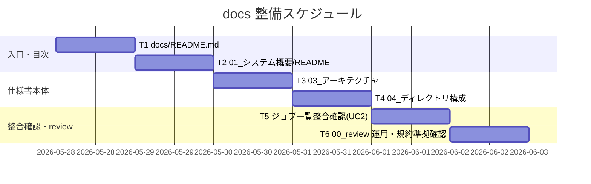
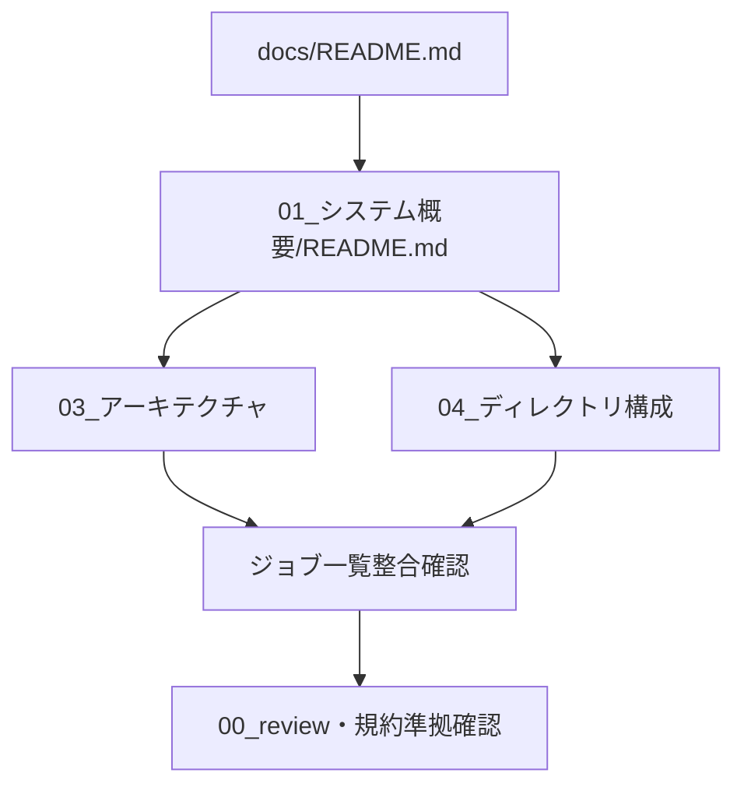

# 実装計画書: サブ E システムドキュメント整備

**プロジェクト名**: サブ E システムドキュメント整備
**作成日**: 2026 年 05 月 28 日
**最終更新**: 2026 年 05 月 28 日

> **重要**: **このドキュメントは常に更新**: 実装計画の変更、進捗状況の更新があった場合は、即座にこのドキュメントを更新してください。ドキュメントは「生きているドキュメント」として扱い、実装内容と常に同期させます。
> **必須項目**: 「必須」と明記した欄は空欄・抽象語のみで提出しないこと。
>
> **本 issue の特性**: 成果物はコードではなく `docs/` 配下のシステム仕様書。よって「単体テスト」は **ドキュメント受け入れ確認チェックリスト（○/×）** に読み替える（02 §6）。自動テスト化が困難な理由は「Markdown の意味的妥当性・実装との整合の判断が人/AI のレビューを要するため」。BDD（UC1-S1/UC1-S2/UC2-S1）は確認手順を Given/When/Then として記述し、合否基準を○/×で定義する。
>
> **用語**: [.agents/CONCEPTS.md §用語規約](../../../../.agents/CONCEPTS.md#用語規約) を参照。

---

## 1. 実装概要

### 1.1 実装方針（必須）

02_設計 §2.1.1 で確定した最小セット（`docs/README.md` → `docs/01_システム概要/README.md` → アーキテクチャ → ディレクトリ構成 → ジョブ一覧整合確認）の順で、A〜F 適用後の現状実装を正しく記述する docs を作成する。実コード・plist・install.sh は変更しない。

### 1.2 実装順序（必須: 1 件以上）



実装順序: T1 `docs/README.md` → T2 `docs/01_システム概要/README.md` → T3 アーキテクチャ仕様書 → T4 ディレクトリ構成仕様書 → T5 ジョブ一覧整合確認（UC2）→ T6 `docs/00_review/` 確保と規約準拠（document_id・命名・機密除外）確認。

---

## 2. タスク分解

**必須**: 各タスクには「テスト観点（2.x.3）」と「単体テスト仕様（BDD）（2.x.4）」を記載する。本 issue ではこれを **受け入れ確認チェックリスト（○/×）** として記述する（02 §6）。

### 2.1 タスク 1: `docs/README.md`（システム仕様書の入口）作成

#### 2.1.1 概要（必須）

システム仕様書の目次・読み方・更新履歴を提供し、「生きているドキュメント」「`docs/00_review/` でレビュー（issue 不要）」を明記する入口を作る。

#### 2.1.2 実装内容（必須: 1 件以上）

- `.workflow/templates/docs/README.md` の節構成（目次・読み方・更新履歴・参考資料）を踏襲して `docs/README.md` を作成する。
- frontmatter に `document_id`（`uuidgen` で生成した UUID）を 1 つ付与する。
- 目次は初版で存在する `01_システム概要` のみ実リンク。02〜99 は「将来追記」と注記（リンク切れ防止）。
- 更新履歴に `2026-05-28 / 1.0.0 / 初版作成（アーキテクチャ＋ディレクトリ構成）` を記載。
- 「生きているドキュメント」と `docs/00_review/` 運用（DOCS_RULES）を明記。

#### 2.1.3 テスト観点（必須）

**参照**: [02_設計 §6](./02_設計.md)。以下は本タスクの受け入れ確認（○/×）。

##### 受け入れ確認（チェックリスト・必須 1 件以上）

- [ ] `docs/README.md` が存在する。（UC1-S1）
- [ ] frontmatter に `document_id` があり UUID 形式（8-4-4-4-12）である。（UC1-S2）
- [ ] 目次・更新履歴・「生きているドキュメント」明記・`docs/00_review/` への言及がある。（UC1-S2）
- [ ] 未作成セクションへの実リンク切れがない（将来追記注記済み）。
- [ ] 個人 absolute パス・トークンを含まない（`$HOME`/`~` 表記）。（バリデーション）

##### 結合/API（該当時）

- 該当なし（ドキュメント。外部 API なし）。

##### E2E/受け入れ

- 上記チェックリストが全て○であること。

##### バリデーション

- frontmatter UUID が他 docs と重複しない（一意）。

#### 2.1.4 単体テスト仕様（BDD）（必須）

**BDD（受け入れ確認手順・UC1-S1/UC1-S2 に対応）**:

```gherkin
Feature: システム仕様書の存在確認（入口）
  # 01 UC1-S1
  Scenario: docs に仕様書入口が存在する
    Given 整備後の docs ディレクトリ
    When ls docs/README.md を実行する
    Then docs/README.md が存在する（○）

  # 01 UC1-S2
  Scenario: 入口が DOCS_RULES に沿う
    Given 作成した docs/README.md
    When frontmatter と本文（目次・更新履歴・review 運用）を確認する
    Then document_id が UUID 形式で、目次・更新履歴・00_review 運用の記載がある（○）
```

**確認手順例（チェックリストの実行コマンド・Given/When/Then をコメントで明記）**

```bash
# Given: 整備後の docs ディレクトリ
ls docs/README.md
# When: frontmatter の document_id を確認する
grep -E '^document_id: "[0-9A-Fa-f]{8}-[0-9A-Fa-f]{4}-[0-9A-Fa-f]{4}-[0-9A-Fa-f]{4}-[0-9A-Fa-f]{12}"' docs/README.md
# Then: 「生きているドキュメント」「00_review」「更新履歴」の語が本文にある（合否: 全て一致で○）
grep -E '生きているドキュメント|00_review|更新履歴' docs/README.md
```

#### 2.1.5 依存関係

- 先行: なし（最初に作る入口）。
- 後続: T2（目次ハブが README からリンクされる）。



#### 2.1.6 見積もり

- **工数**: 0.5h
- **優先度**: 高

### 2.2 タスク 2: `docs/01_システム概要/README.md`（目次ハブ）作成

#### 2.2.1 概要（必須）

「01 システム概要」配下（03 アーキテクチャ・04 ディレクトリ構成）への薄い目次ハブを作る。

#### 2.2.2 実装内容（必須: 1 件以上）

- `.workflow/templates/docs/01_システム概要/README.md` を参照し、初版範囲（03/04）への目次を作成。
- frontmatter `document_id`（固有 UUID）を付与。
- 初版範囲（アーキテクチャ＋ディレクトリ構成）であることと、01/02（プロジェクト概要・ステークホルダー）は将来追記である旨を注記。

#### 2.2.3 テスト観点（必須）

##### 受け入れ確認（チェックリスト・必須 1 件以上）

- [ ] `docs/01_システム概要/README.md` が存在する。（UC1-S1）
- [ ] frontmatter に UUID 形式の `document_id` がある。（UC1-S2）
- [ ] 03 アーキテクチャ・04 ディレクトリ構成への実リンクがあり、リンク先が存在する。

##### 結合/API（該当時）

- 該当なし。

##### E2E/受け入れ

- README → 概要 → 03/04 の目次が辿れる（○）。

##### バリデーション

- 相対リンクのパスが正しい（リンク切れなし）。

#### 2.2.4 単体テスト仕様（BDD）（必須）

```gherkin
Feature: システム仕様書の存在確認（目次ハブ）
  # 01 UC1-S1 / UC1-S2
  Scenario: 概要ハブが存在し下位仕様書へ辿れる
    Given 整備後の docs/01_システム概要 ディレクトリ
    When README.md を開きリンクを確認する
    Then 03_アーキテクチャ・04_ディレクトリ構成への有効なリンクがある（○）
```

```bash
# Given: 概要ハブ
ls docs/01_システム概要/README.md
# When: 下位仕様書への参照を確認する
grep -E '03_アーキテクチャ|04_ディレクトリ構成' docs/01_システム概要/README.md
# Then: リンク先が実在する（合否: 両ファイル存在で○）
ls docs/01_システム概要/03_アーキテクチャ/README.md docs/01_システム概要/04_ディレクトリ構成/README.md
```

#### 2.2.5 依存関係

- 先行: T1。後続: T3, T4。

#### 2.2.6 見積もり

- **工数**: 0.25h
- **優先度**: 高

### 2.3 タスク 3: `docs/01_システム概要/03_アーキテクチャ/README.md` 作成

#### 2.3.1 概要（必須）

Swift UI／MacHealthKit（Domain・Infra）／シェルジョブ／launchd／ログ／設定の関係を Mermaid 図＋責務表で示し、ジョブ一覧（UC2 対象）を掲載するアーキテクチャ仕様書を作る。

#### 2.3.2 実装内容（必須: 1 件以上）

- テンプレート `03_アーキテクチャ/README.md` の節構成に沿い、02_設計 §2.2.2 の構成図 Mermaid・§2.3 責務表・§2.4 データフロー（A/B）を掲載。
- 技術スタック（Swift 5.7+/AppKit/Foundation/SwiftPM・swiftc/bash/launchd/osascript/XCTest/bats）を表で記載。
- Functional Core / Imperative Shell と CQRS（JobController）を文章で説明（A〜F の成果を反映）。
- **§3.4 ジョブ一覧表**（monitor/docker/uptime/refresh：ラベル・スクリプト・スケジュール・RunAtLoad）を掲載。
- ログ（log.sh ローテート＋lock）・通知（notify）・設定（thresholds.sh）の関係を記載。
- frontmatter `document_id`（固有 UUID）付与。`{{HOME}}`/`$HOME` 表記で機密除外。

#### 2.3.3 テスト観点（必須）

##### 受け入れ確認（チェックリスト・必須 1 件以上）

- [ ] アーキテクチャ仕様書が存在する。（UC1-S1）
- [ ] Swift アプリ・シェルジョブ・launchd の関係が Mermaid 図または表で示される。（UC1-S1・00 効果3）
- [ ] Functional Core / Imperative Shell・CQRS が記述されている（A〜F の成果反映）。
- [ ] ジョブ一覧（monitor/docker/uptime/refresh）が表で掲載されている。（UC2-S1 の前提）
- [ ] frontmatter UUID あり、機密情報（個人パス・トークン）なし。（UC1-S2・バリデーション）
- [ ] Mermaid コードブロックが構文上描画可能（fence ```mermaid で閉じている）。

##### 結合/API（該当時）

- 該当なし（内部 I/F は文章説明・API 仕様書は初版範囲外）。

##### E2E/受け入れ

- 図＋責務表＋ジョブ一覧が揃っている（○）。

##### バリデーション

- スケジュール値（300/600/09:00/03:00）が plist と一致（T5 で突き合わせ）。

#### 2.3.4 単体テスト仕様（BDD）（必須）

```gherkin
Feature: システム仕様書の存在確認（アーキテクチャ）
  # 01 UC1-S1
  Scenario: アーキテクチャ仕様書が図/表で関係を示す
    Given 整備後の docs/01_システム概要/03_アーキテクチャ/README.md
    When 本文を確認する
    Then Mermaid 図と責務表で UI/Domain/Infra/シェルジョブ/launchd の関係が示される（○）
```

```bash
# Given: アーキテクチャ仕様書
F=docs/01_システム概要/03_アーキテクチャ/README.md
# When: Mermaid 図とジョブ一覧の存在を確認する
grep -c '```mermaid' "$F"
# Then: Mermaid が 1 つ以上、monitor/docker/uptime/refresh が全て出現する（合否: 全て一致で○）
grep -E 'monitor|docker|uptime|refresh' "$F"
```

#### 2.3.5 依存関係

- 先行: T2。後続: T5。

#### 2.3.6 見積もり

- **工数**: 1.5h
- **優先度**: 高

### 2.4 タスク 4: `docs/01_システム概要/04_ディレクトリ構成/README.md` 作成

#### 2.4.1 概要（必須）

リポジトリのソースツリーと各ディレクトリの役割を spec/02「責務単位」と対応づけて示すディレクトリ構成仕様書を作る。

#### 2.4.2 実装内容（必須: 1 件以上）

- テンプレート `04_ディレクトリ構成/README.md` をプロジェクト実態に書き換え、02_設計 §3.3.2 の節構成・§3.3.2 のトップレベル役割表を掲載。
- `src`/`Sources/MacHealthKit`/`Tests`/`scripts/{bin,lib,config,test}`/`launchagents`/`docs`/`.agents`/`.agents-project`/`.workflow`・ルートファイルの役割を表で記載。
- ツリー図（生成物 `.build`/`.DS_Store` は除外）を掲載。
- 03 アーキテクチャへ相互リンク。frontmatter `document_id`（固有 UUID）付与。パスはルート相対・機密除外。

#### 2.4.3 テスト観点（必須）

##### 受け入れ確認（チェックリスト・必須 1 件以上）

- [ ] ディレクトリ構成仕様書が存在する。（UC1-S1）
- [ ] `src`/`scripts`/`launchagents`/`docs` を含む各ディレクトリが説明されている。（01 ストーリー1 受け入れ基準）
- [ ] 役割が spec/02 の責務単位の考え方と対応づけられている。
- [ ] frontmatter UUID あり、パスがルート相対で個人 absolute パスなし。（UC1-S2・バリデーション）

##### 結合/API（該当時）

- 該当なし。

##### E2E/受け入れ

- ツリー＋役割表が揃い、記載パスが実在する（○）。

##### バリデーション

- 記載した主要パス（`src`, `Sources/MacHealthKit`, `scripts/bin`, `launchagents`）が実在する。

#### 2.4.4 単体テスト仕様（BDD）（必須）

```gherkin
Feature: システム仕様書の存在確認（ディレクトリ構成）
  # 01 UC1-S1
  Scenario: ディレクトリ構成が説明される
    Given 整備後の docs/01_システム概要/04_ディレクトリ構成/README.md
    When 本文を確認する
    Then src/scripts/launchagents/docs を含む構成と役割が表/ツリーで示される（○）
```

```bash
# Given: ディレクトリ構成仕様書
F=docs/01_システム概要/04_ディレクトリ構成/README.md
# When: 主要ディレクトリの記載を確認する
grep -E 'src|Sources/MacHealthKit|scripts|launchagents|docs' "$F"
# Then: 記載した主要パスが実在する（合否: 全て存在で○）
ls -d src Sources/MacHealthKit scripts/bin launchagents docs
```

#### 2.4.5 依存関係

- 先行: T2。後続: T5。

#### 2.4.6 見積もり

- **工数**: 1h
- **優先度**: 高

### 2.5 タスク 5: ジョブ一覧整合確認（UC2-S1）

#### 2.5.1 概要（必須）

アーキテクチャ仕様書 §3.4 のジョブ一覧が `launchagents/*.plist.template` と一致することを 1 行ずつ突き合わせて確認する。

#### 2.5.2 実装内容（必須: 1 件以上）

- 4 つの plist テンプレート（monitor/docker/uptime/refresh）の `Label`・`ProgramArguments`・`StartInterval`/`StartCalendarInterval`・`RunAtLoad` を抽出。
- 仕様書 §3.4 表の各行（ジョブ ID・スクリプト・ラベル・スケジュール・RunAtLoad）と突き合わせ、一致を○、相違・欠落を×として記録。
- 一次情報の根拠（plist の値）も併せて確認: monitor=StartInterval 300/RunAtLoad true、docker=StartInterval 600、uptime=StartCalendarInterval 09:00、refresh=StartCalendarInterval 03:00。
- 相違があれば仕様書を修正して再確認（指摘がなくなるまで反復）。

#### 2.5.3 テスト観点（必須）

##### 受け入れ確認（チェックリスト・必須 1 件以上）

- [ ] `launchagents/` の plist テンプレートが 4 件（monitor/docker/uptime/refresh）である。
- [ ] 仕様書 §3.4 に 4 ジョブが漏れなく記載されている。（UC2-S1）
- [ ] 各ジョブの launchd ラベルが plist の `Label`（`com.github.adachi-tatsuru.machealth.<job>`）と一致する。
- [ ] 各ジョブのスケジュール（monitor 300 / docker 600 / uptime 09:00 / refresh 03:00）が plist と一致する。
- [ ] スクリプトパスが plist `ProgramArguments`（`bin/<script>.sh`）と一致する。

##### 結合/API（該当時）

- 該当なし。

##### E2E/受け入れ

- 4 ジョブすべてが「漏れなく・値一致」で○（1 つでも×なら不合格→修正）。

##### バリデーション

- 仕様書に plist に無いジョブが混入していない（過不足なし）。

#### 2.5.4 単体テスト仕様（BDD）（必須）

```gherkin
Feature: 実装との整合（ジョブ一覧）
  # 01 UC2-S1
  Scenario: 仕様書のジョブ一覧が launchagents と一致する
    Given launchagents の plist テンプレート群
    When 仕様書 §3.4 のジョブ一覧と突き合わせる
    Then monitor/docker/uptime/refresh が漏れなく、ラベル・スケジュールが一致する（○）
```

```bash
# Given: plist テンプレート群と仕様書
# When: plist のラベルとスケジュールを抽出する
grep -hE 'Label|StartInterval|Hour|Minute' launchagents/*.plist.template
grep -hoE 'com\.github\.adachi-tatsuru\.machealth\.[a-z]+' launchagents/*.plist.template | sort -u
# Then: 4 ラベル(monitor/docker/uptime/refresh)が仕様書 §3.4 と一致する（合否: 4 件一致・過不足なしで○）
F=docs/01_システム概要/03_アーキテクチャ/README.md
for j in monitor docker uptime refresh; do grep -q "machealth.$j" "$F" && echo "$j OK" || echo "$j NG"; done
```

#### 2.5.5 依存関係

- 先行: T3, T4。後続: T6。

#### 2.5.6 見積もり

- **工数**: 0.5h
- **優先度**: 高（UC2 の合否を決める）

### 2.6 タスク 6: `docs/00_review/` 確保と規約準拠確認

#### 2.6.1 概要（必須）

`docs/00_review/` を存在確保し、全 docs の規約準拠（document_id 一意・命名・機密除外・「生きているドキュメント」明記）を確認する。

#### 2.6.2 実装内容（必須: 1 件以上）

- `docs/00_review/` を `.gitkeep` 等で確保（レビュー記録 `YYYYMMDD_HHMMSS_review.md` は本タスクまたは verify フェーズで追記・DOCS_RULES）。
- 全 docs の frontmatter `document_id` が UUID 形式かつ一意であることを確認。
- ディレクトリ・ファイル命名がテンプレート（`01_システム概要/03_アーキテクチャ` 等）に一致することを確認。
- 機密情報（個人 absolute パス・トークン）が含まれないことを全 docs で確認（`$HOME`/`~`/`{{HOME}}` 表記）。

#### 2.6.3 テスト観点（必須）

##### 受け入れ確認（チェックリスト・必須 1 件以上）

- [ ] `docs/00_review/` が存在する。
- [ ] 作成した全 docs に `document_id` があり、UUID が互いに重複しない。（UC1-S2）
- [ ] ディレクトリ・ファイル名がテンプレート構成・命名に一致する。（UC1-S2）
- [ ] いずれの docs にも個人 absolute パス・トークンが含まれない。（バリデーション・00 §3.2）
- [ ] 各仕様書に「生きているドキュメント」「各サブ完了時に更新」の旨がある。

##### 結合/API（該当時）

- 該当なし。

##### E2E/受け入れ

- 全 docs が DOCS_RULES の構成・命名・document_id 準拠（○）。

##### バリデーション

- `grep` で `/Users/<個人名>` 等の絶対個人パスが 0 件。

#### 2.6.4 単体テスト仕様（BDD）（必須）

```gherkin
Feature: システム仕様書の存在確認（規約準拠）
  # 01 UC1-S2
  Scenario: 仕様書が DOCS_RULES の構成に沿う
    Given 作成した全システム仕様書
    When 構成・命名・document_id・機密情報を確認する
    Then DOCS_RULES の想定に適合し、document_id は一意で機密情報を含まない（○）
```

```bash
# Given: 作成した全 docs
# When: document_id を全 docs から抽出する
grep -REho 'document_id: "[^"]+"' docs | sort
# Then: UUID が一意（重複 0）で、個人 absolute パスが含まれない（合否: 重複0 かつ 個人パス0 で○）
grep -REho 'document_id: "[^"]+"' docs | sort | uniq -d   # 重複出力が空であること
grep -RE '/Users/[A-Za-z0-9._-]+' docs || echo "no personal absolute path (OK)"
```

#### 2.6.5 依存関係

- 先行: T1〜T5。後続: なし（verify-and-close へ）。

#### 2.6.6 見積もり

- **工数**: 0.5h
- **優先度**: 高

---

## テスト観点

本実装計画のテスト観点は **ドキュメント受け入れ確認チェックリスト（○/×）** に集約する（自動コードテスト非該当）。観点は (1) 仕様書の存在（UC1-S1）、(2) DOCS_RULES 構成・命名・document_id・機密除外の準拠（UC1-S2）、(3) ジョブ一覧が launchagents と一致（UC2-S1）の 3 系統。各タスク §2.x.3 に具体ケース（○/× 判定可能）を記載した。

---

## 単体テスト

コードを生成しないため自動単体テストは作らない（理由: Markdown の意味的妥当性・実装整合の判断にレビューを要する）。代替として各タスク §2.x.4 に BDD（確認手順の Given/When/Then ＋確認コマンド例）を記載し、合否を○/×で判定する。

---

## BDD

01 の BDD ユースケースと本実装計画の受け入れ確認の対応:

| 01 BDD | 内容 | 対応タスク | 受け入れ確認（合否基準） |
| ------ | ---- | ---------- | ------------------------ |
| **UC1-S1** | docs にアーキテクチャ仕様書が存在する | T1, T2, T3, T4 | `docs/README.md`・概要ハブ・アーキテクチャ・ディレクトリ構成の各仕様書が存在し、関係が図/表で示される＝全て○ |
| **UC1-S2** | 仕様書が DOCS_RULES の構成・命名・document_id に沿う | T1〜T4, T6 | 全 docs に一意の UUID `document_id`、テンプレート準拠の構成・命名、機密情報なし＝全て○ |
| **UC2-S1** | 仕様書のジョブ一覧が launchagents と一致 | T3（§3.4 掲載）, T5（突き合わせ） | monitor/docker/uptime/refresh の 4 ジョブが漏れなく、ラベル・スケジュール・スクリプトが plist と一致＝全て○ |

Given/When/Then の各シナリオは §2.1.4〜§2.6.4 に記載（[TEST_BDD_FORMAT.md](../../../../.agents/TEST_BDD_FORMAT.md) のユースケース→シナリオ→Given/When/Then の精神に沿う）。

---

## 3. 実装スケジュール

### 3.1 マイルストーン

| マイルストーン | 期日 | 成果物 |
| -------------- | ---- | ------ |
| M1 入口・目次 | 2026-05-28 | `docs/README.md`, `docs/01_システム概要/README.md` |
| M2 仕様書本体 | 2026-05-29 | アーキテクチャ仕様書・ディレクトリ構成仕様書 |
| M3 整合・規約準拠 | 2026-05-30 | ジョブ一覧整合確認・`docs/00_review/`・document_id/機密確認 |

### 3.2 実装フェーズ

#### フェーズ 1: 入口・目次・本体

- **期間**: M1〜M2
- **タスク**: T1, T2, T3, T4

#### フェーズ 2: 整合・規約準拠

- **期間**: M3
- **タスク**: T5, T6

---

## 4. テスト計画

各タスク §2.x.3 の受け入れ確認チェックリスト（○/×）を実行し、§2.x.4 の確認コマンドで証跡を取る。

### 4.1 テストの優先順位

- **UC2-S1（ジョブ一覧整合・T5）** を最重要とする（実装との整合＝spec/06「docs と実装の不整合を放置しない」）。
- **UC1-S2（規約準拠・T6）** で全 docs を横断確認する。
- 1 つでも×があれば該当 docs を修正し、指摘がなくなるまで反復する。

---

## 5. リスク管理

### 5.1 実装リスク

- **リスク**: 他サブの実装変更でジョブ一覧・スケジュールが陳腐化する。
  - **対策**: 「生きているドキュメント」とし `docs/00_review/` 運用で更新する旨を README に明記（00 §7.1）。
- **リスク**: 範囲が広がり完了しない。
  - **対策**: 初版はアーキテクチャ＋ディレクトリ構成に限定し、他セクションは「将来追記」とする（00 §7.2）。
- **リスク**: 仕様書のスケジュール表記（JobCatalog の「5 分毎」と plist の 300 秒）が見かけ上ずれる。
  - **対策**: T5 で plist 数値を一次情報として併記し、表示用頻度と矛盾しないことを明示する。

---

## 6. 参考資料

### プロジェクトドキュメント

- [`02_設計.md`](./02_設計.md) - 設計
- [`01_要件定義.md`](./01_要件定義.md) - 要件定義

### その他の参考資料

- `.agents/DOCS_RULES.md`、`.workflow/templates/docs/`、`.agents/TEST_BDD_FORMAT.md`
- 一次情報: `launchagents/*.plist.template`、`Sources/MacHealthKit/JobCatalog.swift`、`scripts/`、`src/`

---

## 7. 前のステップ

この実装計画書は、以下のドキュメントを基に作成されています：

- **前**: [`02_設計.md`](./02_設計.md) - 設計フェーズ

---

## 8. 次のステップ

この実装計画書の承認後、以下に進みます：

- **次**: 実装フェーズ（execution）。`docs/` 配下の実ファイルを作成する（本 issue は 1 issue 完結のため 90_issues.md は作成しない）。
