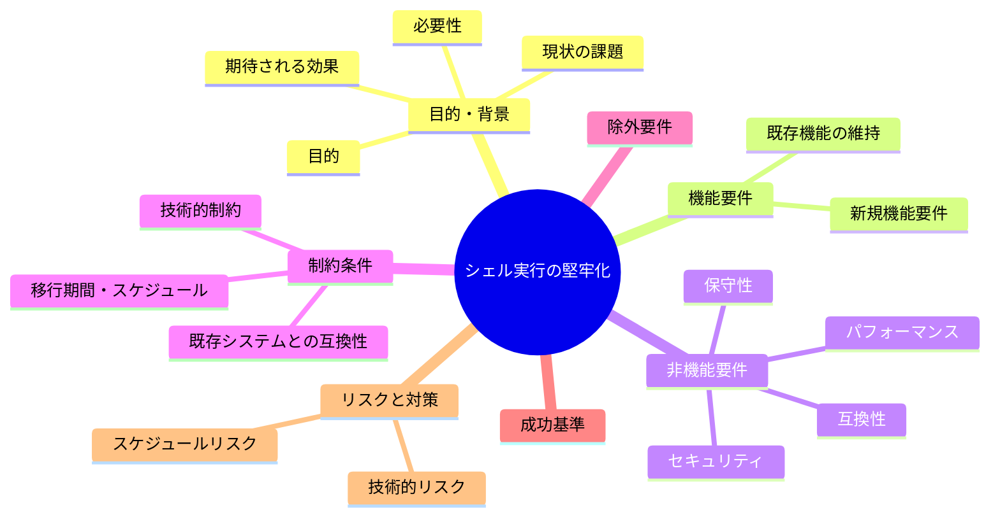
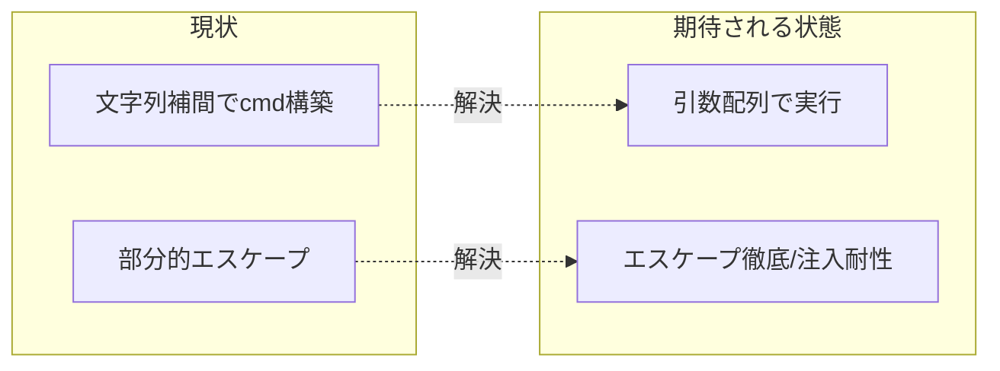

# 要求定義書: サブ F シェル実行の堅牢化

**プロジェクト名**: サブ F シェル実行の堅牢化
**作成日**: 2026 年 05 月 27 日
**最終更新**: 2026 年 05 月 27 日

> **重要**:
>
> - 要求定義書は全体像を把握するためのものです。詳細は要件定義書以降で記載します。
> - **このドキュメントは常に更新**します。
> - **必須項目**: 判定可能な形で記入すること。
>
> **用語**: [.agents/CONCEPTS.md §用語規約](../../../../.agents/CONCEPTS.md#用語規約) を参照。

---

## 要求定義の全体像

---

## 1. 目的・背景

### 1.1 目的（必須）

Swift からのシェル実行を引数配列化しコマンド注入耐性を高める。

### 1.2 背景

- **現状の課題**:
  - R1: `src/MacHealth.swift` が文字列補間でシェルコマンドを構築している。
    - `shell()`(L634-) が `cmd` 文字列を `/bin/bash -c` 相当に渡す構造。
    - `notify()`(L627-) の引用符エスケープが部分的で、補間値に特殊文字が入ると壊れる/注入の余地がある。
    - `gatherMetrics()` 内の `launchctl list ... | grep '\(label)'` 等、補間値を含む文字列をシェルに渡している。
  - 補間値（ジョブ名・メッセージ等）が将来ユーザー由来になった場合にインジェクション耐性が弱い。

- **必要性**:
  - セキュリティ（spec の非機能要件）と堅牢性のため、コマンドは引数配列で構築すべき。

### 1.3 期待される効果（必須: 1 件以上）

- **効果 1**: シェル実行が `Process`/`arguments` 等の引数配列で構築され、文字列補間によるコマンド組み立てが排除される（○/× 判定可）。
- **効果 2**: 通知・ジョブ操作で特殊文字を含む入力でも注入・破損が起きない（○/× 判定可）。
- **効果 3**: 残る文字列実行箇所はエスケープが徹底され、根拠が記録される（○/× 判定可）。

**現状と期待される状態の比較**:

---

## 2. 機能要件

### 2.1 既存機能の維持（該当する場合）

- 通知表示・ジョブ操作・メトリクス取得の**外形的振る舞いを不変**に保つ。

### 2.2 新規機能要件

- シェル実行を引数配列ベース（`Process` + `arguments`）に置き換える。
- やむを得ず文字列実行を残す場合はエスケープを徹底し、対象と根拠を記録する。
- サブ B の `ShellRunner`(Infra) と整合させる（責務は Infra に集約）。

---

## 3. 非機能要件

### 3.1 パフォーマンス

- 実行方式変更で体感速度を悪化させない。

### 3.2 セキュリティ

- 補間値が任意コマンド実行に至らないこと（注入耐性）。

### 3.3 互換性

- 通知文言・ジョブ操作の結果を変えない。

### 3.4 保守性

- シェル実行経路を 1 箇所（Infra）に集約し、注入対策をそこで一元化する。

---

## 4. 制約条件

### 4.1 技術的制約

- Swift / Cocoa。`Process`/`NSAppleScript` 等の引数分離可能な API を用いる。
- サブ B（ShellRunner）と整合。両者を同時/前後で進める場合の調整は 02 で定める。

### 4.2 既存システムとの互換性

- launchctl/osascript の呼び出し結果を変えない。

### 4.3 移行期間・スケジュール

- サブ B と連携。可能ならサブ A のテストで挙動を固定して実施する。

---

## 5. 除外要件

- シェルスクリプト側（`scripts/`）の堅牢化は本サブの主対象外（必要箇所はサブ C/D で扱う）。

---

## 6. 成功基準（必須: 1 件以上）

- Swift のシェル実行が引数配列で構築され、文字列補間でのコマンド組み立てが排除/最小化されている。
- 特殊文字を含む入力で注入・破損が起きないことを確認できる。
- 文字列実行を残す箇所はエスケープが徹底され根拠が記録されている。

---

## 7. リスクと対策

### 7.1 技術的リスク

- **リスク**: パイプ/awk/sed を多用する既存コマンドを引数配列に移しづらい。
  - **対策**: 取得ロジックはサブ C の `metrics.sh` 呼び出しに委譲し、Swift からはスクリプトを引数で呼ぶ形に整理する。

### 7.2 スケジュールリスク

- **リスク**: サブ B との二重改修で競合する。
  - **対策**: ShellRunner の I/F を先に確定し、本サブはその I/F に実装を寄せる。

---

## 8. 参考資料

### プロジェクトドキュメント

- 親要求: [../../00_要求定義.md](../../00_要求定義.md)
- 関連: サブ B（責務分割）、サブ C（メトリクス集約）

### その他の参考資料

- `src/MacHealth.swift`（L627 notify, L634 shell, L116-150 gatherMetrics）

---

## 9. 次のステップ

- **次**: [`01_要件定義.md`](./01_要件定義.md) - 要件定義フェーズ
