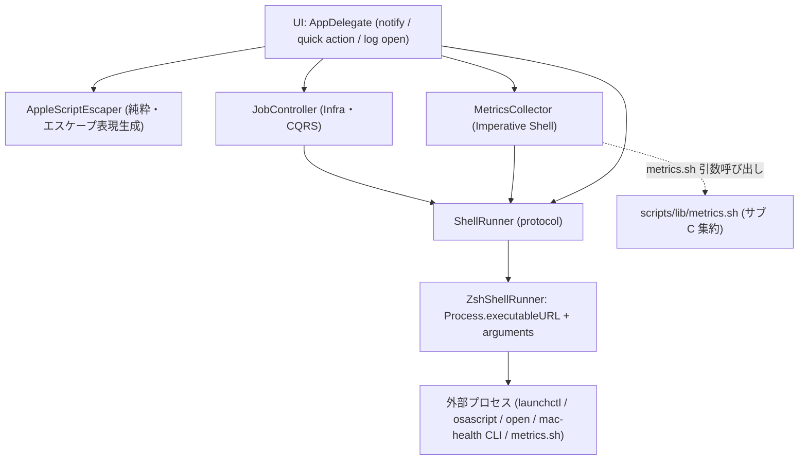
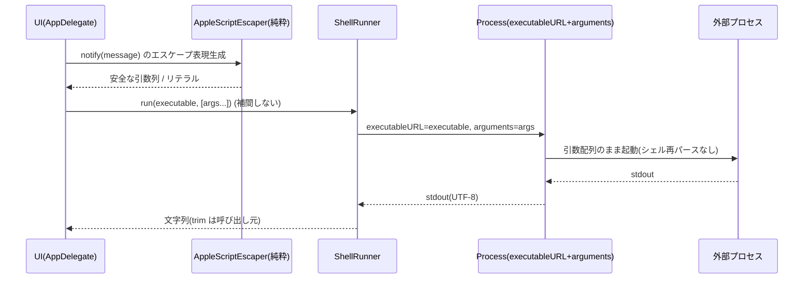

# 設計書: サブ F シェル実行の堅牢化

**プロジェクト名**: サブ F シェル実行の堅牢化
**作成日**: 2026 年 05 月 28 日
**最終更新**: 2026 年 05 月 28 日

> **重要**: **このドキュメントは常に更新**: 設計の変更や追加があった場合は、即座にこのドキュメントを更新してください。ドキュメントは「生きているドキュメント」として扱い、実装内容と常に同期させます。
>
> **用語**: [.agents/CONCEPTS.md §用語規約](../../../../.agents/CONCEPTS.md#用語規約) を参照。

---

## 1. 設計概要

### 1.1 設計方針

シェル実行経路を Infra（`ShellRunner`）に一元化し、文字列補間による `zsh -l -c <cmd>` 実行を **`Process.executableURL` + `arguments` の引数配列実行**へ差し替える。これにより補間値（ジョブ label・通知メッセージ・パス）が単一引数として扱われ、コマンド注入が成立しない構造にする。外形的振る舞い（通知文言・ジョブ操作結果・メトリクス値/表示・launchd ラベル・CLI・ログ出力先）は不変とする。

### 1.2 設計原則（本プロジェクトで適用するもの）

- **明確な境界**: シェル実行（外部プロセス起動）という副作用を Infra（`ShellRunner`）に閉じ込め、Domain/UI からは引数配列で依頼するのみとする。注入対策は `ShellRunner` 1 箇所に集中させる（[01_設計原則 §明確な境界](../../../../.agents/spec/01_設計原則.md)）。
- **単一責務**: `ShellRunner` は「実行ファイル＋引数で外部コマンドを起動し標準出力を返す」のみ。エスケープ表現の生成（通知メッセージ→AppleScript 文字列リテラル）は純粋関数に分離し、起動と整形の責務を混在させない（[01_設計原則 §単一責務](../../../../.agents/spec/01_設計原則.md)）。
- **UNIX哲学**: メトリクス取得のパイプ前提処理は無理に Swift 側で引数配列化せず、サブ C で集約済みの `scripts/lib/metrics.sh` を「実行ファイル＋引数（メトリクス名）」で 1 回呼ぶ薄いディスパッチに寄せる（小さく作る・組み合わせる）。
- **AIフレンドリー設計**: 既存の小さなファイル分割（`ShellRunner`/`JobController`/`MetricsParser` 等）を維持し、責務名が意図を表す命名を保つ。

> **設計判断の優先順位**（[spec/06](../../../../.agents/spec/06_設計判断の優先順位.md)）: 本サブは「仕様との整合性（＝外形的振る舞い不変）」と「セキュリティ（注入耐性）」を両立する。両者が衝突する箇所（パイプ多用の取得系）は、振る舞い不変を満たしたうえで注入面を最小化する案（C の `metrics.sh` への寄せ）を採り、やむを得ず文字列実行を残す箇所は §8.3 に対象・理由・エスケープ方法を記録する。

---

## 2. アーキテクチャ設計

### 2.1 責務・境界・参照関係

#### 2.1.1 責務一覧

| コンポーネント | 責務（1 文） |
| -------------- | ------------ |
| `ShellRunner`（protocol, Infra） | 実行ファイルと引数配列を受け、標準出力（UTF-8 trim 前）を返す I/F。失敗時 `""`（現状互換）。 |
| `ZshShellRunner`（既定実装, Infra） | `Process.executableURL` + `arguments` で外部コマンドを**引数配列のまま直接起動**し、文字列を `bash -c`/`zsh -c` に再合成しない（注入耐性の中核）。 |
| `AppleScriptEscaper`（新規・純粋関数, Domain/Util） | 通知メッセージ等の文字列を AppleScript 文字列リテラルとして安全な表現へエスケープする純粋関数（`"`・`\`・改行の処理）。 |
| `MetricsScriptInvoker`（呼び出し規約, Infra 内の取り決め） | パイプ/awk/sed を含む取得系を `scripts/lib/metrics.sh <metric>` の引数呼び出しに寄せ、Swift からはスクリプトパス＋メトリクス名の引数配列で起動する。 |
| `JobController`（Infra・CQRS） | launchctl 連携。label を**シェル補間せず引数**として渡し、`isLoaded` は launchctl 出力を Swift 側で走査して判定する。 |
| `MetricsCollector`（Imperative Shell） | 取得系の起動元。引数配列／`metrics.sh` 呼び出しへ移行し、パース結果を `MetricsParser` に委譲して `MetricsSnapshot` を組み立てる。 |
| `AppDelegate.notify` / quick action / ログ open（UI） | 通知・Terminal 起動・`open -a Console`・CLI 実行を、補間文字列ではなく引数配列／エスケープ済み表現で `ShellRunner` に依頼する。 |

#### 2.1.2 境界

- **入力**: ジョブ label（`JobCatalog.label(for:)`）、通知メッセージ（任意文字列、将来ユーザー由来想定）、ログパス・CLI パス・メトリクス名。
- **出力**: 標準出力文字列（trim は呼び出し元が現状どおり実施）、通知表示、ジョブ操作結果（launchctl の bootstrap/bootout 出力）、メトリクス値、ログファイルの Console 表示。
- **他責務との境界**: 本サブの対象は **Swift→外部プロセスの起動方法**。シェルスクリプト側（`scripts/`）の内部堅牢化はサブ C/D の範囲で対象外（00 §5）。`ShellRunner` の I/F 確定はサブ B の既存成果（`run(_:_:)`）を引き継ぎ、本サブは**実装差し替え＋呼び出し元の引数化**に留める。

#### 2.1.3 参照関係

- `AppDelegate`（UI）→ `ShellRunner`、`JobController`、`MetricsCollector`、`AppleScriptEscaper`
- `JobController`（Infra）→ `ShellRunner`、`JobCatalog`
- `MetricsCollector`（Infra）→ `ShellRunner`、`MetricsParser`、`JobController`、`JobCatalog`、`ScheduleTiming`
- `AppleScriptEscaper`（純粋）→ （依存なし）
- `ZshShellRunner`（Infra）→ `Foundation.Process` のみ
- 循環参照なし（依存は UI → Infra → Foundation の一方向）。

### 2.2 システムアーキテクチャ

- **採用パターン**: ポート＆アダプタ（Infra に副作用を集約する Functional Core / Imperative Shell）。
- **根拠**: [spec/01 §明確な境界・§単一責務](../../../../.agents/spec/01_設計原則.md) と [spec/06](../../../../.agents/spec/06_設計判断の優先順位.md)（可読性・単一責務・仕様整合）。注入対策という横断的関心事を `ShellRunner` 1 点に集約することで、呼び出し元を変えずに堅牢化でき、振る舞い不変を保ちやすい。

#### 2.2.1 CQRS（Command/Query 分離）

サブ B で確立済みの分離を維持する。

- **Command**: `JobController.load/unload/toggle/enableAll/disableAll`（launchctl の状態変更）。
- **Query**: `JobController.isLoaded`（launchctl list を読むだけ・副作用なし）。本サブで `grep` 文字列補間を排し、引数配列起動＋Swift 側フィルタへ置換する（UC3）。

#### 2.2.2 アーキテクチャ図（本プロジェクトの構成）



### 2.3 コンポーネント構成

明確な境界（UI / Domain / Infrastructure）に沿って配置する。

- **Infrastructure**: `ShellRunner`（protocol）/`ZshShellRunner`（実装差し替え対象）/`JobController`（label 引数化）。`Sources/MacHealthKit/`。
- **Domain/Util**: `AppleScriptEscaper`（新規・純粋）、`MetricsParser`（既存・不変）。`Sources/MacHealthKit/`。
- **Imperative Shell**: `MetricsCollector`（取得起動の引数化）。`src/`。
- **UI**: `AppDelegate`（`notify`・quick action・ログ open・CLI 実行の引数化）。`src/MacHealth.swift`。

各コンポーネントは単一責務を満たす。`ShellRunner` は「起動」、`AppleScriptEscaper` は「エスケープ表現生成」、`JobController` は「ジョブの Command/Query」に閉じる。

### 2.4 データフロー

イベント駆動は導入しない（単純な同期処理で十分・[spec/06](../../../../.agents/spec/06_設計判断の優先順位.md)）。注入耐性の要は「文字列を再パースさせない」ことであり、下図のとおり補間値は**引数の要素**としてのみ流れ、シェルのトークン分割を経由しない。



---

## 3. 機能設計

### 3.1 機能 1: ShellRunner の引数配列実行（UC1）

#### 3.1.1 概要

`ZshShellRunner.run(_ executable:String, _ args:[String])` を、`Process.executableURL = URL(fileURLWithPath: executable)` と `task.arguments = args` で**引数配列のまま起動**する実装に確定する。各引数はシェルのトークン分割・展開を経ずに `execve` 相当へ渡るため、`; rm -rf x` や `$(touch y)` を含む引数は**単一引数**として扱われ、追加コマンドは実行されない。

#### 3.1.2 処理フロー

```mermaid
flowchart TD
    Start([run(executable,args) 呼出]) --> Set[Process に executableURL と arguments を設定]
    Set --> Pipe[standardOutput/standardError に Pipe を割当]
    Pipe --> Run{task.run() 成功?}
    Run -->|失敗(throw)| Empty[ "" を返す（現状互換） ]
    Run -->|成功| Wait[waitUntilExit]
    Wait --> Read[標準出力を UTF-8 で読み取り]
    Read --> Ret[文字列を返す（trim は呼び出し元）]
    Empty --> End([終了])
    Ret --> End
```

#### 3.1.3 入力・出力

- **入力**: `executable: String`（実行ファイルの絶対パス）、`args: [String]`（引数配列。シェルメタ文字を含み得る）。
- **出力**: 標準出力（UTF-8 デコード文字列。失敗時 `""`）。stderr は破棄（現状互換）。

> **注**: 現 `ZshShellRunner` は `launchPath`（非推奨 API）を使用。本サブで `executableURL` へ更新するが、`launchPath` のままでも引数配列実行の本質（再パースなし）は保てるため、API 更新は副次的改善とする。標準出力の取り回し（trim を呼び出し元が行う点）は不変。

#### 3.1.4 エラーハンドリング

- `task.run()` が throw した場合は `""` を返す（現状互換）。実行ファイル不在・権限不足も同様に `""`。

### 3.2 機能 2: notify のエスケープ／引数化（UC2）

#### 3.2.1 概要

現状 `notify()` は `osascript -e 'display notification "\(message…)"…'` を 1 本の文字列に補間し `zsh -l -c` で実行している（`"` のみ部分エスケープ）。これを次のいずれかに置換する。

- **採用案 A（引数渡し・推奨）**: `osascript -e '<script that reads argv> ' "<message>" "<title>"` を **引数配列**で `ShellRunner` に渡し、AppleScript 内では `item 1 of argv` / `item 2 of argv` で参照する。メッセージはシェルにも AppleScript の文字列リテラルにも展開されないため、`"`・`\`・改行を含んでも壊れず注入されない。スクリプトは
  `on run argv` … `display notification (item 1 of argv) with title (item 2 of argv)` … `end run`
  形式とする。
- **代替案 B（エスケープ徹底）**: 案 A が AppleScript の制約で困難な場合に限り、`AppleScriptEscaper` で `\` → `\\`、`"` → `\"`、改行 → `\n` の順でエスケープした文字列を補間する。残置時は §8.3 に根拠を記録。

`AppleScriptEscaper` は純粋関数として分離し XCTest 可能にする。通知タイトル「Mac Health」・文言は不変。

#### 3.2.2 処理フロー

```mermaid
flowchart TD
    Start([notify(message)]) --> Build[osascript 引数配列を構築（script + message + title）]
    Build --> Run[ShellRunner.run("/usr/bin/osascript", args)]
    Run --> Show[通知センターに表示（文言不変）]
    Show --> End([終了])
```

#### 3.2.3 入力・出力

- **入力**: `message: String`（`"`・`\`・改行を含み得る）。タイトルは固定 "Mac Health"。
- **出力**: 通知表示（副作用）。戻り値は使用しない（現状 `_ = shell(...)`）。

#### 3.2.4 エラーハンドリング

- osascript 実行失敗時は通知が表示されないだけで、現状同様に例外を投げない（`run` が `""` を返す）。

### 3.3 機能 3: launchctl の安全化（UC3）

#### 3.3.1 概要

`JobController.isLoaded` の `launchctl list 2>/dev/null | grep '\(label)'` を、**label をシェル補間しない**形へ置換する。

- **採用案（Swift 側フィルタ・推奨）**: `runner.run("/bin/launchctl", ["list"])` で全リストを取得し、Swift 側で行を走査して label を含む非空行の有無を判定する。`grep` をシェルに任せず、label はリテラル文字列比較（`line.contains(label)`）で扱う。結果（true/false）は従来と同一。
- `load`/`unload` の `launchctl bootstrap gui/<uid> '<plist>'` 等も、`runner.run("/bin/launchctl", ["bootstrap", "gui/\(uid)", plist])` のように **plist パス・label を引数要素**として渡し、フォールバック（`|| launchctl load`）は Swift 側で run の結果を見て分岐する（シェルの `||` を使わない）。`enableAll`/`disableAll` の `'<cliPath>' enable` も `runner.run(cliPath, ["enable"])` とする。

> label は現状 `JobCatalog.label(for:)` が生成する固定文字列のため現時点で注入余地は小さいが、00 §1.2 のとおり将来ユーザー由来になり得る前提で引数化する。`uid` は `getuid()` 由来で安全だが一貫して引数要素にする。

#### 3.3.2 処理フロー

```mermaid
flowchart TD
    Start([isLoaded(job)]) --> Label[label = catalog.label(for: job)]
    Label --> List[runner.run("/bin/launchctl", ["list"])]
    List --> Scan{出力行に label を含む非空行がある?}
    Scan -->|あり| T[true]
    Scan -->|なし| F[false]
    T --> End([終了])
    F --> End
```

#### 3.3.3 入力・出力

- **入力**: `job: String`（→ label）、`uid`、`plist` パス、`cliPath`。
- **出力**: `isLoaded` は `Bool`、command 系は launchctl の出力文字列（従来と同一内容）。

#### 3.3.4 エラーハンドリング

- launchctl 不在・失敗時は `run` が `""` を返し、`isLoaded` は false。command 系のフォールバックは Swift 側で結果を判定して二次コマンドを起動する（現状の `||` と等価な観測結果）。

### 3.4 機能 4: メトリクス取得の引数呼び出し化（UC1 派生）

#### 3.4.1 概要

`MetricsCollector.collect()` の `uptime|sed`・`sysctl|sed`・`memory_pressure|awk`・`vm_stat|awk`・`pgrep`・`docker ps|wc` 等パイプ前提の取得を、サブ C で集約済みの `scripts/lib/metrics.sh` への **`metrics.sh <metric>` 引数呼び出し**に寄せる。

- `metrics.sh` に **CLI ディスパッチ（薄いエントリ）** を追加する設計とする（現状は source 専用で `main`/dispatch を持たない）。`metrics.sh <metric>` が対応する取得ラッパ関数（`metrics_load_1m_raw`/`metrics_swap_used_raw`/`metrics_memory_free_pct`/`metrics_uptime_days_now`/`metrics_uptime_hours_now`/`metrics_compressed_gb`/`metrics_docker_status`）を呼んで値を 1 つ標準出力に返す。source 経由の既存利用（mac-health/monitor.sh、bats）は壊さない（`BASH_SOURCE` 判定で直接実行時のみ dispatch）。
- Swift 側は `runner.run("/bin/bash", [metricsShPath, metric])`（または `metrics.sh` を実行可能にして `runner.run(metricsShPath, [metric])`）で起動する。**メトリクス名（`metric`）は固定の列挙値**であり補間値ではないため注入面が無い。
- `MetricsParser` のパースは現状不変。`metrics.sh` のラッパは「裸の値」を返すため、`MetricsParser` への入力と現状の sed/awk 抽出後テキストが**同値**になるよう、各メトリクスの戻り値書式を現 `collect()` と突き合わせて確定する（§8.3 の対応表）。

> **やむを得ず文字列＋パイプ実行を残す箇所**: `metrics.sh` への寄せが書式不一致（振る舞い破壊）を招くと判明した取得や、docker count のタイムアウト付き実行（現 L66 の `& wait` を使った 3 秒タイムアウト）は、引数配列単独では再現困難。これらは **残置候補**とし、§8.3 に対象・理由・エスケープ方法を記録する（残す場合も補間値は流入しない＝固定文字列のみ）。

#### 3.4.2 処理フロー

```mermaid
flowchart TD
    Start([collect()]) --> Loop[各メトリクスについて]
    Loop --> Inv["runner.run(bash, [metrics.sh, <metric>])"]
    Inv --> Parse[MetricsParser で現状同値にパース]
    Parse --> Build[MetricsSnapshot を組み立て（値・書式不変）]
    Build --> End([終了])
```

#### 3.4.3 入力・出力

- **入力**: 固定のメトリクス名（列挙）。外部入力・補間値なし。
- **出力**: `MetricsSnapshot`（値・表示書式は現状不変）。

#### 3.4.4 エラーハンドリング

- `metrics.sh` 不在・失敗時は `run` が `""` を返し、`MetricsParser` のフォールバック（"—"/0/"?"）が現状どおり機能する。

### 3.5 機能 5: quick action / ログ open / CLI 実行の引数化（UC1 派生）

#### 3.5.1 概要

`AppDelegate` の文字列補間実行を引数配列に置換する。

- `quickAppRefresh`/`runJob`/`testNotification`: `'\(machealthCLI)' run <job>` → `runner.run(machealthCLI, ["run", job])` 等。`job` は `JobCatalog.jobs` の固定値だが引数要素にする。
- `quickMemoryPressure`: `memory_pressure -l warn 2>/dev/null || true` → `runner.run("/usr/bin/memory_pressure", ["-l", "warn"])`（戻り値無視で `|| true` 相当）。
- `quickDockerQuit`: `osascript -e 'quit app "Docker Desktop"'` → `runner.run("/usr/bin/osascript", ["-e", "quit app \"Docker Desktop\""])`（アプリ名は固定リテラル。引数として渡しシェル再パースを排除）。
- `quickPurge`: `osascript -e 'tell application "Terminal" …'` の複数 `-e` → 各 `-e` を**引数配列の独立要素**として `runner.run("/usr/bin/osascript", ["-e", script1, "-e", script2])` に分解。`sudo purge` を Terminal で実行する振る舞いは不変。
- `openEventsLog`/`openMonitorLog`: `touch '<path>' && open -a Console '<path>'` → `touch` と `open` を Swift 側で 2 回に分けて起動（`runner.run("/usr/bin/touch", [path])` → `runner.run("/usr/bin/open", ["-a", "Console", path])`）。`&&` のシェル連結を排除し、`path` を引数要素にする。ログ出力先（`logDir/events.log` 等）は不変。

#### 3.5.2 入力・出力

- **入力**: 固定 CLI パス・ジョブ ID・ログパス。
- **出力**: 各コマンドの副作用（CLI 実行・Console 表示）。振る舞い不変。

#### 3.5.3 エラーハンドリング

- 各 `run` 失敗時は現状同様に静かに失敗（戻り値未使用）。

---

## 4. データ設計

### 4.1 データモデル

永続データモデルの追加・変更はない。本サブはシェル実行方式の差し替えであり、`MetricsSnapshot`/`JobStatus`（`Metrics.swift`）のフィールド・既定値・意味は不変。

### 4.2 データ構造

- `ShellRunner.run(_ executable:String, _ args:[String]) -> String`（サブ B 確定の I/F を維持）。
- `AppleScriptEscaper`（新規・純粋）: 例 `func escapeForAppleScriptLiteral(_ s: String) -> String`、または案 A 採用時は `func notificationArgs(message: String, title: String) -> (executable: String, args: [String])`。
- `metrics.sh` の戻り値書式（メトリクス名 → 出力）: §8.3 の対応表で固定。

---

## 5. API 設計

### 5.1 API 一覧

| インターフェース | メソッド | 説明 |
| ---------------- | -------- | ---- |
| `ShellRunner` | `run(_ executable:String, _ args:[String]) -> String` | 実行ファイル＋引数配列で起動し stdout を返す（I/F は不変、実装を引数配列直接起動へ）。 |
| `AppleScriptEscaper` | `notificationArgs(message:title:)` または `escapeForAppleScriptLiteral(_:)` | 通知メッセージの安全な引数列／リテラル表現を生成（純粋）。 |
| `JobController` | `isLoaded(job:) -> Bool` | launchctl list を引数配列で取得し Swift 側で label を走査（補間なし）。 |
| `JobController` | `load/unload/toggle/enableAll/disableAll` | launchctl/CLI を引数配列で起動。フォールバックは Swift 側分岐。 |
| `MetricsCollector` | `collect() -> MetricsSnapshot` | `metrics.sh <metric>` 引数呼び出し中心に取得（残置箇所は §8.3）。 |
| `metrics.sh`（CLI） | `metrics.sh <metric>` | 直接実行時のみディスパッチし当該取得関数の値を 1 つ返す（source 利用は不変）。 |

### 5.2 API 詳細

#### API1: `ShellRunner.run`

- **入力**: `executable`（絶対パス）, `args`（シェルメタ文字を含み得る引数配列）
- **出力**: stdout（UTF-8）。失敗時 `""`。
- **契約**: 各 `args` 要素はシェルのトークン分割・展開を経ずに渡る。`executable` 不在時は `""`。
- **エラー**: throw を内部で握り `""`。

#### API2: `AppleScriptEscaper`（案 A）

- **入力**: `message: String`, `title: String`
- **出力**: `(executable: "/usr/bin/osascript", args: ["-e", script, message, title])`（argv 参照スクリプト）
- **契約**: `message`/`title` に `"`・`\`・改行が含まれても、引数要素として渡るため AppleScript ソースに混入しない。
- **エラー**: なし（純粋・全入力で全域）。

#### API3: `JobController.isLoaded`

- **入力**: `job`
- **出力**: `Bool`
- **契約**: launchctl list の取得は引数配列。label はリテラル比較。副作用なし（Query）。結果は従来の `grep` 非空判定と同値。

---

## 6. テスト戦略

テスト戦略の**観点の定義**は [RULES.md のテスト戦略必須要件](../../../../.agents/RULES.md#テスト戦略必須要件) を、**BDD 形式の定義**は [TEST_BDD_FORMAT.md](../../../../.agents/TEST_BDD_FORMAT.md) を参照すること。

### 6.1 対象ごとのテスト割り当て

| 対象 | 単体 | 結合/API | E2E | クリティカル観点 | バリデーション観点 | 未達理由/補足 |
| ---- | ---- | -------- | --- | ---------------- | ------------------ | ------------- |
| `ZshShellRunner`（引数配列実行・UC1） | ○ | △ | × | `; rm -rf x` / `$(touch y)` が単一引数（追加コマンド非実行）。一時ファイル非生成・余分プロセス非起動で実証。 | 特殊文字含む引数 | 実プロセス起動を伴うが、`printf '%s'` を実行ファイルにした決定的検証は可。E2E は GUI のため × |
| `SpyShellRunner`（引数キャプチャ） | ○ | × | × | run の executable/args をそのまま記録し、呼び出し元の引数化を検証 | — | 既存スタブを流用 |
| `AppleScriptEscaper`（notify・UC2） | ○ | × | × | `"`・`\`・改行を含むメッセージで安全な引数列/リテラルを生成（注入・破損なし） | 特殊文字・空文字 | 純粋関数のため網羅容易 |
| `JobController.isLoaded`（UC3） | ○ | × | × | label を補間せず引数 `["list"]` で起動し Swift 側走査。結果が従来 grep 非空判定と同値 | label に特殊文字 | SpyShellRunner で list 出力をスタブ |
| `JobController` command 系（UC3 派生） | ○ | × | × | bootstrap/bootout/CLI が引数配列で起動され、フォールバック分岐が Swift 側で機能 | — | 副作用は Spy で観測 |
| `MetricsCollector`（metrics.sh 寄せ） | × | △ | × | `metrics.sh <metric>` 起動と現状同値のパース入力 | — | 実コマンド/環境依存で XCTest 対象外。Spy で metric 引数の起動を確認、値整合は metrics.bats/手動 |
| `metrics.sh` CLI ディスパッチ | ○(shell) | × | × | `metrics.sh <metric>` が当該関数値を返し、source 利用が壊れない | 未知 metric の扱い | A の `scripts/test/` + bats で検証 |
| quick action / ログ open（UC1 派生） | ○ | × | × | 補間ではなく引数配列で起動。`&&`/`||` をシェルに渡さない | パスに特殊文字 | Spy で executable/args を検証 |

### 6.2 監査・レビューでの確認（証跡）

本設計書 §6.1 の割当表と 03_実装計画のタスク別テスト観点・BDD が揃っていることを確認する。特に UC1-S1（単一引数）・UC2-S1（通知エスケープ）・UC3-S1（label 非補間）の 3 シナリオが 03 に BDD 形式で存在し、**注入が起きないことの実証方法**（一時ファイル非生成・余分プロセス非起動の観測）が記述されていることを確認する。

---

## 7. UI 設計

本サブに UI 変更はない。メニュー項目・通知タイトル/文言・アラート文言は現状不変（外形的振る舞い不変の制約）。

---

## 8. セキュリティ設計

### 8.1 認証・認可

該当なし（ローカル GUI アプリ・launchctl/osascript はユーザー権限で実行）。

### 8.2 データ保護（コマンド注入耐性）

- **中核**: `ShellRunner` を `Process.executableURL` + `arguments` の引数配列実行に確定し、補間値がシェルの再パース（トークン分割・`;`・`$()`・`&&`・`||` の解釈）を経ない構造にする。これにより `; rm -rf x` / `$(touch y)` 等は単一引数として扱われ、追加コマンドが実行されない（UC1）。
- **通知**: argv 渡し（案 A）または徹底エスケープ（案 B）で、`"`・`\`・改行を含むメッセージでも AppleScript ソースへ混入させない（UC2）。
- **launchctl**: label を補間せず引数で渡し、判定は Swift 側フィルタで行う（UC3）。
- **集約**: 注入対策は `ShellRunner`（起動）と `AppleScriptEscaper`（整形）に集中。呼び出し元は引数配列を渡すのみ。

### 8.3 文字列実行を残す箇所と根拠（記録）

| 箇所 | 残置の有無/方針 | 理由 | エスケープ/緩和策 |
| ---- | --------------- | ---- | ----------------- |
| docker コンテナ数取得のタイムアウト実行（現 `collect()` L66 `(docker ps -q...|wc -l...) & p=$!; (sleep 3; kill -9 $p) & wait $p`） | **残置（実装確定）**: `MetricsCollector.shellFixed` で `/bin/zsh -l -c <固定文字列>` 実行を維持 | `& wait` による 3 秒タイムアウトは単純な引数配列では再現困難。振る舞い（3 秒で打ち切り）を不変に保つ必要がある | 補間値は流入しない（固定文字列のみ・注入面なし）。コードに `02 §8.3 残置` コメントで根拠を記録 |
| boot epoch 取得（現 `collect()` `sysctl -n kern.boottime | awk '{print $4}' | tr -d ','`） | **残置（実装確定）**: `shellFixed` で固定文字列実行を維持 | `MetricsParser.uptimeDaysHours(bootString:)` が「生の boot 文字列」を入力に要求する。`metrics.sh` の `uptime_days_now/uptime_hours_now` は値を算出済みで返すため寄せると `MetricsParser` 入力書式が変わり振る舞いが変化する | 補間値なし（固定パイプライン）。コードにコメントで記録 |
| compressor 生ページ数取得（現 `collect()` `vm_stat | awk '/Pages occupied by compressor/...print $5'`） | **残置（実装確定）**: `shellFixed` で固定文字列実行を維持 | `MetricsParser.compressedGB(pages:)` が「生ページ数」を入力に要求する。`metrics.sh` の `metrics_compressed_gb` は GB へ換算済み（"10.0"）を返すため寄せると `MetricsParser` 入力書式が変わる | 補間値なし。コードにコメントで記録 |
| docker 稼働判定（現 `collect()` `pgrep -f '...' >/dev/null && echo 1 || echo 0`） | **残置（実装確定）**: `shellFixed` で固定文字列実行を維持 | `&&`/`||`/`>/dev/null` を含む 1/0 判定。`metrics.sh` の `metrics_docker_status` は "running\t<n>"/"stopped" の別書式を返し、現状の判定＋count 取得経路と整合しない | 補間値なし（固定リテラルのみ）。コードにコメントで記録 |
| load / swap / free（現 `uptime|sed` / `sysctl|sed` / `memory_pressure|awk`） | **解消（寄せ完了）**: `metrics.sh load|swap|free` の引数呼び出し（`runner.run("/bin/bash",[metricsShPath, metric])`）へ移行 | `metrics.sh` の `metrics_load_1m_raw`/`metrics_swap_used_raw`/`metrics_memory_free_pct` が現状の sed/awk 抽出と**同一テキスト**を返すため、`MetricsParser` 入力が同値で振る舞い不変 | metric は Swift 側の固定列挙のみ。`metrics.sh` には CLI ディスパッチを `BASH_SOURCE` 判定で追加（source 利用不変） |
| `metrics.sh` 内部のパイプ/awk/sed（`scripts/lib/metrics.sh`） | 対象外（サブ C/D の範囲・00 §5） | スクリプト側の内部処理は本サブの対象外。Swift→スクリプト起動を引数化することが本サブの責務 | スクリプトへの引数は固定メトリクス名のみ。ユーザー入力は渡らない |

> 残置箇所はいずれも**補間値（ジョブ名・メッセージ等の可変入力）が流入しない**ことを条件とする。可変入力が関わる経路（notify・launchctl label・CLI run job・ログパス）は §3 のとおりすべて引数配列／エスケープ化する。

---

## 9. 非機能要件への対応

### 9.1 パフォーマンス

- 引数配列実行は `zsh -l -c` のシェル起動を 1 段省ける場合があり体感悪化はない。`metrics.sh` 呼び出しは bash 1 起動だが現状もシェル経由のため同等。
- docker count のタイムアウト（3 秒）は振る舞い不変で維持する。

### 9.2 可用性

- 実行失敗時のフォールバック（`run` が `""`、`MetricsParser` の既定値、launchctl フォールバック分岐）を従来と同等に保つ。

---

## 10. 参考資料

### プロジェクトドキュメント

- [`01_要件定義.md`](./01_要件定義.md) - 要件定義
- [`00_要求定義.md`](./00_要求定義.md) - 要求定義
- 関連: サブ B（`ShellRunner`/`JobController`）、サブ C（`scripts/lib/metrics.sh`）、サブ A（`scripts/test/`）

### その他の参考資料

- `Sources/MacHealthKit/ShellRunner.swift`（現 I/F とラップ実装）
- `Sources/MacHealthKit/JobController.swift`（launchctl 補間・L38/L49/L57/L69/L74）
- `src/MacHealth.swift`（notify L323-325, quickPurge L133-137, quickDockerQuit L151, runJob L198, openEventsLog/openMonitorLog L239/L244, testNotification L248）
- `src/MetricsCollector.swift`（取得パイプ L45-70）
- `scripts/lib/metrics.sh`（サブ C 集約・取得ラッパ）

---

## 11. 前のステップ

- **前**: [`01_要件定義.md`](./01_要件定義.md) - 要件定義フェーズ

---

## 12. 次のステップ

- **次**: [`03_実装計画.md`](./03_実装計画.md) - 実装計画フェーズ
