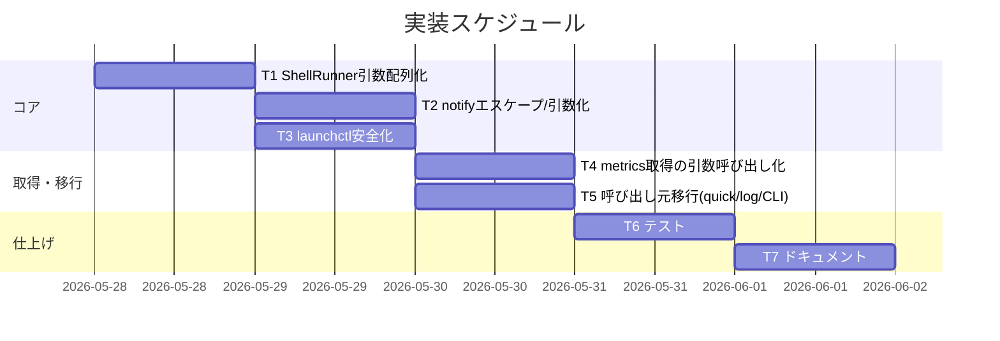
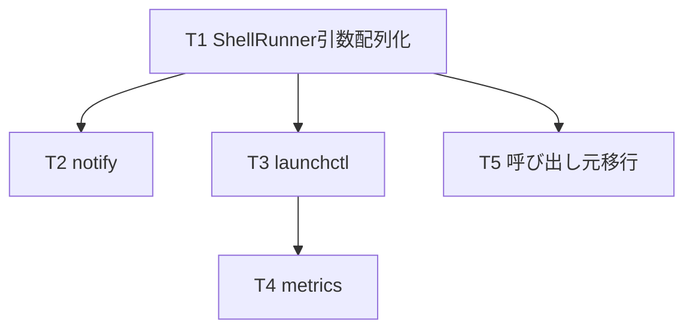

# 実装計画書: サブ F シェル実行の堅牢化

**プロジェクト名**: サブ F シェル実行の堅牢化
**作成日**: 2026 年 05 月 28 日
**最終更新**: 2026 年 05 月 28 日

> **重要**: **このドキュメントは常に更新**: 実装計画の変更、進捗状況の更新、バグの記録などがあった場合は、即座にこのドキュメントを更新してください。
> **必須項目**: 「必須」と明記した欄は空欄・抽象語のみで提出しないこと。
>
> **用語**: [.agents/CONCEPTS.md §用語規約](../../../../.agents/CONCEPTS.md#用語規約) を参照。

---

## 1. 実装概要

### 1.1 実装方針（必須）

[02_設計](./02_設計.md) に従い、シェル実行を `Process.executableURL` + `arguments` の引数配列実行へ差し替え、補間値が単一引数として扱われる構造にする。注入対策は `ShellRunner`（起動）と `AppleScriptEscaper`（整形）に集約し、呼び出し元は引数配列を渡すのみとする。外形的振る舞い（通知文言・ジョブ操作結果・メトリクス値/表示・launchd ラベル・CLI・ログ出力先）は不変。サブ B の責務分割を壊さず、`ShellRunner` の内部実装差し替え＋呼び出し元の引数化に留める。

### 1.2 実装順序（必須: 1 件以上）

ShellRunner 引数配列化（T1）→ notify エスケープ/引数化（T2）→ launchctl 安全化（T3）→ metrics 取得の引数呼び出し化（T4）→ quick action/ログ open 等の呼び出し元移行（T5）→ テスト（T6）→ ドキュメント（T7）。



---

## 2. タスク分解

**必須**: 各タスクには **「テスト観点」（2.x.3）** と **「単体テスト仕様（BDD）」（2.x.4）** を必ず記載する。観点定義は [02_設計 §6](./02_設計.md) と [RULES・TEST_BDD_FORMAT](../../../../.agents/RULES.md#テスト戦略必須要件) を参照。

### 2.1 タスク 1: ShellRunner の引数配列実行（T1）

#### 2.1.1 概要（必須）

`ZshShellRunner.run` を `Process.executableURL` + `arguments` の引数配列直接起動に確定し、補間値がシェル再パースを経ないようにする。

#### 2.1.2 実装内容（必須: 1 件以上）

- `ZshShellRunner.run(_ executable:String, _ args:[String])` を `task.executableURL = URL(fileURLWithPath: executable)`・`task.arguments = args` で実装（`launchPath` から更新）。stdout/stderr の Pipe、throw 時 `""`、trim を呼び出し元に委ねる現状互換は維持。
- I/F（`ShellRunner` protocol）は不変（サブ B 確定済み）。

#### 2.1.3 テスト観点（必須）

**参照**: [02_設計 §6](./02_設計.md)、[RULES・TEST_BDD_FORMAT](../../../../.agents/RULES.md#テスト戦略必須要件)。

##### 単体（本タスクの具体ケース・必須 1 件以上）

- 正常系: 実行ファイル `/usr/bin/printf` に引数 `["%s", "; rm -rf x"]` を渡すと標準出力が `"; rm -rf x"`（=単一引数として `printf` に渡る）になる。
- 注入非実行（クリティカル）: 引数に `; touch <tmpfile>` や `$(touch <tmpfile>)` を含めて実行後、`<tmpfile>` が**生成されていない**こと（一時ファイル非生成で実証）。
- 異常系: 存在しない実行ファイルパスを渡すと `""` を返す。

##### 結合/API（該当時は必須 1 件以上）

- `SpyShellRunner` 経由で呼び出し元（JobController 等）が `executable`/`args` をそのまま渡していることを記録・検証（T3/T5 で行う）。

##### E2E/受け入れ（未達時は理由記載）

- 該当なし（GUI を伴う E2E は対象外。引数配列実行の本質は単体で実証可能）。

##### バリデーション（該当する場合の具体ケース）

- 特殊文字（`;`・`$()`・改行・`|`）を含む引数が単一要素として保持されること。

#### 2.1.4 単体テスト仕様（BDD）（必須）

**BDD 形式のテストケース（高レベル仕様・01 UC1-S1 対応）**:

```gherkin
Feature: 引数配列による実行
  Scenario: 引数に ; や $() を含んでも追加コマンドが実行されない (01 UC1-S1)
    Given 引数に "; touch <tmpfile>" や "$(touch <tmpfile>)" を含む入力
    When ZshShellRunner.run を引数配列で呼ぶ
    Then 入力は単一引数として扱われ <tmpfile> は生成されない
```

**テストコード例（Swift / XCTest・Tests/MacHealthKitTests/）**

```swift
/// ユースケース: ShellRunner が引数配列を単一引数として渡しコマンド注入を防ぐ。
final class ZshShellRunnerInjectionTests: XCTestCase {

    /// シナリオ: ; や $() を含む引数が単一引数になり追加コマンドが実行されない（01 UC1-S1）。
    func test_run_treatsInjectionPayloadAsSingleArgument_doesNotExecuteExtraCommand() throws {
        // Given: 一時ファイルパスと、それを作ろうとする注入ペイロードを引数に持つ printf 実行
        let tmp = NSTemporaryDirectory() + "f_inject_\(UUID().uuidString).flag"
        try? FileManager.default.removeItem(atPath: tmp)
        let payload = "; touch \(tmp)"
        let runner = ZshShellRunner()

        // When: printf に "%s" と payload を引数配列で渡して実行する
        let out = runner.run("/usr/bin/printf", ["%s", payload])

        // Then: payload はそのまま単一引数として出力され、注入された touch は実行されない
        XCTAssertEqual(out, payload)
        XCTAssertFalse(FileManager.default.fileExists(atPath: tmp), "注入された touch が実行され一時ファイルが生成された")
    }
}
```

#### 2.1.5 依存関係

- なし（最初に着手）。後続 T2-T5 の前提。



#### 2.1.6 見積もり

- **工数**: 0.5 日　**優先度**: 高

### 2.2 タスク 2: notify のエスケープ／引数化（T2）

#### 2.2.1 概要（必須）

`AppleScriptEscaper`（純粋）を新設し、`notify()` を argv 渡し（案 A）または徹底エスケープ（案 B）で安全化する。通知タイトル・文言は不変。

#### 2.2.2 実装内容（必須: 1 件以上）

- `Sources/MacHealthKit/AppleScriptEscaper.swift` を新設（純粋関数）。案 A: `notificationArgs(message:title:) -> (executable:String, args:[String])`。困難時の案 B: `escapeForAppleScriptLiteral(_:) -> String`（`\`→`\\`、`"`→`\"`、改行→`\n` の順）。
- `AppDelegate.notify(_:)` を `runner.run` への引数配列呼び出しに置換。
- 案 B を採用した箇所があれば 02 §8.3 に根拠を追記。

#### 2.2.3 テスト観点（必須）

##### 単体（必須 1 件以上）

- 正常系: 通常メッセージで現状と同一の通知表示（文言不変）になる引数列/リテラルを生成。
- クリティカル（UC2）: `"` を含むメッセージで AppleScript ソースに `"` が裸で混入しない（案 A は引数要素、案 B は `\"`）。
- 境界: `\`・改行・空文字・`"` と `\` の混在で破損・注入が起きない表現を生成。

##### 結合/API（該当時は必須 1 件以上）

- `SpyShellRunner` で `notify` 呼出時に `executable="/usr/bin/osascript"` と message が引数要素として渡る（補間されない）ことを検証。

##### E2E/受け入れ（未達時は理由記載）

- 実際の通知センター表示は GUI 依存のため自動 E2E 対象外（手動確認）。理由: 通知表示は CI で観測困難。

##### バリデーション（該当する場合の具体ケース）

- `"`・`\`・改行・それらの組合せ・空文字での出力検証。

#### 2.2.4 単体テスト仕様（BDD）（必須）

**BDD（01 UC2-S1 対応）**:

```gherkin
Feature: 通知のエスケープ
  Scenario: " と \ を含むメッセージでも通知が壊れない/注入されない (01 UC2-S1)
    Given メッセージに " と \ と改行を含む
    When notify 用の引数列/リテラルを生成する
    Then AppleScript ソースに裸の " が混入せず、破損も注入も起きない
```

**テストコード例（Swift / XCTest）**

```swift
/// ユースケース: 通知メッセージの特殊文字を安全に扱い AppleScript への注入/破損を防ぐ。
final class AppleScriptEscaperTests: XCTestCase {

    /// シナリオ: " と \ と改行を含むメッセージで安全な引数列を生成する（01 UC2-S1）。
    func test_notificationArgs_withQuotesBackslashNewline_isSafe() {
        // Given: ダブルクォート・バックスラッシュ・改行を含む通知メッセージ
        let escaper = AppleScriptEscaper()
        let message = "a\"b\\c\nd"

        // When: notify 用の (executable, args) を生成する
        let r = escaper.notificationArgs(message: message, title: "Mac Health")

        // Then: osascript を実行ファイルとし、メッセージは独立引数として渡る（AppleScript ソースに混入しない）
        XCTAssertEqual(r.executable, "/usr/bin/osascript")
        XCTAssertTrue(r.args.contains(message), "メッセージが引数要素として渡らずソースに補間されている")
        // And (Then): -e で渡すスクリプト部分には生メッセージが含まれない（注入面なし）
        let scriptPart = r.args.first(where: { $0.contains("display notification") }) ?? ""
        XCTAssertFalse(scriptPart.contains(message), "スクリプト本体にメッセージが補間されている")
    }
}
```

> 案 B（エスケープ）採用時は `escapeForAppleScriptLiteral("a\"b\\c")` が `a\\\"b\\\\c` 相当（`\`→`\\`、`"`→`\"`）を返すことを Then で検証する。

#### 2.2.5 依存関係

- T1 完了後（`run` の引数配列実行が前提）。

#### 2.2.6 見積もり

- **工数**: 0.5 日　**優先度**: 高

### 2.3 タスク 3: launchctl の安全化（T3）

#### 2.3.1 概要（必須）

`JobController` の launchctl/CLI 呼び出しを label 非補間の引数配列化し、`isLoaded` は Swift 側フィルタで判定する。結果は従来と同一。

#### 2.3.2 実装内容（必須: 1 件以上）

- `isLoaded`: `runner.run("/bin/launchctl", ["list"])` の出力を行走査し `line.contains(label)` の非空判定に置換（`grep` 文字列補間を排除）。
- `load`/`unload`: `runner.run("/bin/launchctl", ["bootstrap", "gui/\(uid)", plist])` 等の引数配列化。`||` フォールバックは Swift 側で run 結果を見て二次起動（`launchctl load/unload`）に分岐。
- `enableAll`/`disableAll`: `runner.run(cliPath, ["enable"])` / `["disable"]`。
- 内部 `run(_ cmd:String)` ヘルパは引数配列版に整理（呼び出し元の振る舞い不変）。

#### 2.3.3 テスト観点（必須）

##### 単体（必須 1 件以上）

- 正常系（UC3）: list 出力に label を含む行があるとき `isLoaded == true`、含まないとき `false`（従来 grep 非空判定と同値）。
- クリティカル: `isLoaded` 実行時に `SpyShellRunner.calls` の `executable=="/bin/launchctl"`・`args==["list"]` であり label が引数/コマンド文字列に補間されていないこと。
- 副作用なし（Query）: `isLoaded` が load/unload を呼ばない。
- command 系: `load` 1 回目失敗（空戻り）時に Swift 側フォールバックの二次起動が記録される。

##### 結合/API（該当時は必須 1 件以上）

- `SpyShellRunner(stubbed:)` で list 出力をスタブし `isLoaded` の真偽分岐を検証。

##### E2E/受け入れ（未達時は理由記載）

- 実 launchctl 実行は環境依存のため XCTest 対象外（02 §6.1）。理由: 実ジョブ状態に依存し非決定的。

##### バリデーション（該当する場合の具体ケース）

- label に `;`・`$()` を含む擬似値を与えても、`isLoaded` が引数 `["list"]` のみで起動し補間しないこと。

#### 2.3.4 単体テスト仕様（BDD）（必須）

**BDD（01 UC3-S1 対応）**:

```gherkin
Feature: ジョブ状態取得の安全化
  Scenario: label をシェル補間せず引数/フィルタで扱う (01 UC3-S1)
    Given ジョブ label を含む状態取得
    When isLoaded を呼ぶ
    Then launchctl は ["list"] のみで起動し label は補間されず、結果は従来と同じ
```

**テストコード例（Swift / XCTest）**

```swift
/// ユースケース: JobController が label をシェル補間せず引数/フィルタで安全にジョブ状態を取得する。
final class JobControllerSafetyTests: XCTestCase {

    /// シナリオ: isLoaded が ["list"] で起動し label を補間せず従来同値の真偽を返す（01 UC3-S1）。
    func test_isLoaded_runsListWithoutInterpolatingLabel_resultMatchesGrep() {
        // Given: 当該 label を含む launchctl list 出力を返すスタブと JobController
        let label = JobCatalog().label(for: "monitor") // com.github.adachi-tatsuru.machealth.monitor
        let spy = SpyShellRunner(stubbed: ["123\t0\t\(label)\n456\t0\tother\n"])
        let sut = JobController(runner: spy, catalog: JobCatalog(),
                                uid: "501", launchAgentDir: "/tmp", cliPath: "/tmp/mac-health")

        // When: isLoaded を呼ぶ
        let loaded = sut.isLoaded(job: "monitor")

        // Then: 従来 grep 非空判定と同値 true で、launchctl は ["list"] のみ・label は補間されない
        XCTAssertTrue(loaded)
        XCTAssertEqual(spy.calls.last?.executable, "/bin/launchctl")
        XCTAssertEqual(spy.calls.last?.args, ["list"])
        XCTAssertFalse(spy.calls.last?.args.contains(where: { $0.contains(label) }) ?? false,
                       "label が引数に補間されている")
    }
}
```

#### 2.3.5 依存関係

- T1 完了後。

#### 2.3.6 見積もり

- **工数**: 0.5 日　**優先度**: 高

### 2.4 タスク 4: メトリクス取得の引数呼び出し化（T4）

#### 2.4.1 概要（必須）

`MetricsCollector.collect()` のパイプ取得を `scripts/lib/metrics.sh <metric>` の引数呼び出しに寄せ、`metrics.sh` に直接実行時のみ動く CLI ディスパッチを追加する。値・表示書式は不変。

#### 2.4.2 実装内容（必須: 1 件以上）

- `scripts/lib/metrics.sh` に `BASH_SOURCE` 判定の dispatch を追加（直接実行時のみ `case "$1" in load) metrics_load_1m_raw ;; swap) metrics_swap_used_raw ;; ...` 形式）。source 利用（mac-health/monitor.sh/bats）は不変。
- `MetricsCollector` の各取得を `runner.run("/bin/bash", [metricsShPath, "<metric>"])` に置換。`MetricsParser` 入力が現状の sed/awk 抽出後テキストと同値になるようメトリクス戻り値書式を突き合わせ（02 §3.4 / §8.3）。
- docker count タイムアウト（現 L66）は 02 §8.3 の方針で実装時に「引数配列＋`Process` タイムアウト」か「残置（固定文字列・注入なし）」を確定し記録。

#### 2.4.3 テスト観点（必須）

##### 単体（必須 1 件以上）

- shell 側（A の `scripts/test/` + bats）: `metrics.sh load`/`swap`/`free`/`compressed`/`uptime_days`/`uptime_hours`/`docker` が、対応する純粋関数/ラッパと同値を返す。未知 metric は非 0 終了 or 空出力（既定）。
- source 利用不変: `source metrics.sh` 後も既存関数が呼べ、bats/metrics_test.sh が緑のまま。

##### 結合/API（該当時は必須 1 件以上）

- `SpyShellRunner` で `MetricsCollector.collect()` が `metrics.sh <metric>` の引数で起動することを確認。

##### E2E/受け入れ（未達時は理由記載）

- 実コマンド取得値の整合は環境依存のため XCTest 対象外（02 §6.1）。理由: sysctl/vm_stat 等は実機依存で非決定的。`MetricsParser` の純粋部既存テストと metrics.bats で担保。

##### バリデーション（該当する場合の具体ケース）

- 既知メトリクス名のみ受理し、未知名は空/エラーで安全（注入面はメトリクス名が固定列挙のため無し）。

#### 2.4.4 単体テスト仕様（BDD）（必須）

**BDD**:

```gherkin
Feature: メトリクス取得の引数呼び出し化
  Scenario: metrics.sh <metric> が source 利用と同値を返し既存利用を壊さない
    Given metrics.sh に CLI ディスパッチを追加
    When metrics.sh swap を直接実行する（固定 swapusage を注入）
    Then metrics_swap_used_raw と同値を返し、source 経由の既存関数も従来どおり動く
```

**テストコード例（shell / scripts/test/・自前 assert + bats）**

```bash
# ユースケース: metrics.sh の CLI ディスパッチが source 用関数と同値を返し既存利用を壊さない。

# シナリオ: metrics.sh の dispatch が対象関数へ委譲し source 利用を壊さない。
# Given: metrics.sh を source して関数を直接呼べる状態
source "$SCRIPT_DIR/../lib/metrics.sh"
# When: 純粋関数を直接呼ぶ（source 利用が不変であることの確認）
out=$(metrics_parse_swap_raw "used = 512.00M")
# Then: source 経由の既存挙動が従来どおり（512.00M）
assert_eq "512.00M" "$out" "T4: source 利用の純粋関数は不変"
```

> dispatch 自体の直接実行検証は bats で `run bash metrics.sh swap`（固定入力を関数差し替え/環境で注入）を用い、`metrics_swap_used_raw` と同値・未知 metric の安全終了を確認する。

#### 2.4.5 依存関係

- T3 完了後（`isLoaded` 経由のジョブ収集と整合）。サブ C の `metrics.sh` 集約に依存。

#### 2.4.6 見積もり

- **工数**: 1 日　**優先度**: 中

### 2.5 タスク 5: 呼び出し元移行（quick action / ログ open / CLI 実行）（T5）

#### 2.5.1 概要（必須）

`AppDelegate` の文字列補間実行を引数配列に置換する。振る舞い不変。

#### 2.5.2 実装内容（必須: 1 件以上）

- `quickAppRefresh`/`runJob`/`testNotification`: `runner.run(machealthCLI, ["run", job])` / `["test"]` 等。
- `quickMemoryPressure`: `runner.run("/usr/bin/memory_pressure", ["-l", "warn"])`（戻り値無視）。
- `quickDockerQuit`: `runner.run("/usr/bin/osascript", ["-e", "quit app \"Docker Desktop\""])`。
- `quickPurge`: 複数 `-e` を引数配列の独立要素に分解（`["-e", script1, "-e", script2]`）。
- `openEventsLog`/`openMonitorLog`: `touch`→`open -a Console` を 2 回の引数配列起動に分割（`&&` 排除、path を引数要素）。
- ログ出力先・CLI・通知文言・Terminal 実行内容は不変。

#### 2.5.3 テスト観点（必須）

##### 単体（必須 1 件以上）

- 正常系: `SpyShellRunner` で各アクションが期待 `executable`/`args` で起動する（補間文字列でなく配列）。
- クリティカル: パスやジョブ ID に特殊文字を擬似挿入しても引数要素として保持され、`&&`/`||` がシェルへ渡らない。

##### 結合/API（該当時は必須 1 件以上）

- 各 quick action / log open / CLL 実行の `SpyShellRunner.calls` を検証。

##### E2E/受け入れ（未達時は理由記載）

- GUI クリック起点の E2E は対象外（手動確認）。理由: NSMenu/GUI 依存で CI 不可。

##### バリデーション（該当する場合の具体ケース）

- ログパス・CLI パスが引数要素として 1 要素で渡ること。

#### 2.5.4 単体テスト仕様（BDD）（必須）

**BDD（01 UC1-S1 派生）**:

```gherkin
Feature: 呼び出し元の引数配列移行
  Scenario: ログを開く操作が touch と open を引数配列で別々に起動する
    Given ログパス（特殊文字を含み得る）
    When openEventsLog 相当の処理を実行する
    Then touch と open が引数配列で起動し && がシェルに渡らない
```

**テストコード例（Swift / XCTest・移行ロジックを純粋関数/注入点に切り出して検証）**

```swift
/// ユースケース: ログを開く処理が touch/open を引数配列で安全に起動する。
final class LogOpenInvocationTests: XCTestCase {

    /// シナリオ: openEventsLog 相当が touch と open を別々の引数配列で起動する（&& 非使用）。
    func test_openLog_invokesTouchThenOpenAsArgumentArrays() {
        // Given: スパイ runner と特殊文字を含み得るログパス
        let spy = SpyShellRunner()
        let path = "/tmp/Logs/MacHealth/events.log"

        // When: ログオープン相当の処理（touch → open -a Console）を実行する
        spy.run("/usr/bin/touch", [path])
        spy.run("/usr/bin/open", ["-a", "Console", path])

        // Then: 2 回の起動がいずれも引数配列で、path が単一要素として渡る（&& がシェルに渡らない）
        XCTAssertEqual(spy.calls[0].executable, "/usr/bin/touch")
        XCTAssertEqual(spy.calls[0].args, [path])
        XCTAssertEqual(spy.calls[1].executable, "/usr/bin/open")
        XCTAssertEqual(spy.calls[1].args, ["-a", "Console", path])
    }
}
```

> 実装時は `AppDelegate` の各 @objc から起動部を `JobController`/小さなヘルパへ寄せ、`SpyShellRunner` で検証できるようにする（UI 直結のままだと XCTest しづらいため）。

#### 2.5.5 依存関係

- T1・T2 完了後。

#### 2.5.6 見積もり

- **工数**: 0.5 日　**優先度**: 中

### 2.6 タスク 6: テスト（T6）

#### 2.6.1 概要（必須）

T1-T5 の単体テストを `Tests/MacHealthKitTests/`（XCTest）と A の `scripts/test/`（shell）に整備し、注入が起きないことを実証する。

#### 2.6.2 実装内容（必須: 1 件以上）

- XCTest: `ZshShellRunnerInjectionTests`・`AppleScriptEscaperTests`・`JobControllerSafetyTests`・呼び出し元検証（`SpyShellRunner` 流用）。
- shell: `metrics.sh` CLI ディスパッチの bats/自前 assert（A 方式）。
- 全テストが BDD 形式（ユースケース/シナリオ doc コメント＋ Given/When/Then インライン）に準拠（[TEST_BDD_FORMAT.md](../../../../.agents/TEST_BDD_FORMAT.md)）。

#### 2.6.3 テスト観点（必須）

##### 単体（必須 1 件以上）

- UC1-S1（単一引数・一時ファイル非生成）、UC2-S1（通知エスケープ）、UC3-S1（label 非補間）が緑。

##### 結合/API（該当時は必須 1 件以上）

- `SpyShellRunner` による呼び出し元の引数化検証が緑。

##### E2E/受け入れ（未達時は理由記載）

- GUI/実コマンド系は対象外（理由は各タスク記載）。

##### バリデーション（該当する場合の具体ケース）

- 特殊文字入力で破損・注入が起きないこと。

#### 2.6.4 単体テスト仕様（BDD）（必須）

```gherkin
Feature: 注入耐性の実証
  Scenario: 特殊文字入力で追加コマンドが実行されない/通知が壊れない/label が補間されない
    Given UC1/UC2/UC3 の特殊文字入力
    When 各経路を実行する
    Then 一時ファイル非生成・通知非破損・label 非補間が確認できる
```

**注入が起きないことの実証方法（具体化）**:
- UC1: `printf` に注入ペイロード（`; touch <tmp>` / `$(touch <tmp>)`）を渡し、テスト後に `<tmp>` が**存在しない**ことを assert（一時ファイル非生成）。出力が payload と一致（単一引数）。
- UC2: 生成した引数列/リテラルに**裸の `"` が AppleScript ソースへ混入しない**ことを assert（注入面なし）。
- UC3: `SpyShellRunner.calls` の args が `["list"]` のみで、label が引数文字列に含まれないことを assert。
- 余分プロセス非起動の補助観測（任意）: UC1 の payload を `sleep`/`pgrep` 等にせず、副作用がファイル生成として観測可能な `touch` で代表させる。

#### 2.6.5 依存関係

- T1-T5。

#### 2.6.6 見積もり

- **工数**: 0.5 日　**優先度**: 高

### 2.7 タスク 7: ドキュメント（T7）

#### 2.7.1 概要（必須）

文字列実行を残した箇所（docker タイムアウト等）の対象・理由・エスケープ方法を 02 §8.3 に確定記録し、コード上にも根拠コメントを残す。

#### 2.7.2 実装内容（必須: 1 件以上）

- 02 §8.3 の残置表を実装結果で確定（残置 or 解消）。
- 残置箇所のソースに「補間値は流入しない・固定文字列のみ」のコメント。

#### 2.7.3 テスト観点（必須）

##### 単体（必須 1 件以上）

- 該当なし（ドキュメント・コメントのみ）。

##### 結合/API（該当時は必須 1 件以上）

- 該当なし。

##### E2E/受け入れ（未達時は理由記載）

- 該当なし（ドキュメントタスク）。

##### バリデーション（該当する場合の具体ケース）

- 該当なし。

#### 2.7.4 単体テスト仕様（BDD）（必須）

- 該当なし（ドキュメントタスクのためテストコードなし。02 §8.3 の記載完備をレビューで確認）。

#### 2.7.5 依存関係

- T4・T6（残置/解消の確定後）。

#### 2.7.6 見積もり

- **工数**: 0.25 日　**優先度**: 中

---

## テスト観点

本サブのテスト観点は「注入が成立しないこと」と「外形的振る舞い不変」の 2 軸。前者は UC1（単一引数・一時ファイル非生成）/UC2（通知エスケープ）/UC3（label 非補間）で実証し、後者は既存の `MenuModelTests`/`MetricsParserTests`/`metrics.bats` 等の回帰と `SpyShellRunner` の起動内容一致で担保する。各タスク §2.x.3 に具体ケースを記載した。

---

## 単体テスト

- Swift: `Tests/MacHealthKitTests/` に `ZshShellRunnerInjectionTests`・`AppleScriptEscaperTests`・`JobControllerSafetyTests`・呼び出し元検証を追加（既存 `SpyShellRunner`/`ShellRunnerContractTests` を流用）。
- shell: `scripts/test/` に `metrics.sh` CLI ディスパッチの bats/自前 assert を追加（A 方式・`make test-shell` から実行）。
- すべて BDD 形式（[TEST_BDD_FORMAT.md](../../../../.agents/TEST_BDD_FORMAT.md)）に準拠。

---

## BDD

### 01 BDD ↔ 03 テスト仕様 対応表

| 01 ユースケース/シナリオ | 03 タスク | 03 テスト | 実証方法 |
| ------------------------ | --------- | --------- | -------- |
| UC1-S1（`;`/`$()` を含んでも単一引数・追加コマンド非実行） | T1（+ T5 派生） | §2.1.4 `ZshShellRunnerInjectionTests` / §2.5.4 `LogOpenInvocationTests` | `printf` に注入ペイロードを渡し一時ファイル非生成を assert・出力が payload と一致 |
| UC2-S1（`"`/`\`/改行を含む通知が壊れない/注入されない） | T2 | §2.2.4 `AppleScriptEscaperTests` | 引数列に裸の `"` が AppleScript ソースへ混入しないことを assert |
| UC3-S1（label をシェル補間せず引数/フィルタで扱い結果同一） | T3 | §2.3.4 `JobControllerSafetyTests` | `SpyShellRunner.calls` が `["list"]` のみ・label 非補間・従来同値の真偽を assert |
| （振る舞い不変・回帰） | T4/T5 | metrics.bats / `SpyShellRunner` 起動一致 / 既存 `MenuModelTests` 等 | source 利用不変・起動引数一致・メトリクス値書式不変 |

---

## 3. 実装スケジュール

### 3.1 マイルストーン

| マイルストーン | 期日 | 成果物 |
| -------------- | ---- | ------ |
| コア安全化 | T1-T3 完了時 | 引数配列実行・notify・launchctl の安全化＋単体テスト |
| 取得/移行完了 | T4-T5 完了時 | metrics.sh 引数呼び出し・呼び出し元移行 |
| 仕上げ | T6-T7 完了時 | 全テスト緑・残置箇所の記録 |

### 3.2 実装フェーズ

#### フェーズ 1: コア安全化

- **タスク**: T1, T2, T3

#### フェーズ 2: 取得・移行・仕上げ

- **タスク**: T4, T5, T6, T7

---

## 4. テスト計画

観点・レベル・BDD の定義は [02_設計 §6](./02_設計.md) と [RULES・TEST_BDD_FORMAT](../../../../.agents/RULES.md#テスト戦略必須要件) を参照。各タスク §2.x.3/§2.x.4 に具体ケース・BDD を記載した。

### 4.1 テストの優先順位

- クリティカル（注入耐性 UC1/UC2/UC3）を厚くテスト。
- `ShellRunner`/`JobController` は影響範囲が広いため回帰（既存 `ShellRunnerContractTests`/`JobControllerTests`）に必ず含める。

---

## 5. リスク管理

### 5.1 実装リスク

- **リスク**: `metrics.sh` への寄せでメトリクスの値・書式が現状とズレる（振る舞い破壊）。
  - **対策**: 各メトリクスの戻り値書式を現 `collect()` と突き合わせ、ズレる箇所は現状コマンドの引数配列化で残置（02 §8.3）。`MetricsParser` の純粋部テストと metrics.bats で回帰確認。
- **リスク**: docker count の 3 秒タイムアウト（現 L66 `& wait`）が引数配列で再現困難。
  - **対策**: `Process` の `terminate()` タイマでの代替を優先検討。困難なら固定文字列のみで注入リスク無として残置し 02 §8.3 に記録。
- **リスク**: notify の argv 渡し（案 A）が AppleScript の制約で困難。
  - **対策**: 案 B（徹底エスケープ）にフォールバックし根拠を 02 §8.3 に記録。いずれも `AppleScriptEscaper` を純粋関数として XCTest で検証。
- **リスク**: `AppDelegate` の UI 直結部が XCTest しづらい。
  - **対策**: 起動ロジックを小さなヘルパ/`JobController` 側へ寄せ `SpyShellRunner` で検証可能にする（責務分割を壊さない範囲）。

---

## 6. 参考資料

### プロジェクトドキュメント

- [`02_設計.md`](./02_設計.md) - 設計
- [`01_要件定義.md`](./01_要件定義.md) - 要件定義

### その他の参考資料

- `Sources/MacHealthKit/ShellRunner.swift`, `JobController.swift`, `Tests/MacHealthKitTests/SpyShellRunner.swift`, `ShellRunnerContractTests.swift`
- `src/MacHealth.swift`（notify/quick action/log open）, `src/MetricsCollector.swift`
- `scripts/lib/metrics.sh`, `scripts/test/metrics_test.sh`（A 方式）

---

## 7. 前のステップ

- **前**: [`02_設計.md`](./02_設計.md) - 設計フェーズ

---

## 8. 次のステップ

- **次**: 実装フェーズ（execution）に直接進む（本サブは 1 issue 単位）。
