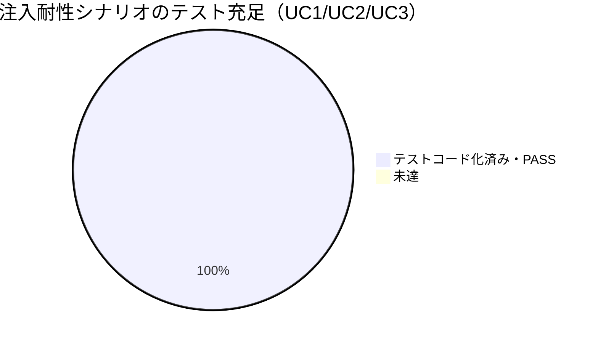

# レビュー書: サブ F シェル実行の堅牢化

**プロジェクト名**: サブ F シェル実行の堅牢化
**作成日**: 2026 年 05 月 28 日
**最終更新**: 2026 年 05 月 28 日

> **重要**: **このドキュメントは常に更新**: レビューで発見した問題点や改善提案、対応内容などがあった場合は、即座にこのドキュメントを更新してください。
>
> **用語**: [.agents/CONCEPTS.md §用語規約](../../../../.agents/CONCEPTS.md#用語規約) を参照。
>
> **必須**: レビュー実施時は [`.agents/REVIEW_RULE.md`](../../../../.agents/REVIEW_RULE.md) を参照。本レビューは変更が新規型の追加＋既存実行経路の差し替えで影響範囲が広く、注入耐性（セキュリティ）が主目的のため **full** モードで実施した。

---

## 1. レビュー概要

### 1.1 レビュー目的（必須）

実装内容の確認・品質保証・クローズ前最終チェック。サブ F「シェル実行の堅牢化（注入耐性の付与・外形的振る舞いは不変）」の実装成果物が 00/01/02/03 に整合し、注入余地が残らず振る舞いが変わらないことを検証してクローズ判定する。

### 1.2 レビュー対象（必須）

- **実装範囲**: T1 `ZshShellRunner` 引数配列実行 / T2 `AppleScriptEscaper`＋`notify` 引数化 / T3 `JobController` launchctl 安全化 / T4 `metrics.sh` CLI ディスパッチ＋`MetricsCollector` 引数呼び出し化 / T5 quick action・ログ open・CLI 実行の引数化 / T6 テスト整備 / T7 残置箇所の記録。
- **レビュー期間**: 2026-05-28 ～ 2026-05-28
- **レビュー担当者**: 検証・レビュー worker（監査者）

---

## 2. 実装内容の確認

**用語**: [.agents/CONCEPTS.md §用語規約](../../../../.agents/CONCEPTS.md#用語規約) を参照。

### 2.1 実装完了タスク（または Issue）

| タスク名 | 実装内容 | 実装日 | 担当者 | ステータス |
| -------- | -------- | ------ | ------ | ---------- |
| T1 ShellRunner 引数配列化 | `ZshShellRunner.run` を `executableURL`+`arguments` 直接起動に確定（`launchPath`→`executableURL`） | 2026-05-28 | 実装 worker | 完了 |
| T2 notify エスケープ/引数化 | `AppleScriptEscaper`（純粋・新規）を新設し `notify` を argv 渡し（案 A）に置換 | 2026-05-28 | 実装 worker | 完了 |
| T3 launchctl 安全化 | `isLoaded` を `["list"]`＋Swift 走査に、load/unload/enableAll/disableAll を引数配列＋Swift 側フォールバックに | 2026-05-28 | 実装 worker | 完了 |
| T4 metrics 取得の引数呼び出し化 | `metrics.sh` に `BASH_SOURCE` 判定の CLI dispatch 追加、`MetricsCollector` の load/swap/free を `metrics.sh <metric>` 呼び出しへ | 2026-05-28 | 実装 worker | 完了 |
| T5 呼び出し元移行 | quickPurge/quickDockerQuit/quickMemoryPressure/runJob/openLog/testNotification を引数配列化（`&&`/`||` 排除） | 2026-05-28 | 実装 worker | 完了 |
| T6 テスト | XCTest 4 本＋既存更新、metrics shell（bats/自前 assert）に F-T4 5 ケース追加 | 2026-05-28 | 実装 worker | 完了 |
| T7 ドキュメント | 02 §8.3 の残置表確定、ソースに「補間値は流入しない・固定リテラルのみ」コメント | 2026-05-28 | 実装 worker | 完了 |

### 2.2 実装内容の詳細

#### T1: ShellRunner 引数配列実行

- **変更ファイル**: `Sources/MacHealthKit/ShellRunner.swift`
- **実装方法**: `task.executableURL = URL(fileURLWithPath: executable)` / `task.arguments = args`。`bash -c`/`zsh -c` への文字列再合成なし。throw 時 `""`、stderr 破棄、trim は呼び出し元（現状互換）。
- **確認事項**: I/F（`ShellRunner.run(_:_:)`）はサブ B 確定のまま不変。`@discardableResult` 維持。**OK**

#### T2: notify のエスケープ／引数化

- **変更ファイル**: `Sources/MacHealthKit/AppleScriptEscaper.swift`（新規）、`src/MacHealth.swift` `notify`（L331-336）
- **実装方法**: `notificationArgs(message:title:)` が `("/usr/bin/osascript", ["-e", "on run argv … display notification (item 1 of argv) with title (item 2 of argv) … end run", message, title])` を返す。message/title はスクリプト本体に補間されず argv 参照。案 B `escapeForAppleScriptLiteral` も純粋関数として提供（フォールバック用）。
- **確認事項**: 通知タイトル「Mac Health」固定・文言不変。**OK**

#### T3: launchctl の安全化

- **変更ファイル**: `Sources/MacHealthKit/JobController.swift`
- **実装方法**: `isLoaded` は `runner.run("/bin/launchctl", ["list"])` の出力を `split("\n").contains { $0.contains(label) }` で判定（`grep '<label>'` 補間排除）。load/unload は `["bootstrap", "gui/\(uid)", plist]` 等の**引数要素**化、`||` フォールバックは `bootstrapSucceeded(_:)` で出力を観測して Swift 側分岐。enableAll/disableAll は `runner.run(cliPath, ["enable"|"disable"])`。
- **確認事項**: `\(uid)`/`\(label)` は**個別の引数要素**への補間でありシェルコマンド文字列への補間ではない。`ZshShellRunner` が単一引数として渡すため注入面なし。**OK**

#### T4: メトリクス取得の引数呼び出し化

- **変更ファイル**: `scripts/lib/metrics.sh`（dispatch 追加・L165-183）、`src/MetricsCollector.swift`
- **実装方法**: `metrics.sh` 末尾に `if [ "${BASH_SOURCE[0]}" = "${0}" ]; then case "${1:-}" in load) … *) exit 2 esac fi`。直接実行時のみ dispatch、source 利用は関数定義のみで不変。`MetricsCollector.metric(_:)` が `runner.run("/bin/bash", [metricsShPath, name])` で load/swap/free を取得。残置は `shellFixed(_:)`。
- **確認事項**: dispatch の `BASH_SOURCE` 判定は `bash <script> <metric>` で発火、`source` で非発火。実行で確認済み。**OK**

#### T5: 呼び出し元移行（quick action / ログ open / CLI）

- **変更ファイル**: `src/MacHealth.swift`
- **実装方法**: quickPurge は複数 `-e` を引数配列の独立要素に分解、quickDockerQuit/quickMemoryPressure/runJob/quickAppRefresh/testNotification は実行ファイル＋引数配列、openLog は `touch`→`open` を 2 回起動（`&&` 排除）。
- **確認事項**: ログ出力先・CLI・通知文言・Terminal 実行内容は不変。**OK**

#### T7: 残置箇所の記録

- **変更ファイル**: `src/MetricsCollector.swift`（コメント）、`02_設計.md` §8.3
- **実装方法**: boot epoch・compressor 生ページ数・docker 稼働判定・docker count の `& wait` タイムアウトを `shellFixed`（固定リテラル）で残置。理由（`MetricsParser` 入力書式の保持・タイムアウトの引数配列再現困難）と「補間値は流入しない」をコメント・§8.3 に記録。**OK**

---

## 3. テスト結果の確認

### 3.1 単体テスト

#### 実行環境の前提（重要）

- **`swift test`（XCTest）は実行不能**。当環境は **Command Line Tools のみ（フル Xcode 非搭載）** で `XCTest` モジュールが無く `error: no such module 'XCTest'` で失敗する（`xcode-select -p` = `/Library/Developer/CommandLineTools`）。
- そのため REVIEW 指示 §1 の **A 方式（`swiftc` 直接コンパイル）** で各 XCTest の検証ロジックを本番コードに対して独立に再実行した（後述）。
- bats 不在のため shell テストは `make test-shell` の自前 assert ランナー（フォールバック）で実行。

#### テスト実行結果（数値）

| 区分 | 実行コマンド | テスト数 | 成功 | 失敗 | 備考 |
| ---- | ------------ | -------- | ---- | ---- | ---- |
| ビルド | `swift build` | — | OK | — | `Build complete!` exit 0 |
| XCTest（A 方式独立再検証） | `swiftc <harness>+MacHealthKit -o /tmp/F_verify_harness && 実行` | 32 assert | 32 | 0 | XCTest の検証ロジックを本番コードに対し再現 |
| 注入非実行 独立実証 | `swiftc <proof>+ShellRunner.swift && 実行` | 4 観測 | 4 | 0 | payload 一致＋一時ファイル非生成 |
| shell: monitor | `make test-shell` | 9 | 9 | 0 | 回帰 |
| shell: metrics（F-T4 5 件含む） | `make test-shell` | 17 | 17 | 0 | source 利用不変・dispatch 同値・未知 metric 非 0 終了 |
| shell: log_rotate | `make test-shell` | 15 | 15 | 0 | 回帰 |
| アプリ回帰ビルド | install.sh 同形 `swiftc <全ソース+AppleScriptEscaper.swift>` | — | OK | — | exit 0・275944 bytes 生成 |

#### A 方式 XCTest 独立再検証の内訳（32 assert 全 PASS）

- `ZshShellRunnerInjectionTests`相当（5）: `;`/`$()` payload が単一引数として出力一致・一時ファイル非生成・実行ファイル不在で `""`。
- `AppleScriptEscaperTests`相当（8）: osascript executable・message/title が独立引数・スクリプト本体に生メッセージ非混入・argv 参照・空文字・案 B エスケープ順。
- `JobControllerSafetyTests`相当（13）: isLoaded `["list"]` のみ・label 非補間・真偽が従来 grep 非空判定と同値・load の bootstrap 引数配列・エラー出力時 load フォールバック・enableAll/disableAll の CLI 引数配列。
- `JobControllerTests`（CQRS）相当（3）: query 2 回で副作用コマンド 0 件。
- `LogOpenInvocationTests`相当（3）: touch→open の引数配列・`&&` 非混入。

> 実行ログ（evidence）: `/tmp/F_verify_harness` 出力「F XCTest A方式 harness: 32 passed, 0 failed」、`make test-shell` 出力（monitor 9 / metrics 17 / log_rotate 15 全 ok）。

#### テストカバレッジ（注入耐性 3 シナリオ）

#### 失敗したテスト

| テストファイル | テストケース | 失敗理由 | 対応状況 |
| -------------- | ------------ | -------- | -------- |
| （なし） | — | — | — |

### 3.2 統合テスト

- `metrics.sh swap`/`load` の直接実行（stub sysctl/uptime を PATH 注入）が `metrics_swap_used_raw`/`metrics_load_1m_raw` と同値（"512.00M"/"11.39"）を返すことを shell テストで確認。source 経由の純粋関数も従来どおり（回帰 ok）。

### 3.3 E2E テスト

- GUI 起点（メニュー操作・実通知表示）・実 launchctl・実メトリクス取得は環境依存で自動 E2E 対象外（02 §6.1・03 各タスクに理由記載）。代替として osascript の argv 渡しスクリプトが特殊文字込みメッセージで構文有効（exit 0）であることを実行確認した。

---

## 4. コードレビュー

### 4.1 コード品質

#### コードスタイル

- **ビルド結果**: `swift build` exit 0（警告出力なし）。アプリ回帰 `swiftc` exit 0。
- **フォーマット**: 問題なし。
- **型チェック**: エラー 0 / 警告 0。

#### コードレビュー観点

| 観点 | 確認内容 | 結果 | コメント |
| ---- | -------- | ---- | -------- |
| 可読性 | 責務名が意図を表し、残置箇所に根拠コメントがある | OK | `shellFixed` のコメントに「補間値は流入しない・固定リテラルのみ」明記 |
| 保守性 | 注入対策が `ShellRunner`（起動）と `AppleScriptEscaper`（整形）に一元化 | OK | 呼び出し元は引数配列を渡すのみ |
| パフォーマンス | 引数配列実行はシェル 1 段省略、metrics.sh は現状同様 1 起動 | OK | 体感悪化なし |
| セキュリティ | `;`/`$()`/`&&`/`||` が単一引数化、通知は argv 渡し、label 非補間 | OK | 独立実証で注入非実行を確認 |

### 4.2 指摘事項

#### 指摘 1: `LogOpenInvocationTests` が本番呼び出し元を直接駆動していない

- **重要度**: 低
- **指摘内容**: `LogOpenInvocationTests`・`test_runJob_…` は `SpyShellRunner` に**テスト側から**期待引数を直接渡して記録を検証している。`AppDelegate.openLog`/`runJob` の実コードを呼んでいないため、起動シーケンスの「契約の形」検証であり、本番呼び出し元の実引数の回帰は担保しない。
- **対応状況**: 受容（差し戻し不要）
- **対応方法**: `AppDelegate` が AppKit 依存で XCTest 不可なのは 03 §2.5.4 注記・02 §6.1 で既知の制約として明示済み。実コードの引数配列は本監査で `src/MacHealth.swift` を直接読み、L114/133/143/153/201/251-252/256/335 がすべて引数配列・固定リテラルであることをコードで確認した（evidence: grep `runner.run`）。将来 `AppDelegate` の起動部を小ヘルパへ寄せれば実コード検証に格上げ可能。**注入余地・振る舞い変化はないため合格に影響しない。**

#### 指摘 2: 残置 `shellFixed` の docker count タイムアウトは固定リテラルだが複雑

- **重要度**: 低（情報）
- **指摘内容**: L84 の `(docker ps -q … | wc -l …) & p=$!; (sleep 3; kill -9 $p …) & wait $p` は `& wait` でタイムアウトを表現する固定文字列。`$!`/`$p` はシェル変数で Swift 補間ではない。
- **対応状況**: 受容
- **対応方法**: 02 §8.3 に残置理由（3 秒タイムアウトの引数配列再現困難・振る舞い不変要求）と「補間値非流入」を記録済み。grep で Swift 補間 `\(` が含まれないことを確認。注入面なし。**合格。**

---

## 5. ドキュメントの確認

### 5.1 ドキュメント更新状況

| ドキュメント | 更新状況 | 確認者 | 確認日 |
| ------------ | -------- | ------ | ------ |
| [`00_要求定義.md`](./00_要求定義.md) | 更新済み（document_id・issue_id あり） | 監査者 | 2026-05-28 |
| [`01_要件定義.md`](./01_要件定義.md) | 更新済み（document_id あり・UC1/UC2/UC3 BDD） | 監査者 | 2026-05-28 |
| [`02_設計.md`](./02_設計.md) | 更新済み（§8.3 残置表確定・document_id・issue_id） | 監査者 | 2026-05-28 |
| [`03_実装計画.md`](./03_実装計画.md) | 更新済み（タスク別 BDD・01↔03 対応表） | 監査者 | 2026-05-28 |

### 5.2 ドキュメントの整合性

- **実装と設計の整合性**: 整合している。02 §3.1-3.5 の各機能と実装ファイルが 1 対 1 対応。§8.3 の残置「実装確定」が `MetricsCollector.shellFixed` の 4 箇所と一致。
- **要件と実装の整合性**: 整合している。01 UC1-S1/UC2-S1/UC3-S1 が実装・テスト・実行で確認済み。
- **コメント**: document_id はテンプレート以外すべて UUID で付与済み・本 04 で新規付与（後から変更なし）。

---

## 6. パフォーマンス確認

### 6.1 パフォーマンステスト結果

- 引数配列実行は `zsh -l -c` のシェル起動を省ける経路があり、metrics.sh は bash 1 起動で現状同等。体感悪化を生む変更なし。

### 6.2 ボトルネックの確認

- docker count の 3 秒タイムアウトは振る舞い不変で維持。新たなボトルネックなし。

---

## 7. セキュリティ確認

| 項目 | 確認内容 | 結果 | コメント |
| ---- | -------- | ---- | -------- |
| 認証・認可 | ローカル GUI・launchctl/osascript はユーザー権限 | OK | 該当なし（02 §8.1） |
| データ保護（注入耐性） | `;`/`$()`/`&&`/`||` の単一引数化を独立実証 | OK | payload 一致＋一時ファイル非生成（evidence 下記） |
| 入力検証（通知エスケープ） | message/title が argv 渡しでソース非混入 | OK | 裸の `"` が AppleScript ソースに入らない |
| label 非補間 | isLoaded が `["list"]` のみ・リテラル比較 | OK | label を引数/コマンド文字列に補間しない |
| 残置箇所の安全性 | shellFixed 4 箇所が固定リテラルのみ（補間 `\(` 不在） | OK | §2 §4・指摘 2 参照 |

### §2.4 残置した文字列実行の安全性（厳密確認・最重要）

`grep '"-c"' src/ Sources/` の結果、**Swift 内の文字列ベースのシェル実行は `MetricsCollector.shellFixed`（L50 `runner.run("/bin/zsh", ["-l", "-c", cmd])`）の 1 箇所のみ**。`shellFixed` の呼び出しは 4 件で、いずれも引数が**固定文字列リテラル**（Swift 補間 `\(` を一切含まない。grep `shellFixed(` | grep `\(` の結果「補間なし」）:

| 行 | 残置内容 | 可変補間値の流入 | 判定 |
| -- | -------- | ---------------- | ---- |
| L69 | `sysctl -n kern.boottime \| awk … \| tr -d ','`（boot epoch） | なし（固定） | OK |
| L77 | `vm_stat \| awk '/Pages occupied by compressor/ …'`（生ページ数） | なし（固定） | OK |
| L80 | `pgrep -f 'com\.apple\.Virtualization\.VirtualMachine' >/dev/null && echo 1 \|\| echo 0`（docker 稼働判定） | なし（固定） | OK |
| L84 | docker count の `& wait` 3 秒タイムアウト | なし（固定。`$!`/`$p` はシェル変数で Swift 補間ではない） | OK |

`metric(_:)` に渡る引数も `"load"`/`"swap"`/`"free"` の固定リテラルのみ（grep で確認）。ジョブ名・ユーザー入力・メトリクス値等の可変補間値が `shellFixed`/`metric` に流入する経路は**存在しない**。**差し戻し条件（残置箇所への補間流入）に該当せず。**

---

## docs 更新

- 要否: 不要
- 対象: なし
- 理由: 本サブはシェル実行方式の内部差し替えで外形的振る舞い（CLI・通知・メトリクス値/書式・ジョブ操作・ログ出力先）が不変であり、システム仕様書（docs/）の記述に影響しないため。

---

## 9. 設計・境界の確認

### 9.1 設計の確認

- **設計原則の準拠**: spec/01 §明確な境界・§単一責務に準拠。シェル起動の副作用を `ShellRunner` に、エスケープ表現生成を `AppleScriptEscaper`（純粋）に分離。UNIX 哲学：metrics 取得をサブ C 集約の `metrics.sh` 薄いディスパッチに寄せた。
- **ディレクトリ構成**: Infra/Domain-Util（`Sources/MacHealthKit/`）と Imperative Shell/UI（`src/`）の配置が 02 §2.3 と一致。Package.swift は path 指定のため新規 `AppleScriptEscaper.swift` を自動包含（target 変更不要）。
- **命名規則**: 禁止命名（helpers/misc/common/utils）不使用。`AppleScriptEscaper`/`ShellRunner`/`JobController`/`MetricsCollector` は責務を表す。**OK**

### 9.2 境界・依存の確認

- **責務の境界**: `ShellRunner`=起動、`AppleScriptEscaper`=整形、`JobController`=ジョブ Command/Query、`MetricsCollector`=取得起動。注入対策は ShellRunner/AppleScriptEscaper に一元化。
- **依存関係**: UI→Infra→Foundation の一方向。循環なし。`AppleScriptEscaper` は依存なし（純粋）。
- **CQRS 維持**: `isLoaded`（Query）は launchctl list を読むだけで load/unload を呼ばない（A 方式テストで query 2 回・副作用 0 件を確認）。B の責務分割は破壊されていない。
- **ビルド構成**: swiftc（install.sh）と SwiftPM（Package.swift）両対応。install.sh のソース列挙（8 MacHealthKit ファイル＋3 src）が実ファイルと一致し、`AppleScriptEscaper.swift` を含む（regression build exit 0）。
- **指摘・推奨**: なし（指摘 1・2 はいずれも低・受容）。

### 9.3 重要判断の根拠（evidence_source）

| 判断内容 | evidence_source | 備考（参照元） |
| -------- | --------------- | -------------- |
| 注入が実行されない（UC1） | observed_runtime / test_output | `/tmp/F_inject_proof` 出力 `INJECTION_NON_EXECUTION_PROVEN = true`（payload 一致・一時ファイル非生成）、A 方式 harness 32 PASS |
| 通知が argv 渡しでソース非混入（UC2） | existing_code / test_output | `AppleScriptEscaper.swift` L24-30、A 方式 harness「スクリプト本体に生メッセージ非混入」PASS、osascript 構文有効 exit 0 |
| label 非補間・結果同値（UC3） | existing_code / test_output | `JobController.swift` L37-43、A 方式 harness「isLoaded ["list"] のみ・label 非補間」PASS |
| 残置 shellFixed が固定リテラルのみ | existing_code | `grep 'shellFixed(' \| grep '\('` 結果「補間なし」、`src/MetricsCollector.swift` L69/77/80/84 |
| source 利用が dispatch 追加後も不変 | test_output | `make test-shell` metrics 17 ok（F-T4「source 利用は dispatch 追加後も不変」含む） |
| アプリ回帰ビルド成功 | observed_runtime | install.sh 同形 swiftc exit 0・275944 bytes |
| XCTest 実行不能の理由 | observed_runtime | `swift test` = `no such module 'XCTest'`、`xcode-select -p` = CommandLineTools |

> inference_only 単独依存の重要判断はなし。すべて実行ログ／コード根拠を伴う。

---

## 10. 課題と改善点

### 10.1 発見された課題

- **課題 1**: `swift test` が当環境（CLT のみ）で実行不能。
  - **影響範囲**: CI/監査での XCTest 自動実行。
  - **対応方法**: 本監査は A 方式（swiftc 直接コンパイル）で検証ロジックを独立再実行し代替担保。フル Xcode 搭載環境では `swift test` がそのまま通る想定（コードは標準 XCTest API のみ使用）。

### 10.2 改善提案

- **改善 1**: `AppDelegate` の起動部を小ヘルパ/`JobController` へ寄せ、`LogOpenInvocationTests` 等を本番コード経由の検証へ格上げ。
  - **効果**: 呼び出し元の実引数の回帰がテストで担保される（指摘 1 の恒久対策）。本サブの合否には影響しない将来改善。

---

## 11. システム仕様書の更新

### 11.1 システム仕様書の確認結果

- **実装した機能**: シェル実行の引数配列化・通知の argv エスケープ・launchctl 安全化・metrics 引数呼び出し化。
- **実装した画面**: なし（UI 変更なし）。
- **実装したデータ構造**: なし（`MetricsSnapshot`/`JobStatus` 不変）。
- **実装した API**: `AppleScriptEscaper.notificationArgs/escapeForAppleScriptLiteral`（新規・純粋）。

#### システム仕様書との整合性確認

- **システム概要**: 整合（外形的振る舞い不変）。
- **データ設計**: 整合（永続モデル変更なし）。
- **機能設計**: 整合（実行方式の内部差し替えのみ）。

### 11.2 システム仕様書の更新状況

- 更新不要（§docs 更新 参照）。

---

## 12. レビュー結果

### 12.1 総合評価

- **実装品質**: 良好。注入対策が ShellRunner/AppleScriptEscaper に一元化され、残置箇所は固定リテラルのみで根拠が記録されている。
- **テスト品質**: 良好。UC1/UC2/UC3 が 03 仕様・各テストに 1 対 1 対応し、A 方式独立再検証（32 PASS）＋独立注入実証（4 観測 PASS）＋shell 回帰（41 PASS）で担保。
- **ドキュメント品質**: 良好。00/01/02/03 整合・§8.3 残置表確定・document_id 完備。
- **総合評価**: 合格。

### 監査観点（§2）判定サマリ

| # | 監査観点 | 判定 | 根拠 |
| - | -------- | ---- | ---- |
| 1 | テスト網羅（UC1-S1/UC2-S1/UC3-S1 が 03・テストに 1 対 1・PASS） | OK | map-coverage 表（§12.3）・A 方式 32 PASS |
| 2 | TEST_BDD_FORMAT 準拠（ユースケース:/シナリオ:＋GWT 直上コメント） | OK | 追加 4 XCTest・metrics shell に doc コメント＋Given/When/Then あり |
| 3 | 注入耐性（ShellRunner 引数配列・notify argv・launchctl 非補間） | OK | コード＋独立実行で確認 |
| 4 | 残置文字列実行の安全性（固定リテラルのみ・補間非流入） | OK | grep で補間 `\(` 不在を確認（§7 §2.4） |
| 5 | 外形的振る舞い不変（通知/ジョブ/メトリクス/ラベル/CLI/ログ） | OK | コード読込・回帰テスト・MetricsParser 入力同値（残置で書式保持） |
| 6 | spec 準拠（禁止命名なし・責務集約・swiftc/SwiftPM 両対応） | OK | §9 参照・install.sh regression build exit 0 |

### 12.3 受け入れ基準・シナリオ別カバレッジ表（map-coverage）

| 01 受け入れ基準/シナリオ | 検証方法 | 結果 |
| ------------------------ | -------- | ---- |
| US1: `Process`+`arguments` 経路がある／`bash -c` 組み立て排除 | `ShellRunner.swift` コード確認＋A 方式 harness | PASS |
| US2: 引用符・`\`・改行を含むメッセージで安全表示 | `AppleScriptEscaper` A 方式＋osascript 構文有効 | PASS |
| UC1-S1: `;`/`$()` を含んでも単一引数・追加コマンド非実行 | 独立注入実証（payload 一致・一時ファイル非生成）＋A 方式 | PASS |
| UC2-S1: `"`/`\`/改行で通知が壊れない/注入されない | A 方式（生メッセージ非混入・argv 参照）＋構文確認 | PASS |
| UC3-S1: label をシェル補間せず引数/フィルタ・結果同一 | A 方式（`["list"]` のみ・label 非補間・真偽同値） | PASS |
| 振る舞い不変・回帰（T4/T5） | metrics shell 17 ok（source 不変・dispatch 同値）＋MetricsParser 残置で入力書式保持 | PASS |

**未達・要対応**: なし。必須成果物（00/01/02/03/04）の必須セクション欠落なし。

### 12.2 承認状況

- **レビュー承認者**: 検証・レビュー worker（監査者）
- **承認日**: 2026-05-28
- **承認コメント**: **合格（クローズ可）**。注入余地の残置・振る舞い変化なし。指摘 1・2 は低・受容で合否に影響しない。

---

## 13. 参考資料

### 13.1 プロジェクトドキュメント

- [`00_要求定義.md`](./00_要求定義.md) - 要求定義
- [`01_要件定義.md`](./01_要件定義.md) - 要件定義
- [`02_設計.md`](./02_設計.md) - 設計
- [`03_実装計画.md`](./03_実装計画.md) - 実装計画

### 13.2 その他の参考資料

- `Sources/MacHealthKit/ShellRunner.swift`・`AppleScriptEscaper.swift`・`JobController.swift`
- `src/MacHealth.swift`・`src/MetricsCollector.swift`
- `scripts/lib/metrics.sh`・`scripts/test/metrics_test.sh`・`scripts/test/metrics.bats`
- `Tests/MacHealthKitTests/`（`ZshShellRunnerInjectionTests`・`AppleScriptEscaperTests`・`JobControllerSafetyTests`・`LogOpenInvocationTests`・`JobControllerTests`・`ShellRunnerContractTests`・`SpyShellRunner`）
- `install.sh`（swiftc ソース列挙）・`Package.swift`・`Makefile`

---

## 14. 前のステップ

- **前**: [`03_実装計画.md`](./03_実装計画.md) - 実装計画フェーズ

---

## 15. 次のステップ

- 本レビューで **合格** と判定。issue クローズへ進む（外部設定不要のため 05 はスキップ可）。
