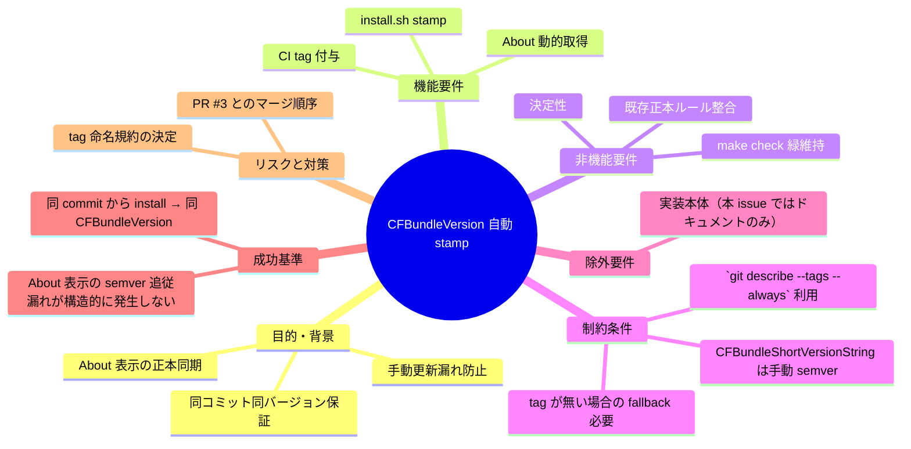
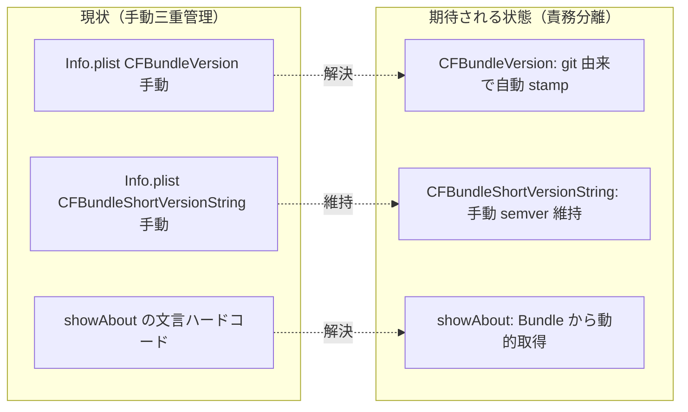

# 要求定義書: ビルド時バージョン自動 stamp（案 Y: CI tag + install.sh による CFBundleVersion 注入）

**プロジェクト名**: Mac Health Keeper / ビルド時バージョン自動 stamp
**作成日**: 2026 年 05 月 29 日
**最終更新**: 2026 年 05 月 29 日

> **重要**:
>
> - 本書はスコープが明瞭なため、必須項目のみ判定可能な形で記載する。
> - 採用方針は **案 Y**（CI が tag、`install.sh` が `git describe` で stamp）。Info.plist の `CFBundleVersion` をテンプレ値に置き換え、ビルド時に決定的注入する。
> - `CFBundleShortVersionString` は **semver の手動 bump** を維持し、正本ルール（`.agents/spec/04_仕様更新ルール.md`）と整合させる。

---

## 要求定義の全体像

---

## 1. 目的・背景

### 1.1 目的（必須）

ビルド時に `CFBundleVersion` を git 由来で自動 stamp し、手動更新漏れを構造的に解消する。

### 1.2 背景

- **現状の課題**:
  - `src/Info.plist` の `CFBundleVersion` と `CFBundleShortVersionString` を**手動の二重更新**しており、片方の追従漏れが起きうる。
  - `src/MacHealth.swift::showAbout` のアラート文言（例: `バージョン 1.3`）が Info.plist と独立したハードコードで、更新漏れリスクがある（PR #3 でこの問題が顕在化した）。
  - `CFBundleVersion` の意味（ビルド識別子）と `CFBundleShortVersionString` の意味（ユーザー向け semver）が混在し、責務が分かれていない。

- **必要性**:
  - 「同じ commit からは誰がいつ install しても同じ `CFBundleVersion` が得られる」という決定性を担保し、リリース後の問い合わせ時に commit を一意に逆引きできるようにしたい。
  - About 表示・docs・Info.plist の三重管理を整理し、AI / 人間どちらが触っても整合性が崩れない構造にしたい。

### 1.3 期待される効果（必須: 1 件以上）

- **効果 1**: 同一 commit から複数人が `./install.sh` を実行しても `defaults read .../Info CFBundleVersion` が一致する（○/× で判定可能）。
- **効果 2**: `CFBundleShortVersionString` を手動 bump するだけで About 表示も自動追従する（リテラル直書き 0 件で判定）。
- **効果 3**: main マージ時に CI（既存 `create-release.yaml`、`ubuntu-latest` runner）が tag を打ち、Release が公開され、その後ローカルで install.sh を実行した際の `git describe` 結果が当該 tag と一致する（○/× で判定可能）。**stamp は CI ではなく install.sh 経路（macOS ローカル）で実行**する。

**現状と期待される状態の比較**:

---

## 2. 機能要件

### 2.1 既存機能の維持

- `CFBundleShortVersionString` の手動 bump 運用（`.agents/spec/04_仕様更新ルール.md` の正本ルール）。
- 既存の `make build` / `make check` / `install.sh` / 既存 Release ワークフローの基本フロー。

### 2.2 新規機能要件

- **install.sh での stamp**: ビルド直前に `git describe --tags --always` 相当の値を**リポジトリ（`$REPO_DIR`）コンテキスト**で取得し、`plutil -replace CFBundleVersion -string "<derived>" <staged Info.plist>` で注入する。
  - 実装注意: `install.sh` は途中で `$INSTALL_DIR/src`（`.git` を含まないコピー先）へ `cd` するため、stamp スクリプト側で `git -C "$REPO_DIR" describe …` を使うか、`$REPO_DIR` を引数で受け取る形にする（02 §3.1.2 / 03 §2.2.2 で具体化）。
- **CI による自動 tag**: main マージ時に release tag を打つ（既存 `create-release.yaml` を**流用**。本 issue では拡張不要。`ubuntu-latest` runner のまま）。
- **About の動的取得**: `src/MacHealth.swift::showAbout` の `informativeText` 末尾行を `Bundle.main.infoDictionary["CFBundleShortVersionString"]` 経由の動的取得に変更し、fallback 文字列「不明」を持たせる。**`informativeText` 全体ではなく末尾「バージョン X.Y」行のみを置換**する最小差分とする。
- **Info.plist テンプレ値**: `CFBundleVersion` をテンプレ値 `0.0.0-DEV`（02 §10-3 推奨 B 案）に置き換える。

---

## 3. 非機能要件

### 3.1 パフォーマンス

- install.sh の追加コストは `git describe` 1 回 + `plutil -replace` 1 回。秒オーダーの遅延に収める。

### 3.2 セキュリティ

- 注入する文字列は `git describe` の出力のみ。任意入力を受け付けない。

### 3.3 互換性

- `CFBundleShortVersionString` の意味・運用を変更しない。Launch Services 等への影響を最小化する。

### 3.4 保守性

- 正本ルール（`.agents/spec/04_仕様更新ルール.md`）に「`CFBundleVersion` は git 由来 / `CFBundleShortVersionString` は手動 semver」の役割分離を明記し、AI / 人間が誤更新しないようにする。

---

## 4. 制約条件

### 4.1 技術的制約

- 既存 `Makefile` の `build:` ターゲットは `build/MacHealth` バイナリのみ生成し `.app` バンドルを組み立てない。したがって **`make build` 経路には stamp 対象（`Info.plist`）が存在せず、stamp は install.sh 経路のみ**で実施する。`make build` 経路の `.app` 化拡張は本 issue 範囲外。
- `plutil` は macOS 標準。**stamp は install.sh 経路（macOS ローカル / エンドユーザー端末）でのみ実行**する。CI（`create-release.yaml` = `ubuntu-latest`）では stamp を行わない。`check.yml` は `macos-latest` を維持（既存仕様）。

### 4.2 既存システムとの互換性

- 既存 `feature/20260529` (PR #3) では `Info.plist` を `1.3` に手動 bump 済み。本 issue 着手時は PR #3 とのマージ順序を判断する必要がある。

### 4.3 移行期間・スケジュール

- 本 issue は **ドキュメント作成のみ**。実装着手は別 issue / 別ブランチで実施。

---

## 5. 除外要件

- 本 issue では**実装を行わない**。00〜03 のドキュメント作成のみで停止する。
- iOS / macOS App Store 提出フロー（`CFBundleVersion` の整数性要求）は対象外。本アプリは LSUIElement 常駐の自家配布のため。
- 仕様書バージョン（`docs/README.md::更新履歴` の `vX.Y.Z`）の自動化は対象外（独立の概念）。

---

## 6. 成功基準（必須: 1 件以上）

- **基準 1**: 同一 commit から 2 回以上 `./install.sh` を実行し（2 回の間に作業ツリーへの変更を行わない）、生成 `.app` の `CFBundleVersion` が一致する。
- **基準 2**: `CFBundleShortVersionString` を手動 bump し、`./install.sh` 後、About アラート末尾「バージョン X.Y」が新しい semver を表示する（Swift リテラル追従更新が不要）。
- **基準 3**: tag が打たれた commit から install すると、`defaults read .../Info CFBundleVersion` が `git -C "$REPO_DIR" describe --tags --always` の値と一致する。
- **基準 4**: tag が無い commit から install すると、`defaults read .../Info CFBundleVersion` が `git -C "$REPO_DIR" describe --always` の fallback（短縮 SHA 等）と一致する。
- **基準 5**: `make check` が緑のまま維持される。
- **基準 6**: `.agents/spec/04_仕様更新ルール.md` の「`CFBundleVersion` / `CFBundleShortVersionString` の役割分離」が明文化される。

---

## 7. リスクと対策

### 7.1 技術的リスク

- **リスク**: tag 命名規約（semver タグ路線 `v1.3.0` か、既存 Release ワークフローの `vYYYYMMDD.HHMMSS` 日時タグか）が未確定。
  - **対策**: 02_設計 の「設計判断」でユーザー判断ポイントとして明示。既存 `create-release.yaml` は日時タグなので、整合性的には日時タグ路線が低コスト。

- **リスク**: install.sh 内で `cd "$INSTALL_DIR/src"` 後（`.git` 不在のコピー先）から `git describe` を呼ぶと「fatal: not a git repository」になる。
  - **対策**: stamp スクリプトでは `git -C "$REPO_DIR" describe …` を使うか、`$REPO_DIR` を引数化して常にリポジトリルートをコンテキストにする（02 §3.1.2）。

- **リスク**: tag が未存在の場合の fallback で短縮 SHA が `CFBundleVersion` に入ると、Launch Services がバージョン比較できない（文字列扱い）。
  - **対策**: 文字列扱いになる前提を 02 で明示。実用上は問題ない旨を記載。

- **リスク**: テンプレ値 `0.0.0-DEV` のまま誤って配布された場合、Launch Services の `CFBundleVersion` 比較順序で予期しない判定（既存版 `1.3` 等との比較順）が発生する可能性。
  - **対策**: テンプレ値は本来 stamp で必ず上書きされるため通常は表面化しない。万一の検知は About アラート / smoke test で「`0.0.0-DEV` が残っていれば警告」を確認する運用ガード（03 §2.8 smoke で網羅候補）。

### 7.2 スケジュールリスク

- **リスク**: PR #3 が未マージのうちに本 issue を main 直系で進めると、`Info.plist` の手動 `1.3` 値と本 issue のテンプレ値が衝突する。
  - **対策**: 本 issue の実装着手は PR #3 マージ後を推奨。判断はユーザーに委ねる。

---

## 8. 参考資料

### プロジェクトドキュメント

- [.agents/spec/04_仕様更新ルール.md](../../.agents/spec/04_仕様更新ルール.md) — 正本ルール
- [.agents/spec/05_契約変更ルール.md](../../.agents/spec/05_契約変更ルール.md) — 契約変更ルール（CI workflow 拡張が該当）
- 既存 issue: `.workflow/close/20260529_083530_メトリクス非表示修正/` — PR #3 の経緯

### その他の参考資料

- Apple Developer: `CFBundleVersion` / `CFBundleShortVersionString` の仕様
- `git-describe(1)` man page

---

## 9. 次のステップ

この要求定義書の承認後、以下のドキュメントを作成します：

- **次**: [`01_要件定義.md`](./01_要件定義.md) - 要件定義フェーズ
