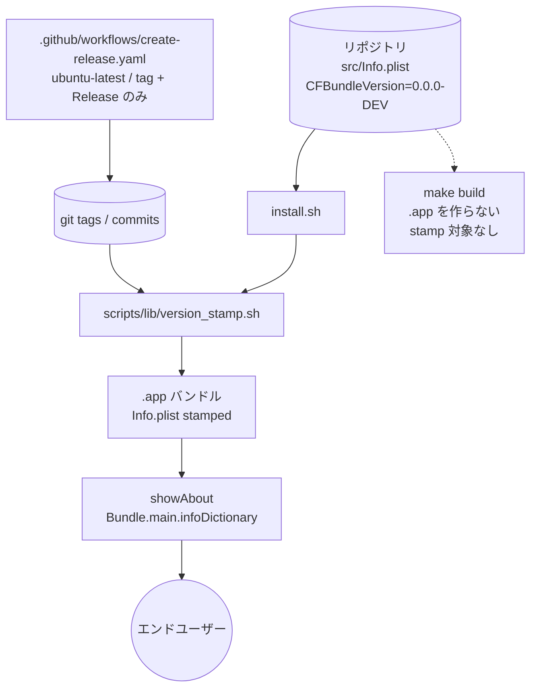
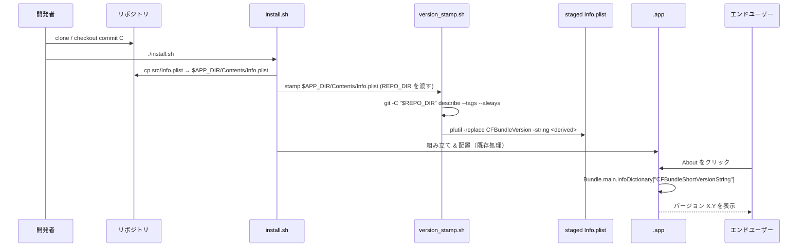

# 設計書: ビルド時バージョン自動 stamp

**プロジェクト名**: Mac Health Keeper / ビルド時バージョン自動 stamp
**作成日**: 2026 年 05 月 29 日
**最終更新**: 2026 年 05 月 29 日

> **重要**: 本設計書は **scope が明瞭**な保守機能改善のため、データ設計・UI 遷移など本機能と関係しない章は意図的に簡略化する。
>
> **用語**: [.agents/CONCEPTS.md §用語規約](../../.agents/CONCEPTS.md#用語規約) を参照。

---

## 1. 設計概要

[.agents/spec/01_設計原則.md](../../.agents/spec/01_設計原則.md) を参照した上で適用する原則を選定する。

### 1.1 設計方針

ビルド成果物 `.app` の `CFBundleVersion` を、git 由来の決定的な文字列でビルド時に注入する（stamp）。`CFBundleShortVersionString` は手動 semver の正本のまま維持し、Swift コードからは `Bundle.main.infoDictionary` 経由でのみ参照する。stamp ロジックは単一スクリプトに集約し、`install.sh` から呼び出す（**現行 `Makefile` の `build:` ターゲットは `.app` を作らないため stamp 対象が無く、本 issue では Makefile 経路に stamp を組み込まない**）。

> 用語: 本書では「stamp」「注入」「打刻」を同義で扱う（01 §1.2 用語集の `stamp` を正本とする）。

### 1.2 設計原則（本プロジェクトで適用するもの）

- **UNIX 哲学**: 「stamp ロジック」を 1 つの小さなスクリプト（`scripts/lib/version_stamp.sh`）として切り出し、`install.sh` から呼び出す形にする（`Makefile` は本 issue では呼ばない。理由は §1.1）。
- **単一責務**: stamp ロジックは 1 ファイル 1 責務（`git describe` の取得と `plutil -replace` の実行のみ）。tag 付与は CI、Info.plist の手動 semver は人間、Swift 表示は動的取得、と責務を完全分離する。
- **明確な境界**: 「正本（Info.plist の semver）」「ビルド時補完（git 由来の `CFBundleVersion`）」「ランタイム参照（Bundle 経由）」の 3 境界を分ける。
- **AI フレンドリー設計**: 「`CFBundleVersion` は git 由来 / `CFBundleShortVersionString` は手動 semver」をルール文書（`.agents/spec/04_仕様更新ルール.md`）に明文化し、AI が誤って `CFBundleVersion` を手動 bump しないようにする。

---

## 2. アーキテクチャ設計

### 2.1 責務・境界・参照関係

#### 2.1.1 責務一覧

| コンポーネント | 責務（1 文） |
| --- | --- |
| `src/Info.plist` | semver 正本（`CFBundleShortVersionString`）を保持する。`CFBundleVersion` はテンプレ値 `0.0.0-DEV` のみ。 |
| `scripts/lib/version_stamp.sh`（新規） | `git -C "$REPO_DIR" describe --tags --always` の結果を取得し、引数で受けた plist パスに `plutil -replace CFBundleVersion` する。**`REPO_DIR` は第 2 引数または環境変数で受け取り、cwd に依存しない**。 |
| `install.sh` | `.app` 組立直後、配置済みの `$APP_DIR/Contents/Info.plist` に対し `version_stamp.sh` を呼び出して stamp する。 |
| `Makefile`（`make build`） | 現行は `build/MacHealth` バイナリのみ生成し `.app` を作らないため、**本 issue では stamp 経路を組み込まない**（経路差は構造的に発生しない）。 |
| `src/MacHealth.swift::showAbout` | `informativeText` 末尾 1 行のみを `Bundle.main.infoDictionary["CFBundleShortVersionString"]` から動的取得し「バージョン X.Y」を表示する（残りの文言は不変）。 |
| `.github/workflows/create-release.yaml` | 既存。`ubuntu-latest` runner で main push 時に `v$(TZ=Asia/Tokyo date +%Y%m%d.%H%M%S)` 形式の日時タグを `git push` し、`gh release create --generate-notes` を実行する。**stamp は CI では行わない**（A 案: 本 issue では変更不要）。 |
| `.github/workflows/check.yml` | 既存。`macos-latest` runner で `make check` を実行（本 issue で参照のみ。stamp は無関係）。 |
| `.agents/spec/04_仕様更新ルール.md` | `CFBundleVersion` と `CFBundleShortVersionString` の役割分離を明文化する。 |

#### 2.1.2 境界

- **入力**: ビルド時の git 作業ツリー状態（commit / tag）と `src/Info.plist` の現在値。
- **出力**: `.app/Contents/Info.plist` の `CFBundleVersion` キーに stamp された値、および About アラートの表示文字列。
- **他責務との境界**:
  - `CFBundleShortVersionString` の bump は本 issue の対象外（人間判断）。
  - 仕様書バージョン（`docs/README.md::更新履歴` の `vX.Y.Z`）は独立の概念で本 issue の対象外。
  - App Store 提出フローの整数 `CFBundleVersion` 要求は対象外（自家配布のため）。

#### 2.1.3 参照関係

```
install.sh ──> scripts/lib/version_stamp.sh ──> plutil ──> staged Info.plist
                          │
                          └──> git -C "$REPO_DIR" describe --tags --always

src/MacHealth.swift::showAbout ──> Bundle.main.infoDictionary ──> CFBundleShortVersionString

.github/workflows/create-release.yaml (ubuntu-latest) ──> git tag (push) ──> gh release create --generate-notes
```

- 循環参照なし。
- `version_stamp.sh` は唯一の stamp 実装で、**`install.sh` のみから呼ばれる**（`make build` は `.app` を作らないため呼ばない）。
- CI（`create-release.yaml`）は stamp を行わず、tag と Release の発行のみを行う（本 issue 範囲では `ubuntu-latest` のまま流用）。

### 2.2 システムアーキテクチャ

- **採用パターン**: ビルドパイプライン拡張（既存 `install.sh` の `.app` 組立直後に stamp ロジックを差し込む）。`Makefile build:` は `.app` を作らないため stamp 経路に含めない。GitHub Actions の `create-release.yaml`（`ubuntu-latest`）は tag/Release 発行のみで、stamp は CI で行わない（`ubuntu-latest` には `plutil` が無いため CI で stamp する必要がない）。
- **根拠**: [01_設計原則.md](../../.agents/spec/01_設計原則.md) の「単一責務」「明確な境界」に従い、最小差分で「正本 vs 自動生成」の境界を切る。

#### 2.2.2 アーキテクチャ図



> 補足: `make build` から stamp への矢印は引かない。`Makefile build:` は `build/MacHealth` バイナリ生成のみで `.app` を作らないため、`Info.plist` を持たず stamp 対象が無い。

### 2.3 コンポーネント構成

- **stamp ロジック層**: `scripts/lib/version_stamp.sh`（新規・shellcheck 対象）。
- **ビルド経路層**: `install.sh` から stamp ロジックを呼び出す。`Makefile build:` は `.app` を作らないため stamp 経路に含めない（本 issue 範囲外）。
- **ランタイム層**: `src/MacHealth.swift::showAbout` および `Sources/MacHealthKit/Version.swift`（新規・純粋関数 `formatAboutVersionLine(_:)` を提供）。Bundle 動的取得 + fallback。
- **CI 層**: `.github/workflows/create-release.yaml`（既存・`ubuntu-latest`）の tag 付与・Release 発行のみ。stamp は CI で行わない。
- **正本ルール層**: `.agents/spec/04_仕様更新ルール.md` に役割分離を追記。

### 2.4 データフロー



**Command/Query 分離の観点**:
- Command: `version_stamp.sh`（staged plist を変更する副作用）。
- Query: `Bundle.main.infoDictionary` 参照（読み取りのみ）。

---

## 3. 機能設計

### 3.1 機能 1: stamp ロジック（version_stamp.sh）

#### 3.1.1 概要

`git -C "$REPO_DIR" describe --tags --always` の結果を取得し、引数で受けた plist パスの `CFBundleVersion` キーに `plutil -replace` で注入する。`--dirty` は付けない（決定性確保）。

#### 3.1.2 処理フロー

```mermaid
flowchart TD
    Start([開始]) --> Args[引数: plist パス, REPO_DIR]
    Args --> InGit{REPO_DIR が git リポジトリ?}
    InGit -->|YES| Describe[git -C $REPO_DIR describe --tags --always]
    InGit -->|NO| FallbackUnknown[fallback: "unknown"]
    Describe --> NonEmpty{結果が空でない?}
    NonEmpty -->|YES| Plutil[plutil -replace CFBundleVersion]
    NonEmpty -->|NO| FallbackUnknown
    FallbackUnknown --> Plutil
    Plutil --> End([終了])
```

#### 3.1.3 入力・出力

- **入力**:
  - 第 1 引数 = stamp 対象の plist パス（必須）。
  - 第 2 引数 または環境変数 `REPO_DIR` = git リポジトリのルート（必須。`install.sh` の `$REPO_DIR` 変数をそのまま渡す）。
- **出力**: stamp された plist（副作用）。標準出力には注入した値を 1 行で出す（ログ用）。
- **終了コード**: 成功 0 / 引数不足 2 / plutil 失敗 1。
- **`git describe` フラグ**: `--tags --always`。`--dirty` は使わない（dirty 検出はビルドメタデータでスコープ外）。

#### 3.1.4 エラーハンドリング

- 引数欠落 → usage を stderr に出して終了コード 2。
- `git describe` が失敗 → `unknown` を fallback として注入し、警告を stderr に出して終了コード 0（ビルド継続）。
- `plutil -replace` 失敗 → stderr にエラーを出力し終了コード 1。

### 3.2 機能 2: install.sh 統合（Makefile は本 issue では非対象）

#### 3.2.1 概要

`install.sh` から `version_stamp.sh` を呼び出す。`src/Info.plist` のリポジトリ実体は書き換えず、`$APP_DIR/Contents/Info.plist`（コピー後の配置先）に対してのみ stamp する。`Makefile build:` は `.app` を作らないため本 issue では呼び出さない（経路差は構造的に発生しない）。

#### 3.2.2 処理フロー

1. `cp -R src/. $INSTALL_DIR/src/` で staging へコピー（既存処理）。
2. `swiftc` で MacHealth バイナリを生成（既存処理）。
3. `.app/Contents/` に `Info.plist` をコピー（既存処理）。
4. **新規**: `bash "$REPO_DIR/scripts/lib/version_stamp.sh" "$APP_DIR/Contents/Info.plist" "$REPO_DIR"` を呼ぶ。`$REPO_DIR` を明示的に渡すことで、cwd が `$INSTALL_DIR/src`（`.git` 不在）であっても `git describe` が正しく動く。
5. （以後の launchctl 等は既存通り）。

### 3.3 機能 3: About 動的取得

#### 3.3.1 概要

`src/MacHealth.swift::showAbout` の `informativeText` 末尾「バージョン 1.3」**1 行のみ**を、Bundle 経由の動的取得に置き換える（他の行は完全に不変）。fallback 文字列を持たせる。純粋関数 `formatAboutVersionLine(_ shortVersion: String?) -> String` を `Sources/MacHealthKit/Version.swift`（新規）に置き、`MacHealthCheck` から useCase 1 つで 3 シナリオ（正常 / nil / 空文字）を網羅する。

#### 3.3.2 入力・出力

- **入力**: `Bundle.main.infoDictionary["CFBundleShortVersionString"]`（`as? String` で安全にキャスト）。
- **出力**: `informativeText` 末尾「バージョン X.Y」または「バージョン 不明」の 1 行。残りの informativeText（再起動なしで…、• メモリ…等の本文）はリテラルのまま変更しない。
- **fallback**: 取得失敗時は `"不明"` を表示し、アプリはクラッシュしない。

### 3.4 機能 4: CI による自動 tag

#### 3.4.1 概要

既存 `.github/workflows/create-release.yaml`（**`ubuntu-latest` runner / `actions/checkout@v4` / `git tag` → `git push` → `gh release create --generate-notes`**）は、main push で `v$(TZ=Asia/Tokyo date '+%Y%m%d.%H%M%S')` の日時タグを打って Release を作っている。本 issue では **A 案（流用）を採用**し、ワークフロー自体は変更しない。stamp は CI ではなく install.sh 経路で実行する設計（plutil は macOS 標準のため `ubuntu-latest` では実行できないが、CI で stamp する必要が無いため問題にならない）。

- **A 案（流用・採用）**: 既存日時タグをそのまま `git describe --tags` 経由で `CFBundleVersion` に入る運用にする。追加 CI 変更なし。
- **B 案（拡張）**: semver タグ（`v1.3.0` 等）を CI で打つよう切り替える。`PlistBuddy -c "Print :CFBundleShortVersionString" src/Info.plist` 等で `CFBundleShortVersionString` 値から tag 名を導出する step を追加。**本 issue では採用しない（別 issue で B 案へ移行）**。

---

## 4. データ設計

本 issue はビルドメタデータの注入のみのため、データモデル変更なし。

---

## 5. API 設計

外部 API 変更なし。GitHub Actions ワークフローの変更が「契約変更」相当（[.agents/spec/05_契約変更ルール.md](../../.agents/spec/05_契約変更ルール.md)）であり、tag 命名規約を変える場合は CHANGELOG / ルール文書への反映を行う。

---

## 6. テスト戦略

[.agents/RULES.md §テスト戦略必須要件](../../.agents/RULES.md#テスト戦略必須要件) と [.agents/TEST_BDD_FORMAT.md](../../.agents/TEST_BDD_FORMAT.md) に従う。

### 6.1 対象ごとのテスト割り当て

| 対象 | 単体 | 結合/API | E2E | クリティカル観点 | バリデーション観点 | 未達理由/補足 |
| --- | --- | --- | --- | --- | --- | --- |
| `scripts/lib/version_stamp.sh` | ○ | ○ | ○ | git describe 不在時の fallback / plutil 失敗時の終了コード | 引数欠落 → usage / 非 git 環境 / REPO_DIR 不正 | 既存 `scripts/test/` の bash assert 形式（`*_test.sh`）で実装し、`Makefile` `test-shell` ターゲットのフォールバック配列にも追加する |
| `install.sh` への組み込み | × | ○ | ○ | install 後の `.app` から `defaults read` で値が一致 | install.sh 経路の cwd 変化下でも `git -C "$REPO_DIR"` が機能する | smoke test を `scripts/test/install_version_stamp_smoke_test.sh` として追加し、`Makefile` `test-shell` フォールバック配列に追加 |
| `src/MacHealth.swift::showAbout` 動的取得 | ○ | × | × | 純粋関数 `formatAboutVersionLine` の正常系 / nil / 空文字 fallback | infoDictionary が空（nil 返す）の場合は手動確認に倒す（Bundle.main 副作用は単体テスト対象外） | 純粋関数を `Sources/MacHealthKit/Version.swift`（新規）に切り出し、`Sources/MacHealthCheck/main.swift` に useCase 1 件・scenario 3 件を追加して網羅 |
| `.github/workflows/create-release.yaml` 流用確認 | × | × | ○ | main マージ → tag push → Release 作成 | 不在 secrets 時の挙動（権限エラー） | 既存ワークフローの実走確認のみ（本 issue ではワークフロー変更なし） |

### 6.2 監査・レビューでの確認

- `make check` 緑（shellcheck / build / 既存テスト）。
- 上記割当表と 03_実装計画 §2.x.3 / §2.x.4 が整合していること。

---

## 7. UI 設計

About アラートの末尾行「バージョン X.Y」のソースが Info.plist 動的取得に切り替わる。表示文言は不変。

---

## 8. セキュリティ設計

- stamp 対象は staged Info.plist に限定し、`src/Info.plist` のリポジトリ実体は書き換えない。
- `git describe` 出力以外の入力は受け付けない。
- CI tag 付与は既存 `GITHUB_TOKEN` の `contents: write` 権限内で実施。

---

## 9. 非機能要件への対応

### 9.1 パフォーマンス

- `git describe` 1 回 + `plutil -replace` 1 回。追加コストは秒オーダーに収まる。

### 9.2 可用性

- tag 不在 commit / 非 git 環境でも `unknown` fallback でビルド継続する。

---

## 10. 設計判断（ユーザー判断ポイント）

本設計には次の判断ポイントが残存する。実装着手前にユーザーで決定すること。

1. **`git describe --tags --always` vs `git rev-list --count`**:
   - `git describe` 採用根拠: tag が打たれた commit では tag 名そのままが入り、人間可読 / 逆引き容易。tag 不在時も短縮 SHA が入り決定性が保たれる。
   - `rev-list --count` 案は単調増加の整数（例: 142）が得られるが、commit ハッシュへの逆引きが別途必要。
   - **推奨**: `git describe --tags --always`。
2. **tag 命名規約**:
   - A 案: 既存日時タグ `vYYYYMMDD.HHMMSS` をそのまま使用（既存 CI workflow と完全整合・追加変更ゼロ）。
   - B 案: semver タグ `v1.3.0` に切り替え（`CFBundleShortVersionString` と同値が CFBundleVersion に入る）。CI に semver 抽出 step が必要。
   - **未確定**: ユーザー判断。
3. **Info.plist テンプレ値**:
   - A 案: `0` のような最小値。
   - B 案: `0.0.0-DEV` のような明示的 placeholder。
   - C 案: 開発中ビルド時にも stamp する設計とし、テンプレ値は実質使われないことを明示。
   - **推奨**: B 案（`0.0.0-DEV`）。理由はテンプレ値のまま配布された場合に異常を即座に検知できるため。
   - **Launch Services への留意**: `CFBundleVersion` は文字列比較されるため、`0.0.0-DEV` が既存版（例: `1.3`）より「新しい」と誤判定される可能性が理論上ある。実運用では本 issue 採用後に手動配布される `.app` は必ず stamp 済みになるためテンプレ値の表面化は通常起きないが、smoke で「`0.0.0-DEV` が残っていれば fail」とするガードを `scripts/test/install_version_stamp_smoke_test.sh` で実装するのが望ましい（03 §2.8 で具体化）。
4. **ローカル `make build` 経路**:
   - 現行 `Makefile build:` は `build/MacHealth` バイナリのみ生成し `.app` を作らないため、**stamp 対象が存在しない**。本 issue では Makefile 側に stamp を組み込まない（経路差は構造的に発生しない）。
   - `make build` から `.app` まで作るよう拡張する場合は別 issue で対応（拡張時は本設計の `version_stamp.sh` を再利用すればよい）。
5. **About 動的取得失敗時の fallback**:
   - 推奨: `"不明"`。アプリはクラッシュさせない。
6. **CI ワークフロー拡張可否（既存日時タグ路線の維持 / semver タグ路線への切替）**:
   - 既存日時タグ路線維持（A 案）で十分との立場（推奨・採用）。semver タグが必要になった時点で別 issue で B 案へ移行。
   - **CI checkout の `fetch-depth`**: 本 issue では CI で `git describe` を呼ばないため、`actions/checkout@v4` の既定（`fetch-depth: 1`）のままで影響なし。将来 B 案で CI 側 stamp を行う場合は `fetch-depth: 0` を要設定（別 issue）。
   - **ローカル install.sh 経路**: ユーザーが `git clone <repo>` した直後の状態（全 tag 取得済み）を前提する。浅 clone（`--depth=1`）の場合は `git describe --tags` が tag を見つけない可能性があるが、開発者の運用前提としては通常想定しない（README で言及してもよい）。

---

## 11. 前のステップ

- **前**: [`01_要件定義.md`](./01_要件定義.md)

---

## 12. 次のステップ

- **次**: [`03_実装計画.md`](./03_実装計画.md)
