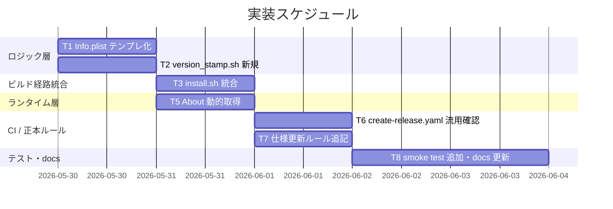

# 実装計画書: ビルド時バージョン自動 stamp

**プロジェクト名**: Mac Health Keeper / ビルド時バージョン自動 stamp
**作成日**: 2026 年 05 月 29 日
**最終更新**: 2026 年 05 月 29 日

> **重要**: 本書は実装着手前のタスク分解。実装は別 issue / 別ブランチで行う想定で、本 issue ではドキュメント整備までで停止する。
>
> **用語**: [.agents/CONCEPTS.md §用語規約](../../.agents/CONCEPTS.md#用語規約) を参照。

---

## 1. 実装概要

### 1.1 実装方針（必須）

stamp ロジックを 1 つの shell スクリプト `scripts/lib/version_stamp.sh` に集約し、`install.sh` から呼び出す（**現行 `Makefile build:` は `.app` を作らないため Makefile 側からは呼ばない**）。Swift 側は About アラートのバージョン取得を Bundle 動的化に切り替え、fallback を持たせる。正本ルール（`.agents/spec/04_仕様更新ルール.md`）に `CFBundleVersion`（git 由来）と `CFBundleShortVersionString`（手動 semver）の役割分離を明記する。CI（`create-release.yaml`）は既存のまま変更しない（A 案採用）。

### 1.2 実装順序（必須: 1 件以上）



> T4（旧「Makefile build 統合」）は本 issue 範囲外として削除（`make build` は `.app` を作らず stamp 対象なし）。Makefile から `.app` を作る拡張は別 issue とする。
> T1 と T2 は並列実行可能（T2 は引数で受けた任意 plist を stamp するため、T1 完了前でも単体テストできる）。

---

## 2. タスク分解

### 2.1 タスク 1: `src/Info.plist` テンプレ化 [完了]

#### 2.1.1 概要

`src/Info.plist` の `CFBundleVersion` を `0.0.0-DEV` のテンプレ値に置き換え、`CFBundleShortVersionString` は手動 semver の現行値を維持する。

#### 2.1.2 実装内容

- `src/Info.plist::CFBundleVersion` を `0.0.0-DEV`（02_設計 §10 推奨）に変更。
- `src/Info.plist::CFBundleShortVersionString` は現行 semver（PR #3 マージ後の値）をそのまま。

#### 2.1.3 テスト観点

##### 単体
- Info.plist の plist 構造が壊れていないこと（`plutil -lint src/Info.plist` 成功）。
- `CFBundleShortVersionString` の値が変更されていないこと（regression）。

##### 結合/API
- 該当なし。

##### E2E/受け入れ
- 該当なし（後続タスクの統合 smoke で検証）。

##### バリデーション
- `plutil -lint` 成功。

#### 2.1.4 単体テスト仕様（BDD）

```gherkin
Feature: Info.plist テンプレ化
  Scenario: CFBundleVersion がテンプレ値に置換される
    Given src/Info.plist の現在値が "1.3"
    When  CFBundleVersion を "0.0.0-DEV" に変更する
    Then  plutil -lint src/Info.plist が成功する
    And   CFBundleShortVersionString が変更されていない
```

```bash
# Given: src/Info.plist のテンプレ化後
# When: plutil -lint を実行
# Then: 0 終了
plutil -lint src/Info.plist
test "$(/usr/libexec/PlistBuddy -c 'Print :CFBundleVersion' src/Info.plist)" = "0.0.0-DEV"
```

#### 2.1.5 依存関係
- 依存タスク: なし（先頭）。

#### 2.1.6 見積もり
- 工数: 0.5h / 優先度: 高

---

### 2.2 タスク 2: `scripts/lib/version_stamp.sh` 新規 [完了]

#### 2.2.1 概要

`git describe --tags --always` を取得し、引数で受けた plist パスに `plutil -replace CFBundleVersion -string <derived>` を実行する単一責務シェルスクリプトを追加する。

#### 2.2.2 実装内容

- `scripts/lib/version_stamp.sh` を新規作成（実行権限付与）。
- 引数:
  - `$1` = stamp 対象 plist パス（必須）。
  - `$2` または環境変数 `REPO_DIR` = git リポジトリのルート（必須。`install.sh` 側から `"$REPO_DIR"` を渡す）。
- 動作: `set -euo pipefail` / 引数欠落で usage 表示 → 終了コード 2 / `git -C "$REPO_DIR" describe --tags --always`（`--dirty` は付けない）取得 / 取得失敗時は `unknown` fallback / `plutil -replace CFBundleVersion -string` を実行。
- 注入した値を stdout に 1 行出す（ログ用）。

#### 2.2.3 テスト観点

##### 単体
- tag 直上 commit で `git -C "$REPO_DIR" describe --tags` の出力が CFBundleVersion に入る。
- tag 不在環境で `git describe --always` の短縮 SHA が入る。
- 非 git 環境（`REPO_DIR` が `.git` を含まない）で `unknown` fallback が入る。
- 引数欠落 → 終了コード 2 / usage 表示。
- 無効な plist パス → 終了コード 1。

##### 結合/API
- `install.sh` 経路から呼び出した際に、`$APP_DIR/Contents/Info.plist` が正しく更新される（cwd が `$INSTALL_DIR/src`（`.git` 不在）でも `git -C "$REPO_DIR"` 経由で値が取れる）。

##### E2E/受け入れ
- 該当なし（タスク 3 で実施）。

##### バリデーション
- shellcheck で警告ゼロ。
- `make check` 緑。
- `Makefile` `test-shell` のフォールバック配列に新規スクリプト（`scripts/test/version_stamp_test.sh`）を追加する step を実装内容に含めること（既存の `monitor_test.sh` / `metrics_test.sh` / `log_rotate_test.sh` / `install_metrics_smoke_test.sh` 配列に追加）。bats 経路は `bats scripts/test/` 一括実行なので追加作業不要。

#### 2.2.4 単体テスト仕様（BDD）

```gherkin
Feature: version_stamp.sh
  Scenario: tag が打たれた commit で stamp する
    Given 作業ツリーが commit C にチェックアウトされており tag T が C に存在する
    And   テンポラリの Info.plist コピーが存在する
    When  scripts/lib/version_stamp.sh <tmp plist> を実行する
    Then  終了コードが 0 である
    And   tmp plist の CFBundleVersion が T と一致する

  Scenario: tag 不在 commit での fallback
    Given 作業ツリーに到達可能な tag が存在しない
    When  scripts/lib/version_stamp.sh <tmp plist> を実行する
    Then  tmp plist の CFBundleVersion が `git describe --always` 出力（短縮 SHA）と一致する
    And   CFBundleVersion が空文字列ではない

  Scenario: 引数欠落
    When  scripts/lib/version_stamp.sh を引数なしで実行する
    Then  終了コードが 2 である
    And   stderr に usage が出力される
```

```bash
# Given: テンポラリ plist と git リポジトリ準備
tmp=$(mktemp)
cp src/Info.plist "$tmp"
REPO_DIR=$(git rev-parse --show-toplevel)

# When: stamp 実行（REPO_DIR を明示）
out=$(scripts/lib/version_stamp.sh "$tmp" "$REPO_DIR")

# Then: 一致確認
expected=$(git -C "$REPO_DIR" describe --tags --always)
actual=$(/usr/libexec/PlistBuddy -c 'Print :CFBundleVersion' "$tmp")
test "$actual" = "$expected"
```

#### 2.2.5 依存関係
- 依存タスク: なし（T1 と並列実行可能。本タスクは引数で受けた任意 plist を stamp するため、テンプレ化済み Info.plist の存在に依存しない）。

#### 2.2.6 見積もり
- 工数: 2h / 優先度: 高

---

### 2.3 タスク 3: `install.sh` への統合 [完了]

#### 2.3.1 概要

`install.sh` の `.app` 組立ステップ直後に `version_stamp.sh` 呼び出しを追加し、配置済み `$APP_DIR/Contents/Info.plist` を stamp する。

#### 2.3.2 実装内容

- `install.sh` の「`cp Info.plist "$APP_DIR/Contents/"`」の直後に
  `bash "$REPO_DIR/scripts/lib/version_stamp.sh" "$APP_DIR/Contents/Info.plist" "$REPO_DIR"`
  を追加（`$REPO_DIR` は install.sh 冒頭で定義済みの絶対パス）。
- ログメッセージで stamp された値を表示。
- 補足: install.sh は途中で `cd "$INSTALL_DIR/src"` するため、stamp 呼び出し位置の cwd は `.git` 不在のディレクトリになる。第 2 引数で `$REPO_DIR` を必ず渡すこと（02 §3.2.2 で明示）。

#### 2.3.3 テスト観点

##### 単体
- 該当なし（統合タスク）。

##### 結合/API
- `install.sh` 実行後、`$APP_DIR/Contents/Info.plist` の `CFBundleVersion` が `git describe --tags --always` と一致する。

##### E2E/受け入れ
- ユーザーが `./install.sh` を 2 回連続実行し、両回の `defaults read .../Contents/Info CFBundleVersion` が一致する。

##### バリデーション
- shellcheck で `install.sh` の追加部に警告なし。

#### 2.3.4 単体テスト仕様（BDD）

```gherkin
Feature: install.sh 統合
  Scenario: install 後の CFBundleVersion が git describe と一致する
    Given リポジトリが commit C にチェックアウトされている
    When  ./install.sh を実行する
    Then  ~/Applications/MacHealth.app/Contents/Info.plist の CFBundleVersion が `git describe --tags --always` の出力と一致する
```

```bash
# Given/When: install 実行
./install.sh

# Then: 値一致確認
REPO_DIR=$(git rev-parse --show-toplevel)
expected=$(git -C "$REPO_DIR" describe --tags --always)
actual=$(defaults read "$HOME/Applications/MacHealth.app/Contents/Info" CFBundleVersion)
test "$actual" = "$expected"
```

#### 2.3.5 依存関係
- 依存タスク: T2。

#### 2.3.6 見積もり
- 工数: 1h / 優先度: 高

---

### 2.4 タスク 4: 削除（旧「Makefile build 統合」）

> 旧「`Makefile build` 統合」タスクは、現行 `Makefile build:` が `.app` を作らないため stamp 対象が存在しないことから、本 issue 範囲外として **削除**。
> `make build` から `.app` を作る拡張は別 issue で対応すること（その際は `version_stamp.sh` を再利用すればよい）。
> タスク番号は欠番扱い（T4 = 欠番、T5 以降は番号据え置き）。

---

### 2.5 タスク 5: `src/MacHealth.swift::showAbout` 動的取得 [完了]

#### 2.5.1 概要

About アラートのバージョン表記を `Bundle.main.infoDictionary["CFBundleShortVersionString"]` 経由の動的取得に置き換え、fallback `"不明"` を持たせる。

#### 2.5.2 実装内容

- `showAbout` 内の `informativeText` 末尾「バージョン 1.3」**1 行のみ**を、純粋関数 `formatAboutVersionLine(...)` の戻り値で置換する。**残りの informativeText（再起動なしで…、• メモリ…、• Dockerアイドル…、• 長期稼働の通知…、• アプリ自動再起動…）はリテラルのまま変更しない**（最小差分）。
- ロジックを純粋関数として `Sources/MacHealthKit/Version.swift`（新規）に切り出す（テスト容易化）。
  - シグネチャ: `public func formatAboutVersionLine(_ shortVersion: String?) -> String`
  - 仕様: nil または空文字列なら `"バージョン 不明"` を返す。値があれば `"バージョン \(shortVersion!)"` を返す。
- `showAbout` は切り出した関数を使い、`Bundle.main.infoDictionary?["CFBundleShortVersionString"] as? String` を渡す。
- `Package.swift` の `MacHealthKit` ターゲットは `path: "Sources/MacHealthKit"` で全 `.swift` を自動収集するため、ターゲット定義の変更は不要（Package.swift 修正は無い）。
- `install.sh` の `swiftc` 行に `"$REPO_DIR/Sources/MacHealthKit/Version.swift"` を追加する。`Makefile` `build:` ターゲットの swiftc 行にも同ファイルを追加する（コンパイル対象に含めるため）。

#### 2.5.3 テスト観点

##### 単体
- `formatAboutVersionLine("1.3")` → `"バージョン 1.3"`。
- `formatAboutVersionLine(nil)` → `"バージョン 不明"`。
- `formatAboutVersionLine("")` → `"バージョン 不明"`。
- 実装先: `Sources/MacHealthCheck/main.swift` に useCase 1 つ・scenario 3 つ追加（既存のメトリクス系 useCase と同じ形式）。

##### 結合/API
- 該当なし（`Bundle.main.infoDictionary` 自体は副作用付きで XCTest / MacHealthCheck では直接スタブできないため、純粋関数経路のみ単体テスト対象）。

##### E2E/受け入れ
- Info.plist の `CFBundleShortVersionString` を変更すると About アラート末尾が追従する（手動確認）。
- `Bundle.main.infoDictionary` が nil を返す状況は手動確認に倒す（01 UC4 シナリオ 2 補足参照）。

##### バリデーション
- swift build / 既存 swift test スイートが緑。
- `swift run MacHealthCheck` が緑（pure-core 経路に新 useCase が追加されていることを確認）。

#### 2.5.4 単体テスト仕様（BDD）

```gherkin
Feature: About 動的取得
  Scenario: semver が取得できれば「バージョン X.Y」を返す
    Given Info.plist の CFBundleShortVersionString が "1.3"
    When  formatAboutVersionLine("1.3") を呼ぶ
    Then  "バージョン 1.3" を返す

  Scenario: nil の場合は fallback を返す
    When  formatAboutVersionLine(nil) を呼ぶ
    Then  "バージョン 不明" を返す
```

```swift
// Given: バージョン文字列が "1.3"
// When: formatAboutVersionLine を呼ぶ
// Then: "バージョン 1.3" を返す
XCTAssertEqual(formatAboutVersionLine("1.3"), "バージョン 1.3")

// Given: nil
// When: 呼ぶ
// Then: fallback
XCTAssertEqual(formatAboutVersionLine(nil), "バージョン 不明")
XCTAssertEqual(formatAboutVersionLine(""), "バージョン 不明")
```

#### 2.5.5 依存関係
- 依存タスク: T1（テンプレ化後の正本 semver が `CFBundleShortVersionString` に維持されていること）。

#### 2.5.6 見積もり
- 工数: 1.5h / 優先度: 高

---

### 2.6 タスク 6: `.github/workflows/create-release.yaml` 流用確認 [完了]

#### 2.6.1 概要

既存 `create-release.yaml`（**`ubuntu-latest` runner で main push 時に `v$(TZ=Asia/Tokyo date +%Y%m%d.%H%M%S)` 日時タグを打って Release を作成**）の流用で十分か確認する。02_設計 §10 のユーザー判断ポイントで **A 案（流用）を採用**するため、本タスクは確認のみで実装変更なし。B 案（semver タグ）は別 issue 推奨。

#### 2.6.2 実装内容

- **A 案（採用）**: 既存ワークフローを変更しない。本タスクは「main マージ → tag push → Release 公開」の動作確認のみ。
- **B 案（本 issue 範囲外・別 issue 推奨）**: `PlistBuddy -c "Print :CFBundleShortVersionString" src/Info.plist` で `CFBundleShortVersionString` 値を取得して tag 名（例: `v1.3.0`）を生成する step を追加。本 issue では実装しない。
- CI 上で `git describe` を呼ばないため `actions/checkout@v4` の `fetch-depth` は既定（`1`）のままで影響なし。

#### 2.6.3 テスト観点

##### 単体
- 該当なし。

##### 結合/API
- 該当なし。

##### E2E/受け入れ
- main マージで tag が push される、Release が公開される。

##### バリデーション
- YAML 構文エラーなし（actionlint 等）。

#### 2.6.4 単体テスト仕様（BDD）

```gherkin
Feature: CI 自動 tag
  Scenario: main マージで tag が打たれ Release が公開される
    Given feature ブランチが main にマージされた
    When  create-release ワークフローが起動する
    Then  新しい tag が origin に push される
    And   GitHub Release が公開される
```

#### 2.6.5 依存関係
- 依存タスク: T3（install.sh 経路の stamp が動作することが前提）。T2 / T5 と並列可能。T4 は欠番のため依存なし。

#### 2.6.6 見積もり
- 工数: 1h（A 案）/ 4h（B 案）/ 優先度: 中

---

### 2.7 タスク 7: 仕様更新ルール（`.agents/spec/04_仕様更新ルール.md`）追記 [完了]

#### 2.7.1 概要

「`CFBundleVersion` = git 由来で自動 stamp / `CFBundleShortVersionString` = 手動 semver」の役割分離を正本ルールに明記する。

#### 2.7.2 実装内容

- `.agents/spec/04_仕様更新ルール.md::アプリバージョンの正本` を更新。
  - 既存記述「アプリバージョンの正本は `src/Info.plist` の `CFBundleVersion` / `CFBundleShortVersionString` とする」を、**役割分離した記述**に書き換える:
    - `CFBundleVersion` は **git 由来で自動 stamp される従属情報**で、手動更新しない。正本は git tag/commit。
    - `CFBundleShortVersionString` は **手動 semver の正本**（既存どおり）。
- `バージョン更新時の必須手順` の手順 2（showAbout のリテラル追従更新）は **削除せず**、「Bundle 動的取得により**自動追従するため手動更新不要**」と表現を書き換える（規約として「触らない」ことを明示）。
- `docs/01_システム概要/04_ディレクトリ構成/README.md` の `CFBundleVersion=1.3` 注記を「`CFBundleVersion` はビルド時 stamp（`scripts/lib/version_stamp.sh`）で git 由来値を注入。テンプレ値は `0.0.0-DEV`」に書き換える。
- `docs/02_画面設計/README.md::G012` の `informativeText` 表記内 `バージョン 1.3` リテラルを、`バージョン <CFBundleShortVersionString 動的取得値>` の表記（具体 semver リテラルを書かない）に置換する。

#### 2.7.3 テスト観点

##### 単体
- 該当なし（ドキュメント）。

##### 結合/API
- 該当なし。

##### E2E/受け入れ
- `grep -rn "CFBundleVersion" docs/` で残存記述が新仕様と矛盾しない。

##### バリデーション
- markdown lint（既存ルールに従う）。

#### 2.7.4 単体テスト仕様（BDD）

```gherkin
Feature: 仕様更新ルール整合
  Scenario: 役割分離が明記され既存ルールと矛盾しない
    Given .agents/spec/04_仕様更新ルール.md を更新する
    When  「CFBundleVersion = git 由来 / CFBundleShortVersionString = 手動 semver」を追記する
    Then  「アプリバージョンの正本は src/Info.plist」とする既存記述と矛盾しない
    And   「showAbout 文言追従」の手順が「動的取得により不要」と更新される
```

#### 2.7.5 依存関係
- 依存タスク: T5（About 動的取得の実装と整合させる）。

#### 2.7.6 見積もり
- 工数: 1h / 優先度: 高

---

### 2.8 タスク 8: smoke test 追加・docs 更新 [完了]

#### 2.8.1 概要

`scripts/test/install_metrics_smoke_test.sh` 相当の新規 smoke を追加し、install 後の `.app` から `defaults read .../Info CFBundleVersion` が `git describe` 値と一致するか assert する。docs 配下の関連節を更新する。

#### 2.8.2 実装内容

- 新規: `scripts/test/install_version_stamp_smoke_test.sh`（既存 `scripts/test/*_test.sh` と同じ assert 自作形式）。
  - 観点:
    1. install 後の `.app/Contents/Info.plist::CFBundleVersion` が `git -C "$REPO_DIR" describe --tags --always` と一致。
    2. `CFBundleVersion` が `0.0.0-DEV`（テンプレ値）のままになっていないこと（テンプレ値配布を構造的に検知）。
  - `Makefile` `test-shell` フォールバック配列に追加（既存の `monitor_test.sh` / `metrics_test.sh` / `log_rotate_test.sh` / `install_metrics_smoke_test.sh` の末尾に並べる）。
- `Sources/MacHealthCheck/main.swift` に `formatAboutVersionLine` の useCase 1 つ・scenario 3 つを追加（T5 の単体テスト実体）。
- `docs/02_画面設計/README.md::G012` の `informativeText` 表記内 `バージョン 1.3` リテラルを `バージョン <CFBundleShortVersionString 動的取得値>` 表記に置換し、補足として「`Bundle.main.infoDictionary["CFBundleShortVersionString"]` から動的取得」を明記。
- `docs/04_機能設計/CI・Release自動化/README.md` に §バージョン stamp の責務分離 を追加し、「stamp は install.sh 経路のみ（CI では実行しない）」「ubuntu-latest runner では plutil が動かないことを明示」を記述。新規ディレクトリは作らず既存 README に節追加で対応。
- `docs/01_システム概要/04_ディレクトリ構成/README.md` の `src/Info.plist` 行の `CFBundleVersion=1.3` 注記を「`CFBundleVersion` はビルド時 stamp（`scripts/lib/version_stamp.sh`）で git 由来値を注入。テンプレ値は `0.0.0-DEV`」に書き換える。

#### 2.8.3 テスト観点

##### 単体
- 該当なし。

##### 結合/API
- smoke test が `make check` パイプラインから呼ばれて成功する。

##### E2E/受け入れ
- ユーザーがリポジトリ clone → `./install.sh` → smoke の手順を再現し、CFBundleVersion 一致が確認できる。

##### バリデーション
- shellcheck（smoke）と markdown lint（docs）。

#### 2.8.4 単体テスト仕様（BDD）

```gherkin
Feature: install_version_stamp_smoke_test
  Scenario: install 後の CFBundleVersion が git describe と一致
    Given リポジトリが commit C にチェックアウトされている
    When  ./install.sh を実行し ~/Applications/MacHealth.app が作られる
    Then  defaults read .../Contents/Info CFBundleVersion が `git describe --tags --always` と一致する
```

```bash
# Given: install 完了状態
REPO_DIR=$(git rev-parse --show-toplevel)
# When: defaults read
actual=$(defaults read "$HOME/Applications/MacHealth.app/Contents/Info" CFBundleVersion)
expected=$(git -C "$REPO_DIR" describe --tags --always)
# Then: 一致
test "$actual" = "$expected" || { echo "mismatch: $actual vs $expected" >&2; exit 1; }
# Then: テンプレ値が残っていないこと
test "$actual" != "0.0.0-DEV" || { echo "stamp not applied (CFBundleVersion is template)" >&2; exit 1; }
```

#### 2.8.5 依存関係
- 依存タスク: T3（install.sh stamp 経路）、T5（About 動的取得）、T7（仕様更新ルール追記）。T4 は欠番。

#### 2.8.6 見積もり
- 工数: 2h / 優先度: 高

---

## テスト観点

- shell スクリプト層: shellcheck 緑 / `bats` 相当の単体（または直接 bash で書く） / smoke による install 後 assert。
- Swift 層: 純粋関数 `formatAboutVersionLine` の正常系 / nil / 空文字 fallback。
- CI 層: YAML lint / 既存 main push に対する自動 tag 動作確認。
- docs / 正本ルール: `grep -rn "CFBundleVersion"` 完全網羅・矛盾なし。
- `make check` 緑維持。

---

## 単体テスト

- `formatAboutVersionLine` を `MacHealthCheck` に追加し、3 ケース（正常 / nil / 空）を網羅する。
- `version_stamp.sh` は `scripts/test/` 配下に bash テストを置き、上記 3 シナリオを assert する。

---

## BDD

各タスクの §2.x.4 を集約。詳細は本書の §2.1.4 / §2.2.4 / §2.3.4 / §2.4.4 / §2.5.4 / §2.6.4 / §2.7.4 / §2.8.4。

---

## 3. 実装スケジュール

### 3.1 マイルストーン

| マイルストーン | 期日 | 成果物 |
| --- | --- | --- |
| M1: stamp ロジック稼働 | 着手 +2 日 | `version_stamp.sh` + `install.sh` 統合済み |
| M2: ランタイム / 正本ルール反映 | 着手 +4 日 | About 動的取得 + `.agents/spec/04_仕様更新ルール.md` 更新済み |
| M3: smoke / docs 整備完了 | 着手 +6 日 | smoke test 緑 + `docs/` 整合 |

### 3.2 実装フェーズ

#### フェーズ 1: ロジック層整備（T1, T2）
- 期間: 1〜2 日
- タスク: Info.plist テンプレ化、version_stamp.sh 新規

#### フェーズ 2: ビルド経路統合（T3）
- 期間: 1 日
- タスク: install.sh 統合（T4 は欠番のため除外）

#### フェーズ 3: ランタイム + 正本ルール（T5, T7）
- 期間: 1 日
- タスク: About 動的取得、仕様更新ルール追記

#### フェーズ 4: CI 流用確認 + smoke / docs（T6, T8）
- 期間: 1〜2 日
- タスク: CI 確認、smoke test、docs 整合

---

## 4. テスト計画

- 各タスクの §2.x.3 に具体ケースを記載。
- `make check` を全タスク完了時点で実行し緑であること。
- 受け入れ基準（00 §6）を smoke + 手動確認で網羅。

### 4.1 テストの優先順位

- クリティカル（高）: T2 / T3 / T5 / T8。
- 中: T1 / T7。
- 低: T6（既存 CI 流用＝A 案採用なら追加実装ほぼなし）。
- 欠番: T4（旧 Makefile build 統合は本 issue 範囲外）。

---

## 5. リスク管理

### 5.1 実装リスク

- **リスク**: install.sh が途中で `cd "$INSTALL_DIR/src"`（`.git` 不在）するため、stamp 呼び出し時に `git describe` が動かない可能性。
  - **対策**: `version_stamp.sh` は `git -C "$REPO_DIR" describe …` を使う（02 §3.1.2）。`install.sh` 側からは第 2 引数で `$REPO_DIR` を渡す。
- **リスク**: PR #3（feature/20260529）の Info.plist 手動 `1.3` 値と本 issue のテンプレ値 `0.0.0-DEV` が衝突する。
  - **対策**: 本 issue の実装着手は PR #3 マージ後を推奨。マージ順序はユーザー判断ポイント。
- **リスク**: ローカル install.sh 経路で浅 clone（`--depth=1`）された作業ツリーから `git describe --tags` を呼ぶと tag が見えない可能性。
  - **対策**: 通常 `git clone <repo>` は全 tag を取得するため運用上問題なし。`--always` 併用で短縮 SHA fallback に倒れる経路を明示。本 issue 範囲では浅 clone 配慮はしない（README 補足は別 issue 推奨）。
- **リスク**: テンプレ値 `0.0.0-DEV` のまま配布された場合の検知漏れ。
  - **対策**: T8 の smoke で「`CFBundleVersion` が `0.0.0-DEV` のままなら fail」とする assert を追加。

### 5.2 ドキュメントリスク

- **リスク**: `.agents/spec/04_仕様更新ルール.md` 更新と既存 `バージョン更新時の必須手順` の整合が崩れる。
  - **対策**: T7 で「手順 2 は不要」と明示する一文を追加。

---

## 6. 参考資料

### プロジェクトドキュメント

- [`02_設計.md`](./02_設計.md)
- [.agents/spec/04_仕様更新ルール.md](../../.agents/spec/04_仕様更新ルール.md)
- [.agents/spec/05_契約変更ルール.md](../../.agents/spec/05_契約変更ルール.md)

### その他の参考資料

- `git-describe(1)` man page
- Apple Developer: `CFBundleVersion` / `CFBundleShortVersionString` 仕様

---

## 7. 前のステップ

- **前**: [`02_設計.md`](./02_設計.md)

---

## 8. 次のステップ

- **次**: 実装フェーズ（execution）。本 issue では実施しない。`04_review.md` は実装後に作成する。

**用語**: [.agents/CONCEPTS.md §用語規約](../../.agents/CONCEPTS.md#用語規約) を参照。
