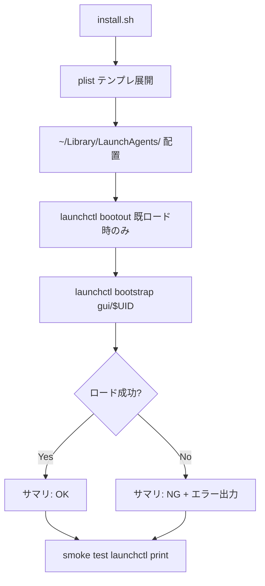
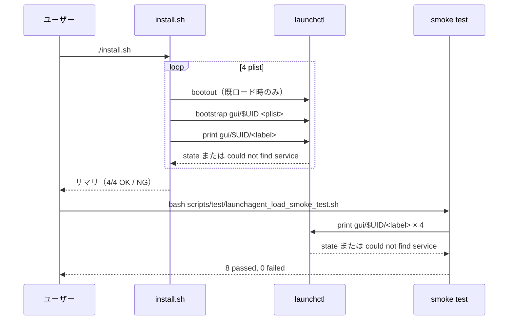
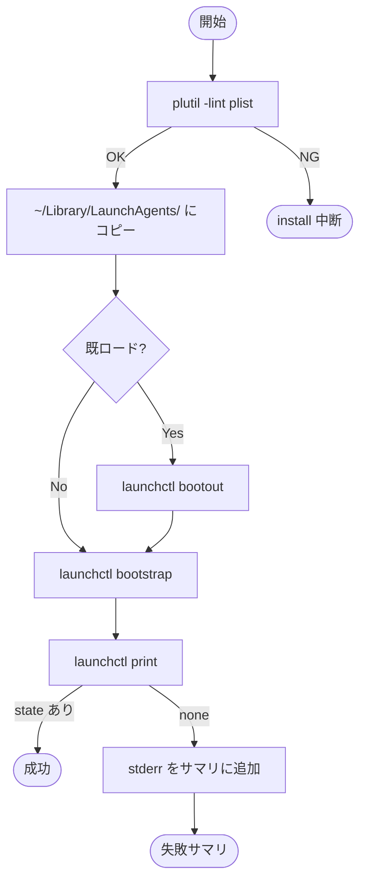
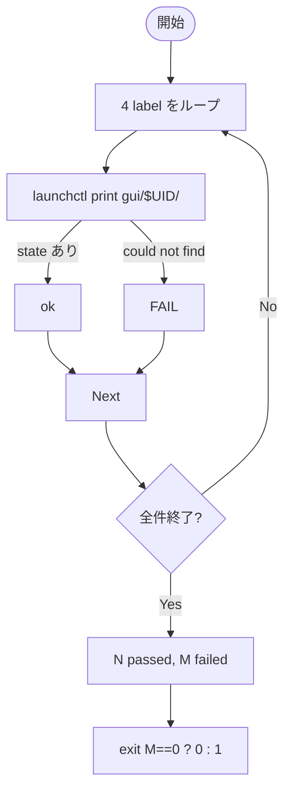

# 設計書: LaunchAgent monitor/docker/refresh ロード失敗の調査と修正

**プロジェクト名**: Mac Health Keeper / LaunchAgent ロード失敗の調査と修正
**作成日**: 2026 年 05 月 29 日
**最終更新**: 2026 年 05 月 29 日

---

## 1. 設計概要

### 1.1 設計方針

「**ロード失敗時の根本原因 → 対策**」を 3 段階の調査・修正サイクルで進める。1) plist 構文検証、2) bootstrap/bootout シーケンス整理、3) 期待タイミング実行の確認。これらを `install.sh` および smoke test 内で完結させ、`make check` の経路で回帰検知可能にする。

### 1.2 設計原則（本プロジェクトで適用するもの）

- **UNIX 哲学**: 各検証ステップ（`plutil -lint` / `launchctl bootout` / `launchctl bootstrap` / `launchctl print`）は単機能のコマンド合成で構成し、shell の exit code で判定可能とする。
- **単一責務**: install.sh は配置・ロード、smoke test は load 結果の検証のみ。期待タイミング実行は別 plist で個別検証。
- **明確な境界**: install スクリプト層 / launchctl 層 / 検証層を分離。

---

## 2. アーキテクチャ設計

### 2.1 責務・境界・参照関係

#### 2.1.1 責務一覧

| コンポーネント | 責務（1 文） |
|---|---|
| `install.sh` の LaunchAgent ロード処理 | plist テンプレ展開・配置・`bootout` → `bootstrap` の順序実行・結果サマリ出力 |
| 4 件の plist テンプレ（`launchagents/*.plist.template`） | 各サービスの label / ProgramArguments / スケジュールを定義 |
| `scripts/test/launchagent_load_smoke_test.sh`（新規） | install 直後の 4 件 load 成功を `launchctl print` で検証 |
| `make check` の CI 経路 | plist 構文検証（`plutil -lint`）を実行 |

#### 2.1.2 境界

- **入力**: 4 件の plist テンプレ、ユーザーの $HOME・$UID
- **出力**: 配置済み plist、ロード成功サマリ、smoke test の OK/NG
- **他責務との境界**: 期待タイミング実行の中身（monitor.sh / docker.sh の動作）は別 issue（本 issue は load と発火確認まで）。

#### 2.1.3 参照関係

- `install.sh` → `launchagents/*.plist.template` → `~/Library/LaunchAgents/*.plist` → `launchctl bootstrap`
- `scripts/test/launchagent_load_smoke_test.sh` → `launchctl print` の出力

### 2.2 システムアーキテクチャ

- **採用パターン**: シェルスクリプト合成 + plist テンプレート展開（既存踏襲）
- **根拠**: 既存方式を破壊せず最小差分で修正するため

### 2.3 コンポーネント構成

- `install.sh` 内の LaunchAgent ロードブロックを **関数化**（例: `load_launchagent` / `verify_launchagent`）し、4 件にループ適用する形に整理する。
- 関数内で `bootout`（既ロード時のみ・エラー無視）→ `bootstrap`（必須）→ `print`（検証）の 3 ステップを実行。

### 2.4 データフロー

---

## 3. 機能設計

### 3.1 機能 1: install.sh の LaunchAgent ロード処理整理

#### 3.1.1 概要

既存の plist 配置 + ロードロジックを関数化し、`bootout` → `bootstrap` の順序を明示。エラー時は `launchctl` の stderr を install ログに残す。

#### 3.1.2 処理フロー

#### 3.1.3 入力・出力

- 入力: plist テンプレ・ユーザー環境（$HOME, $UID）
- 出力: 配置済み plist、ロード結果サマリ（4 件分）

#### 3.1.4 エラーハンドリング

- `plutil -lint` 失敗 → install 中断（exit 1）
- `bootstrap` 失敗 → stderr をログに保存し、サマリで「⚠ ロード失敗: <label> (stderr 抜粋)」を出力。後続 3 件の処理は継続。
- 全 4 件処理後、失敗があれば install 全体の exit code を 1（または別の警告 code）にする方針を 03 で確定。

### 3.2 機能 2: smoke test 追加

#### 3.2.1 概要

`scripts/test/launchagent_load_smoke_test.sh` を新設し、`launchctl print gui/$(id -u)/<label>` の存在検査 + plist 構文検証を行う。

#### 3.2.2 処理フロー

---

## 4. データ設計

- plist は XML（Apple plist DTD）。本 issue では新規データモデル追加なし。

---

## 5. API 設計

- 本 issue では HTTP API 等の追加なし。`launchctl` サブコマンドの利用方針のみ:
  - `launchctl bootstrap gui/<uid> <plist>`
  - `launchctl bootout gui/<uid>/<label>`
  - `launchctl print gui/<uid>/<label>`
  - `plutil -lint <plist>`

---

## 6. テスト戦略

### 6.1 対象ごとのテスト割り当て

| 対象 | 単体 | 結合/API | E2E | クリティカル観点 | バリデーション観点 | 未達理由/補足 |
|---|---|---|---|---|---|---|
| install.sh ロード関数 | ○（shell test） | ○（launchctl との結合） | × | bootout → bootstrap の順序 | plist 構文・label 存在 | E2E は実機検証で代替 |
| 4 plist テンプレ | ○（plutil -lint） | × | × | XML 構文 | 必須キー存在 | – |
| launchagent_load_smoke_test.sh | × | ○ | ○ | 4/4 件 load 成功 | could not find の検出 | – |

### 6.2 監査・レビューでの確認（証跡）

- 03 のタスクごとに BDD インラインコメントを付ける。
- 04_review には **実機 install 出力（コピペ）+ `launchctl print` 出力（4 件）+ smoke test 結果**を必ず記載。

---

## 7. UI 設計

- 該当なし（CLI のみ）。install 出力サマリの体裁を整える（OK/NG が一目で判別可能なフォーマット）。

---

## 8. セキュリティ設計

- 追加なし（既存 plist の `ProgramArguments` 固定パス維持）。

---

## 9. 非機能要件への対応

### 9.1 パフォーマンス

- `bootout` → `bootstrap` のオーバーヘッドは plist あたり 50ms オーダー。4 件で 200ms 程度の増加を想定。

### 9.2 可用性

- 既ロード状態からの再 install を成功させる。

---

## 10. 参考資料

- [`01_要件定義.md`](./01_要件定義.md)
- [`.agents-project/受け入れ基準ルール.md`](../../.agents-project/受け入れ基準ルール.md)

---

## 11. 前のステップ

- **前**: [`01_要件定義.md`](./01_要件定義.md)

---

## 12. 次のステップ

- **次**: [`03_実装計画.md`](./03_実装計画.md)
