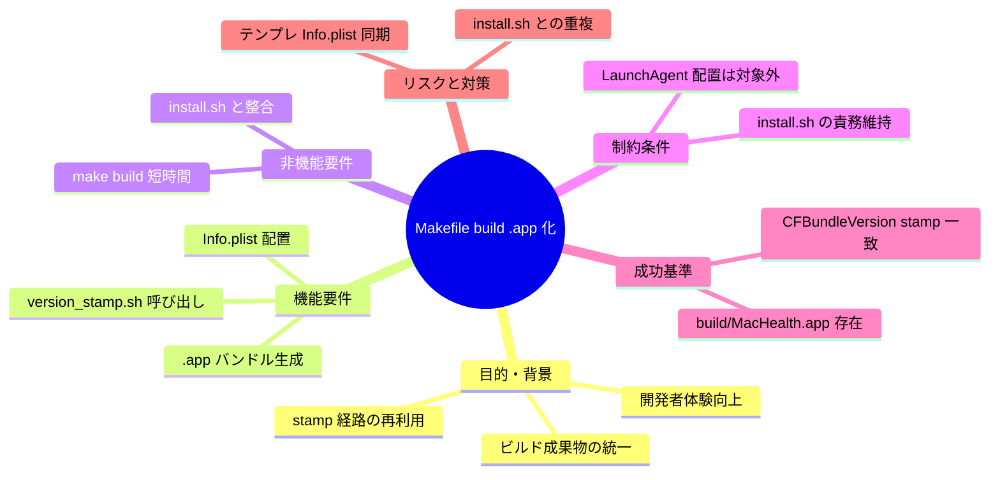

# 要求定義書: Makefile build ターゲットで .app バンドルを生成する拡張

**プロジェクト名**: Mac Health Keeper / Makefile build .app 拡張
**作成日**: 2026 年 05 月 29 日
**最終更新**: 2026 年 05 月 29 日

> **重要**:
>
> - 本 issue は **`.agents-project/受け入れ基準ルール.md` 適用対象**（実コード `Makefile` に影響するため）。
> - 関連 issue: [`.workflow/close/20260529_105524_ビルド時バージョン自動stamp/`](../../close/20260529_105524_ビルド時バージョン自動stamp/) — 本 issue はその副産物として浮上したバージョン stamp の再利用問題に対応。
> - 本 issue ではドキュメント（00〜03）の作成のみを行い、実装着手は本依頼の対象外。

---

## 要求定義の全体像

---

## 1. 目的・背景

### 1.1 目的（必須）

`make build` で `.app` バンドルを生成し、`version_stamp.sh` を Makefile 経路で再利用可能にする。

### 1.2 背景

- **現状の課題**:
  - `make build` は `build/MacHealth` という単体バイナリのみ生成する。`.app` バンドル化や `Info.plist` 配置は `install.sh` でしか行われない。
  - そのため `scripts/lib/version_stamp.sh` を **Makefile 経路で再利用できない**。CFBundleVersion を確認したいだけでも `./install.sh` を実行する必要がある（LaunchAgent ロード等の副作用を伴う）。
  - 開発者が「ビルド結果の `.app` を git ignore 配下で確認したい」「CI 上で `.app` を artifact 化したい」というユースケースに対応できない。
  - 先行 close 済み issue `20260529_105524_ビルド時バージョン自動stamp` §4.1 技術的制約で「`make build` 経路には stamp 対象（`Info.plist`）が存在せず、stamp は install.sh 経路のみで実施する。`.app` 化拡張は本 issue 範囲外」と明記済み（本 issue がその範囲外の続編）。

- **必要性**:
  - 「ビルド」と「インストール」の責務を分離することで、CI / 開発体験が改善する。
  - Issue C（CI で stamp する B 案）の前提として `make build` で `.app` を組み立てられる必要がある。

### 1.3 期待される効果（必須: 1 件以上）

- **効果 1**: `make build` 実行後、`build/MacHealth.app/Contents/MacOS/MacHealth` と `build/MacHealth.app/Contents/Info.plist` が存在する（○/× で判定可能）。
- **効果 2**: `build/MacHealth.app/Contents/Info.plist` の `CFBundleVersion` が、同 commit で `./install.sh` を実行した結果と **一致**する（`git describe` 出力と一致）。
- **効果 3**: `make build` 実行コスト（時間）が現状（数秒）から大きく変化しない（例: +1 秒以内）。

---

## 2. 機能要件

### 2.1 既存機能の維持

- `make check` / `make test` / `make install` / `make reinstall` の現状動作。
- `install.sh` の `.app` 生成・LaunchAgent 配置・ログイン項目登録などのフロー。
- `build/MacHealth` 単体バイナリの生成（後方互換）。

### 2.2 新規機能要件

- **新規 Makefile ターゲット**（または既存 `build` の拡張）: `build/MacHealth.app/Contents/{MacOS,Resources}` ディレクトリを作成し、`src/Info.plist` をコピー、`build/MacHealth` バイナリを `Contents/MacOS/` に配置する。
- **`version_stamp.sh` 呼び出し**: `bash scripts/lib/version_stamp.sh build/MacHealth.app/Contents/Info.plist .` を呼ぶことで `CFBundleVersion` に `git describe` 出力を注入する。
- **ターゲット選択方針**: 既存 `build` を `.app` 化に拡張するか、新規ターゲット `build-app` を追加するかを 02 で確定する（推奨は 02 §3 で議論）。

---

## 3. 非機能要件

### 3.1 パフォーマンス

- ターゲット実行時間の増加を 1 秒以内に収める。

### 3.2 セキュリティ

- 注入する文字列は `git describe` の出力のみ（既存 `version_stamp.sh` を再利用）。

### 3.3 互換性

- `install.sh` の挙動を変更しない（重複処理になっても構わない）。
- 既存の `build/MacHealth` 単体バイナリ生成は維持。

### 3.4 保守性

- `.app` バンドル組み立て処理を `install.sh` と Makefile の双方で重複させないため、**共通スクリプト**（`scripts/lib/build_app_bundle.sh` 等）に切り出す方針を 02 で議論する。

---

## 4. 制約条件

### 4.1 技術的制約

- `plutil`（macOS 標準）が必須。Linux CI では実行不可。
- `version_stamp.sh` は `git describe` を呼ぶため、shallow clone（`git clone --depth=1`）では tag 不在となり fallback `0.0.0-DEV` になる（Issue D で README 注意書きを追加予定）。

### 4.2 既存システムとの互換性

- `install.sh` の `.app` 生成パス（`~/Applications/MacHealth.app`）と Makefile の `.app` 生成パス（`build/MacHealth.app`）は別物として共存。

### 4.3 移行期間・スケジュール

- 本 issue ではドキュメント（00〜03）のみ。実装は別タイミング。

---

## 5. 除外要件

- **本 issue では実装を行わない**。00〜03 のドキュメント作成のみ。
- LaunchAgent plist の配置・ロードは `install.sh` の責務として維持（`make build` には組み込まない）。
- ログイン項目登録も `install.sh` の責務。
- アイコン / Resources の配置整理は別 issue。

---

## 6. 成功基準（必須: 1 件以上）

- **基準 1**: `make build` 実行後、`build/MacHealth.app/Contents/MacOS/MacHealth` が実行可能ファイルとして存在する。
- **基準 2**: `defaults read build/MacHealth.app/Contents/Info CFBundleVersion` が `git describe --tags --always` の出力と一致する（同一 commit）。
- **基準 3**: `make build` の所要時間が現状 + 1 秒以内。
- **基準 4**: `make check` が緑のまま維持される。
- **基準 5 (実機検証)**: ローカル環境で `make build` を実行し、本 issue で変更・追加した機能（`build/MacHealth.app` の生成 + `CFBundleVersion` が `git describe` と一致）が期待どおり動作していることを確認したエビデンス（コマンド出力・確認手順・結果）が `04_review.md` または `memo/` 配下に記録されていること。本基準の根拠は [`.agents-project/受け入れ基準ルール.md`](../../.agents-project/受け入れ基準ルール.md) §3.2–3.4。

---

## 7. リスクと対策

### 7.1 技術的リスク

- **リスク**: `install.sh` の `.app` 生成と Makefile の `.app` 生成が重複し、片方の変更がもう片方に反映されない保守問題。
  - **対策**: 02_設計 で共通スクリプト化（`scripts/lib/build_app_bundle.sh`）の方針を検討。

- **リスク**: shallow clone 環境で stamp 値が `0.0.0-DEV` になり、CFBundleVersion が誤った値で配布される。
  - **対策**: Issue D で README に注意書き追加。本 issue では `version_stamp.sh` の既存挙動を踏襲。

### 7.2 スケジュールリスク

- **リスク**: Issue C（CI で stamp する B 案）が並行で進む場合、`.app` 生成方式に二重実装が発生する。
  - **対策**: B 案も Makefile の build-app ターゲットを呼び出す前提で 02 を整合させる。

---

## 8. 参考資料

### プロジェクトドキュメント

- [`.workflow/close/20260529_105524_ビルド時バージョン自動stamp/`](../../close/20260529_105524_ビルド時バージョン自動stamp/) — 先行関連 issue（参照元）
- [`.agents-project/受け入れ基準ルール.md`](../../.agents-project/受け入れ基準ルール.md)
- `Makefile`（既存 `build` ターゲット）
- `scripts/lib/version_stamp.sh`
- `install.sh` §5.5 stamp ブロック

### その他の参考資料

- Apple Developer: Bundle Programming Guide

---

## 9. 次のステップ

- **次**: [`01_要件定義.md`](./01_要件定義.md)
