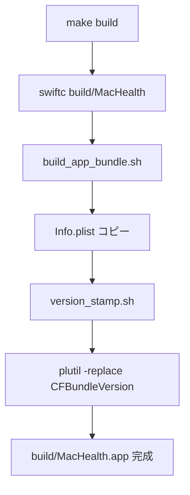
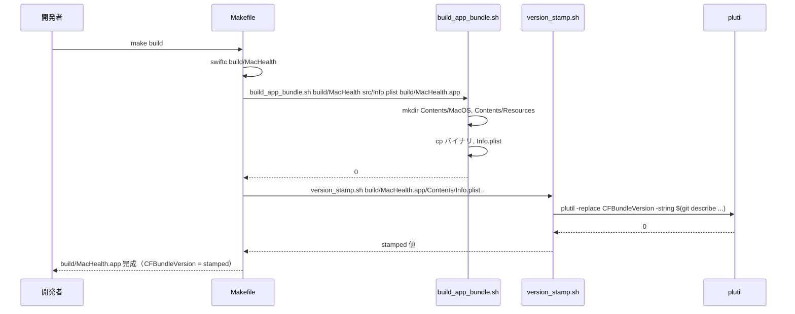
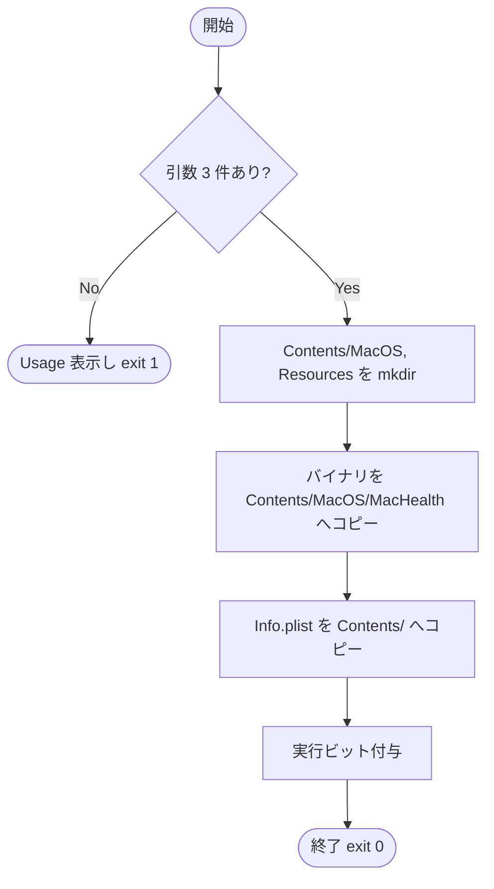
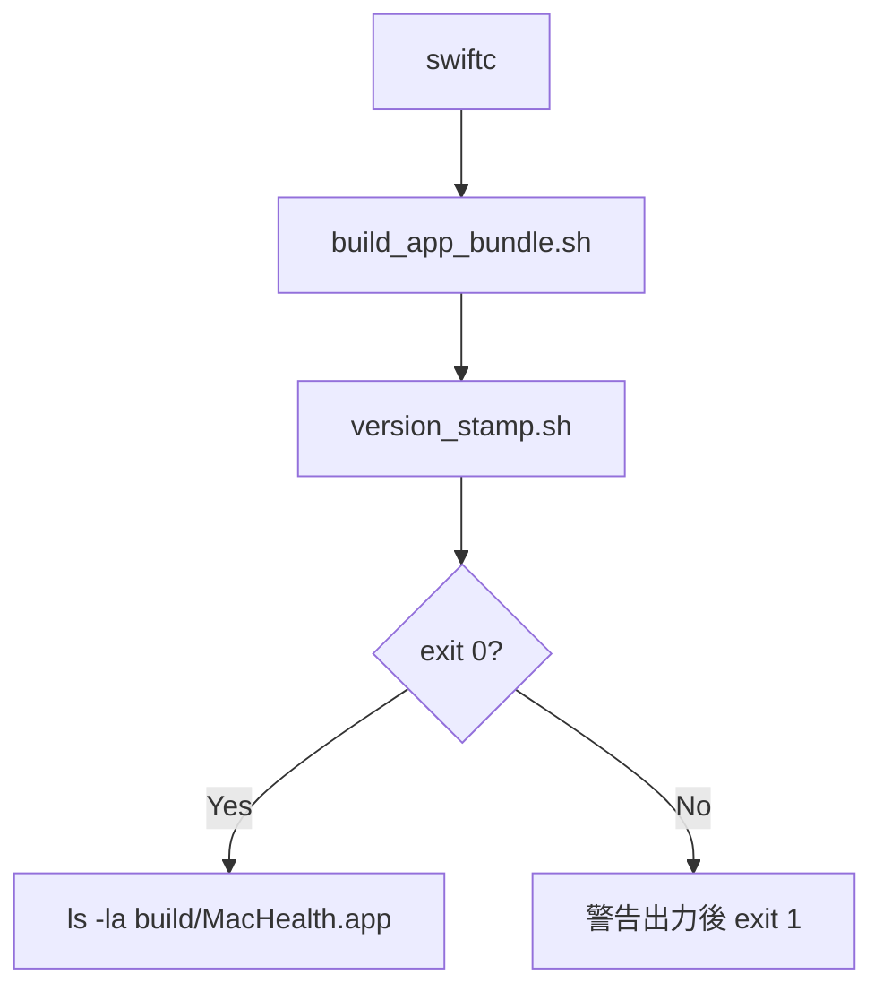

# 設計書: Makefile build ターゲットで .app バンドルを生成する拡張

**プロジェクト名**: Mac Health Keeper / Makefile build .app 拡張
**作成日**: 2026 年 05 月 29 日
**最終更新**: 2026 年 05 月 29 日

---

## 1. 設計概要

### 1.1 設計方針

- 既存 `make build` を **拡張**して `.app` バンドル化する（新ターゲット追加ではなく）。理由: 利用者が「make build」を打つ機会で stamp された `.app` が常に得られたほうが体験が良いため。
- `.app` 組み立てロジックを共通スクリプト `scripts/lib/build_app_bundle.sh` に切り出し、`install.sh` と Makefile の双方から呼び出すことで重複を排除する（採用は 03 で確定）。
- `version_stamp.sh` は既存をそのまま呼ぶ（再実装しない）。

### 1.2 設計原則（本プロジェクトで適用するもの）

- **UNIX 哲学**: `build_app_bundle.sh` は「ビルド済みバイナリ + Info.plist → .app」の単機能スクリプトとして合成可能に。
- **単一責務**: Makefile は build のみ、install.sh は配置・ロード、`build_app_bundle.sh` はバンドル組み立てのみ。
- **AI フレンドリー設計**: 小さなスクリプト、明確な責務、深すぎないディレクトリ。

---

## 2. アーキテクチャ設計

### 2.1 責務・境界・参照関係

#### 2.1.1 責務一覧

| コンポーネント | 責務（1 文） |
|---|---|
| `Makefile::build` | `build/MacHealth` バイナリ生成 + `build_app_bundle.sh` を呼んで `.app` 組み立て + `version_stamp.sh` で stamp |
| `scripts/lib/build_app_bundle.sh`（新規） | バイナリ + Info.plist テンプレ → .app バンドル組み立て |
| `scripts/lib/version_stamp.sh`（既存） | Info.plist の CFBundleVersion を git describe で注入 |
| `install.sh` | 既存責務維持（必要に応じて `build_app_bundle.sh` を呼ぶリファクタを検討） |

#### 2.1.2 境界

- **入力**: `src/Info.plist`、`build/MacHealth` バイナリ、`$REPO_DIR`
- **出力**: `build/MacHealth.app/Contents/{MacOS/MacHealth, Info.plist}`
- **他責務との境界**: LaunchAgent plist 配置・ログイン項目登録は install.sh の責務として維持。

#### 2.1.3 参照関係

- `make build` → `build_app_bundle.sh` → `version_stamp.sh` → `plutil`
- `install.sh` → (将来) `build_app_bundle.sh` → `version_stamp.sh`

### 2.2 システムアーキテクチャ

- **採用パターン**: シェルスクリプト合成
- **根拠**: 既存方式の踏襲、最小差分

### 2.3 コンポーネント構成

- `Makefile::build` を拡張: 既存の `swiftc` 後に `build_app_bundle.sh` 呼び出し + `version_stamp.sh` 呼び出しを追加。
- `scripts/lib/build_app_bundle.sh` を新規作成。引数: `<binary-path> <info-plist-src> <out-app-path>`。

### 2.4 データフロー

---

## 3. 機能設計

### 3.1 機能 1: build_app_bundle.sh の新設

#### 3.1.1 概要

バイナリ + Info.plist テンプレ → `.app` を組み立てる単機能スクリプト。

#### 3.1.2 処理フロー

#### 3.1.3 入力・出力

- 入力: `<binary>`, `<info.plist.src>`, `<out.app>`
- 出力: `<out.app>` 配下に Contents 構造を作成

#### 3.1.4 エラーハンドリング

- 引数不足 → Usage 表示 exit 1
- バイナリ不在 → "binary not found: ..." exit 1

### 3.2 機能 2: Makefile::build の拡張

#### 3.2.1 概要

既存 `build` ターゲットの `swiftc` 行の後に `build_app_bundle.sh` と `version_stamp.sh` の呼び出しを追加。

#### 3.2.2 処理フロー

#### 3.2.3 入力・出力

- 入力: `src/*.swift`, `Sources/**/*.swift`, `src/Info.plist`
- 出力: `build/MacHealth`（後方互換）+ `build/MacHealth.app/`

#### 3.2.4 エラーハンドリング

- swiftc 失敗 → make が exit 1
- build_app_bundle 失敗 → make が exit 1
- version_stamp 失敗 → warn のみで継続（既存 install.sh の挙動と整合）

---

## 4. データ設計

- 該当なし（新規データモデル無し）。

---

## 5. API 設計

- `build_app_bundle.sh <binary> <info-plist-src> <out-app-path>`

---

## 6. テスト戦略

### 6.1 対象ごとのテスト割り当て

| 対象 | 単体 | 結合/API | E2E | クリティカル観点 | バリデーション観点 | 未達理由/補足 |
|---|---|---|---|---|---|---|
| build_app_bundle.sh | ○（shell test） | ○ | × | 引数バリデーション・ファイル配置 | 引数不足エラー | – |
| Makefile::build 拡張 | × | ○ | ○ | swiftc → bundle → stamp の連鎖 | 各ステップの exit code | – |
| stamp 一致 | × | ○ | ○ | install.sh と同じ stamp 値 | git describe 一致 | – |

### 6.2 監査・レビューでの確認

- 04_review に `make build` 出力 + `defaults read build/MacHealth.app/Contents/Info CFBundleVersion` の出力を必ず記載。

---

## 7. UI 設計

- 該当なし。

---

## 8. セキュリティ設計

- 追加なし。

---

## 9. 非機能要件への対応

### 9.1 パフォーマンス

- `mkdir` + `cp` × 2 + `plutil -replace` で +200ms 程度を想定。

### 9.2 可用性

- shallow clone 環境では `0.0.0-DEV` fallback を許容（Issue D で対処）。

---

## 10. 参考資料

- [`01_要件定義.md`](./01_要件定義.md)
- `Makefile`
- `scripts/lib/version_stamp.sh`
- [`.agents-project/受け入れ基準ルール.md`](../../.agents-project/受け入れ基準ルール.md)

---

## 11. 前のステップ

- **前**: [`01_要件定義.md`](./01_要件定義.md)

---

## 12. 次のステップ

- **次**: [`03_実装計画.md`](./03_実装計画.md)
