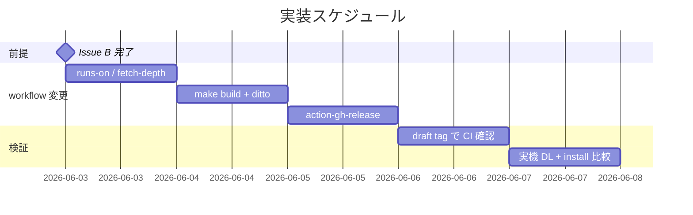

# 実装計画書: CI（GitHub Actions）でバージョン stamp する B 案の実装

**プロジェクト名**: Mac Health Keeper / CI stamp B 案
**作成日**: 2026 年 05 月 29 日
**最終更新**: 2026 年 05 月 29 日

---

## 1. 実装概要

### 1.1 実装方針

`create-release.yaml` を最小差分で変更し、`make build` を呼んで artifact upload する。Issue B（Makefile build .app 化）の完了を前提とする。各タスクの最後に **必ず実機 install + artifact DL + CFBundleVersion 一致確認**を含める。

### 1.2 実装順序



---

## 2. タスク分解

### 2.1 タスク 1: runs-on / fetch-depth 変更

#### 2.1.1 概要

`create-release.yaml` の `runs-on: ubuntu-latest` を `macos-latest` に変更し、`actions/checkout@v4` に `fetch-depth: 0` を追加する。

#### 2.1.2 実装内容

- yaml 編集（`runs-on` 変更）
- checkout step に `fetch-depth: 0` 追加
- 既存 tag 計算 step は維持

#### 2.1.3 テスト観点

##### 単体

- yaml lint（`actionlint` 推奨）

##### 結合/API

- `act` または draft tag push で workflow が起動する

##### E2E/受け入れ

- 実 tag push で macos-latest runner が起動する

#### 2.1.4 単体テスト仕様（BDD）

```gherkin
Feature: workflow yaml
  Scenario: runs-on / fetch-depth が macos-latest 化されている
    Given .github/workflows/create-release.yaml が編集された
    When grep "runs-on: macos-latest" を実行
    Then 1 件以上ヒット
    And grep "fetch-depth: 0" がヒット
```

```bash
# Given: yaml 編集後
# When: grep
# Then: ヒット
grep "runs-on: macos-latest" .github/workflows/create-release.yaml || exit 1
grep "fetch-depth: 0" .github/workflows/create-release.yaml || exit 1
```

#### 2.1.5 依存関係

- Issue B 完了（make build で `.app` 化が可能になっていること）

#### 2.1.6 見積もり

- **工数**: 0.5 日
- **優先度**: 高

### 2.2 タスク 2: make build + ditto step 追加

#### 2.2.1 概要

workflow に `make build` ステップと `ditto` ステップを追加。

#### 2.2.2 実装内容

- `- name: Build .app` step（`run: make build`）
- `- name: Verify CFBundleVersion` step（`run: defaults read $PWD/build/MacHealth.app/Contents/Info CFBundleVersion`）
- `- name: Package .app.zip` step（`run: ditto -c -k --sequesterRsrc --keepParent build/MacHealth.app build/MacHealth-${TAG}.app.zip`）

#### 2.2.3 テスト観点

##### 単体

- yaml lint

##### 結合/API

- act 経由でビルド成功

##### E2E/受け入れ

- 実 tag push で `.app.zip` が生成され、Verify step の出力が正しい

#### 2.2.4 単体テスト仕様（BDD）

```gherkin
Feature: build + zip step
  Scenario: workflow に make build と ditto が含まれる
    Given workflow 編集後
    When grep "make build" と grep "ditto -c -k"
    Then 両方ヒット
```

#### 2.2.5 依存関係

- タスク 1

#### 2.2.6 見積もり

- **工数**: 0.5 日
- **優先度**: 高

### 2.3 タスク 3: action-gh-release で artifact upload

#### 2.3.1 概要

`softprops/action-gh-release@v2` を使い、`build/*.app.zip` を Release に添付。

#### 2.3.2 実装内容

- step 追加: `uses: softprops/action-gh-release@v2`
- `files: build/*.app.zip`
- `body` に CFBundleVersion 値 / Gatekeeper 手順を含む

#### 2.3.3 テスト観点

##### 単体

- yaml lint

##### 結合/API

- draft release で artifact 添付が成功

##### E2E/受け入れ

- 実 tag push で Release ページに `.app.zip` が表示される

#### 2.3.4 単体テスト仕様（BDD）

```gherkin
Feature: action-gh-release
  Scenario: workflow に action-gh-release と files: build/*.app.zip が含まれる
    Given workflow 編集後
    When grep "softprops/action-gh-release" と grep "files:.*build/\*.app.zip"
    Then ヒット
```

#### 2.3.5 依存関係

- タスク 2

#### 2.3.6 見積もり

- **工数**: 0.5 日
- **優先度**: 高

### 2.4 タスク 4: draft tag で CI 確認

#### 2.4.1 概要

検証用ブランチで draft tag を push し、workflow を起動して artifact upload までの全フローを確認。

#### 2.4.2 実装内容

- 検証用 tag（例: `v20260601.000000-rc1`）を push
- workflow ログを確認
- Release ページの artifact を DL
- DL した `.app.zip` を展開し、`defaults read .../Info CFBundleVersion` を実行

#### 2.4.3 テスト観点

##### E2E/受け入れ

- artifact が Release に upload される
- DL → 展開 → CFBundleVersion 確認が tag 値 / git describe 値と一致

#### 2.4.4 単体テスト仕様（BDD）

```gherkin
Feature: draft tag 検証
  Scenario: draft tag で artifact が DL 可能、CFBundleVersion 一致
    Given workflow 編集完了
    When draft tag を push
    Then GitHub Releases に .app.zip がある
    And DL → 展開後の CFBundleVersion が git describe --tags --always と一致
```

#### 2.4.5 依存関係

- タスク 3

#### 2.4.6 見積もり

- **工数**: 0.5 日
- **優先度**: 必須

### 2.5 タスク 5: 実機 DL + install 比較（**本ルール強制**）

#### 2.5.1 概要

本ルール `.agents-project/受け入れ基準ルール.md` §3.2–3.4 に従い、ローカル macOS で次を実施:

1. CI artifact を DL → 展開 → CFBundleVersion 確認
2. 同 commit から `./install.sh` 実行 → `~/Applications/MacHealth.app` の CFBundleVersion 確認
3. 両者が **一致**することを確認

#### 2.5.2 実装内容

- ローカル macOS で artifact を DL
- 展開して `defaults read` で CFBundleVersion 取得
- 同 commit から `./install.sh` を実行し install 経路でも CFBundleVersion 取得
- 両者の一致を確認
- 不一致時は原因（fetch-depth / version_stamp の差異 等）を分析
- エビデンスを `memo/<YYYYMMDD_HHMMSS>_ci-stamp-verification.md` に記録

#### 2.5.3 テスト観点

##### E2E/受け入れ

- CI artifact CFBundleVersion = install 経路 CFBundleVersion
- DL artifact が Gatekeeper 警告経由で起動できる（任意確認）

#### 2.5.4 単体テスト仕様（BDD）

```gherkin
Feature: 実機 A 案 / B 案 一致確認
  Scenario: 同 commit から CI artifact と install.sh が同じ CFBundleVersion を持つ
    Given CI で生成された .app.zip を DL
    And 同 commit から ./install.sh を実行
    When 両者の CFBundleVersion を比較
    Then 一致する
```

#### 2.5.5 依存関係

- タスク 4

#### 2.5.6 見積もり

- **工数**: 0.5 日
- **優先度**: 必須

---

## テスト観点

タスクごとの §2.x.3 を参照。全体としては「workflow 動作」「artifact upload」「CFBundleVersion 一致」「Gatekeeper 起動可」の 4 観点。

---

## 単体テスト

タスクごとの §2.x.4 BDD を参照。

---

## BDD

01_要件定義.md §2.2 UC1-S1, UC2-S1, UC3-S1, UC4-S1 を実 CI + 実機 DL で検証。

---

## 3. 実装スケジュール

### 3.1 マイルストーン

| マイルストーン | 期日 | 成果物 |
|---|---|---|
| Issue B 完了 | 2026-06-03 | make build で .app 化可能 |
| workflow 編集完了 | 2026-06-05 | runs-on / fetch-depth / make build / ditto / upload |
| draft tag 検証 | 2026-06-06 | artifact upload 確認 |
| 実機 DL 検証 | 2026-06-07 | CFBundleVersion 一致 |

### 3.2 実装フェーズ

- フェーズ 1: workflow 変更（タスク 1, 2, 3）
- フェーズ 2: CI / 実機検証（タスク 4, 5）

---

## 4. テスト計画

各タスクの §2.x.3 / §2.x.4 を参照。

### 4.1 テストの優先順位

- 実機 DL + install 比較（タスク 5）を最優先で必須化

---

## 5. リスク管理

### 5.1 実装リスク

- **リスク**: Issue B が未完了の場合、CI 内で `.app` 組み立てを inline 実装する必要が生じる
  - **対策**: Issue B の優先実装を依頼。または、本 issue 内で inline 実装する経過策

- **リスク**: macos-latest runner で `git describe` が tag を取得できない（fetch-depth: 0 漏れ）
  - **対策**: タスク 1 で必ず `fetch-depth: 0` を追加し、Verify step でログ出力

---

## 6. 参考資料

- [`02_設計.md`](./02_設計.md)
- [`.agents-project/受け入れ基準ルール.md`](../../.agents-project/受け入れ基準ルール.md)
- [`.workflow/20260529_122727_Makefile_app化拡張/`](../../20260529_122727_Makefile_app化拡張/)

---

## 7. 前のステップ

- **前**: [`02_設計.md`](./02_設計.md)

---

## 8. 次のステップ

- 実装フェーズ（execution）に進む（本依頼ではドキュメント作成のみ）。
