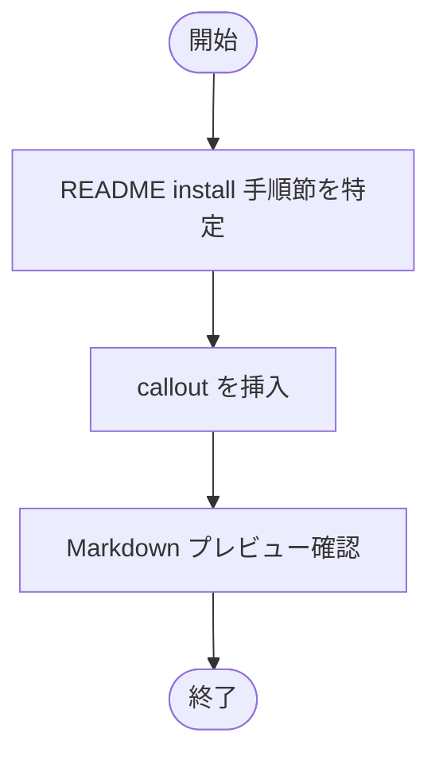

# 設計書: README に shallow clone 注意書きを追加

**プロジェクト名**: Mac Health Keeper / README shallow clone 注意書き
**作成日**: 2026 年 05 月 29 日
**最終更新**: 2026 年 05 月 29 日

---

## 1. 設計概要

### 1.1 設計方針

最小差分で README の install 手順節に **callout 形式（`> **注意**: ...`）または箇条書き**で 1〜2 行追記する。文言は「shallow clone 不可、または `git fetch --tags --unshallow` 必要」の趣旨。

### 1.2 設計原則（本プロジェクトで適用するもの）

- **単一責務**: 本 issue は README 数行追加のみ。他ファイルへの影響を作らない。
- **AI フレンドリー設計**: 注意書きの根拠（`scripts/lib/version_stamp.sh` / A 案 issue）を参照リンクで明示。

---

## 2. アーキテクチャ設計

### 2.1 責務・境界・参照関係

#### 2.1.1 責務一覧

| コンポーネント | 責務（1 文） |
|---|---|
| `README.md`（リポジトリ直下） | 公式 install 手順の正本。本 issue で注意書きを追記 |

#### 2.1.2 境界

- **入力**: なし
- **出力**: README.md の更新 diff
- **他責務との境界**: `docs/README.md` 等の他 README は対象外（別 issue）

#### 2.1.3 参照関係

- README から `.workflow/close/20260529_105524_ビルド時バージョン自動stamp/` への参照リンクは任意（README の既存スタイル次第）

### 2.2 システムアーキテクチャ

- 該当なし（doc のみ）

### 2.3 コンポーネント構成

- `README.md` 内の install 手順節（既存節を維持しつつ注意書きを挿入）

### 2.4 データフロー

- 該当なし

---

## 3. 機能設計

### 3.1 機能 1: README 注意書き追記

#### 3.1.1 概要

install 手順節の冒頭に callout を 1 つ追加。文案例:

```markdown
> **注意**: `git clone --depth=1` での shallow clone は `CFBundleVersion` の自動 stamp が `0.0.0-DEV` の fallback 値になります。shallow clone を使用する場合は、`./install.sh` 実行前に `git fetch --tags --unshallow` を実行してください。
```

#### 3.1.2 処理フロー



#### 3.1.3 入力・出力

- 入力: README.md
- 出力: 注意書きが追記された README.md

#### 3.1.4 エラーハンドリング

- 該当なし

---

## 4. データ設計

- 該当なし

---

## 5. API 設計

- 該当なし

---

## 6. テスト戦略

### 6.1 対象ごとのテスト割り当て

| 対象 | 単体 | 結合/API | E2E | クリティカル観点 | バリデーション観点 | 未達理由/補足 |
|---|---|---|---|---|---|---|
| README diff | ○（grep） | × | ○（shallow clone 実機再現） | 注意書き存在 | – | – |

### 6.2 監査・レビューでの確認

- 04_review に「`grep -E 'shallow|--unshallow' README.md` の出力」「shallow clone 実機再現の `defaults read` 出力」を必ず記載。

---

## 7. UI 設計

- 該当なし

---

## 8. セキュリティ設計

- 該当なし

---

## 9. 非機能要件への対応

- 該当なし

---

## 10. 参考資料

- [`01_要件定義.md`](./01_要件定義.md)
- [`.agents-project/受け入れ基準ルール.md`](../../.agents-project/受け入れ基準ルール.md)
- `README.md`

---

## 11. 前のステップ

- **前**: [`01_要件定義.md`](./01_要件定義.md)

---

## 12. 次のステップ

- **次**: [`03_実装計画.md`](./03_実装計画.md)
