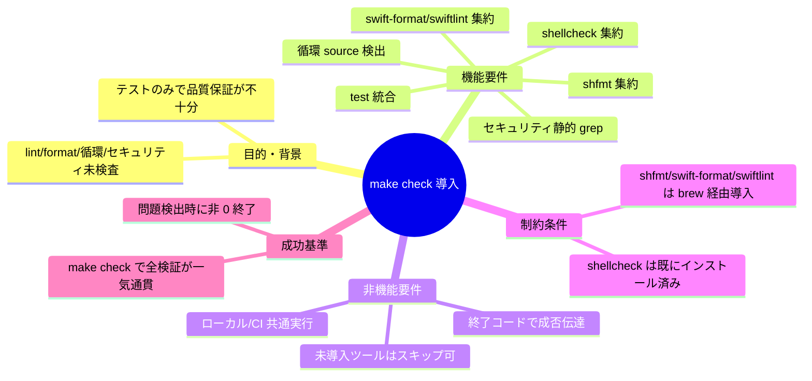

# 要求定義書: make check 導入による検証集約

**プロジェクト名**: make check 導入による検証集約
**作成日**: 2026 年 05 月 28 日
**最終更新**: 2026 年 05 月 28 日

> **重要**: このドキュメントは常に更新する。要求の変更・追加があれば即座に反映する。

---

## 要求定義の全体像

---

## 1. 目的・背景

### 1.1 目的（必須）

`make check` で lint・format・循環参照・セキュリティ・テストを一括検証できるようにする。

### 1.2 背景

- **現状の課題**:
  - `make test` は XCTest とシェルテストしか走らず、品質保証が不完全。
  - shellcheck はインストール済みだが Makefile から呼ばれていない。
  - シェル `source` の循環参照、秘密情報/危険パターンを検出する仕組みがない。
  - `.github/workflows` も存在せず CI 連携の起点もない。

- **必要性**:
  - 規約準拠改善（先行 issue）で整備した規約を継続的に検証する手段が必要。
  - 将来 CI を導入する際に `make check` を 1 コマンドで呼び出せると効率が良い。

### 1.3 期待される効果（必須: 1 件以上）

- **効果 1**: `make check` 1 コマンドで lint/format/循環/セキュリティ/テストの全検証を実行できる（○/×判定可）。
- **効果 2**: 未導入ツール（shfmt/swift-format/swiftlint）は警告つきで skip し、全体実行を阻害しない。
- **効果 3**: 検証失敗時は非 0 終了し、CI で容易に拾える。

---

## 2. 機能要件

### 2.1 既存機能の維持

- 既存の `make test`, `make test-swift`, `make test-shell` ターゲットは挙動を変えず維持する。

### 2.2 新規機能要件

- `make check`: lint / format / 循環 / セキュリティ / test を順次実行する集約ターゲット。
- `make lint`: shellcheck を `scripts/` 配下と `install.sh` / `uninstall.sh` に適用。
- `make format-check`: shfmt（シェル）と swift-format（Swift）の差分検査。未導入ならスキップ。
- `make swiftlint`: swiftlint があれば実行。なければスキップ。
- `make check-cycles`: シェル `source` 依存グラフの循環検出。
- `make security-scan`: 秘密情報・`eval`・unquoted 変数展開などの危険パターンを grep ベースで検出。

---

## 3. 非機能要件

### 3.1 パフォーマンス

- ローカルでの全検証完了は数十秒オーダーを目標（テスト除く検証部分は 10 秒以内）。

### 3.2 セキュリティ

- 秘密情報（AWS key 風、`password=`, `token=` リテラル等）と危険パターン（`eval`, `rm -rf $`, `curl | sh` 等）を検出。

### 3.3 互換性

- macOS（Darwin）+ bash 3.2 / zsh で動作。GNU 拡張に依存しない。
- shellcheck/shfmt/swift-format/swiftlint の不在はエラーではなく警告として扱う。ただし shellcheck だけは「強く推奨」とし、不在時に WARN を強く出す。

### 3.4 保守性

- 各検証ロジックは `scripts/lint/` 配下に切り出し、Makefile からは薄く呼ぶ。
- 既存の `scripts/test/` と分離して責務を明確にする。

---

## 4. 制約条件

### 4.1 技術的制約

- shellcheck は `/usr/local/bin/shellcheck` に既存。shfmt/swift-format/swiftlint は未導入のため、`brew install` 手順を README に追記する程度に留め、CI 等での自動導入は本 issue の対象外。

### 4.2 既存システムとの互換性

- `make test` の挙動を変えない。`make check` 内から `make test` を呼ぶ形にする。

### 4.3 移行期間・スケジュール

- 単一 PR で完結。段階移行不要。

---

## 5. 除外要件

- GitHub Actions など CI ワークフローの実体作成は **対象外**（`make check` の整備までを範囲とする）。
- swift-format/swiftlint/shfmt の **自動導入** は対象外（README に手順追記まで）。
- 既存コードの lint 違反の **自動修正** は対象外（検出のみ。違反がある場合は別 issue で対応）。

---

## 6. 成功基準（必須: 1 件以上）

- `make check` が定義され、`shellcheck` / 循環検出 / セキュリティ grep / `make test` を順次実行する。
- 未導入ツール（shfmt/swift-format/swiftlint）の不在で非 0 終了しない。WARN を出して継続する。
- いずれかの検証が失敗したら `make check` は非 0 終了する。
- 現行コードベースに対して `make check` が緑（または既知の WARN のみ）になる。
- 受け入れテスト: `01_要件定義.md` の BDD シナリオがすべて通過する。

---

## 7. リスクと対策

### 7.1 技術的リスク

- **リスク**: 既存コードに shellcheck 違反が大量に存在し、`make check` が即赤になる可能性。
  - **対策**: 02_設計 段階で違反を棚卸しし、重大度に応じて exclude / 修正方針を決める。修正が必要な場合は別 issue 化する。

- **リスク**: 循環 source 検出スクリプトの誤検出。
  - **対策**: `scripts/bin/*` → `scripts/lib/*` の単方向参照のみであることを確認し、簡素な DFS で実装する。

### 7.2 スケジュールリスク

- 小規模なため特になし。

---

## 8. 参考資料

- 先行 issue: `.workflow/close/20260527_225413_規約準拠改善/`
- `Makefile`（既存）
- `scripts/`（検証対象）

---

## 9. 次のステップ

- **次**: [`01_要件定義.md`](./01_要件定義.md) - BDD シナリオと受け入れ基準
