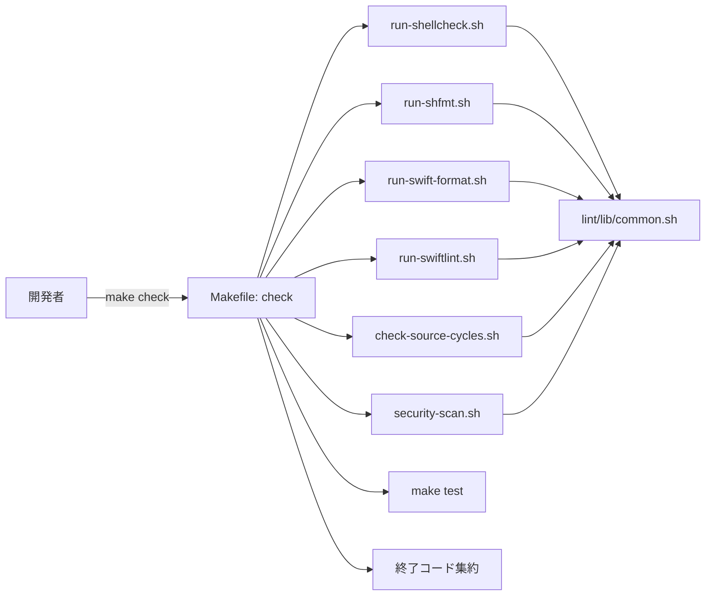

# 設計書: make check 導入による検証集約

**プロジェクト名**: make check 導入による検証集約
**作成日**: 2026 年 05 月 28 日
**最終更新**: 2026 年 05 月 28 日

---

## 1. 設計概要

### 1.1 設計方針

- UNIX 哲学（小さく作る・1 つのことをうまくやる）に則り、検証種別ごとに 1 スクリプト 1 責務で `scripts/lint/` 配下に分割し、Makefile は薄いオーケストレータに留める。

### 1.2 設計原則（本プロジェクトで適用するもの）

- **UNIX 哲学**: 検証スクリプトは標準入出力と終了コードで連携。
- **単一責務**: 1 スクリプト = 1 検証種別。
- **明確な境界**: Makefile（実行制御）/ scripts/lint/（検証ロジック）/ scripts/test/（テスト）の 3 境界。
- **AI フレンドリー設計**: 小さなファイル、意図が分かる命名（`run-shellcheck.sh`, `check-source-cycles.sh` 等）。

---

## 2. アーキテクチャ設計

### 2.1 責務・境界・参照関係

#### 2.1.1 責務一覧

| コンポーネント                         | 責務（1 文）                                                          |
| -------------------------------------- | --------------------------------------------------------------------- |
| `Makefile` (check 系ターゲット)        | 各検証スクリプトを順次呼び出し、終了コードを集約する                  |
| `scripts/lint/run-shellcheck.sh`       | scripts/ 配下と install.sh / uninstall.sh に shellcheck を適用する    |
| `scripts/lint/run-shfmt.sh`            | シェルスクリプトの shfmt 差分検査。未導入なら SKIP                    |
| `scripts/lint/run-swift-format.sh`     | Swift コードの swift-format 差分検査。未導入なら SKIP                 |
| `scripts/lint/run-swiftlint.sh`        | swiftlint を実行。未導入なら SKIP                                     |
| `scripts/lint/check-source-cycles.sh`  | シェル `source` 依存グラフを構築し、循環を検出する                    |
| `scripts/lint/security-scan.sh`        | 秘密情報・危険パターンを grep ベースで検出する                        |
| `scripts/lint/lib/common.sh`           | ログ出力・ツール検出・対象ファイル列挙の共通関数を提供                |

#### 2.1.2 境界

- **入力**: リポジトリのソース（`Sources/`, `Tests/`, `scripts/`, `install.sh`, `uninstall.sh`）。
- **出力**: 標準出力に検証結果、標準エラーに WARN/SKIP、終了コード（0=成功/SKIP のみ、非 0=失敗）。
- **他責務との境界**: `scripts/test/`（テスト）と `scripts/bin/`（プロダクションスクリプト）は呼び出さない。`scripts/lint/` は読み取り専用。

#### 2.1.3 参照関係

- `Makefile` → `scripts/lint/run-*.sh`, `scripts/lint/check-source-cycles.sh`, `scripts/lint/security-scan.sh`
- `scripts/lint/*.sh` → `scripts/lint/lib/common.sh`（単方向。lib から bin への参照は禁止）
- 循環なし。

### 2.2 システムアーキテクチャ

- **採用パターン**: Pipeline（Make が各検証を順次実行し、失敗を集約）
- **根拠**: 小規模・単純で、UNIX 哲学に最も整合。

#### 2.2.1 アーキテクチャ図



---

## 3. 詳細設計

### 3.1 Makefile ターゲット

```make
.PHONY: check lint lint-shell lint-shfmt lint-swift-format lint-swiftlint \
        check-cycles security-scan

check:
    @rc=0; \
    for step in lint-shell lint-shfmt lint-swift-format lint-swiftlint \
                check-cycles security-scan test; do \
      echo "==> $$step"; \
      if $(MAKE) --no-print-directory $$step; then \
        echo "    $$step: OK"; \
      else \
        echo "    $$step: FAILED" >&2; \
        rc=1; \
      fi; \
    done; \
    [ $$rc -eq 0 ] && echo "==> all checks passed" || echo "==> some checks failed" >&2; \
    exit $$rc

lint: lint-shell lint-shfmt lint-swift-format lint-swiftlint

lint-shell:        ; @bash scripts/lint/run-shellcheck.sh
lint-shfmt:        ; @bash scripts/lint/run-shfmt.sh
lint-swift-format: ; @bash scripts/lint/run-swift-format.sh
lint-swiftlint:    ; @bash scripts/lint/run-swiftlint.sh
check-cycles:      ; @bash scripts/lint/check-source-cycles.sh
security-scan:     ; @bash scripts/lint/security-scan.sh
```

> 上記は概略。実際の Makefile では既存ターゲットを残しつつ追記する。

### 3.2 共通ライブラリ: `scripts/lint/lib/common.sh`

提供関数:

- `log_info <msg>` / `log_warn <msg>` / `log_skip <msg>` / `log_error <msg>`: 統一フォーマットで stdout / stderr に出力。
- `require_tool <name>`: PATH 確認。なければ非 0 を返す（必須ツール用）。
- `tool_available <name>`: 真偽のみ返す（任意ツール用、SKIP 判定）。
- `list_shell_files`: 対象シェルを echo（`scripts/bin/*`, `scripts/lib/*`, `scripts/config/*`, `scripts/test/*.sh`, `install.sh`, `uninstall.sh`）。
- `list_swift_files`: Swift ファイル一覧（`Sources/**/*.swift`, `Tests/**/*.swift`）。
- `repo_root`: リポジトリルートを返す（`git rev-parse --show-toplevel` フォールバック）。

### 3.3 run-shellcheck.sh

- 必須ツール扱い。`shellcheck` 不在なら ERROR で非 0 終了。
- 対象: `list_shell_files` の結果。
- オプション: `-x`（外部 source 解決）、`-e SC1091`（外部 source 警告抑止）等は最小限。
- 終了コード: shellcheck の終了コードをそのまま返す。

### 3.4 run-shfmt.sh

- 任意ツール扱い。`shfmt` 不在なら SKIP（0 終了）。
- コマンド: `shfmt -d -i 4 -ci $(list_shell_files)` 相当（差分検査）。
- 差分があれば非 0。

### 3.5 run-swift-format.sh

- 任意ツール扱い。未導入なら SKIP。
- コマンド: `swift-format lint --strict $(list_swift_files)`。

### 3.6 run-swiftlint.sh

- 任意ツール扱い。未導入なら SKIP。
- コマンド: `swiftlint --strict`（設定ファイル無しでも default rules で実行）。

### 3.7 check-source-cycles.sh

- 入力: `list_shell_files` の結果。
- 各ファイルから `^source\s+|^\.\s+` 行をパースして依存先パスを抽出（`$ROOT_DIR`, `$SCRIPT_DIR` 等の変数展開は `scripts/bin` 起点で正規化）。
- 有向グラフを構築し DFS で循環を検出。循環があれば該当パスを出力し非 0 終了。
- 想定実装: bash の連想配列（bash 3.2 では使えないため、`map_key__file=val` 形式の文字列か、awk 実装に倒す）。**bash 3.2 互換のため awk で実装する**。

### 3.8 security-scan.sh

- 対象: `list_shell_files` + `Sources/**/*.swift`。
- パターン（grep -E、複数回呼び出し）:
  - `AKIA[0-9A-Z]{16}` / `(?i)password\s*=\s*['"][^'"]+['"]` / `(?i)token\s*=\s*['"][^'"]+['"]`
  - `(^|[^A-Za-z_])eval[[:space:]]+`
  - `rm[[:space:]]+-rf?[[:space:]]+\$`
  - `(curl|wget)[^|]*\|[[:space:]]*sh`
- 検出 → `file:line: <pattern>` を出力 → 非 0。
- 誤検出抑制: `# noqa: security` コメント末尾を許容（grep 後に除外）。
- macOS は GNU grep `-P` が無いため `-E` を使用。

### 3.9 既存 `test` ターゲット

- 変更なし。`make check` から `$(MAKE) test` で呼ぶ。

---

## 4. テスト観点

| 観点                             | 確認方法                                                                                         |
| -------------------------------- | ------------------------------------------------------------------------------------------------ |
| make check の全パス時の挙動      | 現状コードで `make check` を実行。WARN（任意ツール未導入）以外は緑になること                     |
| 任意ツール SKIP の挙動           | shfmt 等の PATH をマスクして実行し、SKIP 表示 + 0 終了を確認                                     |
| shellcheck 違反検出              | 一時的に `scripts/lint/__tmp_bad.sh` に違反コードを置き、非 0 終了を確認後に削除                |
| 循環検出                         | 一時テスト用ファイルで循環を作って検出を確認                                                    |
| セキュリティ検出                 | 一時テスト用ファイルで `eval $x` を置いて検出を確認                                              |
| 既存 make test 単独実行          | `make test` で従来通り動作                                                                       |

---

## 5. 影響範囲

- `Makefile`: ターゲット追加（既存挙動不変）。
- `scripts/lint/`: 新規ディレクトリ作成。
- `README.md`: 「ローカル検証手順」セクションに `make check` と任意ツール導入手順を追記。
- 既存スクリプト・テスト: 変更なし。

---

## 6. 既知のリスク

- 既存コードに shellcheck の重大度高違反があれば修正が必要になる。事前棚卸しを実装計画フェーズで実施する。
- bash 3.2 互換のため連想配列を使えない。awk 実装で対処する。

---

## 7. 次のステップ

- **次**: [`03_実装計画.md`](./03_実装計画.md)
