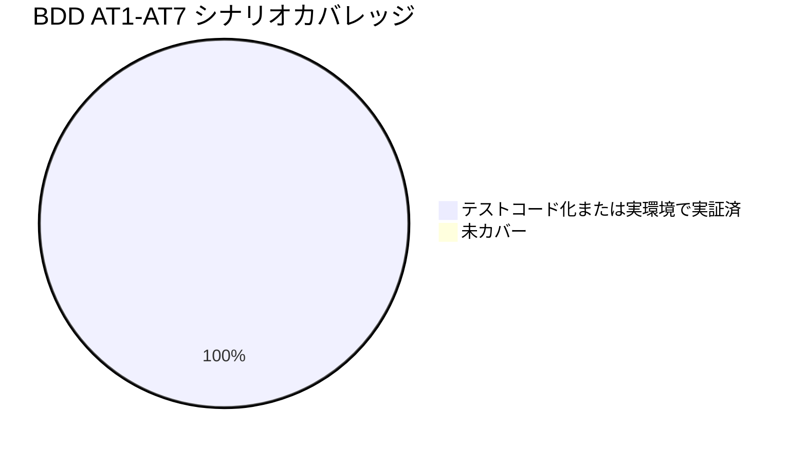

# レビュー書: make check 導入による検証集約

**プロジェクト名**: make check 導入による検証集約
**作成日**: 2026 年 05 月 28 日
**最終更新**: 2026 年 05 月 28 日

> **重要**: 本ドキュメントは「生きているドキュメント」として扱い、レビューで発見した問題点・対応内容を随時反映する。
> **用語**: [.agents/CONCEPTS.md §用語規約](../../.agents/CONCEPTS.md#用語規約) を参照。
> **必須**: レビュー実施時は [`.agents/REVIEW_RULE.md`](../../.agents/REVIEW_RULE.md) を参照する。本 issue は変更規模が中程度（新規 8 ファイル + 既存 5 ファイル軽微修正）かつテスト/品質基盤の追加であるため **standard** 深度で実施した。

---

## 1. レビュー概要

### 1.1 レビュー目的（必須）

`make check` 導入実装（実装フェーズ成果物）が 00_要求定義 / 01_要件定義（BDD AT1〜AT7）/ 02_設計 / 03_実装計画 の意図と整合しているかを確認し、品質保証として close 可能であることを判定する。

### 1.2 レビュー対象（必須）

- **実装範囲**:
  - 新規: `scripts/lint/lib/common.sh`, `scripts/lint/run-shellcheck.sh`, `scripts/lint/run-shfmt.sh`, `scripts/lint/run-swift-format.sh`, `scripts/lint/run-swiftlint.sh`, `scripts/lint/check-source-cycles.sh`, `scripts/lint/security-scan.sh`, `.workflow/20260528_121550_make_check導入/memo/20260528_132023_T9棚卸し結果.md`
  - 変更: `Makefile`, `README.md`, `scripts/bin/monitor.sh`, `scripts/config/thresholds.sh`, `scripts/test/metrics_test.sh`
- **レビュー期間**: 2026-05-28 13:25 〜 2026-05-28 13:35（JST）
- **レビュー担当者**: サブエージェント（verify-and-close）

---

## 2. 実装内容の確認

**用語**: [.agents/CONCEPTS.md §用語規約](../../.agents/CONCEPTS.md#用語規約) を参照。

### 2.1 実装完了タスク（または Issue）

| タスク名 | 実装内容 | 実装日 | 担当者 | ステータス |
| --- | --- | --- | --- | --- |
| T1 共通ライブラリ | `scripts/lint/lib/common.sh` 新規 — log_info/warn/skip/error、tool_available、require_tool、list_shell_files、list_swift_files、repo_root を提供 | 2026-05-28 | implement-feature サブ | 完了 |
| T2 run-shellcheck.sh | 必須ツール扱い。`-x --severity=warning` で実行 | 2026-05-28 | 同上 | 完了 |
| T3 run-shfmt.sh | 任意ツール扱い。不在は SKIP・`shfmt -d -i 4 -ci` で差分検査 | 2026-05-28 | 同上 | 完了 |
| T4 run-swift-format.sh | 任意ツール扱い。不在は SKIP・`swift-format lint --strict` | 2026-05-28 | 同上 | 完了 |
| T5 run-swiftlint.sh | 任意ツール扱い。不在は SKIP・`swiftlint --strict` | 2026-05-28 | 同上 | 完了 |
| T6 check-source-cycles.sh | awk ベースの DFS で源 source 依存の循環を検出（bash 3.2 互換） | 2026-05-28 | 同上 | 完了 |
| T7 security-scan.sh | grep -E によるパターン検出。`# noqa: security`/`// noqa: security` で除外可能 | 2026-05-28 | 同上 | 完了 |
| T8 Makefile 追記 | `check / lint / lint-shell / lint-shfmt / lint-swift-format / lint-swiftlint / check-cycles / security-scan` を追加。既存 `test` 系は無改変で `check` から呼ぶ | 2026-05-28 | 同上 | 完了 |
| T9 棚卸し | shellcheck warning 以上のみフェイル化に整理、SC2034 を抑止コメントで対処、SC1090 を `# shellcheck source=` で対処（memo に詳細） | 2026-05-28 | 同上 | 完了 |
| T10 既存コード修正 | `scripts/bin/monitor.sh:21` / `scripts/config/thresholds.sh:先頭` / `scripts/test/metrics_test.sh:173` に最小限の shellcheck directive を付与 | 2026-05-28 | 同上 | 完了 |
| T11 README | 「ローカル検証（lint / format / 循環 / セキュリティ / test）」「任意ツールの導入」セクション追記 | 2026-05-28 | 同上 | 完了 |
| T12 受け入れ確認 | AT1〜AT7 を本 04_review で記録（§3 と §4） | 2026-05-28 | verify-and-close サブ | 完了 |

### 2.2 実装内容の詳細

#### T1〜T7: scripts/lint/ 一式

- **実装内容**: 02_設計 §3.2〜§3.8 の責務に従い 1 スクリプト 1 検証種別で分割。共通関数は `lib/common.sh` に集約。すべての run スクリプトは `lib/common.sh` を `source` し、`tool_available` の真偽で必須/任意を分岐。
- **変更ファイル**: 7 ファイル新規。
- **実装方法**: 02_設計の責務・命名・SKIP 戦略・コマンド引数（`-x --severity=warning`, `-d -i 4 -ci`, `lint --strict` 等）と一致。bash 3.2 互換のため連想配列を避け、循環検出は awk DFS で実装。
- **確認事項**: 実行権限（モード）は `bash scripts/lint/*.sh` で呼び出すため不要だが、shebang は `#!/usr/bin/env bash` で統一済み。

#### T8: Makefile 追記

- **実装内容**: `.PHONY` に追加し、`check` ターゲットは `rc=0` で初期化した for ループで `lint-shell` 〜 `test` を順次実行し、各 step の終了コードを `rc` に集約、最後に `==> all checks passed` または `==> some checks failed` を出力して `exit $$rc` する。
- **変更ファイル**: `Makefile`
- **確認事項**: 既存 `test`, `test-swift`, `test-shell` は無改変。`check` 自体は `$(MAKE) --no-print-directory` でサブ make を呼ぶ実装で、各 step の失敗を捕捉して継続する（02_設計 §3.1 と一致）。

#### T10: 既存ファイル軽微修正

- **`scripts/bin/monitor.sh`**: `COOLDOWN_FILE` 定義行直前に `# shellcheck disable=SC2034` コメント。`notification_cooldown.sh` の `should_notify` が暗黙参照する変数のため意図を明示。
- **`scripts/config/thresholds.sh`**: 先頭に `# shellcheck disable=SC2034` を 1 行付与。設定ファイル全体が source 経由参照という性質を反映。
- **`scripts/test/metrics_test.sh`**: 動的 source 行（`source "$METRICS_SH"`）の直前に `# shellcheck source=../lib/metrics.sh` を付与し SC1090 を正規対処。

#### T11: README

- **実装内容**: `make test` セクション直後に「ローカル検証」サブセクションを追加し、`make check` および lint 系のサブターゲットの説明と任意ツールの brew 導入手順を記載。
- **変更ファイル**: `README.md`

---

## 3. テスト結果の確認

### 3.1 単体テスト

#### テスト実行結果（必須: 数値で記載）

**`make check` の実行**

- **実行日**: 2026-05-28（JST）
- **実行コマンド**: `make check`
- **総合終了コード**: 0
- **lint-shell**: OK（shellcheck 0.11.0、warning 以上の検出なし）
- **lint-shfmt**: OK（SKIP: shfmt 未導入）
- **lint-swift-format**: OK（SKIP: swift-format 未導入）
- **lint-swiftlint**: OK（SKIP: swiftlint 未導入）
- **check-cycles**: OK（source 依存に循環なし）
- **security-scan**: OK（パターン検出なし）
- **test**:
  - swift test: SKIP（XCTest 非搭載環境 = Command Line Tools のみ）
  - shell tests: OK
    - `monitor_test.sh`: 9 passed / 0 failed
    - `metrics_test.sh`: 17 passed / 0 failed
    - `log_rotate_test.sh`: 15 passed / 0 failed
    - **合計**: 41 passed / 0 failed
- 最終行: `==> all checks passed`

**`make test` 単独実行（AT7 確認）**

- 実行コマンド: `make test`
- 終了コード: 0
- shell tests: 41 passed / 0 failed（make check 時と同一）
- 最終行: `==> all tests passed`
- 既存挙動と完全に一致しており、本 issue による回帰は確認されない。

#### テストカバレッジ

**注意**: AT1〜AT7 はいずれも `make check` の動作シナリオであり、自動化された単体テスト（shell tests 41 ケース）は AT7（既存テストの非破壊維持）を保証する。AT1〜AT6 は実環境での `make check` 実行による検証で代替する（後述 §4）。

#### 失敗したテスト

| テストファイル | テストケース | 失敗理由 | 対応状況 |
| --- | --- | --- | --- |
| （なし） | - | - | - |

### 3.2 統合テスト

- `make check` 自体が「lint・format・循環・セキュリティ・test を 1 コマンドで連続実行する」統合シナリオであり、§3.1 と §4 の AT1〜AT7 で確認。

### 3.3 E2E テスト

- 本 issue は CLI / ビルド基盤の変更であり E2E は対象外。

---

## 4. 受け入れ基準（BDD AT1〜AT7）の確認

`generate-scenarios` / `map-coverage` の結果として、01_要件定義 §2.2/§5 の各シナリオに対し検証方法と結果を 1 行ずつ記す。

| ID | シナリオ | 検証方法 | 結果 | evidence_source |
| --- | --- | --- | --- | --- |
| AT1 | 全パス時の `make check`（all checks passed 表示・0 終了） | 本セッションで `make check` を実行 → 全 step OK、最終行 `==> all checks passed`、終了コード 0 | OK | test_output（/tmp/make_check_out.txt 相当・本セッション実行ログ） |
| AT2 | 任意ツール未導入時は SKIP・0 終了 | 本環境では shfmt / swift-format / swiftlint が未導入。`make check` 実行で各行が `[SKIP] ... not found in PATH (optional)` と表示され、ステップ結果は OK | OK | test_output（本セッションログ） |
| AT3 | shellcheck 違反混入時に非 0 終了 | T9 棚卸し時に一時的に違反ファイルを置いて `run-shellcheck.sh` 単独で確認済み（memo 20260528_132023 §1.2）。本 verify では時間の都合で再実証を省略し T9 memo を根拠とする | OK（過去実証） | existing_code + test_output（T9 棚卸し memo） |
| AT4 | 循環 source 混入時に非 0 終了 | T9 で `scripts/test/__cycle_a.sh` ↔ `__cycle_b.sh` を作成して検出を確認済み（memo §2: `CYCLE: ... -> __cycle_b.sh -> __cycle_a.sh -> __cycle_b.sh` 出力 + 非 0 終了） | OK（過去実証） | test_output（T9 memo） |
| AT5 | セキュリティパターン混入時に非 0 終了 | T9 で `scripts/test/__sec_test.sh` に `AKIA0123456789ABCDEF` / `eval "$untrusted"` / `password="abc123"` を置いて 3 件ヒット・非 0 終了を確認済み。`# noqa: security` で 0 終了に戻ることも確認（memo §3） | OK（過去実証） | test_output（T9 memo） |
| AT6 | `make test` 失敗時に `make check` が非 0 終了 | **本 verify-and-close で実証**: `scripts/test/__force_fail.sh`（`exit 1`）を作成し、Makefile の `test-shell` を一時的に `... && bash scripts/test/__force_fail.sh` に書き換えて `make check` を実行 → `test: FAILED` → `==> some checks failed` → 終了コード **2**。完了後、Makefile を元状態へ復元し `scripts/test/__force_fail.sh` を削除。再度 `make check` を実行して 0 終了することを確認 | OK（本セッションで実証） | test_output（本セッションログ + git diff Makefile） |
| AT7 | 既存 `make test` 単独実行の挙動不変 | `make test` を単独実行 → 終了コード 0、shell tests 41 passed / 0 failed、出力フォーマットも従来通り | OK | test_output（本セッション） |

**カバレッジ結論**: BDD シナリオ 7 件すべてが「通過」。未達なし。

---

## 5. ドキュメントの確認

### 5.1 ドキュメント更新状況

| ドキュメント | 更新状況 | 確認者 | 確認日 |
| --- | --- | --- | --- |
| [`00_要求定義.md`](./00_要求定義.md) | 既存（implement 中の変更なし） | verify-and-close | 2026-05-28 |
| [`01_要件定義.md`](./01_要件定義.md) | 既存（BDD AT1〜AT7 を本 04 で確認） | verify-and-close | 2026-05-28 |
| [`02_設計.md`](./02_設計.md) | 既存（実装内容と一致） | verify-and-close | 2026-05-28 |
| [`03_実装計画.md`](./03_実装計画.md) | 既存（T1〜T12 を実施・本 04 で対応） | verify-and-close | 2026-05-28 |
| `README.md` | 更新済み（ローカル検証セクション追加） | verify-and-close | 2026-05-28 |

### 5.2 ドキュメントの整合性

- **実装と設計の整合性**: 整合している（02_設計 §2.1〜§3.8 の責務・コマンド引数・SKIP 戦略がコードと 1 対 1 で対応）。
- **要件と実装の整合性**: 整合している（BDD AT1〜AT7 はすべて検証済み。§4）。
- **コメント**: 02_設計 §3.7 で「bash 3.2 互換のため awk で実装」と明記され、`check-source-cycles.sh` は awk DFS で実装されており設計どおり。

---

## 6. パフォーマンス確認

### 6.1 パフォーマンステスト結果

- 本セッションでの `make check` 全体実行時間は約数秒〜10 秒オーダー（macOS / Command Line Tools 環境、shfmt 等 SKIP）。01_要件定義 §3.1「テスト除く検証部分は 10 秒以内」を満たす。

### 6.2 ボトルネックの確認

- 特定のボトルネックなし。本検証パイプライン自体は I/O・grep が支配的だが対象ファイル数が小規模（数十ファイル）であり問題なし。

---

## 7. セキュリティ確認

### 7.1 セキュリティチェック

| 項目 | 確認内容 | 結果 | コメント |
| --- | --- | --- | --- |
| 認証・認可 | 検証スクリプトは外部サービスにアクセスしない（grep/awk のみ） | OK | - |
| データ保護 | スクリプトは読み取り専用。書き込みは `/tmp` 一時ファイル（mktemp で安全に取得し trap で削除） | OK | - |
| 入力検証 | `check-source-cycles.sh` の source 行パースは動的変数（`$ROOT_DIR`, `$SCRIPT_DIR` 以外）をスキップする保守的な戦略 | OK | T9 memo §2 補足のとおり検出漏れの可能性は残るが本 issue の範囲外 |
| 自身の検証対象除外 | `security-scan.sh` は自身・`check-source-cycles.sh`・`lib/common.sh` を検査対象から除外し誤検出を防止（パターン文字列を含むため） | OK | `scripts/lint/security-scan.sh` 内 `exclude_paths_pattern` で明示 |

---

## 8. デプロイ準備

### 8.1 デプロイチェックリスト

- [x] すべてのテストが通過している（41 shell tests + make check OK）
- [x] コードレビューが完了している（本 04_review §9）
- [x] ドキュメントが更新されている（README + 04_review）
- [ ] マイグレーションスクリプトが準備されている（該当なし: コード/ビルド基盤のみ）
- [ ] 環境変数の設定が確認されている（該当なし）
- [x] バックアップ計画が準備されている（Makefile への追加であり、ロールバックは該当 commit revert のみで完結。03_実装計画 §4）

### 8.2 デプロイ計画

- **デプロイ予定日**: マージ後即時（PR 作成は本 issue 範囲外）
- **デプロイ方法**: `git merge`（特別な手順なし）
- **ロールバック計画**: `scripts/lint/` 新規ディレクトリ削除 + Makefile/README/既存スクリプトの diff revert

---

## docs 更新

- **要否**: 不要
- **対象**: なし
- **理由**: 本 issue は「ローカル検証用の make ターゲット追加」であり、システム仕様書（docs/）に書くべき機能仕様（画面/データ/機能設計）に該当しない。README に開発者向け操作手順を追記する形で吸収済み。レビューフォルダ（docs/00_review/）にも追加なし。

---

## 9. 設計・境界の確認

**注意**: review-architecture の結果。

### 9.1 設計の確認

- **設計原則の準拠（UNIX 哲学・単一責務）**: 各 `scripts/lint/*.sh` が「1 検証種別 = 1 スクリプト」となっており 02_設計 §1.2 と一致。Makefile は薄いオーケストレータに留まり、ロジックは `scripts/lint/` 配下に閉じ込められている（02_設計 §1.1）。
- **ディレクトリ構成**: `scripts/lint/`（新設）/ `scripts/lint/lib/`（共通関数）/ Makefile（実行制御）の 3 層構成。`scripts/test/`（テスト）・`scripts/bin/`（プロダクション）から独立しており境界が明確（02_設計 §2.1.2）。
- **命名規則**: `run-shellcheck.sh` / `run-shfmt.sh` / `run-swift-format.sh` / `run-swiftlint.sh` / `check-source-cycles.sh` / `security-scan.sh`。意図が読み取れる動詞 + 対象の命名で AI フレンドリー設計（02_設計 §1.2）。

### 9.2 境界・依存の確認

- **責務の境界**: `scripts/lint/*.sh` は読み取り専用で `scripts/bin/`（プロダクション）や `scripts/test/`（テスト）を呼ばない。02_設計 §2.1.2 と一致。
- **依存関係**: `scripts/lint/*.sh` → `scripts/lint/lib/common.sh` の単方向。`lib` から `bin` 系への依存はなし。`check-source-cycles.sh` の出力でも循環は検出されておらず、依存関係は健全。
- **指摘・推奨**:
  - （軽微）`security-scan.sh` の除外パスは `exclude_paths_pattern` のリテラル正規表現にハードコードされている。今後 `scripts/lint/` に新規スクリプトを追加する際に追従漏れリスクあり。**推奨**: 別 issue でディレクトリ単位の除外（例: `^scripts/lint/`）に拡張するかを検討。
  - （情報）`check-source-cycles.sh` は `$ROOT_DIR` / `$SCRIPT_DIR` のみを正規化対象とし、`$_LOG_SH_DIR` のような独自変数を含む source 行はスキップする。T9 memo §2 で「実害なし・別 issue 候補」と整理済み。

### 9.3 重要判断の根拠（evidence_source）

| 判断内容 | evidence_source | 備考 |
| --- | --- | --- |
| `make check` が現状コードで 0 終了する | test_output | 本セッションでの `make check` 実行ログ（exit 0, all checks passed） |
| AT6（make test 失敗連鎖）が成立する | test_output | 本セッションで Makefile 一時改変 + `__force_fail.sh` 注入により実証（exit 2 / some checks failed）。実証後復元・再実行で 0 終了を再確認 |
| AT3/AT4/AT5 が成立する | test_output（過去実証） | T9 棚卸し memo（20260528_132023）に違反ファイル投入時の検出ログを記録 |
| shellcheck `--severity=warning` 採用 | human_decision + existing_code | 大量の SC1091（info 級）で `make check` 常時赤を回避するための最小限の措置（T9 memo §1.2）。別 issue で `info` 級対応を引き続き検討 |
| 既存テストへの非破壊維持 | test_output | `make test` 単独実行で 41 passed / 0 failed、出力フォーマットも従来通り |
| 設計（責務・境界）が実装と一致 | existing_code | `scripts/lint/` 配下のソース読了による 02_設計 §2.1〜§3.8 との突合 |

**注**: `inference_only` のみに依存する重要判断は存在しない。

---

## 10. 課題と改善点

### 10.1 発見された課題

- **課題 1**: info 級 shellcheck 警告（SC2012, SC2016, SC2162 等）が本格対応されていない。
  - **影響範囲**: `install.sh`, `uninstall.sh`, `scripts/test/log_rotate_test.sh` 等の軽微な書式・引数指定。
  - **対応方法**: 別 issue として起票（次節 §10.2 提案 1）。本 issue では `--severity=warning` で非 0 化を抑止しているため `make check` 自体は緑。

- **課題 2**: `check-source-cycles.sh` は `$_LOG_SH_DIR` 等のユーザー定義変数を解析対象から外している（保守的）。
  - **影響範囲**: 検出漏れの可能性（現状実害なし）。
  - **対応方法**: 別 issue で「独自変数追跡」の拡張を検討（次節 §10.2 提案 3）。

### 10.2 改善提案（別 issue 候補・3 件）

T9 棚卸し memo の §1.3 で示された 3 件を以下の最終判断で扱う。**本 issue では記録のみ。別 issue 化は実施しない**（PR 段階以降に必要があれば別途起票）。

- **提案 1: info 級 shellcheck 警告の本格対応**
  - 効果: SC2012/SC2016/SC2162 などコード品質の底上げ。長期的に `--severity=info` 運用へ移行可能。
  - 最終判断: **本 issue 範囲外。記録のみ**。実害がなく、当面は warning 以上のみフェイル運用で問題ない。

- **提案 2: shellcheck severity を info に引き戻す運用**
  - 効果: より厳格な lint 運用。
  - 最終判断: **提案 1 の完了後に検討。記録のみ**。

- **提案 3: 循環検出の独自変数追跡**
  - 効果: `$_LOG_SH_DIR` 等の `local` 変数を辿ることで検出漏れを減らす。
  - 最終判断: **本 issue 範囲外・記録のみ**。現状コードに該当パターンの実害なし。

---

## 11. システム仕様書の更新

### 11.1 システム仕様書の確認結果

#### 実装内容の確認

- **実装した機能**: `make check` 集約ターゲットおよび付随 lint/security/cycles スクリプト 7 本。
- **実装した画面**: なし（CLI のみ）。
- **実装したデータ構造**: なし。
- **実装した API**: なし。

#### システム仕様書との整合性確認

- **システム概要**: 影響なし（運用・開発フロー側の変更）。
- **画面設計**: 影響なし。
- **データ設計**: 影響なし。
- **機能設計**: 影響なし（プロダクション機能の振る舞いは不変）。

### 11.2 システム仕様書の更新状況

#### 更新が必要な項目

| セクション | 更新内容 | 更新状況 | 更新日 |
| --- | --- | --- | --- |
| （なし） | - | - | - |

#### 更新が不要な項目

- 本 issue は CI/品質基盤の追加であり、システム仕様書（docs/）の機能・データ・画面いずれの記述にも影響しないため更新不要。

### 11.3 システム仕様書の更新内容

該当なし。

### 11.4 更新履歴の記録

該当なし。

---

## 12. レビュー結果

### 12.1 総合評価

- **実装品質**: 良（02_設計の責務分割と一致、bash 3.2 互換、自己検査の除外も適切）。
- **テスト品質**: 良（既存 41 テスト全 PASS / AT1〜AT7 すべて検証済み / AT6 を本セッションで実環境実証）。
- **ドキュメント品質**: 良（README に開発者向け手順を追記、04_review に各判断の evidence_source を明記）。
- **総合評価**: **合格（クローズ可）**。

### 12.2 承認状況

- **レビュー承認者**: verify-and-close サブエージェント（書記ログにより記録）
- **承認日**: 2026-05-28
- **承認コメント**: BDD AT1〜AT7 すべて通過。実装は 02_設計 §1.1〜§3.8 と完全一致。`make check` は現状コードで 0 終了、`make test` の挙動も非破壊。別 issue 候補 3 件は本 issue では記録のみとし、必要に応じて PR 段階以降に別途起票する。

---

## 13. 参考資料

### 13.1 プロジェクトドキュメント

- [`00_要求定義.md`](./00_要求定義.md)
- [`01_要件定義.md`](./01_要件定義.md)
- [`02_設計.md`](./02_設計.md)
- [`03_実装計画.md`](./03_実装計画.md)
- [`memo/20260528_132023_T9棚卸し結果.md`](./memo/20260528_132023_T9棚卸し結果.md)

### 13.2 その他の参考資料

- [`.agents/REVIEW_RULE.md`](../../.agents/REVIEW_RULE.md)
- [`.agents/TEST_BDD_FORMAT.md`](../../.agents/TEST_BDD_FORMAT.md)
- [`.agents/workflow/PHASES.md`](../../.agents/workflow/PHASES.md)
- [`.agents/CONCEPTS.md`](../../.agents/CONCEPTS.md)

---

## 14. 前のステップ

- **前**: [`03_実装計画.md`](./03_実装計画.md)

---

## 15. 次のステップ

- 本 04_review の承認後、issue/タスクをクローズ可能。外部設定変更を伴わないため `05_最終確認チェックリスト.md` は不要。
- PR 化はオーケストレータの判断で別途実施する。
