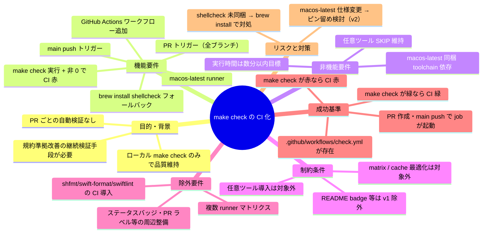
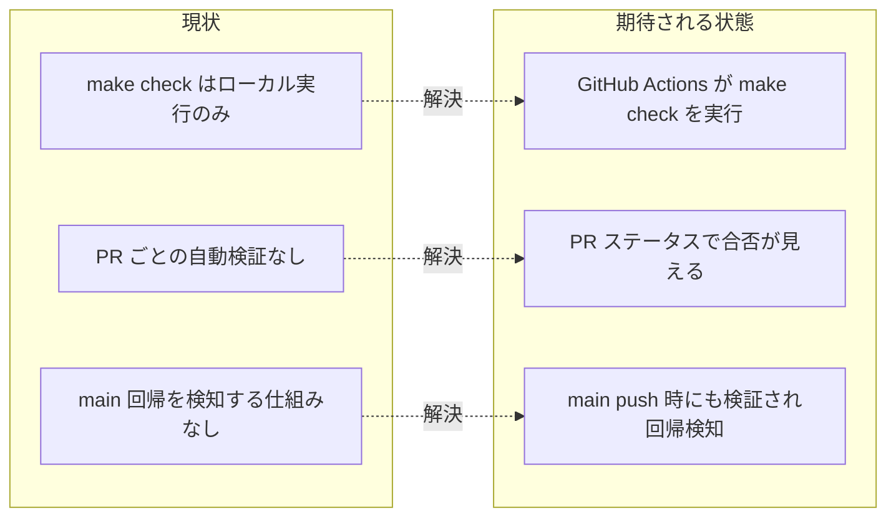

# 要求定義書: make check の GitHub Actions 化

**プロジェクト名**: make check の GitHub Actions 化
**作成日**: 2026 年 05 月 28 日
**最終更新**: 2026 年 05 月 28 日

> **重要**:
>
> - 要求定義書は、プロジェクトの全体像を把握するためのものです。詳細な技術仕様や実装方法は要件定義書以降で記載します。必要最低限の情報に収めることを心掛けてください。
> - **このドキュメントは常に更新**: 要求の変更や追加があった場合は、即座にこのドキュメントを更新してください。
>
> **用語**: [.agents/CONCEPTS.md §用語規約](../../.agents/CONCEPTS.md#用語規約) を参照。

---

## 要求定義の全体像

**注意**:

- マインドマップは全体像を把握するためのものです。主要なセクション名程度に留め、詳細は記載しないでください。

---

## 1. 目的・背景

### 1.1 目的（必須）

PR と main push のたびに `make check` を GitHub Actions で自動実行し、品質基盤を常時検証する。

### 1.2 背景

- **現状の課題**:
  - 先行 issue `.workflow/20260528_121550_make_check導入/` で `make check` を整備したが、CI ワークフロー実体は §5 で「対象外」と除外されており未整備。
  - PR レビュー時に lint / format / 循環 / セキュリティ / test の検証はレビュアの手元実行に依存しており、漏れる余地がある。
  - `.github/workflows/` がリポジトリに存在せず、CI 連携の起点もまだない（先行 issue 00 §1.2 で記載のとおり）。

- **必要性**:
  - 規約準拠改善（先行先行 issue `.workflow/close/20260527_225413_規約準拠改善/`）で整備した規約と、先行 issue で整備した `make check` を継続的に PR 単位で検証する仕組みが必要。
  - main へのマージ後に回帰が混入していないことを push で確実に検出したい。

### 1.3 期待される効果（必須: 1 件以上）

- **効果 1**: PR が作成・更新されると、自動で `make check` が走り、結果が PR ページから確認できる（○/× 判定可）。
- **効果 2**: main への push 後にも `make check` が走り、merge 起因の回帰を即座に検出できる。
- **効果 3**: shellcheck が runner に未導入でも `brew install shellcheck` のフォールバックで自動的に整備され、CI 設定の失敗で本来検証したい lint 結果が埋もれない。

**現状と期待される状態の比較**:

---

## 2. 機能要件

### 2.1 既存機能の維持（該当する場合）

- 既存 `Makefile` の `check / lint / lint-shell / lint-shfmt / lint-swift-format / lint-swiftlint / check-cycles / security-scan / test / test-swift / test-shell` ターゲットおよび `scripts/lint/`, `scripts/test/` 配下は本 issue では変更しない。CI から呼び出すのみ。

### 2.2 新規機能要件

- `.github/workflows/check.yml`（新規）: GitHub Actions ワークフロー定義。
  - **トリガー**: `pull_request`（branches 指定なし＝全ブランチへの PR） + `push: branches: [main]`。
  - **job**: 1 つ。`runs-on: macos-latest`。
  - **step**:
    1. `actions/checkout@v4`（または当時の安定タグ）
    2. `command -v shellcheck` で存在確認し、無ければ `brew install shellcheck` を実行（既に入っていれば skip）。
    3. `make check` を実行。終了コード非 0 で job 失敗（= CI 赤）。

---

## 3. 非機能要件

### 3.1 パフォーマンス

- macos-latest 上で 1 回の `make check` 実行が**数分以内**で完了することを目標とする（チェックアウト + shellcheck 確認/インストール + make check の合計）。

### 3.2 セキュリティ

- 自前トークン・シークレットを発行しない。`GITHUB_TOKEN` の読取権限のみで動作する範囲に留める（権限明示は v1 では必須としない）。
- `make check` 内部の `security-scan` が引き続き機能することを CI 上でも検証する（先行 issue の AT5 相当）。

### 3.3 互換性

- macos-latest（GitHub 提供）に**同梱される**または brew で導入可能な範囲のツールに限る。Linux runner / self-hosted runner はサポート外。
- bash 3.2 / zsh 互換は先行 issue で担保済みのため、本 issue では CI 上の再現性のみ確認。

### 3.4 保守性

- ワークフローは 1 ファイル（`.github/workflows/check.yml`）に閉じ込め、Makefile 側にロジックを集約することで保守容易性を確保する（CI 設定 = 薄いラッパー、ロジック = Makefile + scripts/lint）。

---

## 4. 制約条件

### 4.1 技術的制約

- **runner**: `macos-latest` 固定（make check は macOS / bash 3.2 互換前提、swift test 同梱の活用）。`evidence_source: human_decision`（ユーザー回答 1）。
- **トリガー**: `pull_request`（全ブランチ） + `push: branches: [main]`。branches 指定なしの pull_request は GitHub Actions のデフォルトでターゲットブランチに関係なく動作する。`evidence_source: human_decision`（ユーザー回答 2）+ `external_spec`（GitHub Actions 仕様）。
- **shellcheck**: macos-latest には**標準同梱されない場合がある**ため、job 内で存在確認し、無ければ `brew install shellcheck` を実行する。`evidence_source: human_decision`（ユーザー回答 4）。

### 4.2 既存システムとの互換性

- 既存 `Makefile`・`scripts/lint/`・`scripts/test/` には変更を加えない。CI 側から `make check` を呼ぶだけに留め、ローカル実行と完全に同じ経路で検証する。

### 4.3 移行期間・スケジュール

- 単一 PR で完結。段階移行不要。

---

## 5. 除外要件

- **任意ツール（shfmt / swift-format / swiftlint）の CI 導入**は対象外。`make check` 側で SKIP のまま完走させる。`evidence_source: human_decision`（ユーザー回答 3）。
- **複数 runner マトリクス**（ubuntu-latest / 異なる macos バージョン等）は対象外。
- **キャッシュ最適化**（`actions/cache`・brew キャッシュ等）は対象外。
- **README へのステータスバッジ追加**は v1 では対象外。
- **PR ラベル自動化・Required Status Checks 設定**は GitHub 側設定であり、本 issue の対象外（ワークフロー実体の整備のみ）。

---

## 6. 成功基準（必須: 1 件以上）

- `.github/workflows/check.yml` がリポジトリに存在し、構文エラーがない（GitHub Actions が parse できる）。
- 任意のブランチで PR を作成すると、check ワークフローが起動する。
- main ブランチへの push でも check ワークフローが起動する。
- ワークフロー実行内で `make check` が緑（全 OK または任意ツール SKIP のみ）の場合、CI ステータスは緑になる。
- ワークフロー実行内で `make check` が非 0 終了する場合、CI ステータスは赤になる。
- shellcheck が runner に未導入の場合でも、job 内 `brew install shellcheck` フォールバックにより lint-shell ステップが SKIP ではなく実行され、結果が反映される。
- 受け入れテスト: `01_要件定義.md` の BDD シナリオ AT-1〜AT-6 がすべて通過する。

---

## 7. リスクと対策

### 7.1 技術的リスク

- **リスク**: macos-latest の Xcode / CLI 同梱バージョン変更で `swift test` の挙動が変わる（既存 `Makefile` は XCTest 非搭載なら SKIP するため致命的ではないが、想定外の失敗が出る可能性）。
  - **対策**: 初回 CI 実行で `make check` ログを確認し、必要なら別 issue で runner バージョンのピン留めや Xcode セットアップステップ追加を検討する（本 issue 範囲外）。

- **リスク**: `brew install shellcheck` がネットワーク・Homebrew リポジトリ側の事情で失敗する。
  - **対策**: ステップは「無ければ install」の条件付き実行とし、失敗時はエラーメッセージで原因が分かるようにする（`set -e` 配下で `brew install` の標準的な失敗ログを残す）。

- **リスク**: pull_request トリガーを branches 無指定にしたことで、長期保守ブランチ等への PR まで毎回起動し runner 時間を消費する。
  - **対策**: 当面は許容（規模が小さい）。将来必要に応じて branches フィルタを追加する別 issue を立てる。

### 7.2 スケジュールリスク

- 単一ファイル追加で完結する規模のため特になし。

---

## 8. 参考資料

### プロジェクトドキュメント

- 先行 issue: [`.workflow/20260528_121550_make_check導入/`](../20260528_121550_make_check導入/)
  - [`00_要求定義.md`](../20260528_121550_make_check導入/00_要求定義.md) §5 で「CI ワークフローの実体作成は対象外」と除外されている根拠。
  - [`01_要件定義.md`](../20260528_121550_make_check導入/01_要件定義.md) §5 受け入れテスト AT1〜AT7 が `make check` の振る舞いを規定している。
  - [`02_設計.md`](../20260528_121550_make_check導入/02_設計.md) §2.1〜§3.9 が `make check` の責務分割・コマンド引数を規定。
  - [`03_実装計画.md`](../20260528_121550_make_check導入/03_実装計画.md) §2 タスク分解 T1〜T12 の成果物が現状のリポジトリ実体。
  - [`04_review.md`](../20260528_121550_make_check導入/04_review.md) §3 で `make check` の現状 0 終了・shell tests 41 PASS を実証済み。
- 先々行 issue（規約準拠改善）: `.workflow/close/20260527_225413_規約準拠改善/`

### その他の参考資料

- [`Makefile`](../../Makefile) — 既存 `check` ターゲット定義（80〜117 行目あたり）。
- GitHub Actions 仕様: <https://docs.github.com/actions>（`pull_request` / `push` トリガー、`macos-latest` runner、`actions/checkout@v4`）

---

## 9. 次のステップ

この要求定義書の承認後、以下のドキュメントを作成します：

- **次**: [`01_要件定義.md`](./01_要件定義.md) - 要件定義フェーズ
