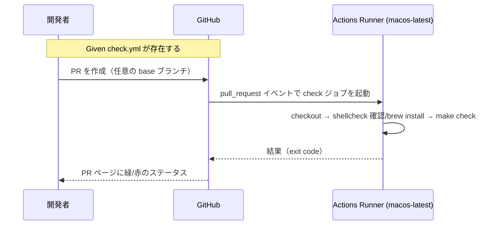

# 要件定義書: make check の GitHub Actions 化

**プロジェクト名**: make check の GitHub Actions 化
**作成日**: 2026 年 05 月 28 日
**最終更新**: 2026 年 05 月 28 日

> **重要**: 要件の変更・追加があれば即座に反映する。
>
> **用語**: [.agents/CONCEPTS.md §用語規約](../../.agents/CONCEPTS.md#用語規約) を参照。

---

## 1. 概要

### 1.1 システム概要

`.github/workflows/check.yml` を新規追加し、GitHub Actions 上で `macos-latest` runner を 1 つ起動して `make check` を実行する CI を整備する。トリガーは「全ブランチへの PR」および「main への push」。shellcheck が runner に未導入の場合は job 内で `brew install shellcheck` を実行してから `make check` を呼ぶ。任意ツール（shfmt / swift-format / swiftlint）は CI でも導入せず、`make check` 内で SKIP のまま完走させる。

### 1.2 用語集

| 用語              | 説明                                                                                  |
| ----------------- | ------------------------------------------------------------------------------------- |
| check ワークフロー | 本 issue で追加する `.github/workflows/check.yml` の GitHub Actions ワークフロー       |
| job               | check ワークフロー内で `macos-latest` を実行する単一の GitHub Actions ジョブ           |
| runner            | GitHub が提供する CI 実行環境。本 issue では `macos-latest` を使用                     |
| 任意ツール        | shfmt / swift-format / swiftlint（先行 issue で SKIP 設計済み。本 issue でも導入せず） |
| SKIP              | `make check` の任意ツール段階でツール不在時に出力する標識。終了コードには影響しない    |

---

## 2. 機能要件

### 2.1 ユーザーストーリー

#### ストーリー 1: 開発者が PR 作成時に CI 結果を確認する

- **As a** 開発者
- **I want to** PR を作成・更新したら GitHub 上で自動的に `make check` が走り、合否が PR ページから見える
- **So that** レビュアは手元で再現する前に、品質基盤の合否を一目で把握できる

**受け入れ基準**:

- 任意のブランチを base とする PR の作成・push（同期）で check ワークフローが起動する。
- PR ページのチェック欄に check ワークフローのステータスが表示される。
- ワークフロー結果が緑のとき、PR のステータスも緑（成功）になる。

#### ストーリー 2: メンテナが main push 後の回帰を検知する

- **As a** メンテナ
- **I want to** main に push が入った後にも自動で `make check` が走る
- **So that** マージ後に持ち込まれた回帰（lint / cycles / security / test）を早期検知できる

**受け入れ基準**:

- `main` ブランチへの push（マージ含む）で check ワークフローが起動する。
- 失敗時はワークフローが赤になり、Actions タブから失敗ログを確認できる。

#### ストーリー 3: 任意ツールが未導入でも CI を緑にする

- **As a** 開発者
- **I want to** shfmt / swift-format / swiftlint を CI に導入しなくても check ワークフローが完走する
- **So that** 任意ツール導入の運用コストを避けつつ、必須検証（shellcheck / cycles / security / test）だけを CI で守れる

**受け入れ基準**:

- check ワークフロー内で `make check` を実行したとき、shfmt / swift-format / swiftlint は `[SKIP]` 行を出すだけで成功扱いとなる。
- 必須検証（shellcheck / check-cycles / security-scan / test）はすべて実行される。

#### ストーリー 4: shellcheck 未同梱環境でも lint-shell が機能する

- **As a** 開発者
- **I want to** macos-latest に shellcheck が標準同梱されていない場合でも、job 内で自動的に導入される
- **So that** lint-shell が「ツール不在による失敗」で潰れず、本来検出すべき lint 問題が CI で検出される

**受け入れ基準**:

- job の早い段階で shellcheck の存在を確認する step が走る。
- shellcheck が PATH に無ければ `brew install shellcheck` を実行する。既に入っていれば再インストールしない（skip）。
- `make check` 実行時には shellcheck が PATH 上に存在し、`run-shellcheck.sh` が SKIP ではなく実行される。

### 2.2 BDD ユースケース

#### ユースケース 1: PR 作成時に check ワークフローが起動する

**シナリオ 1: 任意のブランチを base とする PR で起動する**

```gherkin
Feature: PR トリガーでの自動検証
  Scenario: 全ブランチへの PR で起動
    Given .github/workflows/check.yml が main ブランチに存在する
    And  開発者が feature/foo ブランチから develop ブランチへの PR を作成する
    When  GitHub が pull_request イベントを発火する
    Then  check ワークフローが起動する
    And   PR ページに check ジョブのステータスが表示される
```

**処理フロー**:



#### ユースケース 2: main push 時に check ワークフローが起動する

**シナリオ 2: main への push（直 push または PR マージ）で起動する**

```gherkin
Feature: main push トリガーでの自動検証
  Scenario: main への push で起動
    Given .github/workflows/check.yml が main に存在する
    And  PR がマージされて main に push される
    When  GitHub が push イベントを branches: [main] で発火する
    Then  check ワークフローが起動する
    And   main の Actions タブに実行履歴が記録される
```

#### ユースケース 3: make check 結果が CI ステータスに反映される

**シナリオ 3: make check が 0 終了したら CI 緑**

```gherkin
Feature: make check の終了コードを CI に反映
  Scenario: 全パスで CI 緑
    Given runner に shellcheck が利用可能（brew install フォールバック後を含む）
    And  リポジトリのコードに lint / cycles / security / test の違反がない
    When  check ジョブで make check を実行する
    Then  make check は exit 0 で完了する
    And   GitHub Actions の job ステータスは success（緑）になる
```

**シナリオ 4: make check が非 0 終了したら CI 赤**

```gherkin
Feature: make check 失敗を CI に反映
  Scenario: いずれかの検証失敗で CI 赤
    Given runner に shellcheck が利用可能
    And  リポジトリのいずれかの検証（shellcheck / cycles / security / test）が違反を含む
    When  check ジョブで make check を実行する
    Then  make check は非 0 終了する
    And   GitHub Actions の job ステータスは failure（赤）になる
    And   Actions ログに make check の失敗サマリ「==> some checks failed」が出力される
```

#### ユースケース 4: shellcheck の自動導入フォールバック

**シナリオ 5: shellcheck 未導入時に brew install で導入される**

```gherkin
Feature: shellcheck 自動導入
  Scenario: PATH に shellcheck が無いとき brew install を実行
    Given runner（macos-latest）に shellcheck が同梱されていない
    When  check ジョブの shellcheck 存在確認ステップが走る
    Then  command -v shellcheck が非 0 を返す
    And   brew install shellcheck が実行される
    And   その後の make check 内で shellcheck が PATH に解決される
```

**シナリオ 6: shellcheck が既に導入済みなら brew install を skip**

```gherkin
Feature: shellcheck 自動導入
  Scenario: PATH に shellcheck がある場合は brew install を実行しない
    Given runner（macos-latest）に shellcheck が同梱されている
    When  check ジョブの shellcheck 存在確認ステップが走る
    Then  command -v shellcheck が 0 を返す
    And   brew install shellcheck は実行されない（ステップが skip 相当の出力で終了）
    And   make check は通常どおり実行される
```

### 2.3 ビジネスルール

- check ワークフローは「PR が走る経路」「main への push の経路」の 2 つだけをトリガーとする。手動 dispatch・schedule・他イベントは v1 では対象外。
- ワークフローのロジックは Makefile / scripts/lint に集約し、`.github/workflows/check.yml` には実行制御（checkout / shellcheck フォールバック / make check 呼び出し）のみを書く。

---

## 3. 非機能要件

### 3.1 パフォーマンス要件

- 1 回のワークフロー実行時間は **数分以内**（チェックアウト + brew install（必要時のみ） + make check）。先行 issue 04_review §3.1 で `make check` 自体は数秒〜10 秒オーダーであることが実証済みである（`evidence_source: test_output`）。CI 全体としても 5 分以内を目標とする。

### 3.2 セキュリティ要件

- 自前のシークレットや個人アクセストークンを require しない。`GITHUB_TOKEN` の default 権限のみで動作する。
- ワークフロー内で実行する `make check` の `security-scan` ステップが秘密情報パターン・危険パターンを CI 上でも検出することを担保する（先行 issue AT5 と同等）。
- 第三者 PR からの workflow 実行が機密情報を漏洩しないこと（v1 では機密情報を一切扱わない設計で達成）。

### 3.3 ユーザビリティ要件

- PR ページのステータスチェックから 1 クリックで Actions のログにジャンプできる（GitHub の標準挙動）。
- 失敗時、ログには `make check` 内のステップ単位（lint-shell / check-cycles / security-scan / test 等）の OK / FAILED が確認できる（既存 `Makefile` の出力をそのまま使う）。

### 3.4 可用性要件

- GitHub Actions 側の障害は本 issue の範囲外。runner が起動できない場合の代替手段（self-hosted 等）は v2 以降で検討。
- shellcheck の `brew install` がネットワーク要因等で失敗した場合は job が赤になる。これは検出すべき異常として扱い、自動リトライ等は組み込まない（v1 シンプル維持）。

---

## 4. 外部インターフェース要件

### 4.1 API 要件

- 本 issue は外部 API を呼ばない。GitHub Actions の標準アクション（`actions/checkout`）と Homebrew（`brew install`）のみを利用する。

### 4.2 データ形式要件

- ワークフロー定義ファイルは YAML 形式。GitHub Actions の workflow syntax に準拠する（`name`, `on`, `jobs`, `runs-on`, `steps` 等）。

---

## 5. 受け入れテスト

| ID  | シナリオ                                                | 期待結果                                                                                            | 確認方法                                                                                  |
| --- | ------------------------------------------------------- | --------------------------------------------------------------------------------------------------- | ----------------------------------------------------------------------------------------- |
| AT1 | 任意ブランチへの PR で check ワークフローが起動         | PR ページに check ステータスが表示される                                                            | PR 作成後に GitHub Actions タブで run を確認                                               |
| AT2 | main への push で check ワークフローが起動              | Actions タブの main ブランチ実行履歴に run が追加される                                             | main マージ後 / 直接 push 後に Actions タブを確認                                          |
| AT3 | make check が緑のとき CI 緑                             | job ステータス success（緑）。ログ末尾に `==> all checks passed`                                    | run の終了状態と log を確認                                                                |
| AT4 | make check が赤のとき CI 赤                             | job ステータス failure（赤）。ログに `==> some checks failed`                                       | 一時的にコードを壊して PR を立てる or 別 issue で reproduction PR を作る（v1 では未自動化） |
| AT5 | shellcheck 未導入 runner で brew install フォールバック | shellcheck 確認ステップで未検出 → `brew install shellcheck` 実行 → 以後の make check で lint-shell 実行 | 初回 CI 実行ログを確認                                                                     |
| AT6 | shellcheck 同梱 runner では brew install skip           | `command -v shellcheck` が 0 → install は実行されない                                               | runner が既に同梱する状況での run ログ。同梱変更後の追跡で確認                              |

**注**: AT4 は v1 では「失敗注入用 PR」を自動で常設しない。実装時に検証用に一時的にコードを壊して動作確認するか、レビューフェーズで先行 issue と同様に `__force_fail.sh` 注入で実証する（先行 issue 04_review §4 AT6 の手順を参考）。

---

## 6. 参考資料

### プロジェクトドキュメント

- [`00_要求定義.md`](./00_要求定義.md) - 要求定義
- 先行 issue: [`.workflow/20260528_121550_make_check導入/`](../20260528_121550_make_check導入/)
  - [`00_要求定義.md`](../20260528_121550_make_check導入/00_要求定義.md) §5（CI ワークフローの実体作成は対象外＝本 issue の範囲）
  - [`01_要件定義.md`](../20260528_121550_make_check導入/01_要件定義.md) §5（AT1〜AT7：make check の振る舞い前提）
  - [`02_設計.md`](../20260528_121550_make_check導入/02_設計.md) §3.1（`make check` のターゲット定義）
  - [`04_review.md`](../20260528_121550_make_check導入/04_review.md) §3〜§4（`make check` の現状緑実証）

### その他の参考資料

- [`Makefile`](../../Makefile)（既存 `check` ターゲット）
- GitHub Actions ドキュメント:
  - `pull_request` / `push` トリガー: <https://docs.github.com/actions/using-workflows/events-that-trigger-workflows>
  - `macos-latest` runner: <https://docs.github.com/actions/using-github-hosted-runners/about-github-hosted-runners>
  - `actions/checkout@v4`: <https://github.com/actions/checkout>

---

## 7. 前のステップ

この要件定義書は、以下のドキュメントを基に作成されています：

- **前**: [`00_要求定義.md`](./00_要求定義.md) - 要求定義フェーズ

---

## 8. 次のステップ

この要件定義書の承認後、以下のドキュメントを作成します：

- **次**: [`02_設計.md`](./02_設計.md) - 設計フェーズ
