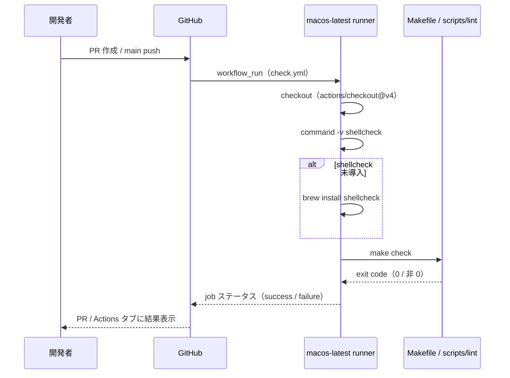
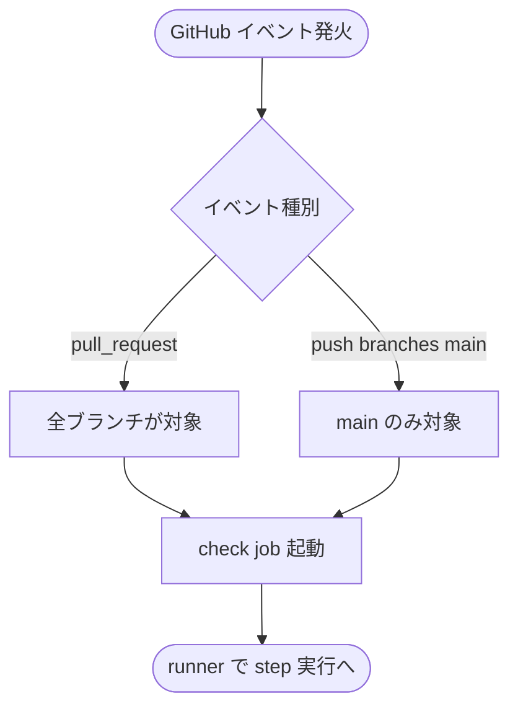
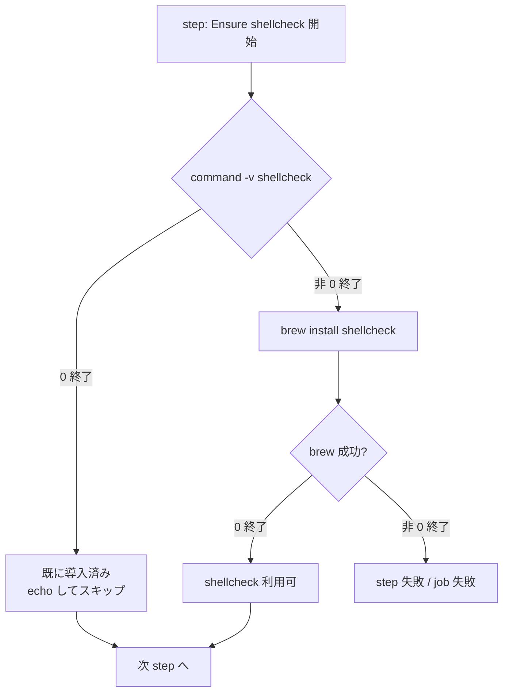
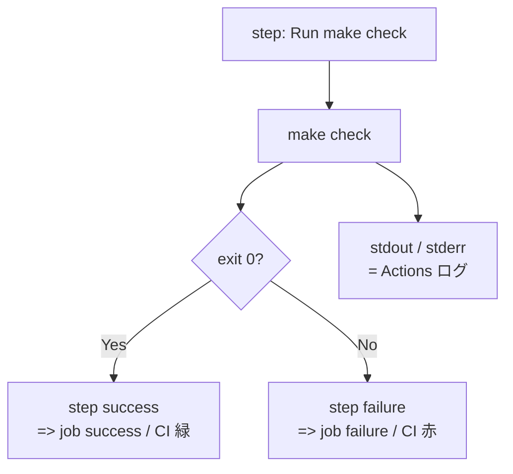

# 設計書: make check の GitHub Actions 化

**プロジェクト名**: make check の GitHub Actions 化
**作成日**: 2026 年 05 月 28 日
**最終更新**: 2026 年 05 月 28 日

> **重要**: **このドキュメントは常に更新**: 設計の変更や追加があった場合は、即座にこのドキュメントを更新してください。ドキュメントは「生きているドキュメント」として扱い、実装内容と常に同期させます。
>
> **用語**: [.agents/CONCEPTS.md §用語規約](../../.agents/CONCEPTS.md#用語規約) を参照。

---

## 1. 設計概要

### 1.1 設計方針

GitHub Actions の workflow は**薄い実行制御層**に留め、検証ロジックは既存の `Makefile` / `scripts/lint/`（先行 issue で整備済み）に集約する。`.github/workflows/check.yml` 1 ファイルで完結させ、runner 環境差分（shellcheck 未同梱）の吸収のみを CI 側で行う。UNIX 哲学（小さく作る・組み合わせ可能）と単一責務に従う。

### 1.2 設計原則（本プロジェクトで適用するもの）

- **UNIX 哲学**: workflow は GitHub Actions が提供するアクション（`actions/checkout`）と `make check` の合成のみで構成する。新規スクリプトは作らない（既存資産の合成で達成）。
- **単一責務**: 本 workflow の責務は「PR / main push に反応して `make check` を runner 上で実行し、終了コードを CI ステータスに反映する」のみ。lint・cycle・security・test の各検証ロジックは `Makefile` / `scripts/lint/` の責務に閉じ込めたまま再利用する。
- **明確な境界**: 「CI 設定（`.github/workflows/check.yml`）」と「検証ロジック（`Makefile` + `scripts/lint/`）」を明確に分離する。CI 設定は薄いラッパーに徹し、検証コマンド引数・閾値・SKIP 戦略は Makefile 側に閉じ込める。
- **AI フレンドリー設計**: 1 ファイル・1 job・3〜4 step の小さな構成で、YAML を一読すれば挙動が把握できる粒度を維持する。

> 本 issue では Command/Query 分離・イベント駆動は採用しない（単一同期実行で十分なため。spec/06 §「イベント駆動は拡張性のために使うが、単純な同期処理で十分な場合は無理に導入しない」に従う）。

---

## 2. アーキテクチャ設計

### 2.1 責務・境界・参照関係

[01\_設計原則 §明確な境界・§単一責務](../../.agents/spec/01_設計原則.md) に従い、コンポーネントの責務・境界・参照関係を明示する。

#### 2.1.1 責務一覧

| コンポーネント | 責務（1 文） |
| -------------- | ------------ |
| `.github/workflows/check.yml`（新規） | PR / main push をトリガーに macos-latest runner で `make check` を実行し終了コードを CI ステータスへ反映する |
| `actions/checkout@v4`（外部） | リポジトリの作業ツリーを runner 上にチェックアウトする |
| `shellcheck` 存在確認 step（workflow 内インライン） | runner の PATH に `shellcheck` があるか確認し、無ければ `brew install shellcheck` で導入する |
| `make check` 実行 step（workflow 内インライン） | 既存 `Makefile` の `check` ターゲットを呼び出して lint / cycles / security / test を順次実行し、非 0 終了で job を失敗にする |
| 既存 `Makefile` + `scripts/lint/`（先行 issue 成果物） | 検証ロジックの正本。本 issue では呼び出すのみで一切変更しない |

#### 2.1.2 境界

- **入力**: GitHub の `pull_request` / `push` イベント（branches: [main]）。チェックアウトされた作業ツリー。
- **出力**: GitHub Actions の job ステータス（success / failure）。Actions ログ（`make check` の標準出力・標準エラー）。
- **他責務との境界**: 
  - **他 issue との切り分け**: 検証ロジックそのもの（lint / format / cycles / security / test の振る舞い・コマンド引数・SKIP 戦略）は先行 issue `.workflow/20260528_121550_make_check導入/` が正本。本 issue ではそれを変更しない。
  - **GitHub 側設定との切り分け**: Required Status Checks の設定・PR ラベル自動化・ステータスバッジ等は GitHub 側のリポジトリ設定であり、workflow ファイルの責務外（00 §5 で明示的に除外）。
  - **キャッシュ最適化との切り分け**: `actions/cache` 等によるツール・ビルド成果物のキャッシュは v2 以降の検討範囲（01 §4 / §5 で除外）。

#### 2.1.3 参照関係

- GitHub Actions runtime → `.github/workflows/check.yml`
- `.github/workflows/check.yml` → `actions/checkout@v4`（外部 action / メジャー pin）
- `.github/workflows/check.yml` → `brew install shellcheck`（runner 同梱の Homebrew）
- `.github/workflows/check.yml` → `make check`（既存 `Makefile` ターゲット）
- `make check` → `scripts/lint/*.sh`（先行 issue の依存・本 issue では変更なし）

参照は単方向。循環なし。`scripts/lint/` から workflow ファイルへの逆参照は存在しない。

### 2.2 システムアーキテクチャ

[`.agents/spec/01_設計原則.md`](../../.agents/spec/01_設計原則.md) および [`.agents/spec/06_設計判断の優先順位.md`](../../.agents/spec/06_設計判断の優先順位.md) を踏まえて選択する。

- **採用パターン**: **Thin Wrapper（薄いラッパー）** + **Pipeline 再利用**。GitHub Actions workflow は CI イベントを `make check`（先行 issue が確立済みの Pipeline）に橋渡しする薄い層に徹する。
- **根拠**: 仕様との整合性（先行 issue が `make check` で検証パイプラインを既に確立済み）と可読性（YAML 1 ファイルで挙動が完結）を最優先（spec/06 優先順位 1〜3）。新たな抽象や cache 層は導入せず、シンプルな同期実行で要件 AT1〜AT6 を満たす。

#### 2.2.1 アーキテクチャ図

```mermaid
flowchart LR
    subgraph GH["GitHub"]
      PR[Pull Request イベント<br/>全ブランチ]
      PU[Push イベント<br/>branches: main]
    end

    subgraph Runner["macos-latest runner"]
      CO[actions/checkout@v4<br/>作業ツリー取得]
      SC{shellcheck<br/>PATH 存在?}
      BI[brew install shellcheck]
      MK[make check<br/>= lint-shell / lint-shfmt /<br/>lint-swift-format / lint-swiftlint /<br/>check-cycles / security-scan / test]
      EX[exit code]
    end

    PR --> CO
    PU --> CO
    CO --> SC
    SC -- あり --> MK
    SC -- なし --> BI --> MK
    MK --> EX
    EX --> Status[job ステータス<br/>success / failure]
```

`evidence_source: external_doc`（GitHub Actions ワークフロー構文・runner 仕様: <https://docs.github.com/actions/using-workflows/workflow-syntax-for-github-actions>, <https://docs.github.com/actions/using-github-hosted-runners/about-github-hosted-runners>）。

### 2.3 コンポーネント構成

本 issue で新規に追加するコンポーネントは**ファイル 1 つ**のみ。

- `.github/workflows/check.yml`（新規）
  - 単一 job（`check`）。
  - 3 step：
    1. `Checkout repository`（`actions/checkout@v4`）
    2. `Ensure shellcheck`（インラインシェルでフォールバック導入）
    3. `Run make check`（インラインシェルで `make check` を実行）
  - workflow / job レベルの設定：`permissions: contents: read`（最小権限）、`timeout-minutes: 30`、`concurrency`（同一参照の進行中 run をキャンセル）。

責務・境界は §2.1 と一致。3 step を超えて肥大化させない（AI フレンドリー設計）。

### 2.4 データフロー

本 issue は「同期実行」であり、イベント駆動（UserCreated 等のドメインイベント発行）は採用しない。GitHub Actions のイベント（pull_request / push）が起点となり、runner 上で同期的に make check を実行し、終了コードで成否を返す。



---

## 3. 機能設計

### 3.1 機能 1: PR / main push トリガーでの check 起動

#### 3.1.1 概要

`.github/workflows/check.yml` の `on:` セクションで `pull_request`（branches 指定なし＝全ターゲット）と `push: branches: [main]` を宣言し、両イベントで同一 job を起動する。

#### 3.1.2 処理フロー



#### 3.1.3 入力・出力

- **入力**: GitHub イベントペイロード（pull_request / push）。
- **出力**: check job の起動（runner プロビジョニング）。

#### 3.1.4 エラーハンドリング

- 該当イベント以外（schedule / workflow_dispatch 等）では起動しない（v1 では未対応・01 §2.3 で除外）。

### 3.2 機能 2: shellcheck フォールバック導入

#### 3.2.1 概要

runner の PATH に `shellcheck` が無いとき、`brew install shellcheck` を実行して導入する。既にあれば skip する。

#### 3.2.2 処理フロー



#### 3.2.3 入力・出力

- **入力**: runner の PATH 状態。
- **出力**: shellcheck コマンドが PATH 上に解決可能な状態（または step 失敗）。

#### 3.2.4 エラーハンドリング

- `brew install` の失敗は step 失敗とし、job も失敗とする（自動リトライしない・01 §3.4 に従う）。
- `set -eo pipefail` 配下で実行し、失敗時の標準エラーログを Actions ログに残す。

#### 3.2.5 実装スニペット（設計レベル）

```yaml
- name: Ensure shellcheck
  shell: bash
  run: |
    set -eo pipefail
    if command -v shellcheck >/dev/null 2>&1; then
      echo "shellcheck already available: $(shellcheck --version | head -n1 | awk '{print $2}')"
    else
      echo "shellcheck not found; installing via Homebrew"
      brew install shellcheck
    fi
```

> `evidence_source: external_doc`（Homebrew on macOS runners: <https://docs.github.com/actions/using-github-hosted-runners/about-github-hosted-runners>）。

### 3.3 機能 3: make check 実行と CI ステータス反映

#### 3.3.1 概要

`make check` を呼び出し、終了コードを step の終了コードとして返す。GitHub Actions の挙動として、step 失敗 = job 失敗 = CI 赤となる。

#### 3.3.2 処理フロー



#### 3.3.3 入力・出力

- **入力**: チェックアウト済みの作業ツリー、PATH 上の shellcheck。
- **出力**: 終了コード（0 / 非 0）、Actions ログ（`==> all checks passed` / `==> some checks failed` を含む）。

#### 3.3.4 エラーハンドリング

- `make check` の標準エラーはそのまま Actions ログへ流し、step を失敗させる（追加のラップ・トラップは加えない＝薄いラッパー方針）。

#### 3.3.5 実装スニペット（設計レベル）

```yaml
- name: Run make check
  shell: bash
  run: make check
```

### 3.4 機能 4: workflow 全体の安全設定

#### 3.4.1 概要

最小権限・タイムアウト・並行実行制御を workflow / job レベルで明示する。

#### 3.4.2 設定値（設計レベル）

```yaml
permissions:
  contents: read

concurrency:
  group: check-${{ github.workflow }}-${{ github.ref }}
  cancel-in-progress: true

jobs:
  check:
    runs-on: macos-latest
    timeout-minutes: 30
```

- `permissions: contents: read`: 最小権限（書き込み不要）。`evidence_source: external_doc`（<https://docs.github.com/actions/security-guides/automatic-token-authentication>）。
- `concurrency` + `cancel-in-progress: true`: 同一 PR への連続 push 時に古い run を自動キャンセルし runner 時間を節約する。`evidence_source: external_doc`（<https://docs.github.com/actions/using-jobs/using-concurrency>）。
- `timeout-minutes: 30`: 想定実行時間（数分以内）の十分な上限。暴走時の保険。`evidence_source: external_doc`（<https://docs.github.com/actions/using-jobs/setting-a-maximum-execution-time-for-a-job>）。

#### 3.4.3 v1 で含めない設定

- `actions/cache`（キャッシュ）: 01 §4 / §5 / 00 §5 で除外。
- `strategy.matrix`: 単一 runner（macos-latest）のため不要（01 §5 / 00 §5）。
- `fail-fast`: 単一 job のため不要。

---

## 4. データ設計

本 issue は CI ワークフロー定義のみであり、新規データ構造・テーブル・スキーマは持たない。`.github/workflows/check.yml` は YAML 形式の構造化文書であり、その構造は GitHub Actions workflow syntax（外部仕様）に従う。

### 4.1 YAML 構造の全体像（設計レベル）

```yaml
name: check
on:
  pull_request:
  push:
    branches: [main]
permissions:
  contents: read
concurrency:
  group: check-${{ github.workflow }}-${{ github.ref }}
  cancel-in-progress: true
jobs:
  check:
    runs-on: macos-latest
    timeout-minutes: 30
    steps:
      - name: Checkout repository
        uses: actions/checkout@v4
      - name: Ensure shellcheck
        shell: bash
        run: |
          set -eo pipefail
          if command -v shellcheck >/dev/null 2>&1; then
            echo "shellcheck already available: $(shellcheck --version | head -n1 | awk '{print $2}')"
          else
            echo "shellcheck not found; installing via Homebrew"
            brew install shellcheck
          fi
      - name: Run make check
        shell: bash
        run: make check
```

> 上記は確定 YAML 構造の設計。03_実装計画 T1 で `.github/workflows/check.yml` として一字一句これに従って実装する（軽微な空白調整は除く）。`evidence_source: external_doc`（GitHub Actions workflow syntax）。

---

## 5. API 設計

本 issue は外部に公開する API（HTTP / RPC / SDK）を持たない。インターフェースは GitHub Actions のイベントと job 出力（終了コード・ログ）に閉じる。

### 5.1 インターフェース一覧

| インターフェース | 種別 | 説明 |
| ---------------- | ---- | ---- |
| `pull_request` イベント | 入力（GitHub → workflow） | 全ブランチへの PR 作成・更新で発火 |
| `push: branches: [main]` イベント | 入力（GitHub → workflow） | main への push で発火 |
| `actions/checkout@v4` | 外部 action | リポジトリのチェックアウト（メジャー pin） |
| `brew install shellcheck` | 外部 CLI | Homebrew 経由の shellcheck 導入（runner 同梱の brew を利用） |
| `make check` | 内部 CLI | 既存 `Makefile` の `check` ターゲット（先行 issue 02_設計 §3.1 の正本） |
| job 終了コード | 出力（workflow → GitHub） | 0=success / 非 0=failure。GitHub Actions の標準挙動でステータスに反映 |
| Actions ログ | 出力（workflow → GitHub） | step の標準出力 / 標準エラー。`==> all checks passed` / `==> some checks failed` を含む |

### 5.2 インターフェース詳細

#### I1: `pull_request` イベント

- **入力**: GitHub のイベントペイロード（branches 指定なし＝全ターゲットブランチが対象）。
- **出力**: check job の起動。
- **契約**: GitHub Actions workflow syntax に準拠（`evidence_source: external_doc`）。

#### I2: `push: branches: [main]` イベント

- **入力**: GitHub のイベントペイロード（`refs/heads/main` への push のみ）。
- **出力**: check job の起動。
- **契約**: `branches` フィルタは glob 形式可だが本 issue では完全一致 `main` のみを指定する。

#### I3: `actions/checkout@v4`

- **入力**: workflow の暗黙コンテキスト（リポジトリ・ref）。
- **出力**: runner 上の `$GITHUB_WORKSPACE` に作業ツリー。
- **契約**: メジャー pin `@v4`。マイナー以下は採用しない（最新マイナーの安定挙動を取り込むため）。

#### I4: shellcheck フォールバック（インライン step）

- **入力**: なし（PATH を参照）。
- **出力**: shellcheck CLI が PATH 上に解決可能。
- **契約違反時の扱い**: `brew install` 失敗 = step 失敗 = job 失敗。

#### I5: `make check`

- **入力**: 作業ツリー、PATH 上の shellcheck。
- **出力**: 終了コード（先行 issue 02_設計 §3.1 の挙動に従う）、Actions ログ。
- **契約**: 先行 issue 02_設計 §3.1〜§3.9 の規定をそのまま再利用。本 issue では変更しない。

---

## 6. テスト戦略

テスト観点の**定義**は [RULES.md §テスト戦略必須要件](../../.agents/RULES.md#テスト戦略必須要件) を、**BDD 形式**は [TEST_BDD_FORMAT.md](../../.agents/TEST_BDD_FORMAT.md) を参照する。本 issue は CI 設定（YAML）であり、ソースコード単体テスト（XCTest / shell tests）の追加対象は持たない。検証は**実環境（GitHub Actions）での発火確認**および**ローカル yaml lint**で実施する。

### 6.1 対象ごとのテスト割り当て

| 対象 | 単体 | 結合/API | E2E | クリティカル観点 | バリデーション観点 | 未達理由 / 補足 |
| --- | --- | --- | --- | --- | --- | --- |
| `.github/workflows/check.yml` の YAML 構文 | ○（yaml lint・GitHub の workflow parser） | × | × | YAML 構文エラーがないこと（`actionlint` / GitHub Actions の parse 成功） | `on` / `jobs` / `runs-on` 等の必須キー欠落がないこと | 単体は yaml lint 相当。`actionlint` 推奨だが任意（未導入なら GitHub 側の parse 結果で代替） |
| PR トリガー（AT1） | × | × | ○（E2E＝実 PR） | 全ブランチへの PR で check が発火する | branches 未指定で全ターゲットを拾うこと | E2E のみ。手元再現は GitHub UI が必要 |
| main push トリガー（AT2） | × | × | ○（E2E＝main マージ） | main push で check が発火する | branches: [main] のみで反応すること | 同上 |
| make check 緑 → CI 緑（AT3） | × | × | ○（E2E＝実 PR） | exit 0 で success | ログに `==> all checks passed` | 既存 make check が緑のときの素直な確認 |
| make check 赤 → CI 赤（AT4） | ○（一時的に `__force_fail.sh` を注入したローカル make check で 0/非 0 切り替えを再現） | × | ○（実 PR で実証） | exit 非 0 で failure | ログに `==> some checks failed` | ローカル再現 + 実 PR の両方で実証する（§6.2 参照） |
| shellcheck 未導入 → brew install（AT5） | × | × | ○（実 PR の初回 run ログ） | 未導入時に brew install が走る | brew install のログが Actions ログに残る | runner 環境依存。同梱されていなければ実証可能 |
| shellcheck 同梱 → install skip（AT6） | × | × | ○（実 PR の連続 run） | 既に導入済みなら brew install を実行しない | step ログに「already available」 | 同上 |

### 6.2 監査・レビューでの確認（証跡）

- **AT1〜AT3, AT5〜AT6 は実 PR の Actions 実行ログ**を 04_review §3 に `test_output` として貼り付ける（verify-and-close で実施）。
- **AT4 は二系統で確認**：
  - **ローカル再現**: 先行 issue `.workflow/20260528_121550_make_check導入/04_review.md §4 AT6` で採用した `__force_fail.sh` 注入手順を踏襲する。`scripts/test/__force_fail.sh`（`exit 1`）を作成し、Makefile の `test-shell` を一時的に書き換えて `make check` を実行 → 非 0 終了を確認 → 復元 → 再実行で 0 終了を確認する（03_実装計画 T5 に詳細手順）。
  - **実 PR 再現**: 同手順を含む確認用ブランチで PR を立て、CI が赤になることを Actions ログで確認する（v1 では確認後にコミットを破棄、もしくは PR は merge せず close）。
- 監査対象は本設計 §6.1 の表と 03_実装計画 §2 のタスク別 BDD（§2.x.3 / §2.x.4）が揃っていることを確認する。

---

## 7. UI 設計

CI 設定のみのため UI は存在しない。GitHub の標準 UI（PR の checks 欄、Actions タブ）で結果が表示される（01 §3.3）。

---

## 8. セキュリティ設計

### 8.1 認証・認可

- 自前のシークレット / PAT / API キーを使用しない。`GITHUB_TOKEN` のデフォルト権限のみ。
- **最小権限**: workflow レベルで `permissions: contents: read` を明示する（write 不要のため）。`evidence_source: external_doc`（<https://docs.github.com/actions/security-guides/automatic-token-authentication>）。
- 第三者 PR からの workflow_run 時にも機密情報を一切扱わない設計（00 §3.2 / 01 §3.2 に従う）。

### 8.2 データ保護

- workflow が扱うデータはチェックアウト済みのリポジトリ作業ツリーのみ。外部送信なし、書き込みなし。
- `make check` 内の `security-scan` ステップ（先行 issue 02_設計 §3.8）が CI 上でも機能することを担保する（AT3 で実証）。

---

## 9. 非機能要件への対応

### 9.1 パフォーマンス

- 1 回の実行で「checkout（数秒） + 必要時のみ brew install（数十秒オーダー） + make check（先行 issue 04_review §3.1 で実測数秒〜10 秒オーダー）」。合計 **5 分以内**を目標とする（01 §3.1）。`evidence_source: test_output`（先行 issue 04_review §3.1 / §6.1）。
- `concurrency.cancel-in-progress: true` により同一 PR 連続 push 時の重複 run を回避し、無駄な runner 時間を抑制する。

### 9.2 可用性

- GitHub Actions 側の障害は範囲外（01 §3.4）。
- brew install の失敗は自動リトライしない（01 §3.4 / 設計 §3.2.4）。

---

## 10. 設計判断の根拠（evidence_source 一覧）

| 設計判断 | 採用理由 | evidence_source |
| --- | --- | --- |
| `runs-on: macos-latest` | make check は macOS / bash 3.2 互換前提で設計済み（先行 issue） | human_decision（00 §4.1 ユーザー回答 1） |
| `pull_request`（branches 未指定）+ `push: branches: [main]` | 全 PR を検証しつつ main へのマージ後回帰を検出 | human_decision（00 §4.1 ユーザー回答 2）+ external_doc（GitHub Actions trigger syntax） |
| 任意ツール（shfmt / swift-format / swiftlint）の CI 導入なし | 運用コスト回避。make check 側で SKIP 完走できる | human_decision（00 §5 ユーザー回答 3） |
| shellcheck フォールバック（`brew install shellcheck`） | macos-latest に同梱されない場合があるため | human_decision（00 §4.1 ユーザー回答 4）+ external_doc（GitHub-hosted runners spec） |
| `actions/checkout@v4`（メジャー pin） | v4 が現行安定版 | external_doc（<https://github.com/actions/checkout>） |
| `permissions: contents: read` | 最小権限原則 | external_doc（<https://docs.github.com/actions/security-guides/automatic-token-authentication>） |
| `concurrency: cancel-in-progress: true` | 連続 push 時の runner 時間節約 | external_doc（<https://docs.github.com/actions/using-jobs/using-concurrency>） |
| `timeout-minutes: 30` | 想定数分実行に対する十分な上限・暴走時の保険 | external_doc（<https://docs.github.com/actions/using-jobs/setting-a-maximum-execution-time-for-a-job>） |
| `actions/cache` 不採用（v1） | スコープ外（00 §5 / 01 §4） | human_decision（00 §5） |
| AT4 実証手順 = `__force_fail.sh` 注入 + 実 PR の二系統 | 先行 issue で実証実績あり・再利用が最も安全 | existing_code + test_output（先行 issue 04_review §4 AT6） |

---

## 11. 参考資料

### プロジェクトドキュメント

- [`00_要求定義.md`](./00_要求定義.md)
- [`01_要件定義.md`](./01_要件定義.md)
- [`memo/20260528_140256_実装前ドキュメントレビュー.md`](./memo/20260528_140256_実装前ドキュメントレビュー.md)
- 先行 issue: [`.workflow/20260528_121550_make_check導入/02_設計.md`](../20260528_121550_make_check導入/02_設計.md) §3.1 / §3.2〜§3.9
- 先行 issue: [`.workflow/20260528_121550_make_check導入/04_review.md`](../20260528_121550_make_check導入/04_review.md) §3 / §4 AT6（AT4 実証パターン）

### その他の参考資料

- GitHub Actions workflow syntax: <https://docs.github.com/actions/using-workflows/workflow-syntax-for-github-actions>
- GitHub-hosted runners（macos-latest）: <https://docs.github.com/actions/using-github-hosted-runners/about-github-hosted-runners>
- `actions/checkout`: <https://github.com/actions/checkout>
- Automatic token authentication / permissions: <https://docs.github.com/actions/security-guides/automatic-token-authentication>
- Concurrency: <https://docs.github.com/actions/using-jobs/using-concurrency>
- Timeout: <https://docs.github.com/actions/using-jobs/setting-a-maximum-execution-time-for-a-job>

---

## 12. 前のステップ

この設計書は、以下のドキュメントを基に作成されています。

- **前**: [`01_要件定義.md`](./01_要件定義.md) - 要件定義フェーズ

---

## 13. 次のステップ

この設計書の承認後、以下のドキュメントを作成します。

- **次**: [`03_実装計画.md`](./03_実装計画.md) - 実装計画フェーズ
