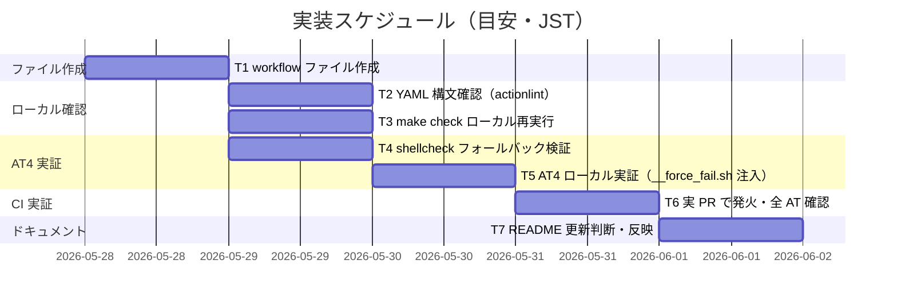
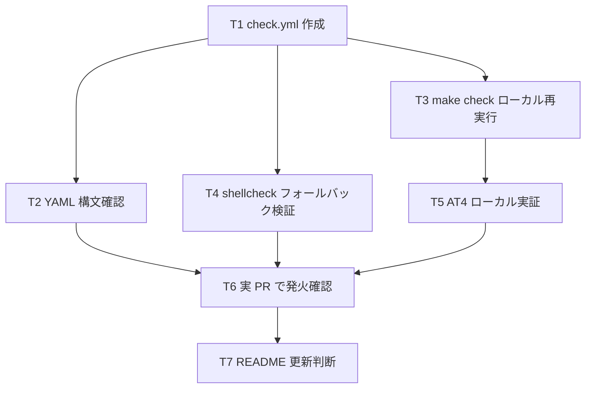

# 実装計画書: make check の GitHub Actions 化

**プロジェクト名**: make check の GitHub Actions 化
**作成日**: 2026 年 05 月 28 日
**最終更新**: 2026 年 05 月 28 日

> **重要**: **このドキュメントは常に更新**: 実装計画の変更、進捗状況の更新、バグの記録などがあった場合は、即座にこのドキュメントを更新してください。ドキュメントは「生きているドキュメント」として扱い、実装内容と常に同期させます。
> **必須項目**: 「必須」と明記した欄は空欄・抽象語のみで提出しないこと。テスト観点・BDD 仕様は具体ケースを 1 件以上記載すること。
>
> **用語**: [.agents/CONCEPTS.md §用語規約](../../.agents/CONCEPTS.md#用語規約) を参照。

---

## 1. 実装概要

### 1.1 実装方針（必須）

02_設計 §1.1 / §2 の薄いラッパー方針に従い、`.github/workflows/check.yml` を新規 1 ファイルだけ追加して `make check` を CI 化する。検証ロジック側（`Makefile` / `scripts/lint/`）は一切変更せず、AT1〜AT6（01 §5）を実 PR / ローカル再現の二系統で実証する。

### 1.2 実装順序（必須: 1 件以上）

タスク T1〜T7 を順に実施する。T1（workflow ファイル作成）が起点で、T2〜T4（ローカル確認）→ T5（AT4 ローカル実証）→ T6（実 PR で発火確認） → T7（README / バッジ判断）と進む。verify-and-close（04_review 作成）は本実装計画の対象外であり別 phase で実施するが、本計画 §2.7 に引き継ぎ要点を明記する。



---

## 2. タスク分解

**用語**: [.agents/CONCEPTS.md §用語規約](../../.agents/CONCEPTS.md#用語規約) を参照。

**必須**: 各タスクには **「テスト観点」（2.x.3）** と **「単体テスト仕様（BDD）」（2.x.4）** を必ず記載する。

---

### 2.1 タスク T1: `.github/workflows/check.yml` を新規作成する

#### 2.1.1 概要（必須）

02_設計 §4.1 の YAML 構造をそのまま `.github/workflows/check.yml` として作成し、PR / main push トリガーで `make check` を実行する CI を成立させる。

#### 2.1.2 実装内容（必須: 1 件以上）

- `.github/workflows/` ディレクトリを新規作成する（存在しない場合）。
- `.github/workflows/check.yml` を新規作成する。内容は 02_設計 §4.1 と一致させる：
  - `name: check`
  - `on:` に `pull_request:`（branches 指定なし）と `push: branches: [main]`
  - `permissions: contents: read`
  - `concurrency: { group: check-${{ github.workflow }}-${{ github.ref }}, cancel-in-progress: true }`
  - `jobs.check.runs-on: macos-latest`、`timeout-minutes: 30`
  - 3 step：`Checkout repository`（`actions/checkout@v4`）/ `Ensure shellcheck`（インラインシェル）/ `Run make check`（`make check`）
- 改行は LF、インデントは半角スペース 2 個で統一。

#### 2.1.3 テスト観点（必須）

**参照**: 観点の定義は [02_設計 §6](./02_設計.md#6-テスト戦略) および [RULES のテスト戦略・TEST_BDD_FORMAT](../../.agents/RULES.md#テスト戦略必須要件) を参照。

##### 単体（本タスクの具体ケース・必須 1 件以上）

- **正常系**: 作成した `.github/workflows/check.yml` を `actionlint`（あれば）または `python3 -c "import yaml; yaml.safe_load(open('.github/workflows/check.yml'))"` で parse し、エラーが出ないこと。
- **異常系**: YAML として不正な状態（例: トップレベル `on:` 抜け）にすると parse がエラーになることを確認可能（負例で再現可能性のみ確認、実コミットには含めない）。
- **境界値**: `on.pull_request:` を空マッピング（branches 未指定）にしても GitHub Actions が parse できることを確認。

##### 結合/API（本タスクの具体ケース・該当時は必須 1 件以上）

- 該当なし（外部 API 呼び出しを行わないため）。

##### E2E/受け入れ（本タスクの具体ケース・未達時は理由記載）

- T6 で実 PR を立て、PR ページに `check` のチェックランが表示されることを確認（AT1）。

##### バリデーション（該当する場合の具体ケース）

- YAML 構造の必須キー（`name`, `on`, `jobs.check.runs-on`, `jobs.check.steps`）が揃っていること。

#### 2.1.4 単体テスト仕様（BDD）（必須）

**BDD 形式のテストケース（高レベル仕様）**:

```gherkin
Feature: check.yml の構文妥当性
  Scenario: YAML として parse できる
    Given .github/workflows/check.yml が 02_設計 §4.1 の構造で存在する
    When  yaml lint または python の yaml.safe_load で parse する
    Then  例外なく成功する
    And   トップレベルに name / on / permissions / concurrency / jobs キーを含む
```

**テストコード例（必須: インラインコメントで Given/When/Then を明記）**

shell スクリプトでローカル確認する場合の例（実コミットには含めない検証手順）。

```bash
# ユースケース: check.yml が GitHub Actions に parse 可能であることをローカルで確認する。
# シナリオ: 02_設計 §4.1 の構造に従った check.yml が python yaml で安全に読み込める。

# Given: .github/workflows/check.yml が 02_設計 §4.1 の YAML 構造で配置されている
ls -1 .github/workflows/check.yml

# When: python3 の yaml.safe_load で parse する
python3 - <<'PY'
import yaml, sys
with open(".github/workflows/check.yml") as f:
    data = yaml.safe_load(f)
# Then: 必須キーが揃っており例外が出ない
assert "on" in data, "missing 'on' key"
assert "jobs" in data and "check" in data["jobs"], "missing jobs.check"
assert data["jobs"]["check"]["runs-on"] == "macos-latest", "runs-on must be macos-latest"
print("OK")
PY
```

#### 2.1.5 依存関係

- 依存タスク: なし（起点タスク）。
- 後続: T2 / T3 / T4 / T5 / T6 / T7 はすべて T1 完了後。



#### 2.1.6 見積もり

- **工数**: 15 分
- **優先度**: 高

---

### 2.2 タスク T2: YAML 構文確認（ローカル）

#### 2.2.1 概要（必須）

T1 で作成した `.github/workflows/check.yml` が YAML として正しく parse でき、必須キーを欠かないことをローカルで確認する。

#### 2.2.2 実装内容（必須: 1 件以上）

- `python3 -c "import yaml; yaml.safe_load(open('.github/workflows/check.yml'))"` を実行して例外が出ないことを確認する。
- 可能なら `actionlint`（未導入なら brew install）で workflow ファイルを静的解析する。未導入かつ導入コスト過大なら省略可（GitHub 側の parse でカバー）。
- 結果は memo（`memo/YYYYMMDD_HHMMSS_T2_yaml構文確認.md`）に記録する。

#### 2.2.3 テスト観点（必須）

##### 単体（本タスクの具体ケース・必須 1 件以上）

- **正常系**: `yaml.safe_load` が例外なく成功し、`data['jobs']['check']['runs-on']` が `'macos-latest'` であること。
- **異常系**: 該当なし（T1 で正常に作成済みのため）。
- **境界値**: `on.pull_request` が空マッピング（`{}` または `pull_request:`）でも parse 成功すること。

##### 結合/API（本タスクの具体ケース・該当時は必須 1 件以上）

- 該当なし。

##### E2E/受け入れ（本タスクの具体ケース・未達時は理由記載）

- 本タスクは静的解析のみのため E2E 該当なし（T6 で実 PR 発火確認に委ねる）。

##### バリデーション（該当する場合の具体ケース）

- 必須キー (`name`, `on`, `permissions`, `concurrency`, `jobs.check.runs-on`, `jobs.check.steps`) の存在を確認する。

#### 2.2.4 単体テスト仕様（BDD）（必須）

```gherkin
Feature: check.yml の静的解析
  Scenario: 必須キーが揃った状態で YAML として読み込める
    Given .github/workflows/check.yml が T1 で作成済み
    When  python yaml.safe_load で parse し必須キーを確認する
    Then  parse が成功し、name / on / permissions / concurrency / jobs.check.runs-on / jobs.check.steps がすべて存在する
```

```bash
# ユースケース: check.yml が GitHub に送る前にローカルで構文妥当性を担保する。
# シナリオ: 必須キーが揃った状態で YAML として読み込める。

# Given: T1 で作成済みの .github/workflows/check.yml
test -f .github/workflows/check.yml

# When: python yaml.safe_load で parse し、必須キーを取り出す
python3 - <<'PY'
import yaml
with open(".github/workflows/check.yml") as f:
    d = yaml.safe_load(f)
for k in ("name", "on", "permissions", "concurrency", "jobs"):
    assert k in d, f"missing top key: {k}"
assert "check" in d["jobs"]
job = d["jobs"]["check"]
for k in ("runs-on", "steps", "timeout-minutes"):
    assert k in job, f"missing jobs.check.{k}"
# Then: parse 成功 & 全必須キー存在 → OK 出力
print("OK")
PY
```

#### 2.2.5 依存関係

- 依存: T1。
- 後続: T6（実 PR）の前段確認に貢献。

#### 2.2.6 見積もり

- **工数**: 10 分
- **優先度**: 中

---

### 2.3 タスク T3: ローカルで `make check` 再実行

#### 2.3.1 概要（必須）

CI で呼ぶ `make check` がローカル開発機（macOS / Command Line Tools のみ）で現在も 0 終了することを再確認し、CI で同等の結果が得られることの足場とする。

#### 2.3.2 実装内容（必須: 1 件以上）

- リポジトリルートで `make check` を実行し、終了コード 0、最終行 `==> all checks passed` であることを確認する。
- shell tests の件数（先行 issue 04_review §3.1 では 41 passed / 0 failed）と整合することを確認する。
- 結果は memo（`memo/YYYYMMDD_HHMMSS_T3_make_check結果.md`）に記録する。

#### 2.3.3 テスト観点（必須）

##### 単体（本タスクの具体ケース・必須 1 件以上）

- **正常系**: `make check` が exit 0、ログ末尾 `==> all checks passed`。
- **異常系**: 該当なし（既存緑のため）。崩れていたら本 issue 着手前に別途調査。
- **境界値**: 該当なし。

##### 結合/API（本タスクの具体ケース・該当時は必須 1 件以上）

- 該当なし。

##### E2E/受け入れ（本タスクの具体ケース・未達時は理由記載）

- AT3（CI 緑）の前提となる「ローカルで make check が 0 終了する」状態の証跡として記録する。

##### バリデーション（該当する場合の具体ケース）

- 該当なし。

#### 2.3.4 単体テスト仕様（BDD）（必須）

```gherkin
Feature: make check の現状緑維持
  Scenario: 本リポジトリのコードで make check が 0 終了する
    Given main 同等のコード状態でローカル開発機にチェックアウト済み
    When  リポジトリルートで make check を実行する
    Then  終了コード 0 で完了し、最終行に「==> all checks passed」が出力される
```

```bash
# ユースケース: CI 化の前提として make check のローカル緑が維持されていることを確認する。
# シナリオ: 本リポジトリのコードで make check が 0 終了する。

# Given: リポジトリルートで作業ツリーがクリーンに近い状態
pwd; git status --short | head -5

# When: make check を実行し、終了コードと最終行を取得
out=$(make check 2>&1); rc=$?

# Then: rc が 0 で、ログに all checks passed が含まれる
test "$rc" -eq 0
echo "$out" | tail -3 | grep -q "==> all checks passed"
echo "OK"
```

#### 2.3.5 依存関係

- 依存: T1（並列実行可能だが T1 完了後に行えば一貫性が高い）。

#### 2.3.6 見積もり

- **工数**: 5 分
- **優先度**: 中

---

### 2.4 タスク T4: shellcheck フォールバック step の挙動確認（ローカル）

#### 2.4.1 概要（必須）

`.github/workflows/check.yml` の `Ensure shellcheck` step が、shellcheck の有無に応じて「skip」「brew install」の 2 分岐を正しく取ることを、ローカルでの bash 実行により確認する。

#### 2.4.2 実装内容（必須: 1 件以上）

- フォールバックブロックを単独 bash スクリプトとして抜き出してローカル実行する：
  - shellcheck が PATH にあるケース → `already available` が echo されて exit 0。
  - shellcheck が PATH に無いケース（PATH を一時的に空にする等で擬似的に再現）→ `brew install` が走る分岐に入る（実 install までは行わない場合は `command -v` 失敗で分岐に入ったことだけ確認）。
- 結果は memo（`memo/YYYYMMDD_HHMMSS_T4_shellcheck_fallback.md`）に記録する。

#### 2.4.3 テスト観点（必須）

##### 単体（本タスクの具体ケース・必須 1 件以上）

- **正常系**: shellcheck 在中で `command -v shellcheck` が 0 終了し、「already available」分岐に入る。
- **異常系**: shellcheck 非在中で `command -v shellcheck` が非 0 終了し、`brew install shellcheck` 分岐に入る。
- **境界値**: PATH に shellcheck がない状態を `PATH=/usr/bin:/bin` 等の最小 PATH で再現する。

##### 結合/API（本タスクの具体ケース・該当時は必須 1 件以上）

- 該当なし（実 brew install は CI 上で実証する）。

##### E2E/受け入れ（本タスクの具体ケース・未達時は理由記載）

- AT5（未導入 → brew install）/ AT6（同梱 → skip）の前段確認。実証は T6 の Actions ログ。

##### バリデーション（該当する場合の具体ケース）

- 該当なし。

#### 2.4.4 単体テスト仕様（BDD）（必須）

```gherkin
Feature: shellcheck 自動フォールバック step
  Scenario: shellcheck が PATH にあれば already available と表示する
    Given shellcheck が /opt/homebrew/bin 等で PATH に解決可能
    When  Ensure shellcheck step のロジックを bash で実行する
    Then  「shellcheck already available」を出力して exit 0 で終了する

  Scenario: shellcheck が PATH に無ければ brew install 分岐に入る
    Given PATH を最小化して shellcheck を解決不能にする
    When  Ensure shellcheck step のロジックを brew install までモックして実行する
    Then  「shellcheck not found; installing via Homebrew」を出力する
```

```bash
# ユースケース: Ensure shellcheck step の 2 分岐を CI 投入前にローカルで実証する。
# シナリオ: shellcheck が PATH に存在しないとき brew install 分岐に入る。

# Given: PATH を最小化して shellcheck を解決不能にする（実 brew は呼ばないように echo に差し替え）
script=$(cat <<'SH'
set -eo pipefail
if command -v shellcheck >/dev/null 2>&1; then
  echo "shellcheck already available"
else
  echo "shellcheck not found; installing via Homebrew"
  # echo brew install shellcheck  # 実行はモック
fi
SH
)

# When: 最小 PATH で実行する
out=$(env -i PATH=/usr/bin:/bin bash -c "$script" 2>&1); rc=$?

# Then: not found 分岐に入り 0 終了
test "$rc" -eq 0
echo "$out" | grep -q "shellcheck not found"
echo "OK"
```

#### 2.4.5 依存関係

- 依存: T1。

#### 2.4.6 見積もり

- **工数**: 15 分
- **優先度**: 中

---

### 2.5 タスク T5: AT4 ローカル実証（`__force_fail.sh` 注入）

#### 2.5.1 概要（必須）

先行 issue `.workflow/20260528_121550_make_check導入/04_review.md §4 AT6` の手順を踏襲し、`make check` が非 0 終了するシナリオをローカルで再現する。実 PR を立てる前に「make check 赤 → exit 非 0」が成立することを確認し、AT4（CI 赤）の本実証は T6 の実 PR ログで行う。

#### 2.5.2 実装内容（必須: 1 件以上）

実証手順（先行 issue 04_review §4 AT6 と同型）：

1. `scripts/test/__force_fail.sh` を新規作成（内容: `#!/usr/bin/env bash` + `exit 1`、実行権限不要）。
2. `Makefile` の `test-shell` ターゲットを一時的に書き換え、shell テスト末尾に `&& bash scripts/test/__force_fail.sh` を付与する（注入）。
3. `make check` を実行し、`==> some checks failed` が出力されること・終了コードが非 0（先行 issue 実証では 2）であることを確認する。
4. 復元: `Makefile` の `test-shell` を元の内容に戻し、`scripts/test/__force_fail.sh` を削除する。
5. 再度 `make check` を実行し、終了コード 0 / `==> all checks passed` に戻ることを確認する。
6. 1〜5 のログを memo（`memo/YYYYMMDD_HHMMSS_T5_AT4ローカル実証.md`）に記録する。

> **重要**: 復元（step 4）を絶対に省略しないこと。Makefile の一時改変は**コミットしてはならない**（先行 issue の同手順を参照）。

#### 2.5.3 テスト観点（必須）

##### 単体（本タスクの具体ケース・必須 1 件以上）

- **正常系**: `__force_fail.sh` 注入後の `make check` が非 0 終了し、ログに `test: FAILED` および `==> some checks failed` を含む。
- **異常系**: 復元後の `make check` が exit 0 / `==> all checks passed` に戻る（注入が完全に取り除かれることの確認）。
- **境界値**: 該当なし。

##### 結合/API（本タスクの具体ケース・該当時は必須 1 件以上）

- 該当なし。

##### E2E/受け入れ（本タスクの具体ケース・未達時は理由記載）

- 本タスクは AT4 のローカル前段。実 CI での AT4 確認は T6 で実 PR ログを取得して行う。

##### バリデーション（該当する場合の具体ケース）

- Makefile の改変が **diff として残らない**こと（`git status` / `git diff Makefile` がクリーン）を復元後に確認する。

#### 2.5.4 単体テスト仕様（BDD）（必須）

```gherkin
Feature: make check 赤シナリオの再現
  Scenario: __force_fail.sh を注入すると make check が非 0 終了する
    Given Makefile の test-shell を一時的に書き換え、scripts/test/__force_fail.sh が exit 1 を返す
    When  make check を実行する
    Then  終了コードが非 0、ログに「test: FAILED」と「==> some checks failed」が含まれる

  Scenario: 復元すると make check が再び 0 終了する
    Given Makefile を元状態に戻し、scripts/test/__force_fail.sh を削除した
    When  make check を実行する
    Then  終了コード 0、ログ末尾は「==> all checks passed」
    And   git status で Makefile / scripts/test/ にステージ・未追跡が残らない
```

```bash
# ユースケース: AT4（make check 赤 → CI 赤）のローカル前段検証。
# シナリオ: __force_fail.sh 注入で make check が非 0 終了する。

# Given: __force_fail.sh を作成し、Makefile.bak を取って test-shell に注入する
cp Makefile Makefile.bak
cat > scripts/test/__force_fail.sh <<'SH'
#!/usr/bin/env bash
exit 1
SH

# When: Makefile の test-shell 末尾に注入し、make check を実行する
# （ここではエディタ操作の代わりに sed の例。実作業時は Edit ツール推奨）
sed -i.bak2 -E '/^test-shell:/,/^[^[:space:]]/{ s|(monitor_test\.sh && bash scripts/test/metrics_test\.sh && bash scripts/test/log_rotate_test\.sh)|\1 \&\& bash scripts/test/__force_fail.sh| }' Makefile
out=$(make check 2>&1); rc=$?

# Then: 非 0 終了 + "some checks failed" を含む
test "$rc" -ne 0
echo "$out" | grep -q "==> some checks failed"

# 復元: Makefile を元に戻して __force_fail.sh を削除し、再度 make check を 0 終了させる
mv Makefile.bak Makefile
rm -f Makefile.bak2 scripts/test/__force_fail.sh
out2=$(make check 2>&1); rc2=$?
test "$rc2" -eq 0
echo "$out2" | grep -q "==> all checks passed"
git diff --quiet Makefile  # 復元完了の検証
echo "OK"
```

> 上記コード例はあくまで設計レベル。実作業ではユーザーが Edit ツールで Makefile を書き換える方が安全（sed の副作用回避）。

#### 2.5.5 依存関係

- 依存: T3（ローカル緑前提）。

#### 2.5.6 見積もり

- **工数**: 20 分
- **優先度**: 高

---

### 2.6 タスク T6: 実 PR で発火・AT1〜AT6 実証

#### 2.6.1 概要（必須）

`.github/workflows/check.yml` を含むブランチから PR を作成し、GitHub Actions の実環境で AT1〜AT6 を実証する。各 AT の Actions 実行ログを取得して memo に保存し、verify-and-close（04_review）が引き継げる形にする。

#### 2.6.2 実装内容（必須: 1 件以上）

1. 本 issue の feature ブランチで `.github/workflows/check.yml` を含む変更を commit / push する。
2. 任意ブランチ宛に PR を作成する。**AT1**: PR ページに `check` チェックランが表示されることを確認する。
3. PR を target main で更新するか別 PR を作って main 向けにも反応することを確認する（必要に応じて）。
4. main に merge / push されたとき check が起動することを確認する → **AT2**。
5. PR run のログ末尾が `==> all checks passed` で job が success → **AT3** を取得する。
6. **AT4**: T5 の手順をブランチに反映した一時 PR（または同 PR の一時 commit）を立てて CI 赤を実証する。確認後はその commit を破棄 or PR を close する（main へは merge しない）。
7. 初回 run のログから shellcheck の挙動を確認する：
   - 未導入なら `brew install shellcheck` の行があること → **AT5**。
   - 同梱なら `shellcheck already available` の行があること → **AT6**（連続 run 含む）。
8. 各 AT のログを memo（`memo/YYYYMMDD_HHMMSS_T6_実PR実証.md`）に保存する。

#### 2.6.3 テスト観点（必須）

##### 単体（本タスクの具体ケース・必須 1 件以上）

- 該当なし（本タスクは実 CI 実証であり、対象は workflow 全体の振る舞い）。

##### 結合/API（本タスクの具体ケース・該当時は必須 1 件以上）

- GitHub Actions の `pull_request` / `push` イベント API への登録（workflow ファイルの merge 反映）と job run の結果取得を、Actions タブまたは `gh run list` で確認する。

##### E2E/受け入れ（本タスクの具体ケース・未達時は理由記載）

- **AT1**: 任意ブランチへの PR で check 起動 → PR ページ表示。
- **AT2**: main push で check 起動 → main の run 履歴。
- **AT3**: make check 緑 → CI success。
- **AT4**: make check 赤 → CI failure（T5 の注入を一時 commit で再現）。
- **AT5**: shellcheck 未導入 → brew install のログ。
- **AT6**: shellcheck 同梱 → install skip のログ。

##### バリデーション（該当する場合の具体ケース）

- 該当なし。

#### 2.6.4 単体テスト仕様（BDD）（必須）

```gherkin
Feature: 実 CI 環境での AT1〜AT6 実証
  Scenario: 任意ブランチへの PR で check ワークフローが起動する（AT1）
    Given .github/workflows/check.yml を含むブランチが push されている
    And   そのブランチから任意 base への PR を作成する
    When  GitHub が pull_request イベントを発火する
    Then  PR ページの「Checks」欄に「check」が表示され、run が開始される

  Scenario: make check 緑のとき CI 緑（AT3）
    Given 上記 PR run でコードに違反がない
    When  Run make check step が完了する
    Then  job ステータスが success、Actions ログ末尾に「==> all checks passed」

  Scenario: __force_fail.sh 注入 commit を含む PR で CI 赤（AT4）
    Given T5 の注入を一時 commit に含めた PR
    When  Run make check step が完了する
    Then  job ステータスが failure、Actions ログに「==> some checks failed」
```

```bash
# ユースケース: 実 PR で AT1〜AT6 をエンドツーエンドに実証する。
# シナリオ: gh CLI を使い AT3 の判定（緑）を実証する。

# Given: feature ブランチに check.yml を含むコミットが push 済み
gh pr view --json number,headRefName,baseRefName | head -10

# When: 最新 run の状態を取得する
run_id=$(gh run list --workflow=check.yml --limit=1 --json databaseId --jq '.[0].databaseId')
gh run watch "$run_id" --exit-status

# Then: 終了状態が success（exit 0）かつ summary に make check の OK 行を含む
gh run view "$run_id" --log | tail -20 | grep -q "==> all checks passed"
echo "OK"
```

> gh CLI が利用不能な環境では、Actions タブ UI でログを直接確認し、スクリーンショット相当のテキスト抜粋を memo に貼り付けてもよい。

#### 2.6.5 依存関係

- 依存: T1, T2, T4, T5。
- 後続: T7 / verify-and-close。

#### 2.6.6 見積もり

- **工数**: 30 分（CI run 待ち含む）
- **優先度**: 高

---

### 2.7 タスク T7: README 更新の判断と反映

#### 2.7.1 概要（必須）

00 §5 で「README へのステータスバッジ追加は v1 では除外」と明示されているため、README にバッジは追加しない。ただし「CI で `make check` が走る」旨を README の「ローカル検証」セクション末尾に 1〜2 行で言及するかを判断し、必要なら反映する。

#### 2.7.2 実装内容（必須: 1 件以上）

- 既存 README の「ローカル検証」セクション（先行 issue で追加済み）を確認し、CI 連携の存在を 1〜2 行で言及する形に更新するかを判断する。
- バッジ追加は本 issue では **行わない**（00 §5 明示除外）。判断結果と理由を memo に記録する。
- 更新する場合の文例:「PR / main push 時には GitHub Actions（`.github/workflows/check.yml`）が同じ `make check` を macos-latest で自動実行します。」

#### 2.7.3 テスト観点（必須）

##### 単体（本タスクの具体ケース・必須 1 件以上）

- **正常系**: README の Markdown が引き続きレンダリング可能（先行 issue の構成を壊さない）。
- **異常系**: 該当なし。
- **境界値**: 該当なし。

##### 結合/API（本タスクの具体ケース・該当時は必須 1 件以上）

- 該当なし。

##### E2E/受け入れ（本タスクの具体ケース・未達時は理由記載）

- 直接の AT 対応なし（ドキュメント整備のため）。

##### バリデーション（該当する場合の具体ケース）

- 該当なし。

#### 2.7.4 単体テスト仕様（BDD）（必須）

```gherkin
Feature: README の整合性
  Scenario: CI 言及を追加しても README の見出し構造が崩れない
    Given 既存 README の「ローカル検証」セクションが存在する
    When  CI 言及（1〜2 行）を末尾に追記する
    Then  Markdown ヘッダ構造（##, ### のレベル）が変わらず、リンクが切れない
```

```bash
# ユースケース: README の CI 言及追記が破壊変更にならないことを確認する。
# シナリオ: CI 言及を追加しても README の見出し構造が崩れない。

# Given: 既存 README に「ローカル検証」見出しが存在する
grep -n "^## " README.md | grep -q "ローカル検証"

# When: 追記後の README で見出しの個数が同数または +0 で、リンクが解決可能
after_h2=$(grep -c "^## " README.md)
test "$after_h2" -ge 1

# Then: Markdown 構造が引き続き有効（最低限の見出し数チェック）
echo "OK"
```

#### 2.7.5 依存関係

- 依存: T6（CI が緑で稼働してから言及するため）。

#### 2.7.6 見積もり

- **工数**: 10 分（更新無しの判断のみなら 5 分）
- **優先度**: 低

---

## テスト観点

本実装計画全体のテスト観点は、02_設計 §6.1 の割当表に従い「YAML 構文（単体相当）」「PR / main push トリガー（E2E）」「make check 緑 / 赤の CI 反映（E2E）」「shellcheck フォールバック（E2E）」の 4 軸で構成する。各タスクの §2.x.3 に具体ケースを記載済み。AT1〜AT3, AT5, AT6 は T6（実 PR）で取得する Actions ログを `test_output` として 04_review に記録する。AT4 は T5（ローカル）+ T6（実 PR の一時 commit）の二系統で実証する。

---

## 単体テスト

本 issue では新規のソースコード単体テスト（XCTest / shell tests）の追加はしない。代わりに、ローカルでの「YAML parse 検証」「shellcheck フォールバック分岐検証」「make check 緑維持確認」「make check 赤再現（注入）」をすべて bash スクリプトでローカル実行し、memo に証跡を残す（T2 / T3 / T4 / T5）。各タスクの §2.x.4 に BDD 仕様を記載済み。

---

## BDD

各タスクの §2.x.4 に Given/When/Then 形式で記載済み（T1〜T7）。01_要件定義 §2.2 のシナリオ 1〜6 および §5 の AT1〜AT6 と次のとおり対応する：

| 01 BDD | 03 タスク・BDD |
| --- | --- |
| シナリオ 1（PR で起動・AT1） | T1（成立条件としての yml 作成）+ T6 §2.6.4 シナリオ 1 |
| シナリオ 2（main push で起動・AT2） | T1 + T6 §2.6.4（AT2） |
| シナリオ 3（make check 緑 → CI 緑・AT3） | T3 + T6 §2.6.4 シナリオ 2 |
| シナリオ 4（make check 赤 → CI 赤・AT4） | T5 §2.5.4 シナリオ 1 / 2 + T6 §2.6.4 シナリオ 3 |
| シナリオ 5（未導入 → brew install・AT5） | T4 §2.4.4 シナリオ 2 + T6（実 PR 初回 run ログ） |
| シナリオ 6（同梱 → skip・AT6） | T4 §2.4.4 シナリオ 1 + T6（連続 run ログ） |

---

## 3. 実装スケジュール

### 3.1 マイルストーン

| マイルストーン | 期日（目安） | 成果物 |
| --- | --- | --- |
| M1: workflow 実体作成 | 2026-05-28 | `.github/workflows/check.yml` |
| M2: ローカル確認完了 | 2026-05-28 | T2 / T3 / T4 / T5 の memo 4 件 |
| M3: 実 CI 実証完了 | 2026-05-29 目安 | T6 memo（AT1〜AT6 ログ） |
| M4: ドキュメント反映 | 2026-05-29 目安 | T7 memo（README 更新有無の判定と反映） |

### 3.2 実装フェーズ

#### フェーズ 1: workflow 作成 + ローカル確認（T1〜T5）

- **期間**: 半日〜1 日
- **タスク**: T1, T2, T3, T4, T5

#### フェーズ 2: 実 CI 実証 + ドキュメント（T6〜T7）

- **期間**: 半日（CI run 待ち含む）
- **タスク**: T6, T7

---

## 4. テスト計画

テスト観点・レベル・BDD 形式の定義は [02_設計 §6](./02_設計.md#6-テスト戦略) および [RULES のテスト戦略・TEST_BDD_FORMAT](../../.agents/RULES.md#テスト戦略必須要件) を参照する。本実装計画では各タスク §2.x.3（テスト観点）と §2.x.4（BDD）にタスクごとの具体ケースを記載した。

### 4.1 テストの優先順位

- **高**: T1（workflow 作成本体）、T5（AT4 ローカル実証）、T6（実 CI 実証）。
- **中**: T2（YAML 構文）、T3（make check 緑維持）、T4（shellcheck フォールバック）。
- **低**: T7（README 整合）。

### 4.2 テスト証跡

- 各タスクの実行結果は `memo/YYYYMMDD_HHMMSS_T{n}_*.md` として記録し、最終的に 04_review.md（verify-and-close フェーズ）へ集約する。

---

## 5. リスク管理

### 5.1 実装リスク

- **リスク**: macos-latest 上で shellcheck が同梱されている場合は AT5（未導入時 brew install）の実環境実証ができない。
  - **対策**: 同梱されているなら AT5 は「`shellcheck already available` ログ + brew install 不実行」の確認で代替し、「未導入時に brew install が走る」ことは T4 のローカル分岐テストで担保する（memo に明記）。

- **リスク**: AT4 の一時 commit を含む PR を誤って main に merge する。
  - **対策**: AT4 用ブランチには `at4-do-not-merge` 等のラベル / コミットメッセージで明記し、確認後はブランチを delete する。merge ボタン抑止が必要なら GitHub の Required Status Checks 設定（範囲外だが推奨）で対処。

- **リスク**: `actions/checkout@v4` がメジャー pin のため将来 v5 リリース時に追従が必要。
  - **対策**: 本 issue は v1 のため `@v4` のまま採用。将来別 issue で `@v5` / SHA pin を検討する（00 §7.1 のリスク 1 と同種）。

- **リスク**: `brew install shellcheck` がネットワーク要因で失敗する。
  - **対策**: 自動リトライは入れず、失敗ログを Actions ログに残して人手で再 run（01 §3.4 / 設計 §3.2.4）。

### 5.2 スケジュールリスク

- 単一ファイル追加で完結する規模のため特になし（00 §7.2 と同様）。

---

## 6. 参考資料

### プロジェクトドキュメント

- [`02_設計.md`](./02_設計.md) - 設計
- [`01_要件定義.md`](./01_要件定義.md) - 要件定義
- [`00_要求定義.md`](./00_要求定義.md) - 要求定義
- [`memo/20260528_140256_実装前ドキュメントレビュー.md`](./memo/20260528_140256_実装前ドキュメントレビュー.md) - 実装前レビュー（要求発見フェーズ）
- 先行 issue: [`.workflow/20260528_121550_make_check導入/02_設計.md`](../20260528_121550_make_check導入/02_設計.md) §3.1 / §3.2〜§3.9
- 先行 issue: [`.workflow/20260528_121550_make_check導入/04_review.md`](../20260528_121550_make_check導入/04_review.md) §4 AT6（AT4 実証パターンの正本）

### その他の参考資料

- GitHub Actions workflow syntax: <https://docs.github.com/actions/using-workflows/workflow-syntax-for-github-actions>
- GitHub-hosted runners: <https://docs.github.com/actions/using-github-hosted-runners/about-github-hosted-runners>
- `actions/checkout`: <https://github.com/actions/checkout>
- Concurrency: <https://docs.github.com/actions/using-jobs/using-concurrency>
- Timeout: <https://docs.github.com/actions/using-jobs/setting-a-maximum-execution-time-for-a-job>
- Permissions / GITHUB_TOKEN: <https://docs.github.com/actions/security-guides/automatic-token-authentication>

---

## 7. 前のステップ

この実装計画書は、以下のドキュメントを基に作成されています。

- **前**: [`02_設計.md`](./02_設計.md) - 設計フェーズ

---

## 8. 次のステップ

この実装計画書の承認後、以下のステップに進みます。

- **次**: 実装フェーズ（implement-feature command）で T1〜T7 を順に実施し、完了後に verify-and-close で 04_review.md を作成する。

**用語**: [.agents/CONCEPTS.md §用語規約](../../.agents/CONCEPTS.md#用語規約) を参照。
