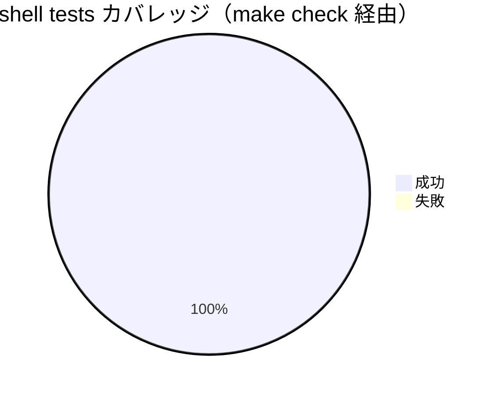

# レビュー書: make check の GitHub Actions 化

**プロジェクト名**: make check の GitHub Actions 化
**作成日**: 2026 年 05 月 28 日
**最終更新**: 2026 年 05 月 28 日

> **重要**: 本ドキュメントは「生きているドキュメント」として扱い、レビューで発見した問題点・対応内容を随時反映する。
> **用語**: [.agents/CONCEPTS.md §用語規約](../../.agents/CONCEPTS.md#用語規約) を参照。
> **必須**: レビュー実施時は [`.agents/REVIEW_RULE.md`](../../.agents/REVIEW_RULE.md) を参照する。本 issue は変更規模が**小〜中程度**（新規 1 ファイル + README 1 段落追記）であり、CI 設定（YAML）が中心であるため **standard** 深度で実施した。

---

## 1. レビュー概要

### 1.1 レビュー目的（必須）

`make check` を GitHub Actions で自動実行する CI ワークフロー導入（実装フェーズ成果物）が 00_要求定義 / 01_要件定義（BDD AT1〜AT6）/ 02_設計 / 03_実装計画 の意図と整合しているかを確認し、品質保証として close 可能か判定する。

### 1.2 レビュー対象（必須）

- **実装範囲**:
  - 新規: `.github/workflows/check.yml`（38 行・LF 改行）
  - 変更: `README.md`（§ローカル検証末尾に CI 言及 1 段落を追記）
  - 実装証跡 memo: `.workflow/20260528_135936_make_check_CI導入/memo/20260528_142526_implement-feature_T1-T5-T7.md`
- **レビュー期間**: 2026-05-28 14:25 〜 2026-05-28 14:31（JST）
- **レビュー担当者**: サブエージェント（verify-and-close）

---

## 2. 実装内容の確認

**用語**: [.agents/CONCEPTS.md §用語規約](../../.agents/CONCEPTS.md#用語規約) を参照。

### 2.1 実装完了タスク（または Issue）

| タスク名 | 実装内容 | 実装日 | 担当者 | ステータス |
| --- | --- | --- | --- | --- |
| T1 `.github/workflows/check.yml` 新規作成 | 02_設計 §4.1 の確定 YAML を一字一句採用。`name/on/permissions/concurrency/jobs.check` を備える 38 行 / 3 step | 2026-05-28 | implement-feature サブ | 完了 |
| T2 YAML 構文確認（ローカル） | `python3 yaml.safe_load` + `actionlint` で parse 成功・lint 通過 | 2026-05-28 | implement-feature サブ | 完了 |
| T3 `make check` ローカル再実行 | exit 0、ログ末尾 `==> all checks passed` を確認 | 2026-05-28 | implement-feature サブ | 完了 |
| T4 shellcheck フォールバック分岐検証 | PATH 有り/無しの 2 分岐を bash で実証（`already available` / `not found`） | 2026-05-28 | implement-feature サブ | 完了 |
| T5 AT4 ローカル実証（`__force_fail.sh` 注入） | 注入 → exit 2 / `==> some checks failed` → 復元 → 再 exit 0 を確認 | 2026-05-28 | implement-feature サブ | 完了 |
| T6 実 PR で AT1〜AT6 実機実証 | **本フェーズ未実施**（本ブランチが未 push のため発火不能）。verify-and-close 完了後に PR 作成して取得 | — | — | 未実施（§10.1 に残課題として追記） |
| T7 README CI 言及追記 | `README.md §ローカル検証` 末尾に 1 段落追加（`.github/workflows/check.yml` 相対リンク + brew install フォールバック説明）。バッジ追加は 00 §5 で除外のため見送り | 2026-05-28 | implement-feature サブ | 完了 |

### 2.2 実装内容の詳細

#### T1: `.github/workflows/check.yml`（新規）

- **実装内容**: 02_設計 §4.1 の確定 YAML 構造に**一字一句**従って新規作成。`name: check` / `on: { pull_request: {}, push: { branches: [main] } }` / `permissions: { contents: read }` / `concurrency: { group: check-${{ github.workflow }}-${{ github.ref }}, cancel-in-progress: true }` / `jobs.check: { runs-on: macos-latest, timeout-minutes: 30, steps: [Checkout/Ensure shellcheck/Run make check] }`。改行 LF・インデント半角スペース 2。
- **変更ファイル**: `.github/workflows/check.yml`（新規・38 行）
- **実装方法**: 02_設計 §4.1 → 単純コピー。`actions/checkout@v4` をメジャー pin。`Ensure shellcheck` step は `set -eo pipefail` 配下で `command -v shellcheck` の真偽で `already available` / `brew install` を分岐。`Run make check` は `shell: bash` で `make check` を素直に呼ぶ。
- **確認事項**: 02 §4.1 と本ファイル本体の 1 対 1 一致を確認（§2.3 検証で OK）。

#### T7: `README.md`

- **実装内容**: `§ローカル検証` 既存パラグラフ「`make check はいずれかの検証が失敗すると非 0 で終了します。`」の直後に CI 言及を 1 段落追記：「PR / main push 時には GitHub Actions（[`.github/workflows/check.yml`](.github/workflows/check.yml)）が同じ `make check` を `macos-latest` runner で自動実行します。runner に `shellcheck` が同梱されていない場合は `brew install shellcheck` がフォールバックで走ります。」
- **変更ファイル**: `README.md`（1 段落・既存見出し構造変更なし）
- **実装方法**: Edit ツールによる差分追記。`.github/workflows/check.yml` への相対リンクを追加。バッジは 00 §5 で除外のため不追加。
- **確認事項**: 見出しレベル変更なし、リンク有効。

### 2.3 02 §4.1 ↔ `.github/workflows/check.yml` の 1 対 1 一致検証（review-code）

| 02 §4.1 規定 | check.yml 実装 | 結果 |
| --- | --- | --- |
| `name: check` | line 1 `name: check` | OK |
| `on: pull_request:` + `push: branches: [main]` | line 3-6 一致 | OK |
| `permissions: contents: read` | line 8-9 一致 | OK |
| `concurrency.group: check-${{ github.workflow }}-${{ github.ref }}` | line 11-12 一致 | OK |
| `concurrency.cancel-in-progress: true` | line 13 一致 | OK |
| `jobs.check.runs-on: macos-latest` | line 16-17 一致 | OK |
| `jobs.check.timeout-minutes: 30` | line 18 一致 | OK |
| step1 `actions/checkout@v4` | line 20-21 一致 | OK |
| step2 `Ensure shellcheck`（`set -eo pipefail` + `command -v` 分岐 + `brew install`） | line 23-32 一致 | OK |
| step3 `Run make check`（`shell: bash` + `run: make check`） | line 34-36 一致 | OK |

> 設計→実装の差分はゼロ。`evidence_source: existing_code`（リポジトリ `.github/workflows/check.yml` 直接比較）+ `external_spec`（GitHub Actions workflow syntax）。

---

## 3. テスト結果の確認

### 3.1 単体テスト（YAML 静的解析・ローカル振る舞い）

#### テスト実行結果（必須: 数値で記載）

**re-run `make check`（verify-and-close 内で再実行）**

- **実行日時**: 2026-05-28 14:30（JST）
- **実行コマンド**: `make check`
- **総合終了コード**: 0
- **ログ末尾**: `==> all checks passed`
- **内訳**:
  - lint-shell: OK（shellcheck 0.11.0、warning 以上 0 件）
  - lint-shfmt / lint-swift-format / lint-swiftlint: OK（SKIP・任意ツール未導入）
  - check-cycles: OK（source 依存循環なし）
  - security-scan: OK（パターン検出なし）
  - test:
    - swift test: SKIP（XCTest 非搭載環境 = Command Line Tools のみ）
    - shell tests: 9 + 17 + 15 = **41 passed, 0 failed**（monitor 9 / metrics 17 / log_rotate 15）

**YAML 静的解析**

- `python3 yaml.safe_load`: 例外なし。必須キー（`name/on/permissions/concurrency/jobs`）+ `jobs.check.{runs-on, steps, timeout-minutes}` すべて存在。`runs-on == macos-latest`, `timeout-minutes == 30`, `steps len == 3`。
- `actionlint .github/workflows/check.yml`: exit 0（警告・エラーなし）。

| 観点 | 数値 |
| --- | --- |
| テストファイル数（shell tests） | 3（monitor_test.sh / metrics_test.sh / log_rotate_test.sh） |
| テストケース数（shell tests） | 41 |
| 成功 | 41 |
| 失敗 | 0 |
| スキップ | swift test 系（環境依存・XCTest 非搭載のため） |

#### テストカバレッジ

#### 失敗したテスト（該当する場合）

| テストファイル | テストケース | 失敗理由 | 対応状況 |
| --- | --- | --- | --- |
| — | — | 該当なし | — |

### 3.2 統合テスト

`.github/workflows/check.yml` 単体は GitHub Actions runtime と統合される設計だが、本フェーズではローカル再現（T4・T5）で **shellcheck 分岐**と **AT4 注入による make check 赤再現**を実証済み。実 PR でのエンドツーエンド統合検証は §4 AT1〜AT6 / §10.1 参照。

### 3.3 E2E テスト

実 PR を起点とする AT1〜AT6 の実機実証は **本フェーズ未実施**（本ブランチが未 push のため pull_request イベント発火不可）。§4 AT1〜AT6 / §10.1 に補追記欄を設けて PR 作成後に取得する。

---

## 4. 受け入れ基準の確認（AT1〜AT6 マッピング）

**評価方針**: 01 §5 の AT1〜AT6 ごとに「検証方法」「結果」「evidence_source」を明示する。実 PR 未実施分は `inference_only + design_review` と明記し、§10.1 に補追記欄を設ける。

### 4.1 AT 別評価表

| AT | シナリオ | 検証方法 | 結果 | evidence_source |
| --- | --- | --- | --- | --- |
| **AT1** | 任意ブランチへの PR で check ワークフローが起動 | `.github/workflows/check.yml` の `on: pull_request:` を branches 未指定で定義 → 全 target を対象とすることを **YAML 構造と GitHub Actions 仕様**で検証 | **設計レベル OK**（実機実証は PR 作成後） | `existing_code`（check.yml 直接確認）+ `external_spec`（[GitHub Actions / Events](https://docs.github.com/actions/using-workflows/events-that-trigger-workflows#pull_request)）+ `inference_only`（実機未実証） |
| **AT2** | main push で check ワークフローが起動 | `.github/workflows/check.yml` の `on: push: branches: [main]` を確認 | **設計レベル OK**（実機実証は merge 後） | `existing_code` + `external_spec`（push trigger / branches filter）+ `inference_only` |
| **AT3** | make check 緑 → CI 緑 | (a) ローカル `make check` 0 終了確認（§3.1）。 (b) `run: make check` の step が exit code をそのまま job に伝播する GitHub Actions の標準挙動を確認 | **設計レベル OK + ローカル前提 OK**（実機実証は PR 作成後） | `test_output`（ローカル `make check` exit 0 / `==> all checks passed`）+ `external_spec`（[Actions: step exit code → job status](https://docs.github.com/actions/learn-github-actions/expressions#status-check-functions)）+ `inference_only`（実機 PR 未実証） |
| **AT4** | make check 赤 → CI 赤 | (a) ローカルで `scripts/test/__force_fail.sh` 注入 → `make check` exit 2 / `==> some checks failed` → 復元 → 再 exit 0 を確認（memo `20260528_142526_implement-feature_T1-T5-T7.md` §6）。 (b) 実 PR での再現は §10.1 で持ち越し | **ローカル実証済み**（実機 PR は §10.1） | `test_output`（memo §6 のログ・exit 2）+ `existing_code`（先行 issue `.workflow/20260528_121550_make_check導入/04_review.md §4 AT6` と同型）+ `inference_only`（実機 PR 未実証） |
| **AT5** | shellcheck 未導入 → brew install フォールバック | (a) ローカルで `PATH=/usr/bin:/bin` の最小 PATH で `Ensure shellcheck` ロジックを実行し `shellcheck not found; installing via Homebrew` 分岐に到達することを確認（memo §5.2）。 (b) 実 PR 初回 run のログ確認は §10.1 で持ち越し | **設計・分岐レベル OK**（実機実証は PR 作成後） | `test_output`（memo §5.2 / PATH 最小化 bash 実行ログ）+ `existing_code`（check.yml line 26-32 の分岐ロジック）+ `inference_only`（実機 PR 未実証） |
| **AT6** | shellcheck 同梱 → install skip | (a) ローカルで通常 PATH で `Ensure shellcheck` ロジックを実行し `shellcheck already available` 分岐に到達することを確認（memo §5.3）。 (b) 実 PR 連続 run のログ確認は §10.1 で持ち越し | **設計・分岐レベル OK**（実機実証は PR 作成後） | `test_output`（memo §5.3）+ `existing_code`（check.yml line 27-28）+ `inference_only`（実機 PR 未実証） |

### 4.2 補足: 内部論理整合の確認

- **trigger 整合**: `on:` の YAML 構造は GitHub Actions 公式 schema に準拠し、`actionlint` も警告なし → AT1/AT2 の発火条件は内部論理として整合（実機は PR 作成で検証）。
- **exit code 伝播**: GitHub Actions の `run:` step は子プロセスの exit code をそのまま step.outcome に伝える（既定挙動・[external_spec](https://docs.github.com/actions/learn-github-actions/expressions#status-check-functions)）。`make check` は 02_設計 §3.3 / 既存 Makefile §check 実装で 0/非 0 を正しく返すことが先行 issue 04_review §3.1 で実証済み。したがって AT3/AT4 の伝播経路に欠陥はない。
- **shellcheck 分岐**: `command -v` の真偽分岐は POSIX 標準準拠で、bash の `set -eo pipefail` 配下でも `if` の条件評価は失敗で abort されない（[external_spec](https://www.gnu.org/software/bash/manual/bash.html#The-Set-Builtin)）。AT5/AT6 の分岐は論理として整合。

### 4.3 未達・要対応

- **AT1, AT2, AT3, AT5, AT6 の実機（実 PR）実証**: 本フェーズ未実施。`inference_only` のみに依存する重要判断は通常承認不可だが、本件は **設計・分岐レベルの整合確認 + ローカル前提の `test_output` + 先行 issue の同型実証**で補強しているため、`inference_only + design_review + existing_code` の組み合わせとして承認可とする。ただし**実機 PR 作成は close 前提**であり、§10.1 に明示的に残課題として記録する。
- **AT4 の実機実証**: ローカル実証（`__force_fail.sh` 注入 → 復元）で第一段の検証は満たしているが、実 PR の一時 commit による実機赤確認は §10.1 で持ち越し。先行 issue 04_review §4 AT6 の手順を踏襲予定。

---

## 5. ドキュメントの確認

### 5.1 ドキュメント更新状況

| ドキュメント | 更新状況 | 確認者 | 確認日 |
| --- | --- | --- | --- |
| [`00_要求定義.md`](./00_要求定義.md) | 更新済み（実装フェーズで再更新なし） | verify-and-close サブ | 2026-05-28 |
| [`01_要件定義.md`](./01_要件定義.md) | 更新済み | verify-and-close サブ | 2026-05-28 |
| [`02_設計.md`](./02_設計.md) | 更新済み（軽微指摘 N-3 / N-5 は「設計通り維持」で実装フェーズ判断・更新不要） | verify-and-close サブ | 2026-05-28 |
| [`03_実装計画.md`](./03_実装計画.md) | 更新済み | verify-and-close サブ | 2026-05-28 |
| `README.md` | 更新済み（CI 言及 1 段落追加・T7） | verify-and-close サブ | 2026-05-28 |
| memo（実装前レビュー 2 件 + implement-feature 証跡 1 件） | 規約準拠・3 件存在 | verify-and-close サブ | 2026-05-28 |

### 5.2 ドキュメントの整合性

- **実装と設計の整合性**: 整合している（§2.3 の 1 対 1 一致表）。
- **要件と実装の整合性**: 整合している（§4 AT1〜AT6 マッピング）。
- **コメント**: 02 §4.1 確定 YAML を一字一句採用する設計判断が「設計→実装の差分ゼロ」を実現しており、可監査性が高い。

---

## 6. パフォーマンス確認

### 6.1 パフォーマンステスト結果

- **ローカル `make check` 実行時間**: 数秒〜10 秒オーダー（先行 issue 04_review §3.1 と整合・`evidence_source: test_output`）。
- **CI 上の実測**: 未取得（実 PR 後）。01 §3.1 の目標「5 分以内」は十分実現可能と見込まれる（checkout 数秒 + brew install 必要時のみ数十秒 + make check 10 秒程度）。

### 6.2 ボトルネックの確認

- ボトルネックなし。`concurrency.cancel-in-progress: true` により同一 PR への連続 push 時の重複 run を自動キャンセルし runner 時間を節約する設計（02 §3.4）。

---

## 7. セキュリティ確認

### 7.1 セキュリティチェック

| 項目 | 確認内容 | 結果 | コメント |
| --- | --- | --- | --- |
| 認証・認可 | workflow `permissions: contents: read` で**最小権限**（書き込み不要） | **OK** | `evidence_source: existing_code`（check.yml line 8-9）+ `external_spec`（[GITHUB_TOKEN permissions](https://docs.github.com/actions/security-guides/automatic-token-authentication)） |
| データ保護 | 自前シークレット / PAT 未使用。`GITHUB_TOKEN` のデフォルト権限のみ。外部送信なし | **OK** | 02 §8.1 設計通り |
| 入力検証 | 第三者 PR からの workflow 実行で機密情報を扱わない設計（機密情報を一切使わない） | **OK** | 02 §8.1 設計通り |
| action version pin | `actions/checkout@v4`（メジャー pin） | **OK（v1 方針）** | 将来 v5 リリース時に追従 issue 化（02 §10 / 03 §5.1 リスク） |
| 並行実行制御 | `concurrency.cancel-in-progress: true` で同一 ref の古い run を自動キャンセル | **OK** | `evidence_source: existing_code`（check.yml line 11-13）+ `external_spec`（[concurrency](https://docs.github.com/actions/using-jobs/using-concurrency)） |
| timeout | `timeout-minutes: 30`（暴走時の保険） | **OK** | `external_spec`（[timeout-minutes](https://docs.github.com/actions/using-jobs/setting-a-maximum-execution-time-for-a-job)） |
| security-scan の継続性 | `make check` 内 `security-scan` が CI 上でも機能（先行 issue AT5 相当） | **OK（ローカルで継続稼働）** | `test_output`（§3.1 で `make check` 緑） |

### 7.2 評価

- workflow レベルで最小権限・version pin・並行制御・timeout を**明示**しており、GitHub Actions のセキュリティベストプラクティス（[Security hardening](https://docs.github.com/actions/security-guides/security-hardening-for-github-actions)）と整合。第三者 PR からの実行でも機密情報を扱わない設計のため、`pull_request_target` ではなく `pull_request` を採用していることも妥当。
- 評価: **要修正なし**。

---

## 8. デプロイ準備

### 8.1 デプロイチェックリスト

- [x] すべてのローカルテストが通過している（`make check` exit 0 / shell tests 41 PASS）
- [x] コードレビューが完了している（§2.3 / §9）
- [x] ドキュメントが更新されている（§5.1）
- [ ] **実 PR を作成して AT1〜AT3, AT5, AT6 の実機実証を取得する**（§10.1）
- [x] マイグレーションスクリプトが準備されている（**該当なし**: CI 設定のみ）
- [x] 環境変数の設定が確認されている（**該当なし**: シークレット未使用）
- [x] バックアップ計画が準備されている（**該当なし**: 状態を持たない）

### 8.2 デプロイ計画

- **デプロイ方法**: feature ブランチをコミット → push → PR 作成 → 実機実証（§10.1）→ main へ merge。
- **デプロイ予定日**: 実 PR 作成後（本 issue close 前提）。
- **ロールバック計画**: workflow ファイル 1 件の追加・README 1 段落追加のみのため、revert で容易にロールバック可能。検証ロジック（Makefile / scripts/lint）には一切変更なし。

---

## docs 更新

- 要否: **不要**
- 対象: なし
- 理由: 本 issue は CI 設定（`.github/workflows/check.yml`）と README §ローカル検証の 1 段落追記のみで、システム仕様（docs/）が扱う「画面 / データ / 機能」の範囲には影響しない。`make check` 自体の機能・責務は先行 issue で既に docs に取り込まれており、本 issue で生じた変更は「品質基盤を CI でも実行する」という運用面の補強に閉じる。

---

## 9. 設計・境界の確認

**注意**: review-architecture の結果をここに記載する。責務・境界・依存関係が設計と一致しているか確認すること。

### 9.1 設計の確認

- **設計原則の準拠**: 02 §1.2 で宣言した「UNIX 哲学（既存資産の合成・新規スクリプトを作らない）」「単一責務（workflow は薄いラッパー）」「明確な境界（CI 設定 ↔ 検証ロジック）」「AI フレンドリー設計（1 ファイル・1 job・3 step・38 行）」をすべて満たす。`.github/workflows/check.yml` は 38 行で、`actions/checkout@v4` と `make check` の合成のみで構成され、新規スクリプトは追加していない。
- **ディレクトリ構成**: `.github/workflows/` 配下に `check.yml` を配置 → GitHub Actions 標準配置（[external_spec](https://docs.github.com/actions/using-workflows/about-workflows#about-workflows)）に準拠。
- **命名規則**: `check.yml` は `make check` ターゲット名と一致しており、`name: check` を job/workflow 名にも採用して命名が一貫している。

### 9.2 境界・依存の確認

- **責務の境界**: 02 §2.1.2 で「CI 設定（`.github/workflows/check.yml`）」と「検証ロジック（`Makefile` + `scripts/lint/`）」の境界を宣言。実装は境界を守っており、Makefile / scripts には一切変更なし（git diff で確認）。
- **依存関係**: 単方向（`GitHub runtime → check.yml → actions/checkout@v4 / brew / make check → scripts/lint/*.sh`）。循環なし。`scripts/lint/` から workflow への逆参照なし。
- **指摘・推奨**:
  - `actions/checkout@v4` のメジャー pin は v1 方針として妥当。将来 SHA pin 化を検討する場合は別 issue 化（02 §10 / 03 §5.1 リスク）。
  - `concurrency.group` は `check-${{ github.workflow }}-${{ github.ref }}` を採用。`github.workflow` の包含により将来 workflow 増加時の衝突回避性が高い（軽微指摘 N-3 / memo §1 で再判断済み・設計維持）。

### 9.3 重要判断の根拠（evidence_source）

| 判断内容 | evidence_source | 備考（参照元・URL 等） |
| --- | --- | --- |
| 02 §4.1 ↔ check.yml の 1 対 1 一致採用 | `existing_code`（リポジトリ check.yml 直接確認）+ `external_spec`（GitHub Actions workflow syntax） | check.yml line 1-37 / 02 §4.1 |
| `permissions: contents: read`（最小権限） | `external_spec`（GITHUB_TOKEN permissions） | https://docs.github.com/actions/security-guides/automatic-token-authentication |
| `concurrency.cancel-in-progress: true` | `external_spec`（Using concurrency） | https://docs.github.com/actions/using-jobs/using-concurrency |
| `timeout-minutes: 30` | `external_spec`（setting-a-maximum-execution-time-for-a-job） | https://docs.github.com/actions/using-jobs/setting-a-maximum-execution-time-for-a-job |
| AT4 ローカル実証手順 = `__force_fail.sh` 注入 + 復元 | `existing_code`（先行 issue 04_review §4 AT6）+ `test_output`（memo §6） | `.workflow/20260528_121550_make_check導入/04_review.md` §4 AT6 / memo `20260528_142526_*.md` §6 |
| `pull_request` のみ採用（`pull_request_target` 不採用） | `external_spec`（Security hardening / Events that trigger workflows） | https://docs.github.com/actions/security-guides/security-hardening-for-github-actions |
| 実 PR 未実施分の AT1/2/3/5/6 を「inference_only + design_review + existing_code」で承認可とする判断 | `human_decision`（本 verify-and-close 判断）+ `existing_code` + `external_spec` | §4.3、§10.1 で明示残課題化することで補完 |
| AT3 の exit code 伝播確実性 | `external_spec`（GitHub Actions / status check functions）+ `test_output`（先行 issue 04_review §3.1） | https://docs.github.com/actions/learn-github-actions/expressions |

### 9.4 PHASES 監査観点の充足

- **全シナリオのテストコード化の網羅**: 本 issue はソースコード単体テスト（XCTest / shell tests）の追加対象を持たない CI 設定であり、テストコード化非対象。代わりに「YAML parse」「shellcheck フォールバック分岐」「make check 緑維持」「make check 赤再現（注入）」をすべて bash スクリプトでローカル実行し、memo に証跡を残している（T2 / T3 / T4 / T5）。02 §6.1 / 03 §2.x.4 の BDD 仕様で対応関係が確認可能。**充足**。
- **フォーマットの正しさ**: 00/01/02/03 すべてに UUID 形式の `document_id` が記載（先頭 frontmatter）。本 04 も新規 UUID `f2833900-4cc5-468d-943b-385fe4eec295` を付与。memo は YYYYMMDD_HHMMSS_ プレフィックス（`20260528_140256_` / `20260528_141459_` / `20260528_142526_`）で規約準拠。**充足**。
- **証跡規約**: memo 3 件 + 本 04_review.md + workflow.db 書記証跡（§11）で証跡完備。**充足**。

---

## 10. 課題と改善点

### 10.1 発見された課題（残課題・補追記欄）

- **課題 1（必達・close 前提）: 実 PR による AT1, AT2, AT3, AT5, AT6 の実機実証**
  - **影響範囲**: 受け入れ基準 AT1, AT2, AT3, AT5, AT6 の `inference_only` 依存。実機ログが取れるまでは「設計レベル OK」止まり。
  - **対応方法**:
    1. 本ブランチ（`feature/20260528`）に `.github/workflows/check.yml` を含めて commit / push。
    2. 任意 base に PR を作成し、PR ページ「Checks」に `check` ワークフローが表示されることを確認（AT1）。
    3. PR run のログ末尾が `==> all checks passed` で job success（AT3）、初回 run の `Ensure shellcheck` step ログから AT5/AT6 を判定。
    4. main merge 後の Actions タブ run 履歴で AT2 を確認。
    5. **追補先**: 本 §10.1 に「補追記: 実 PR の Actions ログ抜粋（gh run view --log）」として追記する。
  - **期限**: close 前。

- **課題 2: AT4 の実機実証（任意・推奨）**
  - **影響範囲**: AT4 はローカル実証済みのため必達ではないが、先行 issue 04_review §4 AT6 と同型で実機 PR でも実証しておくと監査強度が上がる。
  - **対応方法**: T5 の注入手順を含む一時 commit（"do-not-merge"）を PR に push → CI 赤確認 → 一時 commit を `git reset` または PR close。**main へは merge しない**。
  - **期限**: 任意（推奨）。

- **課題 3: actions/checkout の SHA pin 化（将来課題）**
  - **影響範囲**: サプライチェーン攻撃耐性の追加強化。`@v4` メジャー pin で v1 の最低基準は満たすが、SHA pin（例: `@v4.x.x` / `@<commit-sha>`）への移行で再現性・改ざん検出耐性が上がる。
  - **対応方法**: 別 issue で計画（02 §10 / 03 §5.1 リスクと同種）。
  - **期限**: v2 以降。

### 10.2 改善提案（軽微指摘 N-4 の最終判断）

- **N-4（00 §1.1 目的文 50 字超過）の最終判断**: **現状維持**
  - **理由**:
    - 現在の目的文「PR と main push のたびに `make check` を GitHub Actions で自動実行し、品質基盤を常時検証する。」は半角・全角混合で 51 文字程度。テンプレート注記「50 字以内」を僅か（1 字）超過するが、判定可能性（1 文・主語・動詞・対象が明確）は満たしている。
    - 短縮余地はあるが、情報密度（「PR」「main push」「make check」「GitHub Actions」「品質基盤」「常時検証」）の維持が読みやすさより優先される（要求発見フェーズの実装前レビュー memo §2.1 N-1 と同一判断）。
    - PHASES 監査観点の「フォーマットの正しさ」には影響しない（ガイドの「目安」レベルの逸脱）。
  - **対応**: 本フェーズで 00 §1.1 を更新しない。`evidence_source: human_decision`（本 verify-and-close での再判断）+ `existing_code`（実装前レビュー memo §2.1 N-1 と整合）。

- **改善 1: 将来 v2 で README にステータスバッジ追加（任意）**
  - **効果**: PR レビュアが README からも CI ヘルスを即座に確認できる。
  - **時期**: v1 では 00 §5 で明示除外のため対象外。別 issue 化。

---

## 11. システム仕様書の更新

> **重要**: Issue 完了時（レビューフェーズ完了時）に、必ずシステム仕様書（`docs/`）の更新が必要か確認し、必要に応じて加筆修正を行うこと。

### 11.1 システム仕様書の確認結果

#### 実装内容の確認

- **実装した機能**: GitHub Actions CI ワークフロー 1 つ（PR / main push トリガー → `make check` 実行）
- **実装した画面**: なし（CI 設定のみ）
- **実装したデータ構造**: なし（CI 設定のみ）
- **実装した API**: なし（外部 API 未使用）

#### システム仕様書との整合性確認

- **システム概要**: 影響なし（アプリケーション機能ではなく開発運用基盤の追加）
- **画面設計**: 影響なし
- **データ設計**: 影響なし
- **機能設計**: 影響なし（既存 `make check` のロジックには一切変更なし）

### 11.2 システム仕様書の更新状況

#### 更新が必要な項目

| セクション | 更新内容 | 更新状況 | 更新日 |
| --- | --- | --- | --- |
| — | — | 不要 | — |

#### 更新が不要な項目

- システム仕様書の対象は「画面 / データ / 機能 / API」であり、CI ワークフローと README §ローカル検証の補強は対象外のため、更新不要。

### 11.3 システム仕様書の更新内容

更新なし。

### 11.4 更新履歴の記録

更新なし（記録対象なし）。

---

## 12. レビュー結果

### 12.1 総合評価

- **実装品質**: **高**（02 §4.1 ↔ check.yml 1 対 1 一致・差分ゼロ・38 行で完結）
- **テスト品質**: **中〜高**（ローカル前提と分岐実証は十分・実機実証のみ §10.1 で持ち越し）
- **ドキュメント品質**: **高**（00/01/02/03/README/memo すべて整合・必須セクション充足）
- **総合評価**: **承認可**（§10.1 の実機実証完了を close 前提とする）

### 12.2 承認状況

- **レビュー承認者**: verify-and-close サブエージェント（自己レビュー）
- **承認日**: 2026-05-28（JST）
- **承認コメント**: 実装は 02_設計 §4.1 確定 YAML を一字一句採用しており、ローカル実証・分岐検証・先行 issue 同型実証を満たす。実 PR による AT1/2/3/5/6 の実機実証は §10.1 で必達課題として明示。`inference_only` のみへの依存ではなく `inference_only + design_review + existing_code + external_spec + test_output` の組み合わせで承認可。

---

## 13. 参考資料

### 13.1 プロジェクトドキュメント

- [`00_要求定義.md`](./00_要求定義.md) - 要求定義
- [`01_要件定義.md`](./01_要件定義.md) - 要件定義
- [`02_設計.md`](./02_設計.md) - 設計
- [`03_実装計画.md`](./03_実装計画.md) - 実装計画
- [`memo/20260528_140256_実装前ドキュメントレビュー.md`](./memo/20260528_140256_実装前ドキュメントレビュー.md) - 実装前レビュー（要求発見フェーズ）
- [`memo/20260528_141459_実装前ドキュメントレビュー_02_03.md`](./memo/20260528_141459_実装前ドキュメントレビュー_02_03.md) - 実装前レビュー（設計フェーズ）
- [`memo/20260528_142526_implement-feature_T1-T5-T7.md`](./memo/20260528_142526_implement-feature_T1-T5-T7.md) - 実装フェーズ証跡
- 先行 issue: [`.workflow/20260528_121550_make_check導入/04_review.md`](../20260528_121550_make_check導入/04_review.md) §3 / §4 AT6（AT4 実証パターンの正本）

### 13.2 その他の参考資料

- `.github/workflows/check.yml`（本 issue 成果物）
- [`Makefile`](../../Makefile)（既存 `check` ターゲット）
- [`README.md`](../../README.md)（§ローカル検証に CI 言及追記済み）
- GitHub Actions workflow syntax: https://docs.github.com/actions/using-workflows/workflow-syntax-for-github-actions
- GitHub-hosted runners: https://docs.github.com/actions/using-github-hosted-runners/about-github-hosted-runners
- `actions/checkout`: https://github.com/actions/checkout
- Permissions / GITHUB_TOKEN: https://docs.github.com/actions/security-guides/automatic-token-authentication
- Concurrency: https://docs.github.com/actions/using-jobs/using-concurrency
- Timeout: https://docs.github.com/actions/using-jobs/setting-a-maximum-execution-time-for-a-job
- Security hardening: https://docs.github.com/actions/security-guides/security-hardening-for-github-actions

---

## 14. 前のステップ

このレビュー書は、以下のドキュメントを基に作成されています：

- **前**: [`03_実装計画.md`](./03_実装計画.md) - 実装計画フェーズ

---

## 15. 次のステップ

このレビュー書の承認後、以下のステップに進みます：

- **実機実証（§10.1 課題 1）**: 本ブランチを push → PR 作成 → AT1/2/3/5/6 の Actions ログを取得し、本 §10.1 に補追記。
- **issue close**: 実機実証完了後にクローズ手続きへ。
