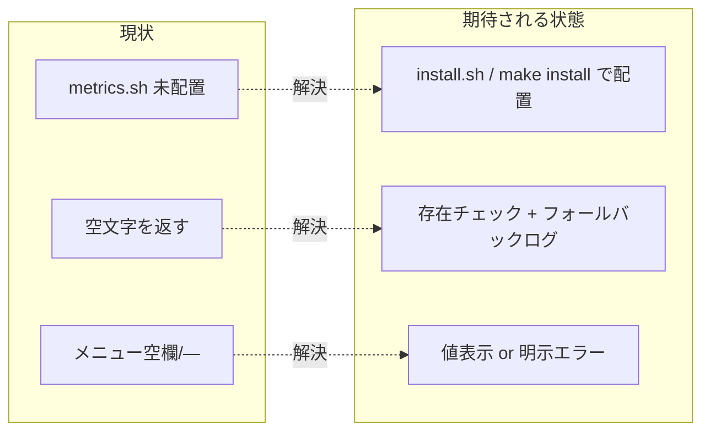

# 要求定義書: メトリクス非表示修正

**プロジェクト名**: Mac Health Keeper / メトリクス非表示修正
**作成日**: 2026 年 05 月 29 日
**最終更新**: 2026 年 05 月 29 日

> **重要**: 本 issue は、メニューバー上で CPU 負荷・空きメモリ・スワップ使用量が表示されなくなった不具合を恒久的に解消することを目的とする。

---

## 1. 目的・背景

### 1.1 目的（必須）

メニューバー上で負荷・空きメモリ・スワップ等のメトリクスが常に正しく表示される状態を取り戻す。

### 1.2 背景

- **現状の課題**:
  - 再起動後にメニューを開くと「負荷」「空きメモリ」「スワップ使用量」「Uptime」「Compressed」が空欄または `—` で表示される。
  - 直近のリファクタ（`3b9824f refactor: メトリクス取得を metrics.sh に集約 (issue C)`）で `MetricsCollector` は `~/.local/bin/mac-health/lib/metrics.sh <metric>` を呼び出す形に変更されたが、ユーザー環境の `~/.local/bin/mac-health/lib/` には `log.sh` と `notify.sh` しか配置されておらず、`metrics.sh` が存在しない。
  - 結果、`runner.run("/bin/bash", [存在しないパス, "load"])` 等が空文字を返し、`MetricsParser.parse*` が既定値で埋められ表示不能となっている。
  - 表面的には「アプリだけが新しい（5/28 16:22 にビルド済）／scripts は古い（5/27 配置のまま）」の不整合で、`install.sh` 全体を完走させずに再起動した運用ミスが直接の引き金。
  - リポジトリには「アプリだけ・もしくは scripts だけ更新する手段」が公式に整備されておらず、再発リスクが残る。

- **必要性**:
  - メトリクス可視化はアプリの中心機能であり、表示できないと存在意義が失われる。
  - install.sh の再実行で一時的には直るが、同じトリガで再発する構造が残るため恒久対策が必要。

### 1.3 期待される効果（必須: 1 件以上）

- **効果 1**: ユーザー実機で `負荷 / 空き / スワップ / Uptime / Compressed` の 5 指標がメニュー上に値付きで表示される（○/× 判定可能）。
- **効果 2**: `metrics.sh` が未配置の場合でも、メニュー上に「メトリクス取得不可」を明示するラベルが出て、ユーザーが気付ける（サイレント空欄をやめる）。
- **効果 3**: 開発者が `make install` / `make build` で一貫した手順を踏める。バイナリだけ・scripts だけが更新される運用ミスを構造的に回避できる。

**現状と期待される状態の比較**:

---

## 2. 機能要件

### 2.1 既存機能の維持（該当する場合）

- メトリクス収集の値・書式・順序・閾値判定は 02 §3.4 / 8.3 で定めた振る舞いを維持する。
- `metrics.sh` の `case` ディスパッチ（load/swap/free/compressed/uptime_days/uptime_hours/docker）は不変。

### 2.2 新規機能要件

- `MetricsCollector` 初期化時に `metricsShPath` の存在を確認し、不在なら 1 度だけ stderr に警告を出す。
- 値が取れない指標について、現状の `—` 表示に加えて「再インストールが必要」を伝える手段（ヘルプメニュー or トースト通知ではなく、まずは stderr ログ + 警告ラベル）を提供する。
- `Makefile` に `build` / `install` / `reinstall` ターゲットを追加し、`./install.sh` を `make install` から正規ルートで呼べるようにする。

---

## 3. 非機能要件

### 3.1 パフォーマンス

- メトリクス収集 60 秒周期は不変。存在チェックは初期化時 1 回のみ。

### 3.2 セキュリティ

- 既存の「補間値を流入させない引数配列起動」原則を崩さない。
- 警告ログにユーザー入力は流入しない（パスは固定）。

### 3.3 互換性

- 既存ユーザーは `./install.sh` または `make install` の再実行で問題解消できる。設定ファイル・LaunchAgent には影響を与えない。

### 3.4 保守性

- `make build` / `make install` の追加により、開発者の運用手順が一元化される。

---

## 4. 制約条件

### 4.1 技術的制約

- macOS のみ。`/bin/bash`・`sysctl`・`vm_stat`・`memory_pressure` が利用可能であること。
- `metrics.sh` の出力書式は MetricsParser 側の入力契約に従う（02 §3.4 既存）。

### 4.2 既存システムとの互換性

- LaunchAgent plist・ジョブ実行スクリプトには手を入れない。

### 4.3 移行期間・スケジュール

- 本 issue 単発で完結（半日見当）。

---

## 5. 除外要件

- `metrics.sh` 不在時に Swift 内で `sysctl`/`vm_stat`/`uptime`/`memory_pressure` を直接叩く形に切り戻すフォールバック実装は本 issue では行わない（責務重複・設計逸脱のリスク）。明示エラーを出して再インストールを促す方針に留める。
- アプリ起動時にユーザーへ macOS 通知を投げる強い UX 改善は対象外。

---

## 6. 成功基準（必須: 1 件以上）

- 受け入れ基準 1: `./install.sh` 再実行後にアプリを再起動し、メニュー上で 5 指標（負荷／空き／スワップ／Uptime／Compressed）が値付きで表示される。
- 受け入れ基準 2: `metrics.sh` を意図的に rename したアプリ起動で、stderr に警告が 1 回出力され、メニュー上にも「メトリクス取得不可（再インストールが必要）」相当の表示が出る。
- 受け入れ基準 3: `make build` でビルドが通り、`make install` で `./install.sh` が呼ばれる。`make check` が緑のまま維持される。

---

## 7. リスクと対策

### 7.1 技術的リスク

- **リスク**: 警告ラベル追加が `MenuModel.build` の既存契約に影響する。
  - **対策**: `MetricsSnapshot` に `collectorErrors: [String]` 等のオプションフィールドを追加し、空時は従来通りの表示を維持する。`MetricsParser` の純粋関数群には触れない。

### 7.2 スケジュールリスク

- **リスク**: 検証で実機 GUI 動作を要する。
  - **対策**: 同一 PC 上で `install.sh` 再実行・アプリ再起動 → メニュー表示確認の手順で短時間検証する。

---

## 8. 参考資料

### プロジェクトドキュメント

- `.workflow/close/20260527_225413_規約準拠改善/`（issue C: metrics.sh 集約）
- `src/MetricsCollector.swift`, `scripts/lib/metrics.sh`, `install.sh`, `Makefile`

### その他の参考資料

- 直近コミット `3b9824f refactor: メトリクス取得を metrics.sh に集約 (issue C)`

---

## 9. 次のステップ

- **次**: [`01_要件定義.md`](./01_要件定義.md)
