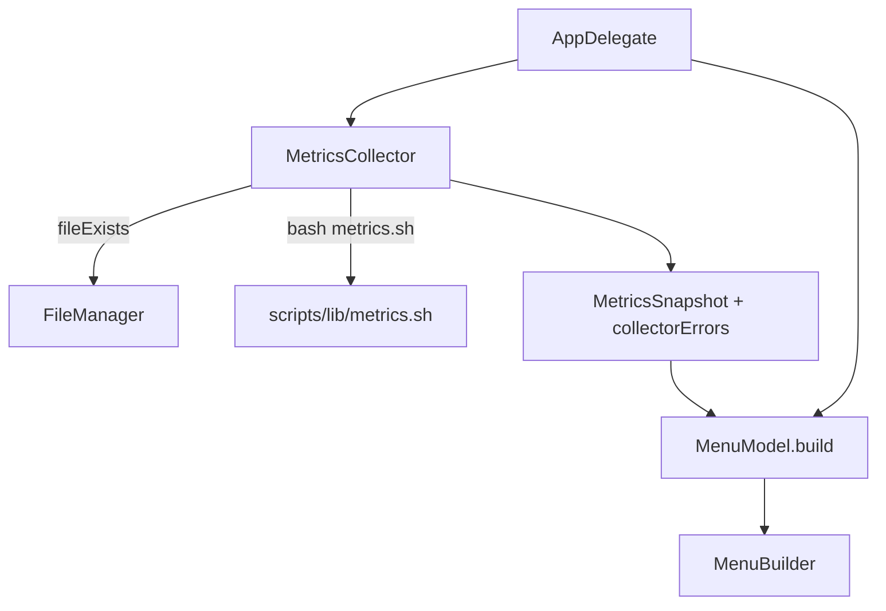
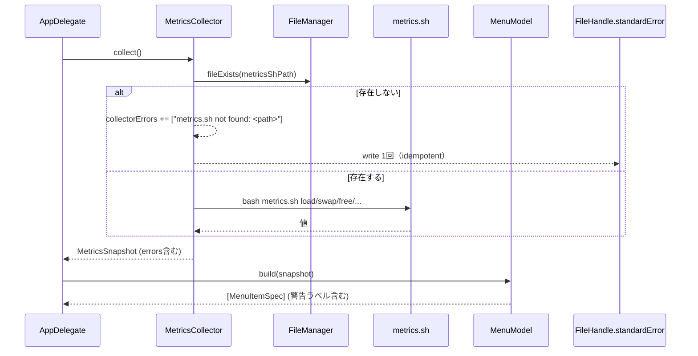

# 設計書: メトリクス非表示修正

**プロジェクト名**: Mac Health Keeper / メトリクス非表示修正
**作成日**: 2026 年 05 月 29 日
**最終更新**: 2026 年 05 月 29 日

---

## 1. 設計概要

### 1.1 設計方針

`MetricsCollector` の振る舞いは振る舞い不変原則（02 §3.4 / 8.3）を維持しつつ、`metrics.sh` 不在時の「サイレントな `—` 表示」を「明示的な警告ラベル + stderr 警告ログ」に置き換える。インストール／ビルド導線は Makefile の薄い委譲ターゲットで一元化する。

### 1.2 設計原則（本プロジェクトで適用するもの）

- **UNIX 哲学**: `metrics.sh` 不在検知ロジックは `MetricsCollector` の初期化時の 1 つの責務に閉じる。
- **単一責務**: 警告メッセージ生成は `MenuModel` の純粋関数として追加（テスト対象）。
- **明確な境界**: `FileManager.fileExists` 等の Infra 呼び出しは `MetricsCollector` 内に留め、`MenuModel` / `MetricsParser` には影響させない。
- **AIフレンドリー設計**: 既存ファイルへの差分は小さく、変更理由をコメントで残す。

---

## 2. アーキテクチャ設計

### 2.1 責務・境界・参照関係

#### 2.1.1 責務一覧

| コンポーネント                | 責務（1 文）                                                          |
| ----------------------------- | --------------------------------------------------------------------- |
| `MetricsCollector`            | metrics.sh の存在を `FileManager.fileExists` で判定し、結果と前回フラグを `MetricsCollectorPolicy.decide` に渡して I/O（`collectorErrors` への追加・`fputs(stderr)`）を実行する Imperative Shell。 |
| `MetricsCollectorPolicy`      | 存在状態・パス・前回フラグから「追加するエラー配列」「stderr に出す行」「次回フラグ」を決定する純粋関数（Functional Core・テスト対象）。 |
| `MetricsSnapshot`             | 既存指標に加え、収集時の警告メッセージ配列を保持する。                |
| `MenuModel`                   | `collectorErrors` が空でない場合、警告ラベルを `headerSpecs` 直後に挿入する純粋関数。 |
| `Makefile`                    | `build` / `install` / `reinstall` / `test-swift-purecore` ターゲットを提供し、`install.sh` / `swiftc` / `swift run MacHealthCheck` を委譲呼び出しする。 |
| `MacHealthCheck`（executable）| XCTest 非搭載環境（CommandLineTools のみ等）でも常に走る純粋関数単体テストランナー。`MetricsCollectorPolicy` / `MenuModel.errorBannerSpecs` / `MetricsParser` の BDD シナリオを実行する。 |
| `install_metrics_smoke_test.sh` | `scripts/lib/metrics.sh` の物理存在・`install.sh` の cp 範囲・コピー後の bash 経路の値返却を smoke 検証するシェルテスト。`make test-shell` から実行される。 |

#### 2.1.2 境界

- **入力**: `metricsShPath`（文字列）の絶対パス、`FileManager.default`。
- **出力**: `MetricsSnapshot.collectorErrors: [String]`、メニュー上の警告ラベル、stderr ログ。
- **他責務との境界**: メトリクス値そのものの取得・パースは既存ロジックで行う。本 issue は「収集経路の健全性チェック」と「導線整備」のみに閉じる。

#### 2.1.3 参照関係

- `AppDelegate` → `MetricsCollector` →（任意）`FileManager` → 警告を `MetricsSnapshot` へ。
- `AppDelegate` → `MenuModel.build` → `headerSpecs` / `errorBanner`。
- `Makefile` → `install.sh` / `swiftc`。

### 2.2 システムアーキテクチャ

- **採用パターン**: 既存の Functional Core / Imperative Shell を踏襲。`MetricsCollector` の存在チェック追加は Imperative Shell 側、警告ラベル生成は Functional Core 側。
- **根拠**: 既存方針との整合（[.agents/spec/01_設計原則.md](../../.agents/spec/01_設計原則.md) §単一責務・§明確な境界）。

#### 2.2.2 アーキテクチャ図



### 2.3 コンポーネント構成

- 既存の `src/MetricsCollector.swift` を**最小差分**で改修。
- `Sources/MacHealthKit/Metrics.swift` の `MetricsSnapshot` に `collectorErrors: [String]` を追加（既定 `[]`）。
- `Sources/MacHealthKit/MenuModel.swift` の `build()` に「collectorErrors が空でなければ警告ラベルを `headerSpecs` 直後に挿入」するロジックを追加。
- `Makefile` に `build` / `install` / `reinstall` を追加。

### 2.4 データフロー



---

## 3. 詳細設計

### 3.1 `MetricsSnapshot` の拡張

```swift
public struct MetricsSnapshot: Equatable {
    // ...既存フィールド...
    public var collectorErrors: [String]

    public init(uptimeDays: Int = 0,
                uptimeHours: Int = 0,
                loadAvg: String = "—",
                memoryFreePct: String = "—",
                compressedGB: String = "—",
                swapUsed: String = "—",
                dockerLine: String = "—",
                jobs: [String: JobStatus] = [:],
                lastUpdated: Date = .distantPast,
                collectorErrors: [String] = []) {
        // ...既存代入...
        self.collectorErrors = collectorErrors
    }
}
```

- 既定値 `[]` のため、既存呼び出し・既存テストへの影響なし。

### 3.2 `MetricsCollector` の存在チェック（テスト可能化リファクタ）

> 当初実装は `MetricsCollector.collect()` 内に if 文と `fputs` を直接書いていたが、`FileManager` / stderr に依存して XCTest 対象外であった。本リファクタで純粋ロジック部を `MetricsCollectorPolicy.decide` に分離し、テスト可能化する。

- `init` で `metricsShPath` と `fileExists: (String) -> Bool`（既定 `FileManager.default.fileExists(atPath:)`）を受ける。
- `collect()` の冒頭：
  1. `fileExists(metricsShPath)` を呼んで真偽値を得る。
  2. `MetricsCollectorPolicy.decide(exists:, path: metricsShPath, previouslyWarned: warnedAboutMissingScript)` を呼ぶ。
  3. 戻り値の `collectorErrorsToAppend` を `s.collectorErrors` に追加。
  4. `stderrLineToWrite` が non-nil なら `fputs(line, stderr)`。
  5. `warnedAboutMissingScript = decision.nextWarnedAboutMissingScript` で更新。
- `MetricsCollectorPolicy.decide` の純粋関数仕様（要件 01 UC4 シナリオ 1〜5）：
  - exists=true → 追加なし・stderr なし・フラグ false にリセット
  - exists=false / previouslyWarned=false → 追加 1 件・stderr 1 行・フラグ true
  - exists=false / previouslyWarned=true → 追加 1 件・stderr なし（スパム抑止）・フラグ true
  - 警告文言は `MetricsCollectorPolicy.missingScriptCollectorError(path:)` / `missingScriptStderrLine(path:)` を介して固定書式を強制（パスのみ補間）
- 既存の `metric("load") / metric("swap") / metric("free") / ...` 系呼び出しはスキップせず実行（`/bin/bash <存在しないパス>` は空文字を返す）。これにより既存の `MetricsParser` のフォールバック挙動（`"—"`）が維持される。

### 3.3 `MenuModel` の警告ラベル

- `build()` で `snapshot.collectorErrors.isEmpty == false` のとき、`headerSpecs()` の直後に
  - `MenuItemSpec.disabled("⚠ メトリクス取得不可: ./install.sh を再実行してください")` を 1 件追加し、続いてセパレータを追加する。
- 既存 `headerSpecs` / `metricsSpecs` の文言・順序・action は不変。

### 3.4 Makefile ターゲット

- `build`: `install.sh` の swiftc 一連の流れを `build/` 配下で実行（ファイルリストは install.sh と同一）。失敗時は非 0 終了。
- `install`: `./install.sh` を呼び出す。
- `reinstall`: `./uninstall.sh` → `./install.sh` を順に呼ぶ。
- `.PHONY` に追加し、既存 `test` / `check` 系には影響なし。

---

## 4. テスト戦略

### 4.1 経路 1: XCTest 非依存の純粋関数テスト（必須・常時実行）

- `Sources/MacHealthCheck/main.swift`（executable target）に BDD 形式で
  `MetricsCollectorPolicy.decide` / `MenuModel.errorBannerSpecs` / `MenuModel.build` / `MetricsParser.parse*` のシナリオを実装。
- `swift run MacHealthCheck` で実行され、失敗時は `exit(1)`。
- `make test-swift-purecore` および `make check` 経由の `test` ターゲットで常時実行（XCTest 搭載有無に依存しない）。
- 観点: 01 UC1（正常系）/ UC2（不在時の異常系）/ UC4-S1〜S5（decide 純粋関数）/ UC5-S1, S2（parser フォールバック）。

### 4.2 経路 2: シェル smoke（必須・常時実行）

- `scripts/test/install_metrics_smoke_test.sh`（新設）で以下を検証：
  - リポジトリの `scripts/lib/metrics.sh` が物理的に存在する（UC6-S1）
  - `install.sh` の `cp -R scripts/lib/. .../lib/` 行が残っている（UC6-S2）
  - 一時 HOME へコピーして `bash metrics.sh load/swap/free` が空文字以外を返す（UC6-S3）
- `make test-shell` のフォールバック経路に統合（bats 利用時は `bats scripts/test/` で自動収集）。

### 4.3 経路 3: XCTest（追加・搭載環境のみ）

- `Tests/MacHealthKitTests/MenuModelTests.swift` の追加 3 ケース（既存）は **二重検知の安全網**。
- Command Line Tools のみの環境では SKIP されるが、Xcode 環境では `swift test` で実行可能。
- 経路 1 が同等観点を必ずカバーするため、SKIP しても受け入れ基準は満たされる。

---

## 5. 影響範囲

| 種別     | 影響                                                                  |
| -------- | --------------------------------------------------------------------- |
| 既存呼び出し | `MetricsSnapshot.init` に `collectorErrors:` を**デフォルト引数**で追加するため後方互換。 |
| 既存テスト | 既存 MenuModel テスト・MetricsParser テストはそのまま緑のはず。       |
| 既存 CI    | `make check` ターゲットに変更なし。                                   |
| ユーザー   | `make install` または `./install.sh` で復旧。修正後アプリには警告ラベル機構が入る。 |

---

## 6. 設計判断ログ

- **Q**: `metrics.sh` 不在時に Swift から `sysctl`/`vm_stat`/`uptime`/`memory_pressure` を直接呼ぶフォールバックを入れるか？
- **A**: 入れない。issue C で「メトリクス取得は metrics.sh に集約」を方針決定済みのため、Swift 側に並列ロジックを置くと責務重複・テスト二重化が発生する。明示エラー方式で代替する。

- **Q**: 警告ラベルを通知（osascript）にすべきか？
- **A**: 起動毎に通知ポップアップが出ると煩わしい。メニュー上の警告ラベルと stderr ログのみとし、UX を最小侵襲にする。

- **Q**: `src/Info.plist::CFBundleVersion` の bump は本 issue の範囲か？
- **A**: **範囲内**。本 issue は「修正後アプリ」を成果物として配布する性質のため、`CFBundleVersion=1.2 → 1.3` を本 issue 内で実施する。アプリバージョンの正本は `Info.plist`（`CFBundleVersion` / `CFBundleShortVersionString`）であり、`src/MacHealth.swift::showAbout` の About アラート文言・`docs/02_画面設計/G012`・`docs/01_システム概要/04_ディレクトリ構成` の `CFBundleVersion` 記載はこれに追従する従属情報として同時更新する。仕様書バージョン（`vX.Y.Z`）は別概念で本 issue では `v1.3.0` を採用。詳細は [`.agents/spec/04_仕様更新ルール.md`](../../.agents/spec/04_仕様更新ルール.md) §アプリバージョンの正本 を参照。

---

## 7. 次のステップ

- **次**: [`03_実装計画.md`](./03_実装計画.md)
