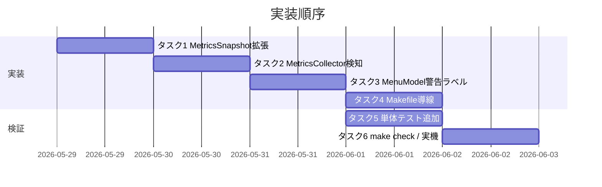

# 実装計画書: メトリクス非表示修正

**プロジェクト名**: Mac Health Keeper / メトリクス非表示修正
**作成日**: 2026 年 05 月 29 日
**最終更新**: 2026 年 05 月 29 日

---

## 1. 実装概要

### 1.1 実装方針（必須）

`MetricsCollector` の振る舞いを既存のまま保ち、`metrics.sh` 不在を初期化／収集の冒頭で検知して `MetricsSnapshot.collectorErrors` に積み、`MenuModel` がそれを警告ラベルとして描画する。Makefile に `build` / `install` / `reinstall` の薄い委譲ターゲットを追加し、運用導線を一元化する。

### 1.2 実装順序（必須: 1 件以上）



---

## 2. タスク分解

### 2.1 タスク 1: `MetricsSnapshot` に `collectorErrors` を追加

#### 2.1.1 概要

メトリクス収集エラーを伝搬するための任意フィールドを `MetricsSnapshot` に追加する。

#### 2.1.2 実装内容

- `Sources/MacHealthKit/Metrics.swift` の `MetricsSnapshot` に `public var collectorErrors: [String]` を追加。
- 既定値 `[]`、`init` の末尾オプション引数として加える（既存呼び出しに影響なし）。

#### 2.1.3 テスト観点

##### 単体

- 正常系: 既定 `init()` で `collectorErrors == []`。
- 正常系: 明示指定で配列が反映される。

##### 結合/API

- 該当なし。

##### E2E/受け入れ

- 既存メニュー描画テストがそのまま緑であること。

##### バリデーション

- 該当なし。

#### 2.1.4 単体テスト仕様（BDD）

```swift
/// ユースケース: MetricsSnapshot の初期化
/// シナリオ: collectorErrors の既定値は空配列である
func test_collectorErrors_default_isEmpty() {
    // Given: 引数なしで MetricsSnapshot を初期化
    let s = MetricsSnapshot()
    // When: collectorErrors を参照
    let errors = s.collectorErrors
    // Then: 空配列である
    XCTAssertEqual(errors, [])
}
```

---

### 2.2 タスク 2: `MetricsCollector` に存在チェック追加

#### 2.2.1 概要

`collect()` の冒頭で `metrics.sh` の存在を `FileManager.default.fileExists` で確認し、不在時に `MetricsSnapshot.collectorErrors` へ警告メッセージを追加し、stderr へ 1 回だけ警告を出力する。

#### 2.2.2 実装内容

- `src/MetricsCollector.swift` に以下を追加。
  - 私有プロパティ `private var warnedAboutMissingScript: Bool = false`
  - `collect()` 冒頭で `if !FileManager.default.fileExists(atPath: metricsShPath)` を判定し、`s.collectorErrors.append(...)`。
  - 同時に `if !warnedAboutMissingScript { fputs("[MetricsCollector] metrics.sh not found: \(metricsShPath)\n", stderr); warnedAboutMissingScript = true }`。
- 既存のメトリクス取得呼び出しは**変更しない**（`/bin/bash <不在パス>` が空文字を返す → 既存 `MetricsParser` のフォールバックで `"—"` が保たれる）。

#### 2.2.3 テスト観点

##### 単体

- `MetricsCollector` は実コマンド・FileManager 依存のため XCTest 対象外（02 §6.1 既存方針を踏襲）。
- 動作確認は実機での目視検証（`install.sh` 再実行で警告が消える／rename で警告が出る）。

##### 結合/API

- 該当なし。

##### E2E/受け入れ

- 実機で metrics.sh をリネームしてアプリ起動 → メニュー先頭に警告ラベル、stderr に警告が出る。
- リネーム解除して再起動 → 警告が消え値が出る。

##### バリデーション

- 該当なし。

#### 2.2.4 単体テスト仕様（BDD）

- 実コマンド依存のため XCTest 対象外。実機検証で代替する。

---

### 2.3 タスク 3: `MenuModel` に警告ラベル挿入ロジック追加

#### 2.3.1 概要

`build()` で `snapshot.collectorErrors` が空でなければ、`headerSpecs()` 直後に警告ラベル + セパレータを 1 件挿入する。

#### 2.3.2 実装内容

- `Sources/MacHealthKit/MenuModel.swift` の `build()` を改修。
- 追加ヘルパ: `func errorBannerSpecs(_ errors: [String]) -> [MenuItemSpec]`。空なら `[]`、それ以外は `.disabled("⚠ メトリクス取得不可: ./install.sh を再実行してください")` ＋ `.separator()` を返す。
- 文言は固定（補間値なし）。`errors` の中身ではなく「不可 + 再インストール促進」を 1 行で示す。詳細は stderr に出る。

#### 2.3.3 テスト観点

##### 単体

- 正常系（空）: `collectorErrors` が `[]` のとき、`build()` の出力に警告ラベルが含まれない。
- 異常系（非空）: `collectorErrors` に 1 件以上あるとき、`headerSpecs` の直後（index 2）に `.disabled("⚠ メトリクス取得不可: ./install.sh を再実行してください")` が入り、index 3 がセパレータである。

##### 結合/API

- 該当なし。

##### E2E/受け入れ

- 実機での目視で警告ラベルが表示される。

##### バリデーション

- 該当なし。

#### 2.3.4 単体テスト仕様（BDD）

```swift
/// ユースケース: MenuModel が collectorErrors を反映する
/// シナリオ: errors が空ならば警告ラベルは挿入されない
func test_menuModel_noErrors_omitsBanner() {
    // Given: collectorErrors が空の snapshot
    let snapshot = MetricsSnapshot()
    // When: build を呼び出す
    let specs = MenuModel().build(snapshot: snapshot, catalog: JobCatalog(), timing: ScheduleTiming(), now: Date())
    // Then: 警告ラベル文字列を含むスペックは無い
    XCTAssertFalse(specs.contains { $0.title.contains("メトリクス取得不可") })
}

/// シナリオ: errors が 1 件以上あれば header 直後に警告ラベル + セパレータが入る
func test_menuModel_withErrors_insertsBanner() {
    // Given: collectorErrors に 1 件
    var snapshot = MetricsSnapshot()
    snapshot.collectorErrors = ["metrics.sh not found"]
    // When: build を呼び出す
    let specs = MenuModel().build(snapshot: snapshot, catalog: JobCatalog(), timing: ScheduleTiming(), now: Date())
    // Then: index 2 が警告ラベル、index 3 がセパレータ
    XCTAssertEqual(specs[0].title, "Mac Health Keeper")
    XCTAssertEqual(specs[1].kind, .separator)
    XCTAssertTrue(specs[2].title.contains("メトリクス取得不可"))
    XCTAssertEqual(specs[3].kind, .separator)
}
```

---

### 2.4 タスク 4: `Makefile` ターゲット追加

#### 2.4.1 概要

`make build` / `make install` / `make reinstall` を追加し、開発者の運用導線を一元化する。

#### 2.4.2 実装内容

- `.PHONY` に `build install reinstall` を追加。
- `build`: `install.sh` の swiftc 行を踏襲し、`build/MacHealth` を生成（一時ディレクトリ運用）。
- `install`: `./install.sh` を呼び出す。
- `reinstall`: `./uninstall.sh || true` → `./install.sh`。

#### 2.4.3 テスト観点

##### 単体

- `make -n build` でコマンドが意図通りに展開される（dry-run）。
- `make -n install` が `./install.sh` を含む。

##### 結合/API

- `make build` を実機で実行して終了コード 0、`build/MacHealth` ができる。

##### E2E/受け入れ

- 実機で `make install` がインストールを完走する。

##### バリデーション

- 該当なし。

#### 2.4.4 単体テスト仕様（BDD）

- 単体は `make -n` の出力を目視確認で代替（既存 `make check` の CI 体系を踏襲）。

---

### 2.5 タスク 5: XCTest 追加

#### 2.5.1 概要

`Tests/MacHealthKitTests/MenuModelTests.swift`（または相当）に、上記 2.3.4 の BDD シナリオを追加する。

#### 2.5.2 実装内容

- 既存テストファイルがあれば追記、無ければ最小ファイルを追加。

#### 2.5.3 テスト観点

- 上記 2.1.4 / 2.3.4 の BDD シナリオがパスすること。
- `swift test`（XCTest 利用可能環境）でグリーンであること。

---

### 2.6 タスク 6: `make check` + 実機検証

#### 2.6.1 概要

回帰がないことを確認し、実機で 5 指標が表示されることを目視確認する。

#### 2.6.2 実装内容

- `make check` を実行。失敗時は内訳を 04_review に記録。
- `./install.sh` を再実行 → アプリ再起動 → メニュー値確認。
- `metrics.sh` を一時 rename して再起動 → 警告ラベル確認 → 復旧確認。

---

### 2.7 タスク 7: テスト可能化リファクタ（フォローアップ）

#### 2.7.1 概要

ユーザー指摘「既存テストでは今回の不具合を検知できなかった」への根本対策。`MetricsCollector` の不在検知ロジック（`FileManager.fileExists` 判定 → `collectorErrors` 伝播 → `fputs(stderr)` のスパム抑止）を純粋関数 `MetricsCollectorPolicy.decide` に分離し、XCTest 非搭載環境でも実行可能なテスト経路で必ず回帰検知できるようにする。

#### 2.7.2 実装内容

1. **純粋関数化**: `Sources/MacHealthKit/MetricsCollectorPolicy.swift` を新設。
   - `decide(exists:path:previouslyWarned:) -> Decision`（`collectorErrorsToAppend` / `stderrLineToWrite` / `nextWarnedAboutMissingScript` を返す）。
   - `missingScriptCollectorError(path:)` / `missingScriptStderrLine(path:)` の固定書式ヘルパ。
2. **MetricsCollector のリファクタ**: `src/MetricsCollector.swift` を `MetricsCollectorPolicy.decide` を呼ぶだけにする（振る舞いは完全不変）。
3. **CLI testrunner**: `Sources/MacHealthCheck/`（executable target を `Package.swift` に追加）に BDD 形式の純粋関数テストを実装。`swift run MacHealthCheck` で 32 ケースを実行。
4. **shell smoke test**: `scripts/test/install_metrics_smoke_test.sh` を新設し、`scripts/lib/metrics.sh` の物理存在・`install.sh` の cp 行・コピー後の bash 経路の値返却を smoke 検証（8 ケース）。
5. **Makefile 統合**: `test` ターゲットで `swift run MacHealthCheck` を常時実行・`test-shell` で smoke を実行・XCTest は搭載時のみ追加実行。新規 `test-swift-purecore` を追加。

#### 2.7.3 テスト観点

##### 単体

- `MetricsCollectorPolicy.decide` の 4 入力組（exists × previouslyWarned）すべてで Decision が期待通りであること。
- `missingScript*` ヘルパの戻り値書式がパス補間以外固定であること。
- `MenuModel.errorBannerSpecs([])` == `[]`、`MenuModel.errorBannerSpecs(["x"])` == 2 件（バナー + セパレータ）。
- `MetricsParser.parseLoadAvg/parseSwapUsed/parseMemoryFreePct("")` が `"—"` を返すこと。

##### 結合/API

- `MenuModel.build` に `collectorErrors=[…]` を持つ snapshot を渡すと、index 0/1（ヘッダー）の直後 index 2/3 に警告バナー + セパレータが入る。

##### E2E/受け入れ

- `make check` がすべて緑（SKIP ではなく `MacHealthCheck: 32 passed` を経由）。
- `scripts/lib/metrics.sh` を一時的にリネームして smoke を再実行すると、UC1-S1/UC2-S1/UC3-S1 が FAIL して非 0 終了する（回帰検知が機能している）。

#### 2.7.4 単体テスト仕様（BDD）

`Sources/MacHealthCheck/main.swift` に下記 6 ユースケースを実装済み（合計 32 アサーション）。01_要件定義 UC1-S1 / UC2-S1 / UC4-S1〜S5 / UC5-S1, S2 と対応。

```swift
useCase("MetricsCollectorPolicy が metrics.sh の存在状態を ...") {
    scenario("metrics.sh が配置済み（exists=true）の場合、...") {
        // Given: 配置済み・未警告
        let d = MetricsCollectorPolicy.decide(exists: true, path: "/x", previouslyWarned: false)
        // When: decide を呼ぶ → d
        // Then: 全て空・false
        assertEqual(d.collectorErrorsToAppend, [], "...")
        assertEqual(d.nextWarnedAboutMissingScript, false, "...")
    }
    // ... 他シナリオは要件定義 UC4-S2〜S5 に対応 ...
}
```

---

### 2.8 タスク 8: `src/Info.plist` バージョン bump と連動箇所の追従更新 [完了]

#### 2.8.1 概要

本 issue は「修正後アプリ」を再配布する性質のため、アプリバージョンの正本である `src/Info.plist` の `CFBundleVersion` / `CFBundleShortVersionString` を `1.2 → 1.3` に bump し、連動するコードリテラル・docs を追従更新する。

#### 2.8.2 実装内容

- `src/Info.plist`: `CFBundleVersion=1.2 → 1.3`、`CFBundleShortVersionString=1.2 → 1.3`。
- `src/MacHealth.swift::showAbout`: About アラート `informativeText` 内 `バージョン 1.2 → バージョン 1.3`。
- `docs/02_画面設計/README.md::G012`: `informativeText` の `バージョン 1.2 → 1.3`、Info.plist との同期注記を追加。
- `docs/01_システム概要/04_ディレクトリ構成/README.md`: `src/Info.plist` 行の `CFBundleVersion=1.2 → 1.3`、正本である旨の注記を追加。
- `.agents/spec/04_仕様更新ルール.md`: アプリバージョンの正本ルールとバージョン更新時の必須手順を明文化。

#### 2.8.3 テスト観点

- `make check` 緑（バージョン文字列に依存するテストは無いが、回帰がないことを確認）。
- `grep -rn "バージョン 1\.2"`・`grep -rn "CFBundleVersion=1\.2"` でリポジトリに残存が無い（過去 memo / レビュー記録 / `.workflow/close/` 配下の履歴は対象外）。

---

## 3. 完了条件

- 全タスクの実装が反映され、`make check` が緑。
- 実機で受け入れ基準 1〜3 が満たされる。
- 04_review.md に記録される。
- **フォロー追加**: `make check` で `swift run MacHealthCheck` が SKIP ではなく実行され、純粋関数の 32 アサーションすべてが緑になる。`scripts/lib/metrics.sh` を一時的に外したとき `install_metrics_smoke_test.sh` が FAIL して回帰を検知することが確認できる。
- **追加完了条件 (cycle 3)**: `src/Info.plist` の `CFBundleVersion` / `CFBundleShortVersionString` が `1.3` に bump され、`src/MacHealth.swift::showAbout`・`docs/02_画面設計/README.md::G012`・`docs/01_システム概要/04_ディレクトリ構成/README.md` の連動リテラルが追従更新されている。アプリバージョンの正本ルールが `.agents/spec/04_仕様更新ルール.md` に明文化されている。

---

## 4. 次のステップ

- 実装着手 → 04_review.md。
