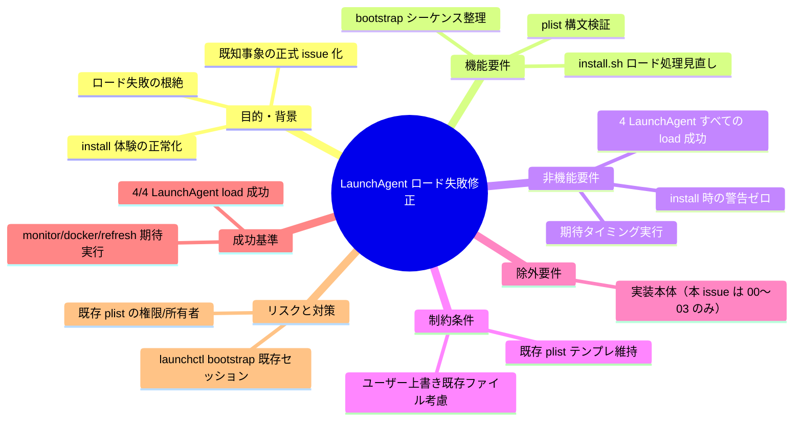
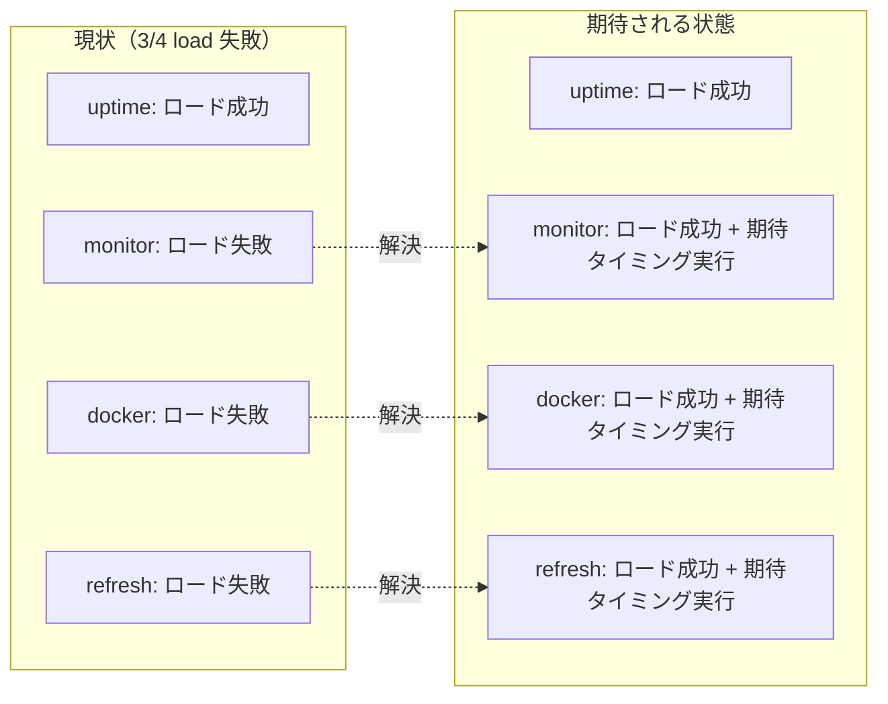

# 要求定義書: LaunchAgent monitor/docker/refresh ロード失敗の調査と修正

**プロジェクト名**: Mac Health Keeper / LaunchAgent ロード失敗の調査と修正
**作成日**: 2026 年 05 月 29 日
**最終更新**: 2026 年 05 月 29 日

> **重要**:
>
> - 本 issue は **`.agents-project/受け入れ基準ルール.md` 適用対象**（LaunchAgent / 常駐サービスに影響する issue として最厳格運用）。
> - PR #3 マージ直後の `./install.sh` 実機検証で再現済みの既知事象。`uptime` のみロード成功、`monitor` / `docker` / `refresh` の 3 件が失敗。
> - 先行 issue `.workflow/close/20260529_083530_メトリクス非表示修正/04_review.md` §6 軽微指摘 / §10.6 で「別 issue 候補」として残置されていたものを正式に起票。
> - 本 issue ではドキュメント（00〜03）の作成のみを行い、実装着手は本依頼の対象外。

---

## 要求定義の全体像

---

## 1. 目的・背景

### 1.1 目的（必須）

`install.sh` 実行時に発生する 3 件の LaunchAgent ロード失敗を恒久的に解消する。

### 1.2 背景

- **現状の課題**:
  - PR #3 マージ直後の実機検証（`memo/20260529_121145_install-verification.md`）で次のロード結果が観測された:
    - `com.github.adachi-tatsuru.machealth.uptime.plist`: **ロード成功**
    - `com.github.adachi-tatsuru.machealth.monitor.plist`: **⚠ ロード失敗**
    - `com.github.adachi-tatsuru.machealth.docker.plist`: **⚠ ロード失敗**
    - `com.github.adachi-tatsuru.machealth.refresh.plist`: **⚠ ロード失敗**
  - 本失敗は先行 issue `20260529_083530_メトリクス非表示修正` §6 軽微指摘 / §10.6 残課題として既知化されており、PR #3 で **再発見** された経緯がある。
  - 「`make check` で完了報告 → 実機検証なし → ユーザー環境で再発見」のサイクルが回ったプロセス上の重大欠陥でもある。

- **必要性**:
  - LaunchAgent は本アプリの常駐機能（メトリクス収集・docker 監視・uptime 計測・自動 refresh）の **基盤**であり、3/4 が load 失敗している状態はそのまま放置できない。
  - install 体験において **「⚠ ロード失敗」が当たり前**になる状態は、新たな不具合が混入したときに検知が遅れる原因となる（ノイズによる感度低下）。
  - 既知事象の正式 issue 化により、根本原因分析（plist 構文 / bootstrap 順序 / 既存セッション競合 / 所有権）を体系的に進める。

### 1.3 期待される効果（必須: 1 件以上）

- **効果 1**: `./install.sh` 実行時、4 LaunchAgent すべてが「ロード成功」と表示される（○/× で判定可能）。
- **効果 2**: monitor / docker / refresh の各 LaunchAgent が **期待タイミング**で実行される（例: monitor は 1 分間隔で実行ログがローテートされる、docker は指定間隔で実行、refresh は `StartCalendarInterval` 通りに発火）。
- **効果 3**: install 後の `launchctl print gui/$(id -u)/com.github.adachi-tatsuru.machealth.*` で 4 件のサービスが `state = running` または `state = waiting` であること（○/× で判定可能）。

**現状と期待される状態の比較**:

---

## 2. 機能要件

### 2.1 既存機能の維持

- 既存 4 plist テンプレ（`launchagents/com.github.adachi-tatsuru.machealth.{uptime,monitor,docker,refresh}.plist.template`）の **目的・スケジュール設計**は維持する。
- `install.sh` の plist 配置先（`~/Library/LaunchAgents/`）・ファイル名規約・置換変数は維持する。

### 2.2 新規機能要件

- **調査**: 失敗 3 件の `launchctl bootstrap` または `launchctl load` のエラー出力を取得し、根本原因（plist 構文・キー競合・所有者/権限・既存セッション・bootstrap 順序）を特定する。
- **修正**: 原因に応じて plist テンプレ・install.sh の load 処理・bootstrap シーケンスのいずれか（または複数）を修正する。
- **検証**: install 後、4 LaunchAgent すべての load 成功と期待タイミング実行を実機で確認できるスモークテスト（shell スクリプト）を追加する。

### 2.3 新規機能要件（追補・2026-05-29 20:48）

ユーザー指示「リファクタではなく新規機能追加として恒久解決する」を受け、最小パッチではなく以下の **新規モジュール群** を導入する。

- **`scripts/lib/launchagent_lifecycle.sh`（新規）**: LaunchAgent の bootout → bootstrap → verify を集約する責務単位の shell ライブラリ。
  - 既存サービスの presence 検査 → bootout → bootstrap → `launchctl print` ベースの verify を 1 関数（`load_launchagent <label> <plist>`）にまとめる。
  - 全ての `launchctl` stderr を構造化（`label=… phase=… exit=… stderr=…`）して stdout に出力。
  - install.sh から本関数を呼ぶだけで冪等な load が保証される。
- **`scripts/lib/plist_validator.sh`（新規）**: plist テンプレ単位の構文検証と必須キー（Label/ProgramArguments）チェック。`make check` 経路でも実行する。
- **`scripts/bin/launchagent-doctor.sh`（新規）**: 4 LaunchAgent の load 状態を `launchctl print` ベースで診断し、人間可読サマリ + JSON 状態ダンプを出力する常設の診断スクリプト。再発時のトリアージに使う。
- **`Sources/MacHealthKit/LaunchAgentStatus.swift`（新規）**: LaunchAgent 状態の pure 型 + `launchctl print` 出力のパース関数。`MetricsCollectorPolicy` パターンに倣う（Functional Core）。pure-core テストで網羅。

### 2.4 既存検証 API の置き換え（追補）

`install.sh` の現行 verification ロジックは `launchctl list | grep` を用いており、`RunAtLoad=false` + interval-only な docker plist など launchd の internal list 反映タイミングに依存して偽陽性（実際は load 成功なのに「⚠ ロード失敗」と表示）を出していたことが調査で判明した（`memo/20260529_204726_root-cause-investigation.md` §2 §3）。

本 issue では検証 API を **`launchctl print gui/<uid>/<label>`** に統一する。これにより、`RunAtLoad=false` + interval-only な plist でも確実に load 状態を判定でき、偽陽性が根絶される。

---

## 3. 非機能要件

### 3.1 パフォーマンス

- `install.sh` 全体所要時間に **5 秒以上の増加を生じさせない**（既存約 12 秒）。

### 3.2 セキュリティ

- 新規外部入力なし。plist 内の `ProgramArguments` パスは `~/.local/bin/mac-health/` 配下の固定パスを維持。

### 3.3 互換性

- 既存ユーザーが旧バージョン（`~/Library/LaunchAgents/` に古い plist が残っている）でも、再 install で正しく置換され load 成功になること。

### 3.4 保守性

- 4 LaunchAgent の load 検証は **shell smoke test** として `scripts/test/` 配下に追加し、`make check` の経路で実行できる形にする（`launchctl print` の出力検査）。

---

## 4. 制約条件

### 4.1 技術的制約

- `launchctl bootstrap gui/$UID` は macOS 10.10+ の API。本プロジェクトは macOS 12+ サポート想定のため問題なし。
- `make check` は CI（`macos-latest`）でも実行されるが、CI ランナーには **GUI セッションが存在しない**ため、`launchctl bootstrap` のフル検証は実機限定。CI 上では「plist 構文検証」（`plutil -lint`）に留める。

### 4.2 既存システムとの互換性

- 既存の close 済み issue（メトリクス非表示修正 / ビルド時バージョン自動 stamp）が導入した `install.sh` のロジック（version_stamp / metrics.sh コピー / `swiftc` ビルド）には影響を与えない。

### 4.3 移行期間・スケジュール

- 本 issue では 00〜03 のドキュメント作成のみ。実装着手は別タイミング。

---

## 5. 除外要件

- 本 issue では **実装を行わない**。00〜03 のドキュメント作成のみ。
- LaunchAgent の **新規追加・廃止**は対象外。
- `launchctl` 以外の常駐機構（systemd 風 / cron / pm2 等）への移行は対象外。

---

## 6. 成功基準（必須: 1 件以上）

- **基準 1**: `./install.sh` 実行後、`~/Library/LaunchAgents/com.github.adachi-tatsuru.machealth.{uptime,monitor,docker,refresh}.plist` の 4 件すべてに対して `launchctl print gui/$(id -u)/<label>` が `state` を出力し、`could not find service` が出ないこと。
- **基準 2**: install 出力の「⚠ ロード失敗」表記が 0 件であること。
- **基準 3**: monitor / docker / refresh の各サービスが、それぞれの plist の `StartCalendarInterval` または `StartInterval` または `RunAtLoad` に従い **期待タイミングで実行された痕跡**（ログ出力 / `launchctl print` の `last exit code` / 実行ファイルの状態変化）を実機で確認できること。
- **基準 4**: `make check` が緑のまま維持されること。
- **基準 5 (実機検証)**: ローカル環境で `./install.sh`（または `make install` / `make reinstall`）を実行し、本 issue で変更・追加した機能（LaunchAgent ロード成功・期待タイミング実行）が期待どおり動作していることを確認したエビデンス（コマンド出力・確認手順・結果）が `04_review.md` または `memo/` 配下に記録されていること。本基準の根拠は [`.agents-project/受け入れ基準ルール.md`](../../.agents-project/受け入れ基準ルール.md) §3.2–3.4。

---

## 7. リスクと対策

### 7.1 技術的リスク

- **リスク**: 既存 LaunchAgent が**動作中**の状態で再 install すると、`launchctl bootstrap` が「Input/output error」または「Service already loaded」を返し、新 plist が反映されない可能性。
  - **対策**: 02_設計 で `bootout` → `bootstrap` の順序を明示し、エラーハンドリング（既ロード時は `bootout` してから `bootstrap`）を install.sh に組み込む方針を記す。

- **リスク**: plist 構文エラーが原因の場合、`plutil -lint` を CI に追加することで検知できる可能性。
  - **対策**: 02_設計 で plist 構文検証ステップを追加する方針を明示。

- **リスク**: `ProgramArguments` 内のパス（`~/.local/bin/mac-health/...`）が ~ 展開されていない可能性。
  - **対策**: 調査フェーズで `launchctl print` の `arguments` 表示を確認し、~/`$HOME` の展開状態を 02 で明示。

### 7.2 スケジュールリスク

- **リスク**: 根本原因が plist 構文ではなく macOS 側のセッション競合だった場合、修正に時間がかかる。
  - **対策**: 段階的に対策（A. install.sh の bootout → bootstrap 化 / B. plist の RunAtLoad 設定見直し / C. 期待タイミングの再設計）を試し、03 でタスク順序を明示。

---

## 8. 参考資料

### プロジェクトドキュメント

- [`.workflow/close/20260529_083530_メトリクス非表示修正/04_review.md`](../../.workflow/close/20260529_083530_メトリクス非表示修正/04_review.md) §6 軽微指摘 / §10.6 — 既知事象の経緯
- [`.workflow/close/20260529_105524_ビルド時バージョン自動stamp/memo/20260529_121145_install-verification.md`](../../.workflow/close/20260529_105524_ビルド時バージョン自動stamp/memo/20260529_121145_install-verification.md) — 再現エビデンス
- [`.agents-project/受け入れ基準ルール.md`](../../.agents-project/受け入れ基準ルール.md) — 受け入れ基準への実機検証必須化
- `launchagents/com.github.adachi-tatsuru.machealth.{uptime,monitor,docker,refresh}.plist.template` — 対象 plist

### その他の参考資料

- `launchctl(1)` / `launchd.plist(5)` man page
- Apple Developer: Daemons and Services Programming Guide

---

## 9. 次のステップ

この要求定義書の承認後、以下のドキュメントを作成します：

- **次**: [`01_要件定義.md`](./01_要件定義.md) - 要件定義フェーズ
