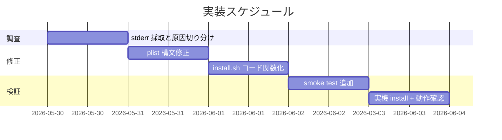

# 実装計画書: LaunchAgent monitor/docker/refresh ロード失敗の調査と修正

**プロジェクト名**: Mac Health Keeper / LaunchAgent ロード失敗の調査と修正
**作成日**: 2026 年 05 月 29 日
**最終更新**: 2026 年 05 月 29 日

---

## 1. 実装概要

### 1.1 実装方針

「調査 → 修正 → 検証」の 3 フェーズで段階実装する。調査フェーズで `launchctl bootstrap` の stderr を必ず採取し、原因仮説（plist 構文 / bootstrap シーケンス / 既ロード競合 / パス未展開）を切り分けてから修正を行う。各タスクの最後に **必ず実機 install + 動作確認**を含める。

### 1.2 実装順序



---

## 2. タスク分解

### 2.1 タスク 1: 調査（stderr 採取と原因切り分け）

#### 2.1.1 概要

3 件の load 失敗の `launchctl bootstrap` stderr を採取し、原因仮説を絞り込む。

#### 2.1.2 実装内容

- `install.sh` 内の `launchctl bootstrap` 呼び出しを `2> tempfile` で標準エラーをキャプチャするように一時的に変更
- 採取した stderr を memo に保存し、原因（plist 構文 / 既ロード競合 / パス未展開 / 権限）を分類

#### 2.1.3 テスト観点

##### 単体（本タスクの具体ケース・必須 1 件以上）

- `bash -n install.sh` で構文 OK
- 採取スクリプトが正常に stderr を tempfile に書き出すこと

##### 結合/API

- `launchctl bootstrap` 実行時、stderr が tempfile に内容を出力すること

##### E2E/受け入れ

- 3 件の失敗 plist それぞれについて、原因仮説（plist 構文 / bootstrap 競合 / パス展開 / 権限）が分類できる

##### バリデーション

- 該当なし

#### 2.1.4 単体テスト仕様（BDD）

```gherkin
Feature: stderr 採取
  Scenario: launchctl bootstrap 失敗時に stderr がキャプチャされる
    Given install.sh を一時的に stderr リダイレクト付きで実行する
    When launchctl bootstrap が失敗する
    Then tempfile に stderr が記録され、空でない
```

```bash
# Given: install.sh を tempfile 経由で実行する
# When: launchctl bootstrap が失敗する
# Then: tempfile に non-empty な内容が書かれている
test -s "$TEMPFILE" || exit 1
```

#### 2.1.5 依存関係

- なし（最初のタスク）

#### 2.1.6 見積もり

- **工数**: 0.5 日
- **優先度**: 高

### 2.2 タスク 2: plist 構文修正（必要に応じて）

#### 2.2.1 概要

調査結果が plist 構文起因の場合、4 plist テンプレに `plutil -lint` を通し、問題箇所を修正する。

#### 2.2.2 実装内容

- `launchagents/*.plist.template` 4 件すべてに `plutil -lint` を実行
- 構文エラーがあれば修正
- CI（`.github/workflows/check.yml`）に `plutil -lint` ステップを追加し、構文エラーを CI で検知

#### 2.2.3 テスト観点

##### 単体

- `plutil -lint` 4 件全部 `OK`

##### 結合/API

- `launchctl bootstrap` で 4 件すべて `state` を返す

##### E2E/受け入れ

- 実機 install 後の `launchctl print` で 4 件 OK

##### バリデーション

- 該当なし

#### 2.2.4 単体テスト仕様（BDD）

```gherkin
Feature: plist 構文
  Scenario: 4 plist テンプレすべての plutil -lint が OK
    Given launchagents/*.plist.template が 4 件存在する
    When plutil -lint を実行する
    Then 4 件すべて "OK" を返す
```

```bash
# Given: 4 件の plist テンプレが存在
# When: plutil -lint を実行
# Then: すべて OK
for p in launchagents/*.plist.template; do
  plutil -lint "$p" || exit 1
done
```

#### 2.2.5 依存関係

- タスク 1

#### 2.2.6 見積もり

- **工数**: 0.5 日
- **優先度**: 高

### 2.3 タスク 3: install.sh の LaunchAgent ロード関数化

#### 2.3.1 概要

`install.sh` の LaunchAgent ロード処理を関数 `load_launchagent` / `verify_launchagent` に切り出し、`bootout` → `bootstrap` → `print` の順序で 4 件にループ適用する。

#### 2.3.2 実装内容

- `install.sh` 内に関数 `load_launchagent` を追加
- 既存のロード処理を関数呼び出しに置換
- `bootstrap` 失敗時の stderr をログに残し、サマリに「⚠ ロード失敗: <label>」を出力する整形を追加
- 全 4 件処理後、失敗があれば exit code を変える（方針: `INSTALL_FAIL_ON_LAUNCHAGENT=1` 環境変数で切替可能とする）

#### 2.3.3 テスト観点

##### 単体

- 関数 `load_launchagent` を mock（`launchctl` を関数で差し替え）し、bootout → bootstrap → print の順で呼ばれる

##### 結合/API

- 実機実行で 4 件 OK

##### E2E/受け入れ

- 実機 install 出力サマリで 4/4 OK が表示される

#### 2.3.4 単体テスト仕様（BDD）

```gherkin
Feature: load_launchagent 関数
  Scenario: bootout → bootstrap → print の順序で呼ばれる
    Given launchctl を mock 化した shell test 環境
    When load_launchagent <label> を呼び出す
    Then 呼び出し順序が bootout → bootstrap → print であること
```

```bash
# Given: launchctl を mock 化
launchctl() { echo "called: $*" >> "$TRACE"; }
export -f launchctl
# When: load_launchagent を呼ぶ
load_launchagent "test.label"
# Then: 順序を確認
grep -q "bootout" "$TRACE" && grep -q "bootstrap" "$TRACE" && grep -q "print" "$TRACE" || exit 1
```

#### 2.3.5 依存関係

- タスク 2

#### 2.3.6 見積もり

- **工数**: 1 日
- **優先度**: 高

### 2.4 タスク 4: smoke test 追加

#### 2.4.1 概要

`scripts/test/launchagent_load_smoke_test.sh` を新設し、4 件の `launchctl print` 検査 + plist 構文検査を行う。

#### 2.4.2 実装内容

- shell スクリプト新規作成
- `Makefile` の `test-shell` ターゲットに組み込み
- `make check` の経路で実行される

#### 2.4.3 テスト観点

##### 単体

- スクリプト単体実行で 4 件 OK / NG を正しく判定

##### 結合/API

- `launchctl print` の stub を差し替えるテスト

##### E2E/受け入れ

- 実機 install 直後に `bash scripts/test/launchagent_load_smoke_test.sh` で OK

#### 2.4.4 単体テスト仕様（BDD）

```gherkin
Feature: launchagent_load_smoke_test
  Scenario: 4 件すべて state を返したら exit 0
    Given launchctl print が 4 件すべて state を返す
    When スモークテストを実行
    Then "4 passed, 0 failed" を出力し exit 0
```

#### 2.4.5 依存関係

- タスク 3

#### 2.4.6 見積もり

- **工数**: 0.5 日
- **優先度**: 高

### 2.4a タスク 4a: 新規 LaunchAgent ライフサイクルモジュール（追補・2026-05-29）

#### 概要

`scripts/lib/launchagent_lifecycle.sh`（新規）に `load_launchagent` 関数を実装し、冪等な bootout → bootstrap → verify を集約する。`LAUNCHCTL_BIN` 環境変数で launchctl 実体を差し替え可能にする（テスト用）。

#### 実装内容

- `scripts/lib/launchagent_lifecycle.sh` 新規ファイル
- 関数: `load_launchagent <label> <plist_path>` — exit 0=success, 1=verify failure
- 関数: `verify_launchagent_loaded <label>` — `launchctl print` ベース判定
- 各 launchctl 呼び出しの stderr は `tempfile` で受け、構造化ログ `label=… phase=… exit=… stderr=…` を stdout に出す。
- `scripts/test/launchagent_lifecycle_test.sh`（新規）で BDD 8 ケース以上をカバー。

#### BDD（タスク本体）

```gherkin
Feature: launchagent_lifecycle
  Scenario UC4-S1: load_launchagent が bootout → bootstrap → verify の順序で launchctl を呼ぶ
  Scenario UC4-S2: bootstrap 失敗時 stderr を構造化ログに残す
  Scenario UC4-S3: verify は launchctl print のみで判定する
  Scenario UC4-S4: 関数の戻り値は verify 成否
```

#### 依存関係

- タスク 2 完了後

### 2.4b タスク 4b: plist_validator + launchagent-doctor 新規追加

#### 概要

- `scripts/lib/plist_validator.sh`（新規）— plist 構文 + 必須キー検証
- `scripts/bin/launchagent-doctor.sh`（新規）— 4 件 LaunchAgent 診断スクリプト
- `scripts/test/plist_validator_test.sh`（新規）
- `scripts/test/launchagent_doctor_test.sh`（新規）

#### BDD（タスク本体）

UC5-S1 / UC5-S2 / UC6-S1〜S3 をカバー。

#### 依存関係

- タスク 4a 完了後

### 2.4c タスク 4c: LaunchAgentStatus pure 型（Swift）

#### 概要

- `Sources/MacHealthKit/LaunchAgentStatus.swift`（新規）— pure 値型 + `launchctl print` 出力パース静的メソッド
- pure-core テスト（`Sources/MacHealthCheck/main.swift`）に **10 件以上**のアサーションを追加（UC6-S1〜S3 + 境界）
- `Tests/MacHealthKitTests/LaunchAgentStatusTests.swift`（新規・XCTest）

#### 依存関係

- 並列可（タスク 1 完了後）

### 2.4d タスク 4d: install.sh の lifecycle 呼び出し置換（最小差分）

#### 概要

- `install.sh` の LaunchAgent ロードブロック（L116-129）を `launchagent_lifecycle.sh` の `load_launchagent` 呼び出しに置換
- 既存のサマリ表示（`✅ $job loaded` / `⚠️  $job ロード失敗`）形式は維持
- 検証 API を `launchctl list | grep` から `launchctl print` ベース（`verify_launchagent_loaded`）に切り替え

#### 依存関係

- タスク 4a 完了後

### 2.5 タスク 5: 実機 install + 動作確認（**本ルール強制**）

#### 2.5.1 概要

本ルール `.agents-project/受け入れ基準ルール.md` §3.2–3.4 に従い、ローカル macOS で `./install.sh` を実行して 4 LaunchAgent の load 成功と期待タイミング実行を実機で確認する。

#### 2.5.2 実装内容

- ローカル macOS で `./install.sh` を実行
- 4 件 plist の `launchctl print` 出力を取得し、`state` を確認
- 数分待機して monitor / docker / refresh の実行痕跡（ログ / `last exit code` / `runs`）を確認
- エビデンスを `memo/<YYYYMMDD_HHMMSS>_install-verification.md` に記録

#### 2.5.3 テスト観点

##### E2E/受け入れ

- install 出力に「⚠ ロード失敗」0 件
- `launchctl print gui/$(id -u)/<label>` が 4 件すべて `state` を返す
- 数分後に monitor / docker / refresh の実行痕跡が確認できる

##### バリデーション

- 該当なし

#### 2.5.4 単体テスト仕様（BDD）

```gherkin
Feature: 実機検証
  Scenario: install 後の 4 件 load 成功と期待実行
    Given クリーンな ~/Library/LaunchAgents/ または既存ロード状態
    When ./install.sh を実行
    Then install 出力の「⚠ ロード失敗」が 0 件
    And launchctl print が 4 件すべて state を返す
    And 数分後に monitor/docker/refresh の last exit code または runs が更新されている
```

#### 2.5.5 依存関係

- タスク 4

#### 2.5.6 見積もり

- **工数**: 0.5 日
- **優先度**: 必須

---

## テスト観点

タスクごとの §2.x.3 を参照。全体としては「plist 構文」「ロード結果」「期待タイミング実行」「サマリ表示」の 4 観点を網羅する。

---

## 単体テスト

タスクごとの §2.x.4 BDD を参照。

---

## BDD

01_要件定義.md §2.2 の UC1-S1, UC1-S2, UC2-S1, UC2-S2, UC2-S3, UC3-S1 をすべて自動化 + 実機検証する。

---

## 3. 実装スケジュール

### 3.1 マイルストーン

| マイルストーン | 期日 | 成果物 |
|---|---|---|
| 調査完了 | 2026-05-30 | stderr 採取結果と原因分類 |
| 修正完了 | 2026-06-01 | install.sh + plist テンプレ修正 |
| 検証完了 | 2026-06-02 | smoke test + 実機検証エビデンス |

### 3.2 実装フェーズ

#### フェーズ 1: 調査

- タスク 1

#### フェーズ 2: 修正

- タスク 2, 3

#### フェーズ 3: 検証

- タスク 4, 5

---

## 4. テスト計画

各タスクの §2.x.3 / §2.x.4 を参照。実機検証はタスク 5 で必須化。

### 4.1 テストの優先順位

- 実機 install 検証（タスク 5）を最優先で必須化
- plist 構文検証は CI で自動化

---

## 5. リスク管理

### 5.1 実装リスク

- **リスク**: 原因が「macOS バージョン依存の launchd 仕様変更」だった場合、修正範囲が広がる
  - **対策**: 調査タスクで原因が広範な場合は、即時にユーザーへ報告し方針を再確認

- **リスク**: 既存ユーザー環境で `~/Library/LaunchAgents/` に異なる label の旧 plist が残っているケース
  - **対策**: uninstall.sh の `bootout` 漏れを並行調査

---

## 6. 参考資料

- [`02_設計.md`](./02_設計.md)
- [`.agents-project/受け入れ基準ルール.md`](../../.agents-project/受け入れ基準ルール.md)

---

## 7. 前のステップ

- **前**: [`02_設計.md`](./02_設計.md)

---

## 8. 次のステップ

- 実装フェーズ（execution）に進む（本依頼ではドキュメント作成のみ）。
