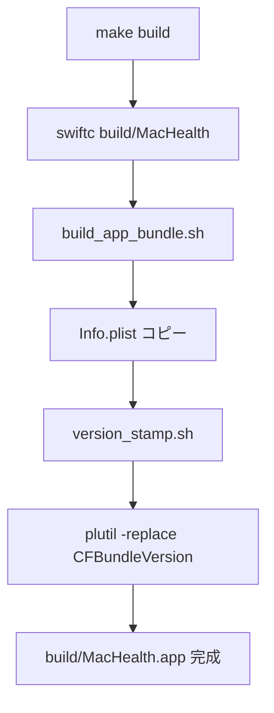
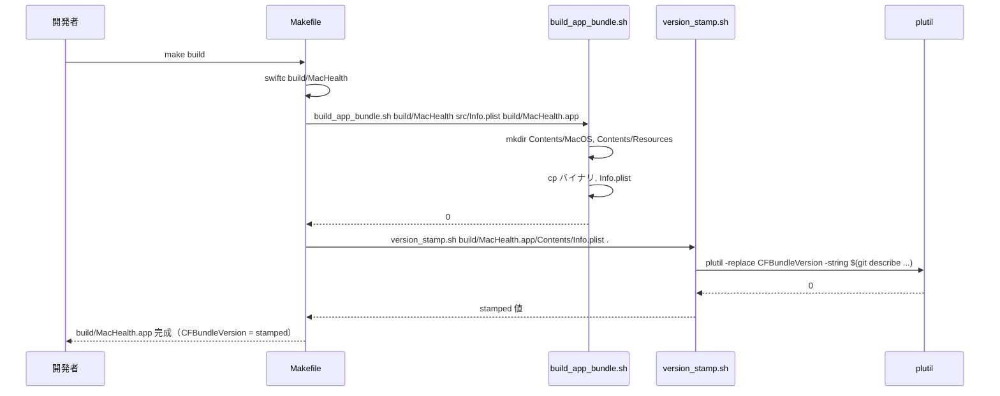
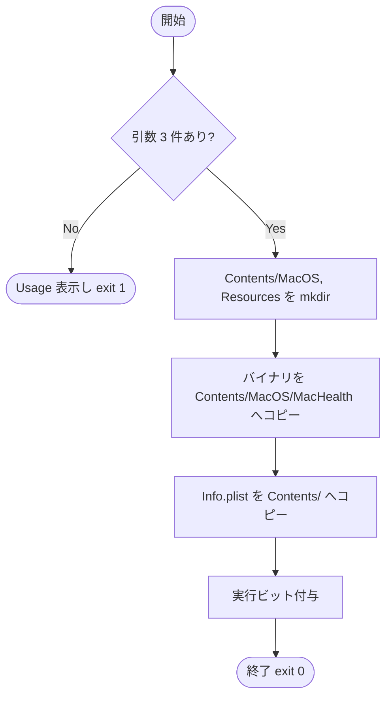
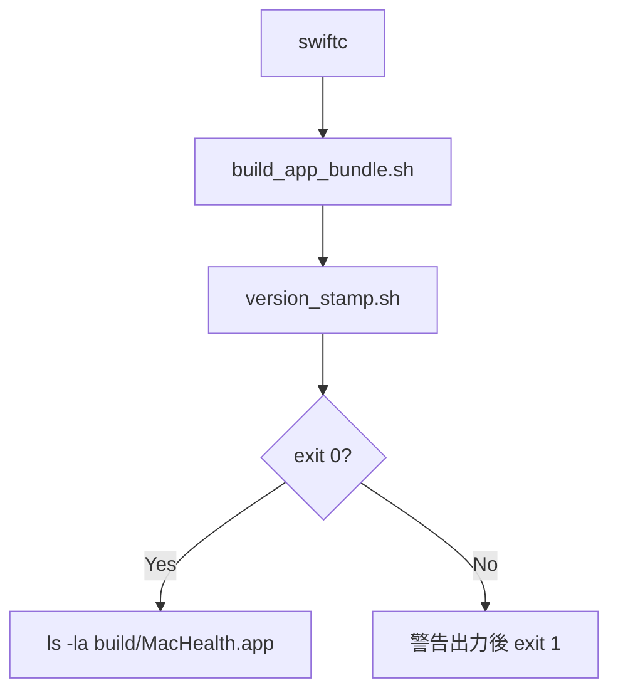

# 設計書: Makefile build ターゲットで .app バンドルを生成する拡張

**プロジェクト名**: Mac Health Keeper / Makefile build .app 拡張
**作成日**: 2026 年 05 月 29 日
**最終更新**: 2026 年 05 月 29 日

---

## 1. 設計概要

### 1.1 設計方針

- 既存 `make build` を **拡張**して `.app` バンドル化する（新ターゲット追加ではなく）。理由: 利用者が「make build」を打つ機会で stamp された `.app` が常に得られたほうが体験が良いため。
- `.app` 組み立てロジックを共通スクリプト `scripts/lib/build_app_bundle.sh` に切り出し、`install.sh` と Makefile の双方から呼び出すことで重複を排除する。**新機能追加 posture** として `install.sh` の `.app` 組み立て部分もこの共通スクリプトに集約する（install.sh の振る舞いは変えない＝出力先・ロード手順は維持）。
- `version_stamp.sh` は既存をそのまま呼ぶ（再実装しない）。
- 既存 `build/MacHealth` 単体バイナリ生成経路は `build-bin` ターゲットとして温存し、`build` は `.app` まで作る上位ターゲットとする（後方互換性確保）。
- 新規ターゲット `package`（artifact 化を意識した zip 生成）と `clean-app`（`.app` のみ削除）を追加し、CI / 開発体験を改善する。
- `scripts/lib/build_app_bundle.sh` の挙動を Swift 純粋関数（`AppBundlePolicy`）でモデル化し、Info.plist 必須キーの集合・stamp 対象キーをコードレベルで合意可能にする。pure-core BDD で検証する。

### 1.2 設計原則（本プロジェクトで適用するもの）

- **UNIX 哲学**: `build_app_bundle.sh` は「ビルド済みバイナリ + Info.plist → .app」の単機能スクリプトとして合成可能に。
- **単一責務**: Makefile は build のみ、install.sh は配置・ロード、`build_app_bundle.sh` はバンドル組み立てのみ。
- **AI フレンドリー設計**: 小さなスクリプト、明確な責務、深すぎないディレクトリ。

---

## 2. アーキテクチャ設計

### 2.1 責務・境界・参照関係

#### 2.1.1 責務一覧

| コンポーネント | 責務（1 文） |
|---|---|
| `Makefile::build-bin`（新規分離） | `build/MacHealth` 単体バイナリの swiftc コンパイル（旧 build 相当を温存） |
| `Makefile::build` | `build-bin` を呼んだ後 `build_app_bundle.sh` で `.app` を組み立て、`version_stamp.sh` で stamp |
| `Makefile::package`（新規） | `make build` 後の `build/MacHealth.app` を `build/MacHealth-<version>.zip` に zip 化（CI artifact 用途） |
| `Makefile::clean-app`（新規） | `build/MacHealth.app` のみ削除（`build/` 全削除は `clean`） |
| `Makefile::clean`（新規） | `build/` を一括削除 |
| `scripts/lib/build_app_bundle.sh`（新規） | バイナリ + Info.plist テンプレ → .app バンドル組み立て + `version_stamp.sh` 呼び出し |
| `scripts/lib/version_stamp.sh`（既存） | Info.plist の CFBundleVersion を git describe で注入 |
| `Sources/MacHealthKit/AppBundlePolicy.swift`（新規） | Info.plist 必須キーの集合・stamp 対象キーをモデル化する Swift 純粋関数 |
| `install.sh` | `build_app_bundle.sh` を経由して `.app` を組み立てる（出力先 `~/Applications/MacHealth.app` は維持・LaunchAgent ロード等の振る舞いも維持） |

#### 2.1.2 境界

- **入力**: `src/Info.plist`、`build/MacHealth` バイナリ、`$REPO_DIR`
- **出力**: `build/MacHealth.app/Contents/{MacOS/MacHealth, Info.plist}`
- **他責務との境界**: LaunchAgent plist 配置・ログイン項目登録は install.sh の責務として維持。

#### 2.1.3 参照関係

- `make build` → `build_app_bundle.sh` → `version_stamp.sh` → `plutil`
- `install.sh` → (将来) `build_app_bundle.sh` → `version_stamp.sh`

### 2.2 システムアーキテクチャ

- **採用パターン**: シェルスクリプト合成
- **根拠**: 既存方式の踏襲、最小差分



### 2.3 コンポーネント構成

- `Makefile::build-bin` を新設（旧 build と同等の swiftc 経路を温存）。
- `Makefile::build` を拡張: `build-bin` → `build_app_bundle.sh` → ls 出力。`build_app_bundle.sh` 内部で `version_stamp.sh` を呼ぶ（呼び出し側に責務を寄せない）。
- `Makefile::package` / `clean-app` / `clean` を新設。
- `scripts/lib/build_app_bundle.sh` を新規作成。引数: `<binary-path> <info-plist-src> <out-app-path> [<repo-dir>]`。
- `Sources/MacHealthKit/AppBundlePolicy.swift` を新規作成。Info.plist 必須キー集合・stamp 対象キーを pure に提供。
- `Sources/MacHealthCheck/main.swift` に `AppBundlePolicy` 用の useCase/scenario を追加。

### 2.4 データフロー



---

## 3. 機能設計

### 3.1 機能 1: build_app_bundle.sh の新設

#### 3.1.1 概要

バイナリ + Info.plist テンプレ → `.app` を組み立てる単機能スクリプト。

#### 3.1.2 処理フロー



#### 3.1.3 入力・出力

- 入力: `<binary>`, `<info.plist.src>`, `<out.app>`
- 出力: `<out.app>` 配下に Contents 構造を作成

#### 3.1.4 エラーハンドリング

- 引数不足 → Usage 表示 exit 1
- バイナリ不在 → "binary not found: ..." exit 1

### 3.2 機能 2: Makefile::build の拡張

#### 3.2.1 概要

既存 `build` ターゲットの `swiftc` 行の後に `build_app_bundle.sh` と `version_stamp.sh` の呼び出しを追加。

#### 3.2.2 処理フロー



#### 3.2.3 入力・出力

- 入力: `src/*.swift`, `Sources/**/*.swift`, `src/Info.plist`
- 出力: `build/MacHealth`（後方互換）+ `build/MacHealth.app/`

#### 3.2.4 エラーハンドリング

- swiftc 失敗 → make が exit 1
- build_app_bundle 失敗 → make が exit 1
- version_stamp 失敗 → warn のみで継続（既存 install.sh の挙動と整合）

---

## 4. データ設計

- 該当なし（新規データモデル無し）。

---

## 5. API 設計

### 5.1 build_app_bundle.sh

```
build_app_bundle.sh <binary-path> <info-plist-src> <out-app-path> [<repo-dir>]
```

- `<binary-path>`: 既にビルド済みの実行バイナリ（必須・存在すること）
- `<info-plist-src>`: テンプレ Info.plist（必須・存在すること）
- `<out-app-path>`: 出力先 `.app` のパス（必須・末尾 `.app`）
- `<repo-dir>`: `version_stamp.sh` に渡す git リポジトリのルート（省略時 `${REPO_DIR:-}` を参照、それも空なら version_stamp 呼び出しを skip）

終了コード:
- `0`: 成功（version_stamp が失敗しても `.app` 構造作成は成功扱い）
- `1`: 引数ファイルが見つからない / cp 失敗 / `.app` 拡張子チェック失敗
- `2`: 引数不足 / Usage 表示

stdout: 注入された CFBundleVersion（stamp 経路があれば 1 行）。

副作用: `<out-app-path>/Contents/{MacOS/<exe>, Resources/, Info.plist}` を作成する。`<out-app-path>` が既存なら上書きする（古い .app の中身は cp 上書きで置換）。

### 5.2 AppBundlePolicy.swift

```swift
public enum AppBundlePolicy {
    /// .app バンドルの必須 Info.plist キー（存在しなければ不正バンドル）
    public static let requiredInfoPlistKeys: Set<String> = [
        "CFBundleExecutable",
        "CFBundleIdentifier",
        "CFBundleName",
        "CFBundlePackageType",
        "CFBundleVersion",
        "CFBundleShortVersionString",
    ]
    /// CFBundleVersion は build 時に stamp される
    public static let stampedKey: String = "CFBundleVersion"
    /// 与えられたキー集合が必須を満たすか
    public static func isValid(keys: Set<String>) -> Bool
    /// 欠落キー
    public static func missingKeys(keys: Set<String>) -> Set<String>
}
```

---

## 6. テスト戦略

### 6.1 対象ごとのテスト割り当て

| 対象 | 単体 | 結合/API | E2E | クリティカル観点 | バリデーション観点 | 未達理由/補足 |
|---|---|---|---|---|---|---|
| build_app_bundle.sh | ○（shell test） | ○ | × | 引数バリデーション・ファイル配置 | 引数不足エラー | – |
| Makefile::build 拡張 | × | ○ | ○ | swiftc → bundle → stamp の連鎖 | 各ステップの exit code | – |
| stamp 一致 | × | ○ | ○ | install.sh と同じ stamp 値 | git describe 一致 | – |

### 6.2 監査・レビューでの確認

- 04_review に `make build` 出力 + `defaults read build/MacHealth.app/Contents/Info CFBundleVersion` の出力を必ず記載。

---

## 7. UI 設計

- 該当なし。

---

## 8. セキュリティ設計

- 追加なし。

---

## 9. 非機能要件への対応

### 9.1 パフォーマンス

- `mkdir` + `cp` × 2 + `plutil -replace` で +200ms 程度を想定。

### 9.2 可用性

- shallow clone 環境では `0.0.0-DEV` fallback を許容（Issue D で対処）。

---

## 10. 参考資料

- [`01_要件定義.md`](./01_要件定義.md)
- `Makefile`
- `scripts/lib/version_stamp.sh`
- [`.agents-project/受け入れ基準ルール.md`](../../.agents-project/受け入れ基準ルール.md)

---

## 11. 前のステップ

- **前**: [`01_要件定義.md`](./01_要件定義.md)

---

## 12. 次のステップ

- **次**: [`03_実装計画.md`](./03_実装計画.md)
