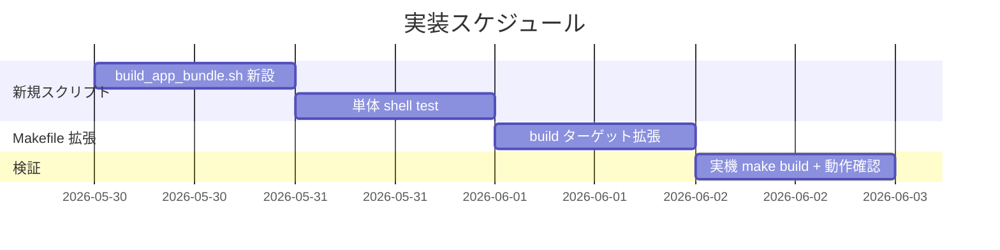

# 実装計画書: Makefile build ターゲットで .app バンドルを生成する拡張

**プロジェクト名**: Mac Health Keeper / Makefile build .app 拡張
**作成日**: 2026 年 05 月 29 日
**最終更新**: 2026 年 05 月 29 日

---

## 1. 実装概要

### 1.1 実装方針

`scripts/lib/build_app_bundle.sh` を新規追加し、Makefile::build を拡張する。あわせて `install.sh` も同スクリプト経由で `.app` を組み立てるよう更新し、重複ロジックを排除する（install.sh の振る舞いは変更しない）。Swift 側にも `AppBundlePolicy` を新設し、Info.plist 必須キー定義を pure-core BDD で押さえる。各タスクの最後に **必ず実機 `make build` + `defaults read` で stamp 値検証**を含める。

### 1.2 実装順序



---

## 2. タスク分解

### 2.1 タスク 1: build_app_bundle.sh の新設

#### 2.1.1 概要

`scripts/lib/build_app_bundle.sh` を新規作成。引数: バイナリパス・Info.plist パス・出力 .app パス。

#### 2.1.2 実装内容

- shell スクリプト新規作成
- 引数 3 件のバリデーション
- `mkdir -p`, `cp`, `chmod +x` で `.app` 構造組み立て
- `shellcheck` クリーン

#### 2.1.3 テスト観点

##### 単体

- 引数 3 件で `.app` 構造が作られる
- 引数不足で Usage 表示 + exit 1
- バイナリ不在で exit 1

##### 結合/API

- Makefile から呼び出して連動動作

##### E2E/受け入れ

- 実機で `make build` → `.app` 確認

##### バリデーション

- 引数不足・パス不在のエラー

#### 2.1.4 単体テスト仕様（BDD）

```gherkin
Feature: build_app_bundle.sh
  Scenario: 引数 3 件で .app が作られる
    Given バイナリと Info.plist が存在
    When build_app_bundle.sh <bin> <plist> <out.app> を実行
    Then out.app/Contents/MacOS/MacHealth と Info.plist が存在する
```

```bash
# Given: バイナリと Info.plist の固定 fixture
# When: build_app_bundle.sh を呼ぶ
bash scripts/lib/build_app_bundle.sh "$BIN" "$PLIST" "$OUT"
# Then: 構造を検証
test -x "$OUT/Contents/MacOS/MacHealth" && test -f "$OUT/Contents/Info.plist" || exit 1
```

#### 2.1.5 依存関係

- なし

#### 2.1.6 見積もり

- **工数**: 0.5 日
- **優先度**: 高

### 2.2 タスク 2: 単体 shell test 追加

#### 2.2.1 概要

`scripts/test/build_app_bundle_test.sh` を新規作成し、build_app_bundle.sh の単体テストを行う。

#### 2.2.2 実装内容

- shell test 新規作成
- Makefile の test-shell ターゲットに追加
- `make check` の経路で実行される

#### 2.2.3 テスト観点

##### 単体

- 正常系 1 件
- 引数不足エラー 1 件
- バイナリ不在エラー 1 件

#### 2.2.4 単体テスト仕様（BDD）

```gherkin
Feature: build_app_bundle smoke
  Scenario: 正常系
    Given fixture バイナリと Info.plist
    When build_app_bundle.sh を実行
    Then .app 構造が確認できる
  Scenario: 引数不足
    Given 引数 1 件のみ
    When 実行
    Then exit 1 と Usage 表示
```

#### 2.2.5 依存関係

- タスク 1

#### 2.2.6 見積もり

- **工数**: 0.5 日
- **優先度**: 高

### 2.3 タスク 3: Makefile::build の拡張

#### 2.3.1 概要

既存 `build` ターゲットの `swiftc` の後に `build_app_bundle.sh` と `version_stamp.sh` の呼び出しを追加。

#### 2.3.2 実装内容

- `Makefile::build` の本体を編集
- swiftc → build_app_bundle.sh → version_stamp.sh の順
- `ls -la build/MacHealth.app` で結果表示
- 後方互換のため `build/MacHealth` 単体バイナリも維持

#### 2.3.3 テスト観点

##### 単体

- `make build` の構文 OK (`make -n build`)

##### 結合/API

- `make build` 実行で `.app` が作られる

##### E2E/受け入れ

- 実機 `make build` 後の `defaults read` が `git describe` と一致

#### 2.3.4 単体テスト仕様（BDD）

```gherkin
Feature: make build 拡張
  Scenario: make build で .app と stamp が一致する
    Given クリーンな build/
    When make build を実行
    Then build/MacHealth.app/Contents/MacOS/MacHealth が存在
    And CFBundleVersion が `git describe --tags --always` と一致
```

#### 2.3.5 依存関係

- タスク 2

#### 2.3.6 見積もり

- **工数**: 0.5 日
- **優先度**: 高

### 2.4 タスク 4: 実機 make build + 動作確認（**本ルール強制**）

#### 2.4.1 概要

本ルール `.agents-project/受け入れ基準ルール.md` §3.2–3.4 に従い、ローカル macOS で `make build` を実行して `.app` 構造と stamp 値を実機で検証する。`make install` でも整合性を確認する。

#### 2.4.2 実装内容

- ローカル macOS で `make clean && make build` を実行（`make clean` は存在しない場合は手動で `rm -rf build`）
- `find build/MacHealth.app -type f` で構造確認
- `defaults read build/MacHealth.app/Contents/Info CFBundleVersion` と `git describe --tags --always` の出力が一致することを確認
- 続けて `make install` を実行し、`~/Applications/MacHealth.app` の CFBundleVersion と `build/MacHealth.app` の CFBundleVersion が一致することを確認
- エビデンスを `memo/<YYYYMMDD_HHMMSS>_make-build-verification.md` に記録

#### 2.4.3 テスト観点

##### E2E/受け入れ

- `build/MacHealth.app` が `~/Applications/MacHealth.app` と同じ CFBundleVersion を持つ
- `make build` だけでは `~/Applications/MacHealth.app` の状態に影響しない（mtime・PID 不変）

#### 2.4.4 単体テスト仕様（BDD）

```gherkin
Feature: 実機 make build 検証
  Scenario: make build で .app + stamp 一致 + install.sh 非干渉
    Given クリーンな build/
    When make build を実行
    Then build/MacHealth.app/Contents/Info の CFBundleVersion = git describe --tags --always
    And ~/Applications/MacHealth.app の mtime が変化しない
```

#### 2.4.5 依存関係

- タスク 3

#### 2.4.6 見積もり

- **工数**: 0.5 日
- **優先度**: 必須

### 2.5 タスク 5: install.sh を build_app_bundle.sh 経由に統一

#### 2.5.1 概要

`install.sh` §5/§5.5 の swiftc + mkdir + cp + version_stamp.sh の直列実装を `build_app_bundle.sh` 1 行に置き換える。出力先（`~/Applications/MacHealth.app`）と振る舞い（LaunchAgent ロード等）は維持。

#### 2.5.2 テスト観点

- `make install` / `make reinstall` が引き続き成功する
- `defaults read ~/Applications/MacHealth.app/Contents/Info CFBundleVersion` が `git describe` と一致
- `build/MacHealth.app` と `~/Applications/MacHealth.app` の CFBundleVersion が一致

#### 2.5.3 依存関係

- タスク 1

### 2.6 タスク 6: AppBundlePolicy.swift + pure-core BDD

#### 2.6.1 概要

`Sources/MacHealthKit/AppBundlePolicy.swift` を新設し、Info.plist 必須キー集合・stamp 対象キーを定義。`Sources/MacHealthCheck/main.swift` に useCase/scenario を追加して pure-core BDD で検証。

#### 2.6.2 テスト観点

- `requiredInfoPlistKeys` を全て含むキー集合は valid
- 1 キー欠落で missingKeys が返る
- stampedKey は requiredInfoPlistKeys に含まれる

#### 2.6.3 依存関係

- なし（独立）

### 2.7 タスク 7: package / clean / clean-app ターゲット追加

#### 2.7.1 概要

`Makefile` に `package`（zip 化）/ `clean-app`（`.app` のみ）/ `clean`（`build/` 全削除）を新設。

#### 2.7.2 テスト観点

- `make clean` 後に `build/` が存在しない
- `make build && make package` で `build/MacHealth-<version>.zip` が生成される
- `make clean-app` で `build/MacHealth.app` のみ削除（`build/MacHealth` は残る）

#### 2.7.3 依存関係

- タスク 3

---

## テスト観点

タスクごとの §2.x.3 を参照。全体として「.app 構造」「stamp 一致」「install.sh 非干渉」「shellcheck クリーン」の 4 観点。

---

## 単体テスト

タスクごとの §2.x.4 BDD を参照。

---

## BDD

01_要件定義.md §2.2 UC1-S1, UC1-S2, UC2-S1, UC3-S1 を自動化 + 実機検証。

---

## 3. 実装スケジュール

### 3.1 マイルストーン

| マイルストーン | 期日 | 成果物 |
|---|---|---|
| build_app_bundle.sh + test | 2026-06-01 | 新規スクリプト + 単体テスト |
| Makefile 拡張 | 2026-06-02 | build ターゲット拡張 |
| 実機検証 | 2026-06-03 | エビデンス memo |

### 3.2 実装フェーズ

#### フェーズ 1: 新規スクリプト

- タスク 1, 2

#### フェーズ 2: Makefile 拡張

- タスク 3

#### フェーズ 3: 実機検証

- タスク 4

---

## 4. テスト計画

各タスクの §2.x.3 / §2.x.4 を参照。

### 4.1 テストの優先順位

- 実機 `make build` 検証（タスク 4）を最優先で必須化

---

## 5. リスク管理

### 5.1 実装リスク

- **リスク**: install.sh の `.app` 生成と Makefile の `.app` 生成が重複し、片方の変更が漏れる
  - **対策**: install.sh も `build_app_bundle.sh` を呼ぶリファクタを検討（本 issue 範囲または別 issue）

---

## 6. 参考資料

- [`02_設計.md`](./02_設計.md)
- [`.agents-project/受け入れ基準ルール.md`](../../.agents-project/受け入れ基準ルール.md)

---

## 7. 前のステップ

- **前**: [`02_設計.md`](./02_設計.md)

---

## 8. 次のステップ

- 実装フェーズ（execution）に進む（本依頼ではドキュメント作成のみ）。
