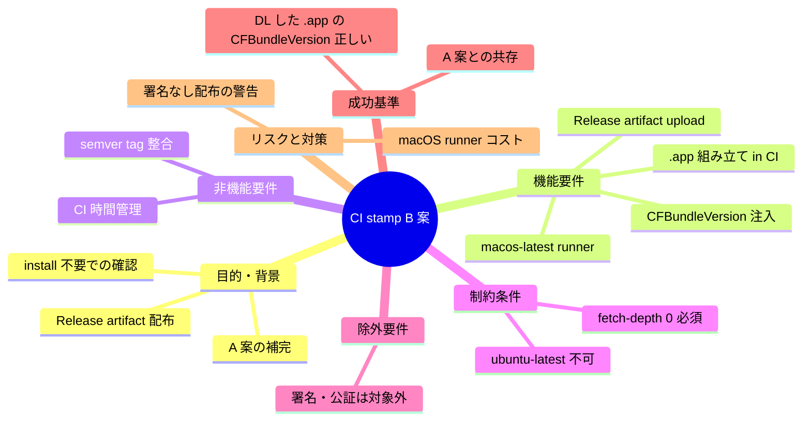

# 要求定義書: CI（GitHub Actions）でバージョン stamp する B 案の実装

**プロジェクト名**: Mac Health Keeper / CI stamp B 案
**作成日**: 2026 年 05 月 29 日
**最終更新**: 2026 年 05 月 29 日

> **重要**:
>
> - 本 issue は **`.agents-project/受け入れ基準ルール.md` 適用対象**（CI / GitHub Actions の変更を含むため。Release artifact のローカル DL → 動作確認まで含む）。
> - 関連 issue: [`.workflow/close/20260529_105524_ビルド時バージョン自動stamp/`](../../close/20260529_105524_ビルド時バージョン自動stamp/) — A 案（CI tag + install.sh stamp）を採用したもの。本 issue は **B 案（CI で .app を組み立て、Release artifact 配布まで行う）**を独立 issue として実装。
> - 関連 issue: [`.workflow/close/20260529_122727_Makefile_app化拡張/`](../../close/20260529_122727_Makefile_app化拡張/) — B 案実装の前提として `make build` で `.app` 化が必要。**既に完了済**（PR #8 / `553d411`）。
> - **追補（2026-05-29 実装フェーズ）**: 当初「ドキュメントのみ」を想定していたが、Issue B（PR #8）完了済みのため、本 issue では実装まで踏み込む。実装方針は §2.2 を参照（**既存 create-release.yaml を破壊的に書き換えず、新規ワークフロー `release-app.yml` を追加して役割分離**する新規機能追加路線）。

---

## 要求定義の全体像

---

## 1. 目的・背景

### 1.1 目的（必須）

CI で `.app` を組み立て、`CFBundleVersion` を semver tag から注入し、Release artifact として配布可能にする。

### 1.2 背景

- **現状の課題**:
  - 既存 `create-release.yaml` は `ubuntu-latest` runner で tag を打つのみで、`.app` 配布は行わない。
  - そのため、エンドユーザーは `git clone` + `./install.sh` を実行する必要があり、「`.app` を DL して即試したい」ニーズに応えられない。
  - close 済み issue `20260529_105524_ビルド時バージョン自動stamp` の 00 §1.3 効果 3 で「stamp は CI ではなく install.sh 経路で実行」と整理した A 案を採用したが、B 案（CI で stamp して artifact 配布）は将来課題として残置されていた。
  - Release artifact が無いことで「特定 commit の .app を入手したい」というデバッグ用途にも対応できない。

- **必要性**:
  - エンドユーザーが install 前に `.app` の動作を確認できる体験を提供したい。
  - 将来的に署名・公証フローを CI に統合する素地としても、CI で `.app` を組み立てる経路は必要。
  - A 案（install.sh stamp）と B 案（CI stamp）は併用可能であり、配布形態の選択肢が増える。

### 1.3 期待される効果（必須: 1 件以上）

- **効果 1**: GitHub Releases に `MacHealth-<tag>.app.zip` 等の artifact がアップロードされる（○/× で判定可能）。
- **効果 2**: artifact を DL → 展開すると `Contents/Info.plist::CFBundleVersion` が当該 tag の値（または `git describe` 値）と一致する（○/× で判定可能）。
- **効果 3**: A 案（install.sh stamp）の挙動は変わらない（既存 install フローへの後方互換）。

---

## 2. 機能要件

### 2.1 既存機能の維持

- `.github/workflows/check.yml`（`macos-latest`）の動作。
- `.github/workflows/create-release.yaml` の tag 付与挙動（runner は変更）。
- `install.sh` の A 案 stamp 動作。

### 2.2 新規機能要件

> **2026-05-29 追補**: 当初案では「`create-release.yaml` の runner を ubuntu-latest → macos-latest に書き換え」を想定していたが、実装フェーズでは **既存 create-release.yaml を最小修正で温存**し、新規ワークフロー `release-app.yml` (macos-latest) を **役割分離**で追加する方針に変更した。これにより既存 tag 生成挙動を破壊しない（新規機能追加 posture）。

- **新規ワークフロー `.github/workflows/release-app.yml`**: macos-latest runner で `.app` を組み立て、Release artifact として添付する単機能ワークフロー。
- **既存 `.github/workflows/create-release.yaml` の最小修正**: ubuntu-latest のまま。tag 作成完了後に `gh workflow run release-app.yml --field tag=<TAG>` で新規ワークフローを明示的に起動する step を 1 つだけ追加（`GITHUB_TOKEN` で作成した tag は `push: tags` を起動しないため）。
- **checkout の `fetch-depth: 0` + `fetch-tags: true`**: `git describe` で tag 履歴を取得するため必須化（release-app.yml 側）。
- **.app 組み立て**: `make build`（Issue B 成果物 PR #8）を CI で実行し `build/MacHealth.app` を生成。
- **CFBundleVersion 注入**: 既存 `version_stamp.sh`（`git describe --tags --always`）流用。tag-on-checkout のため CFBundleVersion は tag 値そのものに近い形になる。
- **artifact upload**: `softprops/action-gh-release@v2` で `build/MacHealth-*.zip` を既存 Release に添付（`append_body: true`）。
- **artifact 検証**: 新規 `scripts/lib/release_artifact_validator.sh` で必須 Info.plist キー / CFBundleVersion 一致 / バイナリ存在を厳格チェック。
- **A 案との共存**: install.sh の stamp 動作は変更しない（最小修正・役割分離）。

---

## 3. 非機能要件

### 3.1 パフォーマンス

- CI 全体時間が現状の `create-release.yaml` 比で 5 分以内の増加に収まること（macos-latest runner は ubuntu-latest より遅いが Swift ビルド時間が支配的）。

### 3.2 セキュリティ

- 本 issue では署名・公証は対象外。署名なし `.app` であることを Release notes に明記する方針を 02 で議論。

### 3.3 互換性

- A 案 install.sh stamp 経路と完全に共存。同じ commit から install した結果と DL した artifact の CFBundleVersion が **一致**することが望ましい。

### 3.4 保守性

- Makefile の `build` ターゲットを呼ぶ形にすることで、CI 専用ロジックの肥大化を避ける（Issue B の成果物を再利用）。

---

## 4. 制約条件

### 4.1 技術的制約

- `runs-on: macos-latest` への変更必須（`plutil` は macOS 専用）。
- `actions/checkout@v4` の `fetch-depth: 0` 必須（`git describe` の tag 履歴取得）。
- GitHub Actions の macOS minute 消費は Linux の 10 倍課金（public repo は無料）。本プロジェクトは public repo 想定。

### 4.2 既存システムとの互換性

- 既存 tag 命名規約（`vYYYYMMDD.HHMMSS` 日時 tag）または semver tag への移行は 02 で議論。

### 4.3 移行期間・スケジュール

- 本 issue ではドキュメント（00〜03）のみ。実装は別タイミング。

---

## 5. 除外要件

- **本 issue では実装を行わない**。00〜03 のドキュメント作成のみ。
- 署名 / 公証 / Notarization は対象外。
- DMG / pkg 形式の配布は対象外（`.app.zip` のみ）。
- Universal Binary（Intel + ARM）は別 issue。

---

## 6. 成功基準（必須: 1 件以上）

- **基準 1**: tag を打って `create-release.yaml` が成功すると、Release に `MacHealth-<tag>.app.zip` が upload される。
- **基準 2**: DL した artifact を展開し `defaults read .../Info CFBundleVersion` を実行すると、tag 値（または `git describe` 値）と一致する。
- **基準 3**: A 案 install.sh stamp が引き続き動作し、同じ commit からの install 結果と DL artifact の CFBundleVersion が一致する。
- **基準 4**: `make check`（既存 `check.yml`）が緑のまま維持される。
- **基準 5 (実機検証)**: ローカル環境で artifact を DL し、`Contents/Info.plist::CFBundleVersion` を実機で確認したエビデンス（コマンド出力・確認手順・結果）が `04_review.md` または `memo/` 配下に記録されていること。**さらに**、ローカル環境で `./install.sh` を実行して A 案 stamp と一致することを確認するエビデンスも記録する。本基準の根拠は [`.agents-project/受け入れ基準ルール.md`](../../.agents-project/受け入れ基準ルール.md) §3.2–3.4。

---

## 7. リスクと対策

### 7.1 技術的リスク

- **リスク**: tag 命名規約が semver 系列か日時系列か未確定。
  - **対策**: 02 でユーザー判断ポイントとして列挙。既存 `create-release.yaml` は日時 tag であり、整合性的には日時 tag 路線が低コスト。

- **リスク**: 署名なし `.app` を DL したエンドユーザーが Gatekeeper で警告を受ける。
  - **対策**: Release notes に「Gatekeeper の右クリック → 開く 手順」を記載する方針を 02 で議論。

### 7.2 スケジュールリスク

- **リスク**: Issue B が先に実装されていない場合、CI 内で `.app` 組み立てを inline 実装する必要が生じる。
  - **対策**: Issue B を先行させる。または、CI 内で `scripts/lib/build_app_bundle.sh` 相当を inline 実装する。

---

## 8. 参考資料

### プロジェクトドキュメント

- [`.workflow/close/20260529_105524_ビルド時バージョン自動stamp/`](../../close/20260529_105524_ビルド時バージョン自動stamp/) — A 案
- [`.workflow/20260529_122727_Makefile_app化拡張/`](../../20260529_122727_Makefile_app化拡張/) — Issue B（前提）
- [`.agents-project/受け入れ基準ルール.md`](../../.agents-project/受け入れ基準ルール.md)
- `.github/workflows/create-release.yaml`（現状）
- `scripts/lib/version_stamp.sh`

### その他の参考資料

- GitHub Actions docs: macos-latest runner / actions/checkout fetch-depth / Release artifact

---

## 9. 次のステップ

- **次**: [`01_要件定義.md`](./01_要件定義.md)
