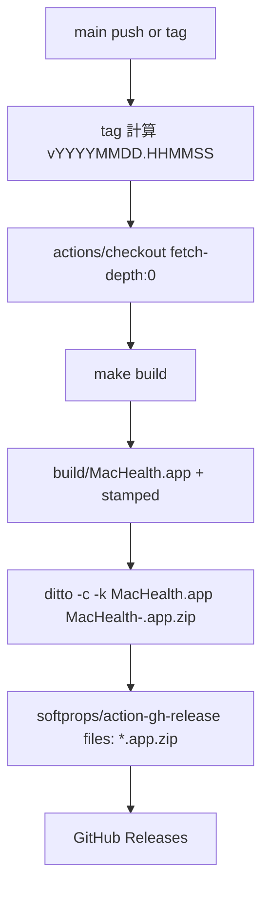
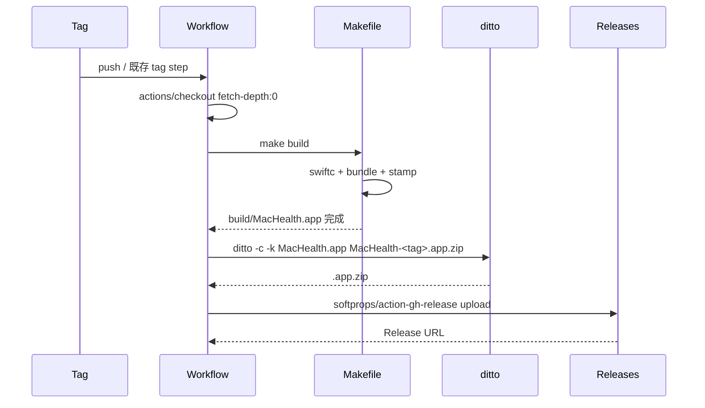
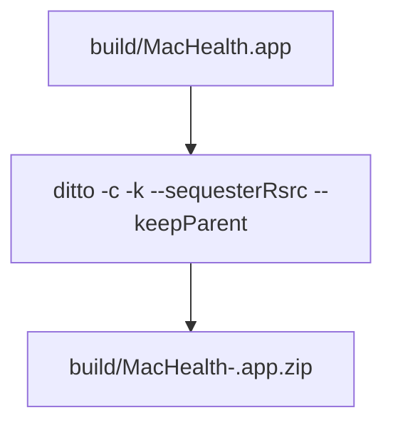

# 設計書: CI（GitHub Actions）でバージョン stamp する B 案の実装

**プロジェクト名**: Mac Health Keeper / CI stamp B 案
**作成日**: 2026 年 05 月 29 日
**最終更新**: 2026 年 05 月 29 日

---

## 1. 設計概要

### 1.1 設計方針

> **2026-05-29 実装フェーズ追補**: 設計方針を「create-release.yaml の macos-latest 化（破壊的変更）」から「新規ワークフロー `release-app.yml` 追加 + 既存 `create-release.yaml` を最小修正で温存（役割分離）」に更新した。**根拠**: 既存 ubuntu-latest workflow が壊れるリスクと、tag 命名規約変更による下流影響を最小化するため。zip 化は `ditto` ではなく **Issue B で確立済みの `make package`（zip コマンド）** を踏襲する（再実装を避ける）。

#### 採用構成（実装後）

- **既存 `create-release.yaml`**: ubuntu-latest のまま。tag 作成 + `gh release create` まで担う。末尾に `gh workflow run release-app.yml --field tag=<TAG>` を 1 行追加して新規ワークフローを起動。
- **新規 `release-app.yml`**: macos-latest で `actions/checkout@v4 fetch-depth: 0 fetch-tags: true` → `make check` 回帰 → `make build` → `make package` → `scripts/lib/release_artifact_validator.sh` 検証 → `softprops/action-gh-release@v2` で zip 添付。
- **検証スクリプト `scripts/lib/release_artifact_validator.sh`**: 必須 Info.plist キー（`AppBundlePolicy.requiredInfoPlistKeys` と同期）・CFBundleVersion 期待値一致・`MacHealth` 実行バイナリ存在・`CFBundleExecutable` と MacOS 名整合性・`0.0.0-DEV` fallback WARN 検知を pure-shell で実装。CI とローカル両用。
- **CI smoke `scripts/test/ci_release_smoke_test.sh`**: ローカル macOS で `make build → make package → validator` の一気通貫を再現するテスト（CI に出す前に手元で同等検証可能）。
- tag 命名は **既存日時 tag 路線を維持**（`vYYYYMMDD.HHMMSS`、破壊的変更回避）。

### 1.2 設計原則（本プロジェクトで適用するもの）

- **UNIX 哲学**: CI 内の各ステップを単機能化（checkout / build / package / upload）。
- **単一責務**: `create-release.yaml` は tag + artifact upload、Makefile は build、scripts は stamp。
- **明確な境界**: A 案（install.sh stamp）と B 案（CI stamp）は **独立**して動作する。共通点は `version_stamp.sh` の呼び出しのみ。

---

## 2. アーキテクチャ設計

### 2.1 責務・境界・参照関係

#### 2.1.1 責務一覧

| コンポーネント | 責務（1 文） |
|---|---|
| `.github/workflows/create-release.yaml` | tag 付与 → checkout（fetch-depth:0）→ make build → ditto → release upload |
| `Makefile::build`（Issue B 成果物） | `.app` 組み立て + `version_stamp.sh` 呼び出し |
| `ditto` | `.app` を `.app.zip` 化（macOS 標準コマンド） |
| `softprops/action-gh-release` | Release artifact upload |

#### 2.1.2 境界

- **入力**: source code, tag
- **出力**: Releases に upload された `.app.zip`
- **他責務との境界**: A 案 install.sh stamp は変更しない。

#### 2.1.3 参照関係

- workflow → make build → version_stamp.sh → plutil
- workflow → ditto → action-gh-release

### 2.2 システムアーキテクチャ

- **採用パターン**: GitHub Actions の sequential job
- **根拠**: 既存 `create-release.yaml` の踏襲



### 2.3 コンポーネント構成

- `.github/workflows/create-release.yaml` を編集:
  - `runs-on: ubuntu-latest` → `runs-on: macos-latest`
  - `actions/checkout@v4` に `fetch-depth: 0` 追加
  - 新ステップ: `make build`
  - 新ステップ: `ditto -c -k --sequesterRsrc --keepParent build/MacHealth.app build/MacHealth-${TAG}.app.zip`
  - 新ステップ: action-gh-release で `files: build/*.app.zip`
  - Release notes に CFBundleVersion 値・Gatekeeper 手順を記載

### 2.4 データフロー



---

## 3. 機能設計

### 3.1 機能 1: create-release.yaml の macos-latest 化

#### 3.1.1 概要

`runs-on` を macos-latest に変更し、`fetch-depth: 0` を追加。

#### 3.1.2 処理フロー

```mermaid
flowchart TD
    Start([on push main / tag]) --> Runs[runs-on: macos-latest]
    Runs --> CO[actions/checkout@v4 fetch-depth:0]
    CO --> Make[make build]
    Make --> Verify[defaults read で CFBundleVersion 確認]
    Verify --> Zip[ditto -c -k]
    Zip --> Upload[action-gh-release]
    Upload --> End([完了])
```

#### 3.1.3 入力・出力

- 入力: source code, tag
- 出力: Release に `.app.zip`

#### 3.1.4 エラーハンドリング

- make build 失敗 → workflow 失敗
- stamp 値が `0.0.0-DEV` になった場合 → workflow 警告ログ（fetch-depth:0 漏れの検知）

### 3.2 機能 2: .app の ZIP 化

#### 3.2.1 概要

`ditto -c -k --sequesterRsrc --keepParent` で `.app` を zip 化。`zip` コマンドではなく `ditto` を使うのは Apple 標準で `_MACOSX/` 不要・拡張属性保持のため。

#### 3.2.2 処理フロー



#### 3.2.3 入力・出力

- 入力: `build/MacHealth.app`, `<tag>`
- 出力: `build/MacHealth-<tag>.app.zip`

#### 3.2.4 エラーハンドリング

- ditto 失敗 → workflow 失敗

---

## 4. データ設計

- 該当なし。

---

## 5. API 設計

- `softprops/action-gh-release@v2`:
  - `files: build/*.app.zip`
  - `body: |- ...Release notes...`
  - `tag_name: ${{ env.TAG }}`

---

## 6. テスト戦略

### 6.1 対象ごとのテスト割り当て

| 対象 | 単体 | 結合/API | E2E | クリティカル観点 | バリデーション観点 | 未達理由/補足 |
|---|---|---|---|---|---|---|
| create-release.yaml 変更 | × | ○（act / draft tag） | ○（実 tag push） | macos-latest + fetch-depth:0 | shellcheck 不要（YAML） | – |
| make build → .app | – | – | – | Issue B でカバー | – | – |
| ditto コマンド | ○（shell test） | ○ | ○ | zip 構造 | exit code | – |
| artifact upload | × | ○ | ○ | Release URL 取得 | – | act 経由は難しい |

### 6.2 監査・レビューでの確認

- 04_review に「CI 実行ログ抜粋」「DL した artifact の `defaults read` 出力」「install.sh と一致確認」を必ず記載。

---

## 7. UI 設計

- 該当なし（CI / Release ページのみ）。Release notes のフォーマットを 03 で具体化。

---

## 8. セキュリティ設計

- 署名なし配布のため、Release notes に Gatekeeper 回避手順を明記する方針。

---

## 9. 非機能要件への対応

### 9.1 パフォーマンス

- macos-latest runner で make build は 1〜2 分想定。ditto は数秒。upload は数十秒。

### 9.2 可用性

- workflow 失敗時は Releases に artifact が無いだけで A 案 install.sh stamp 経路は影響を受けない。

---

## 10. 参考資料

- [`01_要件定義.md`](./01_要件定義.md)
- [`.agents-project/受け入れ基準ルール.md`](../../.agents-project/受け入れ基準ルール.md)
- `.github/workflows/create-release.yaml`
- GitHub Actions docs / softprops/action-gh-release

---

## 11. 前のステップ

- **前**: [`01_要件定義.md`](./01_要件定義.md)

---

## 12. 次のステップ

- **次**: [`03_実装計画.md`](./03_実装計画.md)
