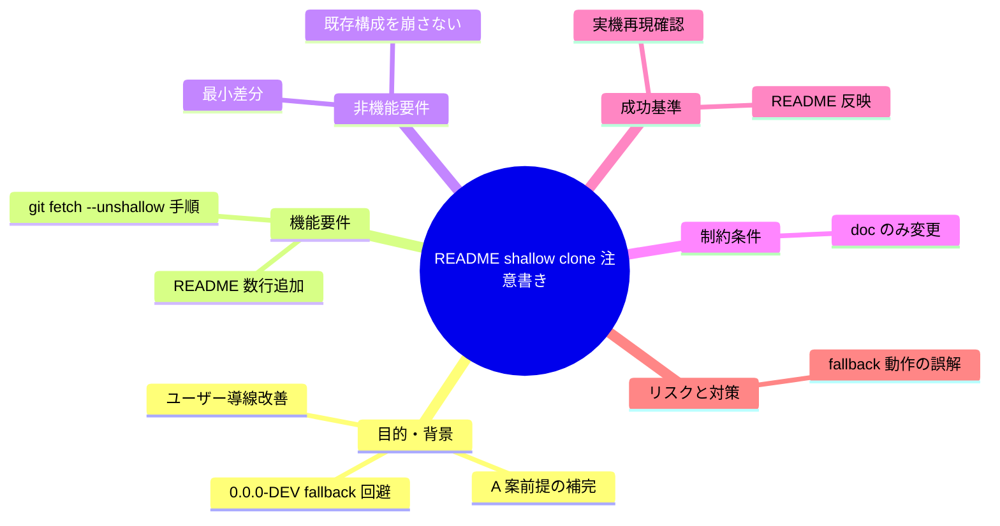

# 要求定義書: README に shallow clone 注意書きを追加

**プロジェクト名**: Mac Health Keeper / README shallow clone 注意書き
**作成日**: 2026 年 05 月 29 日
**最終更新**: 2026 年 05 月 29 日

> **重要**:
>
> - 本 issue は **`.agents-project/受け入れ基準ルール.md` 適用対象**（README は install 手順の正本でありユーザー導線に影響するため、実機での shallow clone 再現確認が必須）。
> - 関連 issue: [`.workflow/close/20260529_105524_ビルド時バージョン自動stamp/`](../../close/20260529_105524_ビルド時バージョン自動stamp/) — 本 issue が解決する `0.0.0-DEV` fallback リスクは A 案実装時に顕在化した。
> - 本 issue ではドキュメント（00〜03）の作成のみを行い、実装着手は本依頼の対象外。

---

## 要求定義の全体像

---

## 1. 目的・背景

### 1.1 目的（必須）

shallow clone（`git clone --depth=1`）使用時に `CFBundleVersion` が `0.0.0-DEV` fallback となるリスクを、README で利用者に明示する。

### 1.2 背景

- **現状の課題**:
  - close 済み issue `20260529_105524_ビルド時バージョン自動stamp` で A 案（install.sh stamp）を採用した結果、`scripts/lib/version_stamp.sh` が `git describe --tags --always` を呼ぶ依存になった。
  - `--depth=1` で clone された環境では tag 履歴が取得されず、`git describe` が tag を見つけられないため `0.0.0-DEV` の fallback 値が CFBundleVersion に注入される。
  - README の install 手順に「shallow clone は不可、または `git fetch --tags --unshallow` が必要」という注意書きが無いため、ユーザーが気づかぬまま `0.0.0-DEV` 版を配布する可能性がある。
  - 軽微（doc 数行）だが、A 案の前提を README で完結させることで、サポート問い合わせを減らせる。

- **必要性**:
  - A 案を信頼性高く運用するために、利用前提を明文化する必要がある。
  - 将来 CI（B 案 Issue C）でも `fetch-depth: 0` の必要性が同じ理由で発生するため、概念を README で先に説明しておくことで一貫性が出る。

### 1.3 期待される効果（必須: 1 件以上）

- **効果 1**: README の install 手順節に shallow clone 注意書きが 1〜2 行で記載される（○/× で判定可能）。
- **効果 2**: README に書かれた手順通り `git clone --depth=1` → `./install.sh` を実行したときの `CFBundleVersion` が `0.0.0-DEV` になることが実機で再現確認できる（受け入れ基準を満たす副産物）。
- **効果 3**: 注意書きに従い `git fetch --tags --unshallow` を実行した後の `./install.sh` で `CFBundleVersion` が正しく stamp されることが実機で確認できる。

---

## 2. 機能要件

### 2.1 既存機能の維持

- README.md の既存構成・章立て。
- A 案 install.sh stamp の挙動（無変更）。

### 2.2 新規機能要件

- **README 追記**: install 手順節の冒頭または注釈に、次のいずれかの趣旨で 1〜2 行を追記する。
  - 「`git clone --depth=1` での shallow clone は `CFBundleVersion` の自動 stamp が `0.0.0-DEV` fallback になるため非推奨。」
  - 「shallow clone を使う場合は `git fetch --tags --unshallow` を `./install.sh` 前に実行してください。」

---

## 3. 非機能要件

### 3.1 パフォーマンス

- 該当なし。

### 3.2 セキュリティ

- 該当なし。

### 3.3 互換性

- README の章番号・既存リンクを破壊しない。

### 3.4 保守性

- 注意書きの根拠を `scripts/lib/version_stamp.sh` の挙動と結び付け、コメント or 参照リンクで関連付ける（任意）。

---

## 4. 制約条件

### 4.1 技術的制約

- README は Markdown 形式。既存スタイル（見出しレベル・テーブル・コードブロック）を踏襲。

### 4.2 既存システムとの互換性

- 既存 README からのリンク・アンカーを壊さない。

### 4.3 移行期間・スケジュール

- 本 issue ではドキュメント（00〜03）のみ。実装は別タイミング。

---

## 5. 除外要件

- 本 issue では **README 以外のドキュメント変更は最小限**（`docs/` 配下の仕様書同期は別 issue or 派生対応）。
- `scripts/lib/version_stamp.sh` の **fallback 値そのもの**の変更（`0.0.0-DEV` 等）は対象外。fallback に陥った際の **警告強化**は本 issue 対象。

> **スコープ追補（2026-05-29 execution 直前）**:
> ユーザー指示「リファクタではなく新規機能追加」「最も安全で適切な方法で進める」を反映し、
> 単なる README 注意書き追記に留まらず、**`install.sh` 実行時に shallow clone を構造的に検出して
> 警告 or 自動回復する新機能を追加**する。具体的には次を含める:
>
> - 新規 `scripts/lib/shallow_clone_guard.sh`（`is_shallow_clone` / `warn_shallow_clone` /
>   `auto_unshallow_if_requested` の 3 関数を提供）
> - `install.sh` の swiftc ビルド直前で guard を呼び、shallow 検出時は stderr に警告 + 推奨手順を表示。
>   環境変数 `MACHEALTH_AUTO_UNSHALLOW=1` を指定された場合は `git fetch --tags --unshallow` で自動回復する
> - README 追記（本 issue 当初スコープ）に加え、上記新機能の存在と auto unshallow オプションを明記
>
> README 以外への波及（`install.sh` への 1 行追加 + 新規 lib + 新規 test）は **新機能追加 posture** として
> §6 の成功基準・§7 のリスクと併せて拡張する。本追補により当初の「doc のみ」制約は緩和される。

---

## 6. 成功基準（必須: 1 件以上）

- **基準 1**: README.md（リポジトリ直下）に shallow clone 注意書きが追記されている（`grep -E 'shallow|--unshallow' README.md` で 1 件以上ヒット）。
- **基準 2**: 実機で `git clone --depth=1 <repo> /tmp/test` を実行し、`bash scripts/lib/shallow_clone_guard.sh "$PWD"` を呼んだ結果 **stderr に警告と推奨手順（`git fetch --tags --unshallow`）が表示される**こと。
- **基準 3**: 同じ shallow clone で `MACHEALTH_AUTO_UNSHALLOW=1 bash scripts/lib/shallow_clone_guard.sh "$PWD"` を実行すると `git fetch --tags --unshallow` が走り、再度 `is_shallow_clone` が false に遷移すること。
- **基準 4**: 通常 clone（`git clone <repo>`）で同じ guard を呼んだとき **警告が出ず exit 0** であること。
- **基準 5**: `make check` が緑のまま維持される（新規 `scripts/test/shallow_clone_guard_test.sh` が 12 件以上の BDD assertion を含み全件 PASS）。
- **基準 6 (実機検証)**: 上記 §2〜§4 を実機（ローカル macOS）で実行し、stderr の警告文・auto unshallow ログ・exit code を `04_review.md` または `memo/` 配下に貼ったエビデンスが残ること。本基準の根拠は [`.agents-project/受け入れ基準ルール.md`](../../.agents-project/受け入れ基準ルール.md) §3.2–3.4。

---

## 7. リスクと対策

### 7.1 技術的リスク

- **リスク**: 注意書きの位置が install 手順から離れていると見落とされる
  - **対策**: install 手順節の冒頭または直前に配置

### 7.2 スケジュールリスク

- 該当なし（軽微 doc 変更）

---

## 8. 参考資料

### プロジェクトドキュメント

- [`.workflow/close/20260529_105524_ビルド時バージョン自動stamp/`](../../close/20260529_105524_ビルド時バージョン自動stamp/) — A 案
- [`.agents-project/受け入れ基準ルール.md`](../../.agents-project/受け入れ基準ルール.md)
- `README.md`（リポジトリ直下、install 手順節）
- `scripts/lib/version_stamp.sh`

### その他の参考資料

- `git-clone(1)` / `git-fetch(1)` man page

---

## 9. 次のステップ

- **次**: [`01_要件定義.md`](./01_要件定義.md)
