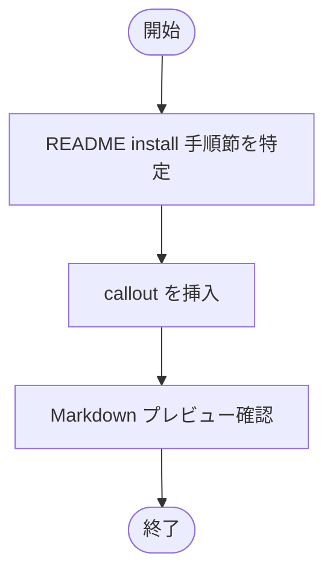

# 設計書: README に shallow clone 注意書きを追加

**プロジェクト名**: Mac Health Keeper / README shallow clone 注意書き
**作成日**: 2026 年 05 月 29 日
**最終更新**: 2026 年 05 月 29 日

---

## 1. 設計概要

### 1.1 設計方針

最小差分で README の install 手順節に **callout 形式（`> **注意**: ...`）または箇条書き**で 1〜2 行追記する。文言は「shallow clone 不可、または `git fetch --tags --unshallow` 必要」の趣旨。

### 1.2 設計原則（本プロジェクトで適用するもの）

- **単一責務**: 本 issue は README 数行追加のみ。他ファイルへの影響を作らない。
- **AI フレンドリー設計**: 注意書きの根拠（`scripts/lib/version_stamp.sh` / A 案 issue）を参照リンクで明示。

---

## 2. アーキテクチャ設計

### 2.1 責務・境界・参照関係

#### 2.1.1 責務一覧

| コンポーネント | 責務（1 文） |
|---|---|
| `README.md`（リポジトリ直下） | 公式 install 手順の正本。本 issue で注意書きを追記 |
| `scripts/lib/shallow_clone_guard.sh`（**新規**） | shallow clone を検出し警告 + 推奨手順表示、`MACHEALTH_AUTO_UNSHALLOW=1` で自動回復する純シェル関数群 |
| `install.sh` | 既存のインストール処理を維持しつつ、swiftc ビルド直前で `shallow_clone_guard.sh` を 1 行呼ぶ |
| `scripts/test/shallow_clone_guard_test.sh`（**新規**） | shallow_clone_guard.sh の BDD 単体テスト（12 件以上の assertion） |

#### 2.1.2 境界

- **入力**: `scripts/lib/shallow_clone_guard.sh` は `$1=repo_dir` と環境変数 `MACHEALTH_AUTO_UNSHALLOW`
- **出力**: stderr への警告 1〜数行、stdout は基本静か、終了コードは検出に成功した限り常に 0（ビルドを止めない）
- **他責務との境界**:
  - `version_stamp.sh` は **無変更**（fallback `0.0.0-DEV` 維持）
  - `git describe` 失敗時の挙動そのものは変えず、**事前に shallow 状態を可視化**する責務に閉じる

#### 2.1.3 参照関係

- `install.sh` → `scripts/lib/shallow_clone_guard.sh`（既存の `version_stamp.sh` 呼び出しと同じパターン）
- `scripts/test/shallow_clone_guard_test.sh` → `scripts/lib/shallow_clone_guard.sh`
- README から本機能の存在と環境変数を案内

### 2.2 システムアーキテクチャ

- 該当なし（doc のみ）

### 2.3 コンポーネント構成

- `README.md` 内の install 手順節（既存節を維持しつつ注意書きを挿入）

### 2.4 データフロー

- 該当なし

---

## 3. 機能設計

### 3.1 機能 1: README 注意書き追記

#### 3.1.1 概要

install 手順節の冒頭に callout を 1 つ追加。文案例:

```markdown
> **注意**: `git clone --depth=1` での shallow clone は `CFBundleVersion` の自動 stamp が `0.0.0-DEV` の fallback 値になります。shallow clone を使用する場合は、`./install.sh` 実行前に `git fetch --tags --unshallow` を実行してください。`install.sh` は実行時に shallow clone を自動検出して警告します。環境変数 `MACHEALTH_AUTO_UNSHALLOW=1` を指定すると、検出時に `git fetch --tags --unshallow` を自動で実行します。
```

### 3.2 機能 2: `scripts/lib/shallow_clone_guard.sh`（新規）

#### 3.2.1 概要

shallow clone を構造的に検出し、警告 + 推奨手順表示 + 自動回復オプションを提供する純シェル関数群。`install.sh` の swiftc ビルド直前で呼ぶことで、`version_stamp.sh` の fallback に陥る前にユーザーに警告できる。

#### 3.2.2 API（関数仕様）

| 関数 | 入力 | 出力 | 戻り値 |
|---|---|---|---|
| `is_shallow_clone <repo_dir>` | repo_dir（絶対 or 相対パス） | なし | 0=shallow / 1=非 shallow / 2=非 git |
| `warn_shallow_clone <repo_dir>` | repo_dir | stderr に警告 + 推奨手順（3〜5 行） | 常に 0 |
| `auto_unshallow_if_requested <repo_dir>` | repo_dir + 環境変数 `MACHEALTH_AUTO_UNSHALLOW` | stderr にログ | 0=回復成功 or 不要 / 1=fetch 失敗 |

スクリプトを直接実行（`bash shallow_clone_guard.sh <repo_dir>`）したときは、上記 3 関数を順に呼ぶ「main」フローとして動作する：
- 非 git: スキップログを stderr に出して exit 0
- shallow + `MACHEALTH_AUTO_UNSHALLOW=1`: auto unshallow を実行し、成功すれば warn 不要として exit 0
- shallow + 環境変数なし: warn して exit 0
- 非 shallow: 静かに exit 0

#### 3.2.3 shallow 判定ロジック

優先順:
1. `.git/shallow` ファイルが存在する → shallow
2. `git -C "$repo_dir" rev-parse --is-shallow-repository 2>/dev/null` の出力が `true` → shallow
3. 上記いずれにも該当しない場合は非 shallow
4. `.git` が存在しないディレクトリは「非 git」として扱い、shallow 判定は false（戻り値 2）

#### 3.2.4 stderr 警告のフォーマット契約

shallow 検出時の警告は以下の固定文言（部分一致でテスト可能）。

```
[shallow_clone_guard] WARN: shallow clone detected at <repo_dir>
[shallow_clone_guard] WARN: CFBundleVersion may fall back to 0.0.0-DEV (git describe cannot find tags)
[shallow_clone_guard] hint: run `git fetch --tags --unshallow` before ./install.sh
[shallow_clone_guard] hint: or re-run with MACHEALTH_AUTO_UNSHALLOW=1 to auto-recover
```

auto unshallow 時:

```
[shallow_clone_guard] INFO: MACHEALTH_AUTO_UNSHALLOW=1, attempting `git fetch --tags --unshallow`
[shallow_clone_guard] INFO: auto unshallow succeeded (or: failed: <stderr>)
```

#### 3.2.5 エラーハンドリング

- `set -u` のみ（`-e` は呼び出し側を巻き込まないため避ける）。
- 引数欠落: usage を stderr に出して exit 2
- `git` コマンド不在: スキップログを出して exit 0（ビルドを止めない）
- `git fetch --unshallow` 失敗: stderr にエラー、exit 1（呼び出し側が判断）。`install.sh` 統合時は失敗を許容して継続する。

#### 3.1.2 処理フロー



#### 3.1.3 入力・出力

- 入力: README.md
- 出力: 注意書きが追記された README.md

#### 3.1.4 エラーハンドリング

- 該当なし

---

## 4. データ設計

- 該当なし

---

## 5. API 設計

- 該当なし

---

## 6. テスト戦略

### 6.1 対象ごとのテスト割り当て

| 対象 | 単体 | 結合/API | E2E | クリティカル観点 | バリデーション観点 | 未達理由/補足 |
|---|---|---|---|---|---|---|
| README diff | ○（grep） | × | ○（実機） | shallow / --unshallow / MACHEALTH_AUTO_UNSHALLOW の言及存在 | – | – |
| `shallow_clone_guard.sh` | ○（`scripts/test/shallow_clone_guard_test.sh`、12 件以上） | × | ○（実機 shallow clone） | UC3-S1/S2/S3、UC4-S1/S2 | 引数異常 / .git 不在 / `MACHEALTH_AUTO_UNSHALLOW` の真偽 | – |
| `install.sh` 統合 | △（既存 smoke）| × | ○（実機 install） | guard 呼び出しがビルドを止めないこと | 失敗時の許容（exit 0 維持） | – |

### 6.2 監査・レビューでの確認

- 04_review に次を必ず記載:
  - `grep -nE 'shallow|--unshallow|MACHEALTH_AUTO_UNSHALLOW' README.md` の出力
  - `bash scripts/test/shallow_clone_guard_test.sh` のサマリ（`X passed, 0 failed`）
  - 実機 shallow clone での `bash scripts/lib/shallow_clone_guard.sh "$repo"` の stderr
  - 実機 `MACHEALTH_AUTO_UNSHALLOW=1` 実行ログ

---

## 7. UI 設計

- 該当なし

---

## 8. セキュリティ設計

- 該当なし

---

## 9. 非機能要件への対応

- 該当なし

---

## 10. 参考資料

- [`01_要件定義.md`](./01_要件定義.md)
- [`.agents-project/受け入れ基準ルール.md`](../../.agents-project/受け入れ基準ルール.md)
- `README.md`

---

## 11. 前のステップ

- **前**: [`01_要件定義.md`](./01_要件定義.md)

---

## 12. 次のステップ

- **次**: [`03_実装計画.md`](./03_実装計画.md)
